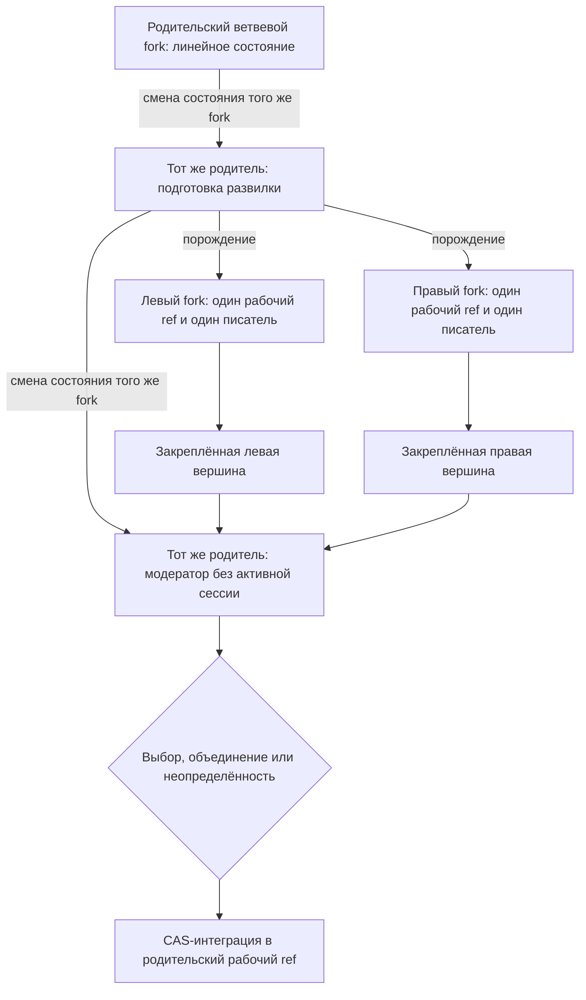
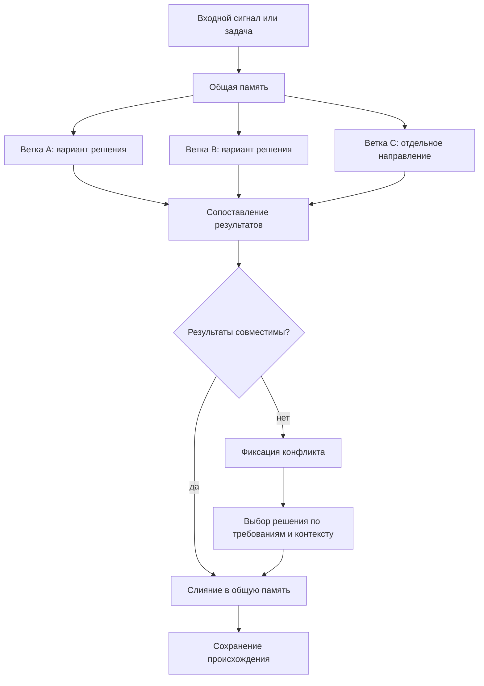

# Параллельная работа и слияние

Эксплуатационный статус: описанные ниже ветвевые fork, worktree-пул, FIFO, continuation, автоматические review/integration/CAS и публикация являются отложенной целевой архитектурой и историей прототипирования. Они не являются действующим маршрутом записи текущего репозитория; сейчас пользователь вручную запускает одну пишущую сессию в первичном checkout `refs/heads/master`.

## Требование

Проектируемый [FUM](../Глоссарий/FUM.md)-агент должен быть способен вести параллельную работу над задачами в разных [ветках](../Глоссарий/ветка-работы.md) и затем объединять результаты через слияние. Такая модель сближает работу агента с командной разработкой людей, где несколько направлений могут развиваться одновременно, а общее состояние проекта собирается через согласование результатов.

## Модель ветвления

[Ветка в FUM](../Глоссарий/ветка-работы.md) понимается как отдельная линия работы над задачей, гипотезой или набором изменений. Она должна сохранять собственный контекст, промежуточные решения, следы происхождения требований и результат работы. Несколько веток могут развиваться параллельно, не разрушая целостность общей [памяти](../Глоссарий/память-FUM.md) проекта.

Такая параллельность важна не только для ускорения работы. Она позволяет [FUM](../Глоссарий/FUM.md) удерживать несколько вариантов решения, сравнивать их, развивать независимые направления и возвращать их в общий контур мышления через управляемое слияние.

## Дерево ветвевых fork

Линейная ветка может перейти в отдельное состояние развилки и породить ровно два [ветвевых fork FUM](../Глоссарий/ветвевой-fork-FUM.md) от одного проверенного исходного состояния. Каждый ребёнок получает собственный полный рабочий ref, живой checkout, конечное назначение и не более одного допущенного пишущего владельца. Ожидающее обязательное продолжение, неактивная дочерняя задача и внешняя проверяющая задача без права записи не считаются активными владельцами. Один физический форк-репозиторий при этом может сохранять зеркальный `master` и служебные refs: формула «один fork — одна ветка» относится к одному логическому узлу и его авторитетной паре репозитория и рабочего ref, а не ко всему контейнеру репозитория.

В локальном профиле FUM-STEP-0148 логический ветвевой fork материализуется не GitHub-форком, а одним переиспользуемым linked worktree `Подузлы/слот-*`. Одновременно активные писатель, рецензент и интегратор занимают разные слоты. Worktree одного репозитория разделяют object database, Git common-dir и пространство refs; доверенная кооперативная граница запрещает менять чужие refs, тогда как физически раздельными остаются checkout, индекс, полный рабочий ref и branch-scoped FIFO. Долговечная форма отдельного fork-репозитория и submodule остаётся самостоятельным целевым профилем и не выводится из этой локальной материализации.

Родитель после активации детей прекращает линейную запись и сам становится сохраняемой ролью модератора; отдельный третий fork не появляется. Прежняя host-сессия не удерживает родительскую FIFO во время дочерней работы, а новая ограждённая сессия той же логической идентичности восстанавливает модерацию из паспорта после готовности результатов. Критерии сравнения закрепляются до их получения, а родитель выбирает левую или правую вершину, совместимое объединение, доработку в новом поколении, отклонение обоих либо неопределённость. Каждый ребёнок внутри себя по-прежнему движется обычной линейной цепочкой `commit+handoff` с одним продолжением на коммит.

Неизменяемые рёбра порождения образуют дерево fork: у него один корень, у каждого другого узла один родитель, одна состоявшаяся развилка родителя содержит ровно двух детей. Рёбра принятия и слияния учитываются отдельно: многородительский интеграционный коммит делает Git-историю DAG, не переписывая генеалогию узлов. Дочерние host-задачи сначала регистрируются как неактивные, а глобальный предактивационный барьер не допускает их в веточные FIFO до единого CAS-перехода пары. Подготовка нескольких host- и репозиторных состояний является сагой, а не одной Git-транзакцией: после неоднозначного создания продолжить её можно только от авторитетно доказанной прежней попытки либо через явное человеческое восстановление.

## Последовательность задач внутри ветки

Параллельность разных [веток работы](../Глоссарий/ветка-работы.md) не означает одновременное изменение одного checkout несколькими независимыми корневыми задачами. Обычная новая сессия начинает локальный маршрут в чистом основном checkout с точного закоммиченного снимка маршрутизации. Хэш снимка связывает OID целевой вершины и обязательных плановых источников, ревизию протокола пула, все активные линии с их полными refs, worktree и состоянием branch-scoped FIFO, а также перечень свободных слотов. Если любой из этих объектов или состояний успел измениться, прежний выбор не даёт полномочий и маршрут вычисляется заново.

Из одного снимка сессия явно выбирает ровно один из трёх режимов. `параллельная_линия` только после выбора лениво резервирует переиспользуемый слот `Подузлы/слот-*`, создаёт уникальный полный ref и назначение `self_line`; совместимые линии в разных слотах могут работать параллельно. `последовательное_продолжение` атомарно добавляет долговечный билет к уже активной линии и сохраняет за продолжением те же физический слот, полный ref и worktree. `только_чтение` не резервирует писательский слот и не создаёт билет владения.

Внутри `self_line` одновременно пишет ровно один владелец. Порядок продолжений задаётся возрастающим `seq` первого успешного compare-and-swap, а не настенными часами или моментом создания окна: общий host не предоставляет надёжной атомарной метки такого события. Переупорядочивание, уступка позиции и обход головы FIFO не поддерживаются. До коммита текущего владельца точное продолжение уже существует как ожидающий билет той же линии. Одна транзакция `commit+handoff` сверяет поколение, исходный `HEAD`, ref, FIFO и хэш намерения продолжения, создаёт один прямой коммит, передвигает ref линии и передаёт очередь её голове; неизменяемая квитанция делает точный повтор восстанавливаемым без второго коммита или второй передачи.

Новый владелец получает `reload_required`, перечитывает правила и материалы из фактической закоммиченной вершины, подтверждает точный новый OID и лишь затем получает новое поколение допуска. Read-only-восстановление потерянного ответа находит точное назначение, владельца, билет и маршрут, но само не создаёт слот и не двигает FIFO. Линия не может заморозить итоговый результат при ожидающем продолжении. Поэтому один слот обслуживает всю последовательную цепочку сессий линии и освобождается для иного назначения только после терминальной квитанции, остановки поздних писателей, отсутствия владельца и ожидающих билетов и проверки чистых checkout и индекса.

Обычная последовательная корневая работа в основном checkout сохраняет собственный контракт [обязательного продолжения ветки](../Глоссарий/обязательное-продолжение-ветки.md): заранее созданная задача входит в branch-scoped FIFO, а commit+handoff атомарно связывает новый `HEAD` с точным продолжением. Все принятые интеграции в локальный `master`, включая результаты параллельных линий, проходят через эту обычную FIFO и её compare-and-swap; слот-интегратор не обходит владельца основной ветки.

Законная no-op-задача — например, read-only проверка без замечаний либо продолжение, получившее от селектора `done` или `not_ready`, — использует терминальное чистое завершение без искусственного коммита. Перед любой передачей или терминализацией владелец дожидается всех процессов и агентов, способных позднее записать результат. Субагенты одной корневой задачи не являются отдельными билетами и не получают права самостоятельно менять индекс, refs или историю.

Каждый замороженный result-ref, в том числе заблокированный или пока несливаемый, остаётся достижимым отдельно от `master`. После проверки публикационной чистоты автоматический транспорт отправляет такой ref без force в уже настроенный remote того же репозитория и подтверждает точный OID readback-проверкой. Сетевая или аутентификационная ошибка оставляет локальный ref достижимым и даёт состояние `publication_pending`. Только принятый после автоматических ревью и интеграции объект может пройти обычную FIFO в локальный, а затем удалённый `master`; заблокированный результат туда не попадает. GitHub fork и pull request в маршруте FUM-STEP-0148 отсутствуют.

Целевой [пишущий подузел FUM](../Глоссарий/пишущий-подузел-FUM.md) является другим классом исполнителя, а не ослабленным режимом субагента. Его локальная линия получает точный `base_oid`, уникальную [ветку шага](../Глоссарий/ветка-шага-FUM.md), границу владения и устойчивую ссылку на [кандидатный коммит](../Глоссарий/кандидатный-коммит-FUM.md). Очередь одного checkout не координирует соседние worktree; параллельное производство разрешается на разных полных refs, а слот переиспользуется лишь после терминала всей линии.

Документальный эталонный прототип проверяет, что содержательные и терминальные команды пула вызваны с `repo-root`, который разрешается ровно в назначенный слот и совпадает с его `worktree_id`. Эта проверка доказывает дисциплину маршрута на уровне CLI, но не доказывает, что Codex Desktop перенёс или возобновил host-задачу в worktree, и не исключает автоматическое чтение основного checkout средой до первого инструментального вызова. Поэтому локальный профиль не называется нативной изоляцией: linked worktree разделяют object database, Git common-dir и refs, а граница остаётся кооперативной.

Над локальным профилем сохраняется отдельная долговечная архитектура [универсальных исполнительных подузлов FUM](../Глоссарий/универсальный-исполнительный-подузел-FUM.md). Самостоятельный дочерний fork действует в отдельном клоне, ведёт конечную цепочку через обычные продолжения своего живого checkout и регистрируется в композиционной сборке точным gitlink. Submodule остаётся detached-снимком, а не рабочим клоном; этот профиль не выводится из переиспользуемого локального слота и не заменяется им.

Ни ожидающий билет, ни владелец не истекают автоматически. Удаление исчезнувшего предшественника изменило бы строгий порядок, а захват поверх молчаливого владельца мог бы создать двух писателей. Та же корневая задача может возобновить свой билет или поколение; ожидающий вправе отменить только себя, а допущенный владелец обязан выполнить commit+handoff либо `finish-clean`. Неявного восстановления, TTL и захвата поверх потерянной задачи нет.

Корневой `./sbrositj.sh` остаётся отдельным человеческим break-glass для локальной FIFO и рабочей копии. Он требует точный текущий снимок и явное подтверждение человека, аннулирует прежние поколения и не останавливает процессы host. Этот маршрут не создаёт продолжение, не доказывает исход неоднозначного `create_thread` и не возобновляет снятый контур автозапуска; дальнейшую работу начинает отдельный явный пользовательский запрос.

Периодический heartbeat, постоянная задача [диспетчера автоматизаций FUM](../Глоссарий/диспетчер-автоматизаций-FUM.md), диспетчерские reservation/claim и восстановительные сообщения относятся только к исторической реализации. Они не участвуют в действующей координации ветки и не дают полномочий новой сессии.

## Выбор следующего шага ветки

Последовательный допуск отвечает на вопрос, когда checkout свободен, но не определяет, что именно делать дальше. Для развиваемой именованной ветки рабочий набор [следующего шага ветки](../Глоссарий/следующий-шаг-ветки.md) сохраняет доступные и отложенные актуальные [карточки шагов](../Глоссарий/карточка-шага.md), а локальная очередь разрешает исполнение готовой карточки без одновременной записи другой корневой задачи.

Общий пул карточек не является исполняемой очередью. Ветка получает один рабочий набор схемы `5` с точным полным ref и состоянием `open` или `done`. Открытый набор хранит конечный whitelist режимов `automatic`, `paused` и `blocked`; каждый кандидат закрепляет собственные `step_id`, `card_id`, хэш карточки и точные `requires_completed_card_ids`, а явная пауза или блокировка дополнительно называет условие возобновления. `automatic` означает допустимость для прямого продолжения, а не расписание.

После handoff созданная заранее задача-продолжение перечитывает новый `HEAD`, получает FIFO-допуск и непосредственно вызывает `branch-next-step.py show`. Селектор заново вычисляет готовность по literal-статусам зависимостей и возвращает не более одного детерминированного `ready`; прежний выбор через коммит не переносится. Явные `paused` и `blocked`, незавершённые зависимости и небезопасный payload не превращаются в работу по времени или свободному тексту.

Исход `ready` запускает один контекстно посильный шаг; его собственный коммит повторяет предварительное создание продолжения и commit+handoff. Исходы `done` и `not_ready` завершаются `finish-clean` без нового ребёнка. Одинаковый полный ref в разных репозиториях не означает одну ветку: самостоятельный проект получает собственные репозиторий, очередь и рабочий набор, а родительская [репозиторная композиция](../Глоссарий/репозиторная-композиция-FUM.md) хранит только точный gitlink проекта.

Снятый dispatcher/heartbeat-контур может оставаться в коде и истории для совместимости, но не вычисляет готовность, не резервирует запуск и не создаёт задачу. Существующая host-автоматизация прежнего контура должна оставаться остановленной.

## Схема ветвления и слияния

## Слияние результатов

Слияние должно быть осмысленным этапом работы, а не механическим объединением файлов. [FUM](../Глоссарий/FUM.md) должен сопоставлять изменения из разных веток, обнаруживать пересечения и противоречия, сохранять происхождение решений и формировать связное итоговое состояние.

Если результаты веток совместимы, агент должен объединять их в общую [память](../Глоссарий/память-FUM.md) проекта. Если между [ветками](../Глоссарий/ветка-работы.md) возникают содержательные конфликты, [FUM](../Глоссарий/FUM.md) должен фиксировать место конфликта, показывать варианты разрешения и выбирать решение на основании требований, контекста и при необходимости обратной связи пользователя.

Автоматическое разрешение допустимо только для заранее зарегистрированных детерминированных классов с полной повторной проверкой: непересекающегося чистого слияния, регенерации производных файлов, структурного объединения по устойчивым идентификаторам без противоречащих нормативных полей и продвижения gitlink к доказанному потомку. Расходящиеся gitlink объединяются сначала внутри дочернего репозитория. Неизвестный, смысловой, безопасностный, бинарный, rename/delete-конфликт или недоказанное изменение `.gitmodules` закрывает публикацию, сохраняет исходные коммиты и создаёт отдельный ограниченный пакет разрешения.

Локальный маршрут FUM-STEP-0148 автоматизирует независимые роли, а не отменяет смысловой барьер. Замороженный результат сначала получает отдельное агентское ревью. Затем отдельный агент-интегратор повторяет проверки и готовит точный CAS локального `master`. Если обнаружен конфликт, тот же владеющий интеграционным worktree агент разрешает его в разрешённой границе; любой подготовленный к интеграции итог после этого обязательно проходит повторное независимое агентское ревью. Только принятый неизменный объект может стать новой локальной вершиной `master`.

## Git как носитель эволюционных веток

В Git-инфраструктуре [ветка работы](../Глоссарий/ветка-работы.md) становится не только технической линией изменений, но и гипотезой, участвующей в отборе. Несколько веток или worktree могут развивать разные варианты ответа на один входной сигнал, затем [FUM](../Глоссарий/FUM.md) сравнивает их по качеству, стоимости, риску и проверкам, а успешный результат передаётся дальше как [наработка](../Глоссарий/наработка.md).

Слияние в этой модели означает подтверждённое выживание результата внутри [эволюционной цепочки FUM](../Глоссарий/эволюционная-цепочка-FUM.md). Длительность существования ветки сама по себе не должна считаться успехом: ветка считается жизнеспособной, если её результат прошёл внешний отбор, породил полезных потомков или был включён в общую [память](../Глоссарий/память-FUM.md). Общая эволюционная модель описана в [Git-инфраструктуре эволюционных цепочек FUM](20-Git-инфраструктура-эволюционных-цепочек-FUM.md), а отдельные fork-подузлы, проекты-submodule, изолированные клоны и двухфазная передача — в [репозиторном графе пишущих подузлов и проектов FUM](44-репозиторный-граф-пишущих-подузлов-и-проектов-FUM.md).

## Архитектурные следствия

- [FUM](../Глоссарий/FUM.md) должен поддерживать несколько одновременно активных линий работы.
- Текущая параллельность одной корневой задачи использует непересекающиеся области общего checkout без Git-операций субагентов; локальные пишущие подузлы используют отдельные worktree-слоты и полные refs, а долговечные самостоятельные подузлы — отдельные репозитории. Интеграция одной целевой ветки передаёт владение последовательно.
- Универсальный дочерний исполнитель может вести целую конечную цепочку, но каждый её пишущий переход остаётся отдельным контекстно посильным шагом с собственным commit, проверками и восстанавливаемой передачей.
- Один линейный fork может породить два дочерних узла только отдельным ограждённым переходом; тот же логический родитель становится модератором, а каждый ребёнок сохраняет ровно одну пару репозитория и рабочего ref и не более одной допущенной сессии-владельца.
- Общий профиль способностей дочернего узла не наследует полномочия родителя: рекурсивная делегация требует явных конечных границ глубины, числа параллельных детей, ресурсов, доступа и внешних эффектов.
- Каждая ветка с разрешённым [обязательным продолжением](../Глоссарий/обязательное-продолжение-ветки.md) должна иметь ровно один рабочий набор [следующих шагов](../Глоссарий/следующий-шаг-ветки.md), в котором допускаются несколько индивидуально готовых и несколько независимо отложенных кандидатов, а один победитель выбирается созданной заранее задачей только после handoff и перечитывания нового `HEAD`.
- Каждая линия работы должна иметь проверяемое происхождение: [исходные запросы](../Глоссарий/исходный-запрос.md), производные решения и итоговые изменения.
- Объединение веток должно сохранять связность [памяти](../Глоссарий/память-FUM.md) и не терять историю возникновения решений.
- Конфликты между [ветками](../Глоссарий/ветка-работы.md) должны рассматриваться как материал мышления, а не как чисто техническая ошибка.
- Модель командной разработки людей служит ориентиром для организации параллельной работы, проверки результатов и возвращения отдельных вкладов в общее состояние проекта.

## Источники требований

- [исходный запрос 2026-08-23 11:33:38 MSK — Вернуть ручную последовательную схему сессий](../Журнал/2026-08-23_11-33-38_MSK_вернуть-ручную-последовательную-схему-сессий/запрос.md)
- [исходный запрос 2026-08-13 18:17:47 MSK — Организовать параллельные сессии в локальных worktree-подузлах](../Журнал/2026-08-13_18-17-47_MSK_организовать-параллельные-сессии-в-изолированных-fork-подузлах/запрос.md)
- [FUM-REQ-0043 — Дерево ветвевых fork и родительская модерация](../Требования/🟡-дерево-ветвевых-fork-и-родительская-модерация.md)
- [исходный запрос 2026-08-12 03:09:35 MSK — Смоделировать ветвление FUM деревом форков](../Журнал/2026-08-12_03-09-35_MSK_смоделировать-ветвление-FUM-деревом-форков/запрос.md)
- [FUM-REQ-0042 — Обязательное продолжение Git-ветки после коммита](../Требования/✅-обязательное-продолжение-Git-ветки-после-коммита.md)
- [исходный запрос 2026-08-11 23:30:57 MSK — Заменить автозапуск обязательным продолжением ветки](../Журнал/2026-08-11_23-30-57_MSK_заменить-автозапуск-обязательным-продолжением-ветки/запрос.md)
- [FUM-REQ-0041 — Подтверждаемый ручной сброс FIFO к текущему HEAD](../Требования/✅-подтверждаемый-ручной-сброс-FIFO-к-текущему-HEAD.md)
- [исходный запрос 2026-08-10 10:19:59 MSK — Добавить простой сброс FIFO к текущему HEAD](../Журнал/2026-08-10_10-19-59_MSK_добавить-простой-сброс-FIFO-к-текущему-HEAD/запрос.md)
- [исходный запрос 2026-08-07 20:34:22 MSK — Добавить штатный сброс очереди](../Журнал/2026-08-07_20-34-22_MSK_добавить-штатный-сброс-очереди/запрос.md)
- [исходный запрос 2026-08-05 15:49:53 MSK — Управлять универсальными пишущими подузлами](../Журнал/2026-08-05_15-49-53_MSK_управлять-универсальными-пишущими-подузлами/запрос.md)
- [исходный запрос 2026-08-05 12:02:53 MSK — Перенести автозапуск шагов в универсальный диспетчер](../Журнал/2026-08-05_12-02-53_MSK_перенести-автозапуск-шагов-в-универсальный-диспетчер/запрос.md)
- [исходный запрос 2026-08-01 09:16:33 MSK — Исправить повторный автозапуск после отката](../Журнал/2026-08-01_09-16-33_MSK_исправить-повторный-автозапуск-после-отката/запрос.md)
- [исходный запрос 2026-07-31 16:31:18 MSK — Отключить автоматическую публикацию master](../Журнал/2026-07-31_16-31-18_MSK_отключить-автоматическую-публикацию-master/запрос.md)
- [исходный запрос 2026-07-29 09:04:03 MSK — Расширить динамический выбор следующего шага](../Журнал/2026-07-29_09-04-03_MSK_расширить-динамический-выбор-следующего-шага/запрос.md)
- [исходный запрос 2026-07-27 18:28:42 MSK — Выбирать следующий шаг при запуске с учётом истории коммитов](../Журнал/2026-07-27_18-28-42_MSK_выбирать-следующий-шаг-при-запуске-с-учётом-истории-коммитов/запрос.md)
- [исходный запрос 2026-07-27 15:21:35 MSK — Сделать диспетчер автоматизаций ветки универсальным](../Журнал/2026-07-27_15-21-35_MSK_сделать-диспетчер-автоматизаций-ветки-универсальным/запрос.md)
- [исходный запрос 2026-07-26 15:15:18 MSK - Публиковать работу в GitHub автоматически](../Журнал/2026-07-26_15-15-18_MSK_публиковать-работу-в-GitHub-автоматически/запрос.md)
- [исходный запрос 2026-07-22 14:53:29 MSK - Устранить холостые возвраты ожидания очереди](../Журнал/2026-07-22_14-53-29_MSK_устранить-холостые-возвраты-ожидания-очереди/запрос.md)
- [исходный запрос 2026-07-22 11:17:21 MSK - Увеличить ожидание очереди до пяти минут](../Журнал/2026-07-22_11-17-21_MSK_увеличить-ожидание-очереди-до-пяти-минут/запрос.md)
- [исходный запрос 2026-06-21 23:00:38 MSK](../Журнал/2026-06-21_23-00-38_MSK/запрос.md)
- [исходный запрос 2026-06-23 13:18:14 MSK](../Журнал/2026-06-23_13-18-14_MSK/запрос.md)
- [исходный запрос 2026-06-23 19:06:56 MSK](../Журнал/2026-06-23_19-06-56_MSK/запрос.md)
- [исходный запрос 2026-07-20 16:11:17 MSK - Сериализовать задачи в ветке](../Журнал/2026-07-20_16-11-17_MSK_сериализовать-задачи-в-ветке/запрос.md)
- [исходный запрос 2026-07-20 20:06:04 MSK - Запускать следующие шаги веток](../Журнал/2026-07-20_20-06-04_MSK_запускать-следующие-шаги-веток/запрос.md)
- [исходный запрос 2026-07-21 14:49:08 MSK - Закрыть пропуск веточного барьера](../Журнал/2026-07-21_14-49-08_MSK_закрыть-пропуск-веточного-барьера/запрос.md)
- [исходный запрос 2026-07-21 16:20:02 MSK - Разрешить работу субагентов через веточный барьер](../Журнал/2026-07-21_16-20-02_MSK_разрешить-работу-субагентов-через-веточный-барьер/запрос.md)
- [исходный запрос 2026-07-21 18:31:35 MSK — Ввести последовательную очередь сессий без hooks](../Журнал/2026-07-21_18-31-35_MSK_ввести-последовательную-очередь-сессий-без-hooks/запрос.md)
- [исходный запрос 2026-07-22 02:59:22 MSK - Декомпозировать предложения на карточки шагов](../Журнал/2026-07-22_02-59-22_MSK_декомпозировать-предложения-на-карточки-шагов/запрос.md)
- [исходный запрос 2026-07-22 03:38:35 MSK - Разрешить выполнение доступных карточек шагов](../Журнал/2026-07-22_03-38-35_MSK_разрешить-выполнение-доступных-карточек-шагов/запрос.md)
- [исходный запрос 2026-07-26 12:59:08 MSK — Спроектировать Git-граф пишущих субагентов и проектов](../Журнал/2026-07-26_12-59-08_MSK_спроектировать-Git-граф-пишущих-субагентов-и-проектов/запрос.md)

<!-- FUM-MD-RECENCY:BEGIN -->
<!-- last-content-edit: 2026-08-23 15:41:30 MSK -->
<!-- content-sha256: sha256:05bd53ae220efba4f18386cce4e1166ee2843404752f546cad6782bd9efc6895 -->
<!-- FUM-MD-RECENCY:END -->
