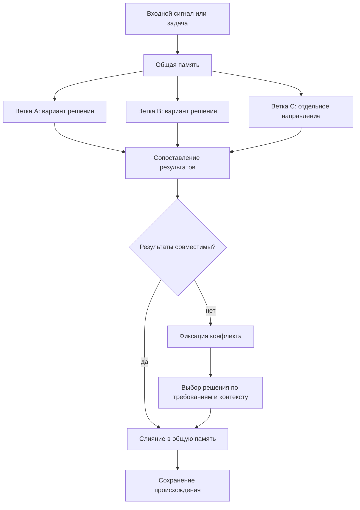

# Параллельная работа и слияние

## Требование

Проектируемый [FUM](../Глоссарий/FUM.md)-агент должен быть способен вести параллельную работу над задачами в разных [ветках](../Глоссарий/ветка-работы.md) и затем объединять результаты через слияние. Такая модель сближает работу агента с командной разработкой людей, где несколько направлений могут развиваться одновременно, а общее состояние проекта собирается через согласование результатов.

## Модель ветвления

[Ветка в FUM](../Глоссарий/ветка-работы.md) понимается как отдельная линия работы над задачей, гипотезой или набором изменений. Она должна сохранять собственный контекст, промежуточные решения, следы происхождения требований и результат работы. Несколько веток могут развиваться параллельно, не разрушая целостность общей [памяти](../Глоссарий/память-FUM.md) проекта.

Такая параллельность важна не только для ускорения работы. Она позволяет [FUM](../Глоссарий/FUM.md) удерживать несколько вариантов решения, сравнивать их, развивать независимые направления и возвращать их в общий контур мышления через управляемое слияние.

## Последовательность задач внутри ветки

Параллельность разных [веток работы](../Глоссарий/ветка-работы.md) не означает одновременное изменение одного checkout несколькими независимыми корневыми задачами. Несколько сессий могут быть запущены параллельно, но перед записью каждая атомарно регистрирует билет в общей FIFO-очереди. Единственный владелец изменяет память, а все более поздние сессии ждут завершения предшественников.

Порядок задаётся возрастающим `seq` первого успешного compare-and-swap, а не настенными часами или моментом создания окна: общий host не предоставляет надёжной атомарной метки такого события. Одна проверка чистоты рабочего дерева тоже недостаточна, потому что несколько задач могут одновременно увидеть чистый checkout. Служебная Git-ссылка и атомарное назначение `seq` превращают регистрацию в единый порядок. Переупорядочивание, приоритеты, уступка позиции и принудительный обход более раннего билета в текущей модели не поддерживаются.

Каждый билет запоминает проверенный `HEAD`. После атомарного коммита владельца передний ожидающий билет обнаруживает новую ревизию, перечитывает изменившиеся правила и материалы, подтверждает точный новый object ID и лишь затем может стать владельцем. Поэтому продолжительное ожидание не оставляет задачу работать по устаревшему снимку контракта, а возобновление того же уже допущенного корневого сеанса сохраняет его поколение владения. Долгоживущий `wait-until-actionable` продолжает read-only-наблюдение внутри одного процесса и сам не печатает промежуточный `waiting`; при поддержке среды продолжения процесса удерживаются внутри одного оркестрационного вызова и по возможности не превращаются в сообщения пользователю или возвраты модели. Команда завершается только при действенном состоянии, например `reload_required`, `admitted`, `dirty` или ошибке. Ограниченный пятиминутный `wait` остаётся совместимым запасным путём: его неизменный результат не требует отдельного содержательного сообщения, но сам служебный возврат и новый инструментальный ход могут занять контекст. Обязательные обновления и poll-события host имеют приоритет над репозиторной политикой.

Завершение задачи связано не с концом отдельного диалогового хода, а с проверяемой передачей. При осмысленном изменении владелец строит commit object из проверенного индекса, а одна Git-транзакция одновременно сравнивает и обновляет ref ветки и JSON-состояние очереди. Падение до транзакции не передаёт право следующей задаче; успешная транзакция фиксирует результат и убирает владельца вместе. Изменения вне корневой `.obsidian/` должны быть полностью staged либо отсутствовать, а состояние `.obsidian/` проходит отдельные правила классификации и публикации.

Законная no-op-задача — например, read-only проверка без замечаний или устаревший автоматический запуск до первой записи — использует отдельное `finish-clean`. Оно требует точного поколения, неизменного `HEAD`, чистоты вне `.obsidian/` и отсутствия любых staged-изменений, затем одной транзакцией проверяет ref ветки и снимает владельца без коммита. Это отмена пустой работы, а не обход или изменение порядка. До любой передачи корень дожидается всех потенциальных поздних писателей и после успеха больше не записывает.

Субагенты не являются отдельными билетами. Они могут параллельно исполнять непересекающиеся части уже допущенной корневой задачи и синхронизировать выводы штатными сообщениями, но не меняют ветки, индекс и историю. Корневой исполнитель собирает общий diff и перед передачей очереди дожидается всех процессов и субагентов, способных позднее записать результат. Чистота Git сама по себе не доказывает отсутствие уже запущенного отложенного писателя.

Текущее локальное воплощение хранит канонический JSON blob под ref, привязанным к физическому worktree, и использует обычные `hash-object`, `update-ref`, `write-tree` и `commit-tree`. Оно не зависит от project hooks, POSIX-блокировок, hard links или сигналов и работает с SHA-1 и SHA-256 object ID. Штатный Python HEAD-bootstrap запускается в isolated mode, исключает checkout из пути импорта, очищает унаследованные Git-перенаправления, ограничивает загрузку 30 секундами, читает сценарий из буквального закоммиченного `HEAD` и закрепляет корень checkout последним аргументом; внутренние Git-вызовы также не учитывают replace-объекты, optional locks и перенаправляющие Git-переменные. Поэтому ожидающая сессия не исполняет незавершённую или локально подменённую копию автоматизации из общего diff. Кооперативная граница действует для задач одного checkout и общего Git-каталога, но не координирует отдельные клоны.

Ни ожидающий билет, ни владелец не истекают автоматически. Удаление исчезнувшего предшественника изменило бы строгий порядок, а захват поверх молчаливого владельца мог бы создать двух писателей. Та же корневая задача может возобновить свой билет или поколение; ожидающий вправе отменить только себя, а допущенный владелец обязан выполнить commit+handoff либо `finish-clean`. Потерянная задача поэтому безопасно останавливает очередь до собственного возобновления; принудительного восстановления нет.

## Выбор следующего шага ветки

Последовательный допуск отвечает на вопрос, когда checkout свободен, но не определяет, что именно делать дальше. Для автоматически развиваемой именованной ветки эти решения разделяются: рабочий набор [следующего шага ветки](../Глоссарий/следующий-шаг-ветки.md) сохраняет доступную и отложенные актуальные [карточки шагов](../Глоссарий/карточка-шага.md), а локальная очередь разрешает исполнение готовой карточки без одновременной записи другой корневой задачи.

Общий пул [карточек шагов](../Глоссарий/карточка-шага.md) не является исполняемой очередью. Ветка получает один рабочий набор схемы `3` с точным полным ref и состоянием `open` или `done`. Открытый набор содержит максимум один кандидат `ready` и может сохранять несколько `paused` и `blocked`; каждый кандидат закрепляет собственные `step_id`, `card_id` и хэш карточки, а отложенный кандидат дополнительно называет точное условие возобновления. Задача, критерии и источники остаются только в карточке.

Пауза или блокировка отдельной карточки не останавливает независимую готовую работу. После выполнения задача сохраняет остальные отложенные кандидаты, убирает выполненное поколение и выбирает новый `ready`, если существует безопасная актуальная карточка; открытый набор без готового кандидата допустим при наличии отложенных карточек, а `done` означает отсутствие кандидатов. Наследование рабочего набора `master` при создании новой ветки не делает его карточки шагами проекта: проектная ветка должна получить собственный паспорт в [каталоге проектов](../Проекты/README.md) и собственный набор.

Фоновый диспетчер учитывает более широкую занятость, чем локальная очередь. Если максимальный поддерживаемый recent-снимок Codex показывает хотя бы одну другую активную задачу, диспетчер не резервирует шаг, не ставит плановую работу в очередь и вообще не создаёт новую задачу. Только наблюдаемый простой и наличие кандидата `ready` разрешают атомарно зарезервировать его пару `branch_ref` и `step_id`, повторить проверку занятости и создать отдельную локальную задачу, которая затем проходит общую очередь. Отложенные кандидаты не резервируются и не закрывают готового. Список не сообщает свою полноту, а проверка и создание не образуют одной host-транзакции, поэтому условие остаётся лучшим доступным наблюдением текущей поверхности.

## Схема ветвления и слияния

## Слияние результатов

Слияние должно быть осмысленным этапом работы, а не механическим объединением файлов. [FUM](../Глоссарий/FUM.md) должен сопоставлять изменения из разных веток, обнаруживать пересечения и противоречия, сохранять происхождение решений и формировать связное итоговое состояние.

Если результаты веток совместимы, агент должен объединять их в общую [память](../Глоссарий/память-FUM.md) проекта. Если между [ветками](../Глоссарий/ветка-работы.md) возникают содержательные конфликты, [FUM](../Глоссарий/FUM.md) должен фиксировать место конфликта, показывать варианты разрешения и выбирать решение на основании требований, контекста и при необходимости обратной связи пользователя.

## Git как носитель эволюционных веток

В Git-инфраструктуре [ветка работы](../Глоссарий/ветка-работы.md) становится не только технической линией изменений, но и гипотезой, участвующей в отборе. Несколько веток или worktree могут развивать разные варианты ответа на один входной сигнал, затем [FUM](../Глоссарий/FUM.md) сравнивает их по качеству, стоимости, риску и проверкам, а успешный результат передаётся дальше как [наработка](../Глоссарий/наработка.md).

Слияние в этой модели означает подтверждённое выживание результата внутри [эволюционной цепочки FUM](../Глоссарий/эволюционная-цепочка-FUM.md). Длительность существования ветки сама по себе не должна считаться успехом: ветка считается жизнеспособной, если её результат прошёл внешний отбор, породил полезных потомков или был включён в общую [память](../Глоссарий/память-FUM.md). Подробная архитектура описана в документе [Git-инфраструктура эволюционных цепочек FUM](20-Git-инфраструктура-эволюционных-цепочек-FUM.md).

## Архитектурные следствия

- [FUM](../Глоссарий/FUM.md) должен поддерживать несколько одновременно активных линий работы.
- Параллельность реализуется между отдельными ветками и worktree; внутри одной ветки задачи должны передавать владение последовательно.
- Каждая автоматически развиваемая ветка должна иметь ровно один рабочий набор [следующих шагов](../Глоссарий/следующий-шаг-ветки.md), в котором допускается максимум один готовый и несколько независимо отложенных кандидатов.
- Каждая линия работы должна иметь проверяемое происхождение: [исходные запросы](../Глоссарий/исходный-запрос.md), производные решения и итоговые изменения.
- Объединение веток должно сохранять связность [памяти](../Глоссарий/память-FUM.md) и не терять историю возникновения решений.
- Конфликты между [ветками](../Глоссарий/ветка-работы.md) должны рассматриваться как материал мышления, а не как чисто техническая ошибка.
- Модель командной разработки людей служит ориентиром для организации параллельной работы, проверки результатов и возвращения отдельных вкладов в общее состояние проекта.

## Источники требований

- [исходный запрос 2026-07-22 14:53:29 MSK - Устранить холостые возвраты ожидания очереди](../Запросы/2026-07-22_14-53-29_MSK_устранить-холостые-возвраты-ожидания-очереди.md)
- [исходный запрос 2026-07-22 11:17:21 MSK - Увеличить ожидание очереди до пяти минут](../Запросы/2026-07-22_11-17-21_MSK_увеличить-ожидание-очереди-до-пяти-минут.md)
- [исходный запрос 2026-06-21 23:00:38 MSK](../Запросы/2026-06-21_23-00-38_MSK.md)
- [исходный запрос 2026-06-23 13:18:14 MSK](../Запросы/2026-06-23_13-18-14_MSK.md)
- [исходный запрос 2026-06-23 19:06:56 MSK](../Запросы/2026-06-23_19-06-56_MSK.md)
- [исходный запрос 2026-07-20 16:11:17 MSK - Сериализовать задачи в ветке](../Запросы/2026-07-20_16-11-17_MSK_сериализовать-задачи-в-ветке.md)
- [исходный запрос 2026-07-20 20:06:04 MSK - Запускать следующие шаги веток](../Запросы/2026-07-20_20-06-04_MSK_запускать-следующие-шаги-веток.md)
- [исходный запрос 2026-07-21 14:49:08 MSK - Закрыть пропуск веточного барьера](../Запросы/2026-07-21_14-49-08_MSK_закрыть-пропуск-веточного-барьера.md)
- [исходный запрос 2026-07-21 16:20:02 MSK - Разрешить работу субагентов через веточный барьер](../Запросы/2026-07-21_16-20-02_MSK_разрешить-работу-субагентов-через-веточный-барьер.md)
- [исходный запрос 2026-07-21 18:31:35 MSK — Ввести последовательную очередь сессий без hooks](../Запросы/2026-07-21_18-31-35_MSK_ввести-последовательную-очередь-сессий-без-hooks.md)
- [исходный запрос 2026-07-22 02:59:22 MSK - Декомпозировать предложения на карточки шагов](../Запросы/2026-07-22_02-59-22_MSK_декомпозировать-предложения-на-карточки-шагов.md)
- [исходный запрос 2026-07-22 03:38:35 MSK - Разрешить выполнение доступных карточек шагов](../Запросы/2026-07-22_03-38-35_MSK_разрешить-выполнение-доступных-карточек-шагов.md)

<!-- FUM-MD-RECENCY:BEGIN -->
<!-- last-content-edit: 2026-07-22 15:25:02 MSK -->
<!-- content-sha256: sha256:fc7fab2fb796d21d3692ca53f62d0ef97da047648890fef2e96c9e919c82d11f -->
<!-- FUM-MD-RECENCY:END -->
