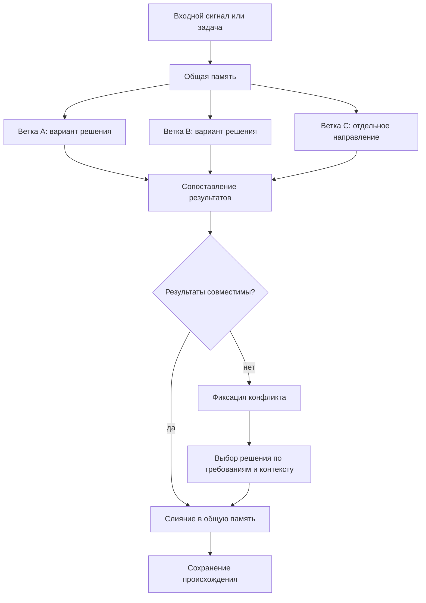

# Параллельная работа и слияние

Источники требований:

- [исходный запрос 2026-06-21 23:00:38 MSK](../Запросы/2026-06-21_23-00-38_MSK.md)
- [исходный запрос 2026-06-23 13:18:14 MSK](../Запросы/2026-06-23_13-18-14_MSK.md)
- [исходный запрос 2026-06-23 19:06:56 MSK](../Запросы/2026-06-23_19-06-56_MSK.md)

## Требование

Проектируемый [FUM](../Глоссарий/FUM.md)-агент должен быть способен вести параллельную работу над задачами в разных [ветках](../Глоссарий/ветка-работы.md) и затем объединять результаты через слияние. Такая модель сближает работу агента с командной разработкой людей, где несколько направлений могут развиваться одновременно, а общее состояние проекта собирается через согласование результатов.

## Модель ветвления

[Ветка в FUM](../Глоссарий/ветка-работы.md) понимается как отдельная линия работы над задачей, гипотезой или набором изменений. Она должна сохранять собственный контекст, промежуточные решения, следы происхождения требований и результат работы. Несколько веток могут развиваться параллельно, не разрушая целостность общей [памяти](../Глоссарий/память-FUM.md) проекта.

Такая параллельность важна не только для ускорения работы. Она позволяет [FUM](../Глоссарий/FUM.md) удерживать несколько вариантов решения, сравнивать их, развивать независимые направления и возвращать их в общий контур мышления через управляемое слияние.

## Схема ветвления и слияния

## Слияние результатов

Слияние должно быть осмысленным этапом работы, а не механическим объединением файлов. [FUM](../Глоссарий/FUM.md) должен сопоставлять изменения из разных веток, обнаруживать пересечения и противоречия, сохранять происхождение решений и формировать связное итоговое состояние.

Если результаты веток совместимы, агент должен объединять их в общую [память](../Глоссарий/память-FUM.md) проекта. Если между [ветками](../Глоссарий/ветка-работы.md) возникают содержательные конфликты, [FUM](../Глоссарий/FUM.md) должен фиксировать место конфликта, показывать варианты разрешения и выбирать решение на основании требований, контекста и при необходимости обратной связи пользователя.

## Git как носитель эволюционных веток

В Git-инфраструктуре [ветка работы](../Глоссарий/ветка-работы.md) становится не только технической линией изменений, но и гипотезой, участвующей в отборе. Несколько веток или worktree могут развивать разные варианты ответа на один входной сигнал, затем [FUM](../Глоссарий/FUM.md) сравнивает их по качеству, стоимости, риску и проверкам, а успешный результат передается дальше как [наработка](../Глоссарий/наработка.md).

Слияние в этой модели означает подтвержденное выживание результата внутри [эволюционной цепочки FUM](../Глоссарий/эволюционная-цепочка-FUM.md). Длительность существования ветки сама по себе не должна считаться успехом: ветка считается жизнеспособной, если ее результат прошел внешний отбор, породил полезных потомков или был включен в общую [память](../Глоссарий/память-FUM.md). Подробная архитектура описана в документе [Git-инфраструктура эволюционных цепочек FUM](20-Git-инфраструктура-эволюционных-цепочек-FUM.md).

## Архитектурные следствия

- [FUM](../Глоссарий/FUM.md) должен поддерживать несколько одновременно активных линий работы.
- Каждая линия работы должна иметь проверяемое происхождение: [исходные запросы](../Глоссарий/исходный-запрос.md), производные решения и итоговые изменения.
- Объединение веток должно сохранять связность [памяти](../Глоссарий/память-FUM.md) и не терять историю возникновения решений.
- Конфликты между [ветками](../Глоссарий/ветка-работы.md) должны рассматриваться как материал мышления, а не как чисто техническая ошибка.
- Модель командной разработки людей служит ориентиром для организации параллельной работы, проверки результатов и возвращения отдельных вкладов в общее состояние проекта.
