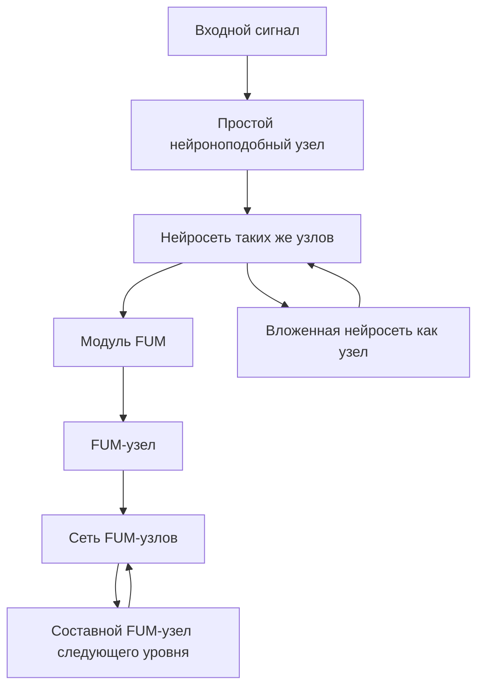
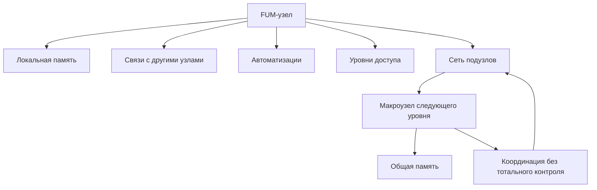

# [Модульная](../Глоссарий/модуль-FUM.md) архитектура [FUM](../Глоссарий/FUM.md)

Этот документ описывает [модульность](../Глоссарий/модуль-FUM.md) как один из центральных принципов [архитектуры FUM](../Глоссарий/архитектура-FUM.md). Сводная карта архитектурных слоёв находится в документе [Архитектура FUM](22-архитектура-FUM.md).

## Неокортекс как образец

Дополнительным образцом для [FUM](../Глоссарий/FUM.md) является устройство неокортекса: он рассматривается в проекте как система, построенная из повторяемых универсальных [модулей](../Глоссарий/модуль-FUM.md), которые способны объединяться в сеть из [модулей](../Глоссарий/модуль-FUM.md) того же рода.

Для [FUM](../Глоссарий/FUM.md) это означает, что базовая единица архитектуры не должна быть разовой специализированной деталью. Она должна проектироваться как повторяемый [узел](../Глоссарий/FUM-узел.md), который может хранить состояние, образовывать связи, участвовать в мышлении и становиться частью более крупной сети таких же узлов.

## Нейросетевая схема

[FUM](../Глоссарий/FUM.md) можно изображать как рекурсивную нейросеть. В такой схеме узел может быть простым нейроноподобным элементом, который принимает сигнал, меняет состояние и передаёт выход дальше, или сетью таких же узлов, рассматриваемой как один [FUM-узел](../Глоссарий/FUM-узел.md) следующего масштаба.

Эта модель не требует сводить [FUM](../Глоссарий/FUM.md) к биологической копии мозга или к классической искусственной нейросети. Она фиксирует архитектурную форму: минимальный элемент, [модуль](../Глоссарий/модуль-FUM.md), вложенная сеть и составной [FUM-узел](../Глоссарий/FUM-узел.md) должны быть совместимы по логике связей, [памяти](../Глоссарий/память-FUM.md), происхождения и передачи результатов.

В терминах [нейронной гиперсети FUM](../Глоссарий/нейронная-гиперсеть-FUM.md) эта рекурсия двунаправленна. Наружу [модуль](../Глоссарий/модуль-FUM.md) входит в сеть других узлов и участвует в обмене сигналами, [наработками](../Глоссарий/наработка.md) и результатами отбора. Внутрь он может предъявлять собственным [подузлам](../Глоссарий/подузел-FUM.md) память, [модельную среду](../Глоссарий/модельная-среда.md), автоматизации, ограничения и интерфейс, из которых складывается следующий уровень сети.

## [Контролируемая нейропластичность FUM](../Глоссарий/контролируемая-нейропластичность-FUM.md)

[Модули FUM](../Глоссарий/модуль-FUM.md) должны уметь возникать не только через ручное проектирование, но и как результат [потоковой самоструктуризации FUM](../Глоссарий/потоковая-самоструктуризация-FUM.md). Повторяющийся и полезный контекст сначала может быть статистическим узлом [суффиксно-предиктивной памяти](../Глоссарий/суффиксно-предиктивная-память-FUM.md), затем латентным символом или embedding, затем адаптером, экспертом, маршрутизатором, детектором аномалии или другим специализированным модулем.

Такой рост не должен быть хаотическим. Каждый новый модуль требует происхождения, критерия пользы, бюджета памяти и вычислений, проверки на удержанных данных или в sandbox, оценки риска и способа отката. Если модуль устаревает, дублирует соседние функции, ухудшает результат или нарушает ограничения доступа, он должен сжиматься, сливаться, замораживаться, удаляться или переноситься в архивный слой [памяти FUM](../Глоссарий/память-FUM.md).

## Архитектурное требование

- Базовый [модуль](../Глоссарий/модуль-FUM.md) [FUM](../Глоссарий/FUM.md) должен быть достаточно универсальным, чтобы применяться в разных местах системы без потери общей логики.
- [Модули](../Глоссарий/модуль-FUM.md) должны уметь соединяться друг с другом и образовывать сеть, в которой связи между [модулями](../Глоссарий/модуль-FUM.md) становятся частью [памяти](../Глоссарий/память-FUM.md) и мышления.
- Более крупные структуры [FUM](../Глоссарий/FUM.md) должны собираться из тех же принципов, что и малые узлы: повторение, связь, специализация через контекст и включение в общую сеть.
- Архитектурная пластичность должна быть контролируемой: новые [модули](../Глоссарий/модуль-FUM.md) создаются, усиливаются, сливаются и удаляются через проверяемые критерии предсказательной пользы, сжатия, действия, безопасности, стоимости и происхождения.
- [Фрактальность](../Глоссарий/фрактальный-узел-мышления.md) [FUM](../Глоссарий/FUM.md) должна выражаться не только в образе проекта, но и в архитектуре: узел может быть простым нейроноподобным элементом, простой функцией, агентом, workflow или вложенной сетью, а сеть может становиться узлом следующего уровня.
- [Нейронная гиперсеть FUM](../Глоссарий/нейронная-гиперсеть-FUM.md) должна поддерживать обе стороны рекурсии: включение узла во внешнюю сеть и разворачивание внутренней сети подузлов.
- [Децентрализация FUM](../Глоссарий/децентрализация-FUM.md) должна быть встроена в саму [модульную](../Глоссарий/модуль-FUM.md) архитектуру: сеть узлов не должна превращаться в иерархию, где один уровень обладает тотальной властью над всеми [подузлами](../Глоссарий/подузел-FUM.md).

## Интерфейсный фокус узла

Модульность должна описывать не только, из каких частей состоит [FUM-узел](../Глоссарий/FUM-узел.md), но и какой [интерфейс FUM-узла](../Глоссарий/интерфейс-FUM-узла.md) делает эти части наблюдаемыми и совместимыми. Один и тот же узел может быть малым нейроноподобным элементом, локальным агентом, сервисным адаптером или составной сетью, но в каждом случае нужно различать внутренний и внешний интерфейс.

Внутренний интерфейс показывает узлу его локальную [память](../Глоссарий/память-FUM.md), состояния, подузлы, связи, автоматизации и ограничения. Внешний интерфейс показывает другим узлам, человеку и сервисам, какие сигналы узел принимает, какие результаты возвращает, какие [наработки](../Глоссарий/наработка.md) может экспортировать и какие действия требуют подтверждения. Без этой пары фрактальность остаётся метафорой: сеть может выглядеть как узел, но не иметь проверяемого способа взаимодействия с внутренними и внешними слоями.

## Схема [модульной архитектуры](../Глоссарий/модуль-FUM.md)

## [Автоматизации](../Глоссарий/автоматизация-FUM.md) как модульные структуры

Устойчивые [автоматизации FUM](../Глоссарий/автоматизация-FUM.md) должны проектироваться как проверяемые элементы [модульной](../Глоссарий/модуль-FUM.md) архитектуры. Если автоматизация выполняет восприятие, действие, визуализацию, проверку, выбор перехода или преобразование [памяти](../Глоссарий/память-FUM.md), она должна иметь явное место в сети узлов и восстановимое описание своего поведения.

[Автоматический орган восприятия FUM](../Глоссарий/автоматический-орган-восприятия-FUM.md) является такой модульной структурой на границе среды и [памяти](../Глоссарий/память-FUM.md). Его архитектурная задача - быстро превращать широкий внешний поток в компактное описание, которое можно полностью сохранить и передать на обработку LLM внутри [FUM](../Глоссарий/FUM.md), не смешивая это описание с самим несжатым потоком.

[Автоматический орган действия FUM](../Глоссарий/автоматический-орган-действия-FUM.md) является симметричной модульной структурой на границе намерения и исполнения. Его архитектурная задача - разворачивать высокоуровневое описание действия, созданное LLM или другим механизмом, в низкоуровневые команды исполнительных механизмов в физической либо программной среде.

Для таких структур предпочтителен паттерн [чистой функции](../Глоссарий/чистая-функция.md): чистое вычислительное ядро отделяется от оболочек ввода-вывода, инструментов, интерфейса и физического воздействия. Это помогает заменять и переносить [модули](../Глоссарий/модуль-FUM.md), проверять их на контрольных входах и превращать удачные автоматизации в [наработки](../Глоссарий/наработка.md).

[Язык автоматизаций FUM](../Глоссарий/язык-автоматизаций-FUM.md) должен стать одним из способов делать такие модули переносимыми. Если автоматизация описана на языке с явными входами, выходами, эффектами, проверками и трассами, LLM может менять её как ограниченный модуль, а другой [FUM-узел](../Глоссарий/FUM-узел.md) может принять её как [наработку](../Глоссарий/наработка.md) без необходимости доверять скрытому состоянию исходного агента.

## [Децентрализация](../Глоссарий/децентрализация-FUM.md) узлов

[Модульная](../Глоссарий/модуль-FUM.md) архитектура должна поддерживать координацию без единственного центра полной власти. Если сеть становится [FUM-узлом](../Глоссарий/FUM-узел.md) следующего уровня, это не означает, что новый уровень получает право полностью читать, менять или присваивать внутреннюю область каждого [подузла](../Глоссарий/подузел-FUM.md).

Архитектурно это означает, что у узлов должны сохраняться локальные области [памяти](../Глоссарий/память-FUM.md), происхождение решений, отдельные [уровни доступа](../Глоссарий/уровень-доступа.md) и [границы власти](../Глоссарий/граница-власти-FUM.md). Составной узел может иметь протоколы согласования, аварийные ограничения и общие правила, но эти механизмы должны быть проверяемыми и не превращаться в скрытую тотальную власть.

Подробное требование описано в документе [Децентрализация FUM и границы власти](15-децентрализация-и-границы-власти.md). Практическая граница между допустимой координацией и недопустимым тотальным контролем зафиксирована как [открытый вопрос](../Вопросы/2026-06-22_07-51-48_MSK_границы-власти-узлов-FUM.md).

## Связь с [памятью](../Глоссарий/память-FUM.md) и мышлением

[Модульная](../Глоссарий/модуль-FUM.md) архитектура уточняет биологическую модель [памяти FUM](../Глоссарий/память-FUM.md). Если [память](../Глоссарий/память-FUM.md) развивается через наследование, изменчивость и отбор, то повторяемые [модули](../Глоссарий/модуль-FUM.md) дают материальную форму этому процессу: каждый [модуль](../Глоссарий/модуль-FUM.md) сохраняет часть состояния, допускает перестройку связей и участвует в закреплении удачных конфигураций.

Такой подход связывает [память](../Глоссарий/память-FUM.md), архитектуру и мышление в одну модель. [FUM](../Глоссарий/FUM.md) должен развиваться как сеть повторяемых узлов, где мышление возникает не из одного центрального хранилища, а из организованного взаимодействия [модулей](../Глоссарий/модуль-FUM.md).

## Аппаратная реализация узлов

[Модульная](../Глоссарий/модуль-FUM.md) архитектура [FUM](../Глоссарий/FUM.md) должна быть совместима не только с программными, но и с аппаратными реализациями. [Аппаратный FUM-узел](../Глоссарий/аппаратный-FUM-узел.md) рассматривается как физическое воплощение вычислительной, сенсорной, управляющей или исполнительной части [FUM](../Глоссарий/FUM.md), сохраняющее общую логику узла, связи, [памяти](../Глоссарий/память-FUM.md) и проверяемых [наработок](../Глоссарий/наработка.md).

Это означает, что [модуль](../Глоссарий/модуль-FUM.md) [FUM](../Глоссарий/FUM.md) должен иметь проектное описание, пригодное для разных носителей: программного процесса, документационного workflow, вычислительного устройства, роботизированного исполнителя или производственной линии. Переход к [физическому действию FUM](../Глоссарий/физическое-действие-FUM.md) требует явного различения цифровой модели, аппаратного проекта, прототипа, изготовленного устройства, испытания и эксплуатации.

[Роботизированные системы FUM](../Глоссарий/роботизированная-система-FUM.md) и [производственные цепочки FUM](../Глоссарий/производственная-цепочка-FUM.md) должны поэтому проектироваться как составные сети узлов, а не как внешние приложения к агенту. Подробное требование описано в документе [Физическое действие FUM и аппаратные узлы](13-физическое-действие-и-аппаратные-узлы.md); границы аппаратной автономии требуют уточнения и зафиксированы как [открытый вопрос](../Вопросы/2026-06-22_07-28-43_MSK_границы-аппаратной-автономии-FUM.md).

## Среды внутренних узлов

[Фрактальность FUM](../Глоссарий/фрактальный-узел-мышления.md) означает, что узел может не только входить в сеть, но и создавать внутреннюю среду для вложенных узлов того же рода. Такая среда становится архитектурной формой модели мира: [внутренние FUM](../Глоссарий/внутренний-FUM.md) могут представлять участников, роли, гипотезы, подсистемы или варианты будущих действий.

Архитектура должна поддерживать различие между внешним узлом, его внутренней моделью и [внутренним FUM](../Глоссарий/внутренний-FUM.md), действующим в [модельной среде](../Глоссарий/модельная-среда.md). Это различие особенно важно для описания актуального мира, реконструкции прошлого и планирования будущего: одна и та же [модульная](../Глоссарий/модуль-FUM.md) форма может использоваться в разных временных режимах, но с разными правилами уверенности и проверки.

Подробное требование описано в документе [Среда для внутренних FUM](11-среда-для-внутренних-FUM.md). Статус [внутренних FUM](../Глоссарий/внутренний-FUM.md) требует уточнения и зафиксирован как [открытый вопрос](../Вопросы/2026-06-22_06-35-26_MSK_статус-внутренних-FUM.md).

## [Виртуализованные среды](../Глоссарий/виртуализованная-среда-FUM.md) узлов

[Модульная](../Глоссарий/модуль-FUM.md) архитектура должна позволять узлу не только входить в сеть или создавать [модельную среду](../Глоссарий/модельная-среда.md), но и предъявлять своим [подузлам](../Глоссарий/подузел-FUM.md) организованный интерфейс поверх более сырого нижнего слоя. В таком режиме узел становится средовым слоем: он может превращать байтовый поток, сырой накопитель, файловую систему, сервисный API или модельное состояние в более удобную форму долговременной [памяти](../Глоссарий/память-FUM.md).

Это сохраняет фрактальность архитектуры в системном слое. Малый узел может получить уже организованную файловую систему или граф [памяти](../Глоссарий/память-FUM.md), а затем построить поверх них следующую [виртуализованную среду FUM](../Глоссарий/виртуализованная-среда-FUM.md) для своих вложенных узлов. При этом каждый слой должен сохранять происхождение, [уровни доступа](../Глоссарий/уровень-доступа.md), ограничения и проверяемую карту связи с нижним слоем. Подробное требование описано в документе [Виртуализованные среды FUM и долговременная память](23-виртуализованные-среды-и-долговременная-память.md).

## Модели соседних узлов

Если [FUM](../Глоссарий/FUM.md) развивается как сеть узлов, каждый узел должен уметь строить [внутренние модели других узлов](../Глоссарий/внутренняя-модель-другого-узла.md), с которыми он взаимодействует. В архитектуре это означает наличие представлений не только о собственном состоянии, но и о соседних участниках сети: их доступных интерфейсах, истории взаимодействия, известных ограничениях, совместимости [наработок](../Глоссарий/наработка.md) и уровне доверия.

Человек в такой архитектуре также рассматривается как [FUM-узел](../Глоссарий/FUM-узел.md). Модель человека должна быть частью взаимодействия, но не должна превращаться в утверждение о полном знании его [внутреннего состояния](../Глоссарий/внутреннее-состояние.md): [FUM](../Глоссарий/FUM.md) должен хранить различие между прямым сообщением, наблюдением, выводом и неизвестностью.

## Гибридные и социальные узлы

[Модульная](../Глоссарий/модуль-FUM.md) архитектура должна поддерживать не только отдельные [FUM](../Глоссарий/FUM.md)-агенты и их внутренние модели, но и [гибридные узлы](../Глоссарий/гибридный-узел.md) человек-[FUM](../Глоссарий/FUM.md). [Личный агент человека](../Глоссарий/личный-FUM-агент.md) должен уметь образовывать с ним устойчивую связку, которая может выступать как единая рабочая единица мышления и действия, сохраняя внутренние границы между человеком, агентом и общей областью [памяти](../Глоссарий/память-FUM.md).

Та же [фрактальная](../Глоссарий/фрактальный-узел-мышления.md) логика должна применяться к сетям таких связок. Несколько [гибридных узлов](../Глоссарий/гибридный-узел.md) могут образовывать узел следующего уровня: семью, команду, компанию, сообщество или иной цивилизационный элемент. Архитектура должна поэтому поддерживать составные узлы с участниками, ролями, протоколами согласования, общей [памятью](../Глоссарий/память-FUM.md), [уровнями доступа](../Глоссарий/уровень-доступа.md) и внешними интерфейсами.

Подробное требование описано в документе [Гибридные узлы и социальная фрактальность](12-гибридные-узлы-и-социальная-фрактальность.md).

## Передача между узлами

Если узлы [FUM](../Глоссарий/FUM.md) образуют сеть, они должны иметь возможность обмениваться устойчивыми [наработками](../Глоссарий/наработка.md). [Модуль](../Глоссарий/модуль-FUM.md), [паттерн](../Глоссарий/паттерн-памяти.md), workflow или проверка могут передаваться другому узлу только вместе с метаданными происхождения, совместимости и доступа. Иначе сеть получает фрагменты без контекста и теряет способность осмысленно наследовать результат.

[Модульная](../Глоссарий/модуль-FUM.md) архитектура должна поэтому предусматривать интерфейсы экспорта и импорта [наработок](../Глоссарий/наработка.md). Эти интерфейсы должны различать техническую совместимость и право передачи: [модуль](../Глоссарий/модуль-FUM.md) может быть пригоден для включения в сеть по форме, но недоступен для публикации или дальнейшего распространения по [уровню доступа](../Глоссарий/уровень-доступа.md).

## Эволюционные цепочки как модули

[Эволюционная цепочка FUM](../Глоссарий/эволюционная-цепочка-FUM.md) также может рассматриваться как модульная структура: она принимает входной сигнал, порождает варианты, проводит [двухконтурный отбор](../Глоссарий/двухконтурный-отбор-FUM.md), оформляет [передаваемые результаты](../Глоссарий/передаваемый-результат-FUM.md), направляет их следующим узлам и сохраняет происхождение. Если такая цепочка становится воспроизводимой, проверяемой и переносимой, она превращается в [наработку](../Глоссарий/наработка.md) и может использоваться как [модуль FUM](../Глоссарий/модуль-FUM.md) следующего уровня.

В Git-инфраструктуре эту роль выполняет связка веток, commits, pull requests, проверок, [реестра происхождения FUM](../Глоссарий/реестр-происхождения-FUM.md), [весов агентов](../Глоссарий/вес-агента-FUM.md), [весов связей](../Глоссарий/вес-связи-FUM.md) и маршрутов передачи между узлами. Подробное требование описано в документе [Git-инфраструктура эволюционных цепочек FUM](20-Git-инфраструктура-эволюционных-цепочек-FUM.md).

## Источники требований

- [исходный запрос 2026-06-22 05:39:36 MSK](../Запросы/2026-06-22_05-39-36_MSK.md)
- [исходный запрос 2026-06-22 06:17:48 MSK](../Запросы/2026-06-22_06-17-48_MSK.md)
- [исходный запрос 2026-06-22 06:22:15 MSK](../Запросы/2026-06-22_06-22-15_MSK.md)
- [исходный запрос 2026-06-22 06:35:26 MSK](../Запросы/2026-06-22_06-35-26_MSK.md)
- [исходный запрос 2026-06-22 06:40:09 MSK](../Запросы/2026-06-22_06-40-09_MSK.md)
- [исходный запрос 2026-06-22 07:28:43 MSK](../Запросы/2026-06-22_07-28-43_MSK.md)
- [исходный запрос 2026-06-22 07:51:48 MSK](../Запросы/2026-06-22_07-51-48_MSK.md)
- [исходный запрос 2026-06-22 08:58:31 MSK](../Запросы/2026-06-22_08-58-31_MSK.md)
- [исходный запрос 2026-06-22 09:05:49 MSK](../Запросы/2026-06-22_09-05-49_MSK.md)
- [исходный запрос 2026-06-22 09:11:47 MSK](../Запросы/2026-06-22_09-11-47_MSK.md)
- [исходный запрос 2026-06-23 13:18:14 MSK](../Запросы/2026-06-23_13-18-14_MSK.md)
- [исходный запрос 2026-06-23 18:24:05 MSK](../Запросы/2026-06-23_18-24-05_MSK.md)
- [исходный запрос 2026-06-23 19:06:56 MSK](../Запросы/2026-06-23_19-06-56_MSK.md)
- [исходный запрос 2026-06-24 15:08:46 MSK](../Запросы/2026-06-24_15-08-46_MSK.md)
- [исходный запрос 2026-06-24 15:35:16 MSK](../Запросы/2026-06-24_15-35-16_MSK.md)
- [исходный запрос 2026-06-24 16:09:34 MSK](../Запросы/2026-06-24_16-09-34_MSK.md)
- [исходный запрос 2026-06-25 18:50:18 MSK](../Запросы/2026-06-25_18-50-18_MSK.md)
- [исходный запрос 2026-06-26 09:55:41 MSK](../Запросы/2026-06-26_09-55-41_MSK.md)
- [исходный запрос 2026-06-26 11:05:03 MSK](../Запросы/2026-06-26_11-05-03_MSK.md)
- [исходный запрос 2026-07-06 10:05:34 MSK - Интегрировать содержимое ChatGPT диалога](../Запросы/2026-07-06_10-05-34_MSK_интегрировать-содержимое-chatgpt-диалога.md)

<!-- FUM-MD-RECENCY:BEGIN -->
<!-- last-content-edit: 2026-07-06 10:16:09 MSK -->
<!-- content-sha256: sha256:4dba24fe46f5183522cda1516ceb55b404a072bdd68093da61a3fb61c375eba5 -->
<!-- FUM-MD-RECENCY:END -->
