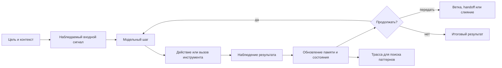

# Обзор актуальных реализаций [агентских циклов](../Глоссарий/агентский-цикл.md)

Обзор отражает состояние открытых и публично описанных реализаций по состоянию на 2026-06-22. Он не задаёт обязательный стек для [FUM](../Глоссарий/FUM.md), а фиксирует карту существующих подходов, чтобы проектировать собственный [агентский цикл](../Глоссарий/агентский-цикл.md) не в пустоте, а относительно уже сложившихся решений.

## Что считать [агентским циклом](../Глоссарий/агентский-цикл.md)

[Агентский цикл](../Глоссарий/агентский-цикл.md) - это повторяемый контур, в котором агент принимает цель и состояние, вызывает модель, выбирает действие, получает наблюдение из среды или инструмента, обновляет состояние и решает, продолжать ли работу, завершить её, передать другому агенту, запросить человека или перейти в другую [ветку](../Глоссарий/ветка-работы.md) процесса.

В простейшем виде цикл выглядит так:

- цель и контекст;
- [наблюдаемый входной сигнал](../Глоссарий/наблюдаемый-входной-сигнал.md): [исходный запрос](../Глоссарий/исходный-запрос.md), [навигация по памяти FUM](../Глоссарий/навигация-по-памяти-FUM.md), интерфейсное действие, событие среды или другой вход;
- шаг модели: рассуждение, планирование или выбор следующего действия;
- действие: вызов инструмента, обращение к внешней системе, запись файла, запрос к [памяти](../Глоссарий/память-FUM.md), передача другому агенту;
- наблюдение: результат действия, ошибка, сигнал среды, отзыв человека, тест или изменение [внутреннего состояния](../Глоссарий/внутреннее-состояние.md) [FUM](../Глоссарий/FUM.md);
- обновление [памяти](../Глоссарий/память-FUM.md) и рабочего состояния;
- проверка остановки, ветвления, повтора или слияния.

Для [FUM](../Глоссарий/FUM.md) каждый проход цикла должен оставлять след, пригодный для последующего анализа: какие наблюдения были получены, какие действия выбраны, какие [внутренние состояния](../Глоссарий/внутреннее-состояние.md) изменились, в каком порядке они повторялись и к какому результату привели. Поэтому [агентский цикл](../Глоссарий/агентский-цикл.md) является не только механизмом исполнения, но и источником материала для формирования устойчивых [паттернов](../Глоссарий/паттерн-памяти.md) наблюдения и действий.

[Агентский цикл](../Глоссарий/агентский-цикл.md) [FUM](../Глоссарий/FUM.md) должен быть практическим воплощением [обобщённого дарвиновского алгоритма](../Глоссарий/обобщённый-дарвиновский-алгоритм.md): агент порождает не только финальный ответ, но и цепочку рассуждений, решений, действий, проверок и передач результата. Отбор должен учитывать способность агента поддерживать длинные цепочки только тогда, когда они остаются полезными и продуктивными: продвигают задачу, создают проверяемые [наработки](../Глоссарий/наработка.md), дают материал для последующих циклов и не требуют несоразмерной цены, риска или человеческого внимания. В трассе сохраняются наблюдаемые звенья такой цепочки, а не скрытые внутренние рассуждения модели.

Анализ таких следов должен опираться на [общий механизм поиска повторяющихся последовательностей](../Глоссарий/обобщённый-поиск-повторяющихся-последовательностей.md). Трасса [агентского цикла](../Глоссарий/агентский-цикл.md) является одним видом последовательности наряду с текстом, событиями, состояниями и [паттернами](../Глоссарий/паттерн-памяти.md) более высокого уровня.

Наблюдаемость [внутренних состояний](../Глоссарий/внутреннее-состояние.md) является обязательной частью цикла. Если интерфейс показывает пользователю значимую информацию, агент должен иметь канал, через который он может увидеть и обработать то же состояние. Подробно это требование описано в документе [Доступ к внутренним состояниям](07-доступ-к-внутренним-состояниям.md).

[Навигация по памяти FUM](../Глоссарий/навигация-по-памяти-FUM.md) должна попадать в трассу [агентского цикла](../Глоссарий/агентский-цикл.md) как [наблюдаемый входной сигнал](../Глоссарий/наблюдаемый-входной-сигнал.md). Для цикла важен сам переход по [памяти](../Глоссарий/память-FUM.md): откуда пользователь или агент пришел, куда перешел, что искал, какой фрагмент выбрал и каким каналом ввода это было сделано.

[Автоматические органы восприятия FUM](../Глоссарий/автоматический-орган-восприятия-FUM.md) располагаются перед шагом модели или рядом с ним: при внешнем событии они быстро сжимают широкий поток до компактного [наблюдаемого входного сигнала](../Глоссарий/наблюдаемый-входной-сигнал.md). После этого LLM внутри [FUM](../Глоссарий/FUM.md), локальная или внешняя, работает уже с формой, которую можно полностью запомнить и сопоставить с дальнейшими действиями цикла.

[Автоматические органы действия FUM](../Глоссарий/автоматический-орган-действия-FUM.md) располагаются после выбора или описания действия: они разворачивают высокоуровневый план в конкретные низкоуровневые действия исполнительных механизмов. Поэтому в цикле нужно различать описание действия, подготовленное LLM или другим механизмом, и фактические команды, отправленные физическому устройству, программному инструменту или интерфейсу.

В современных системах этот цикл редко остаётся одним линейным `while`. Он обрастает графом состояний, долговременной [памятью](../Глоссарий/память-FUM.md), правами доступа, песочницей, трассировкой, человеческими подтверждениями, оценками качества и внешними протоколами взаимодействия с инструментами и другими агентами.

Для [FUM](../Глоссарий/FUM.md) устойчивые части такого цикла должны оформляться как [автоматизации FUM](../Глоссарий/автоматизация-FUM.md): их исходные тексты, версии, конфигурации, история изменений и проверочные трассы входят в [память](../Глоссарий/память-FUM.md). Предпочтительный инженерный паттерн - выносить чистые преобразования в [чистые функции](../Глоссарий/чистая-функция.md), а вызовы инструментов, изменение файлов, интерфейсное отображение и физическое действие оставлять наблюдаемыми оболочками.

## Схема базового [агентского цикла](../Глоссарий/агентский-цикл.md)

## Базовый слой: ReAct и рефлексия

Классическим основанием большинства практических реализаций остаётся ReAct: чередование рассуждения и действия, где модель не только отвечает, но и вызывает инструменты, получает наблюдения и корректирует дальнейшие шаги. Важная идея ReAct для [FUM](../Глоссарий/FUM.md) состоит не в том, что внутренние рассуждения обязательно должны быть видимы, а в том, что действие и наблюдение образуют проверяемый ход работы.

Reflexion добавляет к этому внешний контур обучения без дообучения весов: агент анализирует обратную связь после попытки, сохраняет текстовую рефлексию в эпизодической [памяти](../Глоссарий/память-FUM.md) и использует её в следующих попытках. Для [FUM](../Глоссарий/FUM.md) это близко к требованию эволюционного мышления: результат цикла становится материалом для последующих циклов.

Источники: [ReAct](https://arxiv.org/abs/2210.03629), [Reflexion](https://arxiv.org/abs/2303.11366), [smolagents: multi-step agents](https://huggingface.co/docs/smolagents/en/conceptual_guides/react).

## OpenAI Agents SDK

OpenAI Agents SDK явно описывает [агентский цикл](../Глоссарий/агентский-цикл.md) как runtime-ядро: вызвать текущего агента, разобрать выход модели, выполнить вызовы инструментов, при handoff переключиться на другого специалиста, а при финальном ответе вернуть результат. Поверх этого строятся инструменты, handoff, approvals, streaming, состояние и наблюдаемость.

Характерная черта этого подхода - разделение между одним запуском агента и продолжением разговора. Состояние может жить в истории результата, в сессии приложения, в серверной Conversation API или через `previousResponseId`. Для [FUM](../Глоссарий/FUM.md) это показывает важную границу: агентский шаг и долговременная [память](../Глоссарий/память-FUM.md) не должны смешиваться в одну неразличимую строку контекста.

Источники: [Agents SDK](https://developers.openai.com/api/docs/guides/agents), [Running agents](https://developers.openai.com/api/docs/guides/agents/running-agents).

## LangGraph и LangChain agents

LangChain даёт готовые [агентские циклы](../Глоссарий/агентский-цикл.md) высокого уровня, а LangGraph выносит цикл в явный граф состояний. LangGraph позиционируется как низкоуровневый runtime для долгих, stateful-агентов: с durable execution, persistence, human-in-the-loop, streaming, [памятью](../Глоссарий/память-FUM.md) и трассировкой.

Значение LangGraph для [FUM](../Глоссарий/FUM.md) в том, что [агентский цикл](../Глоссарий/агентский-цикл.md) здесь становится не только последовательностью шагов, но и исполняемым графом. Это естественно соответствует идее [FUM](../Глоссарий/FUM.md) как сети узлов: узел может быть шагом, подграфом, агентом или [веткой](../Глоссарий/ветка-работы.md) работы, а переходы между ними становятся частью управляемого мышления.

Источники: [LangGraph overview](https://docs.langchain.com/oss/python/langgraph/overview), [LangGraph GitHub](https://github.com/langchain-ai/langgraph).

## Microsoft Agent Framework, AutoGen и Semantic Kernel

В экосистеме Microsoft актуальным центром стал Microsoft Agent Framework. Он объединяет линии AutoGen и Semantic Kernel: простые single-agent и multi-agent абстракции AutoGen, enterprise-возможности Semantic Kernel, session-based state management, middleware, telemetry, типизацию, graph-based workflows и сценарии human-in-the-loop.

В документации Microsoft проводится полезное различие: агент подходит для открытой или разговорной задачи с автономным использованием инструментов, а workflow - для процесса с явно заданными шагами и порядком исполнения. Для [FUM](../Глоссарий/FUM.md) это различие важно как проектный принцип: не всякую последовательность надо отдавать автономии модели; там, где процесс известен, его лучше выразить как проверяемый workflow.

AutoGen остаётся важным историческим и исследовательским источником [паттернов](../Глоссарий/паттерн-памяти.md) multi-agent conversation, но для новых систем в этой экосистеме ориентиром является Agent Framework.

Источники: [Microsoft Agent Framework overview](https://learn.microsoft.com/en-us/agent-framework/overview/), [Microsoft Agent Framework 1.0](https://devblogs.microsoft.com/agent-framework/microsoft-agent-framework-version-1-0/), [AutoGen](https://microsoft.github.io/autogen/stable//index.html).

## Google Agent Development Kit

Google ADK описывает agent development framework для сборки, отладки, оценки и развёртывания агентов. Подход строится от агентов и инструментов к multi-agent системам, workflow agents, graph workflows, динамической маршрутизации, evaluation и развёртыванию в Runtime, Cloud Run или Kubernetes.

Для [FUM](../Глоссарий/FUM.md) здесь важны два мотива: сочетание детерминированной логики с адаптивным рассуждением модели и включение оценки траекторий в саму инженерную практику. [Агентский цикл](../Глоссарий/агентский-цикл.md) становится не просто выполнением, а объектом проверки: можно оценивать не только финальный ответ, но и путь агента.

Источники: [Google ADK](https://adk.dev/), [Google Cloud ADK documentation](https://docs.cloud.google.com/gemini-enterprise-agent-platform/build/adk).

## CrewAI

CrewAI описывает систему через agents, tasks, crews и flows. Crew - это группа агентов, выполняющих набор задач по выбранному процессу: sequential, hierarchical или hybrid. Flows добавляют событийную оркестрацию: `start`, `listen`, маршрутизацию, управление состоянием, persistence, условия, циклы и ветвления.

Сила CrewAI - в прикладной организации ролей и бизнес-автоматизаций. В контексте [FUM](../Глоссарий/FUM.md) это показывает, что [агентский цикл](../Глоссарий/агентский-цикл.md) может быть представлен не как один универсальный исполнитель, а как социальная структура: роли, задачи, управляющий агент, процессы, callbacks и человеческие точки вмешательства.

Источники: [CrewAI documentation](https://docs.crewai.com/), [Crews](https://docs.crewai.com/en/concepts/crews), [Flows](https://docs.crewai.com/en/concepts/flows).

## LlamaIndex AgentWorkflow

LlamaIndex AgentWorkflow - это оркестратор для одного или нескольких агентов с инструментами, построенный поверх базовой системы Workflows. Он особенно значим в задачах, где [агентский цикл](../Глоссарий/агентский-цикл.md) связан с retrieval, документами, индексами и структурированным доступом к данным.

Для [FUM](../Глоссарий/FUM.md) этот подход полезен как пример связывания агента с [памятью](../Глоссарий/память-FUM.md) и источниками знания. [Агентский цикл](../Глоссарий/агентский-цикл.md) здесь должен не только вызывать инструменты, но и уметь работать с контекстом, который извлекается из внешней или внутренней [памяти](../Глоссарий/память-FUM.md).

Источники: [LlamaIndex AgentWorkflow Python](https://developers.llamaindex.ai/python/examples/agent/agent_workflow_basic/), [LlamaIndex Agent Workflows TypeScript](https://developers.llamaindex.ai/typescript/framework/modules/agents/agent_workflow/).

## smolagents

smolagents от Hugging Face ценен противоположным качеством: он сохраняет агентскую механику маленькой и читаемой. Все агенты основаны на `MultiStepAgent`, который реализует ReAct-подобный цикл: записать [память](../Глоссарий/память-FUM.md) в сообщения, вызвать модель, распарсить действие как JSON tool call или код, выполнить действие, записать результат в [память](../Глоссарий/память-FUM.md) и вызвать callbacks.

Для [FUM](../Глоссарий/FUM.md) это важное напоминание: базовый [агентский цикл](../Глоссарий/агентский-цикл.md) должен быть достаточно простым, чтобы его можно было понять, проверить и переписать. Сложность лучше добавлять как расширение узлов, [памяти](../Глоссарий/память-FUM.md), графа и среды, а не прятать в непрозрачном ядре.

Источники: [smolagents documentation](https://huggingface.co/docs/smolagents/en/index), [How do multi-step agents work?](https://huggingface.co/docs/smolagents/en/conceptual_guides/react).

## Инженерные агенты: SWE-agent, mini-SWE-agent и OpenHands

Отдельная актуальная линия - агенты для разработки программного обеспечения. SWE-agent и пришедший ему на смену mini-SWE-agent делают акцент на Agent-Computer Interface: агенту дают специальные команды и форматы обратной связи для навигации по репозиторию, редактирования файлов, запуска тестов и решения GitHub issues. OpenHands развивает похожую линию как SDK и платформу для software agents с инструментами для shell, файлов, браузера, MCP, планирования, сжатия контекста и работы в локальной или облачной среде.

Для [FUM](../Глоссарий/FUM.md) это наиболее близкая практическая область, потому что долгосрочная цель проекта - агент полного цикла разработки, способный участвовать в создании собственной следующей версии. Здесь [агентский цикл](../Глоссарий/агентский-цикл.md) замыкается не только на текстовом ответе, но и на реальном состоянии репозитория: изменение файлов, запуск проверок, диагностика ошибок, исправление, повторный запуск и фиксация результата.

Источники: [SWE-agent](https://github.com/swe-agent/swe-agent), [SWE-agent ACI](https://swe-agent.com/0.7/background/aci/), [OpenHands Software Agent SDK](https://docs.openhands.dev/sdk).

## AutoGPT и BabyAGI как исторически важный слой

AutoGPT и BabyAGI первыми популяризировали образ автономного агента, который получает цель, дробит её на задачи, выполняет их, создаёт новые задачи и переупорядочивает очередь. В 2026 году AutoGPT развивается скорее как платформа для непрерывных автоматизаций и визуального построения агентов, а BabyAGI остаётся исследовательской линией минимальных и самостроящихся агентов.

Для [FUM](../Глоссарий/FUM.md) этот слой важен не как прямой образец production-архитектуры, а как ранняя формулировка двух мотивов: непрерывный цикл задач и возможность агента изменять собственный набор функций.

Источники: [AutoGPT](https://github.com/Significant-Gravitas/AutoGPT), [BabyAGI](https://github.com/yoheinakajima/babyagi), [BabyAGI 3](https://github.com/yoheinakajima/babyagi3).

## Выводы для [FUM](../Глоссарий/FUM.md)

- Базовый цикл [FUM](../Глоссарий/FUM.md) должен быть явным: цель, состояние, модельный шаг, действие, наблюдение, обновление [памяти](../Глоссарий/память-FUM.md), решение о продолжении.
- Базовый цикл [FUM](../Глоссарий/FUM.md) должен быть местом отбора цепочек рассуждений и действий: ценность агента определяется тем, насколько длинные, полезные и продуктивные проверяемые цепочки он способен порождать без деградации качества, стоимости и безопасности.
- [Память](../Глоссарий/память-FUM.md) должна быть отделена от конкретного запуска: один run не равен всей истории агента.
- Графовая оркестрация лучше линейного цикла для долгих задач, ветвления, возврата, слияния и человеческого вмешательства.
- Внутри [FUM](../Глоссарий/FUM.md) должны сосуществовать агентские зоны автономии и workflow-зоны детерминированного процесса.
- Handoff, subagents и multi-agent collaboration надо проектировать как первичные механизмы, а не как поздние надстройки.
- Для задач разработки [FUM](../Глоссарий/FUM.md) нужен собственный Agent-Computer Interface: ограниченный, понятный и проверяемый набор способов читать, изменять, запускать и оценивать проект.
- Для задач разработки [FUM](../Глоссарий/FUM.md) должен поддерживать Git-инфраструктуру [эволюционных цепочек](../Глоссарий/эволюционная-цепочка-FUM.md): варианты в ветках, передачу отобранных результатов, внешний отбор через проверки и вычисление [весов агентов](../Глоссарий/вес-агента-FUM.md) через [реестр происхождения](../Глоссарий/реестр-происхождения-FUM.md).
- Наблюдаемость, трассировка, оценки траекторий и safety-гейты являются частью [агентского цикла](../Глоссарий/агентский-цикл.md), а не внешней административной обвязкой.
- [Внутренние состояния](../Глоссарий/внутреннее-состояние.md) [FUM](../Глоссарий/FUM.md), включая состояние пользовательского интерфейса, должны быть доступны агенту как наблюдения, а не оставаться только человечески видимой поверхностью.
- Устойчивые [автоматизации FUM](../Глоссарий/автоматизация-FUM.md), включая [устройства восприятия и действия](../Глоссарий/устройство-восприятия-и-действия-FUM.md) и визуализацию на дисплее, должны иметь исходные тексты, версионную историю и воспроизводимые проверки в [памяти](../Глоссарий/память-FUM.md).
- [Автоматические органы восприятия FUM](../Глоссарий/автоматический-орган-восприятия-FUM.md) должны сжимать широкие внешние потоки до компактных описаний до того, как эти описания попадут в долговременную [память](../Глоссарий/память-FUM.md) и LLM-обработку.
- [Автоматические органы действия FUM](../Глоссарий/автоматический-орган-действия-FUM.md) должны разворачивать высокоуровневые описания действий в низкоуровневые команды исполнителей, сохраняя связь между намерением, командой, средой исполнения и наблюдаемым результатом.
- [Навигация по памяти FUM](../Глоссарий/навигация-по-памяти-FUM.md) должна фиксироваться как [наблюдаемый входной сигнал](../Глоссарий/наблюдаемый-входной-сигнал.md), независимо от устройства и модальности ввода.
- [FUM](../Глоссарий/FUM.md) должен анализировать накопленные траектории шагов через [обобщённый поиск повторяющихся последовательностей](../Глоссарий/обобщённый-поиск-повторяющихся-последовательностей.md), пригодный для действий агента, событий, состояний, текста и [паттернов](../Глоссарий/паттерн-памяти.md) более высокого уровня.
- Эволюционная модель [FUM](../Глоссарий/FUM.md) требует внешнего контура рефлексии: результаты, ошибки, тесты и человеческие поправки должны возвращаться в [память](../Глоссарий/память-FUM.md) как материал следующего цикла.

## Рабочее определение для дальнейшего проектирования

Для [FUM](../Глоссарий/FUM.md) [агентский цикл](../Глоссарий/агентский-цикл.md) следует понимать как [фрактальный](../Глоссарий/фрактальный-узел-мышления.md) узел работы: малый цикл действия и наблюдения может входить в больший цикл задачи, тот - в [ветку](../Глоссарий/ветка-работы.md) разработки, [ветка](../Глоссарий/ветка-работы.md) - в процесс слияния, а вся сеть циклов - в долговременную [память](../Глоссарий/память-FUM.md) проекта. Поэтому проектируемый агент должен быть не только исполнителем запросов, но и системой, где циклы могут наследовать состояние, порождать варианты, проходить отбор и становиться частью следующего уровня мышления. Git-инфраструктура [эволюционных цепочек FUM](../Глоссарий/эволюционная-цепочка-FUM.md) фиксирует один практический способ сделать такую фрактальность исполняемой.

## Источники требований

- [исходный запрос 2026-06-22 05:42:59 MSK](../Запросы/2026-06-22_05-42-59_MSK.md)
- [исходный запрос 2026-06-22 05:54:37 MSK](../Запросы/2026-06-22_05-54-37_MSK.md)
- [исходный запрос 2026-06-22 05:59:05 MSK](../Запросы/2026-06-22_05-59-05_MSK.md)
- [исходный запрос 2026-06-22 06:08:01 MSK](../Запросы/2026-06-22_06-08-01_MSK.md)
- [исходный запрос 2026-06-22 07:20:42 MSK](../Запросы/2026-06-22_07-20-42_MSK.md)
- [исходный запрос 2026-06-22 08:58:31 MSK](../Запросы/2026-06-22_08-58-31_MSK.md)
- [исходный запрос 2026-06-22 09:05:49 MSK](../Запросы/2026-06-22_09-05-49_MSK.md)
- [исходный запрос 2026-06-22 09:11:47 MSK](../Запросы/2026-06-22_09-11-47_MSK.md)
- [исходный запрос 2026-06-23 13:18:14 MSK](../Запросы/2026-06-23_13-18-14_MSK.md)
- [исходный запрос 2026-06-23 19:06:56 MSK](../Запросы/2026-06-23_19-06-56_MSK.md)
- [исходный запрос 2026-06-24 16:22:00 MSK](../Запросы/2026-06-24_16-22-00_MSK.md)
