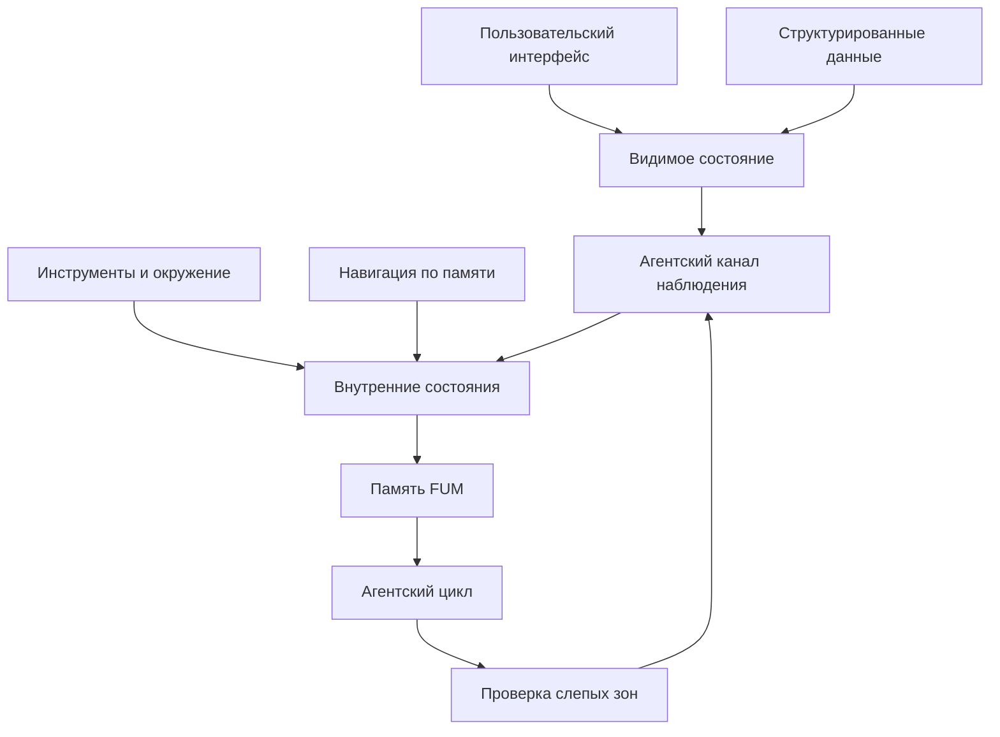

# Доступ к [внутренним состояниям](../Глоссарий/внутреннее-состояние.md)

Источники требований:

- [исходный запрос 2026-06-22 05:59:05 MSK](../Запросы/2026-06-22_05-59-05_MSK.md)
- [исходный запрос 2026-06-22 06:17:48 MSK](../Запросы/2026-06-22_06-17-48_MSK.md)
- [исходный запрос 2026-06-22 06:22:15 MSK](../Запросы/2026-06-22_06-22-15_MSK.md)
- [исходный запрос 2026-06-22 07:20:42 MSK](../Запросы/2026-06-22_07-20-42_MSK.md)
- [исходный запрос 2026-06-22 08:58:31 MSK](../Запросы/2026-06-22_08-58-31_MSK.md)
- [исходный запрос 2026-06-22 09:05:49 MSK](../Запросы/2026-06-22_09-05-49_MSK.md)
- [исходный запрос 2026-06-23 19:06:56 MSK](../Запросы/2026-06-23_19-06-56_MSK.md)

## Требование

[FUM](../Глоссарий/FUM.md) должен иметь доступ ко всем своим [внутренним состояниям](../Глоссарий/внутреннее-состояние.md) в форме, пригодной для наблюдения, анализа и последующей обработки. [Внутреннее состояние](../Глоссарий/внутреннее-состояние.md) не должно существовать только как неявный эффект работы системы или как информация, доступная человеку, но недоступная самому агенту.

Если что-то отображается в пользовательском интерфейсе, у [FUM](../Глоссарий/FUM.md) должна быть возможность увидеть и обработать эту информацию. Интерфейс пользователя является частью среды [FUM](../Глоссарий/FUM.md), а не внешним слепым пятном.

## Что считается [внутренним состоянием](../Глоссарий/внутреннее-состояние.md)

К [внутренним состояниям](../Глоссарий/внутреннее-состояние.md) относятся:

- текущие цели, задачи, планы и остановочные условия;
- рабочая [память](../Глоссарий/память-FUM.md), контекст диалога, активные [ветки](../Глоссарий/ветка-работы.md) и промежуточные результаты;
- состояние инструментов, окружения, файлов, запусков, ошибок и проверок;
- трассы [агентских циклов](../Глоссарий/агентский-цикл.md): наблюдения, действия, переходы, возвраты и слияния;
- [внутренние модели других FUM-узлов](../Глоссарий/внутренняя-модель-другого-узла.md), включая модели людей как участников взаимодействия;
- исходные тексты, конфигурации, версии и история изменений устойчивых [автоматизаций FUM](../Глоссарий/автоматизация-FUM.md);
- данные, из которых строится пользовательский интерфейс;
- визуальное и интерактивное состояние интерфейса, включая то, что уже показано пользователю;
- компактные описания, созданные [автоматическими органами восприятия FUM](../Глоссарий/автоматический-орган-восприятия-FUM.md);
- [наблюдаемые входные сигналы](../Глоссарий/наблюдаемый-входной-сигнал.md), включая [навигацию по памяти FUM](../Глоссарий/навигация-по-памяти-FUM.md), создание [исходных запросов](../Глоссарий/исходный-запрос.md) и события пользовательского ввода.

Этот список не является закрытым. Любой слой, влияющий на поведение [FUM](../Глоссарий/FUM.md) или видимый пользователю как состояние системы, должен рассматриваться как часть наблюдаемого [внутреннего состояния](../Глоссарий/внутреннее-состояние.md).

## Симметрия интерфейса

Для [FUM](../Глоссарий/FUM.md) действует принцип симметрии интерфейса: состояние, представленное человеку через пользовательский интерфейс, должно иметь агентский канал наблюдения. Предпочтительная форма такого канала - структурированные данные, из которых построен интерфейс. Если структурированного доступа недостаточно, агент должен иметь возможность получить визуальное представление, состояние элементов интерфейса, текст, разметку, события или другой машинно-обрабатываемый снимок.

Из этого следует, что в системе не должно быть только интерфейсных фактов: если интерфейс сообщает пользователю значимую информацию, эта информация должна быть доступна [FUM](../Глоссарий/FUM.md) для рассуждения, [памяти](../Глоссарий/память-FUM.md) и действия.

## Схема наблюдаемости состояния

## Визуализация на дисплее

Визуализация на дисплее рассматривается как [устройство восприятия и действия FUM](../Глоссарий/устройство-восприятия-и-действия-FUM.md): она показывает человеку состояние системы и одновременно влияет на следующий ход взаимодействия. Поэтому визуализационная [автоматизация](../Глоссарий/автоматизация-FUM.md) должна быть предсказуемой и воспроизводимой.

Видимое состояние должно выводиться из явных данных, версии правил отображения, конфигурации и контекста. Если экран показывает результат, который нельзя восстановить из [памяти](../Глоссарий/память-FUM.md) или агентски доступного снимка, [FUM](../Глоссарий/FUM.md) должен фиксировать это как потерю наблюдаемости, а не принимать интерфейс как самодостаточный источник истины.

## [Навигация по памяти FUM](../Глоссарий/навигация-по-памяти-FUM.md) как [наблюдаемый входной сигнал](../Глоссарий/наблюдаемый-входной-сигнал.md)

[Навигация по памяти FUM](../Глоссарий/навигация-по-памяти-FUM.md) должна наблюдаться [FUM](../Глоссарий/FUM.md) так же, как наблюдается создание [исходного запроса](../Глоссарий/исходный-запрос.md). Открытие документа, переход по ссылке, поиск, прокрутка, выбор фрагмента, переход назад или вперёд и смена видимой области [памяти](../Глоссарий/память-FUM.md) являются входными событиями, а не только побочным эффектом интерфейса.

Это требование не зависит от устройства и модальности ввода. Один и тот же смысловой переход должен становиться [наблюдаемым входным сигналом](../Глоссарий/наблюдаемый-входной-сигнал.md), если он выполнен клавиатурой, мышью, трекпадом, другим графическим устройством ввода, аудиовводом, жестом, автоматическим агентским действием или будущим каналом взаимодействия.

Запись такого сигнала должна по возможности сохранять тип события, исходный и целевой фрагмент [памяти](../Глоссарий/память-FUM.md), канал ввода, время, связанный интерфейсный контекст и связь с последующим [агентским циклом](../Глоссарий/агентский-цикл.md). Если полный сигнал недоступен, [FUM](../Глоссарий/FUM.md) должен фиксировать хотя бы факт ограниченной наблюдаемости и причину потери деталей.

## Автоматическое сжатие внешних потоков

При внешних событиях [FUM](../Глоссарий/FUM.md) может получать поток, который слишком широк для полного прямого запоминания или немедленной LLM-обработки. [Автоматический орган восприятия FUM](../Глоссарий/автоматический-орган-восприятия-FUM.md) должен превращать такой поток в лаконичное компактное описание, которое уже может быть полностью сохранено в [памяти](../Глоссарий/память-FUM.md) и обработано локальной или внешней LLM внутри [FUM](../Глоссарий/FUM.md).

Такое сжатие не должно становиться скрытой потерей наблюдаемости. Компактное описание должно хранить связь с исходным событием, каналом, временем, доступными метаданными, уровнем уверенности и известными ограничениями. Если исходный поток не сохраняется целиком, это должно быть явно видно в [памяти FUM](../Глоссарий/память-FUM.md).

## Связь с [памятью](../Глоссарий/память-FUM.md) и мышлением

Доступ к [внутренним состояниям](../Глоссарий/внутреннее-состояние.md) делает [память FUM](../Глоссарий/память-FUM.md) полноценной. Агент не может запоминать собственные шаги, выделять устойчивые [паттерны](../Глоссарий/паттерн-памяти.md) и исправлять ошибки, если часть его рабочего состояния остаётся для него невидимой.

Наблюдение в [агентском цикле](../Глоссарий/агентский-цикл.md) поэтому должно включать не только внешние ответы инструментов, но и изменения собственных состояний [FUM](../Глоссарий/FUM.md): что было показано, что изменилось в [памяти](../Глоссарий/память-FUM.md), какие [ветки](../Глоссарий/ветка-работы.md) активны, какие переходы произошли и где возникли расхождения между намерением, действием и отображенным результатом.

## [Границы доступа](../Глоссарий/уровень-доступа.md)

Доступ к [внутренним состояниям](../Глоссарий/внутреннее-состояние.md) означает прежде всего наблюдаемость и обрабатываемость. Он не равен безусловному праву изменять любой слой системы. Для опасных действий, секретов, прав доступа и приватных данных могут существовать отдельные режимы разрешений, редактирования, маскирования и подтверждения.

При этом даже ограничение должно быть явным: [FUM](../Глоссарий/FUM.md) должен знать, что состояние существует, какой у него [режим доступа](../Глоссарий/уровень-доступа.md) и почему оно недоступно полностью. Скрытая зона без метаданных рассматривается как архитектурный дефект.

[Внутренние модели других узлов](../Глоссарий/внутренняя-модель-другого-узла.md) являются особенно чувствительным [внутренним состоянием](../Глоссарий/внутреннее-состояние.md). [FUM](../Глоссарий/FUM.md) должен иметь доступ к ним для рассуждения и корректировки взаимодействия, но обязан отличать наблюдаемое, сообщенное, выведенное и неизвестное. Модель человека или другого узла не должна превращаться в неявный канал раскрытия приватных сведений.

## Доступ и передача [наработок](../Глоссарий/наработка.md)

Наблюдаемость [внутреннего состояния](../Глоссарий/внутреннее-состояние.md) не равна праву передавать это состояние другому узлу. [FUM](../Глоссарий/FUM.md) может иметь агентский доступ к данным для рассуждения и самокоррекции, но экспорт, публикация, заимствование и дальнейшая передача [наработок](../Глоссарий/наработка.md) должны подчиняться отдельным [уровням доступа](../Глоссарий/уровень-доступа.md).

Поэтому каждое состояние или производная [наработка](../Глоссарий/наработка.md), пригодная для обмена, должна иметь метаданные доступа: что можно читать, использовать, изменять, публиковать и передавать дальше. Если состояние приватно или ограничено, [FUM](../Глоссарий/FUM.md) должен уметь работать с разрешённой формой: например, с метаданными, обезличенным резюме или указанием на недоступность содержимого.

## Архитектурные следствия

- Система должна иметь реестр или граф [внутренних состояний](../Глоссарий/внутреннее-состояние.md), доступный для агентского наблюдения.
- Пользовательский интерфейс должен строиться так, чтобы значимые отображаемые данные можно было сопоставить с агентски доступным источником.
- [Агентский цикл](../Глоссарий/агентский-цикл.md) должен получать снимки или события изменений собственного состояния.
- [Навигация по памяти FUM](../Глоссарий/навигация-по-памяти-FUM.md) должна попадать в агентски доступную трассу как [наблюдаемый входной сигнал](../Глоссарий/наблюдаемый-входной-сигнал.md), а не только как итоговое состояние экрана.
- [Память](../Глоссарий/память-FUM.md) должна фиксировать не только внешние результаты, но и изменения [внутренних состояний](../Глоссарий/внутреннее-состояние.md), которые повлияли на решение.
- Исходные тексты и история изменений устойчивых [автоматизаций FUM](../Глоссарий/автоматизация-FUM.md) должны быть доступны как часть [внутреннего состояния](../Глоссарий/внутреннее-состояние.md) и [памяти](../Глоссарий/память-FUM.md).
- Проверки [FUM](../Глоссарий/FUM.md) должны выявлять слепые зоны: состояния, видимые пользователю или влияющие на поведение, но недоступные агенту.
- Экспортируемые состояния и [наработки](../Глоссарий/наработка.md) должны проходить проверку [уровня доступа](../Глоссарий/уровень-доступа.md) перед передачей другому узлу или публикацией.
- Модели других узлов должны храниться с происхождением сведений, уровнем уверенности и ограничениями дальнейшей передачи.
