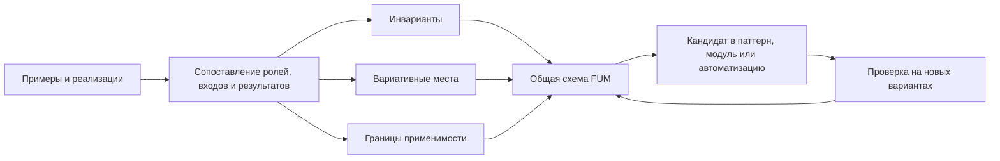
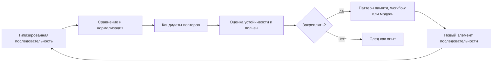

# [Обобщённый поиск повторяющихся последовательностей](../Глоссарий/обобщённый-поиск-повторяющихся-последовательностей.md)

## Назначение

В [FUM](../Глоссарий/FUM.md) должен быть предусмотрен [обобщённый алгоритм поиска повторяющихся последовательностей](../Глоссарий/обобщённый-поиск-повторяющихся-последовательностей.md). Его задача - находить повторяемость не в одном частном формате данных, а в любых рядах элементов, которые можно представить как последовательность: байтах, единицах текста, структурированных событиях, наблюдениях, действиях агента и уже выявленных [паттернах](../Глоссарий/паттерн-памяти.md) более высокого уровня.

Такой алгоритм связывает низкоуровневую обработку данных с [памятью](../Глоссарий/память-FUM.md) шагов [FUM](../Глоссарий/FUM.md). Последовательность действий агента рассматривается как один из частных случаев общей задачи, а не как отдельный специальный механизм.

## Единицы последовательности

Алгоритм должен работать с параметризуемой единицей последовательности. Такой единицей могут быть:

- байт или фрагмент бинарного потока;
- символ, кодовая точка, графемный кластер, токен или другой элемент текста;
- структурированное наблюдение, событие, состояние интерфейса или запись трассы;
- [наблюдаемый входной сигнал](../Глоссарий/наблюдаемый-входной-сигнал.md), включая [навигацию по памяти FUM](../Глоссарий/навигация-по-памяти-FUM.md), создание [исходного запроса](../Глоссарий/исходный-запрос.md) и события пользовательского ввода;
- действие агента, вызов инструмента, переход workflow или результат проверки;
- пример, проектный вариант или потенциальная реализация одного решения на другой программно-аппаратной базе;
- ранее найденная повторяющаяся последовательность, поднятая на уровень нового символа [памяти](../Глоссарий/память-FUM.md).

Из этого следует [фрактальное](../Глоссарий/фрактальный-узел-мышления.md) свойство: найденный [паттерн](../Глоссарий/паттерн-памяти.md) может стать элементом новой последовательности, где снова применяется тот же общий принцип поиска повторяемости.

## Архитектурное требование

Ядро поиска должно быть отделено от конкретного способа представления данных. Входом для него является упорядоченная последовательность типизированных элементов, правила сравнения или нормализации этих элементов и ссылки на исходные фрагменты [памяти](../Глоссарий/память-FUM.md). Выходом является набор кандидатов в повторяющиеся последовательности с происхождением, позициями появления, мерой поддержки, контекстом и связью с результатами работы.

Поиск повторяемости не должен автоматически превращать найденную последовательность в правило поведения. [FUM](../Глоссарий/FUM.md) должен разделять три этапа:

- обнаружение повторяющихся последовательностей;
- оценку их устойчивости, применимости и связи с результатами;
- закрепление выбранных последовательностей как [паттернов памяти](../Глоссарий/паттерн-памяти.md), workflow или [модулей](../Глоссарий/модуль-FUM.md) более высокого уровня.

## [Суффиксно-предиктивная память FUM](../Глоссарий/суффиксно-предиктивная-память-FUM.md)

Для [потоковой самоструктуризации FUM](../Глоссарий/потоковая-самоструктуризация-FUM.md) поиск повторяемости должен иметь форму не полного суффиксного дерева, а ограниченного вероятностного леса контекстов. Такой лес хранит только предсказательно полезные контексты переменной длины: частоты, давность, распределение продолжений, энтропию, выигрыш предсказания, выигрыш сжатия, ошибку текущей модели, связь с наградой или ущербом, происхождение и статус проверки.

Узел такого леса не является готовым правилом. Он является кандидатом: сначала статистическим наблюдением, затем возможной единицей [самотокенизации FUM](../Глоссарий/самотокенизация-FUM.md), потом [паттерном памяти](../Глоссарий/паттерн-памяти.md), маршрутизатором вычисления или основанием для [контролируемой нейропластичности FUM](../Глоссарий/контролируемая-нейропластичность-FUM.md). Контекст сохраняется, если он объясняет поток лучше родительского контекста, снижает ошибку, даёт сжатие, помогает действию или фиксирует редкую критичную аномалию при допустимой стоимости.

Первый исполняемый baseline допускает более узкую точную структуру, если её ограничения видимы и не выдаются за целевую память. В [теневом редакторе продолжений](../Прототипы/теневой-редактор-продолжений/README.md) новый UTF-8-байт обновляет ограниченное дерево суффиксных контекстов с заданными глубиной и бюджетом узлов. От одного замороженного префикса отдельно строятся две одинаковые производные структуры: по успевшему появиться продолжению локальной LLM и по фактическому продолжению человека. Сравнение проводится на заранее заданном байтовом горизонте, показывает нехватку модельного вывода и не смешивает структурное расхождение со скрытым изменением конфигурации индекса.

## Самотокенизация и абстракции

Единицы последовательности не должны быть только заранее заданными токенами. [FUM](../Глоссарий/FUM.md) должен уметь выводить полезные единицы из сырого потока: байтовые кластеры, скрытые кодовые слои, графемоподобные единицы, морфемоподобные фрагменты, словоподобные блоки, классы взаимозаменяемости, конструкции и событийные схемы. Эти уровни хранятся как конкурирующие гипотезы, а не как одна окончательная разметка.

Абстрагирование строится из двух сигналов. Синтагматический сигнал показывает устойчивое соседство элементов, а парадигматический сигнал - их заменяемость в похожих контекстах. Антиунификация превращает набор похожих путей в шаблон с переменными слотами; критерий принятия шаблона - выигрыш предсказания, сжатия, переносимости или действия за вычетом стоимости хранения, вычисления и риска переобобщения.

## Агрегация и абстрагирование

Агрегирование и абстрагирование являются самостоятельной ценностью для [FUM](../Глоссарий/FUM.md). Если в [памяти](../Глоссарий/память-FUM.md) есть несколько примеров, прототипов или потенциальных реализаций одного замысла на разной программно-аппаратной базе, [FUM](../Глоссарий/FUM.md) должен не только хранить их как отдельные варианты, но и выявлять из них [общую схему FUM](../Глоссарий/общая-схема-FUM.md).

Такая работа состоит из нескольких шагов:

- собрать сопоставимые примеры или варианты и сохранить их происхождение;
- разметить роли, входы, выходы, состояния, ограничения, проверки и эффекты каждого варианта;
- выделить инварианты, которые повторяются между вариантами несмотря на различие реализации;
- отметить вариативные места: зависимость от операционной системы, устройства, модели, интерфейса, прав доступа, стоимости, задержек или надёжности;
- описать [общую схему](../Глоссарий/общая-схема-FUM.md) как переносимое знание, а не как выбор единственной реализации.

[Общая схема FUM](../Глоссарий/общая-схема-FUM.md) не утверждает, что все частные реализации равны. Она показывает, какие отношения можно переносить между ними, какие параметры должны оставаться настраиваемыми и где нужна отдельная проверка применимости. Поэтому схема должна хранить не только инварианты, но и границы абстракции.

## Схема выделения общей схемы



## Схема поиска повторяемости



## Визуализация индекса повторяемости

Для будущей [коробочной реализации FUM](../Глоссарий/коробочная-реализация-FUM.md) результат поиска повторяющихся последовательностей должен быть не только списком кандидатов или внутренней таблицей, но и визуализируемым индексом [памяти FUM](../Глоссарий/память-FUM.md). Граф Obsidian в текущем документационном прототипе показывает пользу видимой связности, но коробочная FUM должна идти дальше: отображать не только вручную добавленные ссылки, а связи, найденные алгоритмом в последовательностях.

Узлами такого графа могут быть исходные фрагменты памяти, типизированные элементы последовательности, найденные повторы, позиции появлений, нормализованные формы, кандидаты в [паттерны памяти](../Глоссарий/паттерн-памяти.md), [общие схемы FUM](../Глоссарий/общая-схема-FUM.md) и закреплённые правила. Рёбра должны хранить происхождение, контекст, меру поддержки, способ сравнения, статус проверки и связь с результатами работы.

Эта визуализация не должна подменять оценку. Пользователь и агент должны видеть различие между наблюдаемой повторяемостью, гипотезой о нормализации, кандидатом в правило и закреплённым паттерном памяти. Масштабирование графа должно позволять переходить от конкретного места в тексте или трассе к повторяющейся последовательности, затем к более общей схеме, не теряя ссылок на источники.

```mermaid
flowchart LR
    raw["Фрагменты памяти"] --> sequence["Типизированные элементы"]
    sequence --> repeats["Повторы и позиции"]
    repeats --> normalizers["Нормализации и гипотезы"]
    normalizers --> grammar["Кандидаты грамматических правил"]
    repeats --> patterns["Кандидаты паттернов памяти"]
    grammar --> graph["Граф индекса повторяемости"]
    patterns --> graph
    graph --> check["Проверка человеком и автоматизациями"]
    check --> fixed["Закреплённые правила и паттерны"]
```

## Русская морфология как слой индекса

Для русского текста [обобщённый поиск повторяющихся последовательностей](../Глоссарий/обобщённый-поиск-повторяющихся-последовательностей.md) должен оставлять место не только для точного совпадения словоформ. Ожидаемый исследовательский эффект состоит в том, что склонение, спряжение, окончания, согласования, чередования и устойчивые отношения между формами могут проявляться в индексе как повторяющиеся структуры и кандидаты на нормализацию.

Это не означает, что FUM должен заранее считать любую найденную регулярность правилом грамматики. Морфологическая структура должна проходить тот же путь, что и другие паттерны: наблюдаемая повторяемость, группа примеров, гипотеза о нормализации, проверка на новых фрагментах, фиксация исключений и только затем возможное закрепление в качестве правила памяти или элемента языковой модели. Внешние словари и морфологические анализаторы могут быть вспомогательными источниками, но коробочная FUM должна сохранять собственную проверяемую цепочку от наблюдений к структуре грамматики.

Новый нижний предел этого требования - выводимость самой границы слова и морфемы. Пробел, кодовая точка Unicode, слово, морфема и часть речи не должны быть обязательными аксиомами индекса. Они могут использоваться как удобные внешние представления, но внутренняя [самотокенизация FUM](../Глоссарий/самотокенизация-FUM.md) должна уметь проверять, какая сегментация действительно улучшает предсказание, сжатие и последующий рост [модулей](../Глоссарий/модуль-FUM.md).

## Уровни применения

На низком уровне такой механизм может помогать обнаруживать повторяющиеся байтовые и текстовые структуры. На среднем уровне он применим к логам, документам, интерфейсным событиям, [навигации по памяти FUM](../Глоссарий/навигация-по-памяти-FUM.md), изменениям состояния и трассам инструментов. На высоком уровне он должен работать с последовательностями наблюдений и действий агента: какие шаги повторяются, в каком контексте, к каким ошибкам или удачным исходам они ведут.

Для [FUM](../Глоссарий/FUM.md) особенно важно, что один и тот же принцип может связывать эти уровни. Байтовая повторяемость, текстовая повторяемость и повторяемость агентских действий различаются типами элементов, но не общей формой задачи.

## Инженерные следствия

- Реализация должна поддерживать точное совпадение и оставлять место для нормализованного или приблизительного сравнения там, где элементы имеют семантическую близость.
- Реализация должна поддерживать ограниченные суффиксно-контекстные леса, approximate matching, переменные слоты, слияние похожих узлов, decay, pruning и memory budget, чтобы поиск повторяемости не превращался в бесконтрольный рост структуры.
- Результат поиска должен сохранять происхождение: [FUM](../Глоссарий/FUM.md) должен понимать, из каких исходных фрагментов [памяти](../Глоссарий/память-FUM.md) получен кандидат в [паттерн](../Глоссарий/паттерн-памяти.md).
- Алгоритм должен быть пригоден для инкрементального применения, чтобы [память](../Глоссарий/память-FUM.md) могла пополняться без полного пересчёта всех прошлых последовательностей.
- Найденные [паттерны](../Глоссарий/паттерн-памяти.md) должны быть сопоставимы с результатами работы: успешностью, ошибками, возвратами, слияниями, человеческими правками и проверками.
- Конкретная техника реализации может меняться: суффиксные структуры, скользящие хеши, словарное сжатие, грамматическая индукция и sequence mining рассматриваются как возможные инженерные варианты, а не как заранее закреплённый единственный выбор.

## Связь с [памятью FUM](../Глоссарий/память-FUM.md)

[Обобщённый поиск повторяющихся последовательностей](../Глоссарий/обобщённый-поиск-повторяющихся-последовательностей.md) является механизмом, который делает [память FUM](../Глоссарий/память-FUM.md) не только архивом, но и средой выделения структуры. Он помогает переходить от отдельных следов работы к повторяемым формам поведения, от повторяемых форм - к проверяемым [паттернам](../Глоссарий/паттерн-памяти.md), а от [паттернов](../Глоссарий/паттерн-памяти.md) - к новым элементам мышления следующего уровня.

## Источники требований

- [исходный запрос 2026-06-22 06:08:01 MSK](../Запросы/2026-06-22_06-08-01_MSK.md)
- [исходный запрос 2026-06-22 07:20:42 MSK](../Запросы/2026-06-22_07-20-42_MSK.md)
- [исходный запрос 2026-06-23 19:06:56 MSK](../Запросы/2026-06-23_19-06-56_MSK.md)
- [исходный запрос 2026-06-25 18:36:50 MSK](../Запросы/2026-06-25_18-36-50_MSK.md)
- [исходный запрос 2026-07-01 15:19:31 MSK](../Запросы/2026-07-01_15-19-31_MSK.md)
- [исходный запрос 2026-07-06 10:05:34 MSK - Интегрировать содержимое ChatGPT диалога](../Запросы/2026-07-06_10-05-34_MSK_интегрировать-содержимое-chatgpt-диалога.md)
- [исходный запрос 2026-07-14 08:54:56 MSK - Создать прототип расхождения продолжений](../Запросы/2026-07-14_08-54-56_MSK_создать-прототип-расхождения-продолжений.md)

<!-- FUM-MD-RECENCY:BEGIN -->
<!-- last-content-edit: 2026-07-14 08:29:05 MSK -->
<!-- content-sha256: sha256:2bc75940356b29dd0ec73909375c3d608f8019d7c179aba040d99776e4a9df19 -->
<!-- FUM-MD-RECENCY:END -->
