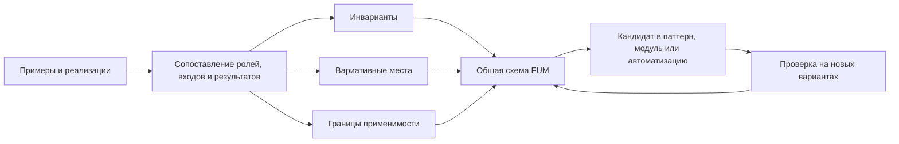
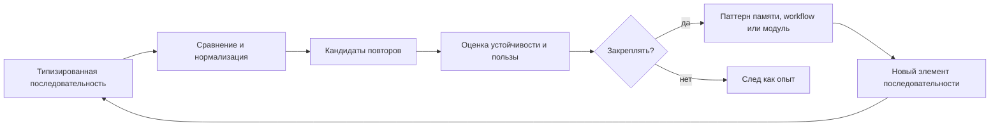

# [Обобщённый поиск повторяющихся последовательностей](../Глоссарий/обобщённый-поиск-повторяющихся-последовательностей.md)

## Назначение

В [FUM](../Глоссарий/FUM.md) должен быть предусмотрен [обобщённый алгоритм поиска повторяющихся последовательностей](../Глоссарий/обобщённый-поиск-повторяющихся-последовательностей.md). Его задача - находить повторяемость не в одном частном формате данных, а в любых рядах элементов, которые можно представить как последовательность: байтах, единицах текста, структурированных событиях, наблюдениях, действиях агента и уже выявленных [паттернах](../Глоссарий/паттерн-памяти.md) более высокого уровня.

Такой алгоритм связывает низкоуровневую обработку данных с [памятью](../Глоссарий/память-FUM.md) шагов [FUM](../Глоссарий/FUM.md). Последовательность действий агента рассматривается как один из частных случаев общей задачи, а не как отдельный специальный механизм.

## Единицы последовательности

Алгоритм должен работать с параметризуемой единицей последовательности. Такой единицей могут быть:

- байт или фрагмент бинарного потока;
- символ, кодовая точка, графемный кластер, токен или другой элемент текста;
- структурированное наблюдение, событие, состояние интерфейса или запись трассы;
- [наблюдаемый входной сигнал](../Глоссарий/наблюдаемый-входной-сигнал.md), включая [навигацию по памяти FUM](../Глоссарий/навигация-по-памяти-FUM.md), создание [исходного запроса](../Глоссарий/исходный-запрос.md) и события пользовательского ввода;
- действие агента, вызов инструмента, переход workflow или результат проверки;
- пример, проектный вариант или потенциальная реализация одного решения на другой программно-аппаратной базе;
- ранее найденная повторяющаяся последовательность, поднятая на уровень нового символа [памяти](../Глоссарий/память-FUM.md).

Из этого следует [фрактальное](../Глоссарий/фрактальный-узел-мышления.md) свойство: найденный [паттерн](../Глоссарий/паттерн-памяти.md) может стать элементом новой последовательности, где снова применяется тот же общий принцип поиска повторяемости.

## Архитектурное требование

Ядро поиска должно быть отделено от конкретного способа представления данных. Входом для него является упорядоченная последовательность типизированных элементов, правила сравнения или нормализации этих элементов и ссылки на исходные фрагменты [памяти](../Глоссарий/память-FUM.md). Выходом является набор кандидатов в повторяющиеся последовательности с происхождением, позициями появления, мерой поддержки, контекстом и связью с результатами работы.

Поиск повторяемости не должен автоматически превращать найденную последовательность в правило поведения. [FUM](../Глоссарий/FUM.md) должен разделять три этапа:

- обнаружение повторяющихся последовательностей;
- оценку их устойчивости, применимости и связи с результатами;
- закрепление выбранных последовательностей как [паттернов памяти](../Глоссарий/паттерн-памяти.md), workflow или [модулей](../Глоссарий/модуль-FUM.md) более высокого уровня.

## Агрегация и абстрагирование

Агрегирование и абстрагирование являются самостоятельной ценностью для [FUM](../Глоссарий/FUM.md). Если в [памяти](../Глоссарий/память-FUM.md) есть несколько примеров, прототипов или потенциальных реализаций одного замысла на разной программно-аппаратной базе, [FUM](../Глоссарий/FUM.md) должен не только хранить их как отдельные варианты, но и выявлять из них [общую схему FUM](../Глоссарий/общая-схема-FUM.md).

Такая работа состоит из нескольких шагов:

- собрать сопоставимые примеры или варианты и сохранить их происхождение;
- разметить роли, входы, выходы, состояния, ограничения, проверки и эффекты каждого варианта;
- выделить инварианты, которые повторяются между вариантами несмотря на различие реализации;
- отметить вариативные места: зависимость от операционной системы, устройства, модели, интерфейса, прав доступа, стоимости, задержек или надёжности;
- описать [общую схему](../Глоссарий/общая-схема-FUM.md) как переносимое знание, а не как выбор единственной реализации.

[Общая схема FUM](../Глоссарий/общая-схема-FUM.md) не утверждает, что все частные реализации равны. Она показывает, какие отношения можно переносить между ними, какие параметры должны оставаться настраиваемыми и где нужна отдельная проверка применимости. Поэтому схема должна хранить не только инварианты, но и границы абстракции.

## Схема выделения общей схемы

## Схема поиска повторяемости

## Уровни применения

На низком уровне такой механизм может помогать обнаруживать повторяющиеся байтовые и текстовые структуры. На среднем уровне он применим к логам, документам, интерфейсным событиям, [навигации по памяти FUM](../Глоссарий/навигация-по-памяти-FUM.md), изменениям состояния и трассам инструментов. На высоком уровне он должен работать с последовательностями наблюдений и действий агента: какие шаги повторяются, в каком контексте, к каким ошибкам или удачным исходам они ведут.

Для [FUM](../Глоссарий/FUM.md) особенно важно, что один и тот же принцип может связывать эти уровни. Байтовая повторяемость, текстовая повторяемость и повторяемость агентских действий различаются типами элементов, но не общей формой задачи.

## Инженерные следствия

- Реализация должна поддерживать точное совпадение и оставлять место для нормализованного или приблизительного сравнения там, где элементы имеют семантическую близость.
- Результат поиска должен сохранять происхождение: [FUM](../Глоссарий/FUM.md) должен понимать, из каких исходных фрагментов [памяти](../Глоссарий/память-FUM.md) получен кандидат в [паттерн](../Глоссарий/паттерн-памяти.md).
- Алгоритм должен быть пригоден для инкрементального применения, чтобы [память](../Глоссарий/память-FUM.md) могла пополняться без полного пересчёта всех прошлых последовательностей.
- Найденные [паттерны](../Глоссарий/паттерн-памяти.md) должны быть сопоставимы с результатами работы: успешностью, ошибками, возвратами, слияниями, человеческими правками и проверками.
- Конкретная техника реализации может меняться: суффиксные структуры, скользящие хеши, словарное сжатие, грамматическая индукция и sequence mining рассматриваются как возможные инженерные варианты, а не как заранее закреплённый единственный выбор.

## Связь с [памятью FUM](../Глоссарий/память-FUM.md)

[Обобщённый поиск повторяющихся последовательностей](../Глоссарий/обобщённый-поиск-повторяющихся-последовательностей.md) является механизмом, который делает [память FUM](../Глоссарий/память-FUM.md) не только архивом, но и средой выделения структуры. Он помогает переходить от отдельных следов работы к повторяемым формам поведения, от повторяемых форм - к проверяемым [паттернам](../Глоссарий/паттерн-памяти.md), а от [паттернов](../Глоссарий/паттерн-памяти.md) - к новым элементам мышления следующего уровня.

## Источники требований

- [исходный запрос 2026-06-22 06:08:01 MSK](../Запросы/2026-06-22_06-08-01_MSK.md)
- [исходный запрос 2026-06-22 07:20:42 MSK](../Запросы/2026-06-22_07-20-42_MSK.md)
- [исходный запрос 2026-06-23 19:06:56 MSK](../Запросы/2026-06-23_19-06-56_MSK.md)
- [исходный запрос 2026-06-25 18:36:50 MSK](../Запросы/2026-06-25_18-36-50_MSK.md)
