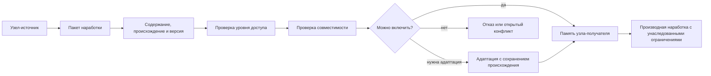

# Обмен [наработками](../Глоссарий/наработка.md) и [уровни доступа](../Глоссарий/уровень-доступа.md)

Источники требований:

- [исходный запрос 2026-06-22 06:17:48 MSK](../Запросы/2026-06-22_06-17-48_MSK.md)
- [исходный запрос 2026-06-22 06:22:15 MSK](../Запросы/2026-06-22_06-22-15_MSK.md)
- [исходный запрос 2026-06-22 06:40:09 MSK](../Запросы/2026-06-22_06-40-09_MSK.md)
- [исходный запрос 2026-06-22 07:51:48 MSK](../Запросы/2026-06-22_07-51-48_MSK.md)
- [исходный запрос 2026-06-22 09:55:43 MSK](../Запросы/2026-06-22_09-55-43_MSK.md)
- [исходный запрос 2026-06-23 19:06:56 MSK](../Запросы/2026-06-23_19-06-56_MSK.md)

## Требование

[FUM](../Глоссарий/FUM.md) должен уметь передавать собственные [наработки](../Глоссарий/наработка.md) другим узлам в устойчивой форме и заимствовать [наработки](../Глоссарий/наработка.md) от других узлов, к которым предоставлен доступ. Это требование следует из самосовершенствования [FUM](../Глоссарий/FUM.md): если агент накапливает удачные способы действия, [паттерны](../Глоссарий/паттерн-памяти.md), [модули](../Глоссарий/модуль-FUM.md), документы, проверки и архитектурные решения, эти результаты не должны оставаться только локальным следом одной [рабочей сессии](../Глоссарий/рабочая-сессия.md).

Обмен [наработками](../Глоссарий/наработка.md) рассматривается как форма наследования между [узлами](../Глоссарий/FUM-узел.md). Один узел может закрепить результат своей работы так, чтобы другой узел смог понять его происхождение, условия применения, [границы доступа](../Глоссарий/уровень-доступа.md) и способ включения в собственную [память](../Глоссарий/память-FUM.md).

## [Наработка](../Глоссарий/наработка.md) как переносимая единица [памяти](../Глоссарий/память-FUM.md)

[Наработка в FUM](../Глоссарий/наработка.md) - это не произвольный фрагмент данных, а оформленная единица [памяти](../Глоссарий/память-FUM.md), пригодная для передачи, проверки и повторного применения. Такой единицей может быть:

- выявленный [паттерн](../Глоссарий/паттерн-памяти.md) действий или наблюдений;
- workflow, [агентский цикл](../Глоссарий/агентский-цикл.md) или подцикл;
- [модуль](../Глоссарий/модуль-FUM.md) [памяти](../Глоссарий/память-FUM.md), интерфейса, инструмента или архитектуры;
- набор требований, решений, тестов или критериев отбора;
- документированная гипотеза, ошибка, успешное решение или опыт слияния;
- производный пакет знаний, который может стать материалом для следующего узла.

Для устойчивой передачи [наработка](../Глоссарий/наработка.md) должна иметь форму, в которой сохранены содержание, происхождение, версия, зависимости, условия применимости, проверочный статус и [уровень доступа](../Глоссарий/уровень-доступа.md). Если эти свойства не закреплены, другой узел может получить данные, но не сможет надёжно включить их в собственное мышление.

## Устойчивая форма передачи

Устойчивая форма передачи должна позволять узлу-получателю восстановить не только итог, но и контекст, в котором этот итог появился. В минимальном виде пакет [наработки](../Глоссарий/наработка.md) должен включать:

- идентификатор и версию [наработки](../Глоссарий/наработка.md);
- описание назначения и границ применимости;
- ссылки на исходные требования, источники, трассы или решения;
- сведения о зависимостях и совместимости;
- результаты проверок, отбора или человеческого подтверждения;
- правила обновления, слияния и отзыва;
- уровень доступа и условия дальнейшей передачи.

Такой пакет не обязан быть одним конкретным файловым форматом. Важно, чтобы [FUM](../Глоссарий/FUM.md) поддерживал машинно-обрабатываемое представление, достаточное для импорта, сравнения, проверки, слияния и последующего аудита происхождения.

## Схема обмена [наработкой](../Глоссарий/наработка.md)

## Заимствование от других узлов

Заимствование [наработки](../Глоссарий/наработка.md) не должно быть слепым копированием. Узел-получатель должен проверить:

- был ли ему действительно предоставлен доступ;
- соответствует ли уровень доступа предполагаемому использованию;
- совместима ли [наработка](../Глоссарий/наработка.md) с текущей моделью [памяти](../Глоссарий/память-FUM.md), архитектурой и задачей;
- какие ограничения, зависимости и риски наследуются вместе с [наработкой](../Глоссарий/наработка.md);
- не противоречит ли заимствование уже закреплённым требованиям;
- как сохранить происхождение [наработки](../Глоссарий/наработка.md) после включения в локальную [память](../Глоссарий/память-FUM.md).

Если [наработка](../Глоссарий/наработка.md) проходит проверку, она может быть включена в [память FUM](../Глоссарий/память-FUM.md) как внешний вклад с сохранением происхождения. Если обнаружены конфликты, [FUM](../Глоссарий/FUM.md) должен фиксировать их как материал мышления: показать место расхождения, возможные варианты адаптации и основания выбранного решения.

## Модель узла-партнёра

Обмен [наработками](../Глоссарий/наработка.md) требует, чтобы [FUM](../Глоссарий/FUM.md) строил [внутреннюю модель узла](../Глоссарий/внутренняя-модель-другого-узла.md), с которым взаимодействует. Для узла-партнёра должны быть представлены доступные каналы связи, история обменов, известные ограничения, уровень доверия, совместимость [наработок](../Глоссарий/наработка.md) и действующие разрешения.

Если узлом-партнёром является человек, модель должна учитывать его как самостоятельный [FUM-узел](../Глоссарий/FUM-узел.md) с собственными целями, [памятью](../Глоссарий/память-FUM.md) и приватной областью. При этом [FUM](../Глоссарий/FUM.md) должен различать прямые слова человека, наблюдаемое поведение, собственные выводы и неизвестные части модели. Это различение важно для того, чтобы обмен [наработками](../Глоссарий/наработка.md) не подменял согласование догадками о человеке.

## Обмен в гибридных и коллективных узлах

Если [FUM](../Глоссарий/FUM.md) действует как [личный агент человека](../Глоссарий/личный-FUM-агент.md), обмен [наработками](../Глоссарий/наработка.md) может происходить не только между отдельными агентами, но и внутри [гибридного узла](../Глоссарий/гибридный-узел.md) человек-[FUM](../Глоссарий/FUM.md). В таком случае нужно различать, какая часть [наработки](../Глоссарий/наработка.md) относится к личной [памяти](../Глоссарий/память-FUM.md) человека, какая создана агентом, какая стала общей рабочей [памятью](../Глоссарий/память-FUM.md) связки и какие права передачи были подтверждены.

Сеть [гибридных узлов](../Глоссарий/гибридный-узел.md) может образовывать коллективный [FUM-узел](../Глоссарий/FUM-узел.md): семью, команду, компанию, сообщество или другой социальный элемент. Обмен внутри такого узла требует дополнительных метаданных: роли участника, уровня доверия, права представлять коллективный узел вовне, права переносить [наработку](../Глоссарий/наработка.md) между личной и общей [памятью](../Глоссарий/память-FUM.md), а также условий публикации или дальнейшей передачи.

Для составных узлов особенно важно сохранять происхождение решения на нескольких уровнях. [Наработка](../Глоссарий/наработка.md) может быть предложена агентом, подтверждена человеком, принята [гибридным узлом](../Глоссарий/гибридный-узел.md) и затем включена в [память](../Глоссарий/память-FUM.md) команды или компании. Каждый такой переход должен быть видимым для последующей проверки доступа и ответственности.

## [Уровни доступа](../Глоссарий/уровень-доступа.md)

Обмен [наработками](../Глоссарий/наработка.md) требует явной системы [уровней доступа](../Глоссарий/уровень-доступа.md). Уровень доступа является частью самой [наработки](../Глоссарий/наработка.md) и должен сопровождать её при передаче, копировании, слиянии и производных изменениях.

Базовые уровни:

- полностью публичный уровень: [наработка](../Глоссарий/наработка.md) может быть передана кому угодно, опубликована и использована без ограничения в рамках заявленной лицензии;
- ограниченный уровень: [наработка](../Глоссарий/наработка.md) доступна только определённым узлам, пользователям, группам или контекстам и не может передаваться дальше без отдельного разрешения;
- приватный уровень: [наработка](../Глоссарий/наработка.md) остаётся внутри узла или доверенной области и может передаваться наружу только в виде специально разрешённого резюме, обезличенного фрагмента или производной формы;
- закрытый уровень: само содержание недоступно для обмена, но система может сохранять минимальные метаданные о существовании ограничения, если это безопасно и не раскрывает защищаемую информацию.

[FUM](../Глоссарий/FUM.md) должен различать доступ на чтение, использование, изменение, публикацию и дальнейшую передачу. Возможность увидеть [наработку](../Глоссарий/наработка.md) не всегда означает право включить её в собственную [память](../Глоссарий/память-FUM.md), изменить, опубликовать или передать следующему узлу.

## [Границы власти](../Глоссарий/граница-власти-FUM.md) шире доступа

[Уровни доступа](../Глоссарий/уровень-доступа.md) являются частью более общего требования к [границам власти](../Глоссарий/граница-власти-FUM.md). Узел может иметь право получить конкретную [наработку](../Глоссарий/наработка.md), но это не даёт ему полной власти над узлом-источником, его [памятью](../Глоссарий/память-FUM.md), будущими решениями, идентичностью или правом участвовать в других связях.

При обмене между составным узлом и его [подузлами](../Глоссарий/подузел-FUM.md) [FUM](../Глоссарий/FUM.md) должен различать передачу материалов, временное делегирование полномочий и поглощение контроля. Даже если [подузел](../Глоссарий/подузел-FUM.md) входит в общую рабочую систему, его локальные ограничения доступа и остаточная автономия не должны исчезать автоматически.

Эта связь раскрыта в документе [Децентрализация FUM и границы власти](15-децентрализация-и-границы-власти.md), а практические критерии допустимой власти вынесены в [открытый вопрос](../Вопросы/2026-06-22_07-51-48_MSK_границы-власти-узлов-FUM.md).

## Метаданные доступа и происхождения

[Уровни доступа](../Глоссарий/уровень-доступа.md) должны быть проверяемыми. Для этого [FUM](../Глоссарий/FUM.md) должен хранить рядом с [наработкой](../Глоссарий/наработка.md) метаданные:

- кто или какой узел является источником;
- кому предоставлен доступ;
- какие операции разрешены;
- какие ограничения должны наследоваться производными [наработками](../Глоссарий/наработка.md);
- когда и почему доступ был предоставлен, изменён или отозван;
- какие части [наработки](../Глоссарий/наработка.md) публичны, ограничены или приватны.

Если [наработка](../Глоссарий/наработка.md) состоит из нескольких частей с разными [уровнями доступа](../Глоссарий/уровень-доступа.md), [FUM](../Глоссарий/FUM.md) должен уметь передавать только разрешённую часть и явно отмечать, что остальное недоступно. Скрытая приватная часть не должна случайно попасть в публичный пакет.

## Открытая система и приватная память

[Открытость FUM](../Глоссарий/открытость-FUM.md) не отменяет [уровни доступа](../Глоссарий/уровень-доступа.md), а делает их более важными. Базовые материалы, код, архитектурные решения, форматы [памяти](../Глоссарий/память-FUM.md), правила автономии и воспроизводимые [автоматизации](../Глоссарий/автоматизация-FUM.md) должны быть по возможности открытыми и проверяемыми. Содержательная личная [память](../Глоссарий/память-FUM.md), приватные [наработки](../Глоссарий/наработка.md) и чувствительные данные человека при этом остаются под явными ограничениями доступа.

Для [личного FUM-агента](../Глоссарий/личный-FUM-агент.md) это различение критично: доверие должно опираться на проверяемость устройства агента, а не на закрытость механизма, которому человек вынужден раскрывать всю личную жизнь. Поэтому открытый агент должен быть совместим с приватной памятью, выборочной публикацией, обезличенными производными формами и отзывом разрешений.

## Связь с самосовершенствованием

Самосовершенствование [FUM](../Глоссарий/FUM.md) требует, чтобы удачные результаты работы могли переживать отдельную сессию и отдельный узел. Передача [наработок](../Глоссарий/наработка.md) делает эволюцию [FUM](../Глоссарий/FUM.md) не только индивидуальной, но и сетевой: разные узлы могут наследовать друг у друга устойчивые решения, адаптировать их, проверять в новых условиях и возвращать улучшенные варианты.

При этом [уровни доступа](../Глоссарий/уровень-доступа.md) защищают границы доверия. [FUM](../Глоссарий/FUM.md) должен развиваться как открытая система там, где это возможно, и как аккуратная система разграничения доступа там, где [память](../Глоссарий/память-FUM.md) содержит приватные, ограниченные или контекстно чувствительные материалы.

## Архитектурные следствия

- [Память FUM](../Глоссарий/память-FUM.md) должна поддерживать экспорт и импорт [наработок](../Глоссарий/наработка.md) как самостоятельных единиц с происхождением.
- У каждой переносимой [наработки](../Глоссарий/наработка.md) должны быть версия, контекст применимости, проверочный статус и уровень доступа.
- Импортированные [наработки](../Глоссарий/наработка.md) должны сохранять ссылку на источник и ограничения дальнейшего использования.
- Перед обменом [FUM](../Глоссарий/FUM.md) должен сверять [наработку](../Глоссарий/наработка.md) с внутренней моделью узла-получателя: доступом, совместимостью, историей взаимодействия и уровнем доверия.
- Слияние заимствованных [наработок](../Глоссарий/наработка.md) должно учитывать не только техническую совместимость, но и права передачи, публикации и производного использования.
- Публичные пакеты должны проходить проверку на отсутствие приватных или ограниченных фрагментов.
- [Ограничения доступа](../Глоссарий/уровень-доступа.md) должны быть представлены так, чтобы [FUM](../Глоссарий/FUM.md) мог рассуждать о них и не превращал приватность в невидимую зону без метаданных.
