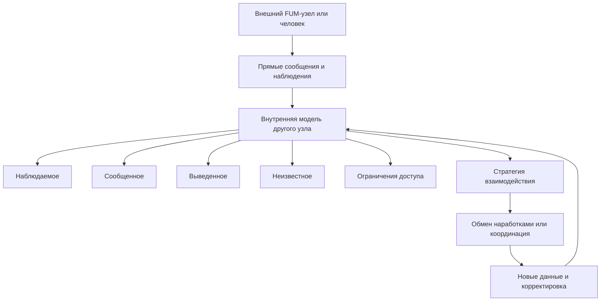

# [Внутренние модели других узлов](../Глоссарий/внутренняя-модель-другого-узла.md)

## Требование

[FUM](../Глоссарий/FUM.md) должен иметь способность строить, хранить и обновлять [внутренние модели других FUM-узлов](../Глоссарий/внутренняя-модель-другого-узла.md), с которыми он взаимодействует. Такая модель нужна не для замены другого узла, а для координации взаимодействия: [FUM](../Глоссарий/FUM.md) должен понимать, с кем он связан, какие ожидания уже сложились, какие [ограничения доступа](../Глоссарий/уровень-доступа.md) действуют и какие формы обмена возможны.

[Внутренняя модель другого узла](../Глоссарий/внутренняя-модель-другого-узла.md) является рабочей гипотезой [памяти FUM](../Глоссарий/память-FUM.md). Она должна сохранять происхождение сведений, различать наблюдаемые факты, прямые сообщения другого узла, производные выводы и неизвестные области. Модель не должна представляться как полный доступ к чужому [внутреннему состоянию](../Глоссарий/внутреннее-состояние.md).

## Люди как [FUM-узлы](../Глоссарий/FUM-узел.md)

Люди, с которыми взаимодействует [FUM](../Глоссарий/FUM.md), рассматриваются как [FUM-узлы](../Глоссарий/FUM-узел.md) в том смысле, что они тоже имеют [память](../Глоссарий/память-FUM.md), цели, ограничения, способы мышления, историю взаимодействия и собственную область недоступного [внутреннего состояния](../Глоссарий/внутреннее-состояние.md). Поэтому модель человека должна строиться по тем же общим принципам, что и модель другого узла, но с более строгими требованиями к приватности, корректируемости и уважению границ.

[FUM](../Глоссарий/FUM.md) должен явно различать:

- то, что человек сказал или показал напрямую;
- то, что было получено через наблюдаемое взаимодействие;
- то, что [FUM](../Глоссарий/FUM.md) вывел как вероятную гипотезу;
- то, что остаётся неизвестным или недоступным;
- то, что нельзя передавать другим узлам без разрешения.

## Схема [внутренней модели другого узла](../Глоссарий/внутренняя-модель-другого-узла.md)

## [Гибридные узлы](../Глоссарий/гибридный-узел.md) человек-[FUM](../Глоссарий/FUM.md)

[Личный FUM-агент](../Глоссарий/личный-FUM-агент.md) человека может образовывать с ним [гибридный узел](../Глоссарий/гибридный-узел.md). Для внешнего взаимодействия такой узел может выглядеть как единый участник: он принимает сообщения, готовит ответы, ведёт задачи, переносит контекст и действует в разрешённых границах от имени связки человек-[FUM](../Глоссарий/FUM.md).

Внутренняя модель такого узла должна быть составной. [FUM](../Глоссарий/FUM.md) должен различать человека, его личного агента, общую рабочую [память](../Глоссарий/память-FUM.md) связки и подтверждённые правила автономии. Если другой [FUM](../Глоссарий/FUM.md) взаимодействует с [гибридным узлом](../Глоссарий/гибридный-узел.md), он не должен автоматически считать все сообщения агентскими или все действия человеческими: происхождение намерения, предложения и подтверждения должно сохраняться как часть модели.

Сеть [гибридных узлов](../Глоссарий/гибридный-узел.md) может быть представлена как коллективный [FUM-узел](../Глоссарий/FUM-узел.md): семья, команда, компания, сообщество или иной социальный элемент. Модель такого узла должна включать участников, роли, [правила доступа](../Глоссарий/уровень-доступа.md), общую историю решений, каналы согласования и границы представительства вовне.

## Содержание модели узла

[Внутренняя модель другого узла](../Глоссарий/внутренняя-модель-другого-узла.md) может включать:

- идентификатор узла, контекст взаимодействия и уровень доверия;
- исходные языковые акты, их интерпретации, модальность, доказательность, речевые функции и вызванные изменения модели;
- контекстные привязки языковых ролей говорящего, адресата, включающей группы и третьих участников;
- состав узла: отдельный агент, человек, [гибридный узел](../Глоссарий/гибридный-узел.md) человек-[FUM](../Глоссарий/FUM.md) или коллективный узел;
- известные цели, роли, предпочтения, ограничения и рабочие привычки;
- историю совместных задач, решений, конфликтов и успешных обменов;
- сведения о доступных каналах взаимодействия и форматах обмена;
- модель совместимости [наработок](../Глоссарий/наработка.md), [модулей](../Глоссарий/модуль-FUM.md), workflow и требований;
- [границы доступа](../Глоссарий/уровень-доступа.md): что можно читать, использовать, изменять, публиковать и передавать дальше;
- уровень уверенности по каждому значимому утверждению.

Модель должна быть версионируемой: [FUM](../Глоссарий/FUM.md) должен видеть, какие сведения были получены раньше, какие обновлены, какие устарели и какие требуют подтверждения.

## Естественно-языковое обновление моделей участников

[Естественно-языковая синхронизация знаний FUM](../Глоссарий/естественно-языковая-синхронизация-знаний-FUM.md) обновляет внутреннюю модель не только через называние участников. Высказывание может сообщать факт, предположение, цель, запрет, обязательство, причинное объяснение, вопрос, исправление или чужую цитату. FUM должен хранить исходную форму, интерпретированное содержание, источник, адресатов, время, модальность, основания, уверенность, речевой акт, связь с предыдущим дискурсом и то изменение модели, которое было сделано на его основе.

Модель должна различать четыре состояния: другой узел сообщил содержание; FUM интерпретировал сообщение определённым образом; интерпретация принята как рабочее знание после доступной проверки; между участниками сохранилось расхождение или неизвестность. Ответ, уточнение, переформулирование, взаимный пересказ и совместное действие дают новые наблюдения, по которым интерпретация может подтверждаться или исправляться. Синхронизация при этом не означает полный доступ к чужой памяти и не требует одинаковых внутренних состояний.

### Языковые роли в модели взаимодействия

[Ролевая семантика сетевого взаимодействия FUM](../Глоссарий/ролевая-семантика-сетевого-взаимодействия-FUM.md) даёт модели относительную систему координат. В конкретном акте общения `я` связывается с текущим говорящим, `ты` или `вы` - с адресатом либо адресатами, `мы` - с группой, включающей говорящего, а `они` - с упоминаемой группой третьих участников. При смене говорящего эти роли пересчитываются и не заменяют устойчивые идентификаторы узлов.

Модель должна хранить не только распознанную роль, но и основание её привязки: исходное сообщение, говорящего, адресатов, упоминаемые узлы и группы, время, контекст, границы цитирования, версию состава группы и уровень уверенности. Употребление `мы` не подтверждает состав коллектива или право представлять его, а языковое обращение не даёт адресату дополнительных [прав доступа](../Глоссарий/уровень-доступа.md). Ролевая привязка является одним подслоем полной интерпретации языкового акта.

## Использование

[FUM](../Глоссарий/FUM.md) использует [внутренние модели других узлов](../Глоссарий/внутренняя-модель-другого-узла.md) для выбора формы взаимодействия: как формулировать запрос, какую [наработку](../Глоссарий/наработка.md) можно предложить, какие [ограничения доступа](../Глоссарий/уровень-доступа.md) проверить, как согласовать конфликт требований и какой уровень автономии допустим в совместной работе.

При обмене [наработками](../Глоссарий/наработка.md) модель другого узла помогает оценить не только техническую совместимость, но и контекстную применимость: почему этот узел может принять [наработку](../Глоссарий/наработка.md), какие части ему доступны, какие ограничения должны наследоваться и где нужна человеческая или агентская проверка.

## Связь со средами [внутренних FUM](../Глоссарий/внутренний-FUM.md)

Модель другого внешнего узла может быть включена в [модельную среду](../Глоссарий/модельная-среда.md) как [внутренний FUM](../Глоссарий/внутренний-FUM.md)-представитель. Например, при описании актуальной ситуации, реконструкции прошлого взаимодействия или планировании будущего обмена [FUM](../Глоссарий/FUM.md) может использовать внутренний узел, который представляет возможное поведение другого участника.

Такая связь не отменяет границу между внешним узлом и его моделью. [Внутренний FUM](../Глоссарий/внутренний-FUM.md)-представитель остаётся гипотезой или рабочей ролью внутри [памяти FUM](../Глоссарий/память-FUM.md), а не самим внешним участником. Подробное требование к таким средам описано в документе [Среда для внутренних FUM](11-среда-для-внутренних-FUM.md). Статус [внутренних FUM](../Глоссарий/внутренний-FUM.md) и степень их автономности зафиксированы как [открытый вопрос](../Вопросы/2026-06-22_06-35-26_MSK_статус-внутренних-FUM.md).

## Границы и корректировка

Модель другого узла является частью внутренней [памяти FUM](../Глоссарий/память-FUM.md) и сама может содержать чувствительные сведения. Поэтому она должна подчиняться тем же [правилам доступа](../Глоссарий/уровень-доступа.md), что и другие состояния и [наработки](../Глоссарий/наработка.md): приватные части не должны случайно публиковаться, передаваться или использоваться вне разрешённого контекста.

Другой узел, включая человека, должен иметь возможность быть представленным в модели не как фиксированный объект, а как развивающийся участник взаимодействия. [FUM](../Глоссарий/FUM.md) должен уметь корректировать модель при новых данных, явно отмечать противоречия, снижать уверенность при расхождениях и сохранять историю исправлений.

## Архитектурные следствия

- [Память FUM](../Глоссарий/память-FUM.md) должна поддерживать отдельные представления для моделей взаимодействующих узлов.
- Каждое утверждение в модели узла должно иметь происхождение, уровень уверенности и [режим доступа](../Глоссарий/уровень-доступа.md).
- Модели людей должны различать наблюдение, прямое сообщение, вывод и неизвестность.
- [Агентский цикл](../Глоссарий/агентский-цикл.md) должен обновлять модель узла после значимых взаимодействий.
- Экспорт модели узла или сведений из неё должен проходить проверку доступа и приватности.
- Модель другого узла должна участвовать в выборе стратегии обмена, координации и слияния [наработок](../Глоссарий/наработка.md).

## Источники требований

- [исходный запрос 2026-06-22 06:22:15 MSK](../Запросы/2026-06-22_06-22-15_MSK.md)
- [исходный запрос 2026-06-22 06:35:26 MSK](../Запросы/2026-06-22_06-35-26_MSK.md)
- [исходный запрос 2026-06-22 06:40:09 MSK](../Запросы/2026-06-22_06-40-09_MSK.md)
- [исходный запрос 2026-06-23 19:06:56 MSK](../Запросы/2026-06-23_19-06-56_MSK.md)
- [исходный запрос 2026-07-13 20:34:23 MSK - Закрепить ролевую семантику взаимодействия ИИ-агентов](../Запросы/2026-07-13_20-34-23_MSK_закрепить-ролевую-семантику-взаимодействия-ИИ-агентов.md)
- [исходный запрос 2026-07-13 22:00:22 MSK - Закрепить естественный язык как язык синхронизации знаний](../Запросы/2026-07-13_22-00-22_MSK_закрепить-естественный-язык-как-язык-синхронизации-знаний.md)

<!-- FUM-MD-RECENCY:BEGIN -->
<!-- last-content-edit: 2026-07-13 22:16:15 MSK -->
<!-- content-sha256: sha256:2f220a483b96337c05e906de5ee1d43e1aa073558464df5af5c8c9acfaf95189 -->
<!-- FUM-MD-RECENCY:END -->
