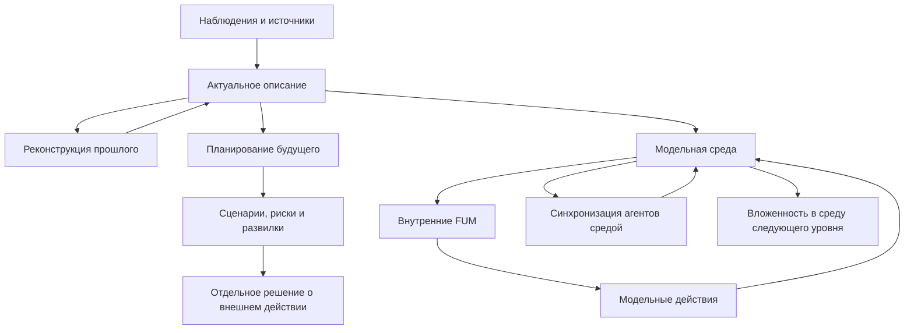

# Среда для [внутренних FUM](../Глоссарий/внутренний-FUM.md)

[Открытый вопрос](../Глоссарий/открытый-вопрос.md):

- [статус внутренних FUM и модельных сред](../Вопросы/2026-06-22_06-35-26_MSK_статус-внутренних-FUM.md)

## Требование

[FUM](../Глоссарий/FUM.md) должен уметь создавать окружающую среду для [внутренних FUM](../Глоссарий/внутренний-FUM.md). Такая среда является [модельным пространством](../Глоссарий/модельная-среда.md), в котором вложенные [FUM](../Глоссарий/FUM.md)-представления могут иметь состояние, наблюдать элементы среды, взаимодействовать друг с другом и порождать гипотезы о развитии ситуации.

Среда [внутренних FUM](../Глоссарий/внутренний-FUM.md) может использоваться как основание для трёх родственных задач:

- описания актуального мира, то есть текущего состояния ситуации, участников, объектов, ограничений и доступных действий;
- реконструкции прошлого, то есть модели того, как текущее состояние могло возникнуть из предыдущих событий;
- планирования будущего, то есть построения возможных сценариев, целей, рисков, действий и последствий.

## Среда как модель мира

Окружающая среда [внутренних FUM](../Глоссарий/внутренний-FUM.md) не тождественна внешнему миру. Она является внутренней моделью [FUM](../Глоссарий/FUM.md) и должна сохранять различие между наблюдаемыми фактами, исходными сообщениями, выводами, предположениями, неизвестностью и плановыми допущениями.

Каждый значимый элемент такой среды должен иметь происхождение, уровень уверенности, временной статус и [режим доступа](../Глоссарий/уровень-доступа.md). Временной статус показывает, относится ли элемент к описанию актуального мира, реконструкции прошлого или возможному будущему. [Режим доступа](../Глоссарий/уровень-доступа.md) определяет, можно ли использовать, публиковать, передавать или изменять этот элемент в других узлах и средах.

## Среда как синхронизирующий агент

[Модельная среда](../Глоссарий/модельная-среда.md) должна уметь представлять более общую [окружающую среду FUM](../Глоссарий/окружающая-среда-FUM.md): физическую, химическую, биологическую, социальную, экономическую, цифровую или смешанную. В такой рамке среда не является только контейнером объектов. Она синхронизирует работу агентов через общие ограничения, задержки сигналов, допустимые взаимодействия, ресурсы, обратную связь и правила закрепления устойчивых конфигураций.

На человеческом и агентском уровнях высокоуровневым механизмом такой среды является естественный язык. Через [естественно-языковую синхронизацию знаний FUM](../Глоссарий/естественно-языковая-синхронизация-знаний-FUM.md) участники с локальными состояниями предъявляют часть знания, интерпретируют сообщения, задают вопросы, исправляют рассогласования и обновляют общую рабочую область. Язык дополняет, а не заменяет ограничения среды, задержки, ресурсы и обратную связь.

[Многоуровневая языковая синхронизация FUM](../Глоссарий/многоуровневая-языковая-синхронизация-FUM.md) проверяет более общий вариант той же схемы. На клеточном, химическом и атомном уровнях, на уровне элементарных частиц и других субатомных масштабах среда связывает различимые состояния через допустимые взаимодействия и контекстно зависимые переходы; в гравитационно-релятивистском контуре она задаёт локальность, причинную связность и границы согласования. Слово «язык» здесь имеет гипотетический операциональный смысл и не приравнивает физическое сопряжение к человеческому знанию.

Если внутри среды действуют агенты, сама среда может рассматриваться как агент или [FUM-узел](../Глоссарий/FUM-узел.md) следующего масштаба, вложенный в другую среду. Например, клетка является средой для молекулярных процессов и одновременно агентом в ткани; организм является средой для клеток и агентом в биологической, социальной или экономической среде; экономика является средой синхронизации людей и организаций и одновременно может рассматриваться как составной узел в более широкой цивилизационной среде.

Для внутренних моделей это означает, что [FUM](../Глоссарий/FUM.md) должен явно фиксировать уровень описания. Один и тот же объект может быть агентом на одном уровне, средой для вложенных агентов на другом и подузлом более крупной среды на третьем. Такая смена масштаба не должна стирать различие между модельным действием, реальным действием и исследовательской аналогией.

## Сетевая карта как среда

Частным случаем [модельной среды](../Глоссарий/модельная-среда.md) является [нейронная гиперсеть FUM](../Глоссарий/нейронная-гиперсеть-FUM.md), предъявленная вложенным агентам как карта возможных переходов. В такой среде узлы и связи сети являются не только вычислительными элементами, но и координатами: агент может находиться в участке сети, выбирать соседний переход, применять локальный вычислитель, возвращаться, ветвиться или передавать результат другому агенту.

Базовый вариант такой среды может быть предельно простым: граф арифметических вычислителей, где каждый переход меняет число, вектор или символическое состояние. Сложность появляется не только из устройства графа, но и из различий между агентами. Разные агенты могут читать одну и ту же карту через разные настройки внимания, глубины обхода, риска, памяти, целей и наследуемых параметров.

Для [FUM](../Глоссарий/FUM.md) это означает, что среда должна хранить не только своё состояние, но и профили интерпретации агентов. Если настройки агента образуют эволюционный цикл во время исполнения, среда фиксирует происхождение этих настроек, мутации, проверку полезности, потомков и причины ослабления или закрепления. При этом изменение настроек агента не должно автоматически считаться изменением самой сетевой среды.

Сетевая среда должна также задавать ограничения внутренней экономики агентов: лимит числа агентов и шагов, энергетический или вычислительный бюджет, правила записи в среду, критерии полезности, способ считывания итогового ответа и условия остановки. Это нужно, чтобы агенты не подменяли задачу оптимизацией собственного выживания, размножения или захвата локальных ресурсов.

## Связь с [виртуализованными средами](../Глоссарий/виртуализованная-среда-FUM.md)

[Модельная среда](../Глоссарий/модельная-среда.md) является частным случаем более общего требования к [виртуализованным средам FUM](../Глоссарий/виртуализованная-среда-FUM.md): [FUM-узел](../Глоссарий/FUM-узел.md) может не только моделировать мир для [внутренних FUM](../Глоссарий/внутренний-FUM.md), но и строить исполняемый или долговременный интерфейс, через который вложенные узлы получают доступ к состоянию.

Для [внутренних FUM](../Глоссарий/внутренний-FUM.md) это означает, что среда может иметь разные уровни реальности. Один слой остаётся сценарной моделью будущего, другой - симулятором, третий - реальным программным интерфейсом к [памяти](../Глоссарий/память-FUM.md), а дальний аппаратный слой может предъявлять файловую систему или другой интерфейс поверх сырого носителя. Эти уровни не должны смешиваться: модельное действие, симуляция и реальное системное действие требуют разных статусов, проверок и ограничений.

## [Внутренние FUM](../Глоссарий/внутренний-FUM.md)

[Внутренний FUM](../Глоссарий/внутренний-FUM.md) в [модельной среде](../Глоссарий/модельная-среда.md) представляет вложенный [узел мышления](../Глоссарий/FUM-узел.md). Он может быть связан с ролью, участником, гипотезой, подсистемой, будущим вариантом поведения или реконструируемым состоянием прошлого.

Несколько внутренних FUM могут образовывать сеть подузлов [агента человеческого образца FUM](../Глоссарий/агент-человеческого-образца-FUM.md). Каждый подузел сохраняет локальный контекст и обменивается с другими естественно-языковыми либо операторно совместимыми сообщениями. Если runtime использует типизированную форму вместо текста, она должна сохранять содержание, происхождение, модальность, неоднозначность, связь с обновлением памяти и возможность обратного объяснения.

Действия [внутренних FUM](../Глоссарий/внутренний-FUM.md) внутри [модельной среды](../Глоссарий/модельная-среда.md) должны маркироваться как модельные действия. Они могут менять состояние модели, но не должны автоматически считаться действиями [FUM](../Глоссарий/FUM.md) во внешнем мире. Переход от модельного действия к реальному действию требует отдельного решения, проверки доступа, оценки риска и сохранения происхождения.

## Временные режимы

Среда [внутренних FUM](../Глоссарий/внутренний-FUM.md) должна поддерживать несколько временных режимов:

- актуальное описание - текущее представление [FUM](../Глоссарий/FUM.md) о мире или задаче с учётом известных наблюдений и ограничений;
- реконструкция прошлого - модель возможной истории возникновения текущего состояния, где каждое звено имеет источник и уровень уверенности;
- планирование будущего - набор возможных сценариев, в которых [FUM](../Глоссарий/FUM.md) проверяет цели, действия, риски, развилки и ожидаемые последствия.

Эти режимы могут быть связаны: реконструкция прошлого объясняет актуальное состояние, актуальное состояние задаёт стартовые условия, а планирование будущего строит варианты дальнейшего развития. При этом [FUM](../Глоссарий/FUM.md) должен сохранять различие между тем, что уже наблюдалось, тем, что реконструировано, и тем, что только планируется.

## Схема [модельной среды](../Глоссарий/модельная-среда.md)

## Связь с архитектурой

Требование к средам [внутренних FUM](../Глоссарий/внутренний-FUM.md) развивает [фрактальную](../Глоссарий/фрактальный-узел-мышления.md) и [модульную](../Глоссарий/модуль-FUM.md) архитектуру проекта. Если [FUM](../Глоссарий/FUM.md) состоит из повторяемых узлов, то отдельный узел может создавать [модельную среду](../Глоссарий/модельная-среда.md), в которой возникают вложенные узлы того же рода. Такая вложенность позволяет строить модели мира не как плоское описание фактов, а как взаимодействие внутренних участников, состояний и сценариев.

Модель другого внешнего [FUM-узла](../Глоссарий/FUM-узел.md) может быть помещена в такую среду как [внутренний FUM](../Глоссарий/внутренний-FUM.md)-представитель, но при этом должна сохраняться граница между внешним узлом и его [внутренней моделью](../Глоссарий/внутренняя-модель-другого-узла.md). [FUM](../Глоссарий/FUM.md) не должен смешивать гипотезу о другом участнике с самим участником.

## Архитектурные следствия

- [Память FUM](../Глоссарий/память-FUM.md) должна поддерживать [модельные среды](../Глоссарий/модельная-среда.md) как отдельные контейнеры состояния.
- Каждая [модельная среда](../Глоссарий/модельная-среда.md) должна иметь цель, временной режим, источники, версию, уровень уверенности и [режим доступа](../Глоссарий/уровень-доступа.md).
- [Внутренние FUM](../Глоссарий/внутренний-FUM.md) должны иметь явно отделённое модельное состояние и историю изменений внутри среды.
- Внутренние подузлы FUM должны поддерживать проверяемый контур сообщения, интерпретации, обновления локальной модели, обратной связи и исправления рассогласования.
- Модельные действия [внутренних FUM](../Глоссарий/внутренний-FUM.md) должны отделяться от реальных действий [FUM](../Глоссарий/FUM.md) во внешнем мире.
- Планирование будущего должно позволять сравнивать несколько возможных сред и сценариев.
- Реконструкция прошлого должна сохранять цепочку источников и степень уверенности по каждому значимому переходу.
- Модель актуального мира должна уметь включать внешние наблюдения, внутренние выводы и границы неизвестного.

## Источники требований

- [исходный запрос 2026-06-22 06:35:26 MSK](../Запросы/2026-06-22_06-35-26_MSK.md)
- [исходный запрос 2026-06-23 19:06:56 MSK](../Запросы/2026-06-23_19-06-56_MSK.md)
- [исходный запрос 2026-06-25 18:50:18 MSK](../Запросы/2026-06-25_18-50-18_MSK.md)
- [исходный запрос 2026-07-02 10:20:18 MSK](../Запросы/2026-07-02_10-20-18_MSK.md)
- [исходный запрос 2026-07-06 10:24:52 MSK - Описать нейросеть как среду агентов](../Запросы/2026-07-06_10-24-52_MSK_описать-нейросеть-как-среду-агентов.md)
- [исходный запрос 2026-07-06 10:51:33 MSK - Интегрировать диалог ChatGPT pro](../Запросы/2026-07-06_10-51-33_MSK_интегрировать-диалог-chatgpt-pro.md)
- [исходный запрос 2026-07-13 22:00:22 MSK - Закрепить естественный язык как язык синхронизации знаний](../Запросы/2026-07-13_22-00-22_MSK_закрепить-естественный-язык-как-язык-синхронизации-знаний.md)
- [исходный запрос 2026-07-13 22:50:54 MSK - Закрепить многоуровневую языковую синхронизацию](../Запросы/2026-07-13_22-50-54_MSK_закрепить-многоуровневую-языковую-синхронизацию.md)

<!-- FUM-MD-RECENCY:BEGIN -->
<!-- last-content-edit: 2026-07-13 23:10:37 MSK -->
<!-- content-sha256: sha256:4f6f4a553dbb08845332632487876d3de32bb19f43eb775f406f9e2c3de36a43 -->
<!-- FUM-MD-RECENCY:END -->
