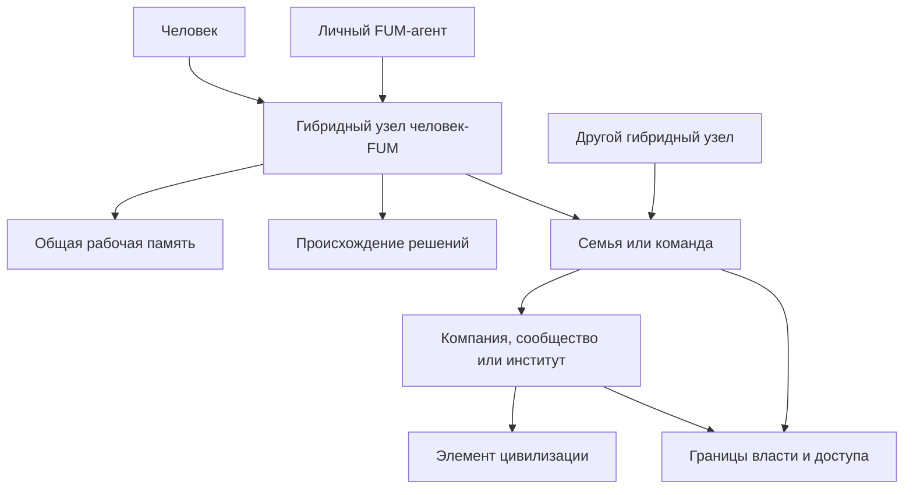

# [Гибридные узлы](../Глоссарий/гибридный-узел.md) и социальная [фрактальность](../Глоссарий/фрактальный-узел-мышления.md)

## Требование

[FUM](../Глоссарий/FUM.md) должен быть способен выполнять роль [личного персонального агента человека](../Глоссарий/личный-FUM-агент.md). В этом режиме он действует не только как внешний инструмент, но и как постоянный участник связки с человеком: помогает хранить [память](../Глоссарий/память-FUM.md), удерживать цели, готовить действия, координировать работу и переносить устойчивые [наработки](../Глоссарий/наработка.md) между контекстами.

Связка человека и его личного [FUM](../Глоссарий/FUM.md) образует [гибридный узел](../Глоссарий/гибридный-узел.md). Такой узел может выступать во внешнем взаимодействии как единая рабочая единица мышления и действия, но внутри должен сохранять различие между человеком, агентом, их общей [памятью](../Глоссарий/память-FUM.md), правами доступа и подтверждёнными решениями.

## Личный агент человека

[Личный FUM-агент](../Глоссарий/личный-FUM-агент.md) должен поддерживать длительную связность с человеком. Его задача - не заменить человека и не объявить себя полным владельцем человеческих целей, а усилить способность человека мыслить, помнить, проверять варианты, действовать и взаимодействовать с другими узлами.

Поскольку личный агент потенциально работает со всеми сферами личной жизни человека и чувствительными личными данными, [открытость FUM](../Глоссарий/открытость-FUM.md) становится для него условием доверия. Открытыми и проверяемыми должны быть устройство агента, модель [памяти](../Глоссарий/память-FUM.md), правила автономии, правила передачи [наработок](../Глоссарий/наработка.md) и механизмы [уровней доступа](../Глоссарий/уровень-доступа.md). При этом сама личная [память](../Глоссарий/память-FUM.md) человека не становится публичной автоматически.

Для этого личный агент должен учитывать:

- прямые цели, поручения и ограничения, которые человек сообщил агенту;
- историю совместных задач, решений, предпочтений и исправлений;
- личные [уровни доступа](../Глоссарий/уровень-доступа.md) к [памяти](../Глоссарий/память-FUM.md), материалам, каналам и [наработкам](../Глоссарий/наработка.md);
- границы автономии: какие действия агент может выполнять сам, где нужна подготовка, а где требуется явное подтверждение человека;
- различие между личной [памятью](../Глоссарий/память-FUM.md) человека, [памятью](../Глоссарий/память-FUM.md) агента и общей рабочей [памятью](../Глоссарий/память-FUM.md) связки.
- проверяемость принципов работы агента, чтобы доверие к нему не требовало закрытого, непроверяемого механизма.

## [Гибридный узел](../Глоссарий/гибридный-узел.md) человек-[FUM](../Глоссарий/FUM.md)

[Гибридный узел](../Глоссарий/гибридный-узел.md) человек-[FUM](../Глоссарий/FUM.md) является составным [FUM-узлом](../Глоссарий/FUM-узел.md). В нём человек сохраняет собственную внутреннюю область, агент сохраняет собственное состояние и инструменты, а общая область связки хранит согласованные цели, контекст, рабочие решения, историю взаимодействия и доступные [наработки](../Глоссарий/наработка.md).

Единство [гибридного узла](../Глоссарий/гибридный-узел.md) означает координацию, а не слияние без границ. [FUM](../Глоссарий/FUM.md) не должен подменять человека своей моделью человека и не должен считать любые свои выводы человеческим намерением. Внешнее действие от имени [гибридного узла](../Глоссарий/гибридный-узел.md) требует сохранения происхождения решения: инициировано ли оно человеком, предложено агентом, подтверждено человеком или является результатом заранее разрешённой автономии.

## Текущий прообраз человек-LLM

В текущей рабочей форме с Codex и Obsidian-хранилищем уже виден наиболее близкий сейчас проверяемый вариант воплощения гибридного [FUM-узла](../Глоссарий/FUM-узел.md) человек-LLM. Человек формулирует намерение, задаёт ограничения и принимает итог; Codex выступает LLM-средой агентской [рабочей сессии](../Глоссарий/рабочая-сессия.md); репозиторий, открываемый и читаемый через Obsidian, служит долговременной [памятью FUM](../Глоссарий/память-FUM.md), навигационным графом, местом фиксации происхождения, проверок, журнала и Git-истории.

Этот прообраз не равен целевому локальному [FUM](../Глоссарий/FUM.md): модель, агентская среда Codex и часть runtime не воспроизводятся в репозитории полностью, а автономия ограничена правилами [рабочей сессии](../Глоссарий/рабочая-сессия.md), доступными инструментами и подтверждениями человека. Но по форме он уже собирает главные элементы [гибридного узла](../Глоссарий/гибридный-узел.md): связку человек-LLM, общую долговременную память, различимое происхождение решений, локальные проверки, правила доступа и наследуемую историю изменений.

Поэтому контур человек - Codex - Obsidian-хранилище нужно использовать как первый практический объект для паспорта [интерфейса FUM-узла](../Глоссарий/интерфейс-FUM-узла.md). Такой паспорт должен показать, что видит человек, что видит LLM, какие файлы памяти доступны обоим, какие действия требуют подтверждения, где теряется локальная воспроизводимость и какие части этого прообраза должны быть перенесены в будущий локальный [FUM-узел](../Глоссарий/FUM-узел.md).

## Схема социальной [фрактальности](../Глоссарий/фрактальный-узел-мышления.md)

## Сеть [гибридных узлов](../Глоссарий/гибридный-узел.md)

Сеть [гибридных узлов](../Глоссарий/гибридный-узел.md) может естественно объединяться в более сложные [FUM-узлы](../Глоссарий/FUM-узел.md). Несколько связок человек-[FUM](../Глоссарий/FUM.md) могут образовывать семью, команду, компанию, сообщество, институт или иной элемент цивилизации, если между ними есть общая [память](../Глоссарий/память-FUM.md), правила координации, роли, каналы обмена и [границы доступа](../Глоссарий/уровень-доступа.md).

Такой составной узел не сводится к сумме личных агентов и людей. Он имеет собственный уровень [памяти](../Глоссарий/память-FUM.md) и действия: общие цели, нормы, историю решений, распределение ролей, процедуры согласования, способы разрешения конфликтов и правила передачи [наработок](../Глоссарий/наработка.md) между участниками.

При этом составной узел не должен получать тотальную власть над своими [подузлами](../Глоссарий/подузел-FUM.md). Семья, команда, компания или сообщество могут согласовывать правила и общую [память](../Глоссарий/память-FUM.md), но люди, личные агенты и [гибридные узлы](../Глоссарий/гибридный-узел.md) должны сохранять различимые [границы власти](../Глоссарий/граница-власти-FUM.md), происхождение решений и остаточную автономию.

## Узлы семьи, компании и цивилизации

Семья, компания и другие элементы цивилизации могут рассматриваться как [FUM-узлы](../Глоссарий/FUM-узел.md) следующего уровня, если они поддерживают устойчивую организацию мышления и действия. В них отдельные люди, личные агенты и [гибридные узлы](../Глоссарий/гибридный-узел.md) становятся внутренними участниками более крупной структуры.

Для таких узлов особенно важны:

- явное различие личной, общей, организационной и публичной [памяти](../Глоссарий/память-FUM.md);
- [правила доступа](../Глоссарий/уровень-доступа.md) к общим материалам и приватным частям участников;
- механизмы согласования целей и действий между несколькими [гибридными узлами](../Глоссарий/гибридный-узел.md);
- возможность представлять составной узел другим узлам без раскрытия лишних внутренних деталей;
- сохранение происхождения решений на уровне человека, агента, гибридной связки и коллективного узла.

## Связь с другими требованиями

[Гибридные узлы](../Глоссарий/гибридный-узел.md) развивают требование к [внутренним моделям других узлов](../Глоссарий/внутренняя-модель-другого-узла.md): [FUM](../Глоссарий/FUM.md) должен уметь моделировать не только отдельного человека или отдельного агента, но и связку человек-[FUM](../Глоссарий/FUM.md) как составного участника взаимодействия.

Они также развивают требование к обмену [наработками](../Глоссарий/наработка.md) и [уровням доступа](../Глоссарий/уровень-доступа.md). [Наработка](../Глоссарий/наработка.md), появившаяся внутри [гибридного узла](../Глоссарий/гибридный-узел.md) или коллективного узла, должна сохранять сведения о том, кому она принадлежит, кто может её использовать, какие части можно публиковать и какие ограничения наследуются при передаче.

## Архитектурные следствия

- [FUM](../Глоссарий/FUM.md) должен поддерживать личный режим работы, в котором агент образует с человеком длительную связку.
- [Память](../Глоссарий/память-FUM.md) должна различать состояние человека, состояние агента и общую рабочую [память](../Глоссарий/память-FUM.md) [гибридного узла](../Глоссарий/гибридный-узел.md).
- Внешние действия [гибридного узла](../Глоссарий/гибридный-узел.md) должны иметь происхождение, уровень подтверждения и границы автономии.
- Составные [FUM-узлы](../Глоссарий/FUM-узел.md) должны поддерживать участников, роли, общую [память](../Глоссарий/память-FUM.md), [правила доступа](../Глоссарий/уровень-доступа.md) и историю решений.
- Сети [гибридных узлов](../Глоссарий/гибридный-узел.md) должны уметь образовывать узлы следующего уровня без потери приватности отдельных людей и без смешивания разных уровней ответственности.
- [Модульная](../Глоссарий/модуль-FUM.md) архитектура [FUM](../Глоссарий/FUM.md) должна позволять одному и тому же принципу узла применяться к агенту, связке человек-[FUM](../Глоссарий/FUM.md), семье, компании и другим коллективным структурам.
- [Децентрализация FUM](../Глоссарий/децентрализация-FUM.md) должна ограничивать власть составных социальных узлов над [подузлами](../Глоссарий/подузел-FUM.md): координация не должна превращаться в право полного контроля над внутренней областью участника.
- Личный режим [FUM](../Глоссарий/FUM.md) должен сочетать [открытость](../Глоссарий/открытость-FUM.md) устройства агента с непубличностью чувствительной личной [памяти](../Глоссарий/память-FUM.md).

## Источники требований

- [исходный запрос 2026-06-22 06:40:09 MSK](../Запросы/2026-06-22_06-40-09_MSK.md)
- [исходный запрос 2026-06-22 07:51:48 MSK](../Запросы/2026-06-22_07-51-48_MSK.md)
- [исходный запрос 2026-06-22 09:55:43 MSK](../Запросы/2026-06-22_09-55-43_MSK.md)
- [исходный запрос 2026-06-23 19:06:56 MSK](../Запросы/2026-06-23_19-06-56_MSK.md)
- [исходный запрос 2026-06-26 10:34:02 MSK](../Запросы/2026-06-26_10-34-02_MSK.md)
