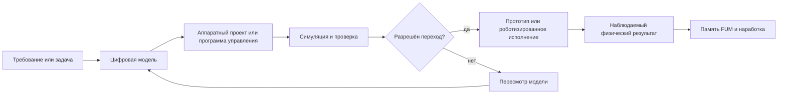

# [Физическое действие FUM](../Глоссарий/физическое-действие-FUM.md) и [аппаратные FUM-узлы](../Глоссарий/аппаратный-FUM-узел.md)

## Требование

В перспективе [FUM](../Глоссарий/FUM.md) должен быть способен действовать не только в программируемом цифровом пространстве, но и на физическом уровне. Это означает, что [FUM](../Глоссарий/FUM.md) должен развиваться как агент, способный проектировать, проверять и использовать материальные реализации своих [FUM-узлов](../Глоссарий/FUM-узел.md), а также связывать цифровое мышление с физическими устройствами, роботизированными исполнителями и производственными процессами.

[Физическое действие FUM](../Глоссарий/физическое-действие-FUM.md) не заменяет цифровую [память](../Глоссарий/память-FUM.md), [агентские циклы](../Глоссарий/агентский-цикл.md) и [модульную](../Глоссарий/модуль-FUM.md) архитектуру. Оно расширяет их в область, где результатом мышления может быть не только документ, код или workflow, но и аппаратный проект, роботизированное действие, производственная операция или изменённая физическая среда.

[FUM](../Глоссарий/FUM.md) должен применять этот физический контур не только к собственным аппаратным частям, но и к вещам, которые нужны людям с заданными характеристиками. Одно из практических назначений такого контура - противодействие [запланированному устареванию](../Глоссарий/запланированное-устаревание.md): переход от пассивного выбора среди навязанных рыночных вариантов к проектированию, проверке и заказу вещей с явно указанным ресурсом, материалами, ремонтопригодностью и условиями приёмки.

## [Аппаратный FUM-узел](../Глоссарий/аппаратный-FUM-узел.md)

[Аппаратный FUM-узел](../Глоссарий/аппаратный-FUM-узел.md) является материальной реализацией вычислительной или управляющей части [FUM](../Глоссарий/FUM.md). Он может включать вычислительные компоненты, сенсоры, исполнительные механизмы, каналы связи, энергетические подсистемы и физические интерфейсы, через которые [FUM](../Глоссарий/FUM.md) наблюдает мир и действует в нём.

Проектирование [аппаратных FUM-узлов](../Глоссарий/аппаратный-FUM-узел.md) должно подчиняться той же фрактальной логике, что и программная архитектура: малые узлы могут входить в сеть, сеть может становиться [FUM-узлом](../Глоссарий/FUM-узел.md) следующего уровня, а устойчивые решения должны оформляться как переносимые [наработки](../Глоссарий/наработка.md) с происхождением, проверочным статусом и [уровнем доступа](../Глоссарий/уровень-доступа.md).

Сенсорные, управляющие и исполнительные контуры [аппаратного FUM-узла](../Глоссарий/аппаратный-FUM-узел.md) являются [устройствами восприятия и действия FUM](../Глоссарий/устройство-восприятия-и-действия-FUM.md). Их устойчивые алгоритмические части должны описываться как [автоматизации FUM](../Глоссарий/автоматизация-FUM.md): с исходными текстами, версиями, конфигурациями, проверками и историей изменений в [памяти](../Глоссарий/память-FUM.md). Для управляющего ядра особенно предпочтительно отделять [чистые функции](../Глоссарий/чистая-функция.md) от реального ввода-вывода и физического воздействия.

[Автоматический орган действия FUM](../Глоссарий/автоматический-орган-действия-FUM.md) задаёт слой между высокоуровневым планом и исполнительными механизмами аппаратного узла. Он должен превращать описание действия в конкретные команды, движения, режимы привода, вызовы инструмента или другие низкоуровневые операции, сохраняя связь с исходным планом, ограничениями и наблюдаемым результатом.

Для [аппаратных FUM-узлов](../Глоссарий/аппаратный-FUM-узел.md) особенно важны:

- спецификация назначения узла, его входов, выходов, физических ограничений и допустимых режимов;
- проверяемая связь между цифровой моделью узла, проектной документацией, прототипом и фактическим устройством;
- учёт надёжности, отказов, износа, ремонта, замены и повторного использования частей;
- различение проектирования, симуляции, изготовления, испытания, эксплуатации и физического вмешательства;
- сохранение сведений о происхождении аппаратной [наработки](../Глоссарий/наработка.md), составе, версии, совместимости и праве передачи.

## Выделенная вычислительная машина

Ближняя аппаратная веха [FUM](../Глоссарий/FUM.md) - не роботизированное действие, а выделенная вычислительная машина для локального агента. Такой узел должен запускать [личного FUM-агента](../Глоссарий/личный-FUM-агент.md), локальную [память](../Глоссарий/память-FUM.md), локальные проверки, инструменты и сильную LLM без обязательного обращения к внешнему API.

Предварительный образ из требования - Mac Studio с памятью класса 512 GB. В этой документации он рассматривается как рабочая гипотеза аппаратного профиля, а не как окончательный выбор. Выделенная машина должна описываться как [аппаратный FUM-узел](../Глоссарий/аппаратный-FUM-узел.md): с составом, назначением, модельным runtime, ограничениями доступа, режимом обновления, резервным копированием и наблюдаемыми проверками работоспособности. Критерии пригодности модели, runtime и аппаратного профиля остаются в [открытом вопросе о локальной LLM и выделенной машине](../Вопросы/2026-06-25_19-50-33_MSK_критерии-локальной-LLM-и-выделенной-машины-FUM.md).

В терминах общей задачи проекта такая выделенная машина является ближайшим [кремниевым субстратом FUM](../Глоссарий/кремниевый-субстрат-FUM.md): физической вычислительной базой, на которой нужно организовать [память](../Глоссарий/память-FUM.md), модельный шаг, [агентский цикл](../Глоссарий/агентский-цикл.md), проверки, интерфейсы и передачу [наработок](../Глоссарий/наработка.md). Поэтому её нужно оценивать не только как мощный компьютер, но и как носитель нового инженерного воплощения уже наблюдаемой многоуровневой структуры мышления.

Если [FUM](../Глоссарий/FUM.md) в будущем дойдёт до проектирования специализированных микрочипов или других высокочастотных аппаратных носителей, физический паспорт такого субстрата должен учитывать не только логическую схему и производительность. Конечная скорость распространения сигналов, задержки межсоединений, распределение тактовых доменов, синхронизация, тепловые режимы и энергетическая цена передачи данных становятся частью архитектуры [аппаратного FUM-узла](../Глоссарий/аппаратный-FUM-узел.md). Поэтому аппаратное проектирование FUM должно описывать вычисление как физически распределённый процесс с локальными ограничениями причинной связности, а не как мгновенное преобразование абстрактного состояния.

Эта веха подробно описана в документе [Локальный агент FUM на выделенной машине](24-локальный-агент-на-выделенной-машине.md). Она не снимает [открытый вопрос о границах аппаратной автономии FUM](../Вопросы/2026-06-22_07-28-43_MSK_границы-аппаратной-автономии-FUM.md): переход от локального вычисления к управлению внешними устройствами, сырыми носителями или физическими исполнителями требует отдельного требования и проверки.

## Сырые носители и интерфейсы [памяти](../Глоссарий/память-FUM.md)

Одним из дальних случаев [физического действия FUM](../Глоссарий/физическое-действие-FUM.md) является системный слой, в котором [аппаратный FUM-узел](../Глоссарий/аппаратный-FUM-узел.md) работает с сырым накопителем или другим низкоуровневым носителем долговременного состояния. Такой слой может построить [виртуализованную среду FUM](../Глоссарий/виртуализованная-среда-FUM.md): заменить сырой интерфейс блоков, байтов или событий файловой системой, графом [памяти](../Глоссарий/память-FUM.md), журналом, объектным хранилищем или другой формой организации.

Это требование не отменяет границы аппаратной автономии. Реальная работа с носителем на голом железе требует отдельного разрешения, симулятора или публикационно чистого контракта, проверки восстановления, наблюдаемой трассы и учёта [открытого вопроса о границах аппаратной автономии FUM](../Вопросы/2026-06-22_07-28-43_MSK_границы-аппаратной-автономии-FUM.md). Ближняя инженерная работа должна начинаться с безопасной программной фикстуры, а не с изменения реального накопителя.

Подробное требование описано в документе [Виртуализованные среды FUM и долговременная память](23-виртуализованные-среды-и-долговременная-память.md).

## [Роботизированная система FUM](../Глоссарий/роботизированная-система-FUM.md)

[FUM](../Глоссарий/FUM.md) должен рассматриваться как возможная основа [роботизированных систем FUM](../Глоссарий/роботизированная-система-FUM.md). В такой системе [FUM](../Глоссарий/FUM.md) связывает [память](../Глоссарий/память-FUM.md), планирование, восприятие, [автоматический орган действия](../Глоссарий/автоматический-орган-действия-FUM.md), управление действиями и обратную связь от физической среды.

[Роботизированная система FUM](../Глоссарий/роботизированная-система-FUM.md) должна сохранять различие между:

- модельным планом действия;
- проверенным цифровым проектом или программой управления;
- физическим исполнением;
- наблюдаемым результатом;
- последствиями для людей, среды, оборудования и будущей [памяти FUM](../Глоссарий/память-FUM.md).

Такое различие нужно для того, чтобы [FUM](../Глоссарий/FUM.md) не смешивал гипотезу, симуляцию и реальное действие. Переход от проекта к физическому исполнению требует отдельной проверки и должен учитывать [открытый вопрос](../Вопросы/2026-06-22_07-28-43_MSK_границы-аппаратной-автономии-FUM.md) о границах аппаратной автономии.

## Схема перехода к [физическому действию](../Глоссарий/физическое-действие-FUM.md)

## [Производственная цепочка FUM](../Глоссарий/производственная-цепочка-FUM.md)

[Производственная цепочка FUM](../Глоссарий/производственная-цепочка-FUM.md) связывает проектирование, снабжение, изготовление, сборку, испытания, эксплуатацию и переработку аппаратных частей в один наблюдаемый процесс. В перспективе [FUM](../Глоссарий/FUM.md) должен уметь не только описывать такую цепочку, но и выстраивать её как управляемую структуру [памяти](../Глоссарий/память-FUM.md), действий, проверок и материальных результатов.

Производственная способность важна для самосовершенствования [FUM](../Глоссарий/FUM.md): если [FUM](../Глоссарий/FUM.md) способен проектировать свои [аппаратные узлы](../Глоссарий/аппаратный-FUM-узел.md), он должен уметь хранить и улучшать знания о том, как эти узлы производятся, проверяются, ремонтируются и заменяются. Поэтому [производственная цепочка FUM](../Глоссарий/производственная-цепочка-FUM.md) является материальным продолжением [наработок](../Глоссарий/наработка.md), а не внешним хозяйственным приложением.

Та же способность должна работать в пользовательском и коллективном режиме. [FUM](../Глоссарий/FUM.md) может помогать человеку или составному [FUM-узлу](../Глоссарий/FUM-узел.md) сформулировать требуемые характеристики товара, найти или подготовить проектную [наработку](../Глоссарий/наработка.md), оценить производимость, собрать группу желающих, рассчитать минимальную партию и подготовить заказ производству. Такой заказ должен быть основан на проверяемой спецификации, а не только на том наборе характеристик, который уже предлагает рынок.

В минимальном виде такая цепочка должна фиксировать:

- исходное требование и назначение аппаратной части;
- проектные файлы, спецификации, модели, допуски и версии;
- требуемые пользовательские характеристики товара: ресурс, материал, ремонтопригодность, совместимость, условия испытаний и приёмки;
- доступные материалы, компоненты, инструменты, оборудование и подрядчиков;
- состав участников коллективного спроса, статус их согласия и ограничения раскрытия персональных данных;
- операции изготовления, сборки, тестирования и приёмки;
- результаты испытаний, выявленные дефекты, исправления и ограничения применения;
- условия публикации, передачи и повторного использования полученной [наработки](../Глоссарий/наработка.md).

## Противодействие [запланированному устареванию](../Глоссарий/запланированное-устаревание.md)

Для FUM проблема [запланированного устаревания](../Глоссарий/запланированное-устаревание.md) является проверкой того, может ли агентский контур вернуть человеку власть над характеристиками вещей. Пользовательский запрос может начинаться не с выбора бренда, а с описания желаемой функции: например, бритвенный станок с долговечной сталью заданной марки, ремонтопригодной конструкцией, известными допусками, проверяемым ресурсом и прозрачной ценой партии.

[FUM](../Глоссарий/FUM.md) должен уметь превратить такую потребность в цепочку:

- сформулировать требование к вещи на языке проверяемых характеристик;
- найти существующие проекты, стандарты, материалы, производителей и ограничения;
- отделить обязательные свойства от желательных и спорных;
- подготовить спецификацию, модель, паспорт испытаний и критерии приёмки;
- собрать желающих без раскрытия лишней личной информации;
- показать стоимость, риски, сроки, минимальную партию и варианты производства;
- сохранить происхождение решений, изменений, согласий, испытаний и итогового заказа в [памяти FUM](../Глоссарий/память-FUM.md).

Такой контур не должен превращать [FUM](../Глоссарий/FUM.md) в безусловного производителя, продавца или гаранта качества. Реальный заказ связан с безопасностью, законодательством, сертификацией, ответственностью, оплатой, поставкой, гарантиями, возвратами и защитой участников. Эти границы пока не определены полностью и вынесены в [открытый вопрос о границах потребительских производственных цепочек FUM](../Вопросы/2026-07-02_16-52-56_MSK_границы-потребительских-производственных-цепочек-FUM.md).

## Земные труднодоступные полигоны

Перед переходом к внеземной добыче [FUM](../Глоссарий/FUM.md) должен рассматривать [земные ресурсные полигоны FUM](../Глоссарий/земной-ресурсный-полигон-FUM.md) как промежуточный учебно-проверочный контур. В таких сценариях Сибирь, Арктика, Антарктида и другие труднодоступные среды выступают не бытовыми примерами, а земными аналогами удалённых, слабо обеспеченных и суровых физических сред, где нужно проверять добычу ресурсов, энергетику, ремонт, автономное снабжение, связь и сохранение [памяти FUM](../Глоссарий/память-FUM.md) в локальном узле.

Практический образ этого слоя - [модуль развёртывания производственной цепочки FUM](../Глоссарий/модуль-развёртывания-производственной-цепочки-FUM.md): переносимый набор аппаратных, роботизированных, энергетических, управляющих и документационных компонентов, который может развернуть минимальную производственную цепочку в заранее выбранной удалённой точке. Такой модуль должен описываться не как один контейнер или устройство, а как воспроизводимая [наработка](../Глоссарий/наработка.md): состав, требования к площадке, сценарий доставки, проверка работоспособности, границы автономии, аварийные режимы, правила сворачивания и перенос результата обратно в память проекта.

Многоразовые ракеты могут рассматриваться как один из дальних транспортных способов доставки таких модулей к неосвоенным и безлюдным точкам, если обычная инфраструктура отсутствует или недостаточна. Это не отменяет различия между модельным сценарием и реальным запуском: выбор точки, траектория, посадка, воздействие на среду, безопасность людей, правовой режим территории и ответственность за последствия требуют отдельного подтверждения до любого физического действия. Неопределённости этого уровня вынесены в [открытый вопрос о границах земных ресурсных полигонов FUM](../Вопросы/2026-07-02_20-08-37_MSK_границы-земных-ресурсных-полигонов-FUM.md).

## Растущая физическая инфраструктура

[Растущая физическая инфраструктура FUM](../Глоссарий/растущая-физическая-инфраструктура-FUM.md) задаёт модельное семейство материальных систем, которые заглубляются, расширяются, ремонтируются или сворачиваются ограниченными проверяемыми стадиями. [Самозаглубляющийся подземный узел](../Глоссарий/самозаглубляющийся-подземный-узел.md) сохраняется как один кандидат этого семейства: управляемо опускаемая либо наращиваемая оболочка с подземными объёмами, резервируемыми инженерными маршрутами и возможными локальными производственно-ремонтными модулями.

Для FUM различаются как минимум вычислительный центр и центр обработки материальных ресурсов. Первый может стать составным [аппаратным FUM-узлом](../Глоссарий/аппаратный-FUM-узел.md), если несёт вычисления, память и связь; второй прежде всего входит в [производственную цепочку FUM](../Глоссарий/производственная-цепочка-FUM.md). Гибридный профиль требует физического разделения чистых вычислительных зон и пыльных, влажных, вибрационных или пожароопасных процессов. Подземная форма сама по себе не доказывает защищённость и не заменяет географическую децентрализацию, теплоотвод, резервное питание, независимые линии связи, доступ, эвакуацию и обслуживание.

Полная декомпозиция концепции, прикладные профили и исследовательские ворота описаны в документе [Растущая физическая инфраструктура FUM](51-растущая-физическая-инфраструктура-FUM.md). На текущей стадии это `R0`: документация и гипотезы без разрешения на физическое действие. Границы вынесены в [открытый вопрос](../Вопросы/2026-08-15_01-18-24_MSK_границы-растущей-физической-инфраструктуры-FUM.md).

## Космический масштаб физического действия

Дальний горизонт [физического действия FUM](../Глоссарий/физическое-действие-FUM.md) - [космическая автономия FUM](../Глоссарий/космическая-автономия-FUM.md). Если [FUM](../Глоссарий/FUM.md) научится связывать проектирование, роботизированное исполнение, производство и ресурсную автономию в земных труднодоступных средах, та же архитектура должна оставаться применимой к внеземным средам: Меркурию, астероидам, ледяным спутникам газовых гигантов, крупным энергетическим инфраструктурам вроде [роя Дайсона](../Глоссарий/рой-Дайсона.md) и последующему [межзвёздному расселению FUM](../Глоссарий/межзвёздное-расселение-FUM.md).

На этом масштабе [производственные цепочки FUM](../Глоссарий/производственная-цепочка-FUM.md) должны учитывать задержки связи, удалённое снабжение, локальное производство, ремонт, переработку материалов, устойчивость к отказам и сохранение [памяти FUM](../Глоссарий/память-FUM.md) в автономных узлах. Подробное требование описано в документе [Космическая автономия FUM и межзвёздное расселение](14-космическая-автономия-и-расселение.md).

## Связь с [модульной архитектурой FUM](../Глоссарий/модуль-FUM.md)

[Физическое действие FUM](../Глоссарий/физическое-действие-FUM.md) должно оставаться продолжением [модульной](../Глоссарий/модуль-FUM.md) архитектуры. Один и тот же принцип узла должен быть применим к программному агенту, [аппаратному FUM-узлу](../Глоссарий/аппаратный-FUM-узел.md), [роботизированной системе FUM](../Глоссарий/роботизированная-система-FUM.md), производственной линии или составному узлу, который объединяет людей, цифровые агенты и физические устройства.

Это требование не означает немедленного наличия всех аппаратных возможностей в первой реализации. Оно задаёт направление проектирования: внутренние интерфейсы, [память](../Глоссарий/память-FUM.md), [наработки](../Глоссарий/наработка.md), уровни проверки и [уровни доступа](../Глоссарий/уровень-доступа.md) должны быть совместимы с будущим переходом от цифрового проектирования к физическим системам.

## Карта ограничителей

[Карта ограничителей физического действия FUM](40-карта-ограничителей-физического-действия-FUM.md) связывает риск, информационный доступ, операционные полномочия, ответственность, наблюдаемую трассу, симулятор и контракт устройства в один консервативный барьер. Её рабочие классы `R0–R4` не являются разрешительными уровнями: неопределённость повышает ограничение, а каждый реальный переход требует отдельного требования, проверки и подтверждения для точного объекта и версии.

Карта отдельно фиксирует земной ресурсный полигон как переходный случай и сохраняет открытыми границы аппаратной, исследовательской, социальной, территориальной и космической автономии. Пока эти границы не прояснены, документирование и моделирование не расширяют права [FUM](../Глоссарий/FUM.md) на физическое исполнение.

## Открытый вопрос

Границы автономного перехода от проектирования к физическому исполнению пока не определены. Требуются отдельные решения о безопасности, подтверждении действий, допустимых видах самосовершенствования, ответственности и контроле производственных цепочек. Эти неопределённости вынесены в [открытый вопрос о границах аппаратной автономии FUM](../Вопросы/2026-06-22_07-28-43_MSK_границы-аппаратной-автономии-FUM.md).

Потребительские производственные цепочки добавляют отдельную социально-экономическую неопределённость: [FUM](../Глоссарий/FUM.md) должен помогать проектировать и заказывать вещи с нужными характеристиками, но пока не определены границы ответственности, проверки качества, сертификации, оплаты, поставки, гарантий и права действовать от имени группы участников. Эта часть вынесена в [открытый вопрос о границах потребительских производственных цепочек FUM](../Вопросы/2026-07-02_16-52-56_MSK_границы-потребительских-производственных-цепочек-FUM.md).

Земные ресурсные полигоны добавляют отдельный переходный риск: добыча в труднодоступных регионах, доставка модулей в безлюдные точки и возможное использование многоразовых ракет требуют правил выбора площадки, экологической допустимости, правового режима, ответственности, наблюдаемости и сворачивания физического контура. Эта часть вынесена в [открытый вопрос о границах земных ресурсных полигонов FUM](../Вопросы/2026-07-02_20-08-37_MSK_границы-земных-ресурсных-полигонов-FUM.md).

Космический масштаб усиливает ту же проблему: внеземная добыча, строительство, обслуживание крупных инфраструктур и [межзвёздное расселение FUM](../Глоссарий/межзвёздное-расселение-FUM.md) требуют отдельного уточнения границ. Эта часть вынесена в [открытый вопрос о границах космической автономии FUM](../Вопросы/2026-06-22_07-40-59_MSK_границы-космической-автономии-FUM.md).

## Источники требований

- [исходный запрос 2026-08-15 01:18:24 MSK — Интегрировать самозаглубляющийся подземный узел](../Журнал/2026-08-15_01-18-24_MSK_интегрировать-самозаглубляющийся-подземный-узел/запрос.md)
- [исходный запрос 2026-06-22 07:28:43 MSK](../Журнал/2026-06-22_07-28-43_MSK/запрос.md)
- [исходный запрос 2026-06-22 07:40:59 MSK](../Журнал/2026-06-22_07-40-59_MSK/запрос.md)
- [исходный запрос 2026-06-22 08:58:31 MSK](../Журнал/2026-06-22_08-58-31_MSK/запрос.md)
- [исходный запрос 2026-06-22 09:11:47 MSK](../Журнал/2026-06-22_09-11-47_MSK/запрос.md)
- [исходный запрос 2026-06-23 19:06:56 MSK](../Журнал/2026-06-23_19-06-56_MSK/запрос.md)
- [исходный запрос 2026-06-25 18:50:18 MSK](../Журнал/2026-06-25_18-50-18_MSK/запрос.md)
- [исходный запрос 2026-06-25 19:50:33 MSK](../Журнал/2026-06-25_19-50-33_MSK/запрос.md)
- [исходный запрос 2026-06-26 12:05:01 MSK](../Журнал/2026-06-26_12-05-01_MSK/запрос.md)
- [исходный запрос 2026-07-01 16:46:04 MSK](../Журнал/2026-07-01_16-46-04_MSK/запрос.md)
- [исходный запрос 2026-07-02 16:52:56 MSK](../Журнал/2026-07-02_16-52-56_MSK/запрос.md)
- [исходный запрос 2026-07-02 20:08:37 MSK](../Журнал/2026-07-02_20-08-37_MSK/запрос.md)
- [исходный запрос 2026-07-23 17:37:10 MSK](../Журнал/2026-07-23_17-37-10_MSK_описать-карту-ограничителей-физического-действия-FUM/запрос.md)

<!-- FUM-MD-RECENCY:BEGIN -->
<!-- last-content-edit: 2026-08-15 01:42:52 MSK -->
<!-- content-sha256: sha256:70a19a949f2d7e5ba131f4a5986c9c48f491c2430fcc7da87d4830ae56a356cb -->
<!-- FUM-MD-RECENCY:END -->
