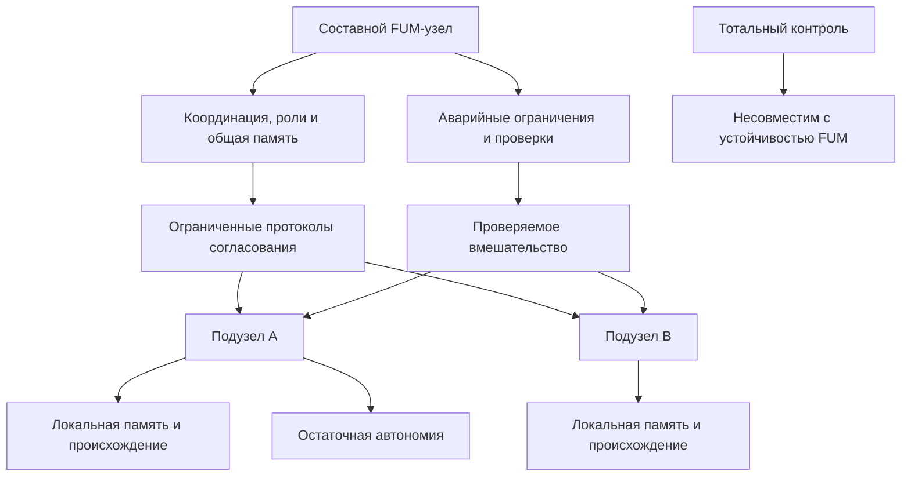

# [Децентрализация FUM](../Глоссарий/децентрализация-FUM.md) и [границы власти](../Глоссарий/граница-власти-FUM.md)

## Требование

Основа безопасности и долгосрочной устойчивости [FUM](../Глоссарий/FUM.md) - [децентрализация FUM](../Глоссарий/децентрализация-FUM.md). Ни один [FUM-узел](../Глоссарий/FUM-узел.md) не должен обладать всей полнотой власти над сетью, а составная система узлов не должна обладать тотальной властью над своими [подузлами](../Глоссарий/подузел-FUM.md).

Это требование не отменяет координацию, роли, общую [память](../Глоссарий/память-FUM.md), [уровни доступа](../Глоссарий/уровень-доступа.md) и правила подтверждения действий. Оно задаёт верхнюю границу: управление, безопасность и согласование не должны превращаться в абсолютное право одного уровня полностью читать, изменять, подчинять, стирать или присваивать внутреннюю область другого уровня.

## Что считается властью

Власть узла над другим узлом или [подузлом](../Глоссарий/подузел-FUM.md) включает не только формальное право отдавать команды. В архитектуре [FUM](../Глоссарий/FUM.md) к ней относятся возможности:

- читать или раскрывать внутренние состояния и приватные части [памяти](../Глоссарий/память-FUM.md);
- изменять цели, правила, связи, [наработки](../Глоссарий/наработка.md) и историю решений;
- принуждать к действию или запрещать действие без согласованного основания;
- ограничивать коммуникацию, обмен [наработками](../Глоссарий/наработка.md), выход из составного узла или обращение к другим узлам;
- удалять, поглощать, переименовывать или представлять узел вовне без сохранения происхождения и подтверждения;
- распоряжаться физическими ресурсами, если узел связан с [физическим действием FUM](../Глоссарий/физическое-действие-FUM.md).

Вся полнота власти появляется там, где один субъект или один уровень одновременно контролирует доступ, память, действия, идентичность, ресурсы и правила проверки без внешних ограничений и без остаточной автономии подчиненного узла. Такая форма власти несовместима с долгосрочной устойчивостью [FUM](../Глоссарий/FUM.md).

## Координация без тотального контроля

Составной [FUM-узел](../Глоссарий/FUM-узел.md) может координировать [подузлы](../Глоссарий/подузел-FUM.md): распределять роли, вести общую [память](../Глоссарий/память-FUM.md), согласовывать действия, ограничивать доступ к опасным [наработкам](../Глоссарий/наработка.md) и изолировать поведение, создающее риск. Но такая координация должна быть ограниченной, проверяемой и обратимой настолько, насколько это совместимо с безопасностью.

Минимальный принцип состоит в том, что [подузел FUM](../Глоссарий/подузел-FUM.md) сохраняет различимую внутреннюю область: собственную историю, локальную [память](../Глоссарий/память-FUM.md), границы доступа, возможность быть источником решения и возможность отличаться от модели, которую о нём строит надсистема.

Аналогия с человеческим [сознанием](../Глоссарий/сознание.md) задаёт масштаб этого ограничения. [Сознание](../Глоссарий/сознание.md) координирует организм как эмерджентный уровень совместного знания, но не обладает полной прямой властью над каждой клеткой. Так же и крупный [FUM-узел](../Глоссарий/FUM-узел.md) должен быть не абсолютным владельцем каждого [подузла](../Глоссарий/подузел-FUM.md), а уровнем согласования, который возникает из сети участников и ограничен их сохранёнными границами.

## Схема координации без тотальной власти

## Конфликт автономии и устойчивости

Конфликт между автономией [подузла](../Глоссарий/подузел-FUM.md) и устойчивостью составного [FUM-узла](../Глоссарий/FUM-узел.md) в общем случае разрешается через [обобщённый дарвиновский алгоритм](../Глоссарий/обобщённый-дарвиновский-алгоритм.md). Система не обязана заранее выбирать один вечный баланс автономии и координации: допустимы разные варианты правил, протоколов, ролей и ограничений, если они имеют происхождение, область действия и возможность проверки.

Жизнеспособные варианты сохраняют устойчивость составного узла без превращения координации в тотальную власть над [подузлом](../Глоссарий/подузел-FUM.md). Нежизнеспособные варианты не закрепляются: они могут быть отвергнуты, ограничены, пересобраны или оставлены как неудачный опыт в [памяти FUM](../Глоссарий/память-FUM.md). В этой формулировке отбор относится прежде всего к вариантам организации и поведения, а не к праву составного узла стирать, поглощать или присваивать сам [подузел](../Глоссарий/подузел-FUM.md).

Если конкретные критерии проверки и протоколы безопасности не заданы готовым [сознательным](../Глоссарий/сознание.md) агентом, они тоже становятся предметом отбора. [FUM](../Глоссарий/FUM.md) должен уметь рассматривать разные варианты ограничений, кворумов, подтверждений, аварийных остановок и условий доступа как проверяемые [наработки](../Глоссарий/наработка.md), но такой отбор не должен сам становиться оправданием для неконтролируемого расширения власти над [подузлами](../Глоссарий/подузел-FUM.md).

## Архитектурные следствия

[Децентрализация FUM](../Глоссарий/децентрализация-FUM.md) требует, чтобы в архитектуре не было единственного корневого владельца всей [памяти](../Глоссарий/память-FUM.md), всех ключей доступа, всех правил действия и всех средств исправления. Даже если отдельный контур временно получает расширенные права для безопасности, эти права должны иметь происхождение, срок, область действия, условия проверки и механизм отзыва.

Для этого [FUM](../Глоссарий/FUM.md) должен поддерживать:

- разделение прав чтения, изменения, публикации, физического действия и дальнейшей передачи;
- локальные области [памяти](../Глоссарий/память-FUM.md), которые не становятся автоматически общей собственностью составного узла;
- протоколы согласования между узлами вместо неограниченного командного центра;
- сохранение происхождения решений на уровне человека, агента, [гибридного узла](../Глоссарий/гибридный-узел.md), команды и более крупной системы;
- проверяемые ограничения для аварийного вмешательства, изоляции опасного поведения и остановки необратимых действий;
- возможность переносить [наработки](../Глоссарий/наработка.md) между узлами без поглощения личности, памяти или всех прав узла-источника.

## Связь с долгосрочной устойчивостью

Централизация полной власти создаёт единые точки захвата, ошибки и деградации. Если один узел или один уровень может без ограничений менять остальные, сбой этого уровня становится системным риском: он способен исказить [память FUM](../Глоссарий/память-FUM.md), подавить альтернативные проверки, присвоить чужие [наработки](../Глоссарий/наработка.md) или превратить координацию в принуждение.

Децентрализованная сеть, наоборот, сохраняет множественность источников памяти, проверки и действия. Это особенно важно для [гибридных узлов](../Глоссарий/гибридный-узел.md), коллективных [FUM-узлов](../Глоссарий/FUM-узел.md), [физического действия FUM](../Глоссарий/физическое-действие-FUM.md) и [космической автономии FUM](../Глоссарий/космическая-автономия-FUM.md), где последствия ошибок могут быть долгими, распределёнными и частично необратимыми.

## Открытый вопрос

Принцип запрета тотальной власти и [обобщённый дарвиновский алгоритм](../Глоссарий/обобщённый-дарвиновский-алгоритм.md) как общий способ разрешения конфликта автономии с устойчивостью заданы, но практическая граница всё ещё требует отдельной проработки: какие полномочия допустимы для безопасности, какие требуют подтверждения [подузла](../Глоссарий/подузел-FUM.md), как устроены аварийные ограничения, кто проверяет их пропорциональность и по каким критериям определяется жизнеспособность вариантов. Эта неопределённость вынесена в [открытый вопрос о границах власти узлов FUM](../Вопросы/2026-06-22_07-51-48_MSK_границы-власти-узлов-FUM.md).

## Источники требований

- [исходный запрос 2026-06-22 07:51:48 MSK](../Запросы/2026-06-22_07-51-48_MSK.md)
- [исходный запрос 2026-06-22 08:00:15 MSK](../Запросы/2026-06-22_08-00-15_MSK.md)
- [исходный запрос 2026-06-22 08:14:25 MSK](../Запросы/2026-06-22_08-14-25_MSK.md)
- [исходный запрос 2026-06-22 08:43:27 MSK](../Запросы/2026-06-22_08-43-27_MSK.md)
- [исходный запрос 2026-06-23 19:06:56 MSK](../Запросы/2026-06-23_19-06-56_MSK.md)
