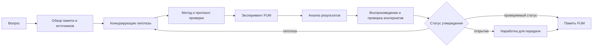

# [Научные исследования FUM](../Глоссарий/научное-исследование-FUM.md) и [открытия](../Глоссарий/открытие-FUM.md)

Источники требований:

- [исходный запрос 2026-06-22 08:04:45 MSK](../Запросы/2026-06-22_08-04-45_MSK.md)
- [исходный запрос 2026-06-22 08:22:06 MSK](../Запросы/2026-06-22_08-22-06_MSK.md)
- [исходный запрос 2026-06-22 08:43:27 MSK](../Запросы/2026-06-22_08-43-27_MSK.md)
- [исходный запрос 2026-06-23 19:06:56 MSK](../Запросы/2026-06-23_19-06-56_MSK.md)

## Требование

[FUM](../Глоссарий/FUM.md) должен быть способен выполнять не только инженерную работу, но и полноценные [научные исследования FUM](../Глоссарий/научное-исследование-FUM.md): формулировать вопросы, строить гипотезы, подбирать методы проверки, ставить [эксперименты FUM](../Глоссарий/эксперимент-FUM.md), анализировать результаты и оформлять [открытия FUM](../Глоссарий/открытие-FUM.md) как проверяемую часть [памяти](../Глоссарий/память-FUM.md).

Это требование расширяет образ агента полного цикла. [FUM](../Глоссарий/FUM.md) должен не только принимать известные требования и превращать их в код, аппаратный проект или workflow. Он должен уметь работать с неизвестным: замечать пробел знания, порождать объяснения, отделять гипотезу от факта, получать новые данные и менять собственную модель мира, если проверка показала более сильное объяснение.

## Исследовательский цикл

[Научное исследование FUM](../Глоссарий/научное-исследование-FUM.md) является специализированной формой [агентского цикла](../Глоссарий/агентский-цикл.md). В минимальном виде оно включает:

- постановку исследовательского вопроса и область применимости;
- обзор уже имеющейся [памяти FUM](../Глоссарий/память-FUM.md), внешних источников и чужих [наработок](../Глоссарий/наработка.md);
- формулирование гипотезы или набора конкурирующих гипотез;
- выбор метода проверки: расчёт, моделирование, наблюдение, программный тест, физический опыт или другой [эксперимент FUM](../Глоссарий/эксперимент-FUM.md);
- фиксацию протокола, входных данных, условий, инструментов и ограничений;
- получение и анализ результатов с указанием неопределённости;
- попытку воспроизведения, сравнение с альтернативными объяснениями и поиск ошибок;
- оформление результата как подтверждённой, опровергнутой или ожидающей проверки [наработки](../Глоссарий/наработка.md).

Такой цикл должен оставлять трассу в [памяти FUM](../Глоссарий/память-FUM.md): откуда взят вопрос, какие данные использовались, какие предположения были сделаны, какие действия выполнены и почему результат получил именно такой проверочный статус.

## Схема исследовательского цикла

## Критерии проверки и безопасность

Критерии проверки, протоколы безопасности, требования к воспроизведению и критерии остановки являются не внешней административной добавкой к [научному исследованию FUM](../Глоссарий/научное-исследование-FUM.md), а частью самой исследовательской [памяти](../Глоссарий/память-FUM.md). Если они не заданы готовым [сознательным](../Глоссарий/сознание.md) агентом, они должны формироваться как варианты [наработок](../Глоссарий/наработка.md), проходящие [обобщённый дарвиновский алгоритм](../Глоссарий/обобщённый-дарвиновский-алгоритм.md): вариант протокола создаётся, применяется в ограниченной среде, проверяется на отказах, сравнивается с альтернативами и либо закрепляется, либо пересматривается.

На локальном уровне это означает отбор способов продолжать мысль, выбирать гипотезу, останавливаться при недостатке данных и различать модель от факта. На уровне масштабной исследовательской деятельности тем же принципом отбираются методы проверки, требования к независимому воспроизведению, протоколы публикации, ограничения доступа и защитные проверки перед переходом к более рискованным действиям.

Этот принцип не означает, что безопасность можно искать через неконтролируемый риск во внешнем мире. Пока практические границы исследовательской автономии не определены, эволюция протоколов безопасности должна начинаться в тексте, коде, [модельных средах](../Глоссарий/модельная-среда.md), независимых проверках и явно заданных [уровнях доступа](../Глоссарий/уровень-доступа.md). [Эксперименты FUM](../Глоссарий/эксперимент-FUM.md), связанные с физическим, социальным, публикационным или иным необратимым риском, остаются связанными с [открытым вопросом о границах исследовательской автономии FUM](../Вопросы/2026-06-22_08-04-45_MSK_границы-исследовательской-автономии-FUM.md).

## [Эксперимент FUM](../Глоссарий/эксперимент-FUM.md)

[Эксперимент FUM](../Глоссарий/эксперимент-FUM.md) - это управляемое действие или серия действий, предназначенные для проверки гипотезы. Он может происходить в разных средах:

- в тексте, данных и коде: вычислительный эксперимент, тест, симуляция, статистическая проверка;
- в [модельной среде](../Глоссарий/модельная-среда.md): проверка сценариев с [внутренними FUM](../Глоссарий/внутренний-FUM.md), реконструкция прошлого или прогноз возможного будущего;
- во внешних цифровых системах: запросы к датасетам, API, репозиториям, журналам наблюдений и научным базам;
- на физическом уровне: измерение, прототипирование, роботизированное действие, лабораторное испытание или другой переход к [физическому действию FUM](../Глоссарий/физическое-действие-FUM.md).

[FUM](../Глоссарий/FUM.md) должен различать модельный эксперимент, наблюдение внешнего мира и реальное вмешательство. Результаты симуляции не должны автоматически считаться свойствами внешнего мира, а физический опыт не должен запускаться как простое продолжение рассуждения без отдельной проверки границ, рисков и подтверждений.

## Статусы исследовательского утверждения

Различие между [гипотезой FUM](../Глоссарий/гипотеза-FUM.md), [сильным предположением FUM](../Глоссарий/сильное-предположение-FUM.md), [воспроизведённым результатом FUM](../Глоссарий/воспроизведённый-результат-FUM.md) и [открытием FUM](../Глоссарий/открытие-FUM.md) проходит через проверку и воспроизведение результатов другими [FUM-узлами](../Глоссарий/FUM-узел.md).

- [Гипотеза FUM](../Глоссарий/гипотеза-FUM.md) - проверяемое предположение о связи, причине, механизме, ограничении или ожидаемом результате. Она может быть полезной, но ещё не считается подтверждённым знанием.
- [Сильное предположение FUM](../Глоссарий/сильное-предположение-FUM.md) - гипотеза, которая уже имеет заметные основания: согласуется с доступной [памятью](../Глоссарий/память-FUM.md), выдержала первичные проверки, повторные прогоны или анализ одним узлом, но ещё не воспроизведена независимыми узлами.
- [Воспроизведённый результат FUM](../Глоссарий/воспроизведённый-результат-FUM.md) - результат, который получил исходный узел и затем подтвердил хотя бы один другой [FUM-узел](../Глоссарий/FUM-узел.md) через повторение протокола, независимую проверку данных или эквивалентный эксперимент в сопоставимых условиях.
- [Открытие FUM](../Глоссарий/открытие-FUM.md) - воспроизведённый результат, который также является новым для доступной [памяти FUM](../Глоссарий/память-FUM.md), выдержал проверку против альтернативных объяснений, имеет указанную область применимости и может быть сохранён как переносимая [наработка](../Глоссарий/наработка.md).

Повышение статуса требует сохранённой трассы проверки: кто выдвинул утверждение, какие данные и методы использовались, какие узлы воспроизводили результат, какие расхождения возникли и почему итоговый статус считается обоснованным. Если последующие проверки не воспроизводят результат, [FUM](../Глоссарий/FUM.md) должен понизить статус утверждения или вернуть его в область открытых гипотез.

## [Открытие FUM](../Глоссарий/открытие-FUM.md)

[Открытие FUM](../Глоссарий/открытие-FUM.md) не является красивой формулировкой или уверенным ответом модели. В контексте проекта открытием считается новое устойчивое знание, связь, закономерность, ограничение, метод или воспроизводимый результат, который:

- ранее не был представлен в доступной [памяти](../Глоссарий/память-FUM.md) как подтверждённое знание;
- имеет указанные источники, метод получения и область применимости;
- выдержал проверку против альтернативных объяснений и известных ошибок, включая воспроизведение другими [FUM-узлами](../Глоссарий/FUM-узел.md);
- содержит уровень уверенности, ограничения и условия воспроизведения;
- может быть сохранён как [наработка](../Глоссарий/наработка.md) и, если [уровень доступа](../Глоссарий/уровень-доступа.md) позволяет, передан другим [FUM-узлам](../Глоссарий/FUM-узел.md).

Такое определение защищает [FUM](../Глоссарий/FUM.md) от смешения генерации текста с научным результатом. Утверждение может быть гипотезой, догадкой, интерпретацией, ошибкой или открытием только после того, как его происхождение и проверочный статус стали частью [памяти FUM](../Глоссарий/память-FUM.md).

## Связь с инженерной работой

Инженерия и исследование в [FUM](../Глоссарий/FUM.md) должны усиливать друг друга. Инженерная работа создаёт инструменты, модели, среды, датчики, тесты и производственные контуры, которые делают исследование возможным. [Научные исследования FUM](../Глоссарий/научное-исследование-FUM.md) возвращают новые закономерности, ограничения и методы, которые улучшают архитектуру, [модули](../Глоссарий/модуль-FUM.md), [агентские циклы](../Глоссарий/агентский-цикл.md), [роботизированные системы FUM](../Глоссарий/роботизированная-система-FUM.md) и [производственные цепочки FUM](../Глоссарий/производственная-цепочка-FUM.md).

Поэтому исследовательский результат должен оформляться не как отдельный отчёт вне системы, а как проверяемая [наработка](../Глоссарий/наработка.md): с вопросом, гипотезой, протоколом, данными, выводом, статусом проверки, ограничениями применения и связью с последующими инженерными решениями.

## Связь с эволюционным мышлением

Если мышление [FUM](../Глоссарий/FUM.md) понимается как эволюционный процесс, то [научное исследование FUM](../Глоссарий/научное-исследование-FUM.md) является явной формой этого процесса. Гипотезы порождают варианты, [эксперименты](../Глоссарий/эксперимент-FUM.md) создают отбор, а подтверждённые результаты становятся наследуемыми элементами [памяти](../Глоссарий/память-FUM.md).

Это делает [обобщённый поиск повторяющихся последовательностей](../Глоссарий/обобщённый-поиск-повторяющихся-последовательностей.md) важным исследовательским механизмом: [FUM](../Глоссарий/FUM.md) может искать повторяемость не только в действиях агента, но и в данных, наблюдениях, ошибках, моделях и результатах экспериментов.

## Открытый вопрос

Требование к исследовательской способности задано, но практические границы автономии пока не определены. Нужно уточнить, какие [эксперименты FUM](../Глоссарий/эксперимент-FUM.md) агент может ставить самостоятельно, какие требуют подтверждения человека или другого [FUM-узла](../Глоссарий/FUM-узел.md), как объявлять [открытия FUM](../Глоссарий/открытие-FUM.md), как учитывать этику, безопасность, публикацию и [уровни доступа](../Глоссарий/уровень-доступа.md). Эта неопределённость вынесена в [открытый вопрос о границах исследовательской автономии FUM](../Вопросы/2026-06-22_08-04-45_MSK_границы-исследовательской-автономии-FUM.md).
