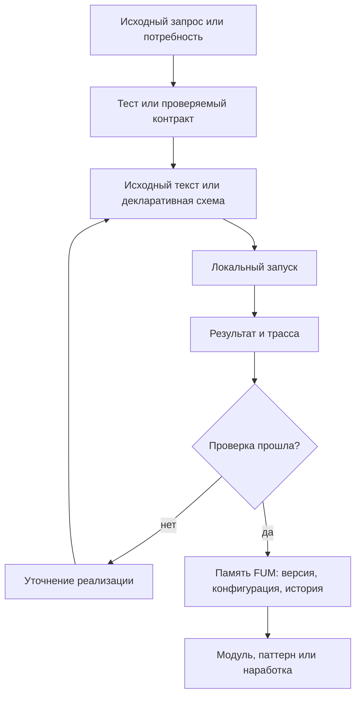

# Воспроизводимые [автоматизации FUM](../Глоссарий/автоматизация-FUM.md)

## Требование

Устойчивые автоматические алгоритмические структуры [FUM](../Глоссарий/FUM.md) должны быть предсказуемыми и воспроизводимыми. Это относится к [автоматизациям FUM](../Глоссарий/автоматизация-FUM.md), [автоматическим органам восприятия FUM](../Глоссарий/автоматический-орган-восприятия-FUM.md), [автоматическим органам действия FUM](../Глоссарий/автоматический-орган-действия-FUM.md), [устройствам восприятия и действия FUM](../Глоссарий/устройство-восприятия-и-действия-FUM.md), workflow, проверкам, преобразованиям [памяти](../Глоссарий/память-FUM.md), интерфейсным механизмам и визуализации на дисплее.

[Автоматизация FUM](../Глоссарий/автоматизация-FUM.md) не должна существовать только как неявное поведение запущенной системы. Если структура становится устойчивой частью работы [FUM](../Глоссарий/FUM.md), её исходные тексты, конфигурации, схемы данных, версии и история изменений должны быть частью [памяти FUM](../Глоссарий/память-FUM.md).

## Граница понятия

К [автоматизациям FUM](../Глоссарий/автоматизация-FUM.md) относятся любые закреплённые алгоритмические структуры, которые:

- принимают наблюдения, события, состояние [памяти](../Глоссарий/память-FUM.md) или команды;
- сжимают широкий входной поток внешнего события до компактного описания;
- разворачивают высокоуровневое описание действия до низкоуровневых действий исполнительных механизмов;
- преобразуют данные, выбирают действия, запускают проверки или строят представления;
- управляют [агентским циклом](../Глоссарий/агентский-цикл.md), workflow, инструментом, интерфейсом или аппаратным контуром;
- производят результат, который влияет на [внутреннее состояние](../Глоссарий/внутреннее-состояние.md), пользовательскую поверхность, физическое действие или следующую [наработку](../Глоссарий/наработка.md).

Автоматизация может быть программным кодом, декларативной схемой, графом состояний, набором правил, шаблоном вызова инструментов, визуализационным пайплайном, управляющим контуром сенсора или исполнительного устройства. Форма может различаться, но требование сохраняется: устойчивое поведение должно иметь восстановимый источник.

## Потенциально повторяемые задачи

[Автоматизация FUM](../Глоссарий/автоматизация-FUM.md) нужна не только там, где задача уже многократно повторилась. Если задача выглядит потенциально повторяемой, [FUM](../Глоссарий/FUM.md) должен рассматривать её как ранний кандидат на автоматизацию уже при первом выполнении. Важный сигнал - не частота в прошлом, а ожидаемая польза от повторного запуска, единой методики, сравнимости результатов, проверки или передачи процедуры другому агенту.

К таким задачам относятся оценки трудоёмкости и стоимости, сводные таблицы, обновляемые описания, проверки связности, сбор статистики, построение отчётов, преобразование источников и другие действия, где ручной результат быстро становится скрытой методикой. Если автоматизация не создаётся сразу, [память FUM](../Глоссарий/память-FUM.md) должна явно хранить ручной статус результата, причину отсрочки и ближайший шаг к автоматизации.

Минимально допустимый первый слой для потенциально повторяемой задачи - проверяемый шаблон, декларативный контракт, фикстура, сценарий запуска или список критериев приёмки. Полноценный скрипт может появиться позже, но сама потребность не должна теряться между [исходным запросом](../Глоссарий/исходный-запрос.md), [журналом работ](../Глоссарий/журнал-работ.md), планированием и коммитом.

## Предсказуемость и воспроизводимость

Предсказуемость означает, что по исходным данным, версии автоматизации, конфигурации, окружению и доступным внешним состояниям можно понять, почему получен именно такой результат. Воспроизводимость означает, что повторение автоматизации в сопоставимых условиях даёт тот же результат или объяснимое расхождение.

Если автоматизация использует недетерминированные элементы, [FUM](../Глоссарий/FUM.md) должен фиксировать их явно: seed, версию модели, время, состояние внешнего сервиса, доступный снимок среды, уровень неопределённости, ограничения доступа и другие источники расхождения. Непредсказуемость не должна прятаться внутри автоматизации как скрытый побочный эффект.

## Исходные тексты и история изменений

Для устойчивой [автоматизации FUM](../Глоссарий/автоматизация-FUM.md) в [памяти](../Глоссарий/память-FUM.md) должны сохраняться:

- исходные тексты или декларативные описания автоматизации;
- конфигурации, зависимости, версии моделей и параметры окружения;
- входные и выходные схемы, включая допустимые ошибки и неопределённости;
- тесты, контрольные примеры, трассы запусков и критерии приёмки;
- история изменений, причины изменений и связь с [исходными запросами](../Глоссарий/исходный-запрос.md);
- сведения о [уровне доступа](../Глоссарий/уровень-доступа.md), публикации, передаче и повторном использовании;
- связь с коммитами, [наработками](../Глоссарий/наработка.md), [модулями](../Глоссарий/модуль-FUM.md) и затронутой [производной документацией](../Глоссарий/производная-документация.md).

Если автоматизация не может быть полностью опубликована из-за секретов, приватных данных или внешних ограничений, [память FUM](../Глоссарий/память-FUM.md) всё равно должна хранить разрешённую форму: метаданные, интерфейсный контракт, описание недоступных частей, проверочный статус и причину ограничения.

## [Язык автоматизаций FUM](../Глоссарий/язык-автоматизаций-FUM.md)

Для устойчивых автоматизаций нужен [язык автоматизаций FUM](../Глоссарий/язык-автоматизаций-FUM.md): язык программирования и описания автоматизаций, оптимизированный для работы с ним со стороны LLM. Такой язык должен позволять модели читать, генерировать, объяснять, проверять и точечно править автоматизацию без потери воспроизводимости и происхождения.

В этом языке автоматизация должна выражать не только вычислительные шаги, но и входные и выходные схемы, разрешённые эффекты, границы доступа, подтверждения, тесты, трассы запусков, версии и связь с [исходными запросами](../Глоссарий/исходный-запрос.md). Иначе смысл автоматизации остаётся распределённым между кодом, комментариями, скрытым состоянием агента и устной договоренностью.

Оптимизация для LLM требует небольшой строгой грамматики, канонического форматирования, явных эффектов, локальных областей правки и проверочных сообщений, которые указывают на конкретные фрагменты исходного текста. Первое подробное требование описано в документе [LLM-ориентированный язык автоматизаций](21-LLM-ориентированный-язык-автоматизаций.md).

## Локальное воспроизведение, тесты и [TDD](../Глоссарий/TDD.md)

[FUM](../Глоссарий/FUM.md) должен стремиться локально воспроизводить в [памяти](../Глоссарий/память-FUM.md) все [автоматизации FUM](../Глоссарий/автоматизация-FUM.md), которые реально используются в работе проекта. Локальное воспроизведение означает, что для автоматизации сохраняется не только описание намерения, но и проверяемый носитель поведения: исходный текст или декларативная схема, команда запуска, конфигурация, минимальные входные примеры, ожидаемые результаты и тесты.

Если автоматизация зависит от внешней модели, сервиса, закрытого приложения, прав доступа или непубликуемых данных, локальная [память FUM](../Глоссарий/память-FUM.md) должна хранить воспроизводимую границу этой зависимости. Такой границей может быть адаптер, интерфейсный контракт, локальный симулятор, фикстура, снимок разрешённых данных, отчёт о невоспроизводимой части или ручная процедура проверки. Невозможность полного локального запуска не отменяет обязанности сохранить то, что можно проверить без секрета и без скрытого состояния.

Разработка новых и изменяемых автоматизаций ведётся через [TDD](../Глоссарий/TDD.md): ожидаемое поведение сначала формулируется как локальный тест или проверка, затем реализация доводится до прохождения этой проверки, а после этого код и тесты уточняются без потери исходного проверяемого контракта. Для уже существующих автоматизаций допустимы характеризационные тесты: они фиксируют фактическое поведение перед изменением и постепенно сужают область непроверенного.

Базовый тестовый набор автоматизации должен запускаться локально, быть публикационно чистым и не требовать сетевых вызовов, секретов или актуального состояния внешнего сервиса. Интеграционные проверки с внешним состоянием могут существовать отдельно, но должны явно описывать свои зависимости, ограничения и причину, по которой они не входят в обычный локальный набор.

## [Реестр системных приложений и инструментов](../Глоссарий/реестр-системных-приложений-и-инструментов.md)

Чтобы [автоматизации FUM](../Глоссарий/автоматизация-FUM.md) и рабочие сессии оставались воспроизводимыми, [память FUM](../Глоссарий/память-FUM.md) должна хранить не только итоговые файлы и команды, но и сведения об инструментах, через которые выполнялась работа.

[Реестр системных приложений и инструментов](../Инструменты/реестр-системных-приложений-и-инструментов.md) служит устойчивым справочником таких зависимостей: системных приложений, CLI-команд, инструментов среды агента, MCP-инструментов, локальных скриптов и внешних сервисов. Для каждого повторно используемого инструмента фиксируются назначение, способ проверки версии, известные ограничения и публикационно чистая граница наблюдаемости.

Файл каждого [исходного запроса](../Глоссарий/исходный-запрос.md) должен содержать раздел `## Использованные инструменты`. Этот раздел хранит фактический снимок конкретной [рабочей сессии](../Глоссарий/рабочая-сессия.md): какие инструменты были применены, какие версии были доступны, где версия не раскрывалась средой и на какую запись реестра можно опереться. Так цепочка требования включает не только запрос, производную документацию и коммит, но и инструментальную среду выполнения.

Если инструмент зависит от внешнего сервиса, закрытого приложения, текущей модели или MCP-сервера, точная версия может быть недоступна. В этом случае фиксируется не выдуманная версия, а проверяемый контракт: имя инструмента, поставщик среды, дата использования, известные ограничения и причина, по которой полный снимок нельзя воспроизвести локально.

## Архивирование прикрепляемых материалов

[Архивирование прикрепляемых материалов](../Планирование/MVP-кандидаты/02-архивирование-прикрепляемых-материалов/README.md) выбрано текущим активным MVP-контуром [FUM](../Глоссарий/FUM.md). Эта автоматизация относится к воспринимающему слою [памяти FUM](../Глоссарий/память-FUM.md): она превращает внешний URL, расшаренный диалог, документ или вложение в локальный источник с происхождением, публикационно чистым извлечением и связью с [исходным запросом](../Глоссарий/исходный-запрос.md).

Минимальный контракт этого контура:

- материал с устойчивым URL сохраняется в канонической папке `Источники/URL/<scheme>/<host>/<path...>/`, а query и fragment добавляются только через хэшированные сегменты, если меняют содержание;
- папка источника содержит сырой или максимально близкий к сырому слой, извлечённый текст или структурные данные, `extraction-report.md` и человекочитаемый `source-index.md`;
- файл [исходного запроса](../Глоссарий/исходный-запрос.md), который привел материал в проект, содержит раздел `## Прикрепляемые материалы` со ссылками на папку источника, индекс и отчёт;
- повторный запуск для того же URL и того же запроса не создаёт дублирующиеся ссылки или бессмысленную копию источника;
- локальный тестовый набор проверяет чистые части поведения без сети и секретов, а внешние ограничения фиксируются в отчёте об извлечении.

Первой реализуемой областью остаётся `Инструменты/fum-request-materials/scripts/archive-chatgpt-share.py`, потому что расшаренные диалоги уже используются как источник требований и имеют локальные фикстуры поведения. Следующий слой должен обобщить этот контракт для обычных URL и файловых материалов без привязки к одному формату страницы.

## Схема воспроизводимой [автоматизации](../Глоссарий/автоматизация-FUM.md)

## [Чистые функции](../Глоссарий/чистая-функция.md) как паттерн

Идея [чистой функции](../Глоссарий/чистая-функция.md) является предпочтительным паттерном для ядра [автоматизаций FUM](../Глоссарий/автоматизация-FUM.md). Там, где это возможно, автоматизация должна разделяться на две части:

- чистое ядро, которое из явно переданных входов, состояния и конфигурации строит результат без скрытых побочных эффектов;
- оболочки ввода-вывода, которые читают среду, вызывают инструменты, меняют файлы, показывают интерфейс, управляют устройствами или выполняют другие действия с внешним миром.

Такое разделение не запрещает действия. Оно делает границу действия явной: [FUM](../Глоссарий/FUM.md) может отдельно проверять преобразование данных, отдельно наблюдать побочные эффекты и отдельно фиксировать результат в [памяти](../Глоссарий/память-FUM.md).

## Устройства восприятия, действия и дисплей

[Устройства восприятия и действия FUM](../Глоссарий/устройство-восприятия-и-действия-FUM.md) должны проектироваться как воспроизводимые контуры. Устройство восприятия должно фиксировать, из какого сигнала, снимка, события или состояния получено наблюдение. Устройство действия должно фиксировать, из какого состояния, решения и версии автоматизации возникло действие.

Визуализация на дисплее также является частью этого требования. Видимое пользователю состояние должно быть производным от явного снимка данных, версии визуализационной автоматизации и правил отображения. Если экран показывает состояние, которое невозможно восстановить из [памяти](../Глоссарий/память-FUM.md) или агентски доступного снимка, возникает слепая зона [внутреннего состояния](../Глоссарий/внутреннее-состояние.md).

## Автоматические органы восприятия

[Автоматический орган восприятия FUM](../Глоссарий/автоматический-орган-восприятия-FUM.md) является устойчивой восприятийной автоматизацией. Его смысл состоит в том, чтобы при внешнем событии быстро и автоматически сжать широкий входной поток до лаконичного компактного описания, которое уже может быть полностью сохранено в [памяти FUM](../Глоссарий/память-FUM.md) и обработано LLM внутри [FUM](../Глоссарий/FUM.md), локальной или внешней.

Для воспроизводимости такой орган должен фиксировать не только итоговое описание, но и происхождение события, канал, время, версию автоматизации, параметры сжатия, уровень уверенности и известные потери деталей. Если исходный поток слишком велик, приватен или технически недоступен для полного сохранения, [FUM](../Глоссарий/FUM.md) должен явно хранить границу между сохранённым компактным описанием и несохранённой частью потока.

## Автоматические органы действия

[Автоматический орган действия FUM](../Глоссарий/автоматический-орган-действия-FUM.md) является устойчивой деятельной автоматизацией. Его смысл состоит в том, чтобы разворачивать высокоуровневые описания действий, созданные LLM или другим способом, в конкретные низкоуровневые действия исполнительных механизмов: физические движения, управляющие сигналы, вызовы инструментов, операции интерфейса или программные команды.

В биологической аналогии такой орган является аналогом человеческого мозжечка: он связывает намерение и план с координированным исполнением. Для воспроизводимости орган действия должен фиксировать исходное описание действия, версию автоматизации, выбранные низкоуровневые шаги, целевую среду, ограничения доступа, ошибки, отклонения и наблюдаемый результат.

## Адресные описания

Построение [описаний FUM для адресатов](../Глоссарий/описание-FUM-для-адресата.md) является частным случаем воспроизводимой [автоматизации FUM](../Глоссарий/автоматизация-FUM.md). Такая автоматизация принимает явный набор источников из [памяти FUM](../Глоссарий/память-FUM.md), паспорт адресата, правила отбора тезисов и структуру результата, а на выходе даёт адресный Markdown-файл с источниками и ограничениями.

Базовая схема закреплена в [Построении описания FUM для адресата](../Описания/Автоматизации/построение-описания-FUM-для-адресата.md). Она нужна, чтобы адресные материалы можно было пересобрать с нуля после изменения документации, проверить на неподтверждённые утверждения и обновить без потери связи с требованиями.

Адресные описания не должны обновляться точечными ручными правками. Каждое создание, исправление или обновление описания должно быть оформлено как вызов соответствующей автоматизации и полная пересборка результата, чтобы сама рабочая сессия подтверждала, что автоматизация остаётся применимой к текущей [памяти FUM](../Глоссарий/память-FUM.md).

## Сводные статьи документации

Сводные статьи [производной документации](../Глоссарий/производная-документация.md) являются ещё одним частным случаем воспроизводимой [автоматизации FUM](../Глоссарий/автоматизация-FUM.md). Они нужны, когда тема уже раскрыта в нескольких документах, но для работы с [памятью FUM](../Глоссарий/память-FUM.md) требуется одна входная карта, как это сделано для [архитектуры FUM](../Глоссарий/архитектура-FUM.md).

Для таких статей закреплена локальная автоматизация [fum-doc-aggregation](../Инструменты/fum-doc-aggregation/SKILL.md). Её проверяемое ядро принимает JSON-конфигурацию с темой, целью, исходным запросом, опорными документами и ожидаемыми разделами, строит канонический Markdown-каркас и валидирует готовый документ через скрипт [build-doc-aggregation.py](../Инструменты/fum-doc-aggregation/scripts/build-doc-aggregation.py).

Граница этой автоматизации принципиальна: скрипт проверяет происхождение, структуру и ссылки, но не подменяет смысловой синтез. Агент должен читать источники, собирать общую карту темы, сохранять ссылки на глоссарий и фиксировать [открытые вопросы](../Глоссарий/открытый-вопрос.md), если между опорными документами обнаруживается противоречие или неоднозначность.

## Оценочные материалы

Оценочные материалы в `Оценки/` являются повторяемым аналитическим слоем [памяти FUM](../Глоссарий/память-FUM.md). Они нужны, когда проекту требуется понять масштаб уже выполненной или планируемой работы: трудоёмкость, примерную стоимость, сложность сопровождения, объём проверок или другие характеристики, которые должны сравниваться между сессиями.

Для таких материалов закреплена локальная автоматизация [fum-estimates](../Инструменты/fum-estimates/SKILL.md). Её проверяемое ядро принимает JSON-конфигурацию оценки, строит Markdown-файл в `Оценки/` и валидирует, что результат содержит снимок репозитория, вопрос оценки, методику расчёта, компонентные диапазоны, итоговый диапазон, точечную оценку, допущения, ограничения точности, правила оформления результата и ссылки на происхождение.

Граница этой автоматизации такая же важная, как и её польза: скрипт не доказывает истинность чисел и не заменяет содержательную оценку. Он делает методику наблюдаемой, повторяемой и проверяемой, а агент отвечает за смысл диапазонов, честность допущений и фиксацию неопределённости.

## Проверка связности рабочей сессии

Связность [рабочей сессии](../Глоссарий/рабочая-сессия.md) является проверяемым свойством [памяти FUM](../Глоссарий/память-FUM.md). Если запрос повлиял на проект, недостаточно изменить нужные файлы: нужно сохранить трассу, по которой следующий агент или человек сможет восстановить происхождение изменения, использованные инструменты, отчёт, проверки и состав Git-изменений.

Для этого закреплена локальная автоматизация [fum-session-coherence](../Инструменты/fum-session-coherence/SKILL.md). Её скрипт [check-session-coherence.py](../Инструменты/fum-session-coherence/scripts/check-session-coherence.py) проверяет:

- навигацию файла [исходного запроса](../Глоссарий/исходный-запрос.md) и обратную ссылку соседнего запроса;
- наличие соответствующего отчёта в [журнале работ](../Глоссарий/журнал-работ.md) и ссылку отчёта на исходный запрос;
- раздел `## Использованные инструменты` со ссылкой на [реестр системных приложений и инструментов](../Инструменты/реестр-системных-приложений-и-инструментов.md);
- локальные относительные Markdown-ссылки в затронутых Markdown-файлах;
- соответствие текущего `git status --short --untracked-files=all` разделу `## Повлиял на файлы`, чтобы временные файлы, кэши и другой машинный мусор не попадали в незамеченное состояние перед коммитом.

Эта автоматизация не решает смысловую корректность результата и не заменяет просмотр diff. Она выделяет повторяющуюся структурную проверку, которая раньше выполнялась вручную и могла лёгко распасться при длинной сессии.

## Единый локальный smoke-check

Единый локальный smoke-check является надстроечной проверочной автоматизацией над уже закреплёнными инструментами репозитория. Его задача - дать один наблюдаемый вход для регрессионного прогона перед коммитами и публикационными сессиями: тесты локальных автоматизаций, пересборка проверяемых реестров, recency-проверка Markdown-файлов и проверка связности выбранной рабочей сессии.

Для этого закреплена локальная автоматизация [fum-smoke-check](../Инструменты/fum-smoke-check/SKILL.md). Её скрипт [run-smoke-check.py](../Инструменты/fum-smoke-check/scripts/run-smoke-check.py) запускает все наборы `unittest`, найденные в `Инструменты/*/tests`, пересобирает и валидирует плановый JSON-реестр, проверяет свежесть `FUM-MD-RECENCY` без записи и вызывает [fum-session-coherence](../Инструменты/fum-session-coherence/SKILL.md) для конкретного файла `Запросы/<YYYY-MM-DD_HH-MM-SS_MSK>.md`.

По умолчанию smoke-check не требует секретов, сетевых зависимостей и внешних сервисов. Если новая локальная автоматизация получает каталог тестов, она автоматически попадает в smoke-check; если появляется новый проверяемый реестр, он должен быть явно добавлен в сценарий и закреплён тестом самой автоматизации smoke-check.

## Связь с архитектурой

[Автоматизация FUM](../Глоссарий/автоматизация-FUM.md) может становиться [модулем FUM](../Глоссарий/модуль-FUM.md), [паттерном памяти](../Глоссарий/паттерн-памяти.md) или переносимой [наработкой](../Глоссарий/наработка.md). Для этого одной полезности недостаточно: автоматизация должна иметь источник, проверочный статус, область применимости и историю изменений.

В [агентском цикле](../Глоссарий/агентский-цикл.md) автоматизация может быть шагом выбора действия, способом обработки наблюдения, проверкой остановки, формой отображения результата или интерфейсом к инструменту. В [модульной архитектуре FUM](../Глоссарий/модуль-FUM.md) она должна быть описана так, чтобы её можно было понять, проверить, заменить, улучшить или передать другому узлу.

Для [физического действия FUM](../Глоссарий/физическое-действие-FUM.md) это требование особенно важно: управляющий контур сенсора, [автоматического органа действия](../Глоссарий/автоматический-орган-действия-FUM.md), исполнительного механизма или роботизированной системы не должен быть непрозрачной привычкой. Перед переходом к физическому действию [FUM](../Глоссарий/FUM.md) должен иметь восстановимую связь между требованием, моделью, исходным текстом автоматизации, проверкой и наблюдаемым результатом.

## Источники требований

- [исходный запрос 2026-06-22 08:58:31 MSK](../Запросы/2026-06-22_08-58-31_MSK.md)
- [исходный запрос 2026-06-22 09:05:49 MSK](../Запросы/2026-06-22_09-05-49_MSK.md)
- [исходный запрос 2026-06-22 09:11:47 MSK](../Запросы/2026-06-22_09-11-47_MSK.md)
- [исходный запрос 2026-06-22 09:40:25 MSK](../Запросы/2026-06-22_09-40-25_MSK.md)
- [исходный запрос 2026-06-22 10:00:58 MSK](../Запросы/2026-06-22_10-00-58_MSK.md)
- [исходный запрос 2026-06-23 13:47:38 MSK](../Запросы/2026-06-23_13-47-38_MSK.md)
- [исходный запрос 2026-06-23 19:06:56 MSK](../Запросы/2026-06-23_19-06-56_MSK.md)
- [исходный запрос 2026-06-24 14:33:08 MSK](../Запросы/2026-06-24_14-33-08_MSK.md)
- [исходный запрос 2026-06-24 15:08:46 MSK](../Запросы/2026-06-24_15-08-46_MSK.md)
- [исходный запрос 2026-06-24 15:45:41 MSK](../Запросы/2026-06-24_15-45-41_MSK.md)
- [исходный запрос 2026-06-24 15:54:42 MSK](../Запросы/2026-06-24_15-54-42_MSK.md)
- [исходный запрос 2026-06-24 16:32:29 MSK](../Запросы/2026-06-24_16-32-29_MSK.md)
- [исходный запрос 2026-06-29 18:32:13 MSK](../Запросы/2026-06-29_18-32-13_MSK.md)
- [исходный запрос 2026-06-29 19:05:53 MSK](../Запросы/2026-06-29_19-05-53_MSK.md)
- [исходный запрос 2026-07-01 14:12:17 MSK](../Запросы/2026-07-01_14-12-17_MSK.md)

<!-- FUM-MD-RECENCY:BEGIN -->
<!-- last-content-edit: 2026-07-01 14:17:34 MSK -->
<!-- content-sha256: sha256:547ddd84caa8b44d3e9157ed120242976353fa816e0a64284b58bffddd0c4975 -->
<!-- FUM-MD-RECENCY:END -->
