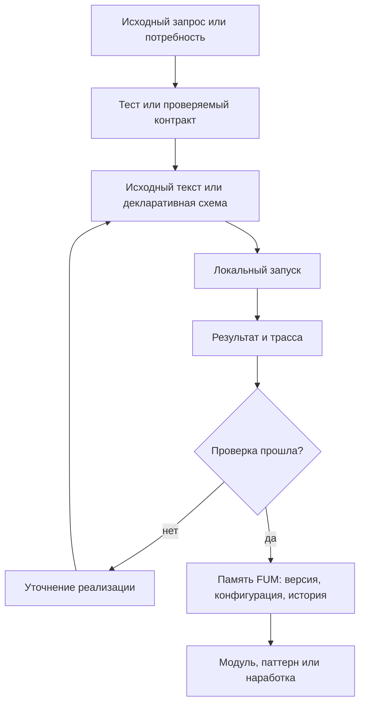

# Воспроизводимые [автоматизации FUM](../Глоссарий/автоматизация-FUM.md)

## Требование

Устойчивые автоматические алгоритмические структуры [FUM](../Глоссарий/FUM.md) должны быть предсказуемыми и воспроизводимыми. Это относится к [автоматизациям FUM](../Глоссарий/автоматизация-FUM.md), [автоматическим органам восприятия FUM](../Глоссарий/автоматический-орган-восприятия-FUM.md), [автоматическим органам действия FUM](../Глоссарий/автоматический-орган-действия-FUM.md), [устройствам восприятия и действия FUM](../Глоссарий/устройство-восприятия-и-действия-FUM.md), workflow, проверкам, преобразованиям [памяти](../Глоссарий/память-FUM.md), интерфейсным механизмам и визуализации на дисплее.

[Автоматизация FUM](../Глоссарий/автоматизация-FUM.md) не должна существовать только как неявное поведение запущенной системы. Если структура становится устойчивой частью работы [FUM](../Глоссарий/FUM.md), её исходные тексты, конфигурации, схемы данных, версии и история изменений должны быть частью [памяти FUM](../Глоссарий/память-FUM.md).

## Граница понятия

К [автоматизациям FUM](../Глоссарий/автоматизация-FUM.md) относятся любые закреплённые алгоритмические структуры, которые:

- принимают наблюдения, события, состояние [памяти](../Глоссарий/память-FUM.md) или команды;
- сжимают широкий входной поток внешнего события до компактного описания;
- разворачивают высокоуровневое описание действия до низкоуровневых действий исполнительных механизмов;
- преобразуют данные, выбирают действия, запускают проверки или строят представления;
- управляют [агентским циклом](../Глоссарий/агентский-цикл.md), workflow, инструментом, интерфейсом или аппаратным контуром;
- производят результат, который влияет на [внутреннее состояние](../Глоссарий/внутреннее-состояние.md), пользовательскую поверхность, физическое действие или следующую [наработку](../Глоссарий/наработка.md).

Автоматизация может быть программным кодом, декларативной схемой, графом состояний, набором правил, шаблоном вызова инструментов, визуализационным пайплайном, управляющим контуром сенсора или исполнительного устройства. Форма может различаться, но требование сохраняется: устойчивое поведение должно иметь восстановимый источник.

## Канонические имена автоматизаций

Исходное смысловое имя каждой новой или переименовываемой [автоматизации FUM](../Глоссарий/автоматизация-FUM.md) задаётся на русском языке кириллицей. Отображаемая латинская форма получается точным вызовом API LinguisticKit `applyingTransform(from: .Cyrl, to: .Latn, withTable: .ru)` на закреплённой ревизии `837e2ce107b97ee7b9d3344c9fe99142281fe393`. Эта форма канонична в границах FUM; она не объявляется универсальным стандартом транслитерации и не отождествляется с ISO или ГОСТ.

Технический slug является отдельным производным слоем FUM. После получения отображаемой формы он переводится в нижний регистр, пробелы заменяются дефисами, а для пространств имён с закреплённым префиксом добавляется этот префикс, например `fum-`. Ни изменение регистра, ни замена пробелов, ни префикс не являются поведением LinguisticKit. Исходное кириллическое имя, отображаемая транслитерация, итоговый slug, таблица `.ru` и закреплённая ревизия должны оставаться наблюдаемыми частями контракта автоматизации.

Два разных исходных имени не могут молча получить один slug: коллизия считается ошибкой валидации и устраняется выбором различимых смысловых имён, а не произвольным числовым суффиксом. Смена закреплённой ревизии LinguisticKit не применяется автоматически; она оформляется как явная миграция всех затронутых имён с просмотром diff, проверкой коллизий и обновлением сохранённого происхождения.

Точный прежний набор идентификаторов уже мигрирован на каноническую схему: [реестр названий автоматизаций](../Инструменты/реестр-названий-автоматизаций.json) содержит все действующие каталоги в `current`, декларативное имя в `display` и пустые поля `legacy` и `legacy_display`. Эти поля остаются частью версии формата и тестовых фикстур, но не разрешают активный псевдоним. Дословные исторические запросы и журналы не нормализуются и не считаются исполняемыми именами.

Исполняемая репозиторная проверка этого контракта использует [материализованный LinguisticKit](../Зависимости/README.md) на закреплённой ревизии. Пакет подключён как Git submodule из форка рядом с актуальным FUM. После свежего клонирования [автоматизация Git-зависимостей](../Инструменты/fum-proverka-git-zavisimostej/SKILL.md) в сетевом режиме инициализации строго читает URL форка и `fumUpstream` из совпадающей с индексом `.gitmodules`, выбирает ревизию только из gitlink, проверяет путь и канонический Git-каталог, получает оба remote с prune и оставляет чистый detached HEAD без перезаписи игнорируемого локального состояния. Затем тот же локальный валидатор автономно проверяет URL, refspec и роли `origin` и `upstream`, `.gitmodules`, достижимость выбранного коммита из актуальных локальных refs форка, точный gitlink и чистоту клона. Инициализация не создаёт зависимость, не меняет gitlink и не выбирает вершину remote вместо закреплённой ревизии; живая линия форка, синхронизация с оригиналом, лицензия и публикация ревизии остаются отдельными внешними проверками.

## Братиславская проекция памяти

[Братиславская версия памяти FUM](50-братиславская-версия-памяти-FUM.md) использует тот же точный LinguisticKit-вызов, таблицу и закреплённую ревизию, но является отдельной автоматизацией со своим инвентарём, форматом манифеста и политикой путей. Правила технического slug для названий автоматизаций к файловой проекции автоматически не применяются.

Генератор должен сначала получить полный исходный снимок и сухой план, преобразовать каждый кириллический компонент полного пути, проверить локальные ссылки и все целевые коллизии, а затем собрать полное поколение вне целевой области и установить его без частичного результата. Производная область исключается из входов и канонических автодискавери-проверок, ручная правка результата обнаруживается по хэшам, а удалённый или переименованный источник не оставляет устаревшего файла.

Прямое преобразование всех байтов файла неприемлемо без форматной политики: дословные запросы, внешние источники, URL, код, машинные поля, хэши и `FUM-MD-RECENCY` имеют разные контракты сохранения и проверки. До реализации отдельной TDD-автоматизации массовая братиславская копия вручную не создаётся.

## Потенциально повторяемые задачи

[Автоматизация FUM](../Глоссарий/автоматизация-FUM.md) нужна не только там, где задача уже многократно повторилась. Если задача выглядит потенциально повторяемой, [FUM](../Глоссарий/FUM.md) должен рассматривать её как ранний кандидат на автоматизацию уже при первом выполнении. Важный сигнал - не частота в прошлом, а ожидаемая польза от повторного запуска, единой методики, сравнимости результатов, проверки или передачи процедуры другому агенту.

К таким задачам относятся оценки трудоёмкости и стоимости, сводные таблицы, обновляемые описания, проверки связности, сбор статистики, построение отчётов, преобразование источников и другие действия, где ручной результат быстро становится скрытой методикой. Если автоматизация не создаётся сразу, [память FUM](../Глоссарий/память-FUM.md) должна явно хранить ручной статус результата, причину отсрочки и ближайший шаг к автоматизации.

Механический шаг, который требуется одинаково выполнить для нескольких файлов, записей или иных однотипных объектов, уже считается повторяемой задачей. Его массовое исполнение начинается только после выбора существующей автоматизации либо создания или расширения локальной TDD-автоматизации. Отсутствие готового сценария не превращает ручное повторение в штатный путь: сначала формализуется преобразование и его инварианты, затем проверяется сухой план, и только после этого автоматизация применяет изменения ко всему набору.

Минимально допустимый первый слой для потенциально повторяемой задачи - проверяемый шаблон, декларативный контракт, фикстура, сценарий запуска или список критериев приёмки. Полноценный скрипт может появиться позже, но сама потребность не должна теряться между [исходным запросом](../Глоссарий/исходный-запрос.md), [журналом работ](../Глоссарий/журнал-работ.md), планированием и коммитом.

## Предсказуемость и воспроизводимость

Предсказуемость означает, что по исходным данным, версии автоматизации, конфигурации, окружению и доступным внешним состояниям можно понять, почему получен именно такой результат. Воспроизводимость означает, что повторение автоматизации в сопоставимых условиях даёт тот же результат или объяснимое расхождение.

Если автоматизация использует недетерминированные элементы, [FUM](../Глоссарий/FUM.md) должен фиксировать их явно: seed, версию модели, время, состояние внешнего сервиса, доступный снимок среды, уровень неопределённости, ограничения доступа и другие источники расхождения. Непредсказуемость не должна прятаться внутри автоматизации как скрытый побочный эффект.

## Исходные тексты и история изменений

Для устойчивой [автоматизации FUM](../Глоссарий/автоматизация-FUM.md) в [памяти](../Глоссарий/память-FUM.md) должны сохраняться:

- исходные тексты или декларативные описания автоматизации;
- конфигурации, зависимости, версии моделей и параметры окружения;
- входные и выходные схемы, включая допустимые ошибки и неопределённости;
- тесты, контрольные примеры, трассы запусков и критерии приёмки;
- история изменений, причины изменений и связь с [исходными запросами](../Глоссарий/исходный-запрос.md);
- сведения о [уровне доступа](../Глоссарий/уровень-доступа.md), публикации, передаче и повторном использовании;
- связь с коммитами, [наработками](../Глоссарий/наработка.md), [модулями](../Глоссарий/модуль-FUM.md) и затронутой [производной документацией](../Глоссарий/производная-документация.md).

Если автоматизация не может быть полностью опубликована из-за секретов, приватных данных или внешних ограничений, [память FUM](../Глоссарий/память-FUM.md) всё равно должна хранить разрешённую форму: метаданные, интерфейсный контракт, описание недоступных частей, проверочный статус и причину ограничения.

## [Язык автоматизаций FUM](../Глоссарий/язык-автоматизаций-FUM.md)

Для устойчивых автоматизаций нужен [язык автоматизаций FUM](../Глоссарий/язык-автоматизаций-FUM.md): язык программирования и описания автоматизаций, оптимизированный для работы с ним со стороны LLM. Такой язык должен позволять модели читать, генерировать, объяснять, проверять и точечно править автоматизацию без потери воспроизводимости и происхождения.

В этом языке автоматизация должна выражать не только вычислительные шаги, но и входные и выходные схемы, разрешённые эффекты, границы доступа, подтверждения, тесты, трассы запусков, версии и связь с [исходными запросами](../Глоссарий/исходный-запрос.md). Иначе смысл автоматизации остаётся распределённым между кодом, комментариями, скрытым состоянием агента и устной договоренностью.

Оптимизация для LLM требует небольшой строгой грамматики, канонического форматирования, явных эффектов, локальных областей правки и проверочных сообщений, которые указывают на конкретные фрагменты исходного текста. Первое подробное требование описано в документе [LLM-ориентированный язык автоматизаций](21-LLM-ориентированный-язык-автоматизаций.md).

Этот язык связан с [системой структурирующих операторов FUM](../Глоссарий/система-структурирующих-операторов-FUM.md): автоматизационная конструкция должна быть не просто командой, а проверяемым оператором или связкой операторов распознавания, порождения, валидации и трассировки. Тогда повторяемый рабочий приём может сначала закрепиться как операторная форма, затем получить синтаксис языка автоматизаций и только после этого стать переносимой исполняемой автоматизацией.

## Тензорные вычислительные автоматизации

Некоторые [автоматизации FUM](../Глоссарий/автоматизация-FUM.md) могут иметь чистое численное ядро, которое выгодно исполнять не как обычный скрипт, а как тензорный вычислительный граф на GPU или другом ускорителе. Для [FUM](../Глоссарий/FUM.md) это допустимо только как воспроизводимый целевой слой: исходный контракт автоматизации, тесты, эталонная реализация и трасса компиляции остаются в [памяти](../Глоссарий/память-FUM.md), а ускоренный граф считается производным артефактом.

Минимальный контракт такого контура должен фиксировать:

- ограниченное подмножество языка или DSL, из которого строится граф;
- входные и выходные формы тензоров, типы, допустимые операции и ограничения чистоты;
- целевой формат или компиляторный слой: например ONNX, StableHLO, MLIR, XLA, IREE, TVM, Triton или TensorRT;
- эталонное CPU-исполнение или простую интерпретацию для проверки эквивалентности;
- версии компилятора, runtime, execution provider, драйверов и аппаратного профиля, насколько они публикационно чисто доступны;
- benchmark и критерий, при котором ускоренный путь действительно полезен;
- fallback-путь, если ускоритель, формат или оптимизация недоступны.

Такой слой особенно подходит для массивных регулярных вычислений: линейной алгебры, обработки изображений, DSP, batch processing, map/reduce, регулярных симуляций и сходных задач. Он не должен использоваться как универсальный способ исполнять произвольные программы через неудобный графовый интерпретатор: парсеры, компиляторы, системные вызовы, работа со строками, динамическая аллокация и нерегулярные структуры требуют других носителей автоматизации.

## Локальное воспроизведение, тесты и [TDD](../Глоссарий/TDD.md)

[FUM](../Глоссарий/FUM.md) должен стремиться локально воспроизводить в [памяти](../Глоссарий/память-FUM.md) все [автоматизации FUM](../Глоссарий/автоматизация-FUM.md), которые реально используются в работе проекта. Локальное воспроизведение означает, что для автоматизации сохраняется не только описание намерения, но и проверяемый носитель поведения: исходный текст или декларативная схема, команда запуска, конфигурация, минимальные входные примеры, ожидаемые результаты и тесты.

Если автоматизация зависит от внешней модели, сервиса, закрытого приложения, прав доступа или непубликуемых данных, локальная [память FUM](../Глоссарий/память-FUM.md) должна хранить воспроизводимую границу этой зависимости. Такой границей может быть адаптер, интерфейсный контракт, локальный симулятор, фикстура, снимок разрешённых данных, отчёт о невоспроизводимой части или ручная процедура проверки. Невозможность полного локального запуска не отменяет обязанности сохранить то, что можно проверить без секрета и без скрытого состояния.

Разработка новых и изменяемых автоматизаций ведётся через [TDD](../Глоссарий/TDD.md): ожидаемое поведение сначала формулируется как локальный тест или проверка, затем реализация доводится до прохождения этой проверки, а после этого код и тесты уточняются без потери исходного проверяемого контракта. Для уже существующих автоматизаций допустимы характеризационные тесты: они фиксируют фактическое поведение перед изменением и постепенно сужают область непроверенного.

Базовый тестовый набор автоматизации должен запускаться локально, быть публикационно чистым и не требовать сетевых вызовов, секретов или актуального состояния внешнего сервиса. Интеграционные проверки с внешним состоянием могут существовать отдельно, но должны явно описывать свои зависимости, ограничения и причину, по которой они не входят в обычный локальный набор.

## Воспроизводимая координация задач

Последовательный допуск задач к общей рабочей копии должен быть частью проверяемой памяти, а не скрытым соглашением внешнего диспетчера. Несколько корневых сессий могут стартовать одновременно, но только одна получает право записи; следующие образуют строгую FIFO-очередь и начинают изменение памяти после коммита всех предшественников.

Для текущего репозиторного контура этот контракт реализует [fum-ocheredj-zadach-git-vetki](../Инструменты/fum-ocheredj-zadach-git-vetki/SKILL.md). Каждая корневая задача первым действием регистрирует точный `CODEX_THREAD_ID`. Успешный Git compare-and-swap назначает уникальный возрастающий `seq`; именно этот атомарный порядок, а не незащищённое настенное время создания окна, определяет очередь. Повторная регистрация билета или владельца идемпотентна. Переупорядочивание, приоритеты и обход предыдущего билета не реализованы.

Состояние хранится не в рабочем дереве, а как канонический JSON blob под служебной ссылкой `refs/fum/worktree-task-queues/<sha256-идентичности-worktree>`. Каждое изменение публикуется через `hash-object` и compare-and-swap `update-ref`. Такая схема не требует POSIX `flock`, hard links, сигналов или project hooks и одинаково работает с SHA-1 и SHA-256 object ID. Штатный Python HEAD-bootstrap запускается в isolated mode, исключает checkout из пути импорта, очищает унаследованные Git-переменные, ограничивает загрузку 30 секундами, исполняет сценарий из буквального закоммиченного `HEAD` и закрепляет корень checkout; внутренние Git-вызовы не учитывают replace-объекты, optional locks и перенаправляющую Git-среду. Поэтому очередь не берёт грязную или локально подменённую копию из общего checkout. Detached HEAD и одна именованная ветка, принудительно открытая в нескольких worktree, отклоняются; отдельные клоны не координируются.

Ожидающая задача предпочтительно использует один долгоживущий `wait-until-actionable`. Команда продолжает пятиминутные read-only-окна внутри локального процесса, не переписывает Git-ссылку очереди и не печатает наружу промежуточный `waiting`; при поддержке среды дескриптор процесса и пустые host-проверки удерживаются внутри одного оркестрационного вызова. Поэтому репозиторная команда не порождает повторные JSON-ответы очереди, а отдельные сообщения пользователю минимизируются в пределах более приоритетной политики обновлений host. Ограниченный `wait --timeout-seconds 300` остаётся запасным и диагностическим путём для среды без безопасного долгоживущего вызова; его служебные возвраты и новые инструментальные ходы могут занимать модельный контекст. После коммита предшественника сохранённый `acknowledged_head` расходится с текущим `HEAD`, и билет получает `reload_required`. Он перечитывает текущие правила и затронутые материалы, подтверждает точный новый object ID через `ack-head` и лишь затем может получить новое `generation` со статусом `admitted`. Более позднее подтверждение не меняет FIFO-позицию.

Прерывание достоверно заблокированного процесса не снимает бессрочный билет. Если результат неоднозначен из-за возможного CAS между последней проверкой и доставкой JSON, повторный идемпотентный `join` с тем же `CODEX_THREAD_ID` восстанавливает наблюдение: он возвращает либо прежний ожидающий билет, либо уже существующее поколение владельца. Репозиторный слой может убрать промежуточный stdout, повторные bootstrap-запуски и рутинные сообщения, но не обещает устранить служебные записи host, если среда сама не предоставляет удерживаемый вызов или push-пробуждение.

Допуск связан со смысловой корневой задачей, а не с отдельным диалоговым ходом. Пока сохраняются её `CODEX_THREAD_ID`, `generation`, ветка и `base_head`, повторный вход продолжает то же владение. Обычный `git commit` не завершает протокол: владелец должен использовать атомарный commit+handoff очереди.

При завершении с diff сценарий отклоняет чужое поколение, изменившийся `HEAD`, пустой индекс и unstaged-, untracked- или конфликтные пути вне корневой `.obsidian/`. После этого `write-tree` формирует дерево, `commit-tree` создаёт commit object, а один `update-ref --stdin` transaction одновременно сравнивает и обновляет ref ветки и ref очереди. До транзакции ни одна ссылка не меняется; после успеха коммит и снятие владельца наблюдаемы вместе. Конкурирующие `join`, `ack-head` или `cancel` приводят только к повторному чтению JSON blob и повтору транзакции с тем же fenced `base_head`.

No-op-задача может вызвать `finish-clean`: точные `task_id` и `generation`, неизменный `HEAD`, чистота вне `.obsidian/` и отсутствие staged-изменений проверяются до транзакции, которая одновременно верифицирует ref ветки и обновляет только ref очереди. Этот путь нужен read-only сессиям и устаревшему плановому запуску, обнаружившему mismatch до первой записи; он не разрешает бросить частичный diff. И admission, и чистое завершение используют branch verification в той же транзакции, что и смена состояния очереди, поэтому конкурентный handoff не оставляет нового владельца с устаревшим `base_head`.

Для `master` локальная транзакция является терминальной границей обычной корневой задачи. После `committed` она не выполняет `push` или `publish`, а сообщает точные `new_head` и `branch_ref`; следующая сессия может получить очередь и продолжить готовую локальную цепочку независимо от состояния GitHub. Ручной `push` пользователя является отдельным подтверждением публикации точного проверенного коммита и его предков, но не подтверждением каждого шага перед следующим запуском. Он не расширяет разрешения на провайдеры, секреты, затраты, пользовательские данные или иные внешние эффекты. Удалённый ref не участвует в готовности, выборе, claim и FIFO; divergence не запускает автоматические `pull`, merge, rebase или force-push.

Исключение корневой `.obsidian/` из проверки чистоты очереди уменьшает ложные задержки от изменчивого состояния редактора, но не меняет правил публикационной классификации этого каталога. Корневая задача также обязана дождаться всех процессов и субагентов, способных позднее записать результат: чистота Git не доказывает отсутствия уже запущенного писателя.

Субагенты работают внутри допущенной корневой задачи и не получают собственные билеты. Корень может параллельно передать им непересекающиеся области файлов и синхронизировать выводы штатными сообщениями, но только он управляет веткой, индексом, итоговым diff, проверками и атомарным коммитом. Так внутренняя параллельность сохраняется без смешивания независимых корневых задач.

Ожидающий билет и владелец бессрочны: удаление исчезнувшего ожидателя изменило бы строгий FIFO, а захват поверх молчаливого владельца создал бы split-brain. Возобновление того же корневого `CODEX_THREAD_ID` продолжает билет или поколение; ожидающий может отменить только собственный билет, а владелец завершает commit+handoff либо `finish-clean`. Сама очередь не применяет TTL, не пропускает потерянную задачу и не создаёт ей замену. Ограждённое сообщение тому же владельцу после узкого host-наблюдения является отдельным маршрутом диспетчера и сохраняет эту бессрочную идентичность.

Штатный сброс является отдельной терминализацией всего точного снимка очереди. Только явно подтверждённый пользовательский ход в постоянной задаче диспетчера строит план с физическим checkout, полным ref локальной именованной ветки, точным `HEAD`, текущим объектом `queue-ref`, процессной и host-идентичностью диспетчера, участниками, изменёнными путями, preimage/target каждого изменённого tracked-пути, связанными служебными ссылками и фиксированной эпохой диспетчерских резерваций. Специальный Git-видимый неигнорируемый untracked-объект, скрытые флаги индекса, изменённые `.gitignore`/`.gitattributes`, внешний checkout-filter и пересечение игнорируемого пути с target закрывают read-only-план различимыми отказами до подготовки; внешний filter не запускается, а встроенные checkout-преобразования входят в target как фактические worktree-байты. Каждый действительный переход резервации атомарно сдвигает эпоху, поэтому ранее отсутствовавшая резервация не возникает незаметно между планом и подготовкой. Резервация схемы `3` хранит exact-пару `threadId`/`hostId` отдельно от предварительного `clientThreadId`: первая входит в host-инвентарь до привязки и должна совпасть с будущим `task_id`, второй оставляет границу неопределённой до фактического bind. Схема `4` сохраняет ту же host-привязку и добавляет состояние ограждённого возобновления; фаза `вызов_мог_состояться` блокирует сброс до точного подтверждения исполнителя. Та же семантика host-привязки действует для починки. Подтверждение хэшируется из полного снимка, а CAS-подготовка заменяет очередь на фазовый `reset-record` в том же `queue-ref`; обычные операции очереди и связанные диспетчерские переходы после этого fail-closed. Плановый heartbeat не может начать или подтвердить сброс.

Доступная host-поверхность не даёт чистый stop произвольной задачи, поэтому до CAS-подготовки каждый участник, кроме точной постоянной задачи диспетчера, должен иметь авторитетное состояние `idle` или `notLoaded`; `active`, неизвестный, неполный или неоднозначный ответ закрывает ход до первой мутации, а `handoff` доказательством остановки не является. Будущий штатный stop вызывается только после ограждения с повторным exact readback. После проверки именованного ref, `HEAD` и `reset-record` локальный переход отказывает на грязном tracked submodule, любой неотслеживаемой границе вложенного обычного либо bare Git-репозитория и переходе между gitlink и обычным объектом, затем восстанавливает индекс и отслеживаемое дерево. Частично применённый `read-tree` можно повторить только при целом индексе в сохранённом preimage либо target и каждом изменённом tracked-пути в собственном preimage либо target; любое позднее tracked-, index- или untracked-расхождение останавливает текущий вызов до дальнейшего удаления. После повторной сверки каждый подтверждённый обычный файл или символическая ссылка, включая такие пути корневой `.obsidian/`, перепроверяется непосредственно перед собственным literal-удалением; target, занявший прежний путь, не читается через символическую ссылку и не удаляется как untracked. Игнорируемые, новые, изменившиеся объекты и пустые каталоги сохраняются. До финала возобновление опирается на активный reset-record. Финальная Git-транзакция оставляет пустые `owner` и `waiting`, непринимаемость прежних билетов и атомарно создаёт самодостаточную квитанцию `reset`, инлайнящую исходную запись и итоговую очередь; после финала она переживает Git GC, повторный сброс и смену `last_completion`. Recovery сначала доказывает квитанцию текущего reset-id с exact reservation-ref/OID, затем может сохранить точное более раннее `committed`-свидетельство той же резервации; reset/`finished_clean` требуют `released` либо `unclaimed`, а совпадение лишь по `task_id`, `clientThreadId` или времени не принимается. После неё текущий диспетчерский ход больше не пишет и не запускает задачу. Автономная локальная проверка этого контура не закрывает живую приёмку до появления штатного проверяемого host-stop.

Воспроизводимость аварийного начала заново обеспечивает отдельный корневой `sbrositj.sh`, а не ослабление этого host-fenced протокола. Launcher из точного закоммиченного `HEAD` без аргументов строит при TTY одновременно на stdin и stdout план полного local ref, `HEAD`, index/worktree и raw scoped ref/OID-инвентаря, включая неизвестные текущей реализации runtime-пространства. Точная динамическая фраза разрешает архивировать preimage, установить общий reset-fence, переиспользовать безопасную cleanup-машину и терминально заменить обслуживаемое состояние свежими queue generation, reservation boundary и checkout-scoped tombstone прежних task ID. Валидные неизменяемые официальные квитанции штатного сброса из `refs/fum/квитанции-сброса-состояния-FIFO/` проходят строгий разбор и сохраняются; повреждённая официальная квитанция напрямую архивируется и удаляется, а человеческая квитанция простого сброса создаётся в отдельном пространстве `refs/fum/квитанции-простого-сброса/` и обеспечивает точный terminal replay уже состоявшегося исхода без второй мутации. Неверная фраза и любой drift дают нулевую мутацию. Автономные тесты запускают launcher только во временном репозитории и доказывают, что чужие области, ignored-данные, вложенные репозитории, ветки, теги и remote сохранены, а новый `join`, dispatcher reservation и карточочный claim возможны. Этот результат аннулирует локальные полномочия в пределах checkout даже после смены ветки, но не доказывает host-stop, `ACTIVE`-статус автоматизации или немедленный тик.

Локальные тесты воспроизводят конкурентную регистрацию, строгий порядок `seq`, идемпотентность, бессрочность билетов, бесшумное ожидание до `reload_required` и `admitted`, чистое прерывание, запасное ограниченное read-only-ожидание, запрет обхода, обязательное перечитывание нового `HEAD`, branch-fenced admission, `finish-clean`, атомарный commit+handoff, fencing внешнего коммита, смену ветки, SHA-1/SHA-256 и отсутствие POSIX-примитивов. Четырнадцать offline-сценариев с локальным bare-remote сохраняют регрессионную проверку низкоуровневого транспортного примитива: точный коммит при продвинувшемся `HEAD`, известный и неизвестный локально опубликованный потомок, расхождение, серверный отказ, отключение локального pre-push hook, запрет неявной отправки тегов, неоднозначный ответ, ошибки чтения и анализа удалённой вершины, завершение потомков транспортного процесса при тайм-ауте, bootstrap из точного коммита и раннее отклонение небезопасных URL и Git URL rewrite. Этот примитив не входит в обычный протокол `master` и применяется только при отдельном явном полномочии. Дополнительные проверки подтверждают безопасный bootstrap из `HEAD`, очистку Git-среды и отсутствие project hooks в `.codex/config.toml`. Старый путь helper сохранён только как no-op для уже открытых сессий с кэшированным прежним loader и не является активной автоматизацией.

## Диспетчер автоматизаций FUM и текущий адаптер следующего шага

[Диспетчер автоматизаций FUM](../Глоссарий/диспетчер-автоматизаций-FUM.md) сохраняет одну существующую прикреплённую задачу как управляющий контур независимо настраиваемых заданий. Канонический реестр `refs/heads/master` схемы `1` содержит ровно одно активное задание `master.next-step`: оно закрепляет текущий checkout, полный ref, проект, пятиминутное расписание, шесть наблюдаемых условий допуска, класс изменения репозитория, обычного корневого исполнителя, поколение и курсор. Задача и критерии карточки в реестр не копируются; маршрут `следующий_шаг_ветки` вызывает существующий специализированный контракт.

Плановый общий тик остаётся узким read-only-исключением из FIFO. Он не меняет checkout, индекс, ветку или историю и не исполняет внешний эффект; ему разрешены только read-only-проверки host и репозитория, fenced-операции двух диспетчерских уровней и не более одного host-эффекта: сообщение прежней точно связанной задаче для ограждённого возобновления либо создание новой обычной задачи. Сообщение пользователя в той же прикреплённой задаче не наследует это исключение. Отдельно подтверждённый штатный сброс является другим, пользовательским восстановительным исключением и не может быть вызван heartbeat. Read-only-намерения списка и состояния возвращают каноническую проекцию поколений, триггеров, условий, состояний, подтверждённых курсоров и блокировок без абсолютных путей, секретов и непрозрачных host-идентификаторов.

Мутирующее сообщение сначала преобразуется в закрытое предложение с ожидаемыми и новыми поколениями, точным старым и новым объектом, каноническим diff, классом эффекта и перечнем подтверждений. Применяется только подтверждённое предложение; свободный текст не становится полем реестра. Репозиторная правка проверяет точные `HEAD`, хэш и поколение реестра и поколение задания, увеличивает затронутые поколения ровно на один и синхронно переносит fence. CAS-конфликт, неизвестное намерение и повтор уже применённого предложения не создают нового поколения или повторного эффекта. Отмена возвращает идемпотентный no-op-конверт, но не меняет реестр или fence, не откатывает применённое и не гарантирует непринимаемость исходного предложения. Триггер меняется только вместе с явным решением по курсору; любое изменение значения при наличии подтверждённого результата в исходном или новом курсоре требует отдельного точного подтверждения. Неподключённый адаптер может быть добавлен лишь в `blocked`, возобновление разрешено только из `paused`, а выход из `blocked` остаётся отдельным намерением со специальным safety-подтверждением.

До любой обычной мутации host или репозитория пользовательский ход входит в FIFO и после допуска закрепляет в отдельной служебной Git-ссылке management-fence по точным идентификатору предложения, владельцу, поколению очереди и базовой вершине. Область ссылки определяют физическая рабочая копия и полный ref; в checkout и индекс она не входит. Только сброс самой заблокированной FIFO использует вместо предварительного допуска отдельный подтверждённый `reset-record` в `queue-ref`. До узкого восстановления собственного чистого владельца heartbeat получает внутренний снимок management-ref с ожидаемым объектом либо признаком отсутствия. FIFO-передача одной Git-транзакцией проверяет этот guard вместе с queue ref, поэтому начавшаяся после снимка перенастройка даёт `guard_changed` и не может быть самоисключена heartbeat. Повторная проверка fence перед общей резервацией и взаимная CAS-проверка перехода к host-границе не позволяют продолжить по устаревшему снимку.

На текущей поверхности Codex общий тик использует host-вызовы списка задач, списка проектов и создания задачи только через ограниченную оркестрацию. Ответы нормализуются как объект либо ровно один полный JSON-текст и затем проверяются закрытыми схемами; неизвестная форма, недоступный источник или ошибка останавливают тик до резервации. Инвентаризация задач выполняется дважды. Между проверкой списка и созданием нет host-транзакции, поэтому двойная проверка сужает окно гонки, но не объявляется доказательством глобального простоя других host или клонов.

Первое действующее задание вызывает [fum-sleduyusjhij-shag-vetki](../Инструменты/fum-sleduyusjhij-shag-vetki/SKILL.md) как адаптер. Его рабочий набор схемы `5` по-прежнему хранит конечный whitelist `automatic`, `paused` и `blocked`, точные `step_id`, `card_id`, содержательные хэши и ALL-of-зависимости `requires_completed_card_ids`. `show` повторно вычисляет готовый пул и выбирает не более одного кандидата по политике `dynamic-readiness-source-history-first-parent-v2`, а `claim` атомарно закрепляет `branch_ref`, `step_id`, `selection.id` и `selection.head`. Общий реестр не переписывает эту семантику и не становится её вторым источником истины.

После второй host-инвентаризации общий слой резервирует точные `job_id`, поколение спецификации, наступление и вершину выбора, а специализированный слой выполняет `show` и `claim`. Один свежий канонический UUID используется и как клиентская попытка общей резервации, и как lease карточочного claim. Поэтому два уровня относятся к одной логической попытке, но сохраняют разные идентичности: общую конфигурацию задания и конкретный карточочный выбор. Специализированный `release` остаётся fenced-восстановлением, а не обычным завершением успешно созданного исполнителя.

Создание задачи отмечает только прохождение внешней границы. Готовая пара `threadId`/`hostId` сохраняется в резервации схемы `3` как точное типизированное свидетельство и должна совпасть с будущим фактическим `task_id`; непустой `clientThreadId` подтверждает лишь принятие host-вызова, не является `task_id` и оставляет результат предварительным до bind. Созданная задача первым инструментальным действием получает собственный корневой `CODEX_THREAD_ID` и выполняет `join`; до `admitted` она только ждёт по FIFO. После допуска общий `bind-run` связывает резервацию с фактической задачей, а общий `verify-run` сопоставляет её с точными `generation` и `base_head` текущего владельца очереди. Затем карточочные `bind-run` и `verify-run` отдельно подтверждают `branch_ref`, `step_id`, `selection.id`, `selection.head` и специализированный claim. Содержательная работа начинается только после успеха обоих уровней.

После успешной работы исполнитель обновляет статус карточки и рабочий набор и завершает локальный атомарный commit+handoff. Создание задачи само по себе не терминализирует общий запуск: следующий тик сверяет сохранённые фактические идентичность и поколение с точным текущим `last_completion` очереди либо с самодостаточной reset-квитанцией, доказавшей совпадение reservation-ref и OID. Совпавший `committed` подтверждает успех. Совпавший `finished_clean` признаётся безопасным отказом только вместе с host-доказательством окончательной остановки возможного исполнителя и состоянием специализированной резервации `released` либо `unclaimed`; reset-квитанция также требует такого recovery, а старый повторно использованный `task_id` сам по себе ничего не доказывает. Иначе запуск остаётся заблокированным как неоднозначный. Так курсор продвигается по подтверждённому результату, а не по heartbeat-тику или факту создания чата.

До проверки занятости и выбора новой occurrence диспетчер рассматривает возобновление прежнего нетерминального run. Кандидат обязан одновременно совпасть по общей резервации в фазе `задача_создана`, точным `threadId`/`hostId`, FIFO-владельцу и его поколению, `HEAD`, адаптерному claim и неактивному management-fence. Для той же задачи объединённая host-инвентаризация должна показывать `kind=codex` и точный `idle` либо `notLoaded`, а один текущий `read_thread` — закрытую схему `1` и ровно один новейший терминальный host-ход `failed` с согласованными временами и точной разрешённой ошибкой `stream disconnected before completion: error sending request for url (https://chatgpt.com/backend-api/codex/responses)`. Терминальный host-ход и нетерминальный run не смешиваются: успешный readback доказывает только наблюдаемый разрыв прежнего потока и доступность host-read-path сейчас, но не физическую гибернацию, причину разрыва или работоспособность всей сети.

До `send_message_to_thread` одна Git-CAS-транзакция повторно сверяет `HEAD`, reservation-ref/OID, queue-ref/OID, claim-ref/OID и management-ref, сдвигает эпоху резерваций и сохраняет схему `4` с отдельным поколением, детерминированными ключом и хэшем сообщения, пределом в одну попытку и фазой `вызов_мог_состояться`. Только победитель CAS отправляет прежней паре `threadId`/`hostId` ровно одно сообщение. Ответ, ошибка и тайм-аут одинаково запрещают повторную отправку, замещающую задачу и создание нового запуска; незавершённая фаза также блокирует терминализацию и штатный сброс. Возобновлённый исполнитель сохраняет прежний `CODEX_THREAD_ID`, первым инструментальным действием идемпотентно повторяет `join`, после допуска перечитывает правила и `HEAD`, восстанавливает процесс либо долговечную контрольную точку и подтверждает возобновление точными ключом, `task_id` и поколением. Подтверждение допускает уже существующий diff, но заново атомарно проверяет все ограждения. До него неизвестный прежний внешний эффект не повторяется.

Явный полный откат живого карточного исполнителя сохраняет прежний протокол `rearm`: до `finish-clean` задача доказывает чистоту на исходном `selection.head` и атомарно сверяет точных владельца очереди, поколение, ветку и claim. После успешного `rearm` разрешён только немедленный чистый handoff. Успешно созданная задача не вызывает `release`; внешний `release` допустим только после host-подтверждения окончательной остановки возможного исполнителя. Следующий общий тик учитывает этот специализированный исход при терминализации своей резервации.

Штатные `Stop` и `Start` всего heartbeat проходят тот же двухфазный управляющий контракт, меняют только runtime-статус и служебное время обновления и не выпускают новое поколение репозиторного реестра. Host-предложение закрепляет наблюдённый исходный статус: пауза допустима только из `ACTIVE`, а возобновление — только из `PAUSED`. После FIFO-допуска полный декларативный снимок механически переносится в один host-update; helper сверяет исходный статус снимка с предложением, а точный readback подтверждает сохранение целевой задачи, prompt, пятиминутного расписания, декларативной конфигурации и истории. Host не предоставляет expected-version/CAS, поэтому такой снимок обнаруживает наблюдаемое расхождение, но не доказывает транзакционную изоляцию. Успех объявляется только после чистой передачи очереди; уже созданный запуск, общая резервация и карточочный claim не освобождаются. Возобновление не форсирует новый запуск и не обходит две host-инвентаризации, оба исполнительских fence и FIFO.

Миграция host выполнена на месте для одной прежней прикреплённой задачи и одного прежнего heartbeat. Разрешённый diff существующей записи ограничен новым именем общего тика, новым prompt и служебным `updated_at`; идентичность, тип, цель, расписание, статус и прочие декларативные поля сохраняются. Создание второй задачи, второго heartbeat или replacement-fallback запрещено, поэтому история прикреплённой задачи и прежняя цель не теряются, а непрозрачный локальный идентификатор не становится частью публикуемой памяти.

Пока подключён только адаптер следующего шага, а канонический реестр сохраняет ровно одно активное задание `master.next-step`. Управление сообщениями реализует закрытые просмотр, предложение, подтверждение, CAS-применение, host-переключение и no-op-отмену, но само по себе не добавляет второе действующее задание. Локальные команды, схема `4`, TDD-матрица и канонический heartbeat-маршрут ограждённого возобновления реализованы, однако его живая сквозная приёмка остаётся открытой в [FUM-STEP-0142](../Планирование/карточки-шагов/🟡-FUM-STEP-0142-добавить-ограждённое-возобновление-задач-после-потери-связи.md). Периодическая аналитика, иные исполняемые типы заданий и итоговая сквозная приёмка ещё не завершены, поэтому универсальная диспетчеризация остаётся частично выполненным требованием. Расширение внешнего эффекта, любое изменение подтверждённого курсора и снятие safety-блокировки требуют отдельных точных подтверждений. Смена remote или полного ref не поддерживается схемой `1` и требует будущей версионированной миграции, а после появления такой миграции — ещё и отдельного явного подтверждения. Для текущего `master` периодическая и post-handoff-публикация не включены: ручной `push` публикует накопленный проверенный локальный префикс, но не подтверждает каждую карточку, не является пошаговым допуском и не расширяет полномочия диспетчера. Возможные задания публикации для других refs и репозиториев сохраняются в [частично прояснённом вопросе о границах периодической публикации](../Вопросы/2026-07-27_15-21-35_MSK_границы-периодической-публикации-ветки.md).

## [Реестр системных приложений и инструментов](../Глоссарий/реестр-системных-приложений-и-инструментов.md)

Чтобы [автоматизации FUM](../Глоссарий/автоматизация-FUM.md) и рабочие сессии оставались воспроизводимыми, [память FUM](../Глоссарий/память-FUM.md) должна хранить не только итоговые файлы и команды, но и сведения об инструментах, через которые выполнялась работа.

[Реестр системных приложений и инструментов](../Инструменты/реестр-системных-приложений-и-инструментов.md) служит устойчивым справочником таких зависимостей: системных приложений, CLI-команд, инструментов среды агента, MCP-инструментов, локальных скриптов и внешних сервисов. Для каждого повторно используемого инструмента фиксируются назначение, способ проверки версии, известные ограничения и публикационно чистая граница наблюдаемости.

Файл каждого [исходного запроса](../Глоссарий/исходный-запрос.md) должен содержать раздел `## Использованные инструменты`. Этот раздел хранит фактический снимок конкретной [рабочей сессии](../Глоссарий/рабочая-сессия.md): какие инструменты были применены, какие версии были доступны, где версия не раскрывалась средой и на какую запись реестра можно опереться. Так цепочка требования включает не только запрос, производную документацию и коммит, но и инструментальную среду выполнения.

Для составной среды ChatGPT и Codex такой снимок послойный: версия desktop bundle, встроенного runtime, самостоятельного CLI, активная модель и контракты инструментов не подменяют друг друга. Значение модели из конфигурации считается только сконфигурированным значением по умолчанию, пока текущая сессия не подтвердила его как активное.

Если инструмент зависит от внешнего сервиса, закрытого приложения, текущей модели или MCP-сервера, точная версия может быть недоступна. В этом случае фиксируется не выдуманная версия, а проверяемый контракт: имя инструмента, поставщик среды, дата использования, известные ограничения и причина, по которой полный снимок нельзя воспроизвести локально.

## Архивирование прикрепляемых материалов

[Архивирование прикрепляемых материалов](../Планирование/MVP-кандидаты/02-архивирование-прикрепляемых-материалов/README.md) выбрано текущим активным MVP-контуром [FUM](../Глоссарий/FUM.md). Эта автоматизация относится к воспринимающему слою [памяти FUM](../Глоссарий/память-FUM.md): она превращает внешний URL, расшаренный диалог, документ или вложение в локальный источник с происхождением, публикационно чистым извлечением и связью с [исходным запросом](../Глоссарий/исходный-запрос.md).

Минимальный контракт этого контура:

- материал с устойчивым URL сохраняется в канонической папке `Источники/URL/<scheme>/<host>/<path...>/`, а query и fragment добавляются только через хэшированные сегменты, если меняют содержание;
- материал без устойчивого URL и с одним владельцем-запросом сохраняется в `материалы/источники/` его [папки запроса](../Глоссарий/папка-запроса.md), а общий или самостоятельно адресуемый материал остаётся в тематическом каталоге;
- папка источника содержит сырой или максимально близкий к сырому слой, извлечённый текст или структурные данные, `extraction-report.md` и человекочитаемый `source-index.md`;
- установленный снимок содержит `snapshot-manifest.json` с точным отсортированным перечнем всех управляемых файлов, а фактический набор файлов обязан совпадать с ним;
- файл [исходного запроса](../Глоссарий/исходный-запрос.md), который привёл материал в проект, содержит раздел `## Прикрепляемые материалы` со ссылками на папку источника, индекс и отчёт;
- повторный запуск для того же URL и того же запроса не создаёт дублирующиеся ссылки или бессмысленную копию источника, собирает результат в соседнем staging-каталоге и только после полной проверки заменяет канонический каталог одним атомарным обменом;
- неполный успешный повтор удаляет отсутствующие в новом манифесте прежние структурные файлы, а ошибка до атомарной установки оставляет предыдущий канонический снимок без изменений;
- если файловая система не поддерживает атомарный обмен непустых каталогов, повтор закрывается с ошибкой без двухшагового переименования и без изменения канонического снимка;
- локальный тестовый набор проверяет чистые части поведения без сети и секретов, а внешние ограничения фиксируются в отчёте об извлечении.

Первый общий слой для устойчивых HTML-URL реализован переносимым модулем `Инструменты/fum-materialyi-zaprosov/scripts/source_archive.py` и пользовательским входом `fum source archive <url> --request <file>`. Он сохраняет заголовки с редакцией cookie и исходные байты HTML, извлекает видимый текст и JSON-LD, формирует индекс, отчёт и точный манифест, а затем атомарно устанавливает снимок и идемпотентно связывает его с запросом. Автономная двухверсионная фикстура проводит через тот же вход первый снимок, успешный повтор без устаревшего структурного файла и поздний сбой без сети и секретов. Специализированный `archive-chatgpt-share.py` сохраняет прежний интерфейс и более глубокое извлечение расшаренных диалогов.

## Структура папок запросов

Локальная автоматизация [fum-struktura-papok-zaprosov](../Инструменты/fum-struktura-papok-zaprosov/SKILL.md) управляет [папками запросов](../Глоссарий/папка-запроса.md) как единым набором структур. Она строит полный сухой план пакетной миграции, переносит запросы, отчёты и доказанно собственные материалы согласованно, пересчитывает живые ссылки при побайтовом сохранении дословных пользовательских блоков, создаёт новую папку с навигацией и валидирует итоговую раскладку. Массовое преобразование выполняется одним запуском с откатом при ошибке, а не последовательностью ручных переименований.

План должен быть детерминированным, версионированным и содержать только репозиторно-относительные пути. Это позволяет повторить одно преобразование в независимых клонах и в будущем использовать тот же паттерн для выравнивания структурных поколений разных веток или форков перед содержательным слиянием. Текущая автоматизация не получает remote, не переключает ветки, не выполняет merge и не публикует результат; отдельный будущий pre-merge-контур сохранён в [FUM-STEP-0113](../Планирование/карточки-шагов/🟡-FUM-STEP-0113-добавить-межветочную-синхронизацию-структурных-миграций.md).

## Схема воспроизводимой [автоматизации](../Глоссарий/автоматизация-FUM.md)

## [Чистые функции](../Глоссарий/чистая-функция.md) как паттерн

Идея [чистой функции](../Глоссарий/чистая-функция.md) является предпочтительным паттерном для ядра [автоматизаций FUM](../Глоссарий/автоматизация-FUM.md). Там, где это возможно, автоматизация должна разделяться на две части:

- чистое ядро, которое из явно переданных входов, состояния и конфигурации строит результат без скрытых побочных эффектов;
- оболочки ввода-вывода, которые читают среду, вызывают инструменты, меняют файлы, показывают интерфейс, управляют устройствами или выполняют другие действия с внешним миром.

Такое разделение не запрещает действия. Оно делает границу действия явной: [FUM](../Глоссарий/FUM.md) может отдельно проверять преобразование данных, отдельно наблюдать побочные эффекты и отдельно фиксировать результат в [памяти](../Глоссарий/память-FUM.md).

## Устройства восприятия, действия и дисплей

[Устройства восприятия и действия FUM](../Глоссарий/устройство-восприятия-и-действия-FUM.md) должны проектироваться как воспроизводимые контуры. Устройство восприятия должно фиксировать, из какого сигнала, снимка, события или состояния получено наблюдение. Устройство действия должно фиксировать, из какого состояния, решения и версии автоматизации возникло действие.

Визуализация на дисплее также является частью этого требования. Видимое пользователю состояние должно быть производным от явного снимка данных, версии визуализационной автоматизации и правил отображения. Если экран показывает состояние, которое невозможно восстановить из [памяти](../Глоссарий/память-FUM.md) или агентски доступного снимка, возникает слепая зона [внутреннего состояния](../Глоссарий/внутреннее-состояние.md).

## Автоматические органы восприятия

[Автоматический орган восприятия FUM](../Глоссарий/автоматический-орган-восприятия-FUM.md) является устойчивой восприятийной автоматизацией. Его смысл состоит в том, чтобы при внешнем событии быстро и автоматически сжать широкий входной поток до лаконичного компактного описания, которое уже может быть полностью сохранено в [памяти FUM](../Глоссарий/память-FUM.md) и обработано LLM внутри [FUM](../Глоссарий/FUM.md), локальной или внешней.

Для воспроизводимости такой орган должен фиксировать не только итоговое описание, но и происхождение события, канал, время, версию автоматизации, параметры сжатия, уровень уверенности и известные потери деталей. Если исходный поток слишком велик, приватен или технически недоступен для полного сохранения, [FUM](../Глоссарий/FUM.md) должен явно хранить границу между сохранённым компактным описанием и несохранённой частью потока.

## Автоматические органы действия

[Автоматический орган действия FUM](../Глоссарий/автоматический-орган-действия-FUM.md) является устойчивой деятельной автоматизацией. Его смысл состоит в том, чтобы разворачивать высокоуровневые описания действий, созданные LLM или другим способом, в конкретные низкоуровневые действия исполнительных механизмов: физические движения, управляющие сигналы, вызовы инструментов, операции интерфейса или программные команды.

В биологической аналогии такой орган является аналогом человеческого мозжечка: он связывает намерение и план с координированным исполнением. Для воспроизводимости орган действия должен фиксировать исходное описание действия, версию автоматизации, выбранные низкоуровневые шаги, целевую среду, ограничения доступа, ошибки, отклонения и наблюдаемый результат.

## Адресные описания

Построение [описаний FUM для адресатов](../Глоссарий/описание-FUM-для-адресата.md) является частным случаем воспроизводимой [автоматизации FUM](../Глоссарий/автоматизация-FUM.md). Такая автоматизация принимает явный набор источников из [памяти FUM](../Глоссарий/память-FUM.md), паспорт адресата, правила отбора тезисов и структуру результата, а на выходе даёт адресный Markdown-файл с источниками и ограничениями.

Базовая схема закреплена в [Построении описания FUM для адресата](../Описания/Автоматизации/построение-описания-FUM-для-адресата.md). Она нужна, чтобы адресные материалы можно было пересобрать с нуля после изменения документации, проверить на неподтверждённые утверждения и обновить без потери связи с требованиями.

Адресные описания не должны обновляться точечными ручными правками. Каждое создание, исправление или обновление описания должно быть оформлено как вызов соответствующей автоматизации и полная пересборка результата, чтобы сама рабочая сессия подтверждала, что автоматизация остаётся применимой к текущей [памяти FUM](../Глоссарий/память-FUM.md).

## Сводные статьи документации

Сводные статьи [производной документации](../Глоссарий/производная-документация.md) являются ещё одним частным случаем воспроизводимой [автоматизации FUM](../Глоссарий/автоматизация-FUM.md). Они нужны, когда тема уже раскрыта в нескольких документах, но для работы с [памятью FUM](../Глоссарий/память-FUM.md) требуется одна входная карта, как это сделано для [архитектуры FUM](../Глоссарий/архитектура-FUM.md).

Для таких статей закреплена локальная автоматизация [fum-sborka-svodnoj-dokumentacii](../Инструменты/fum-sborka-svodnoj-dokumentacii/SKILL.md). Её проверяемое ядро принимает JSON-конфигурацию с темой, целью, исходным запросом, опорными документами и ожидаемыми разделами, строит канонический Markdown-каркас и валидирует готовый документ через скрипт [build-doc-aggregation.py](../Инструменты/fum-sborka-svodnoj-dokumentacii/scripts/build-doc-aggregation.py).

Граница этой автоматизации принципиальна: скрипт проверяет происхождение, структуру и ссылки, но не подменяет смысловой синтез. Агент должен читать источники, собирать общую карту темы, сохранять ссылки на глоссарий и фиксировать [открытые вопросы](../Глоссарий/открытый-вопрос.md), если между опорными документами обнаруживается противоречие или неоднозначность.

## Оценочные материалы

Оценочные материалы являются повторяемым аналитическим слоем [памяти FUM](../Глоссарий/память-FUM.md). Результат и его одноразовая конфигурация лежат вместе в `материалы/оценки/` [папки запроса](../Глоссарий/папка-запроса.md), а `Оценки/README.md` служит общим навигационным индексом. Оценки нужны, когда проекту требуется понять масштаб уже выполненной или планируемой работы: трудоёмкость, примерную стоимость, сложность сопровождения, объём проверок или другие характеристики, которые должны сравниваться между сессиями.

Для таких материалов закреплена локальная автоматизация [fum-ocenki](../Инструменты/fum-ocenki/SKILL.md). Её проверяемое ядро принимает JSON-конфигурацию оценки с каноническим путём запроса-владельца, строит Markdown-файл рядом с конфигурацией в `материалы/оценки/` и валидирует, что результат содержит снимок репозитория, вопрос оценки, методику расчёта, компонентные диапазоны, итоговый диапазон, точечную оценку, допущения, ограничения точности, правила оформления результата и ссылки на происхождение.

Граница этой автоматизации такая же важная, как и её польза: скрипт не доказывает истинность чисел и не заменяет содержательную оценку. Он делает методику наблюдаемой, повторяемой и проверяемой, а агент отвечает за смысл диапазонов, честность допущений и фиксацию неопределённости.

## Проектный файловый инвентарь

Служебные генераторы и глобальные проверки должны работать с одним и тем же доказуемым множеством проектных файлов. Произвольный рекурсивный обход репозитория делает результат зависимым от локальных сборок, установленных расширений и кэшей, поэтому одинаковый Git-снимок может давать разные выходы на разных машинах или в разные моменты одной рабочей сессии.

Общая автоматизация [fum-proyektnyiye-fajlyi](../Инструменты/fum-proyektnyiye-fajlyi/SKILL.md) определяет проектные Markdown-входы как объединение отслеживаемых файлов и новых неигнорируемых файлов. Она структурно исключает `.build`, `.swiftpm`, каталоги кэшей, `.obsidian/plugins` и `.obsidian/themes`, не следует по символическим ссылкам и останавливается, если не может доказать полноту инвентаря. Локальный `.git/info/exclude` не скрывает уже отслеживаемый документ, а принудительное добавление файла внутрь исключённого каталога не делает его проектным входом.

Эта политика является общей для `fum-svezhestj-markdown`, `fum-svezhestj-grafa-obsidian` и файловых обходов `fum-svyaznostj-rabochej-sessii`. Исключённые файлы не читаются как источники, не попадают в производные индексы и никогда не переписываются генераторами. Канонические выходные файлы отдельно проверяются на символические ссылки, выход за границу репозитория и разрешение внутрь исключённого хранилища.

## Тепловая карта графа Obsidian

Цветовое состояние графа Obsidian является частью видимой пользовательской поверхности текущей [памяти FUM](../Глоссарий/память-FUM.md). Если оно используется как способ понять свежесть узлов, оно должно строиться из воспроизводимого источника, а не только из ручной настройки интерфейса.

Для этого закреплена локальная автоматизация [fum-svezhestj-grafa-obsidian](../Инструменты/fum-svezhestj-grafa-obsidian/SKILL.md). Её скрипт [build-obsidian-graph-recency.py](../Инструменты/fum-svezhestj-grafa-obsidian/scripts/build-obsidian-graph-recency.py) читает служебные метки `FUM-MD-RECENCY`, группирует Markdown-файлы по возрасту последнего содержательного редактирования и записывает в `.obsidian/graph.json` цветовые группы Obsidian через поисковые запросы `path:"..."`. Обновление принимает явную опорную дату либо сохраняет выбранную дату MSK в проектном sidecar-файле `.obsidian/fum-recency-reference-date`; последующая структурная проверка использует сохранённое значение, а не текущий календарный день.

Текущая шкала использует десять возрастных корзин для первого десятидневного окна и явную последовательность цветов от красного к синему: горячие красные узлы показывают свежие содержательные правки, холодные синие - старые области памяти, а промежуточные оранжевые, жёлтые, зелёно-бирюзовые и сине-бирюзовые ступени делают переход между ними постепенным.

Такая тепловая карта делает свежие области памяти сразу видимыми в графе, а Git сохраняет не только факт ручного открытия графа, но и воспроизводимое правило окрашивания. Смена сегодняшней даты не делает неизменный снимок ошибочным: новый календарный срез создаётся только явным обновлением опорной даты. Sidecar отделён от собственного JSON Obsidian, потому что приложение удаляет незнакомые поля при сохранении настроек. Скрипт намеренно заменяет весь список `colorGroups`, потому что тепловая карта является цельным режимом визуализации; остальные настройки графа сохраняются без изменения.

## Проверка связности рабочей сессии

Связность [рабочей сессии](../Глоссарий/рабочая-сессия.md) является проверяемым свойством [памяти FUM](../Глоссарий/память-FUM.md). Если запрос повлиял на проект, недостаточно изменить нужные файлы: нужно сохранить трассу, по которой следующий агент или человек сможет восстановить происхождение изменения, использованные инструменты, отчёт, проверки и состав Git-изменений.

Для этого закреплена локальная автоматизация [fum-svyaznostj-rabochej-sessii](../Инструменты/fum-svyaznostj-rabochej-sessii/SKILL.md). Её скрипт [check-session-coherence.py](../Инструменты/fum-svyaznostj-rabochej-sessii/scripts/check-session-coherence.py) проверяет:

- навигацию файла [исходного запроса](../Глоссарий/исходный-запрос.md) и обратную ссылку соседнего запроса;
- наличие соответствующего отчёта в [журнале работ](../Глоссарий/журнал-работ.md), ссылку отчёта на исходный запрос и, начиная с закреплённых временных границ, непустой профиль времени выполнения не менее чем по двум стадиям с явной границей наблюдения, а также таблицу всех прямых проверочных запусков с длительностями, результатами и арифметически проверяемой общей суммой; для новой машинной границы дополнительно проверяются записи, закрытый снимок, хэши и точная Markdown-проекция;
- единственный корректный `Codex-Thread-ID` корневой задачи в файле запроса, его совпадение с явно переданным корневым идентификатором и с последним Git trailer подготовленного сообщения коммита;
- раздел `## Использованные инструменты` со ссылкой на [реестр системных приложений и инструментов](../Инструменты/реестр-системных-приложений-и-инструментов.md), а для новых запросов - отсутствие неквалифицированной общей записи `Codex - версия не раскрывается средой`;
- локальные Markdown-ссылки во всём репозитории, включая существование цели и точное совпадение регистра каждого компонента пути с реальным именем файла или каталога;
- формальный вопросительный признак каждого материала `Вопросы и ответы/*.md`, кроме README: непустой раздел `## Вопрос` должен оканчиваться знаком `?`; смысловая классификация просьб и команд остаётся обязанностью агента и просмотра diff;
- отсутствие верхних справочных блоков происхождения в затронутых производных Markdown-файлах, чтобы `Источники требований`, `Источники`, опорные материалы и аналогичные разделы оставались после основного содержания;
- соответствие текущего `git status --short --untracked-files=all` разделу `## Повлиял на файлы`, включая явные маркеры удалённых путей без битых Markdown-ссылок, чтобы временные файлы, кэши и другой машинный мусор не попадали в незамеченное состояние перед коммитом.

Глобальные проверки Markdown-файлов используют общий проектный инвентарь. Поэтому локальные зависимости и кэши не могут ни породить ложную ошибку, ни сделать битую проектную ссылку формально существующей.

Начиная с рабочей сессии `2026-08-04 20:45:26 MSK`, ручное перечисление прямых проверок заменено обязательным машинным журналом. Локальная автоматизация [fum-otchyotyi-o-zapuskakh-proverok](../Инструменты/fum-otchyotyi-o-zapuskakh-proverok/SKILL.md) оборачивает каждый прямой верхнеуровневый вызов теста, валидатора, сборки, lint, benchmark, полного smoke-check или другого проверочного процесса. Один вызов представлен одной версионированной JSON-записью, каждое состояние которой устанавливается атомарно; запись сохраняет порядок, исполнителя, вызов, состояние, длительность в наносекундах, статус, код завершения и пояснение. Неуспешные, прерванные и повторные вызовы остаются отдельными записями. Вложенные шаги составного вызова можно показывать для диагностики, но они не создают дополнительного верхнеуровневого вклада в сумму.

Markdown-блок профиля является детерминированной проекцией упорядоченных записей, а не вторым вручную поддерживаемым источником. Для каждой завершённой записи наносекунды округляются до целого числа миллисекунд по правилу половины вверх; общий профиль складывает именно эти видимые округлённые миллисекунды. Поэтому сумма параллельных процессов может превышать wall-clock-интервал стадии, который по-прежнему измеряется отдельно.

После завершения всех вызовов автоматизация сначала долговечно создаёт упорядоченный снимок: для каждой записи он фиксирует имя файла и точный SHA-256 хэш её байтов. Затем она закрывает Markdown; промежуточный снимок с открытым marker является обнаружимой закрытой отказом фазой, блокирует новые вызовы и завершается повтором `закрыть`. Маркер готового блока содержит путь к снимку и SHA-256 хэш самого снимка, а Markdown-проекция должна совпадать с восстановленной из записей байт-в-байт. Проверка отвергает пропущенные, лишние, изменённые или переставленные записи, неверные хэши, переходный журнал и ручное изменение проекции. Открытый предпросмотр может существовать между вызовами, но строгая проверка принимает его только пока есть запись со значением «выполняется», в том числе во время обёрнутой самопроверки; в конечный коммит он войти не может.

Обратный переход `возобновить` перед первой мутацией долговечно ставит отдельный канонический `возобновление.json` с хэшами снимка, закрытого и открытого отчёта. Пока этот журнал существует, все команды, кроме повторного `возобновить`, закрыты отказом. Повтор сверяет записи, хэши и одну из допустимых фаз, завершает открытие, подтверждает отсутствие снимка и удаляет журнал последним. Так межфайловый переход остаётся обнаружимым и повторяемым, не выдавая две независимые атомарные замены за одну транзакцию.

Полный smoke-check запускается через эту же обёртку и является последней записью, охваченной профилем. После него выполняются только необходимые проверки замыкания уже закрытого отчёта вне профиля: они подтверждают снимок и связность результата, но не открывают новый проверочный вызов и не создают рекурсивную цепочку записей. Сессии до закреплённой временной границы сохраняют прежний ручной формат. Машинный журнал доказывает полноту вызовов, проведённых через обязательную обёртку; смысловую корректность результата и просмотр diff автоматизация не подменяет.

## Двунаправленность активных вопросов

Открытый или частично прояснённый вопрос сохраняет нерешённую зависимость видимой только тогда, когда связь читается в обе стороны. Раздел `## Затронутая документация` перечисляет фактические цели вопроса, а каждая такая цель должна рядом с зависимым утверждением или в уместном справочном блоке ссылаться обратно на вопрос. Формальная ссылка без смыслового основания не заменяет проверку заявленной цели.

Для структурной части этого контракта закреплена локальная автоматизация [fum-obratnyiye-ssyilki-voprosov](../Инструменты/fum-obratnyiye-ssyilki-voprosov/SKILL.md). Её сценарий [check-question-backlinks.py](../Инструменты/fum-obratnyiye-ssyilki-voprosov/scripts/check-question-backlinks.py) получает активные статусы из `Вопросы/README.md`, требует у каждого вопроса непустой раздел затронутой документации и для каждой локальной цели проверяет существование Markdown-файла, отсутствие symlink-компонентов, точный регистр пути и обратную Markdown-ссылку. Пустая цель, ссылка только на фрагмент, изображение, экранированный текст, inline-code, HTML-комментарий или fenced-блок не могут удовлетворить контракт.

Автоматизация намеренно не требует, чтобы любая контекстная ссылка на вопрос из журнала, запроса или описания была объявлена его целью. Она также не оценивает смысловую уместность пары: эту часть выполняет агент при создании вопроса и при просмотре diff. Если заявленная цель ошибочна, исправляется сам вопрос с сохранением происхождения решения, а не целевой документ ради формального прохождения.

## Корневая инструкция и полный индекс документации

Корневой `README.md` является инструкцией текущего использования FUM. Рост производной документации не должен превращать его в хронику прогресса, перечень прототипов или полный справочник: такой вход быстро теряет наблюдаемый пользовательский сценарий и снова раздувается при каждом новом номерном документе. Полная тематическая карта поэтому хранится отдельно в `Документация/README.md`.

Для системного разделения этих ролей закреплена локальная автоматизация [fum-indeks-readme](../Инструменты/fum-indeks-readme/SKILL.md). Она требует от корневой инструкции ровно один видимый раздел `## Как использовать FUM сейчас`, видимую ссылку на отдельный индекс, отсутствие раздела `## Документация по темам` и размер не более `12 000` Unicode-символов вместе со служебным блоком свежести.

Полнота при этом не теряется. Автоматизация получает доказуемый инвентарь через [fum-proyektnyiye-fajlyi](../Инструменты/fum-proyektnyiye-fajlyi/SKILL.md), выбирает верхнеуровневые `Документация/NN-*.md` и папочные точки входа `Документация/NN-*/README.md`, а затем требует прямую относительную ссылку на каждый путь внутри единственного раздела `## Документация по темам` файла `Документация/README.md`. Ссылки в других разделах, коде или комментариях пропуск не маскируют; регистр пути должен совпадать точно.

Проверка ничего не записывает, не зависит от сети, секретов или текущей даты. Её TDD-фикстуры воспроизводят обе стороны контракта, а отдельный явный шаг [комплексной проверки репозитория](../Инструменты/fum-kompleksnaya-proverka-repozitoriya/SKILL.md) проверяет тесты автоматизации и фактическое разделение двух README перед коммитом.

## Единый локальный smoke-check

Единый локальный smoke-check является надстроечной проверочной автоматизацией над уже закреплёнными инструментами репозитория. Его задача — дать один наблюдаемый вход для регрессионного прогона перед коммитами и публикационными сессиями: тесты локальных автоматизаций, тесты и сборка SwiftPM-прототипов, проверка их lint-контракта, пересборка проверяемых реестров, проверка корневой инструкции и отдельного индекса документации, проверка двунаправленности активных вопросов, recency-проверка Markdown-файлов, проверка тепловой карты графа Obsidian и проверка связности выбранной рабочей сессии.

Для этого закреплена локальная автоматизация [fum-kompleksnaya-proverka-repozitoriya](../Инструменты/fum-kompleksnaya-proverka-repozitoriya/SKILL.md). Её скрипт [run-smoke-check.py](../Инструменты/fum-kompleksnaya-proverka-repozitoriya/scripts/run-smoke-check.py) обнаруживает все наборы `unittest` в `Инструменты/*/tests`, пакеты вида `Прототипы/*/Package.swift` и их фактические продукты через offline-вызовы `swift package dump-package`, но начинает исполнение не с дорогих наборов. После подготовки он сначала проводит стабильный ранний префикс репозиторных проверок: структуру папок запросов; сборку и проверку планового реестра; имена автоматизаций; машинно-локальные пути и остаток перевода объявлений; Git-зависимость; точки входа прототипов; обратные ссылки вопросов; индекс README; recency Markdown; тепловую карту графа; связность текущей сессии. Лишь после успеха всего префикса запускаются Python- и Swift-тесты, а сборки Swift-продуктов и lint остаются в фиксированном хвосте.

Независимые наборы Python- и SwiftPM-тестов образуют аналитически упорядочиваемую фазу после раннего префикса. Для каждого набора используется канонический относительный POSIX-путь как устойчивый ключ. Сначала идут известные наборы хотя бы с одной наблюдавшейся ошибкой — по убыванию частоты ошибок. Затем следует детерминированный исследовательский блок наборов без завершённых наблюдений, а хвост образуют известные наборы без наблюдавшихся ошибок. Отсутствие истории поэтому не выдаётся ни за отказ, ни за доказанную надёжность. При равной частоте более короткая средняя длительность идёт раньше, а окончательное равенство разрешает ключ. Такой порядок начинает тестовую фазу с подтверждённого риска и заканчивает подтверждённой эмпирической вероятностью успеха `1`; внутри известных данных вероятность успеха не убывает, а неопределённые наборы явно отделены.

Ранние валидаторы сохраняют заданный относительный порядок: в частности, сборка планового реестра непосредственно предшествует его проверке, сканер путей — снимку объявлений, а recency — графу и связности. После тестовой фазы сборки Swift-продуктов и lint также сохраняют прежний взаимный порядок. Smoke-check останавливается на первом неуспехе; ранний отказ поэтому не запускает ни один аналитический набор, сборку или lint. Ненулевой код, естественное аварийное завершение тестового процесса сигналом, тайм-аут и невозможность завершить достигнутый тест считаются наблюдаемым неуспехом и входят в вероятность и среднюю длительность. Только внешнее `прервано` остаётся цензурированным исходом для аудита и не искажает частоту и длительность.

История для следующего порядка берётся только из полностью закрытых и хэшированных журнальных снимков. Распознанный полный smoke-check передаёт обёртке обязательный атомарный конверт с точным аналитическим планом до первого раннего шага, его фактическим тестовым префиксом и, пока идёт тест, точным текущим шагом; capability-переменные удаляются из окружения вложенных тестов. Обёртка сверяет UUID, закрытые схемы, канонические ключи, полноту успешного плана, последовательный fail-fast и длительности, при тайм-ауте добавляет текущему тесту наблюдаемое `не завершено`, а при внешнем сигнале — цензурированное `прервано`. Ранний фиксированный отказ сохраняется как допустимая `fum.test-run.v2` с непустым планом и пустыми наблюдениями; активная репозиторная запись до терминализации по-прежнему имеет `план: null`, пустые наблюдения и терминальные поля. Открытая текущая сессия, legacy-записи `fum.test-run.v1`, подготовленная или повреждённая фаза не поставляют статистику; нарушение целостности закрытой истории останавливает построение очереди вместо тихого использования недостоверных данных.

Исполнитель печатает стабильные JSON-записи `smoke-timing` с монотонной длительностью каждого разбора SwiftPM-манифеста, всей подготовки списка, каждого объявленного шага и полного процесса. Результат и код ошибки сохраняются до остановки, поэтому красный прогон не теряет время уже выполненных стадий. Полная длительность включает подготовку и шаги; `manifest`, `preparation` и `step` являются её вложенной детализацией и не складываются с `total` как независимые вызовы. Такой профиль позволяет сначала увидеть дорогой внешний smoke-check в журнале, а затем локализовать узкое место до конкретного набора тестов, сборки, lint или валидатора.

Swift-пакеты по умолчанию проходят строгий `swift format lint` по `Package.swift` и всем фактическим путям целей с общей закреплённой [конфигурацией форматтера](../Инструменты/fum-kompleksnaya-proverka-repozitoriya/swift-format.json). Неявные `.swift-format-ignore` запрещены, потому что способны скрыть явно переданный файл от строгой проверки. [Политика SwiftPM-пакетов](../Инструменты/fum-kompleksnaya-proverka-repozitoriya/swift-package-policy.json) хранит ожидаемый инвентарь пакетов и продуктов; исчезновение ожидаемого пакета или продукта и появление незарегистрированного пакета считаются ошибками. Временное lint-исключение допускается только как видимая проверяемая запись с причиной, критерием снятия, источником и SHA-256 защищённого снимка исходников и центральной конфигурации. Изменение снимка делает исключение устаревшим и останавливает проверку; тесты и сборка исполняемых продуктов при этом никогда не исключаются.

По умолчанию smoke-check не требует секретов, сетевых зависимостей и внешних сервисов. Объявленная SwiftPM-зависимость верхнеуровневого пакета в `Прототипы/` отклоняется до тестов и сборки, пока для неё не добавлен отдельный воспроизводимый offline-контракт. Локальная зависимость служебной Swift-обёртки от LinguisticKit допускается через проверяемый Git submodule: smoke-check отдельно подтверждает Git-топологию и живые эталоны транслитерации. Новый верхнеуровневый SwiftPM-пакет в `Прототипы/` автоматически обнаруживается и должен быть явно принят в проверяемый инвентарь политики. Текущий Swift-контур требует macOS 14 или новее, Swift 6.0 или новее и Xcode с `swift` и `swift format`; конфигурация не использует имена правил, отсутствующие в Swift 6.0, но точное совпадение семантики разных версий форматтера не обещается. Принятый снимок полностью проверен на Swift 6.4 и Xcode 27.0. Если новая локальная автоматизация получает каталог тестов, она автоматически попадает в smoke-check; если появляется новый проверяемый реестр, его нужно явно добавить в сценарий и закрепить тестом самой автоматизации smoke-check.

## Ревью проделанной работы

Ревью проделанной работы является повторяемым качественным контуром [памяти FUM](../Глоссарий/память-FUM.md). Оно нужно, когда уже созданный Git-срез, серия коммитов или крупная [рабочая сессия](../Глоссарий/рабочая-сессия.md) должны получить отдельный сохранённый вывод: что проверено, какие находки есть или отсутствуют, какие проверки прошли и какие риски остаются после ревью.

Для этого закреплена локальная автоматизация [fum-revjyu-prodelannoj-rabotyi](../Инструменты/fum-revjyu-prodelannoj-rabotyi/SKILL.md). Её скрипт [build-work-review.py](../Инструменты/fum-revjyu-prodelannoj-rabotyi/scripts/build-work-review.py) принимает JSON-конфигурацию с исходным запросом, Git-базой, головой, областью проверки, фокусом ревью, списком находок, проверками, остаточными рисками и итоговым решением. Конфигурация и Markdown-отчёт сохраняются вместе в `материалы/ревью/` папки запроса-владельца, `Ревью/README.md` индексирует результат, а валидатор проверяет обязательные разделы, ссылки на происхождение, команды проверок, вывод ревьюера и отсутствие черновых маркеров.

Такая автоматизация не подменяет содержательную ответственность ревьюера. Она делает повторяемым то, что можно формализовать: сбор Git-снимка, структуру результата, связь с [исходным запросом](../Глоссарий/исходный-запрос.md), сохранение отчёта и локальную проверку формы. Сами находки, статус отсутствия существенных замечаний и остаточные риски должны быть сформулированы после чтения diff и проверки контекста.

## Связь с архитектурой

[Автоматизация FUM](../Глоссарий/автоматизация-FUM.md) может становиться [модулем FUM](../Глоссарий/модуль-FUM.md), [паттерном памяти](../Глоссарий/паттерн-памяти.md) или переносимой [наработкой](../Глоссарий/наработка.md). Для этого одной полезности недостаточно: автоматизация должна иметь источник, проверочный статус, область применимости и историю изменений.

В [агентском цикле](../Глоссарий/агентский-цикл.md) автоматизация может быть шагом выбора действия, способом обработки наблюдения, проверкой остановки, формой отображения результата или интерфейсом к инструменту. В [модульной архитектуре FUM](../Глоссарий/модуль-FUM.md) она должна быть описана так, чтобы её можно было понять, проверить, заменить, улучшить или передать другому узлу.

Для [физического действия FUM](../Глоссарий/физическое-действие-FUM.md) это требование особенно важно: управляющий контур сенсора, [автоматического органа действия](../Глоссарий/автоматический-орган-действия-FUM.md), исполнительного механизма или роботизированной системы не должен быть непрозрачной привычкой. Перед переходом к физическому действию [FUM](../Глоссарий/FUM.md) должен иметь восстановимую связь между требованием, моделью, исходным текстом автоматизации, проверкой и наблюдаемым результатом.

## Опорные материалы

- [Локальная автоматизация отчётов о запусках проверок](../Инструменты/fum-otchyotyi-o-zapuskakh-proverok/SKILL.md)

## Внешний материал

- [Официальный справочник Codex Hooks](https://developers.openai.com/codex/hooks)
- [Официальный справочник запланированных задач Codex](https://developers.openai.com/codex/app/automations)
- [архивированный источник Roman-Kerimov/LinguisticKit](../Источники/URL/https/github.com/Roman-Kerimov/LinguisticKit/source-index.md)
- [архивированная выбранная ревизия LinguisticKit](../Источники/URL/https/github.com/Roman-Kerimov/LinguisticKit/commit/837e2ce107b97ee7b9d3344c9fe99142281fe393/source-index.md)

## Источники требований

- [FUM-REQ-0041 — Подтверждаемый ручной сброс FIFO и автозапуска к текущему HEAD](../Требования/✅-подтверждаемый-ручной-сброс-FIFO-и-автозапуска-к-текущему-HEAD.md)
- [исходный запрос 2026-08-10 10:19:59 MSK — Добавить простой сброс FIFO к текущему HEAD](../Журнал/2026-08-10_10-19-59_MSK_добавить-простой-сброс-FIFO-к-текущему-HEAD/запрос.md)
- [исходный запрос 2026-08-08 18:57:20 MSK — Добавить ограждённое возобновление после разрыва связи](../Журнал/2026-08-08_18-57-20_MSK_добавить-ограждённое-возобновление-после-разрыва-связи/запрос.md)
- [исходный запрос 2026-08-07 20:34:22 MSK — Добавить штатный сброс очереди](../Журнал/2026-08-07_20-34-22_MSK_добавить-штатный-сброс-очереди/запрос.md)
- [исходный запрос 2026-08-06 20:56:43 MSK — Оптимизировать работу тестов](../Журнал/2026-08-06_20-56-43_MSK_оптимизировать-работу-тестов/запрос.md)
- [исходный запрос 2026-08-06 15:14:50 MSK — Сделать README инструкцией использования FUM](../Журнал/2026-08-06_15-14-50_MSK_сделать-README-инструкцией-использования-FUM/запрос.md)
- [исходный запрос 2026-08-06 11:22:33 MSK - Добавить аналитику порядка запуска тестов](../Журнал/2026-08-06_11-22-33_MSK_добавить-аналитику-порядка-запуска-тестов/запрос.md)
- [исходный запрос 2026-08-06 06:59:01 MSK — Добавить управление диспетчером через сообщения](../Журнал/2026-08-06_06-59-01_MSK_добавить-управление-диспетчером-через-сообщения/запрос.md)
- [исходный запрос 2026-08-05 18:12:35 MSK — Создать братиславскую версию памяти](../Журнал/2026-08-05_18-12-35_MSK_создать-братиславскую-версию-памяти/запрос.md)
- [исходный запрос 2026-08-05 12:02:53 MSK — Перенести автозапуск шагов в универсальный диспетчер](../Журнал/2026-08-05_12-02-53_MSK_перенести-автозапуск-шагов-в-универсальный-диспетчер/запрос.md)
- [исходный запрос 2026-08-04 20:45:26 MSK — Формировать отчёты о запусках тестов](../Журнал/2026-08-04_20-45-26_MSK_формировать-отчёты-о-запусках-тестов/запрос.md)
- [исходный запрос 2026-08-03 11:49:04 MSK — Объединить запросы и журнал](../Журнал/2026-08-03_11-49-04_MSK_объединить-запросы-и-журнал/запрос.md)
- [исходный запрос 2026-08-01 09:16:33 MSK — Исправить повторный автозапуск после отката](../Журнал/2026-08-01_09-16-33_MSK_исправить-повторный-автозапуск-после-отката/запрос.md)
- [исходный запрос 2026-07-31 16:31:18 MSK — Отключить автоматическую публикацию master](../Журнал/2026-07-31_16-31-18_MSK_отключить-автоматическую-публикацию-master/запрос.md)
- [исходный запрос 2026-07-31 14:59:59 MSK — Исправить подтверждение свободной очереди автозапуска](../Журнал/2026-07-31_14-59-59_MSK_исправить-подтверждение-свободной-очереди-автозапуска/запрос.md)
- [исходный запрос 2026-07-31 08:42:29 MSK — Исправить инвентаризацию schemaVersion 2 автозапуска](../Журнал/2026-07-31_08-42-29_MSK_исправить-инвентаризацию-schemaVersion-2-автозапуска/запрос.md)
- [исходный запрос 2026-07-30 10:31:43 MSK — Исправить host оркестрацию автозапуска](../Журнал/2026-07-30_10-31-43_MSK_исправить-host-оркестрацию-автозапуска/запрос.md)
- [исходный запрос 2026-07-30 07:55:11 MSK — Исправить транспортный формат автозапуска](../Журнал/2026-07-30_07-55-11_MSK_исправить-транспортный-формат-автозапуска/запрос.md)
- [исходный запрос 2026-07-29 18:39:04 MSK — Исправить возобновление автозапуска следующих шагов](../Журнал/2026-07-29_18-39-04_MSK_исправить-возобновление-автозапуска-следующих-шагов/запрос.md)
- [исходный запрос 2026-07-29 09:04:03 MSK — Расширить динамический выбор следующего шага](../Журнал/2026-07-29_09-04-03_MSK_расширить-динамический-выбор-следующего-шага/запрос.md)
- [исходный запрос 2026-07-27 23:52:05 MSK — Исправить межтиковую блокировку автозапуска](../Журнал/2026-07-27_23-52-05_MSK_исправить-межтиковую-блокировку-автозапуска/запрос.md)
- [исходный запрос 2026-07-27 18:28:42 MSK — Выбирать следующий шаг при запуске с учётом истории коммитов](../Журнал/2026-07-27_18-28-42_MSK_выбирать-следующий-шаг-при-запуске-с-учётом-истории-коммитов/запрос.md)
- [исходный запрос 2026-07-27 16:12:29 MSK — Учитывать все проверочные вызовы в профиле времени](../Журнал/2026-07-27_16-12-29_MSK_учитывать-все-проверочные-вызовы-в-профиле-времени/запрос.md)
- [исходный запрос 2026-07-27 15:21:35 MSK — Сделать диспетчер автоматизаций ветки универсальным](../Журнал/2026-07-27_15-21-35_MSK_сделать-диспетчер-автоматизаций-ветки-универсальным/запрос.md)
- [исходный запрос 2026-07-26 15:15:18 MSK - Публиковать работу в GitHub автоматически](../Журнал/2026-07-26_15-15-18_MSK_публиковать-работу-в-GitHub-автоматически/запрос.md)
- [исходный запрос 2026-07-24 08:42:34 MSK - Исправить поиск закреплённого heartbeat диспетчера](../Журнал/2026-07-24_08-42-34_MSK_исправить-поиск-закреплённого-heartbeat-диспетчера/запрос.md)
- [исходный запрос 2026-07-24 07:23:50 MSK - Исправить самопроверку heartbeat диспетчера](../Журнал/2026-07-24_07-23-50_MSK_исправить-самопроверку-heartbeat-диспетчера/запрос.md)
- [исходный запрос 2026-07-23 14:47:43 MSK - Включать профиль времени в отчёты журнала](../Журнал/2026-07-23_14-47-43_MSK_включать-профиль-времени-в-отчёты-журнала/запрос.md)
- [исходный запрос 2026-07-23 13:40:57 MSK - Выводить текущую карточку в сессии автозапуска](../Журнал/2026-07-23_13-40-57_MSK_выводить-текущую-карточку-в-сессии-автозапуска/запрос.md)
- [исходный запрос 2026-07-23 09:36:31 MSK - Исправить автозапуск и предотвратить повтор ошибки](../Журнал/2026-07-23_09-36-31_MSK_исправить-автозапуск-и-предотвратить-повтор-ошибки/запрос.md)
- [исходный запрос 2026-07-22 14:53:29 MSK - Устранить холостые возвраты ожидания очереди](../Журнал/2026-07-22_14-53-29_MSK_устранить-холостые-возвраты-ожидания-очереди/запрос.md)
- [исходный запрос 2026-07-22 11:17:21 MSK - Увеличить ожидание очереди до пяти минут](../Журнал/2026-07-22_11-17-21_MSK_увеличить-ожидание-очереди-до-пяти-минут/запрос.md)
- [исходный запрос 2026-07-22 10:59:50 MSK - Управлять автозапуском шагов ветки через Stop Start](../Журнал/2026-07-22_10-59-50_MSK_управлять-автозапуском-шагов-ветки-через-Stop-Start/запрос.md)
- [исходный запрос 2026-07-22 08:44:00 MSK — Мигрировать legacy имена автоматизаций](../Журнал/2026-07-22_08-44-00_MSK_мигрировать-legacy-имена-автоматизаций/запрос.md)
- [исходный запрос 2026-07-22 04:10:40 MSK — Добавить инициализацию зарегистрированных Git submodule](../Журнал/2026-07-22_04-10-40_MSK_добавить-инициализацию-зарегистрированных-Git-submodule/запрос.md)
- [исходный запрос 2026-07-21 13:40:42 MSK — Актуализировать форк и подключить LinguisticKit](../Журнал/2026-07-21_13-40-42_MSK_актуализировать-форк-и-подключить-LinguisticKit/запрос.md)
- [исходный запрос 2026-07-22 02:59:22 MSK - Декомпозировать предложения на карточки шагов](../Журнал/2026-07-22_02-59-22_MSK_декомпозировать-предложения-на-карточки-шагов/запрос.md)
- [исходный запрос 2026-07-22 03:38:35 MSK - Разрешить выполнение доступных карточек шагов](../Журнал/2026-07-22_03-38-35_MSK_разрешить-выполнение-доступных-карточек-шагов/запрос.md)

- [исходный запрос 2026-06-22 08:58:31 MSK](../Журнал/2026-06-22_08-58-31_MSK/запрос.md)
- [исходный запрос 2026-06-22 09:05:49 MSK](../Журнал/2026-06-22_09-05-49_MSK/запрос.md)
- [исходный запрос 2026-06-22 09:11:47 MSK](../Журнал/2026-06-22_09-11-47_MSK/запрос.md)
- [исходный запрос 2026-06-22 09:40:25 MSK](../Журнал/2026-06-22_09-40-25_MSK/запрос.md)
- [исходный запрос 2026-06-22 10:00:58 MSK](../Журнал/2026-06-22_10-00-58_MSK/запрос.md)
- [исходный запрос 2026-06-23 13:47:38 MSK](../Журнал/2026-06-23_13-47-38_MSK/запрос.md)
- [исходный запрос 2026-06-23 19:06:56 MSK](../Журнал/2026-06-23_19-06-56_MSK/запрос.md)
- [исходный запрос 2026-06-24 14:33:08 MSK](../Журнал/2026-06-24_14-33-08_MSK/запрос.md)
- [исходный запрос 2026-06-24 15:08:46 MSK](../Журнал/2026-06-24_15-08-46_MSK/запрос.md)
- [исходный запрос 2026-06-24 15:45:41 MSK](../Журнал/2026-06-24_15-45-41_MSK/запрос.md)
- [исходный запрос 2026-06-24 15:54:42 MSK](../Журнал/2026-06-24_15-54-42_MSK/запрос.md)
- [исходный запрос 2026-06-24 16:32:29 MSK](../Журнал/2026-06-24_16-32-29_MSK/запрос.md)
- [исходный запрос 2026-06-29 18:32:13 MSK](../Журнал/2026-06-29_18-32-13_MSK/запрос.md)
- [исходный запрос 2026-06-29 19:05:53 MSK](../Журнал/2026-06-29_19-05-53_MSK/запрос.md)
- [исходный запрос 2026-07-01 14:12:17 MSK](../Журнал/2026-07-01_14-12-17_MSK/запрос.md)
- [исходный запрос 2026-07-01 15:35:24 MSK](../Журнал/2026-07-01_15-35-24_MSK/запрос.md)
- [исходный запрос 2026-07-01 17:03:14 MSK](../Журнал/2026-07-01_17-03-14_MSK/запрос.md)
- [исходный запрос 2026-07-01 21:07:58 MSK](../Журнал/2026-07-01_21-07-58_MSK/запрос.md)
- [исходный запрос 2026-07-06 13:34:08 MSK - Описать компиляцию алгоритмов в тензорный граф](../Журнал/2026-07-06_13-34-08_MSK_описать-компиляцию-алгоритмов-в-тензорный-граф/запрос.md)
- [исходный запрос 2026-07-06 14:31:09 MSK - Добавить проверку регистра ссылок](../Журнал/2026-07-06_14-31-09_MSK_добавить-проверку-регистра-ссылок/запрос.md)
- [исходный запрос 2026-07-08 12:11:56 MSK - Связать язык автоматизаций и операторную систему](../Журнал/2026-07-08_12-11-56_MSK_связать-язык-автоматизаций-и-операторную-систему/запрос.md)
- [исходный запрос 2026-07-10 05:59:58 MSK - Уточнить учёт версий ChatGPT и Codex](../Журнал/2026-07-10_05-59-58_MSK_уточнить-учёт-версий-ChatGPT-и-Codex/запрос.md)
- [исходный запрос 2026-07-10 06:28:42 MSK - Исправить классификацию запроса](../Журнал/2026-07-10_06-28-42_MSK_исправить-классификацию-запроса/запрос.md)
- [исходный запрос 2026-07-14 02:31:47 MSK - Добавлять идентификатор сеанса Codex](../Журнал/2026-07-14_02-31-47_MSK_добавлять-идентификатор-сеанса-Codex/запрос.md)
- [исходный запрос 2026-07-20 15:34:46 MSK - Включить SwiftPM в общий smoke check](../Журнал/2026-07-20_15-34-46_MSK_включить-SwiftPM-в-общий-smoke-check/запрос.md)
- [исходный запрос 2026-07-20 16:11:17 MSK - Сериализовать задачи в ветке](../Журнал/2026-07-20_16-11-17_MSK_сериализовать-задачи-в-ветке/запрос.md)
- [исходный запрос 2026-07-20 20:06:04 MSK - Запускать следующие шаги веток](../Журнал/2026-07-20_20-06-04_MSK_запускать-следующие-шаги-веток/запрос.md)
- [исходный запрос 2026-07-20 22:05:19 MSK - Сделать повторное архивирование источника атомарным](../Журнал/2026-07-20_22-05-19_MSK_сделать-повторное-архивирование-источника-атомарным/запрос.md)
- [исходный запрос 2026-07-20 23:08:44 MSK - Восстановить обратные ссылки вопросов](../Журнал/2026-07-20_23-08-44_MSK_восстановить-обратные-ссылки-вопросов/запрос.md)
- [исходный запрос 2026-07-21 05:39:00 MSK - Сделать служебные генераторы воспроизводимыми](../Журнал/2026-07-21_05-39-00_MSK_сделать-служебные-генераторы-воспроизводимыми/запрос.md)
- [исходный запрос 2026-07-21 10:36:18 MSK - Завершить сквозную приёмку архиватора источников](../Журнал/2026-07-21_10-36-18_MSK_завершить-сквозную-приёмку-архиватора-источников/запрос.md)
- [исходный запрос 2026-07-21 11:32:46 MSK - Актуализировать входные описания FUM](../Журнал/2026-07-21_11-32-46_MSK_актуализировать-входные-описания-FUM/запрос.md)
- [исходный запрос 2026-07-21 12:18:37 MSK - Закрепить транслитерацию названий автоматизаций](../Журнал/2026-07-21_12-18-37_MSK_закрепить-транслитерацию-названий-автоматизаций/запрос.md)
- [исходный запрос 2026-07-21 18:31:35 MSK — Ввести последовательную очередь сессий без hooks](../Журнал/2026-07-21_18-31-35_MSK_ввести-последовательную-очередь-сессий-без-hooks/запрос.md)

<!-- FUM-MD-RECENCY:BEGIN -->
<!-- last-content-edit: 2026-08-10 13:02:52 MSK -->
<!-- content-sha256: sha256:b16e46f814279bcb4fc2af24e563ba38f51a4c3cd5a579e6b69b49863ea2d15b -->
<!-- FUM-MD-RECENCY:END -->
