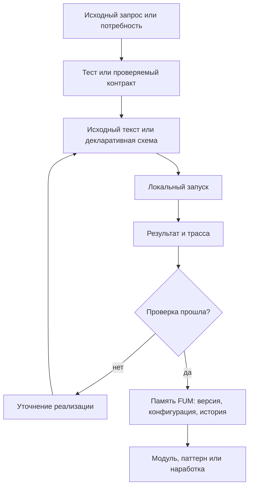

# Воспроизводимые [автоматизации FUM](../Глоссарий/автоматизация-FUM.md)

## Требование

Устойчивые автоматические алгоритмические структуры [FUM](../Глоссарий/FUM.md) должны быть предсказуемыми и воспроизводимыми. Это относится к [автоматизациям FUM](../Глоссарий/автоматизация-FUM.md), [автоматическим органам восприятия FUM](../Глоссарий/автоматический-орган-восприятия-FUM.md), [автоматическим органам действия FUM](../Глоссарий/автоматический-орган-действия-FUM.md), [устройствам восприятия и действия FUM](../Глоссарий/устройство-восприятия-и-действия-FUM.md), workflow, проверкам, преобразованиям [памяти](../Глоссарий/память-FUM.md), интерфейсным механизмам и визуализации на дисплее.

[Автоматизация FUM](../Глоссарий/автоматизация-FUM.md) не должна существовать только как неявное поведение запущенной системы. Если структура становится устойчивой частью работы [FUM](../Глоссарий/FUM.md), её исходные тексты, конфигурации, схемы данных, версии и история изменений должны быть частью [памяти FUM](../Глоссарий/память-FUM.md).

## Граница понятия

К [автоматизациям FUM](../Глоссарий/автоматизация-FUM.md) относятся любые закреплённые алгоритмические структуры, которые:

- принимают наблюдения, события, состояние [памяти](../Глоссарий/память-FUM.md) или команды;
- сжимают широкий входной поток внешнего события до компактного описания;
- разворачивают высокоуровневое описание действия до низкоуровневых действий исполнительных механизмов;
- преобразуют данные, выбирают действия, запускают проверки или строят представления;
- управляют [агентским циклом](../Глоссарий/агентский-цикл.md), workflow, инструментом, интерфейсом или аппаратным контуром;
- производят результат, который влияет на [внутреннее состояние](../Глоссарий/внутреннее-состояние.md), пользовательскую поверхность, физическое действие или следующую [наработку](../Глоссарий/наработка.md).

Автоматизация может быть программным кодом, декларативной схемой, графом состояний, набором правил, шаблоном вызова инструментов, визуализационным пайплайном, управляющим контуром сенсора или исполнительного устройства. Форма может различаться, но требование сохраняется: устойчивое поведение должно иметь восстановимый источник.

## Канонические имена автоматизаций

Исходное смысловое имя каждой новой или переименовываемой [автоматизации FUM](../Глоссарий/автоматизация-FUM.md) задаётся на русском языке кириллицей. Отображаемая латинская форма получается точным вызовом API LinguisticKit `applyingTransform(from: .Cyrl, to: .Latn, withTable: .ru)` на закреплённой ревизии `837e2ce107b97ee7b9d3344c9fe99142281fe393`. Эта форма канонична в границах FUM; она не объявляется универсальным стандартом транслитерации и не отождествляется с ISO или ГОСТ.

Технический slug является отдельным производным слоем FUM. После получения отображаемой формы он переводится в нижний регистр, пробелы заменяются дефисами, а для пространств имён с закреплённым префиксом добавляется этот префикс, например `fum-`. Ни изменение регистра, ни замена пробелов, ни префикс не являются поведением LinguisticKit. Исходное кириллическое имя, отображаемая транслитерация, итоговый slug, таблица `.ru` и закреплённая ревизия должны оставаться наблюдаемыми частями контракта автоматизации.

Два разных исходных имени не могут молча получить один slug: коллизия считается ошибкой валидации и устраняется выбором различимых смысловых имён, а не произвольным числовым суффиксом. Смена закреплённой ревизии LinguisticKit не применяется автоматически; она оформляется как явная миграция всех затронутых имён с просмотром diff, проверкой коллизий и обновлением сохранённого происхождения.

Существующие идентификаторы, созданные до принятия этого контракта, могут временно сохраняться только как точный [реестр названий автоматизаций](../Инструменты/реестр-названий-автоматизаций.json) до отдельной миграции. Исключение нельзя использовать как образец, копировать для новой автоматизации или расширять при обычном добавлении; переименовываемая автоматизация уже обязана перейти на каноническую схему.

Исполняемая репозиторная проверка этого контракта использует [материализованный LinguisticKit](../Зависимости/README.md) на закреплённой ревизии. Пакет подключён как Git submodule из форка рядом с актуальным FUM, а [автоматизация Git-зависимостей](../Инструменты/fum-proverka-git-zavisimostej/SKILL.md) автономно проверяет URL и роли `origin` и `upstream`, `.gitmodules`, достижимость выбранного коммита из локально полученных refs форка, точный gitlink и чистоту клона. Живая линия форка, синхронизация с оригиналом и публикация ревизии остаются отдельной внешней проверкой GitHub.

## Потенциально повторяемые задачи

[Автоматизация FUM](../Глоссарий/автоматизация-FUM.md) нужна не только там, где задача уже многократно повторилась. Если задача выглядит потенциально повторяемой, [FUM](../Глоссарий/FUM.md) должен рассматривать её как ранний кандидат на автоматизацию уже при первом выполнении. Важный сигнал - не частота в прошлом, а ожидаемая польза от повторного запуска, единой методики, сравнимости результатов, проверки или передачи процедуры другому агенту.

К таким задачам относятся оценки трудоёмкости и стоимости, сводные таблицы, обновляемые описания, проверки связности, сбор статистики, построение отчётов, преобразование источников и другие действия, где ручной результат быстро становится скрытой методикой. Если автоматизация не создаётся сразу, [память FUM](../Глоссарий/память-FUM.md) должна явно хранить ручной статус результата, причину отсрочки и ближайший шаг к автоматизации.

Минимально допустимый первый слой для потенциально повторяемой задачи - проверяемый шаблон, декларативный контракт, фикстура, сценарий запуска или список критериев приёмки. Полноценный скрипт может появиться позже, но сама потребность не должна теряться между [исходным запросом](../Глоссарий/исходный-запрос.md), [журналом работ](../Глоссарий/журнал-работ.md), планированием и коммитом.

## Предсказуемость и воспроизводимость

Предсказуемость означает, что по исходным данным, версии автоматизации, конфигурации, окружению и доступным внешним состояниям можно понять, почему получен именно такой результат. Воспроизводимость означает, что повторение автоматизации в сопоставимых условиях даёт тот же результат или объяснимое расхождение.

Если автоматизация использует недетерминированные элементы, [FUM](../Глоссарий/FUM.md) должен фиксировать их явно: seed, версию модели, время, состояние внешнего сервиса, доступный снимок среды, уровень неопределённости, ограничения доступа и другие источники расхождения. Непредсказуемость не должна прятаться внутри автоматизации как скрытый побочный эффект.

## Исходные тексты и история изменений

Для устойчивой [автоматизации FUM](../Глоссарий/автоматизация-FUM.md) в [памяти](../Глоссарий/память-FUM.md) должны сохраняться:

- исходные тексты или декларативные описания автоматизации;
- конфигурации, зависимости, версии моделей и параметры окружения;
- входные и выходные схемы, включая допустимые ошибки и неопределённости;
- тесты, контрольные примеры, трассы запусков и критерии приёмки;
- история изменений, причины изменений и связь с [исходными запросами](../Глоссарий/исходный-запрос.md);
- сведения о [уровне доступа](../Глоссарий/уровень-доступа.md), публикации, передаче и повторном использовании;
- связь с коммитами, [наработками](../Глоссарий/наработка.md), [модулями](../Глоссарий/модуль-FUM.md) и затронутой [производной документацией](../Глоссарий/производная-документация.md).

Если автоматизация не может быть полностью опубликована из-за секретов, приватных данных или внешних ограничений, [память FUM](../Глоссарий/память-FUM.md) всё равно должна хранить разрешённую форму: метаданные, интерфейсный контракт, описание недоступных частей, проверочный статус и причину ограничения.

## [Язык автоматизаций FUM](../Глоссарий/язык-автоматизаций-FUM.md)

Для устойчивых автоматизаций нужен [язык автоматизаций FUM](../Глоссарий/язык-автоматизаций-FUM.md): язык программирования и описания автоматизаций, оптимизированный для работы с ним со стороны LLM. Такой язык должен позволять модели читать, генерировать, объяснять, проверять и точечно править автоматизацию без потери воспроизводимости и происхождения.

В этом языке автоматизация должна выражать не только вычислительные шаги, но и входные и выходные схемы, разрешённые эффекты, границы доступа, подтверждения, тесты, трассы запусков, версии и связь с [исходными запросами](../Глоссарий/исходный-запрос.md). Иначе смысл автоматизации остаётся распределённым между кодом, комментариями, скрытым состоянием агента и устной договоренностью.

Оптимизация для LLM требует небольшой строгой грамматики, канонического форматирования, явных эффектов, локальных областей правки и проверочных сообщений, которые указывают на конкретные фрагменты исходного текста. Первое подробное требование описано в документе [LLM-ориентированный язык автоматизаций](21-LLM-ориентированный-язык-автоматизаций.md).

Этот язык связан с [системой структурирующих операторов FUM](../Глоссарий/система-структурирующих-операторов-FUM.md): автоматизационная конструкция должна быть не просто командой, а проверяемым оператором или связкой операторов распознавания, порождения, валидации и трассировки. Тогда повторяемый рабочий приём может сначала закрепиться как операторная форма, затем получить синтаксис языка автоматизаций и только после этого стать переносимой исполняемой автоматизацией.

## Тензорные вычислительные автоматизации

Некоторые [автоматизации FUM](../Глоссарий/автоматизация-FUM.md) могут иметь чистое численное ядро, которое выгодно исполнять не как обычный скрипт, а как тензорный вычислительный граф на GPU или другом ускорителе. Для [FUM](../Глоссарий/FUM.md) это допустимо только как воспроизводимый целевой слой: исходный контракт автоматизации, тесты, эталонная реализация и трасса компиляции остаются в [памяти](../Глоссарий/память-FUM.md), а ускоренный граф считается производным артефактом.

Минимальный контракт такого контура должен фиксировать:

- ограниченное подмножество языка или DSL, из которого строится граф;
- входные и выходные формы тензоров, типы, допустимые операции и ограничения чистоты;
- целевой формат или компиляторный слой: например ONNX, StableHLO, MLIR, XLA, IREE, TVM, Triton или TensorRT;
- эталонное CPU-исполнение или простую интерпретацию для проверки эквивалентности;
- версии компилятора, runtime, execution provider, драйверов и аппаратного профиля, насколько они публикационно чисто доступны;
- benchmark и критерий, при котором ускоренный путь действительно полезен;
- fallback-путь, если ускоритель, формат или оптимизация недоступны.

Такой слой особенно подходит для массивных регулярных вычислений: линейной алгебры, обработки изображений, DSP, batch processing, map/reduce, регулярных симуляций и сходных задач. Он не должен использоваться как универсальный способ исполнять произвольные программы через неудобный графовый интерпретатор: парсеры, компиляторы, системные вызовы, работа со строками, динамическая аллокация и нерегулярные структуры требуют других носителей автоматизации.

## Локальное воспроизведение, тесты и [TDD](../Глоссарий/TDD.md)

[FUM](../Глоссарий/FUM.md) должен стремиться локально воспроизводить в [памяти](../Глоссарий/память-FUM.md) все [автоматизации FUM](../Глоссарий/автоматизация-FUM.md), которые реально используются в работе проекта. Локальное воспроизведение означает, что для автоматизации сохраняется не только описание намерения, но и проверяемый носитель поведения: исходный текст или декларативная схема, команда запуска, конфигурация, минимальные входные примеры, ожидаемые результаты и тесты.

Если автоматизация зависит от внешней модели, сервиса, закрытого приложения, прав доступа или непубликуемых данных, локальная [память FUM](../Глоссарий/память-FUM.md) должна хранить воспроизводимую границу этой зависимости. Такой границей может быть адаптер, интерфейсный контракт, локальный симулятор, фикстура, снимок разрешённых данных, отчёт о невоспроизводимой части или ручная процедура проверки. Невозможность полного локального запуска не отменяет обязанности сохранить то, что можно проверить без секрета и без скрытого состояния.

Разработка новых и изменяемых автоматизаций ведётся через [TDD](../Глоссарий/TDD.md): ожидаемое поведение сначала формулируется как локальный тест или проверка, затем реализация доводится до прохождения этой проверки, а после этого код и тесты уточняются без потери исходного проверяемого контракта. Для уже существующих автоматизаций допустимы характеризационные тесты: они фиксируют фактическое поведение перед изменением и постепенно сужают область непроверенного.

Базовый тестовый набор автоматизации должен запускаться локально, быть публикационно чистым и не требовать сетевых вызовов, секретов или актуального состояния внешнего сервиса. Интеграционные проверки с внешним состоянием могут существовать отдельно, но должны явно описывать свои зависимости, ограничения и причину, по которой они не входят в обычный локальный набор.

## Воспроизводимая координация задач

Автоматический допуск задач к общей рабочей ветке должен быть частью проверяемой памяти, а не скрытым соглашением внешнего диспетчера. Минимальный контракт сочетает атомарное владение веткой с наблюдаемым Git-постусловием: один сеанс получает право изменять именованную ветку, следующие сеансы ждут, а владение снимается только после отсутствия незакоммиченных изменений вне явно исключённого изменчивого состояния.

Для текущего репозиторного контура этот контракт реализует [fum-branch-task-gate](../Инструменты/fum-branch-task-gate/SKILL.md). Проектные hooks Codex вызывают закоммиченную в `HEAD` версию локального сценария перед пользовательским ходом, перед поддерживаемым локальным инструментом и при остановке хода, поэтому незавершённая правка самого helper не подменяет уже доверенный барьер. Состояние владения хранится в общем Git-каталоге, а не в рабочем дереве. Полный ref ветки хэшируется в имя локального файла: повторный вход точно того же `turn_id` идемпотентен, а новый ход того же внутреннего `session_id` обновляет `turn_id` и поколение, сохраняя право продолжить собственную незавершённую работу. Долговременные владения разных веток разных сеансов не конфликтуют; короткие переходы общего Git-каталога при этом намеренно сериализуются. Внутренние идентификаторы hook не подменяют корневой `Codex-Thread-ID`.

Незакоммиченные staged, unstaged и untracked-изменения вне корневой `.obsidian/` блокируют новый захват. Исключение `.obsidian/` уменьшает ложные задержки от изменчивого состояния редактора, но не меняет правил публикационной классификации этого каталога. Detached HEAD отклоняется, отдельные клоны не координируются, строгий FIFO-порядок ожидающих задач не обещается.

Переходы состояния сериализуются общей POSIX-блокировкой. Начальный захват публикует полностью записанный JSON атомарным hard link, а переход к новому ходу того же `session_id` атомарно заменяет запись вместе с `turn_id` и уникальным `lease_id`. Штатный `Stop` сверяет `session_id` и `turn_id`, поэтому повторный или запоздалый сигнал не может удалить более новый ход того же сеанса; освобождение дополнительно выполняется как compare-and-delete текущего поколения. Аварийное снятие требует точного `lease_id`, предварительно прочитанного через `status --json`, и выполняет тот же fenced compare-and-delete под общей блокировкой.

Запись хранит хэш локальной идентичности worktree. Переключение ветки владельцем не переносит допуск: исходная запись сохраняется, `Stop` предупреждает о несовпадении, а любой следующий сеанс в том же worktree отклоняется. После проверки остановки прежней задачи stale-запись можно адресно снять по сохранённому полному ref и поколению, в том числе после переименования ветки. Принудительно открытая в нескольких worktree одна ветка тоже отклоняется, поскольку чистота одного рабочего дерева не доказывает чистоту остальных.

`Stop` является сигналом конца хода, а не доказательством смыслового завершения пользовательской задачи. Поэтому барьер сериализует активные ходы и незакоммиченную файловую работу как проверяемое приближение: чистый промежуточный ход освобождает владение, а грязный сохраняет его. Полный жизненный цикл задачи потребовал бы отдельного внешнего сигнала.

Поскольку совпавшие command-hooks одного события запускаются параллельно, `PreToolUse` служит дополнительным fence после `Stop`: если другой `Stop` продолжил уже освобождённый ход, следующий поддерживаемый локальный инструмент либо повторно захватывает ещё свободную ветку тем же `turn_id`, либо отклоняется после передачи ветки новому владельцу. Старый `turn_id` того же сеанса тоже не получает доступ поверх более нового хода. Для полного turn-контракта веточный барьер должен быть единственным активным `Stop`, способным запросить continuation; дополнительные проверки такого типа должны выполняться вместе с освобождением в одном последовательном агрегаторе. Полный разрешённый состав project-, user-, plugin- и managed-hooks проверяется через `/hooks`, а не только чтением `.codex/config.toml`.

Tool-hooks не доказывают отсутствие уже запущенного писателя. Повторный `PreToolUse` не возникает для `write_stdin` существующей unified-exec-сессии, ранее допущенная длительная команда может завершиться после `Stop`, hosted-инструменты не входят в локальный tool-hook-контур, а специализированные пути могут его обойти. Поэтому перед `Stop` сотрудничающая задача обязана дождаться всех своих процессов и субагентов, способных позднее записать в репозиторий. Без отдельного реестра живых исполнителей и heartbeat эта граница остаётся организационным инвариантом, а не автоматически доказанным свойством Git-снимка.

Ожидание `UserPromptSubmit` имеет внутренний дедлайн `85 800` секунд, оставляющий десятиминутный запас до host-timeout `86 400` секунд. Git-команды и ожидание внутренней блокировки тоже ограничены по времени. Пойманная ошибка `UserPromptSubmit` возвращает событийный `decision: block`, ошибка `PreToolUse` — `permissionDecision: deny`, а ошибка `Stop` сохраняет владение и показывает предупреждение, не создавая цикл продолжения. Это не является абсолютной границей исполнения Codex: если непроверенный hook пропущен, процесс вообще не запустился или host аварийно завершил его раньше ответа, проектный сценарий не может сам остановить ход. Поэтому фактическая работа зависит от доверия точному определению hooks и проверяется отдельным живым прогоном после загрузки конфигурации.

После аварийного завершения владение не снимается по одному возрасту файла. Автоматический TTL без heartbeat и fencing способен создать split-brain, поэтому восстановление остаётся явным действием после внешнего подтверждения остановки прежней задачи. Повреждённая запись, из которой нельзя надёжно прочитать поколение, закрывается с контролируемой ошибкой и намеренно не удаляется обычным `--force`: она требует отдельной ручной проверки локального файла в общем Git-каталоге.

Локальные тесты воспроизводят одновременный захват, полный переход между двумя синтетическими событиями hook, защиту нового хода того же сеанса от запоздалого `Stop`, повторный захват продолжаемого хода после параллельного `Stop`, запрет прежнего хода после передачи ветки или обновления `turn_id`, ожидание, продолжение владельца, чистое освобождение, mismatch отсутствующего ожидаемого поколения, fenced-восстановление, исполнение закоммиченного helper вместо грязной копии, исключение `.obsidian/`, разные linked worktree и отказ в неподдерживаемом Git-контексте. Реализация рассчитана на POSIX-среду с `flock` и атомарными hard links; разные клоны не координируются, а Windows не поддерживается и не получает подтверждённого допуска.

## Веткозависимый диспетчер следующего шага

[fum-branch-next-step](../Инструменты/fum-branch-next-step/SKILL.md) дополняет веточный барьер локально проверяемым выбором работы. В `Планирование/следующие-шаги-веток/` хранится по одной записи на полный ref автоматически развиваемой ветки. Запись содержит устойчивый `step_id`, статус, паспорт проекта, одну задачу, критерии завершения и источники; `validate` отклоняет detached HEAD, отсутствие или дубликат записи, неверный ref, пустые обязательные разделы и несуществующий проект.

Внешняя часть реализуется пятиминутным heartbeat Codex, потому что частая самостоятельная Scheduled-задача создавала бы отдельный пустой прогон при каждом опросе. Heartbeat остаётся в одной диспетчерской задаче, дважды получает максимальный поддерживаемый recent-снимок до 50 задач, исключает только собственный точный `CODEX_THREAD_ID` и создаёт обычную локальную задачу лишь при отсутствии других наблюдаемых `active`-задач. Недоступный host, неизвестное состояние или ошибка означают отказ от запуска. Контракт списка не возвращает общее число или признак полноты, поэтому отсутствие более старой активной задачи за пределами снимка не доказано.

Между чтением списка и созданием задачи нет host-транзакции. Локальный сценарий уменьшает окно гонки: повторно проверяет активный `branch_ref` и `step_id` под POSIX-блокировкой, атомарно публикует claim в общем Git-каталоге и не разрешает второй запуск того же шага. После claim диспетчер повторяет список задач. Созданная задача снова сверяет оба ожидаемых значения до записи, полностью читает запись шага и паспорт проекта, соблюдает границы действий, доступа и публикации, а веточный барьер сериализует локальную работу. Эти слои не обещают глобальную блокировку между разными host или отдельными клонами.

После успешного выполнения задача обязана заменить запись новым шагом и новым `step_id` либо установить `paused`, `blocked` или `done`. Прежний claim не имеет TTL: до вызова `create_thread` диспетчер снимает только собственное наблюдённое поколение, а после вызова делает это лишь при явном подтверждении, что задача не создана. Ошибка, тайм-аут или неоднозначный ответ могут скрывать уже состоявшееся создание, поэтому сохраняют claim; fenced-восстановление требует внешнего подтверждения остановки прежней задачи.

В репозитории воспроизводятся схема записи, валидатор, claim-протокол, автономные фикстуры и [шаблон heartbeat-диспетчера](../Инструменты/fum-branch-next-step/references/heartbeat-prompt.md). Сам heartbeat и штатные операции списка и создания задач принадлежат поверхности Codex; их непрозрачный локальный идентификатор не становится частью публикуемой памяти.

## [Реестр системных приложений и инструментов](../Глоссарий/реестр-системных-приложений-и-инструментов.md)

Чтобы [автоматизации FUM](../Глоссарий/автоматизация-FUM.md) и рабочие сессии оставались воспроизводимыми, [память FUM](../Глоссарий/память-FUM.md) должна хранить не только итоговые файлы и команды, но и сведения об инструментах, через которые выполнялась работа.

[Реестр системных приложений и инструментов](../Инструменты/реестр-системных-приложений-и-инструментов.md) служит устойчивым справочником таких зависимостей: системных приложений, CLI-команд, инструментов среды агента, MCP-инструментов, локальных скриптов и внешних сервисов. Для каждого повторно используемого инструмента фиксируются назначение, способ проверки версии, известные ограничения и публикационно чистая граница наблюдаемости.

Файл каждого [исходного запроса](../Глоссарий/исходный-запрос.md) должен содержать раздел `## Использованные инструменты`. Этот раздел хранит фактический снимок конкретной [рабочей сессии](../Глоссарий/рабочая-сессия.md): какие инструменты были применены, какие версии были доступны, где версия не раскрывалась средой и на какую запись реестра можно опереться. Так цепочка требования включает не только запрос, производную документацию и коммит, но и инструментальную среду выполнения.

Для составной среды ChatGPT и Codex такой снимок послойный: версия desktop bundle, встроенного runtime, самостоятельного CLI, активная модель и контракты инструментов не подменяют друг друга. Значение модели из конфигурации считается только сконфигурированным значением по умолчанию, пока текущая сессия не подтвердила его как активное.

Если инструмент зависит от внешнего сервиса, закрытого приложения, текущей модели или MCP-сервера, точная версия может быть недоступна. В этом случае фиксируется не выдуманная версия, а проверяемый контракт: имя инструмента, поставщик среды, дата использования, известные ограничения и причина, по которой полный снимок нельзя воспроизвести локально.

## Архивирование прикрепляемых материалов

[Архивирование прикрепляемых материалов](../Планирование/MVP-кандидаты/02-архивирование-прикрепляемых-материалов/README.md) выбрано текущим активным MVP-контуром [FUM](../Глоссарий/FUM.md). Эта автоматизация относится к воспринимающему слою [памяти FUM](../Глоссарий/память-FUM.md): она превращает внешний URL, расшаренный диалог, документ или вложение в локальный источник с происхождением, публикационно чистым извлечением и связью с [исходным запросом](../Глоссарий/исходный-запрос.md).

Минимальный контракт этого контура:

- материал с устойчивым URL сохраняется в канонической папке `Источники/URL/<scheme>/<host>/<path...>/`, а query и fragment добавляются только через хэшированные сегменты, если меняют содержание;
- папка источника содержит сырой или максимально близкий к сырому слой, извлечённый текст или структурные данные, `extraction-report.md` и человекочитаемый `source-index.md`;
- установленный снимок содержит `snapshot-manifest.json` с точным отсортированным перечнем всех управляемых файлов, а фактический набор файлов обязан совпадать с ним;
- файл [исходного запроса](../Глоссарий/исходный-запрос.md), который привёл материал в проект, содержит раздел `## Прикрепляемые материалы` со ссылками на папку источника, индекс и отчёт;
- повторный запуск для того же URL и того же запроса не создаёт дублирующиеся ссылки или бессмысленную копию источника, собирает результат в соседнем staging-каталоге и только после полной проверки заменяет канонический каталог одним атомарным обменом;
- неполный успешный повтор удаляет отсутствующие в новом манифесте прежние структурные файлы, а ошибка до атомарной установки оставляет предыдущий канонический снимок без изменений;
- если файловая система не поддерживает атомарный обмен непустых каталогов, повтор закрывается с ошибкой без двухшагового переименования и без изменения канонического снимка;
- локальный тестовый набор проверяет чистые части поведения без сети и секретов, а внешние ограничения фиксируются в отчёте об извлечении.

Первый общий слой для устойчивых HTML-URL реализован переносимым модулем `Инструменты/fum-request-materials/scripts/source_archive.py` и пользовательским входом `fum source archive <url> --request <file>`. Он сохраняет заголовки с редакцией cookie и исходные байты HTML, извлекает видимый текст и JSON-LD, формирует индекс, отчёт и точный манифест, а затем атомарно устанавливает снимок и идемпотентно связывает его с запросом. Автономная двухверсионная фикстура проводит через тот же вход первый снимок, успешный повтор без устаревшего структурного файла и поздний сбой без сети и секретов. Специализированный `archive-chatgpt-share.py` сохраняет прежний интерфейс и более глубокое извлечение расшаренных диалогов.

## Схема воспроизводимой [автоматизации](../Глоссарий/автоматизация-FUM.md)

## [Чистые функции](../Глоссарий/чистая-функция.md) как паттерн

Идея [чистой функции](../Глоссарий/чистая-функция.md) является предпочтительным паттерном для ядра [автоматизаций FUM](../Глоссарий/автоматизация-FUM.md). Там, где это возможно, автоматизация должна разделяться на две части:

- чистое ядро, которое из явно переданных входов, состояния и конфигурации строит результат без скрытых побочных эффектов;
- оболочки ввода-вывода, которые читают среду, вызывают инструменты, меняют файлы, показывают интерфейс, управляют устройствами или выполняют другие действия с внешним миром.

Такое разделение не запрещает действия. Оно делает границу действия явной: [FUM](../Глоссарий/FUM.md) может отдельно проверять преобразование данных, отдельно наблюдать побочные эффекты и отдельно фиксировать результат в [памяти](../Глоссарий/память-FUM.md).

## Устройства восприятия, действия и дисплей

[Устройства восприятия и действия FUM](../Глоссарий/устройство-восприятия-и-действия-FUM.md) должны проектироваться как воспроизводимые контуры. Устройство восприятия должно фиксировать, из какого сигнала, снимка, события или состояния получено наблюдение. Устройство действия должно фиксировать, из какого состояния, решения и версии автоматизации возникло действие.

Визуализация на дисплее также является частью этого требования. Видимое пользователю состояние должно быть производным от явного снимка данных, версии визуализационной автоматизации и правил отображения. Если экран показывает состояние, которое невозможно восстановить из [памяти](../Глоссарий/память-FUM.md) или агентски доступного снимка, возникает слепая зона [внутреннего состояния](../Глоссарий/внутреннее-состояние.md).

## Автоматические органы восприятия

[Автоматический орган восприятия FUM](../Глоссарий/автоматический-орган-восприятия-FUM.md) является устойчивой восприятийной автоматизацией. Его смысл состоит в том, чтобы при внешнем событии быстро и автоматически сжать широкий входной поток до лаконичного компактного описания, которое уже может быть полностью сохранено в [памяти FUM](../Глоссарий/память-FUM.md) и обработано LLM внутри [FUM](../Глоссарий/FUM.md), локальной или внешней.

Для воспроизводимости такой орган должен фиксировать не только итоговое описание, но и происхождение события, канал, время, версию автоматизации, параметры сжатия, уровень уверенности и известные потери деталей. Если исходный поток слишком велик, приватен или технически недоступен для полного сохранения, [FUM](../Глоссарий/FUM.md) должен явно хранить границу между сохранённым компактным описанием и несохранённой частью потока.

## Автоматические органы действия

[Автоматический орган действия FUM](../Глоссарий/автоматический-орган-действия-FUM.md) является устойчивой деятельной автоматизацией. Его смысл состоит в том, чтобы разворачивать высокоуровневые описания действий, созданные LLM или другим способом, в конкретные низкоуровневые действия исполнительных механизмов: физические движения, управляющие сигналы, вызовы инструментов, операции интерфейса или программные команды.

В биологической аналогии такой орган является аналогом человеческого мозжечка: он связывает намерение и план с координированным исполнением. Для воспроизводимости орган действия должен фиксировать исходное описание действия, версию автоматизации, выбранные низкоуровневые шаги, целевую среду, ограничения доступа, ошибки, отклонения и наблюдаемый результат.

## Адресные описания

Построение [описаний FUM для адресатов](../Глоссарий/описание-FUM-для-адресата.md) является частным случаем воспроизводимой [автоматизации FUM](../Глоссарий/автоматизация-FUM.md). Такая автоматизация принимает явный набор источников из [памяти FUM](../Глоссарий/память-FUM.md), паспорт адресата, правила отбора тезисов и структуру результата, а на выходе даёт адресный Markdown-файл с источниками и ограничениями.

Базовая схема закреплена в [Построении описания FUM для адресата](../Описания/Автоматизации/построение-описания-FUM-для-адресата.md). Она нужна, чтобы адресные материалы можно было пересобрать с нуля после изменения документации, проверить на неподтверждённые утверждения и обновить без потери связи с требованиями.

Адресные описания не должны обновляться точечными ручными правками. Каждое создание, исправление или обновление описания должно быть оформлено как вызов соответствующей автоматизации и полная пересборка результата, чтобы сама рабочая сессия подтверждала, что автоматизация остаётся применимой к текущей [памяти FUM](../Глоссарий/память-FUM.md).

## Сводные статьи документации

Сводные статьи [производной документации](../Глоссарий/производная-документация.md) являются ещё одним частным случаем воспроизводимой [автоматизации FUM](../Глоссарий/автоматизация-FUM.md). Они нужны, когда тема уже раскрыта в нескольких документах, но для работы с [памятью FUM](../Глоссарий/память-FUM.md) требуется одна входная карта, как это сделано для [архитектуры FUM](../Глоссарий/архитектура-FUM.md).

Для таких статей закреплена локальная автоматизация [fum-doc-aggregation](../Инструменты/fum-doc-aggregation/SKILL.md). Её проверяемое ядро принимает JSON-конфигурацию с темой, целью, исходным запросом, опорными документами и ожидаемыми разделами, строит канонический Markdown-каркас и валидирует готовый документ через скрипт [build-doc-aggregation.py](../Инструменты/fum-doc-aggregation/scripts/build-doc-aggregation.py).

Граница этой автоматизации принципиальна: скрипт проверяет происхождение, структуру и ссылки, но не подменяет смысловой синтез. Агент должен читать источники, собирать общую карту темы, сохранять ссылки на глоссарий и фиксировать [открытые вопросы](../Глоссарий/открытый-вопрос.md), если между опорными документами обнаруживается противоречие или неоднозначность.

## Оценочные материалы

Оценочные материалы в `Оценки/` являются повторяемым аналитическим слоем [памяти FUM](../Глоссарий/память-FUM.md). Они нужны, когда проекту требуется понять масштаб уже выполненной или планируемой работы: трудоёмкость, примерную стоимость, сложность сопровождения, объём проверок или другие характеристики, которые должны сравниваться между сессиями.

Для таких материалов закреплена локальная автоматизация [fum-estimates](../Инструменты/fum-estimates/SKILL.md). Её проверяемое ядро принимает JSON-конфигурацию оценки, строит Markdown-файл в `Оценки/` и валидирует, что результат содержит снимок репозитория, вопрос оценки, методику расчёта, компонентные диапазоны, итоговый диапазон, точечную оценку, допущения, ограничения точности, правила оформления результата и ссылки на происхождение.

Граница этой автоматизации такая же важная, как и её польза: скрипт не доказывает истинность чисел и не заменяет содержательную оценку. Он делает методику наблюдаемой, повторяемой и проверяемой, а агент отвечает за смысл диапазонов, честность допущений и фиксацию неопределённости.

## Проектный файловый инвентарь

Служебные генераторы и глобальные проверки должны работать с одним и тем же доказуемым множеством проектных файлов. Произвольный рекурсивный обход репозитория делает результат зависимым от локальных сборок, установленных расширений и кэшей, поэтому одинаковый Git-снимок может давать разные выходы на разных машинах или в разные моменты одной рабочей сессии.

Общая автоматизация [fum-project-files](../Инструменты/fum-project-files/SKILL.md) определяет проектные Markdown-входы как объединение отслеживаемых файлов и новых неигнорируемых файлов. Она структурно исключает `.build`, `.swiftpm`, каталоги кэшей, `.obsidian/plugins` и `.obsidian/themes`, не следует по символическим ссылкам и останавливается, если не может доказать полноту инвентаря. Локальный `.git/info/exclude` не скрывает уже отслеживаемый документ, а принудительное добавление файла внутрь исключённого каталога не делает его проектным входом.

Эта политика является общей для `fum-md-recency`, `fum-obsidian-graph-recency` и файловых обходов `fum-session-coherence`. Исключённые файлы не читаются как источники, не попадают в производные индексы и никогда не переписываются генераторами. Канонические выходные файлы отдельно проверяются на символические ссылки, выход за границу репозитория и разрешение внутрь исключённого хранилища.

## Тепловая карта графа Obsidian

Цветовое состояние графа Obsidian является частью видимой пользовательской поверхности текущей [памяти FUM](../Глоссарий/память-FUM.md). Если оно используется как способ понять свежесть узлов, оно должно строиться из воспроизводимого источника, а не только из ручной настройки интерфейса.

Для этого закреплена локальная автоматизация [fum-obsidian-graph-recency](../Инструменты/fum-obsidian-graph-recency/SKILL.md). Её скрипт [build-obsidian-graph-recency.py](../Инструменты/fum-obsidian-graph-recency/scripts/build-obsidian-graph-recency.py) читает служебные метки `FUM-MD-RECENCY`, группирует Markdown-файлы по возрасту последнего содержательного редактирования и записывает в `.obsidian/graph.json` цветовые группы Obsidian через поисковые запросы `path:"..."`. Обновление принимает явную опорную дату либо сохраняет выбранную дату MSK в проектном sidecar-файле `.obsidian/fum-recency-reference-date`; последующая структурная проверка использует сохранённое значение, а не текущий календарный день.

Текущая шкала использует десять возрастных корзин для первого десятидневного окна и явную последовательность цветов от красного к синему: горячие красные узлы показывают свежие содержательные правки, холодные синие - старые области памяти, а промежуточные оранжевые, жёлтые, зелёно-бирюзовые и сине-бирюзовые ступени делают переход между ними постепенным.

Такая тепловая карта делает свежие области памяти сразу видимыми в графе, а Git сохраняет не только факт ручного открытия графа, но и воспроизводимое правило окрашивания. Смена сегодняшней даты не делает неизменный снимок ошибочным: новый календарный срез создаётся только явным обновлением опорной даты. Sidecar отделён от собственного JSON Obsidian, потому что приложение удаляет незнакомые поля при сохранении настроек. Скрипт намеренно заменяет весь список `colorGroups`, потому что тепловая карта является цельным режимом визуализации; остальные настройки графа сохраняются без изменения.

## Проверка связности рабочей сессии

Связность [рабочей сессии](../Глоссарий/рабочая-сессия.md) является проверяемым свойством [памяти FUM](../Глоссарий/память-FUM.md). Если запрос повлиял на проект, недостаточно изменить нужные файлы: нужно сохранить трассу, по которой следующий агент или человек сможет восстановить происхождение изменения, использованные инструменты, отчёт, проверки и состав Git-изменений.

Для этого закреплена локальная автоматизация [fum-session-coherence](../Инструменты/fum-session-coherence/SKILL.md). Её скрипт [check-session-coherence.py](../Инструменты/fum-session-coherence/scripts/check-session-coherence.py) проверяет:

- навигацию файла [исходного запроса](../Глоссарий/исходный-запрос.md) и обратную ссылку соседнего запроса;
- наличие соответствующего отчёта в [журнале работ](../Глоссарий/журнал-работ.md) и ссылку отчёта на исходный запрос;
- единственный корректный `Codex-Thread-ID` корневой задачи в файле запроса, его совпадение с явно переданным корневым идентификатором и с последним Git trailer подготовленного сообщения коммита;
- раздел `## Использованные инструменты` со ссылкой на [реестр системных приложений и инструментов](../Инструменты/реестр-системных-приложений-и-инструментов.md), а для новых запросов - отсутствие неквалифицированной общей записи `Codex - версия не раскрывается средой`;
- локальные Markdown-ссылки во всём репозитории, включая существование цели и точное совпадение регистра каждого компонента пути с реальным именем файла или каталога;
- формальный вопросительный признак каждого материала `Вопросы и ответы/*.md`, кроме README: непустой раздел `## Вопрос` должен оканчиваться знаком `?`; смысловая классификация просьб и команд остаётся обязанностью агента и просмотра diff;
- отсутствие верхних справочных блоков происхождения в затронутых производных Markdown-файлах, чтобы `Источники требований`, `Источники`, опорные материалы и аналогичные разделы оставались после основного содержания;
- соответствие текущего `git status --short --untracked-files=all` разделу `## Повлиял на файлы`, включая явные маркеры удалённых путей без битых Markdown-ссылок, чтобы временные файлы, кэши и другой машинный мусор не попадали в незамеченное состояние перед коммитом.

Глобальные проверки Markdown-файлов используют общий проектный инвентарь. Поэтому локальные зависимости и кэши не могут ни породить ложную ошибку, ни сделать битую проектную ссылку формально существующей.

Эта автоматизация не решает смысловую корректность результата и не заменяет просмотр diff. Она выделяет повторяющуюся структурную проверку, которая раньше выполнялась вручную и могла легко распасться при длинной сессии.

## Двунаправленность активных вопросов

Открытый или частично прояснённый вопрос сохраняет нерешённую зависимость видимой только тогда, когда связь читается в обе стороны. Раздел `## Затронутая документация` перечисляет фактические цели вопроса, а каждая такая цель должна рядом с зависимым утверждением или в уместном справочном блоке ссылаться обратно на вопрос. Формальная ссылка без смыслового основания не заменяет проверку заявленной цели.

Для структурной части этого контракта закреплена локальная автоматизация [fum-question-backlinks](../Инструменты/fum-question-backlinks/SKILL.md). Её сценарий [check-question-backlinks.py](../Инструменты/fum-question-backlinks/scripts/check-question-backlinks.py) получает активные статусы из `Вопросы/README.md`, требует у каждого вопроса непустой раздел затронутой документации и для каждой локальной цели проверяет существование Markdown-файла, отсутствие symlink-компонентов, точный регистр пути и обратную Markdown-ссылку. Пустая цель, ссылка только на фрагмент, изображение, экранированный текст, inline-code, HTML-комментарий или fenced-блок не могут удовлетворить контракт.

Автоматизация намеренно не требует, чтобы любая контекстная ссылка на вопрос из журнала, запроса или описания была объявлена его целью. Она также не оценивает смысловую уместность пары: эту часть выполняет агент при создании вопроса и при просмотре diff. Если заявленная цель ошибочна, исправляется сам вопрос с сохранением происхождения решения, а не целевой документ ради формального прохождения.

## Полнота корневого документационного индекса

Корневой `README.md` является тематической картой памяти для нового читателя, поэтому появление номерного документа или папочного индекса `Документация/NN-*/README.md` не должно оставаться незаметным. Ручной список ожидаемых имён быстро устаревал бы вместе с самим README и не давал бы независимой проверки полноты.

Для этого закреплена локальная автоматизация [fum-readme-index](../Инструменты/fum-readme-index/SKILL.md). Она получает доказуемый инвентарь через [fum-project-files](../Инструменты/fum-project-files/SKILL.md), выбирает верхнеуровневые `Документация/NN-*.md` и папочные точки входа `Документация/NN-*/README.md`, а затем требует прямую ссылку на каждый путь внутри единственного раздела `## Документация по темам` корневого README. Ссылки в других разделах, коде или комментариях пропуск не маскируют; регистр пути должен совпадать точно.

Проверка ничего не записывает, не зависит от сети, секретов или текущей даты. Её фикстуры сначала зафиксировали красное состояние при отсутствующей реализации и при семи фактических пропусках текущего README, после чего реализация и сам индекс были доведены до зелёного состояния. Отдельный явный шаг [fum-smoke-check](../Инструменты/fum-smoke-check/SKILL.md) проверяет и тесты автоматизации, и полноту реального README перед коммитом.

## Единый локальный smoke-check

Единый локальный smoke-check является надстроечной проверочной автоматизацией над уже закреплёнными инструментами репозитория. Его задача — дать один наблюдаемый вход для регрессионного прогона перед коммитами и публикационными сессиями: тесты локальных автоматизаций, тесты и сборка SwiftPM-прототипов, проверка их lint-контракта, пересборка проверяемых реестров, проверка полноты корневого README, проверка двунаправленности активных вопросов, recency-проверка Markdown-файлов, проверка тепловой карты графа Obsidian и проверка связности выбранной рабочей сессии.

Для этого закреплена локальная автоматизация [fum-smoke-check](../Инструменты/fum-smoke-check/SKILL.md). Её скрипт [run-smoke-check.py](../Инструменты/fum-smoke-check/scripts/run-smoke-check.py) запускает все наборы `unittest`, найденные в `Инструменты/*/tests`, находит пакеты вида `Прототипы/*/Package.swift`, получает их фактические продукты через `swift package dump-package`, запускает `swift test` и отдельно собирает каждый исполняемый продукт. Затем сценарий пересобирает и валидирует плановый JSON-реестр, вызывает `fum-readme-index` и `fum-question-backlinks`, проверяет свежесть `FUM-MD-RECENCY` без записи, проверяет актуальность `.obsidian/graph.json` как recency-heatmap по сохранённой опорной дате и запускает [fum-session-coherence](../Инструменты/fum-session-coherence/SKILL.md) для конкретного файла `Запросы/<YYYY-MM-DD_HH-MM-SS_MSK>_<краткое-название-запроса>.md`.

Swift-пакеты по умолчанию проходят строгий `swift format lint` по `Package.swift` и всем фактическим путям целей с общей закреплённой [конфигурацией форматтера](../Инструменты/fum-smoke-check/swift-format.json). Неявные `.swift-format-ignore` запрещены, потому что способны скрыть явно переданный файл от строгой проверки. [Политика SwiftPM-пакетов](../Инструменты/fum-smoke-check/swift-package-policy.json) хранит ожидаемый инвентарь пакетов и продуктов; исчезновение ожидаемого пакета или продукта и появление незарегистрированного пакета считаются ошибками. Временное lint-исключение допускается только как видимая проверяемая запись с причиной, критерием снятия, источником и SHA-256 защищённого снимка исходников и центральной конфигурации. Изменение снимка делает исключение устаревшим и останавливает проверку; тесты и сборка исполняемых продуктов при этом никогда не исключаются.

По умолчанию smoke-check не требует секретов, сетевых зависимостей и внешних сервисов. Объявленная SwiftPM-зависимость верхнеуровневого пакета в `Прототипы/` отклоняется до тестов и сборки, пока для неё не добавлен отдельный воспроизводимый offline-контракт. Локальная зависимость служебной Swift-обёртки от LinguisticKit допускается через проверяемый Git submodule: smoke-check отдельно подтверждает Git-топологию и живые эталоны транслитерации. Новый верхнеуровневый SwiftPM-пакет в `Прототипы/` автоматически обнаруживается и должен быть явно принят в проверяемый инвентарь политики. Текущий Swift-контур требует macOS 14 или новее, Swift 6.0 или новее и Xcode с `swift` и `swift format`; конфигурация не использует имена правил, отсутствующие в Swift 6.0, но точное совпадение семантики разных версий форматтера не обещается. Принятый снимок полностью проверен на Swift 6.4 и Xcode 27.0. Если новая локальная автоматизация получает каталог тестов, она автоматически попадает в smoke-check; если появляется новый проверяемый реестр, его нужно явно добавить в сценарий и закрепить тестом самой автоматизации smoke-check.

## Ревью проделанной работы

Ревью проделанной работы является повторяемым качественным контуром [памяти FUM](../Глоссарий/память-FUM.md). Оно нужно, когда уже созданный Git-срез, серия коммитов или крупная [рабочая сессия](../Глоссарий/рабочая-сессия.md) должны получить отдельный сохранённый вывод: что проверено, какие находки есть или отсутствуют, какие проверки прошли и какие риски остаются после ревью.

Для этого закреплена локальная автоматизация [fum-work-review](../Инструменты/fum-work-review/SKILL.md). Её скрипт [build-work-review.py](../Инструменты/fum-work-review/scripts/build-work-review.py) принимает JSON-конфигурацию с исходным запросом, Git-базой, головой, областью проверки, фокусом ревью, списком находок, проверками, остаточными рисками и итоговым решением. На выходе создаётся Markdown-отчёт в `Ревью/`, а валидатор проверяет обязательные разделы, ссылки на происхождение, команды проверок, вывод ревьюера и отсутствие черновых маркеров.

Такая автоматизация не подменяет содержательную ответственность ревьюера. Она делает повторяемым то, что можно формализовать: сбор Git-снимка, структуру результата, связь с [исходным запросом](../Глоссарий/исходный-запрос.md), сохранение отчёта и локальную проверку формы. Сами находки, статус отсутствия существенных замечаний и остаточные риски должны быть сформулированы после чтения diff и проверки контекста.

## Связь с архитектурой

[Автоматизация FUM](../Глоссарий/автоматизация-FUM.md) может становиться [модулем FUM](../Глоссарий/модуль-FUM.md), [паттерном памяти](../Глоссарий/паттерн-памяти.md) или переносимой [наработкой](../Глоссарий/наработка.md). Для этого одной полезности недостаточно: автоматизация должна иметь источник, проверочный статус, область применимости и историю изменений.

В [агентском цикле](../Глоссарий/агентский-цикл.md) автоматизация может быть шагом выбора действия, способом обработки наблюдения, проверкой остановки, формой отображения результата или интерфейсом к инструменту. В [модульной архитектуре FUM](../Глоссарий/модуль-FUM.md) она должна быть описана так, чтобы её можно было понять, проверить, заменить, улучшить или передать другому узлу.

Для [физического действия FUM](../Глоссарий/физическое-действие-FUM.md) это требование особенно важно: управляющий контур сенсора, [автоматического органа действия](../Глоссарий/автоматический-орган-действия-FUM.md), исполнительного механизма или роботизированной системы не должен быть непрозрачной привычкой. Перед переходом к физическому действию [FUM](../Глоссарий/FUM.md) должен иметь восстановимую связь между требованием, моделью, исходным текстом автоматизации, проверкой и наблюдаемым результатом.

## Внешний материал

- [Официальный справочник Codex Hooks](https://developers.openai.com/codex/hooks)
- [Официальный справочник запланированных задач Codex](https://developers.openai.com/codex/app/automations)
- [архивированный источник Roman-Kerimov/LinguisticKit](../Источники/URL/https/github.com/Roman-Kerimov/LinguisticKit/source-index.md)
- [архивированная выбранная ревизия LinguisticKit](../Источники/URL/https/github.com/Roman-Kerimov/LinguisticKit/commit/837e2ce107b97ee7b9d3344c9fe99142281fe393/source-index.md)

## Источники требований

- [исходный запрос 2026-07-21 13:40:42 MSK — Актуализировать форк и подключить LinguisticKit](../Запросы/2026-07-21_13-40-42_MSK_актуализировать-форк-и-подключить-LinguisticKit.md)

- [исходный запрос 2026-06-22 08:58:31 MSK](../Запросы/2026-06-22_08-58-31_MSK.md)
- [исходный запрос 2026-06-22 09:05:49 MSK](../Запросы/2026-06-22_09-05-49_MSK.md)
- [исходный запрос 2026-06-22 09:11:47 MSK](../Запросы/2026-06-22_09-11-47_MSK.md)
- [исходный запрос 2026-06-22 09:40:25 MSK](../Запросы/2026-06-22_09-40-25_MSK.md)
- [исходный запрос 2026-06-22 10:00:58 MSK](../Запросы/2026-06-22_10-00-58_MSK.md)
- [исходный запрос 2026-06-23 13:47:38 MSK](../Запросы/2026-06-23_13-47-38_MSK.md)
- [исходный запрос 2026-06-23 19:06:56 MSK](../Запросы/2026-06-23_19-06-56_MSK.md)
- [исходный запрос 2026-06-24 14:33:08 MSK](../Запросы/2026-06-24_14-33-08_MSK.md)
- [исходный запрос 2026-06-24 15:08:46 MSK](../Запросы/2026-06-24_15-08-46_MSK.md)
- [исходный запрос 2026-06-24 15:45:41 MSK](../Запросы/2026-06-24_15-45-41_MSK.md)
- [исходный запрос 2026-06-24 15:54:42 MSK](../Запросы/2026-06-24_15-54-42_MSK.md)
- [исходный запрос 2026-06-24 16:32:29 MSK](../Запросы/2026-06-24_16-32-29_MSK.md)
- [исходный запрос 2026-06-29 18:32:13 MSK](../Запросы/2026-06-29_18-32-13_MSK.md)
- [исходный запрос 2026-06-29 19:05:53 MSK](../Запросы/2026-06-29_19-05-53_MSK.md)
- [исходный запрос 2026-07-01 14:12:17 MSK](../Запросы/2026-07-01_14-12-17_MSK.md)
- [исходный запрос 2026-07-01 15:35:24 MSK](../Запросы/2026-07-01_15-35-24_MSK.md)
- [исходный запрос 2026-07-01 17:03:14 MSK](../Запросы/2026-07-01_17-03-14_MSK.md)
- [исходный запрос 2026-07-01 21:07:58 MSK](../Запросы/2026-07-01_21-07-58_MSK.md)
- [исходный запрос 2026-07-06 13:34:08 MSK - Описать компиляцию алгоритмов в тензорный граф](../Запросы/2026-07-06_13-34-08_MSK_описать-компиляцию-алгоритмов-в-тензорный-граф.md)
- [исходный запрос 2026-07-06 14:31:09 MSK - Добавить проверку регистра ссылок](../Запросы/2026-07-06_14-31-09_MSK_добавить-проверку-регистра-ссылок.md)
- [исходный запрос 2026-07-08 12:11:56 MSK - Связать язык автоматизаций и операторную систему](../Запросы/2026-07-08_12-11-56_MSK_связать-язык-автоматизаций-и-операторную-систему.md)
- [исходный запрос 2026-07-10 05:59:58 MSK - Уточнить учёт версий ChatGPT и Codex](../Запросы/2026-07-10_05-59-58_MSK_уточнить-учёт-версий-ChatGPT-и-Codex.md)
- [исходный запрос 2026-07-10 06:28:42 MSK - Исправить классификацию запроса](../Запросы/2026-07-10_06-28-42_MSK_исправить-классификацию-запроса.md)
- [исходный запрос 2026-07-14 02:31:47 MSK - Добавлять идентификатор сеанса Codex](../Запросы/2026-07-14_02-31-47_MSK_добавлять-идентификатор-сеанса-Codex.md)
- [исходный запрос 2026-07-20 15:34:46 MSK - Включить SwiftPM в общий smoke check](../Запросы/2026-07-20_15-34-46_MSK_включить-SwiftPM-в-общий-smoke-check.md)
- [исходный запрос 2026-07-20 16:11:17 MSK - Сериализовать задачи в ветке](../Запросы/2026-07-20_16-11-17_MSK_сериализовать-задачи-в-ветке.md)
- [исходный запрос 2026-07-20 20:06:04 MSK - Запускать следующие шаги веток](../Запросы/2026-07-20_20-06-04_MSK_запускать-следующие-шаги-веток.md)
- [исходный запрос 2026-07-20 22:05:19 MSK - Сделать повторное архивирование источника атомарным](../Запросы/2026-07-20_22-05-19_MSK_сделать-повторное-архивирование-источника-атомарным.md)
- [исходный запрос 2026-07-20 23:08:44 MSK - Восстановить обратные ссылки вопросов](../Запросы/2026-07-20_23-08-44_MSK_восстановить-обратные-ссылки-вопросов.md)
- [исходный запрос 2026-07-21 05:39:00 MSK - Сделать служебные генераторы воспроизводимыми](../Запросы/2026-07-21_05-39-00_MSK_сделать-служебные-генераторы-воспроизводимыми.md)
- [исходный запрос 2026-07-21 10:36:18 MSK - Завершить сквозную приёмку архиватора источников](../Запросы/2026-07-21_10-36-18_MSK_завершить-сквозную-приёмку-архиватора-источников.md)
- [исходный запрос 2026-07-21 11:32:46 MSK - Актуализировать входные описания FUM](../Запросы/2026-07-21_11-32-46_MSK_актуализировать-входные-описания-FUM.md)
- [исходный запрос 2026-07-21 12:18:37 MSK - Закрепить транслитерацию названий автоматизаций](../Запросы/2026-07-21_12-18-37_MSK_закрепить-транслитерацию-названий-автоматизаций.md)

<!-- FUM-MD-RECENCY:BEGIN -->
<!-- last-content-edit: 2026-07-21 14:13:53 MSK -->
<!-- content-sha256: sha256:06c83a4f188b8034ce9b0015f918c7eb15072753e9e8b5fd4671a950379d1db5 -->
<!-- FUM-MD-RECENCY:END -->
