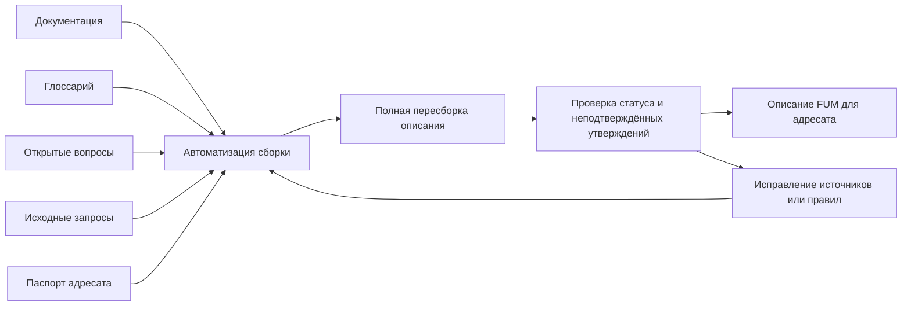

# [Описания FUM для адресатов](../Глоссарий/описание-FUM-для-адресата.md)

## Требование

[FUM](../Глоссарий/FUM.md) должен поддерживать отдельную папку [Описания](../Описания/README.md), где хранятся [описания FUM для адресатов](../Глоссарий/описание-FUM-для-адресата.md): инвесторов, исследователей, инженеров, пользователей, партнёров и других целевых аудиторий.

Такие описания строятся на основе [документации](../Глоссарий/производная-документация.md), [глоссария проекта](../Глоссарий/глоссарий-проекта.md), [открытых вопросов](../Глоссарий/открытый-вопрос.md) и зафиксированных [исходных запросов](../Глоссарий/исходный-запрос.md). Они нужны не для создания нового источника истины, а для адаптации уже зафиксированной [памяти FUM](../Глоссарий/память-FUM.md) к разным способам чтения.

## Граница между документацией и описаниями

[Производная документация](../Глоссарий/производная-документация.md) описывает сам [FUM](../Глоссарий/FUM.md): требования, модель, архитектуру, решения и открытые неопределённости. [Описание FUM для адресата](../Глоссарий/описание-FUM-для-адресата.md) выбирает из этой базы релевантные тезисы, меняет порядок подачи, объясняет ценность через язык аудитории и явно показывает, какие части пока являются проектными намерениями, рисками или открытыми вопросами.

Описание не должно скрывать статус проекта. Если в документации нет подтверждений коммерческих метрик, технической готовности, тестов, внедрений или других фактов, адресное описание не должно выдавать их за существующие. Если описание выявляет новую мысль, важную для самого проекта, эта мысль должна быть вынесена в документацию отдельным изменением.

## Жанровые описания

Описания FUM могут различаться не только адресатом, но и жанровой формой. [Художественное самоописание FUM](../Глоссарий/художественное-самоописание-FUM.md) является отдельным режимом, в котором FUM описывает себя через прозу, стихи, музыкальные треки, сценарии фильмов и другие художественные или медиажанровые формы.

Такой материал остаётся производным: он должен опираться на документацию, глоссарий, открытые вопросы, планирование и исходные запросы. Художественная форма может связывать технические, социальные, исследовательские и космические горизонты в единый образ, но не должна превращать художественную экстраполяцию в факт, обещание или новое незафиксированное требование. Подробное требование описано в документе [Художественное самоописание FUM](30-художественное-самоописание-FUM.md), а [художественно-фантастическое самоописание FUM](../Глоссарий/художественно-фантастическое-самоописание-FUM.md) остаётся его частным научно-фантастическим режимом.

## Воспроизводимая схема

Для каждого устойчивого типа описания должна быть заведена [автоматизация FUM](../Глоссарий/автоматизация-FUM.md) или ссылка на общую автоматизацию построения описаний. Минимальная схема должна фиксировать:

- адресата и его ключевые вопросы;
- цель описания и допустимый тон;
- набор исходных документов и глоссарных терминов;
- правила отбора тезисов из [памяти](../Глоссарий/память-FUM.md);
- способ отличать подтверждённые требования от интерпретаций;
- структуру результата;
- проверки перед публикацией и обновлением.

Предпочтительный паттерн для такой автоматизации - [чистая функция](../Глоссарий/чистая-функция.md): из явного набора источников, паспорта аудитории и правил сборки получается текст описания, а внешние действия ограничиваются чтением файлов, записью результата и обновлением навигации.

Устойчивое описание должно изменяться не ручной правкой отдельных фрагментов, а пересборкой через закреплённую автоматизацию. Если при проверке найдено устаревшее, неточное или неподтверждённое утверждение, исправляется источник, правило отбора или схема сборки, после чего описание создаётся заново как результат вызова автоматизации.

## Схема сборки адресного описания

## Папка `Описания/`

Папка [Описания](../Описания/README.md) хранит не общую документацию, а адресные материалы. Её индекс объясняет правила обновления, а подпапка [Описания/Автоматизации](../Описания/Автоматизации/построение-описания-FUM-для-адресата.md) хранит воспроизводимые схемы сборки.

Каждое описание должно содержать паспорт: адресат, цель, статус, источники, автоматизация, дата или версия обновления и ограничения. Это позволяет пересобрать описание после изменения документации и увидеть, какие тезисы зависят от какого слоя [памяти FUM](../Глоссарий/память-FUM.md).

## Первое описание для инвесторов

Первым адресным материалом является [описание FUM для инвесторов](../Описания/для-инвесторов.md). Оно показывает проект как раннюю открытую разработку агента следующего поколения, где инвестиционно значимыми являются не неподтверждённые коммерческие показатели, а архитектурная ставка: связная [память FUM](../Глоссарий/память-FUM.md), воспроизводимые [автоматизации](../Глоссарий/автоматизация-FUM.md), модульная фрактальная архитектура, научно-инженерный цикл и возможность накапливать переносимые [наработки](../Глоссарий/наработка.md).

Инвесторское описание должно явно отделять долгосрочную возможность от текущего статуса. Оно может формулировать инвестиционную гипотезу, но не должно превращать её в обещание результата.

## Обновление описаний

Описание нужно обновлять, когда меняются документы, на которых оно основано, когда появляется новый адресат или когда существующее описание перестаёт точно отражать состояние [FUM](../Глоссарий/FUM.md). Обновление должно идти через ту же воспроизводимую схему: сначала перечитать источники, затем пересобрать тезисы, после этого сравнить новый текст со старым и удалить неподтверждённые утверждения в правилах или источниках пересборки, а не точечной правкой готового файла.

Если расхождение между описанием и документацией обнаружено после публикации, приоритет имеет документация и [исходные запросы](../Глоссарий/исходный-запрос.md). Описание исправляется как производный слой [памяти](../Глоссарий/память-FUM.md).

## Источники требований

- [исходный запрос 2026-06-22 09:40:25 MSK](../Журнал/2026-06-22_09-40-25_MSK/запрос.md)
- [исходный запрос 2026-06-22 10:00:58 MSK](../Журнал/2026-06-22_10-00-58_MSK/запрос.md)
- [исходный запрос 2026-06-23 19:06:56 MSK](../Журнал/2026-06-23_19-06-56_MSK/запрос.md)
- [исходный запрос 2026-07-02 22:17:18 MSK](../Журнал/2026-07-02_22-17-18_MSK/запрос.md)
- [исходный запрос 2026-07-02 22:26:37 MSK](../Журнал/2026-07-02_22-26-37_MSK/запрос.md)

<!-- FUM-MD-RECENCY:BEGIN -->
<!-- last-content-edit: 2026-08-03 14:54:04 MSK -->
<!-- content-sha256: sha256:8b075dd6d95bf717a45fd954680bd70352564d70e3ebddf7a26937bce07904c5 -->
<!-- FUM-MD-RECENCY:END -->
