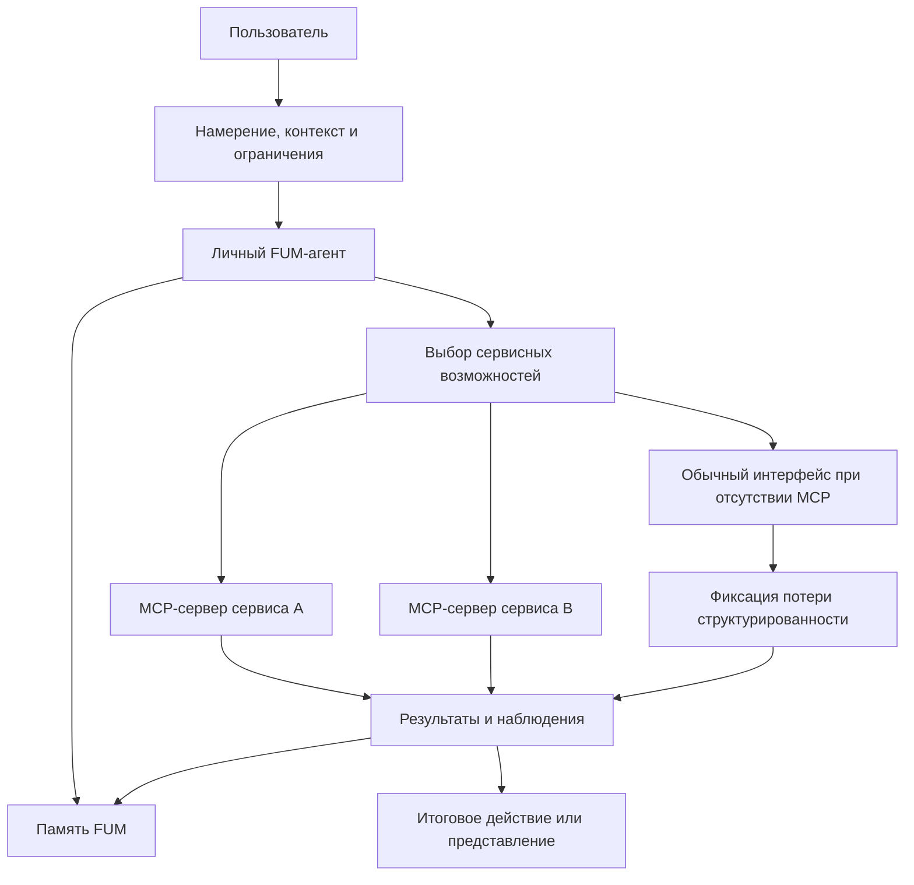

# [FUM](../Глоссарий/FUM.md) как [единая точка взаимодействия с компьютером](../Глоссарий/единая-точка-взаимодействия-с-компьютером.md)

## Требование

Связка [FUM](../Глоссарий/FUM.md) и [MCP-серверов](../Глоссарий/MCP-сервер.md) различных сервисов должна проектироваться как будущая [единая точка взаимодействия пользователя с компьютером](../Глоссарий/единая-точка-взаимодействия-с-компьютером.md). В этом режиме пользователь взаимодействует прежде всего с [личным FUM-агентом](../Глоссарий/личный-FUM-агент.md), а отдельные сервисы становятся доступными через машинно-обрабатываемые контракты, инструменты, ресурсы и действия.

Целевой эффект состоит не в том, чтобы мгновенно удалить все специализированные интерфейсы, а в том, чтобы заменить для пользователя основную необходимость постоянно переключаться между разрозненными клиентскими приложениями. FUM должен принимать намерение, контекст и ограничения пользователя, выбирать нужные сервисные возможности, выполнять действия через MCP-серверы и сохранять результат в [памяти FUM](../Глоссарий/память-FUM.md).

В терминах [интерфейса FUM-узла](../Глоссарий/интерфейс-FUM-узла.md) единая точка взаимодействия является внешним интерфейсом личного узла к человеку и цифровой среде. Она должна быть согласована с внутренним интерфейсом: то, что пользователь видит, подтверждает и получает как результат, должно иметь наблюдаемую связь с внутренними состояниями, памятью, трассами, правами доступа и ограничениями действия.

## Форма первого приложения

Первая [коробочная реализация FUM](../Глоссарий/коробочная-реализация-FUM.md) должна предъявлять эту единую точку не как набор разрозненных файлов, скриптов и ручных переходов между инструментами, а как единое локальное приложение. Пользовательский вход, поиск по памяти, показ найденного контекста, выбор действия, подтверждение, выполнение, проверка, журналирование и сохранение результата должны быть собраны в одном поставляемом контуре.

Единое приложение не отменяет внутреннюю [модульность](../Глоссарий/модуль-FUM.md). Внутри него могут оставаться CLI-команды, локальные автоматизации, сервисные адаптеры, runtime-компоненты и диагностические режимы, но для первого пользователя они не должны становиться основной формой сборки FUM вручную. Важный критерий коробочной формы - человек запускает FUM как цельный рабочий центр, а не восстанавливает систему из отдельных частей.

[Теневой редактор продолжений](../Прототипы/теневой-редактор-продолжений/README.md) является первым действующим интерфейсным вертикальным срезом текущей основной линии, но не подменяет собой это единое приложение. Он намеренно проверяет только один локальный пользовательский контур: один текстовый файл, быструю суффиксно-предиктивную структуру, независимое продолжение локальной LLM, фактическое продолжение человека и наблюдаемую разницу двух ветвей. Поиск по всей памяти, выбор действий, подтверждения эффектов, сервисные адаптеры и полный агентский цикл остаются зависимостями более широкой поставки.

## Локальная целевая веха

В целевом варианте [единая точка взаимодействия](../Глоссарий/единая-точка-взаимодействия-с-компьютером.md) должна иметь локальное ядро: [личный FUM-агент](../Глоссарий/личный-FUM-агент.md) запускается на выделенной машине с локальной [памятью](../Глоссарий/память-FUM.md), локальными инструментами, проверками и локально работающей сильной LLM. Внешние MCP-серверы и сервисы остаются важными органами расширения, но они не должны быть единственным основанием основного [агентского цикла](../Глоссарий/агентский-цикл.md).

Порог достаточности локальной модели, допустимый fallback и аппаратный профиль этого ядра ещё не определены; они вынесены в [открытый вопрос о критериях локальной LLM и выделенной машины](../Вопросы/2026-06-25_19-50-33_MSK_критерии-локальной-LLM-и-выделенной-машины-FUM.md).

Такая веха описана отдельно в документе [Локальный агент FUM на выделенной машине](24-локальный-агент-на-выделенной-машине.md). Она связывает пользовательский контур с аппаратным и виртуализованным слоями: локальная машина становится управляемым [FUM-узлом](../Глоссарий/FUM-узел.md), который может принимать намерение пользователя, запускать модельный шаг, вызывать локальные автоматизации, сохранять результат и только затем, при необходимости, обращаться к внешним сервисам.

## Текущий рабочий прообраз

До целевой локальной вехи роль ближайшего прообраза единой точки выполняет связка Codex и Obsidian-хранилища. Пользователь обращается к LLM через Codex, а [память FUM](../Глоссарий/память-FUM.md) хранится в репозитории, который человек может читать и навигировать через Obsidian. Git, Markdown, локальные проверки, журнал и файлы [исходных запросов](../Глоссарий/исходный-запрос.md) связывают намерение, действие и результат в проверяемую историю.

В этом прообразе Markdown-документы и их связи проверяют особую роль [текстово-языковых структурирующих операторов FUM](../Глоссарий/текстово-языковой-структурирующий-оператор-FUM.md) как совместной внешней памяти. В пределах разрешённого доступа человек читает и исправляет ту же адресуемую запись, которую LLM извлекает в контекст, порождает и связывает с источниками; Git делает изменения сравнимыми, а локальные проверки - воспроизводимыми. Переносимый инвариант состоит не в выборе Markdown или Obsidian, а в двусторонней доступности, происхождении, версионировании, проверяемости и связи текстовой проекции с первичным материалом.

Нынешний Obsidian-слой предъявляет связность главным образом через явно материализованные Markdown-ссылки и поэтому является только файловой проекцией целевой связности. Такие ссылки уже могут порождаться человеком, LLM или автоматизацией, но доступность перехода не должна зависеть от их предварительной записи. В текстовом воплощении [личного FUM-агента](../Глоссарий/личный-FUM-агент.md) исполнительный слой должен с помощью [операторного графа](../Глоссарий/система-структурирующих-операторов-FUM.md) предлагать проверяемые семантические переходы между адресуемыми фрагментами. Интерфейс решает, предъявить такой переход как ссылку, ребро графа, рекомендацию или маршрут, сохраняя происхождение, уверенность и статус проверки.

Этот прообраз важен не как окончательная реализация продукта, а как текущий проверяемый контур [гибридного узла](../Глоссарий/гибридный-узел.md) человек-LLM. Он показывает, какие части единой точки уже работают через общую память и подтверждения человека, а какие ещё должны быть вынесены в локальный runtime, явные сервисные адаптеры, паспорт интерфейса и воспроизводимые автоматизации.

## Календарно-транспортный контур

Личный FUM-агент должен уметь вести календари и расписания, планировать поездки, вызывать такси и координировать другие сервисы перемещения как один связный пользовательский контур. Для человека это выглядит как бытовое намерение: назначить событие, учесть дорогу, выбрать время выхода, заказать транспорт или подготовить маршрут. Для FUM это внешний интерфейс к календарям, картам, расписаниям, такси, билетам, уведомлениям и памяти прошлых договорённостей.

Такой контур является показательным случаем единой точки взаимодействия: пользователь не должен вручную переносить один план между приложениями, но FUM не должен превращать эту связность в скрытую автономную власть. Действия, которые затрагивают оплату, геолокацию, передачу данных третьим сторонам, физическое перемещение человека или изменение чужого расписания, требуют явных уровней доступа, подтверждений, трасс и отказных режимов.

Проверяемый сценарий этого [календарно-транспортного сервисного контура](../Глоссарий/календарно-транспортный-сервисный-контур.md) описан в пользовательской истории [Календарь, расписание и поездки через FUM](31-пользовательские-истории-FUM/вести-календари-и-планировать-поездки.md). [Паспорт контура](42-паспорт-календарно-транспортного-сервисного-контура-личного-FUM-агента.md) закрепляет модельную границу `R0`, матрицу адаптеров, подтверждение точного снимка, ошибки, отмены, очищенное происхождение и локальный симулятор. Допустимость реального исполнения и заранее заданной автономии остаётся неоднозначностью в [частично прояснённом вопросе о календарно-транспортных действиях FUM](../Вопросы/2026-07-03_09-03-59_MSK_границы-календарно-транспортных-действий-FUM.md).

## Схема единой точки взаимодействия

## Проблема [модальности приложений](../Глоссарий/модальность-приложений.md)

Современная работа с компьютером часто требует от человека переходить между приложениями, каждое из которых задаёт собственную модальность: навигацию, команды, модель данных, терминологию, правила поиска, подтверждения и ошибки. Пользователь вынужден помнить, где какая функция находится, как именно в этом интерфейсе выразить намерение и как перенести результат в следующий контекст.

Для FUM это является архитектурной проблемой, а не только вопросом удобства. Если значимая работа рассыпана по закрытым интерфейсным режимам, агенту трудно построить связную [память](../Глоссарий/память-FUM.md), восстановить происхождение решений, найти повторяемые [паттерны](../Глоссарий/паттерн-памяти.md) и превратить удачные последовательности действий в переносимые [наработки](../Глоссарий/наработка.md).

Единая точка взаимодействия должна уменьшать эту модальность: пользователь описывает цель в одном контуре, а FUM переводит её в сервисные действия, проверки, промежуточные состояния и итоговые представления.

## MCP-серверы как сервисные органы

[MCP-сервер](../Глоссарий/MCP-сервер.md) в архитектуре FUM рассматривается как устойчивый сервисный адаптер: канал, через который внешний сервис предоставляет агенту инструменты, ресурсы, операции и состояние в форме, пригодной для машинного вызова. Такой адаптер близок к [устройству восприятия и действия FUM](../Глоссарий/устройство-восприятия-и-действия-FUM.md): он одновременно даёт наблюдения о сервисе и позволяет выполнять действия в его среде.

В этом смысле MCP-сервер является частью внешнего [интерфейса FUM-узла](../Глоссарий/интерфейс-FUM-узла.md), а не заменой интерфейса целиком. Он отвечает за доступ к сервису, тогда как интерфейс FUM-узла отвечает ещё и за пользовательское намерение, внутреннюю память, подтверждения, права, трассы, происхождение и передачу результата между узлами.

Если MCP-сервер становится устойчивой частью работы, его использование должно описываться как [автоматизация FUM](../Глоссарий/автоматизация-FUM.md) или как часть такой автоматизации. В [памяти FUM](../Глоссарий/память-FUM.md) должны сохраняться:

- назначение сервиса и область применимости;
- доступные инструменты, ресурсы, схемы входов и выходов;
- требования авторизации и [уровни доступа](../Глоссарий/уровень-доступа.md);
- версии, ограничения, ошибки и известные потери наблюдаемости;
- связь между пользовательским намерением, вызванными операциями, результатом и последующей [наработкой](../Глоссарий/наработка.md).

## Сокращение дублирования кода

Если каждый сервис строит отдельное клиентское приложение как главный способ взаимодействия, индустрия многократно повторяет похожие слои: навигацию, формы, списки, фильтры, подтверждения, перенос данных между контекстами, шаблоны автоматизации и обвязку вокруг типовых действий. Часть такого кода неизбежно нужна, но значительная доля возникает из-за того, что каждый интерфейс заново решает похожую задачу выражения пользовательского намерения.

Связка FUM и MCP-серверов переносит повторяемую часть из множества человеческих интерфейсов в общий агентский слой. Сервисам важнее предоставлять надёжные машинные контракты, а FUM может переиспользовать [модули](../Глоссарий/модуль-FUM.md), [автоматизации](../Глоссарий/автоматизация-FUM.md), проверки, правила доступа и [паттерны памяти](../Глоссарий/паттерн-памяти.md) между разными сервисами. Это должно радикально сократить совокупное дублирование кода там, где разные приложения сегодня реализуют однотипные пользовательские сценарии.

## Сокращение расстояния от идеи до воплощения

Когда пользователь работает через разрозненные приложения, путь от идеи до результата проходит через множество ручных переводов: сформулировать мысль, выбрать инструмент, найти нужное место интерфейса, заполнить форму, скопировать результат, открыть следующий инструмент, повторить проверку. Каждая такая ступень увеличивает расстояние между намерением и воплощением.

В целевом режиме FUM должен принимать идею как [наблюдаемый входной сигнал](../Глоссарий/наблюдаемый-входной-сигнал.md), разложить её на действия, подобрать сервисы, вызвать MCP-серверы, проверить промежуточные результаты, сохранить трассу в [памяти](../Глоссарий/память-FUM.md) и оформить итог как код, документ, исследовательский результат, пользовательское действие или другую проверяемую форму. Чем больше таких путей превращается в воспроизводимые [наработки](../Глоссарий/наработка.md), тем короче становится следующий путь от похожей идеи до воплощения.

## Архитектурные следствия

- FUM должен иметь первичный пользовательский контур, в котором намерение, контекст, ограничения и подтверждения человека не зависят от конкретного клиентского приложения.
- MCP-серверы должны включаться в [модульную архитектуру FUM](../Глоссарий/модуль-FUM.md) как сервисные адаптеры с явными контрактами, версиями, правами доступа и трассами вызовов.
- Пользовательские интерфейсы сервисов могут оставаться полезными, но они не должны быть единственным источником состояния: значимые действия и результаты должны быть доступны агенту в структурированной форме или через наблюдаемый снимок.
- Действия через внешние сервисы должны сохранять происхождение решения: что запросил пользователь, что предложил агент, что было подтверждено человеком и что было выполнено в рамках заранее разрешённой автономии.
- Календарные, транспортные и поездочные действия должны проектироваться как сервисный контур с раздельным чтением расписаний, моделированием вариантов, подтверждением внешнего действия, вызовом адаптера и сохранением результата.
- Общий агентский слой не должен превращаться в скрытую тотальную власть над сервисами и пользователем; он должен уважать [децентрализацию FUM](../Глоссарий/децентрализация-FUM.md), [границы власти](../Глоссарий/граница-власти-FUM.md), приватность и уровни доступа.
- Для сервисов без MCP-доступа FUM должен уметь работать через обычные интерфейсы как через менее совершенные устройства восприятия и действия, явно фиксируя потерю структурированности и воспроизводимости.

## Связь с другими требованиями

Это требование развивает образ [личного FUM-агента](../Глоссарий/личный-FUM-агент.md): персональный агент становится не отдельным помощником рядом с приложениями, а рабочим центром, через который человек взаимодействует с цифровой средой.

Оно также связывает [обзор агентских циклов](06-обзор-агентских-циклов.md), [доступ к внутренним состояниям](07-доступ-к-внутренним-состояниям.md), [модульную архитектуру](05-модульная-архитектура-FUM.md), [интерфейс FUM-узла](25-интерфейс-FUM-узла.md) и [воспроизводимые автоматизации](17-воспроизводимые-автоматизации.md). Агентский цикл получает внешний сервисный слой, модульная архитектура получает устойчивые адаптеры к сервисам, а воспроизводимость требует, чтобы вызовы MCP-серверов не исчезали как непрозрачные побочные эффекты.

## Источники требований

- [исходный запрос 2026-06-23 13:08:36 MSK](../Журнал/2026-06-23_13-08-36_MSK/запрос.md)
- [исходный запрос 2026-06-23 19:06:56 MSK](../Журнал/2026-06-23_19-06-56_MSK/запрос.md)
- [исходный запрос 2026-06-25 19:50:33 MSK](../Журнал/2026-06-25_19-50-33_MSK/запрос.md)
- [исходный запрос 2026-06-26 09:55:41 MSK](../Журнал/2026-06-26_09-55-41_MSK/запрос.md)
- [исходный запрос 2026-06-26 10:34:02 MSK](../Журнал/2026-06-26_10-34-02_MSK/запрос.md)
- [исходный запрос 2026-06-26 10:47:01 MSK](../Журнал/2026-06-26_10-47-01_MSK/запрос.md)
- [исходный запрос 2026-06-29 12:44:23 MSK](../Журнал/2026-06-29_12-44-23_MSK/запрос.md)
- [исходный запрос 2026-07-03 09:03:59 MSK - Описать календарно транспортные действия FUM](../Журнал/2026-07-03_09-03-59_MSK_описать-календарно-транспортные-действия-FUM/запрос.md)
- [исходный запрос 2026-07-14 00:14:49 MSK - Закрепить операторы текста и языка во внешней памяти](../Журнал/2026-07-14_00-14-49_MSK_закрепить-операторы-текста-и-языка-во-внешней-памяти/запрос.md)
- [исходный запрос 2026-07-14 01:15:40 MSK - Закрепить автоматические семантические связи личного FUM](../Журнал/2026-07-14_01-15-40_MSK_закрепить-автоматические-семантические-связи-личного-FUM/запрос.md)
- [исходный запрос 2026-07-14 08:54:56 MSK - Создать прототип расхождения продолжений](../Журнал/2026-07-14_08-54-56_MSK_создать-прототип-расхождения-продолжений/запрос.md)

<!-- FUM-MD-RECENCY:BEGIN -->
<!-- last-content-edit: 2026-08-03 14:54:04 MSK -->
<!-- content-sha256: sha256:55e5d2863917ca477bb6515f98a1249d75769d752809b51ea5c6a6f007a919a3 -->
<!-- FUM-MD-RECENCY:END -->
