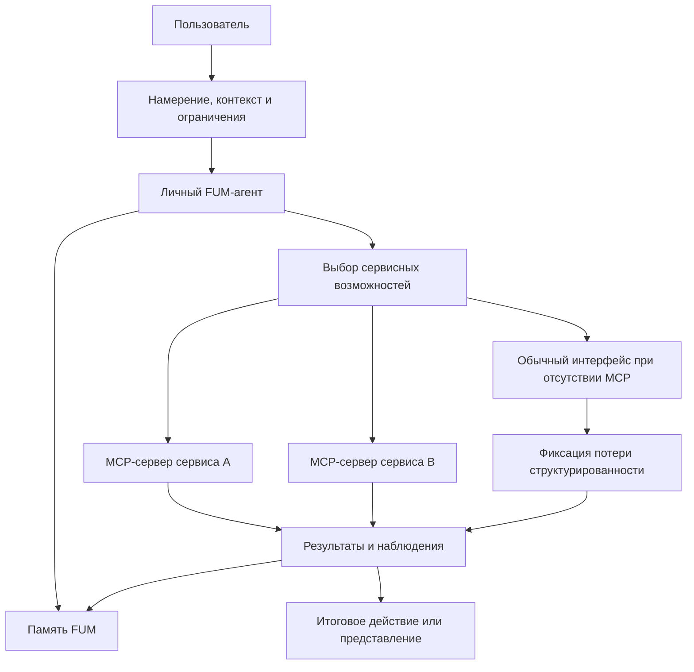

# [FUM](../Глоссарий/FUM.md) как [единая точка взаимодействия с компьютером](../Глоссарий/единая-точка-взаимодействия-с-компьютером.md)

## Требование

Связка [FUM](../Глоссарий/FUM.md) и [MCP-серверов](../Глоссарий/MCP-сервер.md) различных сервисов должна проектироваться как будущая [единая точка взаимодействия пользователя с компьютером](../Глоссарий/единая-точка-взаимодействия-с-компьютером.md). В этом режиме пользователь взаимодействует прежде всего с [личным FUM-агентом](../Глоссарий/личный-FUM-агент.md), а отдельные сервисы становятся доступными через машинно-обрабатываемые контракты, инструменты, ресурсы и действия.

Целевой эффект состоит не в том, чтобы мгновенно удалить все специализированные интерфейсы, а в том, чтобы заменить для пользователя основную необходимость постоянно переключаться между разрозненными клиентскими приложениями. FUM должен принимать намерение, контекст и ограничения пользователя, выбирать нужные сервисные возможности, выполнять действия через MCP-серверы и сохранять результат в [памяти FUM](../Глоссарий/память-FUM.md).

## Локальная целевая веха

В целевом варианте [единая точка взаимодействия](../Глоссарий/единая-точка-взаимодействия-с-компьютером.md) должна иметь локальное ядро: [личный FUM-агент](../Глоссарий/личный-FUM-агент.md) запускается на выделенной машине с локальной [памятью](../Глоссарий/память-FUM.md), локальными инструментами, проверками и локально работающей сильной LLM. Внешние MCP-серверы и сервисы остаются важными органами расширения, но они не должны быть единственным основанием основного [агентского цикла](../Глоссарий/агентский-цикл.md).

Такая веха описана отдельно в документе [Локальный агент FUM на выделенной машине](24-локальный-агент-на-выделенной-машине.md). Она связывает пользовательский контур с аппаратным и виртуализованным слоями: локальная машина становится управляемым [FUM-узлом](../Глоссарий/FUM-узел.md), который может принимать намерение пользователя, запускать модельный шаг, вызывать локальные автоматизации, сохранять результат и только затем, при необходимости, обращаться к внешним сервисам.

## Схема единой точки взаимодействия

## Проблема [модальности приложений](../Глоссарий/модальность-приложений.md)

Современная работа с компьютером часто требует от человека переходить между приложениями, каждое из которых задаёт собственную модальность: навигацию, команды, модель данных, терминологию, правила поиска, подтверждения и ошибки. Пользователь вынужден помнить, где какая функция находится, как именно в этом интерфейсе выразить намерение и как перенести результат в следующий контекст.

Для FUM это является архитектурной проблемой, а не только вопросом удобства. Если значимая работа рассыпана по закрытым интерфейсным режимам, агенту трудно построить связную [память](../Глоссарий/память-FUM.md), восстановить происхождение решений, найти повторяемые [паттерны](../Глоссарий/паттерн-памяти.md) и превратить удачные последовательности действий в переносимые [наработки](../Глоссарий/наработка.md).

Единая точка взаимодействия должна уменьшать эту модальность: пользователь описывает цель в одном контуре, а FUM переводит её в сервисные действия, проверки, промежуточные состояния и итоговые представления.

## MCP-серверы как сервисные органы

[MCP-сервер](../Глоссарий/MCP-сервер.md) в архитектуре FUM рассматривается как устойчивый сервисный адаптер: канал, через который внешний сервис предоставляет агенту инструменты, ресурсы, операции и состояние в форме, пригодной для машинного вызова. Такой адаптер близок к [устройству восприятия и действия FUM](../Глоссарий/устройство-восприятия-и-действия-FUM.md): он одновременно даёт наблюдения о сервисе и позволяет выполнять действия в его среде.

Если MCP-сервер становится устойчивой частью работы, его использование должно описываться как [автоматизация FUM](../Глоссарий/автоматизация-FUM.md) или как часть такой автоматизации. В [памяти FUM](../Глоссарий/память-FUM.md) должны сохраняться:

- назначение сервиса и область применимости;
- доступные инструменты, ресурсы, схемы входов и выходов;
- требования авторизации и [уровни доступа](../Глоссарий/уровень-доступа.md);
- версии, ограничения, ошибки и известные потери наблюдаемости;
- связь между пользовательским намерением, вызванными операциями, результатом и последующей [наработкой](../Глоссарий/наработка.md).

## Сокращение дублирования кода

Если каждый сервис строит отдельное клиентское приложение как главный способ взаимодействия, индустрия многократно повторяет похожие слои: навигацию, формы, списки, фильтры, подтверждения, перенос данных между контекстами, шаблоны автоматизации и обвязку вокруг типовых действий. Часть такого кода неизбежно нужна, но значительная доля возникает из-за того, что каждый интерфейс заново решает похожую задачу выражения пользовательского намерения.

Связка FUM и MCP-серверов переносит повторяемую часть из множества человеческих интерфейсов в общий агентский слой. Сервисам важнее предоставлять надёжные машинные контракты, а FUM может переиспользовать [модули](../Глоссарий/модуль-FUM.md), [автоматизации](../Глоссарий/автоматизация-FUM.md), проверки, правила доступа и [паттерны памяти](../Глоссарий/паттерн-памяти.md) между разными сервисами. Это должно радикально сократить совокупное дублирование кода там, где разные приложения сегодня реализуют однотипные пользовательские сценарии.

## Сокращение расстояния от идеи до воплощения

Когда пользователь работает через разрозненные приложения, путь от идеи до результата проходит через множество ручных переводов: сформулировать мысль, выбрать инструмент, найти нужное место интерфейса, заполнить форму, скопировать результат, открыть следующий инструмент, повторить проверку. Каждая такая ступень увеличивает расстояние между намерением и воплощением.

В целевом режиме FUM должен принимать идею как [наблюдаемый входной сигнал](../Глоссарий/наблюдаемый-входной-сигнал.md), разложить её на действия, подобрать сервисы, вызвать MCP-серверы, проверить промежуточные результаты, сохранить трассу в [памяти](../Глоссарий/память-FUM.md) и оформить итог как код, документ, исследовательский результат, пользовательское действие или другую проверяемую форму. Чем больше таких путей превращается в воспроизводимые [наработки](../Глоссарий/наработка.md), тем короче становится следующий путь от похожей идеи до воплощения.

## Архитектурные следствия

- FUM должен иметь первичный пользовательский контур, в котором намерение, контекст, ограничения и подтверждения человека не зависят от конкретного клиентского приложения.
- MCP-серверы должны включаться в [модульную архитектуру FUM](../Глоссарий/модуль-FUM.md) как сервисные адаптеры с явными контрактами, версиями, правами доступа и трассами вызовов.
- Пользовательские интерфейсы сервисов могут оставаться полезными, но они не должны быть единственным источником состояния: значимые действия и результаты должны быть доступны агенту в структурированной форме или через наблюдаемый снимок.
- Действия через внешние сервисы должны сохранять происхождение решения: что запросил пользователь, что предложил агент, что было подтверждено человеком и что было выполнено в рамках заранее разрешённой автономии.
- Общий агентский слой не должен превращаться в скрытую тотальную власть над сервисами и пользователем; он должен уважать [децентрализацию FUM](../Глоссарий/децентрализация-FUM.md), [границы власти](../Глоссарий/граница-власти-FUM.md), приватность и уровни доступа.
- Для сервисов без MCP-доступа FUM должен уметь работать через обычные интерфейсы как через менее совершенные устройства восприятия и действия, явно фиксируя потерю структурированности и воспроизводимости.

## Связь с другими требованиями

Это требование развивает образ [личного FUM-агента](../Глоссарий/личный-FUM-агент.md): персональный агент становится не отдельным помощником рядом с приложениями, а рабочим центром, через который человек взаимодействует с цифровой средой.

Оно также связывает [обзор агентских циклов](06-обзор-агентских-циклов.md), [доступ к внутренним состояниям](07-доступ-к-внутренним-состояниям.md), [модульную архитектуру](05-модульная-архитектура-FUM.md) и [воспроизводимые автоматизации](17-воспроизводимые-автоматизации.md). Агентский цикл получает внешний сервисный слой, модульная архитектура получает устойчивые адаптеры к сервисам, а воспроизводимость требует, чтобы вызовы MCP-серверов не исчезали как непрозрачные побочные эффекты.

## Источники требований

- [исходный запрос 2026-06-23 13:08:36 MSK](../Запросы/2026-06-23_13-08-36_MSK.md)
- [исходный запрос 2026-06-23 19:06:56 MSK](../Запросы/2026-06-23_19-06-56_MSK.md)
- [исходный запрос 2026-06-25 19:50:33 MSK](../Запросы/2026-06-25_19-50-33_MSK.md)
