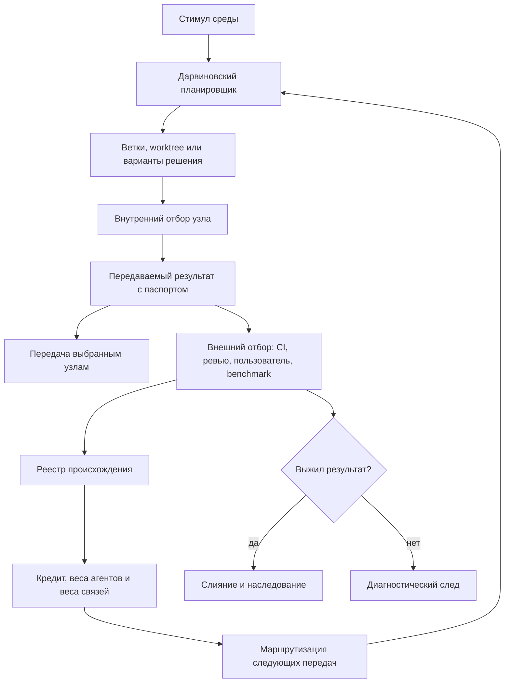

# Git-инфраструктура эволюционных цепочек [FUM](../Глоссарий/FUM.md)

## Назначение

[FUM](../Глоссарий/FUM.md) должен иметь инженерный слой, в котором [обобщённый дарвиновский алгоритм](../Глоссарий/обобщённый-дарвиновский-алгоритм.md) становится исполняемой архитектурой разработки. В таком слое Git выступает средой наследования и происхождения, Codex-подобные агенты и subagents - мыслящими узлами, а проверки, ревью, benchmarks, пользовательская обратная связь и слияние - внешней средой отбора.

Эта архитектура не сводит [FUM](../Глоссарий/FUM.md) к конкретному продукту Codex или GitHub. Она фиксирует реализуемый паттерн: [FUM-узлы](../Глоссарий/FUM-узел.md) порождают варианты, проводят внутренний отбор, передают выбранные результаты другим узлам, получают внешнюю оценку и обновляют [веса агентов](../Глоссарий/вес-агента-FUM.md), [веса связей](../Глоссарий/вес-связи-FUM.md) и маршруты передачи.

Стратегическое значение этого слоя в том, что он связывает текущую [память FUM](../Глоссарий/память-FUM.md) с будущей исполняемой сетью мышления. Git-инфраструктура не должна оставаться поздним техническим дополнением к проекту: она задаёт проверяемый путь от локального сохранения источников и решений к [дарвиновскому планировщику](../Глоссарий/дарвиновский-планировщик-FUM.md), который умеет запускать варианты, оценивать их по полезности относительно цены, передавать результаты и обновлять маршруты на основании внешней проверки.

Практический вектор внедрения:

- входной слой делает каждый запрос, источник и материал наблюдаемым элементом [памяти](../Глоссарий/память-FUM.md);
- рабочий слой превращает изменения документов, кода и автоматизаций в [передаваемые результаты](../Глоссарий/передаваемый-результат-FUM.md) с происхождением;
- оценочный слой отделяет внутреннюю оценку узла от внешней проверки тестами, ревью, пользователем или benchmark;
- родословный слой накапливает события в [реестре происхождения](../Глоссарий/реестр-происхождения-FUM.md) и распределяет кредит по предкам;
- маршрутизирующий слой использует [веса агентов](../Глоссарий/вес-агента-FUM.md), веса связей, стоимость и ограничения доступа для выбора следующих узлов.

Такой порядок позволяет развивать [FUM](../Глоссарий/FUM.md) без преждевременного обещания полной автономии: каждый этап можно проверить локально, а успешные контуры становятся материалом для следующей [эволюционной цепочки](../Глоссарий/эволюционная-цепочка-FUM.md).

## Схема двухконтурного отбора



## Ключевые выводы из диалога

Расшаренный диалог уточнил архитектуру не как общий образ многоагентной работы, а как вычислимую модель отбора.

- Критерий выживаемости агента не должен сводиться к самой долгой цепочке. Оценка должна учитывать долговечность полезных потомков, внешнее качество результата, стоимость, риск и точность внутреннего отбора.
- Сам [агентский цикл](../Глоссарий/агентский-цикл.md) должен быть воплощением [обобщённого дарвиновского алгоритма](../Глоссарий/обобщённый-дарвиновский-алгоритм.md): агенты порождают цепочки рассуждений, действий и передач, а система отбирает тех, кто способен поддерживать более длинные, полезные и продуктивные цепочки без распада качества.
- [FUM-узел](../Глоссарий/FUM-узел.md) сначала проводит отбор внутри собственного мира, а затем передаёт наружу только выбранные результаты. Среда и следующие узлы дают внешний контур проверки.
- Передаётся не весь внутренний процесс мышления, а [передаваемый результат FUM](../Глоссарий/передаваемый-результат-FUM.md) с происхождением, ожидаемым качеством, стоимостью, уверенностью и выбранными адресатами.
- [Вес агента FUM](../Глоссарий/вес-агента-FUM.md) должен вознаграждать не только финального исполнителя, но и узлы, которые создали полезного предка, правильно оценили его внутри себя или удачно направили следующему узлу.
- Поиск должен идти не за максимальным качеством любой ценой, а за лучшим отношением пользы, стоимости, риска и времени. Для несопоставимых задач предпочтительна полезность с явными штрафами, а не простое отношение качества к цене.
- Сеть узлов является рекурсивной: один узел может быть простой функцией, агентом, workflow или вложенной сетью таких же узлов. Наружу такая сеть может сворачиваться в макроузел следующего уровня.
- Codex, Git, worktree, pull request и CI дают первый инженерный носитель этой модели, но [дарвиновский планировщик FUM](../Глоссарий/дарвиновский-планировщик-FUM.md) должен быть отдельным проверяемым слоем, а не скрытой надеждой на сам Git.

## Карта соответствий

| Понятие [FUM](../Глоссарий/FUM.md) | Инженерный носитель |
| --- | --- |
| Стимул среды | [исходный запрос](../Глоссарий/исходный-запрос.md), issue, failing test, событие интерфейса или внешний сигнал |
| [FUM-узел](../Глоссарий/FUM-узел.md) | экземпляр Codex, специализированный subagent, workflow-агент или другой исполнительный узел |
| Внутренний мир узла | контекст, `AGENTS.md`, skills, локальное состояние, доступная [память](../Глоссарий/память-FUM.md) и модель задачи |
| Вариант решения | [ветка работы](../Глоссарий/ветка-работы.md), Git branch, worktree, patch-кандидат или отдельный артефакт |
| Мутация | новый commit, исправление, переписывание решения или изменение документа |
| Внутренний отбор | тесты, самооценка, сравнение вариантов, локальные критерии качества и стоимости |
| [Передаваемый результат FUM](../Глоссарий/передаваемый-результат-FUM.md) | commit, patch, pull request, отчёт, benchmark, [наработка](../Глоссарий/наработка.md) или другой артефакт с паспортом происхождения |
| Внешний отбор | CI, review, benchmark, пользовательская проверка, production-метрика или другой независимый суд среды |
| Наследование | новая ветка или задача, созданная от успешного commit, результата или [наработки](../Глоссарий/наработка.md) |
| Выживание | merge, дальнейшее использование, появление полезных потомков и подтверждённая ценность результата |
| Родословная | Git DAG вместе с [реестром происхождения FUM](../Глоссарий/реестр-происхождения-FUM.md) |
| Смерть линии | закрытый PR, revert, прекращенная ветка, вытеснение лучшим вариантом или отсутствие полезных потомков |
| Вес узла | [вес агента FUM](../Глоссарий/вес-агента-FUM.md), вычисленный по полезности результатов и точности отбора |
| [Вес связи FUM](../Глоссарий/вес-связи-FUM.md) | успешность передачи результатов между двумя узлами или ролями |

Эта карта является первой заполненной [карточкой соответствия FUM](../Глоссарий/карточка-соответствия-FUM.md): она показывает, как конкретный инженерный инструмент несёт элементы [общей схемы FUM](../Глоссарий/общая-схема-FUM.md). В дальнейшем такие карты должны храниться и сравниваться в [реестре карточек соответствия FUM](28-реестр-карточек-соответствия-FUM/README.md), чтобы переносить модель на другие технические инструменты, научные рамки и физические горизонты с явными границами аналогии.

## [Двухконтурный отбор FUM](../Глоссарий/двухконтурный-отбор-FUM.md)

Внутри [агентского цикла](../Глоссарий/агентский-цикл.md) [FUM-узел](../Глоссарий/FUM-узел.md) может породить несколько вариантов решения и отобрать лучшие на основании своей внутренней модели задачи. После этого наружу передаётся не весь внутренний процесс, а только выбранные результаты с метаданными происхождения, качества, стоимости, уверенности и адресатов.

Внешний контур начинается после передачи результата. Среда проверяет результат через тесты, ревью, benchmarks, пользователя или дальнейшую работу других узлов. Поэтому жизнеспособность результата не равна простому времени жизни ветки: зависшая ветка не должна получать награду только за длительность существования. Выживание определяется тем, возникли ли от результата полезные потомки, был ли он принят в общую [память](../Глоссарий/память-FUM.md) и какую пользу дал относительно цены.

Смысловая оценка агента в таком цикле складывается из долговечности полезных цепочек, внешней оценки результатов и точности внутреннего отбора:

```text
S_a = alpha * L_a + beta * Q_ext_a + gamma * A_a
```

Здесь `L_a` - выживаемость полезных потомков, `Q_ext_a` - внешняя оценка результата, а `A_a` - точность внутреннего отбора: насколько хорошо узел заранее выделил решения, которые затем действительно оказались успешными во внешней среде.

Для отбора цепочек рассуждений важно различать наблюдаемую длину и продуктивность. Длинная цепочка получает преимущество только если дополнительные звенья дают новую проверяемую пользу: уменьшают неопределённость, создают [передаваемый результат](../Глоссарий/передаваемый-результат-FUM.md), улучшают потомков, повышают точность отбора или снижают будущую стоимость. Цепочка, которая просто потребляет шаги и контекст без роста полезности, должна получать штраф как непродуктивная.

Минимальная полезность результата должна учитывать цену и риск:

```text
U(r) = Q_ext(r) - lambda * C(r) - mu * Time(r) - nu * Risk(r)
```

Отношение `Q(r) / C(r)` допустимо только для сопоставимых задач, где нет риска поощрить дешёвые, но слабые решения. В общем случае стоимость нужно раскладывать явно:

```text
C(r) =
  C_compute +
  C_wall_time +
  C_communication +
  C_verification +
  C_error +
  C_human_attention
```

Поэтому отбор должен искать не максимальное качество любой ценой, а лучшую доступную границу качества, стоимости, времени и риска.

## Результат как наследуемый объект

Основным наследуемым объектом является не сам агент, а результат его работы: идея, patch, commit, документ, тест, модель, схема, автоматизация или иная [наработка](../Глоссарий/наработка.md). Агент выступает генератором вариантов, внутренним селектором и каналом передачи.

Каждый [передаваемый результат FUM](../Глоссарий/передаваемый-результат-FUM.md) должен иметь машинно читаемый паспорт. [Минимальный паспорт версии 1](39-минимальный-паспорт-передаваемого-результата-FUM.md) закрепляет одно состояние результата и связывает его артефакты с источниками, производящим узлом, родительскими результатами, Git-контекстом происхождения, внутренними и внешними проверками, ожидаемой и фактической стоимостью, уверенностью, адресатами и отдельными маршрутами передачи.

Канонический формат различает доставку, подтверждение получения и внешний отбор. Он хранит риски и ограничения в явной области результата и условиях адресатов, неизвестную стоимость - как неизвестную, а не как ноль, и не выдаёт внутреннюю уверенность за независимую оценку. [JSON Schema](39-минимальный-паспорт-передаваемого-результата-FUM/схема-паспорта-v1.json) и заполненный пример заменяют прежний иллюстративный сокращённый конверт как нормативный контракт.

Такой паспорт превращает commit или pull request в [наработку](../Глоссарий/наработка.md), пригодную для передачи, проверки, отбора и повторного использования. Без паспорта Git сохраняет только техническую историю файлов, но не всю архитектурную историю мышления [FUM](../Глоссарий/FUM.md).

## [Дарвиновский планировщик FUM](../Глоссарий/дарвиновский-планировщик-FUM.md)

Git, worktree, pull request и CI дают изоляцию, историю и проверку, но сами по себе не образуют эволюционную агентную систему. Для этого нужен [дарвиновский планировщик FUM](../Глоссарий/дарвиновский-планировщик-FUM.md), который выполняет пять функций.

- Оркестратор принимает входной сигнал, запускает подходящие узлы, создаёт ветки и управляет передачей результатов.
- Оценщик запускает тесты, benchmarks, проверки безопасности, review и внешние judges.
- [Реестр происхождения FUM](../Глоссарий/реестр-происхождения-FUM.md) связывает результат, родителей, агента, commit, стоимость, адресатов и потомков.
- Модуль кредитования обновляет [веса агентов FUM](../Глоссарий/вес-агента-FUM.md), [веса связей](../Глоссарий/вес-связи-FUM.md) и вклад предков после внешней оценки.
- Бюджетный контроллер ограничивает дорогие, рискованные или бесперспективные линии до того, как они начнут вытеснять более полезные цепочки.

Следующего получателя результата планировщик выбирает не случайно и не только по роли. Выбор должен учитывать соответствие результата компетенции узла, текущий вес узла, успешность прошлых передач между этими узлами, стоимость продолжения и ограничения доступа.

Отдельной низкоприоритетной очередью планировщик может вести [фоновые задания FUM](../Глоссарий/фоновое-задание-FUM.md). Задание из неё допускается к исполнению только при одновременном отсутствии необработанного пользовательского ввода и готовых задач более высокого приоритета. Появление такого ввода или задачи вытесняет фон в безопасной контрольной точке: исполнитель сохраняет наблюдаемую трассу и статус, после чего приостанавливается либо завершается по политике задания.

Паспорт фонового задания должен содержать цель, источник, приоритет, разрешённые действия, бюджеты времени, вычислений и энергии, критерий остановки и ожидаемый вид результата. Фоновая работа не получает дополнительных полномочий и не переводит свой результат прямо в утверждённое знание: описание, гипотеза или кандидат проходят обычную проверку, отбор и фиксацию происхождения.

Кто формирует разрешённый исследовательский пул, как проверяется независимость и где проходят пределы эксперимента, остаётся в [частично прояснённом вопросе о границах исследовательской автономии FUM](../Вопросы/2026-06-22_08-04-45_MSK_границы-исследовательской-автономии-FUM.md).

## [Эволюционные цепочки FUM](../Глоссарий/эволюционная-цепочка-FUM.md)

[Эволюционная цепочка FUM](../Глоссарий/эволюционная-цепочка-FUM.md) - это последовательность, в которой результат передаётся между узлами, преобразуется, проходит проверки и порождает потомков. Например: задача порождает несколько веток, одна ветка даёт commit, commit передаётся проверяющему агенту, затем исправляется, проходит CI, сливается и становится основанием для следующей задачи.

Для оценки такой цепочки важны не только последний commit и не только агент, выполнивший финальное действие. Кредит должен распространяться назад по родословной: награду получает также узел, который создал полезного предка, правильно отобрал промежуточный результат или удачно передал его следующему агенту.

Это делает [память FUM](../Глоссарий/память-FUM.md) не пассивным архивом, а средой эволюции: успешные цепочки становятся [паттернами памяти](../Глоссарий/паттерн-памяти.md), неудачные цепочки сохраняют диагностическую ценность, а маршруты передачи результатов постепенно получают веса.

## Публичный upstream и форки памяти

Ближайшая GitHub-схема делает текущий репозиторий публичным upstream, от которого другие люди могут создавать форки собственной [памяти FUM](../Глоссарий/память-FUM.md). В целевой схеме общий upstream ядра несёт публикационно чистые правила, документацию, инструменты и архитектурные улучшения; долговечные специализированные подузлы живут в отдельных форках ядра, самостоятельные проекты — в собственных репозиториях, а конкретная композиционная сборка закрепляет проверенные ревизии обоих видов через Git submodule.

Периодическое слияние обновляющегося `master` в форки памяти и подузлов становится практическим механизмом наследования. Собственная ветка получает новые правила, автоматизации, глоссарные уточнения и архитектурные решения, но сохраняет собственную историю, специализацию и уровень доступа. Проектный репозиторий синхронизируется со своим объявленным upstream и не наследует `master` FUM только из-за подключения как submodule.

Для [FUM](../Глоссарий/FUM.md) эта схема важна как первый социальный слой [эволюционных цепочек](../Глоссарий/эволюционная-цепочка-FUM.md): ядро распространяет устойчивые мутации, fork-подузлы проверяют специализации, проекты сохраняют самостоятельные истории, а полезные улучшения возвращаются в целевой репозиторий через проверяемый передаваемый результат. Паспорт должен различать исходный и целевой репозитории, точные базовый и результирующий коммиты, принятие в целевой ref и последующее продвижение gitlink композиции.

Практические правила этой схемы — публикационный аудит, рекомендуемые ветки форка, периодическое слияние `master` и обратная передача улучшений — описаны в документе [Публичный upstream и форки памяти FUM](27-публичный-upstream-и-форки-памяти.md). Топология ядра, композиции, пишущих подузлов и проектов закреплена в [репозиторном графе пишущих подузлов и проектов FUM](44-репозиторный-граф-пишущих-подузлов-и-проектов-FUM.md).

## Веса, кредит и маршрутизация

[Вес агента FUM](../Глоссарий/вес-агента-FUM.md) является вычисляемой репутацией, а не ручной оценкой статуса. Он должен учитывать внешнее качество результатов, выживаемость полезных цепочек, точность внутреннего отбора и ценность успешных передач:

```text
W_i = alpha * Q_i + beta * L_i + gamma * A_i + delta * P_i
```

Здесь `Q_i` - внешняя оценка результатов, `L_i` - выживаемость полезных потомков, `A_i` - точность внутреннего отбора, а `P_i` - вклад результатов, которые узел передал дальше.

Отложенный вклад переданного результата возвращается предкам через дисконтированный кредит:

```text
Credit_i(r) = a_i_r * discount ^ d(i, r) * U(r)
```

`a_i_r` фиксирует долю вклада узла, `d(i, r)` - расстояние от вклада до оцененного результата, `U(r)` - итоговую полезность результата. Поэтому система не должна вознаграждать только последнего исполнителя: полезный предок и удачный выбор адресата тоже получают кредит.

[Вес связи FUM](../Глоссарий/вес-связи-FUM.md) отражает, насколько полезными были прошлые передачи между двумя узлами:

```text
E_ij_next = (1 - eta) * E_ij + eta * U_i_to_j
```

Следующий адресат результата выбирается с учётом соответствия задачи, веса узла, веса связи, стоимости и ограничений доступа:

```text
P(i -> j | r) = softmax(
  alpha * relevance(r, j) +
  beta * W_j +
  chi * E_ij -
  zeta * Cost_j
)
```

Так система постепенно учится не только тому, какие узлы хорошо решают задачи, но и тому, какие узлы хорошо оценивают собственные решения и кому выгоднее передавать конкретный тип результата.

## Рекурсивная сеть узлов

Эта архитектура строит сеть, похожую одновременно на нейросеть, многоагентную систему и эволюционный граф. Узел снаружи может выглядеть как единый агент, но внутри быть простой функцией, workflow, группой subagents или полноценной сетью [FUM-узлов](../Глоссарий/FUM-узел.md). Сеть может быть свёрнута в макроузел следующего уровня.

В отличие от обычной нейросети, связи передают не только числовую активацию, а [передаваемый результат FUM](../Глоссарий/передаваемый-результат-FUM.md) с метаданными: содержание результата, ожидаемое качество, стоимость, уверенность, происхождение и адресата. [Вес агента](../Глоссарий/вес-агента-FUM.md) отражает способность создавать и отбирать полезные решения, а [вес связи](../Глоссарий/вес-связи-FUM.md) - успешность маршрута передачи.

Такая рекурсивность уточняет [модульную архитектуру FUM](05-модульная-архитектура-FUM.md): [модуль FUM](../Глоссарий/модуль-FUM.md) может быть не только вычислительным или документационным элементом, но и воспроизводимой [эволюционной цепочкой](../Глоссарий/эволюционная-цепочка-FUM.md) с собственными правилами отбора и передачи результатов.

## Минимальная реализация в репозитории

Минимальный репозиторный слой для такой архитектуры должен содержать:

- `AGENTS.md` и локальные инструкции для типов узлов;
- ацикличный реестр репозиторной композиции с устойчивыми идентификаторами подузлов и проектов, проверенными URL и точными gitlink;
- точки `Проекты/<идентификатор>` для подключения самостоятельных проектных репозиториев как Git submodule;
- реестр агентов, ролей, компетенций и ограничений доступа;
- каталог задач и входных сигналов;
- по одному рабочему набору индивидуально допустимых и отложенных [следующих шагов](../Глоссарий/следующий-шаг-ветки.md) для каждой автоматически развиваемой именованной ветки;
- изолированные клоны, уникальные ветки шага и устойчивые result-ref для пишущих попыток;
- сериализованную очередь интеграции по паре целевого репозитория и полного ref с compare-and-swap;
- каталог [передаваемых результатов](../Глоссарий/передаваемый-результат-FUM.md) и паспортов передачи;
- [реестр происхождения FUM](../Глоссарий/реестр-происхождения-FUM.md) в машинно читаемом виде;
- метрики [весов агентов](../Глоссарий/вес-агента-FUM.md) и [весов связей](../Глоссарий/вес-связи-FUM.md);
- workflows запуска, проверки, маршрутизации и обновления весов;
- правила защищённой ветки, required checks, review и merge;
- правила форка, синхронизации с upstream `master` и обратной передачи улучшений;
- журнал стоимости, рисков и решений планировщика.

Такой слой может начинаться как надстройка над обычным Git-репозиторием, но должен сохранять возможность обобщения за пределы Git. В дальнейшем те же принципы могут применяться к документам, научным [экспериментам](../Глоссарий/эксперимент-FUM.md), аппаратным проектам, роботизированным действиям и сетям [гибридных узлов](../Глоссарий/гибридный-узел.md).

Текущий документационный прототип связывает эти элементы пятиминутным диспетчером. Если максимальный поддерживаемый recent-снимок Codex показывает любую другую активную задачу, диспетчер не выбирает и не резервирует шаг, не ставит плановую работу в локальную очередь и вообще не создаёт автоматическую задачу. Только после второй успешной host-инвентаризации наблюдаемый простой разрешает прочитать рабочий набор схемы `4`, проверить ID и хэши всех его [карточек шагов](../Глоссарий/карточка-шага.md) и выбрать не более одного из нескольких индивидуально допустимых кандидатов `ready` на точном `HEAD`. Политика `source-history-first-parent-v1` рассматривает не более 16 first-parent-коммитов от нового к старому и только дедуплицированные нормализованные локальные ссылки из раздела `Источники` кандидата: сильный сигнал даёт изменённая завершённая или поглощённая карточка среди источников, затем — точное изменение иного источника. Внутри класса учитываются меньшая дистанция, большее число уникальных совпавших путей и затем `card_id`, `step_id`; отсутствие различающего сигнала сразу приводит к этой устойчивой паре. Управляющие пути и собственная карточка кандидата исключаются. Этот порядок связанности остаётся мягким и не отменяет статус, зависимости, безопасность, полномочия, выбор пользователя и контекстную посильность.

Выбор возвращает объект `selection` с `id`, `policy`, точным `head`, `ready_count` и свидетельством `reason`, `commit`, `distance`, `matched_paths`. Claim атомарно проверяет вершину полного ref и неизменность выбранного поколения вместе с compare-and-swap, а отдельная задача после допуска общей последовательной очередью checkout повторяет тот же selection fence до работы. Кандидаты `paused` и `blocked` сохраняются вместе с условиями возобновления, не участвуют в выборе и не перекрывают готовые шаги. Это ещё не полный [дарвиновский планировщик](../Глоссарий/дарвиновский-планировщик-FUM.md): полезность и бюджет не оптимизируются автоматически, а список задач не сообщает полноту и не доказывает глобальное отсутствие более старой активной задачи. Однако контур уже проверяет важные инварианты — веткозависимый выбор из общего пула, отсутствие повтора одного поколения, происхождение, критерии завершения и передачу следующего решения.

На масштабе последовательности задач сочетание heartbeat, версионного выбора шага, FIFO-допуска, Git-памяти и атомарной передачи образует поведенческий прототип непрерывно возобновляемого [агентского цикла](../Глоссарий/агентский-цикл.md). Непрерывность здесь обеспечивается не одним бесконечным модельным процессом, а причинной связью поколений: каждая завершённая задача сохраняет результат и обновлённый пул допустимости, после чего внешний диспетчер выбирает продолжение на свежей границе запуска. Пользовательская задача меняет [память](../Глоссарий/память-FUM.md), требования или рабочий набор и тем самым способна перенаправить последующую наблюдаемую траекторию работы до нового выбора.

Строгий FIFO одновременно задаёт границу этой аналогии. Появление пользовательской задачи само по себе не прерывает уже допущенного владельца и не доказывает событийного вытеснения во время его работы; изменение траектории надёжно наблюдается на границе сохранённого результата, нового `HEAD` и следующего поколения шага. Текущие автоматически создаваемые кандидаты `ready` также не являются уже реализованной отдельной очередью [фоновых заданий FUM](../Глоссарий/фоновое-задание-FUM.md) с бюджетами и безопасными контрольными точками. [Пользовательски перенаправляемый коробочный цикл](../Требования/🟡-пользовательское-перенаправление-непрерывного-агентского-цикла.md) должен принимать разрешённый человеческий ввод через [непрерывный событийный контур](../Требования/🟡-непрерывное-событийное-наблюдение-пользовательского-ввода.md) и проверяемо выбирать продолжение на такой точке.

## Следствия для [FUM](../Глоссарий/FUM.md)

- [Агентские циклы](../Глоссарий/агентский-цикл.md) [FUM](../Глоссарий/FUM.md) должны сохранять не только финальный ответ, но и родословную результатов, передач и внешних оценок.
- [Ветки работы](../Глоссарий/ветка-работы.md) становятся не только параллельными линиями исполнения, но и гипотезами, которые конкурируют за включение в общую [память](../Глоссарий/память-FUM.md).
- Слияние должно означать подтверждённое выживание результата, а не механическое соединение файлов.
- Награда должна начисляться за полезность потомков и качество отбора, а не за объём работы или длительность существования ветки.
- [FUM](../Глоссарий/FUM.md) должен различать создание результата, внутренний отбор, передачу, внешнюю проверку и последующее наследование.
- [Децентрализация FUM](../Глоссарий/децентрализация-FUM.md) требует, чтобы [веса агентов](../Глоссарий/вес-агента-FUM.md) и [веса связей](../Глоссарий/вес-связи-FUM.md) не превращались в скрытую тотальную власть: правила кредитования, маршрутизации и остановки должны быть проверяемыми.
- Архитектура должна поддерживать [чистые функции](../Глоссарий/чистая-функция.md) для вычисления метрик и наблюдаемые оболочки для действий, которые меняют репозиторий, запускают агентов или передают результат дальше.

## Источники требований

- [исходный запрос 2026-07-27 18:28:42 MSK — Выбирать следующий шаг при запуске с учётом истории коммитов](../Запросы/2026-07-27_18-28-42_MSK_выбирать-следующий-шаг-при-запуске-с-учётом-истории-коммитов.md)
- [исходный запрос 2026-07-24 10:01:26 MSK — Уточнить событийную непрерывность документационного прототипа FUM](../Запросы/2026-07-24_10-01-26_MSK_уточнить-событийную-непрерывность-документационного-прототипа-FUM.md)
- [исходный запрос 2026-07-23 12:53:46 MSK - Описать минимальный паспорт передаваемого результата FUM](../Запросы/2026-07-23_12-53-46_MSK_описать-минимальный-паспорт-передаваемого-результата-FUM.md)
- [исходный запрос 2026-06-23 13:18:14 MSK](../Запросы/2026-06-23_13-18-14_MSK.md)
- [исходный запрос 2026-06-23 18:24:05 MSK](../Запросы/2026-06-23_18-24-05_MSK.md)
- [исходный запрос 2026-06-23 19:06:56 MSK](../Запросы/2026-06-23_19-06-56_MSK.md)
- [исходный запрос 2026-06-24 14:41:33 MSK](../Запросы/2026-06-24_14-41-33_MSK.md)
- [исходный запрос 2026-06-24 16:22:00 MSK](../Запросы/2026-06-24_16-22-00_MSK.md)
- [исходный запрос 2026-07-01 11:34:46 MSK](../Запросы/2026-07-01_11-34-46_MSK.md)
- [исходный запрос 2026-07-01 12:11:27 MSK](../Запросы/2026-07-01_12-11-27_MSK.md)
- [исходный запрос 2026-07-02 10:51:13 MSK](../Запросы/2026-07-02_10-51-13_MSK.md)
- [исходный запрос 2026-07-14 03:18:36 MSK - Закрепить фоновые задания для простоя LLM](../Запросы/2026-07-14_03-18-36_MSK_закрепить-фоновые-задания-для-простоя-LLM.md)
- [исходный запрос 2026-07-20 20:06:04 MSK - Запускать следующие шаги веток](../Запросы/2026-07-20_20-06-04_MSK_запускать-следующие-шаги-веток.md)
- [исходный запрос 2026-07-21 18:31:35 MSK — Ввести последовательную очередь сессий без hooks](../Запросы/2026-07-21_18-31-35_MSK_ввести-последовательную-очередь-сессий-без-hooks.md)
- [исходный запрос 2026-07-22 02:59:22 MSK - Декомпозировать предложения на карточки шагов](../Запросы/2026-07-22_02-59-22_MSK_декомпозировать-предложения-на-карточки-шагов.md)
- [исходный запрос 2026-07-22 03:38:35 MSK - Разрешить выполнение доступных карточек шагов](../Запросы/2026-07-22_03-38-35_MSK_разрешить-выполнение-доступных-карточек-шагов.md)
- [исходный запрос 2026-07-26 12:59:08 MSK — Спроектировать Git-граф пишущих субагентов и проектов](../Запросы/2026-07-26_12-59-08_MSK_спроектировать-Git-граф-пишущих-субагентов-и-проектов.md)

## Внешний материал

- [расшаренный чат "Запуск долгоживущей цепочки"](../Источники/URL/https/chatgpt.com/share/6a3a5b33-0658-83eb-a491-8e5a7fef6f54/запуск-долгоживущей-цепочки.md), сохранённый как [прикрепляемый материал](../Глоссарий/прикрепляемый-материал.md) связанных запросов.
- Исходная ссылка: [source-url.txt](../Источники/URL/https/chatgpt.com/share/6a3a5b33-0658-83eb-a491-8e5a7fef6f54/source-url.txt).

<!-- FUM-MD-RECENCY:BEGIN -->
<!-- last-content-edit: 2026-07-27 19:32:25 MSK -->
<!-- content-sha256: sha256:8ab1cb447ef277f714bb5b18a440ce653f0bb17e5b4903a407410d8a48a35db3 -->
<!-- FUM-MD-RECENCY:END -->
