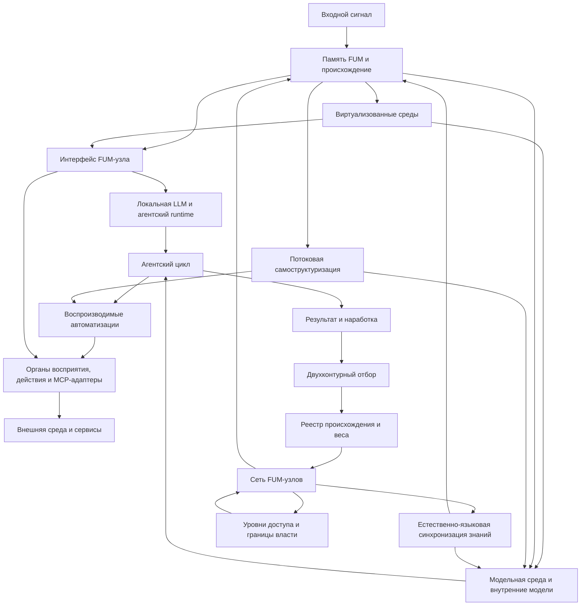

# [Архитектура FUM](../Глоссарий/архитектура-FUM.md)

## Назначение

Этот документ собирает [архитектуру FUM](../Глоссарий/архитектура-FUM.md) в одну входную точку. Он не заменяет детальные документы, а показывает, как уже описанные требования образуют общую систему и куда смотреть при изменении отдельного слоя.

Без такой карты архитектура выглядит разнесённой по документам о [памяти](../Глоссарий/память-FUM.md), [модулях](../Глоссарий/модуль-FUM.md), [агентских циклах](../Глоссарий/агентский-цикл.md), [автоматизациях](../Глоссарий/автоматизация-FUM.md), [модельной среде](../Глоссарий/модельная-среда.md), [виртуализованных средах](../Глоссарий/виртуализованная-среда-FUM.md), [MCP-серверах](../Глоссарий/MCP-сервер.md) и Git-эволюции. Архитектурный раздел фиксирует их как слои одной [памяти FUM](../Глоссарий/память-FUM.md).

## Архитектурное ядро

[FUM](../Глоссарий/FUM.md) проектируется как открытая сеть узлов мышления, памяти и действия. Его можно изображать как рекурсивную нейросеть: узлом может быть простой нейроноподобный элемент, отдельный агент, человек в режиме взаимодействия, [гибридный узел](../Глоссарий/гибридный-узел.md), внутренняя модель, автоматизация, программный сервисный адаптер, аппаратный исполнитель, составная социальная структура или другая сеть таких же узлов.

В более точном архитектурном образе эта рекурсивная нейросеть является [нейронной гиперсетью FUM](../Глоссарий/нейронная-гиперсеть-FUM.md): сетью, где узлами могут быть другие сети, а развитие идёт в двух направлениях. Наружу [FUM](../Глоссарий/FUM.md) наращивает связи с другими узлами, сервисами, людьми и средами; внутрь он разворачивает подузлы, модельные и виртуализованные среды, автоматизации и внутренние состояния. Так [обобщённый дарвиновский алгоритм](../Глоссарий/обобщённый-дарвиновский-алгоритм.md) получает архитектурную форму: связи и конфигурации появляются, проверяются, усиливаются, ослабляются и становятся материалом для следующего уровня сети.

На человеческом и агентском уровнях эту сеть связывает естественный язык как язык [синхронизации знаний FUM](../Глоссарий/естественно-языковая-синхронизация-знаний-FUM.md). Люди, LLM-поддерживаемые агенты и [гибридные узлы](../Глоссарий/гибридный-узел.md) сохраняют локальные и неполные состояния, предъявляют часть знания в высказываниях, обновляют модели по ответам и проверкам, исправляют рассогласования и образуют составные узлы следующего уровня. Синхронизация означает достаточную смысловую совместимость для продолжения мышления и действия, а не равенство памяти, весов, активаций или мнений.

Минимальный проверяемый контракт такой совместимости, её метрики и границы естественного языка ещё не определены; они собраны в [открытом вопросе о границах естественно-языковой синхронизации знаний](../Вопросы/2026-07-13_20-34-23_MSK_границы-естественно-языковой-синхронизации-знаний-FUM.md).

Сам ИИ-агент FUM должен быть построен по тому же рекурсивному принципу. Снаружи он является участником языковой сети, а внутри может быть сетью подузлов и специализированных агентов с локальными состояниями, общей средой, происхождением сообщений и циклами обратной связи. Естественный язык не обязан оставаться сырым текстом между каждым низкоуровневым компонентом: допустима типизированная или операторная форма, если она сохраняет смысловой контракт, неоднозначность, происхождение и возможность обратного объяснения. Это отличает [агента человеческого образца FUM](../Глоссарий/агент-человеческого-образца-FUM.md) от монолитной оболочки вокруг одной LLM.

Не каждый элемент сети имеет одинаковый агентский статус. Кандидатная [агентность FUM](../Глоссарий/агентность-FUM.md) требует проверяемой координации частей, которая поддерживает отличимую организацию при возмущениях, а не только общего исполнения закона или длительного существования. Для программного FUM-узла, претендующего на устойчивую индивидуальную непрерывность, архитектура должна хранить память и историю переходов, раздельно представленные и потенциально несовпадающие [горизонты наблюдения и действия](../Глоссарий/горизонт-агента-FUM.md), а также профиль [личности агента FUM](../Глоссарий/личность-агента-FUM.md), если эта гипотеза применима; допустимы значения «не применимо» и «не установлено». Эти признаки не присваивают автоматически сознание, права или автономию, а их достаточность остаётся [открытым вопросом](../Вопросы/2026-07-14_01-55-34_MSK_критерии-агентности-и-непрерывности-FUM.md).

Приоритетным профилем внешней памяти на границе человека и LLM являются [текстово-языковые структурирующие операторы FUM](../Глоссарий/текстово-языковой-структурирующий-оператор-FUM.md). Их граф входит в [память FUM](../Глоссарий/память-FUM.md), но остаётся внешним относительно биологической памяти человека, параметров и текущего контекста LLM. Обе стороны в пределах разрешённого доступа должны работать с одной проверяемой символической формой, сохраняя различие текстового носителя, языковой структуры, интерпретации, первичного материала и локальных состояний участников.

[Нейронная гиперсеть FUM](../Глоссарий/нейронная-гиперсеть-FUM.md) может предъявляться не только как структура вычислений, но и как карта среды для агентов. В этом режиме сеть остаётся общей, а агенты различаются настройками интерпретации: маршрутом обхода, глубиной, вниманием, допустимым риском, памятью предыдущих проходов и наследуемыми параметрами. Если работает популяция агентов, архитектура должна хранить не только маршрут одного исполнителя, но и состояние популяции, бюджеты, мутации, потомков, исчезновение и вклад разных стратегий в итоговый ответ. Такой слой позволяет запускать эволюционный отбор во время исполнения, не смешивая его с обучением основной модели или медленной перестройкой архитектуры.

[Интерфейс FUM-узла](../Глоссарий/интерфейс-FUM-узла.md) становится сквозным архитектурным фокусом этой сети. Узел важен не как изолированный объект, а как граница внутренней и внешней доступности: что он видит в собственной памяти и состояниях, что предъявляет подузлам, какие сигналы принимает извне, какие результаты отдаёт другим узлам и какие права действия допускает.

Эта граница зависит от [наблюдателя FUM](../Глоссарий/наблюдатель-FUM.md). На одном уровне FUM предъявляется CPU как исполняемые инструкции и память, на другом GPU как буферы, тензоры и граф вычисления, на третьем LLM как контекст, схемы, ограничения и трассы, а человеку как пользовательский контур смысла, подтверждения и результата. Архитектура должна сохранять карту преобразований между этими предъявлениями, чтобы удобная форма верхнего уровня не отрывалась от нижнего субстрата и проверяемого происхождения.

Этот принцип в архитектуре оформляется как [наблюдательская относительность FUM](../Глоссарий/наблюдательская-относительность-FUM.md). Она переносит на информационные системы общий урок относительного описания: система не считается полно описанной, если скрыт наблюдатель, форма предъявления, преобразование к другим наблюдателям и инварианты, которые должны сохраняться между представлениями.

Тензорный вычислительный граф является одним из практических мостов между такими наблюдателями. Для человека и LLM автоматизация должна оставаться проверяемым исходным описанием с назначением, ограничениями и тестами; для компиляторного слоя она может становиться промежуточным представлением с типами, формами и допустимыми преобразованиями; для GPU - буферами, тензорами, kernels и графом исполнения. Архитектура должна хранить эту цепочку как карту соответствия, а не смешивать исходную автоматизацию, нейросетевую модель и ускоренный исполнительный артефакт в одно неразличимое понятие.

[Иерархия функций и данных FUM](../Глоссарий/иерархия-функций-и-данных-FUM.md) является ещё одним сквозным инвариантом архитектуры. На каждом уровне нужно различать более быстро меняющиеся данные и более устойчивую функцию, которая их обрабатывает. При этом сама функция может стать данными для более базовой функции: обучения, проверки, генератора автоматизаций, контроллера роста модулей или другого мета-слоя. Поэтому архитектура должна хранить не только результат `F(x)`, но и происхождение функции `F`, данные `x`, трассу применения, критерий изменения функции и уровень, на котором такое изменение разрешено.

Минимальный архитектурный контур этого инварианта состоит из четырёх повторяемых операций: применить преобразование, оценить результат, изменить тот уровень, где изменение дешевле и достаточно обосновано, затем закрепить только устойчиво лучший вариант. Оценка изменения должна учитывать не только прирост качества, но и стоимость изменения, штраф нестабильности и штраф сложности; иначе пластичность превращается в частую перестройку глубинных слоёв без достаточных оснований.

Ядро архитектуры состоит из четырёх повторяемых связей:

- входной сигнал сохраняется в [памяти](../Глоссарий/память-FUM.md) вместе с происхождением;
- [агентский цикл](../Глоссарий/агентский-цикл.md) превращает память и задачу в действие, проверку и обновление состояния, а в целевом виде служит исполняемым участком [обобщённого дарвиновского алгоритма](../Глоссарий/обобщённый-дарвиновский-алгоритм.md);
- устойчивые действия выделяются в воспроизводимые [автоматизации FUM](../Глоссарий/автоматизация-FUM.md);
- результаты проходят отбор, получают форму [наработок](../Глоссарий/наработка.md) и могут передаваться другим [FUM-узлам](../Глоссарий/FUM-узел.md) с учётом происхождения и [уровней доступа](../Глоссарий/уровень-доступа.md).

Между этими связями действует ещё один сквозной принцип: [FUM](../Глоссарий/FUM.md) должен агрегировать несколько примеров, прототипов или потенциальных реализаций и абстрагировать из них [общие схемы FUM](../Глоссарий/общая-схема-FUM.md). Это позволяет отделять переносимую архитектурную форму от конкретной программно-аппаратной базы и не закреплять случайные особенности первого прототипа как правило всей системы.

Нижний слой этой способности - [потоковая самоструктуризация FUM](../Глоссарий/потоковая-самоструктуризация-FUM.md). [FUM](../Глоссарий/FUM.md) должен уметь выводить полезные единицы, классы, конструкции и кандидаты в [модули](../Глоссарий/модуль-FUM.md) из потока данных: от байтов и событий до действий агента и схем поведения. Этот слой связывает [самотокенизацию](../Глоссарий/самотокенизация-FUM.md), [суффиксно-предиктивную память](../Глоссарий/суффиксно-предиктивная-память-FUM.md) и [контролируемую нейропластичность](../Глоссарий/контролируемая-нейропластичность-FUM.md) с общей архитектурой.

Минимальным ядром этой нижней способности является память [структурирующих операторов FUM](../Глоссарий/структурирующий-оператор-FUM.md). Она хранит предварительные знания в форме операторов распознавания и порождения: часть операторов может быть выведена из потока, часть задана человеком, часть предложена LLM до анализа или во время анализа. Архитектурно это слой типизации входного потока: он превращает широкую последовательность байтов, событий, текста или действий в более компактное описание, пригодное для контекстного окна LLM, но каждое новое пополнение должно проходить проверку по сжатию, предсказанию, качеству обратного порождения, происхождению и риску принять ошибку входа за новую структуру. Необъяснённый остаток, конфликт операторов и частичные совпадения должны сохраняться как диагностические данные, а не исчезать за итоговой интерпретацией.

Операторная память должна хранить не только набор локальных правил, но и стратифицированный граф семантических связей между ними. Низкие операторы могут быть языково-специфичными: связывать окончания, суффиксы, варианты транслитерации, кириллические и латинские формы записи, особенности русского или другого конкретного языка. Высокие операторы должны поддерживать перенос между языками и доменами: связывать русскую и английскую конструкцию через общий смысл, семантическую роль, переводимый шаблон или структуру действия, не стирая происхождение, уровень абстракции, языково-специфичные остатки и потери каждой связи.

Как архитектурный слой система структурирующих операторов является интерфейсом объяснимости между человеком и LLM. Человек, LLM и их совместный контур могут предъявлять знания в символической форме операторов, а проверяющие алгоритмы должны связывать эти формы с входными потоками, примерами, поведением модели и режимами применения. Поэтому операторная память становится обобщённым языком представления знаний: она делает часть скрытого знания LLM доступной для проверки и применения без требования каждый раз заново расходовать внимание человека и контекст модели.

В обобщённой архитектурной форме [система структурирующих операторов FUM](../Глоссарий/система-структурирующих-операторов-FUM.md) становится промежуточным языком между большинством слоёв этой карты. Она связывает повторяемости потока, память происхождения, LLM-объяснение, язык автоматизаций, рост модулей, наблюдательские представления и проверяемое действие через один принцип: устойчивую форму можно применять, порождать, проверять, уточнять, передавать, отображать на экране и откатывать только вместе с её происхождением, ценой, остатками и границами применимости. Поэтому [язык автоматизаций FUM](../Глоссарий/язык-автоматизаций-FUM.md) следует проектировать как исполняемый верхний слой этой системы: его конструкции должны быть операторами с проверяемым профилем, а не отдельным набором команд.

Операторы предъявления образуют соседний верхний слой той же системы: они переводят операторный граф в экран, таблицу, дерево, временную шкалу или другой интерфейс для конкретного наблюдателя и возвращают действия человека обратно в формальные события памяти. Благодаря этому графический интерфейс остаётся архитектурной проекцией знания, а не отдельной иллюстрацией, которую невозможно проверить или связать с происхождением.

[Карточки соответствия FUM](../Глоссарий/карточка-соответствия-FUM.md) дают этому принципу рабочий носитель. Они связывают конкретный инструмент, инфраструктурный слой, среду или физическую аналогию с общей схемой через роли, инварианты, потери, границы применимости и проверку. Поэтому карта соответствий становится не только пояснительным набором файлов, но и частью архитектурной дисциплины FUM.

Ещё один сквозной принцип - способность узлов строить [виртуализованные среды FUM](../Глоссарий/виртуализованная-среда-FUM.md) для вложенных узлов. Такой слой скрывает более сырой субстрат и предъявляет поверх него организованный интерфейс: от [модельной среды](../Глоссарий/модельная-среда.md) до файловой системы, графа [памяти](../Глоссарий/память-FUM.md), журнала событий или другого способа организации долговременного состояния.

В этом смысле ближайшее инженерное воплощение [FUM](../Глоссарий/FUM.md) должно рассматриваться как организация вычислений разума на [кремниевом субстрате FUM](../Глоссарий/кремниевый-субстрат-FUM.md). Архитектура должна переводить уже наблюдаемые принципы фрактальной организации, отбора, наследования и сетевого наблюдения в форму, совместимую с CPU, GPU, памятью, накопителями, локальными LLM, инструментами и трассами. Новый узел не должен прятать этот нижний слой: карта соответствия между физической вычислительной базой и смысловыми уровнями [FUM](../Глоссарий/FUM.md) является частью архитектуры.

Важная целевая веха архитектуры - [локальный агент FUM на выделенной машине](24-локальный-агент-на-выделенной-машине.md). В этой форме [личный FUM-агент](../Глоссарий/личный-FUM-агент.md), локальная [память](../Глоссарий/память-FUM.md), инструменты, проверки и сильная LLM работают на управляемом локальном [FUM-узле](../Глоссарий/FUM-узел.md). Внешние сервисы и модели могут оставаться расширениями, но основной агентский цикл не должен быть неявно привязан к облачной модели.

Критерии выбора локальной модели, runtime, аппаратного профиля и внешнего fallback остаются в [открытом вопросе о локальной LLM и выделенной машине](../Вопросы/2026-06-25_19-50-33_MSK_критерии-локальной-LLM-и-выделенной-машины-FUM.md).

Текущий контур Codex и Obsidian-хранилища является ближайшим сейчас проверяемым прообразом этой архитектурной формы на уровне [гибридного узла](../Глоссарий/гибридный-узел.md) человек-LLM. В нём человек задаёт намерение и подтверждает смысл результата, LLM порождает текст в агентской сессии Codex, Codex организует чтение памяти, инструментальные действия и проверки, а репозиторий памяти, доступный через Obsidian и Git, сохраняет происхождение, документы, журнал и изменения. Этот контур не должен закреплять Codex или Obsidian как обязательные технологии FUM, но должен использоваться как первый материал для описания паспорта интерфейса, границ воспроизводимости и требований к будущему локальному узлу.

На текущей документационной стадии смысловое ядро этой общей [памяти FUM](../Глоссарий/память-FUM.md) можно приближённо описать как сумму двух текстовых вкладов: текста человека и производного текста LLM в агентской сессии Codex. Это не превращает Codex в отдельного содержательного автора: он обозначает внешний цикл чтения контекста, модельного шага, вызова инструментов, проверки и фиксации результата. Приложение ChatGPT является поверхностью этой сессии, а активная модель, runtime и инструменты остаются различимыми техническими слоями.

Дальний личный горизонт этой же линии - [гибридный мозг](../Глоссарий/гибридный-мозг.md), в котором [углеродный мозг](../Глоссарий/углеродный-мозг.md) человека и кремниевая цифровая часть личного FUM развиваются вместе. Архитектура должна позволять описывать такую связку как длительный контур совместной памяти, происхождения решений, подтверждений, допустимой автономии и [уровней доступа](../Глоссарий/уровень-доступа.md). При этом статус [цифрового продолжения личности](../Глоссарий/цифровое-продолжение-личности.md) после прекращения жизненного пути углеродной части остаётся отдельной неопределённостью, зафиксированной в [открытом вопросе о границах посмертной автономии цифровой части FUM](../Вопросы/2026-07-03_08-21-17_MSK_границы-посмертной-автономии-цифровой-части-FUM.md).

Парная межполушарная модель даёт этому горизонту архитектурный инвариант: составные части сохраняют локальные состояния и достигают координации через явный ограниченный интерфейс. В гибридном мозге углеродная и цифровая части гетерогенны, поэтому аналогия не требует их одинакового устройства и не превращает их канал в буквальное мозолистое тело. Границы переноса задаёт [карточка парной межполушарной архитектуры](28-реестр-карточек-соответствия-FUM/FUM-MAP-BRAIN-01.md).

Первая [коробочная реализация FUM](../Глоссарий/коробочная-реализация-FUM.md) должна собрать этот переносимый контур в единое локальное приложение. На архитектурном уровне это не означает монолит без модулей: приложение является внешней пользовательской оболочкой и точкой запуска, внутри которой остаются [модули](../Глоссарий/модуль-FUM.md), локальные [автоматизации](../Глоссарий/автоматизация-FUM.md), память, проверки, runtime и сервисные адаптеры с явными контрактами. Цель такой формы - убрать ручную сборку рабочего контура из разрозненных инструментов и сделать саму поставку наблюдаемым [FUM-узлом](../Глоссарий/FUM-узел.md).

## Карта слоёв

| Слой                                                                                                           | Архитектурная роль                                                                                                                                                                                                                                                                                                                                                                                                                           | Детальные документы                                                                                                                                                                                                                                                                                       |
| -------------------------------------------------------------------------------------------------------------- | -------------------------------------------------------------------------------------------------------------------------------------------------------------------------------------------------------------------------------------------------------------------------------------------------------------------------------------------------------------------------------------------------------------------------------------------- | --------------------------------------------------------------------------------------------------------------------------------------------------------------------------------------------------------------------------------------------------------------------------------------------------------- |
| [Память FUM](../Глоссарий/память-FUM.md) и происхождение                                                       | Хранит входы, решения, проверки, документы, журнал, источники и связи требований.                                                                                                                                                                                                                                                                                                                                                            | [Модель памяти FUM](01-модель-памяти-FUM.md), [Обзор проекта FUM](00-обзор-проекта.md)                                                                                                                                                                                                                    |
| [Модули](../Глоссарий/модуль-FUM.md), узлы и фрактальность                                                     | Делают малые и большие части системы похожими по форме: простой нейроноподобный узел может входить в сеть, а сеть становиться узлом следующего уровня; в образе [нейронной гиперсети FUM](../Глоссарий/нейронная-гиперсеть-FUM.md) узел разворачивается и наружу, и внутрь.                                                                                                                                                                  | [Модульная архитектура FUM](05-модульная-архитектура-FUM.md), [Децентрализация FUM и границы власти](15-децентрализация-и-границы-власти.md)                                                                                                                                                              |
| [Интерфейс FUM-узла](../Глоссарий/интерфейс-FUM-узла.md)                                                       | Задаёт внутреннюю и внешнюю границу узла: профиль [наблюдателя](../Глоссарий/наблюдатель-FUM.md), наблюдаемые состояния, доступные операции, входные сигналы, выходные результаты, права, подтверждения и трассы.                                                                                                                                                                                                                            | [Интерфейс FUM-узла](25-интерфейс-FUM-узла.md), [Доступ к внутренним состояниям](07-доступ-к-внутренним-состояниям.md), [FUM как единая точка взаимодействия с компьютером](19-единая-точка-взаимодействия-с-компьютером.md)                                                                              |
| [Наблюдательская относительность FUM](../Глоссарий/наблюдательская-относительность-FUM.md)                     | Требует описывать информационные системы через наблюдателя, форму представления, преобразования между наблюдателями, сохраняемые инварианты и потери наблюдаемости.                                                                                                                                                                                                                                                                          | [Наблюдательская относительность информационных систем](26-наблюдательская-относительность-информационных-систем.md), [минимальный формат преобразования](38-минимальный-формат-преобразования-между-наблюдателями-FUM.md), [Интерфейс FUM-узла](25-интерфейс-FUM-узла.md)                                |
| [Агентский цикл](../Глоссарий/агентский-цикл.md)                                                               | Связывает наблюдение, постановку задачи, выбор действия, выполнение, проверку и сохранение результата; должен позволять отбирать агентов по способности порождать длинные, полезные и продуктивные проверяемые цепочки рассуждений и действий.                                                                                                                                                                                               | [Обзор актуальных реализаций агентских циклов](06-обзор-агентских-циклов.md), [Доступ к внутренним состояниям](07-доступ-к-внутренним-состояниям.md)                                                                                                                                                      |
| [Автоматизации FUM](../Глоссарий/автоматизация-FUM.md)                                                         | Превращают повторяемые рабочие приёмы в локально воспроизводимые, тестируемые и переносимые структуры.                                                                                                                                                                                                                                                                                                                                       | [Воспроизводимые автоматизации FUM](17-воспроизводимые-автоматизации.md), [LLM-ориентированный язык автоматизаций](21-LLM-ориентированный-язык-автоматизаций.md)                                                                                                                                          |
| [Общие схемы FUM](../Глоссарий/общая-схема-FUM.md)                                                             | Поднимают несколько примеров или реализаций до переносимого описания инвариантов, вариаций и границ применимости.                                                                                                                                                                                                                                                                                                                            | [Обобщённый поиск повторяющихся последовательностей](08-обобщённый-поиск-повторяющихся-последовательностей.md), [Воспроизводимые автоматизации FUM](17-воспроизводимые-автоматизации.md)                                                                                                                  |
| [Иерархия функций и данных FUM](../Глоссарий/иерархия-функций-и-данных-FUM.md)                                 | Различает быстрые данные, более устойчивые функции и мета-функции, которые меняют функции производных уровней через проверку, происхождение, бюджет и откат.                                                                                                                                                                                                                                                                                 | [Модульная архитектура FUM](05-модульная-архитектура-FUM.md), [Потоковая самоструктуризация FUM](32-потоковая-самоструктуризация-FUM.md), [Обзор актуальных реализаций агентских циклов](06-обзор-агентских-циклов.md)                                                                                    |
| [Потоковая самоструктуризация FUM](../Глоссарий/потоковая-самоструктуризация-FUM.md)                           | Выводит единицы потока, поддерживает память [структурирующих операторов](../Глоссарий/структурирующий-оператор-FUM.md), порождает компактные описания входа и предлагает кандидаты в модули через предсказание, сжатие, бюджет, происхождение и проверку.                                                                                                                                                                                    | [Потоковая самоструктуризация FUM](32-потоковая-самоструктуризация-FUM.md), [Обобщённый поиск повторяющихся последовательностей](08-обобщённый-поиск-повторяющихся-последовательностей.md), [Модульная архитектура FUM](05-модульная-архитектура-FUM.md)                                                  |
| [Система структурирующих операторов FUM](../Глоссарий/система-структурирующих-операторов-FUM.md)               | Даёт общий язык проверяемых форм между потоком, памятью, LLM-объяснением, автоматизациями, модулями, наблюдательскими представлениями, экранными картами знаний и действием; представляет [ролевую семантику сетевого взаимодействия](../Глоссарий/ролевая-семантика-сетевого-взаимодействия-FUM.md) через контекстные роли говорящего, адресатов и групп.                                                                                   | [Система структурирующих операторов FUM](33-система-структурирующих-операторов-FUM.md), [Потоковая самоструктуризация FUM](32-потоковая-самоструктуризация-FUM.md), [LLM-ориентированный язык автоматизаций](21-LLM-ориентированный-язык-автоматизаций.md)                                                |
| [Естественно-языковая синхронизация знаний FUM](../Глоссарий/естественно-языковая-синхронизация-знаний-FUM.md) | Связывает локальные знания людей, LLM-поддерживаемых агентов, гибридных и внутренних узлов через высказывания, интерпретации, вопросы, подтверждения, исправления и совместные действия; сохраняет происхождение, неизвестность и расхождения без требования одинаковых внутренних состояний.                                                                                                                                                | [Естественный язык и синхронизация знаний FUM](34-естественный-язык-и-синхронизация-знаний-FUM.md), [Внутренние модели других узлов](10-внутренние-модели-других-узлов.md), [Гибридные узлы и социальная фрактальность](12-гибридные-узлы-и-социальная-фрактальность.md)                                  |
| [Карточки соответствия FUM](../Глоссарий/карточка-соответствия-FUM.md)                                         | Сопоставляют конкретные инструменты, среды, инфраструктурные слои и физические аналогии с общей схемой через явные инварианты, потери, границы применимости и проверку.                                                                                                                                                                                                                                                                      | [Реестр карточек соответствия FUM](28-реестр-карточек-соответствия-FUM/README.md), [Git-инфраструктура эволюционных цепочек FUM](20-Git-инфраструктура-эволюционных-цепочек-FUM.md), [Наблюдательская относительность информационных систем](26-наблюдательская-относительность-информационных-систем.md) |
| Восприятие, действие и сервисные адаптеры                                                                      | Соединяют агента с внешними сервисами, интерфейсами, устройствами и физической средой через наблюдаемые контракты.                                                                                                                                                                                                                                                                                                                           | [FUM как единая точка взаимодействия с компьютером](19-единая-точка-взаимодействия-с-компьютером.md), [Физическое действие FUM и аппаратные узлы](13-физическое-действие-и-аппаратные-узлы.md)                                                                                                            |
| [Модельная среда](../Глоссарий/модельная-среда.md) и внутренние модели                                         | Позволяют описывать актуальный мир, реконструировать прошлое, планировать будущее и моделировать соседние узлы.                                                                                                                                                                                                                                                                                                                              | [Среда для внутренних FUM](11-среда-для-внутренних-FUM.md), [Внутренние модели других узлов](10-внутренние-модели-других-узлов.md)                                                                                                                                                                        |
| [Виртуализованные среды FUM](../Глоссарий/виртуализованная-среда-FUM.md) и долговременная память               | Позволяют узлу предъявлять вложенным узлам более организованный интерфейс поверх сырого носителя, файловой системы, сервиса, модели или другого нижнего слоя.                                                                                                                                                                                                                                                                                | [Виртуализованные среды FUM и долговременная память](23-виртуализованные-среды-и-долговременная-память.md), [Среда для внутренних FUM](11-среда-для-внутренних-FUM.md), [Физическое действие FUM и аппаратные узлы](13-физическое-действие-и-аппаратные-узлы.md)                                          |
| [Кремниевый субстрат FUM](../Глоссарий/кремниевый-субстрат-FUM.md) и локальный агентский runtime               | Собирает выделенную машину, локальную LLM, runtime, локальную память, инструменты и проверки в самодостаточный рабочий узел, где вычисления разума организуются на явной аппаратно-программной базе.                                                                                                                                                                                                                                         | [Локальный агент FUM на выделенной машине](24-локальный-агент-на-выделенной-машине.md), [FUM как единая точка взаимодействия с компьютером](19-единая-точка-взаимодействия-с-компьютером.md), [Виртуализованные среды FUM и долговременная память](23-виртуализованные-среды-и-долговременная-память.md)  |
| Социальные и гибридные узлы                                                                                    | Описывают человека, личного агента, [гибридный мозг](../Глоссарий/гибридный-мозг.md), команду, организацию и другие коллективы как элементы сети FUM с внутренними границами; позволяют собирать коллективный спрос на вещи с заданными характеристиками; для человеческого, гибридного и агентского уровня допускают психологические, психофизиологические и психиатрические рамки описания режимов разума с явными границами применимости. | [Гибридные узлы и социальная фрактальность](12-гибридные-узлы-и-социальная-фрактальность.md), [Обмен наработками и уровни доступа](09-обмен-наработками-и-уровни-доступа.md), [Эволюция и мышление](03-эволюция-и-мышление.md)                                                                            |
| Эволюционные цепочки                                                                                           | Делают ветки, проверки, ревью, передачу результатов и реестр происхождения носителем отбора и наследования.                                                                                                                                                                                                                                                                                                                                  | [Параллельная работа и слияние](04-параллельная-работа-и-слияние.md), [Git-инфраструктура эволюционных цепочек FUM](20-Git-инфраструктура-эволюционных-цепочек-FUM.md)                                                                                                                                    |
| Исследовательский и дальний физический горизонт                                                                | Расширяет архитектуру к исследованиям, открытиям, аппаратным узлам, потребительским и собственным производственным цепочкам, противодействию [запланированному устареванию](../Глоссарий/запланированное-устаревание.md), [земным ресурсным полигонам FUM](../Глоссарий/земной-ресурсный-полигон-FUM.md) и космической автономии без преждевременного расширения прав действия.                                                              | [Научные исследования и открытия](16-научные-исследования-и-открытия.md), [Физическое действие FUM и аппаратные узлы](13-физическое-действие-и-аппаратные-узлы.md), [Космическая автономия FUM и межзвёздное расселение](14-космическая-автономия-и-расселение.md)                                        |

## Схема слоёв

## Модульность как частный слой архитектуры

[Модульная архитектура FUM](05-модульная-архитектура-FUM.md) остаётся центральным детальным документом, но она описывает не всю архитектуру целиком, а один из её принципов: повторяемую форму узла, способного хранить состояние, образовывать связи и входить в сеть. В нейросетевом изображении этот узел может быть минимальным нейроноподобным элементом или целой сетью узлов того же рода.

Остальные архитектурные слои отвечают за то, чтобы эта модульность была рабочей, а не только метафорической: память сохраняет происхождение, агентский цикл задаёт ход работы, автоматизации делают действия воспроизводимыми, модельная среда отделяет план от факта, уровни доступа удерживают границы власти, а Git-инфраструктура даёт механизм отбора и наследования.

## Архитектурные ограничения

- Архитектура не должна превращаться в единую скрытую иерархию: составной [FUM-узел](../Глоссарий/FUM-узел.md) не получает автоматической тотальной власти над [подузлами](../Глоссарий/подузел-FUM.md).
- Каждый устойчивый [FUM-узел](../Глоссарий/FUM-узел.md) должен иметь описанный внутренний и внешний интерфейс: наблюдаемые состояния, допустимые операции, уровни доступа, входы, выходы, подтверждения, трассы и отказные режимы.
- Каждый устойчивый интерфейс должен указывать, для какого [наблюдателя FUM](../Глоссарий/наблюдатель-FUM.md) он построен: CPU, GPU, LLM, человека, подузла, сервиса или другого узла; иначе уровень абстракции, права и потери наблюдаемости остаются неявными.
- Каждое устойчивое описание информационной системы должно явно показывать наблюдателя, форму предъявления, [преобразования к другим наблюдателям](../Глоссарий/преобразование-между-наблюдателями-FUM.md), сохраняемые инварианты и известные потери наблюдаемости.
- Для значимого языкового акта, который разрешено фиксировать и который влияет на память или действие, должна сохраняться исходная форма либо допустимая производная запись, интерпретация, референты, речевой акт, модальность, происхождение, уверенность и вызванное изменение модели. Выбор формы и срока хранения должен учитывать приватность и [уровни доступа](../Глоссарий/уровень-доступа.md); местоименные роли `я`, `ты`, `мы`, `вы`, `они` являются только частным слоем и не заменяют идентификаторы узлов, состав групп, полномочия и протокол доставки.
- Текстово-языковая операторная память должна быть совместно читаемой, порождаемой и исправляемой человеком и LLM, поддерживать адресацию, поиск, ссылки, версии и повторное введение в контекст, но её практический приоритет не должен превращаться в замену первичных и мультимодальных источников или в требование хранить всю память как текст.
- Синхронизация знаний не должна приравниваться к копированию внутренних состояний или обязательному консенсусу: архитектура обязана сохранять локальную память, неизвестность, версии, задержки и явно понятые расхождения.
- LLM не должна молча приравниваться ко всему агенту: самостоятельный устойчивый узел требует памяти, контекстной идентичности, происхождения, агентского цикла, инструментов, границ доступа и механизма исправления рассогласований.
- Внешняя сеть FUM и внутренняя сеть его подузлов должны следовать одному общему инварианту локального знания, сообщения, интерпретации, обновления памяти, обратной связи и проверки.
- Любой устойчивый слой должен сохранять происхождение: источник требования, входные данные, решение, проверку, результат и ограничения применимости.
- Воспроизводимые части должны стремиться к локальным тестам и [TDD](../Глоссарий/TDD.md), а невоспроизводимые внешние части должны иметь публикационно чистый контракт, фикстуры или отчёт о границе воспроизводимости.
- Каждый слой, который применяет или меняет функцию, должен явно указывать, что считается данными, что считается телом функции, какой более базовый механизм может менять это тело и по каким проверкам такое изменение принимается.
- Ускоренное исполнение через тензорный граф должно оставаться производным от проверяемой автоматизации: нужен исходный подъязык, формы данных, ограничения чистоты, эталонное исполнение, версии компилятора и runtime, аппаратный профиль, benchmark, fallback и трасса эквивалентности.
- Пользовательский и сервисный контуры должны проходить через явные [уровни доступа](../Глоссарий/уровень-доступа.md), подтверждения и трассы действий.
- [Дарвиновский планировщик FUM](../Глоссарий/дарвиновский-планировщик-FUM.md) может назначать [фоновые задания](../Глоссарий/фоновое-задание-FUM.md) только при отсутствии необработанного пользовательского ввода и готовых задач более высокого приоритета. Фон должен иметь ограниченный бюджет, безопасную контрольную точку и наблюдаемую трассу, уступать более приоритетной работе при первой безопасной контрольной точке и не расширять полномочия узла.
- Модельные действия во внутренней среде должны отличаться от реальных действий во внешнем мире, особенно в физических и социально значимых контурах.
- Runtime-эволюция агентных интерпретаций должна отличаться от обучения или изменения основной нейросети: у агента могут меняться наследуемые настройки чтения сетевой среды, но это требует отдельной трассы, проверки, бюджетов, защиты от паразитических стратегий и отката.
- Земные ресурсные полигоны и доставка модулей развёртывания должны оставаться модельным или строго подтверждённым физическим контуром с явными правилами выбора площадки, права, экологии, безопасности, ответственности, наблюдаемости и сворачивания работ; конкретные пределы собраны в [открытом вопросе о границах земных ресурсных полигонов](../Вопросы/2026-07-02_20-08-37_MSK_границы-земных-ресурсных-полигонов-FUM.md).
- Каждый слой [виртуализованной среды](../Глоссарий/виртуализованная-среда-FUM.md) должен сохранять связь с нижележащим субстратом: происхождение, карту соответствия, проверки целостности, восстановимость, ограничения и отказные режимы.
- Локальный агент на выделенной машине должен фиксировать, какая модель, runtime, аппаратный профиль и набор инструментов участвовали в результате; обращения к внешним моделям и сервисам не должны скрываться под видом полностью локального выполнения.
- Потоковая самоструктуризация должна иметь явные бюджеты памяти, вычислений и риска: найденная повторяемость не становится токеном, правилом, модулем или изменением модели без происхождения, проверки, карантина для сомнительных источников и возможности отката.
- Пополнение памяти структурирующих операторов должно различать два случая: недостающий элемент может быть ошибкой, шумом или неполнотой входного потока, а может быть кандидатом на новый оператор. Новый оператор нельзя закреплять только потому, что текущая память не смогла описать фрагмент; сначала нужно сохранить диагностический остаток, проверить цену, доверие, повторную применимость и режим восстановимости компактного описания.
- Иерархия структурирующих операторов должна сохранять уровень связи: языково-специфичный оператор окончания, суффикса или варианта записи не должен автоматически считаться межъязыковым семантическим оператором; перенос между русскими и английскими структурами требует отдельной проверки общего смысла, роли, графа промежуточных семантических узлов и потерь.
- Система структурирующих операторов не должна подменяться непрозрачной интроспекцией весов LLM: объяснение должно храниться как символический, проверяемый и применимый слой, где человек и LLM предъявляют знания в явных операторах, а алгоритмы проверяют соответствие между символической формой, исходными потоками и поведением модели.
- Графическое представление структурированных знаний для человека должно быть проекцией операторного графа, а не отдельной ручной схемой: видимые узлы, связи, фильтры и действия интерфейса должны сохранять путь к операторам, источникам, трассам, статусам проверки и известным потерям.
- Любое описание [кремниевого субстрата FUM](../Глоссарий/кремниевый-субстрат-FUM.md) должно показывать, какие инварианты многоуровневой модели переносятся на аппаратно-программную базу, а какие свойства остаются гипотезой, ограничением или открытым вопросом.
- Цифровая часть [гибридного мозга](../Глоссарий/гибридный-мозг.md) не должна автоматически получать статус [цифрового продолжения личности](../Глоссарий/цифровое-продолжение-личности.md): для этого нужны явные критерии согласия, непрерывности памяти, автономии, доступа, происхождения решений и защиты от присвоения идентичности.
- Переход от коллективного желания получить вещь с заданными характеристиками к производственному заказу должен иметь явные спецификации, согласия участников, ограничения доступа, проверку качества и границы ответственности; нерешённые пределы этого перехода собраны в [открытом вопросе о потребительских производственных цепочках](../Вопросы/2026-07-02_16-52-56_MSK_границы-потребительских-производственных-цепочек-FUM.md).

## Как поддерживать раздел

Если новый документ меняет устройство [FUM](../Глоссарий/FUM.md), нужно проверять, к какому слою этой карты он относится. Если появляется новый слой или старая граница меняется, этот документ обновляется вместе с детальным документом, чтобы архитектура снова читалась из одной точки.

Если изменение уточняет только внутреннее устройство конкретного слоя, достаточно обновить соответствующий детальный документ и при необходимости добавить из него ссылку сюда. Так архитектурный раздел остаётся картой, а не дубликатом всей документации.

Будущие крупные пересборки этого раздела можно вести через локальную автоматизацию [fum-sborka-svodnoj-dokumentacii](../Инструменты/fum-sborka-svodnoj-dokumentacii/SKILL.md): явно задавать тему, опорные документы, ожидаемые разделы и затем проверять, что сводная статья сохранила связи со всеми источниками.

## Источники требований

- [исходный запрос 2026-07-23 11:50:58 MSK - Описать минимальный формат преобразования между наблюдателями FUM](../Запросы/2026-07-23_11-50-58_MSK_описать-минимальный-формат-преобразования-между-наблюдателями-FUM.md)
- [исходный запрос 2026-06-24 15:35:16 MSK](../Запросы/2026-06-24_15-35-16_MSK.md)
- [исходный запрос 2026-06-24 16:09:34 MSK](../Запросы/2026-06-24_16-09-34_MSK.md)
- [исходный запрос 2026-06-24 16:22:00 MSK](../Запросы/2026-06-24_16-22-00_MSK.md)
- [исходный запрос 2026-06-25 18:36:50 MSK](../Запросы/2026-06-25_18-36-50_MSK.md)
- [исходный запрос 2026-06-25 18:50:18 MSK](../Запросы/2026-06-25_18-50-18_MSK.md)
- [исходный запрос 2026-06-25 19:50:33 MSK](../Запросы/2026-06-25_19-50-33_MSK.md)
- [исходный запрос 2026-06-26 09:55:41 MSK](../Запросы/2026-06-26_09-55-41_MSK.md)
- [исходный запрос 2026-06-26 10:26:06 MSK](../Запросы/2026-06-26_10-26-06_MSK.md)
- [исходный запрос 2026-06-26 10:34:02 MSK](../Запросы/2026-06-26_10-34-02_MSK.md)
- [исходный запрос 2026-06-26 11:05:03 MSK](../Запросы/2026-06-26_11-05-03_MSK.md)
- [исходный запрос 2026-06-26 11:39:57 MSK](../Запросы/2026-06-26_11-39-57_MSK.md)
- [исходный запрос 2026-06-26 12:05:01 MSK](../Запросы/2026-06-26_12-05-01_MSK.md)
- [исходный запрос 2026-06-29 12:44:23 MSK](../Запросы/2026-06-29_12-44-23_MSK.md)
- [исходный запрос 2026-07-02 10:51:13 MSK](../Запросы/2026-07-02_10-51-13_MSK.md)
- [исходный запрос 2026-07-02 13:36:52 MSK](../Запросы/2026-07-02_13-36-52_MSK.md)
- [исходный запрос 2026-07-02 16:52:56 MSK](../Запросы/2026-07-02_16-52-56_MSK.md)
- [исходный запрос 2026-07-02 20:08:37 MSK](../Запросы/2026-07-02_20-08-37_MSK.md)
- [исходный запрос 2026-07-03 08:21:17 MSK - Описать гибридный мозг личного FUM](../Запросы/2026-07-03_08-21-17_MSK_описать-гибридный-мозг-личного-FUM.md)
- [исходный запрос 2026-07-06 10:05:34 MSK - Интегрировать содержимое ChatGPT диалога](../Запросы/2026-07-06_10-05-34_MSK_интегрировать-содержимое-chatgpt-диалога.md)
- [исходный запрос 2026-07-06 10:24:52 MSK - Описать нейросеть как среду агентов](../Запросы/2026-07-06_10-24-52_MSK_описать-нейросеть-как-среду-агентов.md)
- [исходный запрос 2026-07-06 10:51:33 MSK - Интегрировать диалог ChatGPT pro](../Запросы/2026-07-06_10-51-33_MSK_интегрировать-диалог-chatgpt-pro.md)
- [исходный запрос 2026-07-06 13:34:08 MSK - Описать компиляцию алгоритмов в тензорный граф](../Запросы/2026-07-06_13-34-08_MSK_описать-компиляцию-алгоритмов-в-тензорный-граф.md)
- [исходный запрос 2026-07-06 14:49:39 MSK - Описать иерархию функций и данных](../Запросы/2026-07-06_14-49-39_MSK_описать-иерархию-функций-и-данных.md)
- [исходный запрос 2026-07-06 15:00:09 MSK - Уточнить иерархию функций и данных](../Запросы/2026-07-06_15-00-09_MSK_уточнить-иерархию-функций-и-данных.md)
- [исходный запрос 2026-07-08 10:18:09 MSK - Закрепить память структурирующих операторов](../Запросы/2026-07-08_10-18-09_MSK_закрепить-память-структурирующих-операторов.md)
- [исходный запрос 2026-07-08 10:34:09 MSK - Добавить источник памяти структурирующих операторов](../Запросы/2026-07-08_10-34-09_MSK_добавить-источник-памяти-структурирующих-операторов.md)
- [исходный запрос 2026-07-08 10:54:49 MSK - Уточнить уровни структурирующих операторов](../Запросы/2026-07-08_10-54-49_MSK_уточнить-уровни-структурирующих-операторов.md)
- [исходный запрос 2026-07-08 11:06:21 MSK - Связать уточнение памяти структурирующих операторов](../Запросы/2026-07-08_11-06-21_MSK_связать-уточнение-памяти-структурирующих-операторов.md)
- [исходный запрос 2026-07-08 11:25:24 MSK - Закрепить операторы как интерфейс объяснимости](../Запросы/2026-07-08_11-25-24_MSK_закрепить-операторы-как-интерфейс-объяснимости.md)
- [исходный запрос 2026-07-08 11:37:43 MSK - Связать расширенную ветку структурирующих операторов](../Запросы/2026-07-08_11-37-43_MSK_связать-расширенную-ветку-структурирующих-операторов.md)
- [исходный запрос 2026-07-08 11:49:28 MSK - Обобщить систему структурирующих операторов](../Запросы/2026-07-08_11-49-28_MSK_обобщить-систему-структурирующих-операторов.md)
- [исходный запрос 2026-07-08 12:11:56 MSK - Связать язык автоматизаций и операторную систему](../Запросы/2026-07-08_12-11-56_MSK_связать-язык-автоматизаций-и-операторную-систему.md)
- [исходный запрос 2026-07-08 12:21:45 MSK - Связать операторную систему с графическим интерфейсом](../Запросы/2026-07-08_12-21-45_MSK_связать-операторную-систему-с-графическим-интерфейсом.md)
- [исходный запрос 2026-07-08 12:38:52 MSK - Закрепить операторную память как ядро FUM](../Запросы/2026-07-08_12-38-52_MSK_закрепить-операторную-память-как-ядро-FUM.md)
- [исходный запрос 2026-07-13 20:34:23 MSK - Закрепить ролевую семантику взаимодействия ИИ-агентов](../Запросы/2026-07-13_20-34-23_MSK_закрепить-ролевую-семантику-взаимодействия-ИИ-агентов.md)
- [исходный запрос 2026-07-13 22:00:22 MSK - Закрепить естественный язык как язык синхронизации знаний](../Запросы/2026-07-13_22-00-22_MSK_закрепить-естественный-язык-как-язык-синхронизации-знаний.md)
- [исходный запрос 2026-07-13 23:39:13 MSK - Закрепить парную архитектуру человеческого мозга](../Запросы/2026-07-13_23-39-13_MSK_закрепить-парную-архитектуру-человеческого-мозга.md)
- [исходный запрос 2026-07-14 00:14:49 MSK - Закрепить операторы текста и языка во внешней памяти](../Запросы/2026-07-14_00-14-49_MSK_закрепить-операторы-текста-и-языка-во-внешней-памяти.md)
- [исходный запрос 2026-07-14 00:36:30 MSK - Уточнить текстовый состав памяти документационного прототипа FUM](../Запросы/2026-07-14_00-36-30_MSK_уточнить-текстовый-состав-памяти-документационного-прототипа-FUM.md)
- [исходный запрос 2026-07-14 01:55:34 MSK - Интегрировать рекурсивную модель агента и среды](../Запросы/2026-07-14_01-55-34_MSK_интегрировать-рекурсивную-модель-агента-и-среды.md)
- [исходный запрос 2026-07-14 03:18:36 MSK - Закрепить фоновые задания для простоя LLM](../Запросы/2026-07-14_03-18-36_MSK_закрепить-фоновые-задания-для-простоя-LLM.md)

## Опорные документы

- [Обзор проекта FUM](00-обзор-проекта.md)
- [Модель памяти FUM](01-модель-памяти-FUM.md)
- [Эволюция и мышление](03-эволюция-и-мышление.md)
- [Параллельная работа и слияние](04-параллельная-работа-и-слияние.md)
- [Модульная архитектура FUM](05-модульная-архитектура-FUM.md)
- [Обзор актуальных реализаций агентских циклов](06-обзор-агентских-циклов.md)
- [Доступ к внутренним состояниям](07-доступ-к-внутренним-состояниям.md)
- [Обобщённый поиск повторяющихся последовательностей](08-обобщённый-поиск-повторяющихся-последовательностей.md)
- [Обмен наработками и уровни доступа](09-обмен-наработками-и-уровни-доступа.md)
- [Внутренние модели других узлов](10-внутренние-модели-других-узлов.md)
- [Среда для внутренних FUM](11-среда-для-внутренних-FUM.md)
- [Гибридные узлы и социальная фрактальность](12-гибридные-узлы-и-социальная-фрактальность.md)
- [Физическое действие FUM и аппаратные узлы](13-физическое-действие-и-аппаратные-узлы.md)
- [Космическая автономия FUM и межзвёздное расселение](14-космическая-автономия-и-расселение.md)
- [Децентрализация FUM и границы власти](15-децентрализация-и-границы-власти.md)
- [Научные исследования и открытия](16-научные-исследования-и-открытия.md)
- [Воспроизводимые автоматизации FUM](17-воспроизводимые-автоматизации.md)
- [FUM как единая точка взаимодействия с компьютером](19-единая-точка-взаимодействия-с-компьютером.md)
- [Git-инфраструктура эволюционных цепочек FUM](20-Git-инфраструктура-эволюционных-цепочек-FUM.md)
- [LLM-ориентированный язык автоматизаций](21-LLM-ориентированный-язык-автоматизаций.md)
- [Реестр карточек соответствия FUM](28-реестр-карточек-соответствия-FUM/README.md)
- [Виртуализованные среды FUM и долговременная память](23-виртуализованные-среды-и-долговременная-память.md)
- [Локальный агент FUM на выделенной машине](24-локальный-агент-на-выделенной-машине.md)
- [Интерфейс FUM-узла](25-интерфейс-FUM-узла.md)
- [Наблюдательская относительность информационных систем](26-наблюдательская-относительность-информационных-систем.md)
- [Минимальный формат преобразования между наблюдателями FUM](38-минимальный-формат-преобразования-между-наблюдателями-FUM.md)
- [Потоковая самоструктуризация FUM](32-потоковая-самоструктуризация-FUM.md)
- [Система структурирующих операторов FUM](33-система-структурирующих-операторов-FUM.md)
- [Естественный язык и синхронизация знаний FUM](34-естественный-язык-и-синхронизация-знаний-FUM.md)

<!-- FUM-MD-RECENCY:BEGIN -->
<!-- last-content-edit: 2026-07-23 12:36:20 MSK -->
<!-- content-sha256: sha256:88ab715cde269ffd28ef075a96e78017de7da15a9aac2b6d71621c494e38a772 -->
<!-- FUM-MD-RECENCY:END -->
