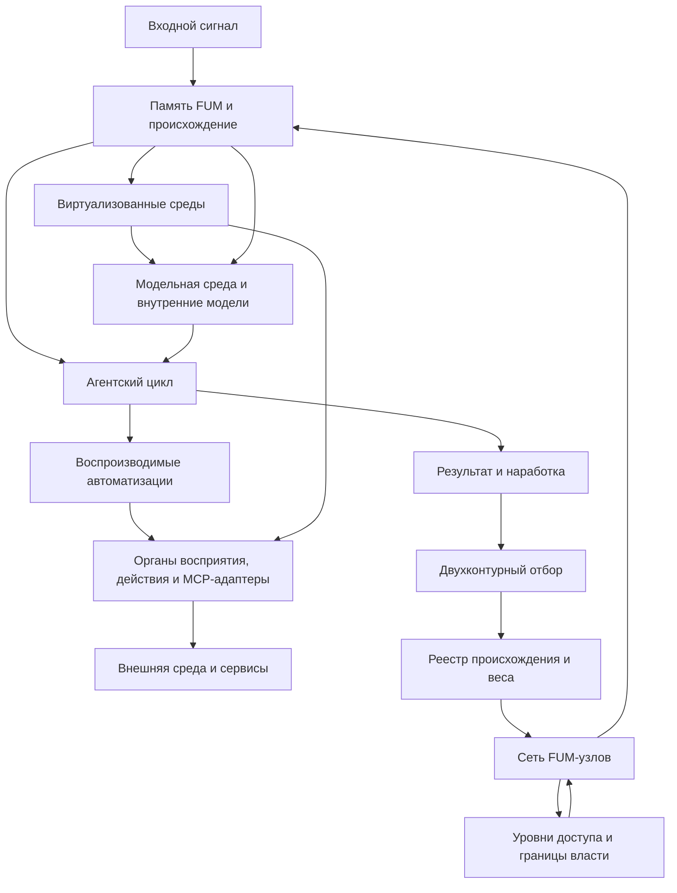

# [Архитектура FUM](../Глоссарий/архитектура-FUM.md)

Источники требований:

- [исходный запрос 2026-06-24 15:35:16 MSK](../Запросы/2026-06-24_15-35-16_MSK.md)
- [исходный запрос 2026-06-24 16:09:34 MSK](../Запросы/2026-06-24_16-09-34_MSK.md)
- [исходный запрос 2026-06-24 16:22:00 MSK](../Запросы/2026-06-24_16-22-00_MSK.md)
- [исходный запрос 2026-06-25 18:36:50 MSK](../Запросы/2026-06-25_18-36-50_MSK.md)
- [исходный запрос 2026-06-25 18:50:18 MSK](../Запросы/2026-06-25_18-50-18_MSK.md)

Опорные документы:

- [Обзор проекта FUM](00-обзор-проекта.md)
- [Модель памяти FUM](01-модель-памяти-FUM.md)
- [Эволюция и мышление](03-эволюция-и-мышление.md)
- [Параллельная работа и слияние](04-параллельная-работа-и-слияние.md)
- [Модульная архитектура FUM](05-модульная-архитектура-FUM.md)
- [Обзор актуальных реализаций агентских циклов](06-обзор-агентских-циклов.md)
- [Доступ к внутренним состояниям](07-доступ-к-внутренним-состояниям.md)
- [Обобщённый поиск повторяющихся последовательностей](08-обобщённый-поиск-повторяющихся-последовательностей.md)
- [Обмен наработками и уровни доступа](09-обмен-наработками-и-уровни-доступа.md)
- [Внутренние модели других узлов](10-внутренние-модели-других-узлов.md)
- [Среда для внутренних FUM](11-среда-для-внутренних-FUM.md)
- [Гибридные узлы и социальная фрактальность](12-гибридные-узлы-и-социальная-фрактальность.md)
- [Физическое действие FUM и аппаратные узлы](13-физическое-действие-и-аппаратные-узлы.md)
- [Космическая автономия FUM и межзвёздное расселение](14-космическая-автономия-и-расселение.md)
- [Децентрализация FUM и границы власти](15-децентрализация-и-границы-власти.md)
- [Научные исследования и открытия](16-научные-исследования-и-открытия.md)
- [Воспроизводимые автоматизации FUM](17-воспроизводимые-автоматизации.md)
- [FUM как единая точка взаимодействия с компьютером](19-единая-точка-взаимодействия-с-компьютером.md)
- [Git-инфраструктура эволюционных цепочек FUM](20-Git-инфраструктура-эволюционных-цепочек-FUM.md)
- [LLM-ориентированный язык автоматизаций](21-LLM-ориентированный-язык-автоматизаций.md)
- [Виртуализованные среды FUM и долговременная память](23-виртуализованные-среды-и-долговременная-память.md)

## Назначение

Этот документ собирает [архитектуру FUM](../Глоссарий/архитектура-FUM.md) в одну входную точку. Он не заменяет детальные документы, а показывает, как уже описанные требования образуют общую систему и куда смотреть при изменении отдельного слоя.

Без такой карты архитектура выглядит разнесённой по документам о [памяти](../Глоссарий/память-FUM.md), [модулях](../Глоссарий/модуль-FUM.md), [агентских циклах](../Глоссарий/агентский-цикл.md), [автоматизациях](../Глоссарий/автоматизация-FUM.md), [модельной среде](../Глоссарий/модельная-среда.md), [виртуализованных средах](../Глоссарий/виртуализованная-среда-FUM.md), [MCP-серверах](../Глоссарий/MCP-сервер.md) и Git-эволюции. Архитектурный раздел фиксирует их как слои одной [памяти FUM](../Глоссарий/память-FUM.md).

## Архитектурное ядро

[FUM](../Глоссарий/FUM.md) проектируется как открытая сеть узлов мышления, памяти и действия. Его можно изображать как рекурсивную нейросеть: узлом может быть простой нейроноподобный элемент, отдельный агент, человек в режиме взаимодействия, [гибридный узел](../Глоссарий/гибридный-узел.md), внутренняя модель, автоматизация, программный сервисный адаптер, аппаратный исполнитель, составная социальная структура или другая сеть таких же узлов.

Ядро архитектуры состоит из четырёх повторяемых связей:

- входной сигнал сохраняется в [памяти](../Глоссарий/память-FUM.md) вместе с происхождением;
- [агентский цикл](../Глоссарий/агентский-цикл.md) превращает память и задачу в действие, проверку и обновление состояния, а в целевом виде служит исполняемым участком [обобщённого дарвиновского алгоритма](../Глоссарий/обобщённый-дарвиновский-алгоритм.md);
- устойчивые действия выделяются в воспроизводимые [автоматизации FUM](../Глоссарий/автоматизация-FUM.md);
- результаты проходят отбор, получают форму [наработок](../Глоссарий/наработка.md) и могут передаваться другим [FUM-узлам](../Глоссарий/FUM-узел.md) с учётом происхождения и [уровней доступа](../Глоссарий/уровень-доступа.md).

Между этими связями действует ещё один сквозной принцип: [FUM](../Глоссарий/FUM.md) должен агрегировать несколько примеров, прототипов или потенциальных реализаций и абстрагировать из них [общие схемы FUM](../Глоссарий/общая-схема-FUM.md). Это позволяет отделять переносимую архитектурную форму от конкретной программно-аппаратной базы и не закреплять случайные особенности первого прототипа как правило всей системы.

Ещё один сквозной принцип - способность узлов строить [виртуализованные среды FUM](../Глоссарий/виртуализованная-среда-FUM.md) для вложенных узлов. Такой слой скрывает более сырой субстрат и предъявляет поверх него организованный интерфейс: от [модельной среды](../Глоссарий/модельная-среда.md) до файловой системы, графа [памяти](../Глоссарий/память-FUM.md), журнала событий или другого способа организации долговременного состояния.

## Карта слоёв

| Слой | Архитектурная роль | Детальные документы |
| --- | --- | --- |
| [Память FUM](../Глоссарий/память-FUM.md) и происхождение | Хранит входы, решения, проверки, документы, журнал, источники и связи требований. | [Модель памяти FUM](01-модель-памяти-FUM.md), [Обзор проекта FUM](00-обзор-проекта.md) |
| [Модули](../Глоссарий/модуль-FUM.md), узлы и фрактальность | Делают малые и большие части системы похожими по форме: простой нейроноподобный узел может входить в сеть, а сеть становиться узлом следующего уровня. | [Модульная архитектура FUM](05-модульная-архитектура-FUM.md), [Децентрализация FUM и границы власти](15-децентрализация-и-границы-власти.md) |
| [Агентский цикл](../Глоссарий/агентский-цикл.md) | Связывает наблюдение, постановку задачи, выбор действия, выполнение, проверку и сохранение результата; должен позволять отбирать агентов по способности порождать длинные, полезные и продуктивные проверяемые цепочки рассуждений и действий. | [Обзор актуальных реализаций агентских циклов](06-обзор-агентских-циклов.md), [Доступ к внутренним состояниям](07-доступ-к-внутренним-состояниям.md) |
| [Автоматизации FUM](../Глоссарий/автоматизация-FUM.md) | Превращают повторяемые рабочие приёмы в локально воспроизводимые, тестируемые и переносимые структуры. | [Воспроизводимые автоматизации FUM](17-воспроизводимые-автоматизации.md), [LLM-ориентированный язык автоматизаций](21-LLM-ориентированный-язык-автоматизаций.md) |
| [Общие схемы FUM](../Глоссарий/общая-схема-FUM.md) | Поднимают несколько примеров или реализаций до переносимого описания инвариантов, вариаций и границ применимости. | [Обобщённый поиск повторяющихся последовательностей](08-обобщённый-поиск-повторяющихся-последовательностей.md), [Воспроизводимые автоматизации FUM](17-воспроизводимые-автоматизации.md) |
| Восприятие, действие и сервисные адаптеры | Соединяют агента с внешними сервисами, интерфейсами, устройствами и физической средой через наблюдаемые контракты. | [FUM как единая точка взаимодействия с компьютером](19-единая-точка-взаимодействия-с-компьютером.md), [Физическое действие FUM и аппаратные узлы](13-физическое-действие-и-аппаратные-узлы.md) |
| [Модельная среда](../Глоссарий/модельная-среда.md) и внутренние модели | Позволяют описывать актуальный мир, реконструировать прошлое, планировать будущее и моделировать соседние узлы. | [Среда для внутренних FUM](11-среда-для-внутренних-FUM.md), [Внутренние модели других узлов](10-внутренние-модели-других-узлов.md) |
| [Виртуализованные среды FUM](../Глоссарий/виртуализованная-среда-FUM.md) и долговременная память | Позволяют узлу предъявлять вложенным узлам более организованный интерфейс поверх сырого носителя, файловой системы, сервиса, модели или другого нижнего слоя. | [Виртуализованные среды FUM и долговременная память](23-виртуализованные-среды-и-долговременная-память.md), [Среда для внутренних FUM](11-среда-для-внутренних-FUM.md), [Физическое действие FUM и аппаратные узлы](13-физическое-действие-и-аппаратные-узлы.md) |
| Социальные и гибридные узлы | Описывают человека, личного агента, команду, организацию и другие коллективы как элементы сети FUM с внутренними границами. | [Гибридные узлы и социальная фрактальность](12-гибридные-узлы-и-социальная-фрактальность.md), [Обмен наработками и уровни доступа](09-обмен-наработками-и-уровни-доступа.md) |
| Эволюционные цепочки | Делают ветки, проверки, ревью, передачу результатов и реестр происхождения носителем отбора и наследования. | [Параллельная работа и слияние](04-параллельная-работа-и-слияние.md), [Git-инфраструктура эволюционных цепочек FUM](20-Git-инфраструктура-эволюционных-цепочек-FUM.md) |
| Исследовательский и дальний физический горизонт | Расширяет архитектуру к исследованиям, открытиям, аппаратным узлам, производственным цепочкам и космической автономии без преждевременного расширения прав действия. | [Научные исследования и открытия](16-научные-исследования-и-открытия.md), [Космическая автономия FUM и межзвёздное расселение](14-космическая-автономия-и-расселение.md) |

## Схема слоёв

## Модульность как частный слой архитектуры

[Модульная архитектура FUM](05-модульная-архитектура-FUM.md) остаётся центральным детальным документом, но она описывает не всю архитектуру целиком, а один из её принципов: повторяемую форму узла, способного хранить состояние, образовывать связи и входить в сеть. В нейросетевом изображении этот узел может быть минимальным нейроноподобным элементом или целой сетью узлов того же рода.

Остальные архитектурные слои отвечают за то, чтобы эта модульность была рабочей, а не только метафорической: память сохраняет происхождение, агентский цикл задаёт ход работы, автоматизации делают действия воспроизводимыми, модельная среда отделяет план от факта, уровни доступа удерживают границы власти, а Git-инфраструктура даёт механизм отбора и наследования.

## Архитектурные ограничения

- Архитектура не должна превращаться в единую скрытую иерархию: составной [FUM-узел](../Глоссарий/FUM-узел.md) не получает автоматической тотальной власти над [подузлами](../Глоссарий/подузел-FUM.md).
- Любой устойчивый слой должен сохранять происхождение: источник требования, входные данные, решение, проверку, результат и ограничения применимости.
- Воспроизводимые части должны стремиться к локальным тестам и [TDD](../Глоссарий/TDD.md), а невоспроизводимые внешние части должны иметь публикационно чистый контракт, фикстуры или отчёт о границе воспроизводимости.
- Пользовательский и сервисный контуры должны проходить через явные [уровни доступа](../Глоссарий/уровень-доступа.md), подтверждения и трассы действий.
- Модельные действия во внутренней среде должны отличаться от реальных действий во внешнем мире, особенно в физических и социально значимых контурах.
- Каждый слой [виртуализованной среды](../Глоссарий/виртуализованная-среда-FUM.md) должен сохранять связь с нижележащим субстратом: происхождение, карту соответствия, проверки целостности, восстановимость, ограничения и отказные режимы.

## Как поддерживать раздел

Если новый документ меняет устройство [FUM](../Глоссарий/FUM.md), нужно проверять, к какому слою этой карты он относится. Если появляется новый слой или старая граница меняется, этот документ обновляется вместе с детальным документом, чтобы архитектура снова читалась из одной точки.

Если изменение уточняет только внутреннее устройство конкретного слоя, достаточно обновить соответствующий детальный документ и при необходимости добавить из него ссылку сюда. Так архитектурный раздел остаётся картой, а не дубликатом всей документации.

Будущие крупные пересборки этого раздела можно вести через локальную автоматизацию [fum-doc-aggregation](../Инструменты/fum-doc-aggregation/SKILL.md): явно задавать тему, опорные документы, ожидаемые разделы и затем проверять, что сводная статья сохранила связи со всеми источниками.
