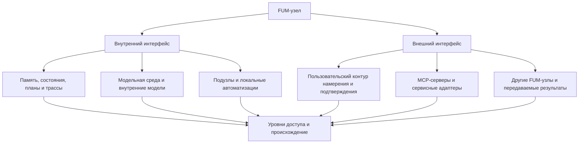

# Интерфейс [FUM-узла](../Глоссарий/FUM-узел.md)

## Требование

[FUM](../Глоссарий/FUM.md) нужно проектировать не только как сам [узел мышления](../Глоссарий/FUM-узел.md), но и как [интерфейс FUM-узла](../Глоссарий/интерфейс-FUM-узла.md): устойчивую границу, через которую узел видит себя изнутри, взаимодействует с подузлами, принимает внешние сигналы, предъявляет результаты другим узлам и действует в среде.

Такой фокус не отменяет образа [фрактального узла мышления](../Глоссарий/фрактальный-узел-мышления.md). Он уточняет, что архитектурно важен не изолированный носитель узла, а форма его внутренней и внешней доступности: какие состояния наблюдаемы, какие операции допустимы, какие права и подтверждения нужны, как сохраняется происхождение и как другой узел может понять результат.

Поэтому вопрос о [FUM-узле](../Глоссарий/FUM-узел.md) должен задаваться через интерфейсы:

- что узел показывает самому себе как [внутреннее состояние](../Глоссарий/внутреннее-состояние.md);
- какие области [памяти](../Глоссарий/память-FUM.md), [модельной среды](../Глоссарий/модельная-среда.md), автоматизаций и подузлов доступны во внутреннем контуре;
- какие входные сигналы, намерения, команды, сервисные вызовы и результаты доступны во внешнем контуре;
- как различаются чтение, изменение, экспорт, публикация, передача [наработок](../Глоссарий/наработка.md) и физическое или сервисное действие;
- какие ограничения, потери наблюдаемости, ошибки и отказные режимы сохраняются в памяти.

## Интерфейс для разных наблюдателей

[FUM](../Глоссарий/FUM.md) на разных уровнях абстракции является интерфейсом для [наблюдателей FUM](../Глоссарий/наблюдатель-FUM.md) разного уровня и воплощения. Один и тот же узел или слой может предъявляться CPU как поток инструкций, памяти и прерываний; GPU - как буферы, тензоры, ядра вычислений и граф исполнения; LLM - как контекст, инструкции, схемы, ограничения и трассы; человеку - как текст, экран, объяснение, подтверждение и результат.

Такой взгляд важен для архитектуры: интерфейс не существует сам по себе, без профиля наблюдателя. То, что является удобной кнопкой для человека, может быть неструктурированным экранным состоянием для LLM; то, что является понятным тензорным графом для GPU, может быть слишком низкоуровневым для человека; то, что является трассой команд для CPU, не обязательно сохраняет смысловое происхождение для FUM.

Когда чистая численная автоматизация компилируется в тензорный вычислительный граф, один и тот же слой получает несколько предъявлений. Человек и LLM должны видеть исходный контракт, смысл операции, ограничения и проверку. Компилятор видит промежуточное представление, формы, типы и допустимые преобразования. GPU видит буферы, тензоры, kernels и граф исполнения. [Память FUM](../Глоссарий/память-FUM.md) должна связывать эти предъявления в одну трассу, чтобы ускоренный слой не становился непрозрачным артефактом без происхождения.

Через [наблюдательскую относительность FUM](../Глоссарий/наблюдательская-относительность-FUM.md) этот вывод становится общим правилом для информационных систем с наблюдателем. Интерфейс должен показывать не только данные и операции, но и систему координат описания: какие элементы являются видимыми именно этому наблюдателю, как они преобразуются в другие представления и какие инварианты должны сохраниться.

Поэтому паспорт интерфейса должен фиксировать:

- для какого наблюдателя или класса наблюдателей построен интерфейс;
- какой уровень абстракции и форма воплощения предполагаются;
- какие сигналы, состояния и операции доступны этому наблюдателю;
- как элементы интерфейса связаны с нижележащим субстратом;
- какие инварианты должны сохраняться при переходе к другим наблюдателям;
- какие смысловые потери, ошибки преобразования и ограничения наблюдаемости известны;
- какой путь ведёт от производного представления к источнику полной информации или почему такой путь невозможен.

При фиксации в памяти текущего документационного прототипа каждый направленный переход между двумя такими предъявлениями оформляется как [преобразование между наблюдателями FUM](../Глоссарий/преобразование-между-наблюдателями-FUM.md). Его [минимальный формат версии 1](38-минимальный-формат-преобразования-между-наблюдателями-FUM.md) отделяет карту сигналов и потерь от проверяемых инвариантов, вывода об обратимости и независимого маршрута к сохранённому источнику; формат будущего runtime определяется отдельно.

## Внутренний интерфейс

Внутренний интерфейс [FUM-узла](../Глоссарий/FUM-узел.md) описывает, как узел предъявляет себе собственные состояния и вложенные области. В него входят рабочая и долговременная [память](../Глоссарий/память-FUM.md), цели, задачи, активные [агентские циклы](../Глоссарий/агентский-цикл.md), планы, проверки, [внутренние модели других узлов](../Глоссарий/внутренняя-модель-другого-узла.md), [модельная среда](../Глоссарий/модельная-среда.md), подузлы, локальные автоматизации и известные ограничения доступа.

Такой интерфейс должен быть наблюдаемым для самого [FUM](../Глоссарий/FUM.md). Если состояние влияет на решение, но не попадает в доступный внутренний контур, система получает слепую зону. Если состояние доступно только человеку через экран, но недоступно агенту как структура, снимок или событие, это тоже потеря внутреннего интерфейса.

Внутренний интерфейс не равен праву неограниченно менять всё внутри узла. Он должен различать наблюдение, рассуждение, изменение, удаление, передачу, публикацию и действие. [Уровни доступа](../Глоссарий/уровень-доступа.md) и [границы власти](../Глоссарий/граница-власти-FUM.md) остаются частью самого интерфейса, а не внешней политикой после факта.

Если FUM построен как сеть внутренних подузлов, внутренний интерфейс должен поддерживать тот же смысловой контур, что и внешняя сеть: локальное знание подузла, сообщение, интерпретацию, обновление памяти, обратную связь и исправление рассогласования. Сообщение может быть естественно-языковым или типизированным операторным представлением, но должно сохранять происхождение, модальность, неоднозначность и возможность обратного объяснения.

## Внешний интерфейс

Внешний интерфейс [FUM-узла](../Глоссарий/FUM-узел.md) описывает, как узел взаимодействует с человеком, другими [FUM-узлами](../Глоссарий/FUM-узел.md), сервисами, файлами, устройствами и физической средой. В него входят пользовательский контур намерения и подтверждения, машинные контракты, [MCP-серверы](../Глоссарий/MCP-сервер.md), сервисные адаптеры, экспорт и импорт [наработок](../Глоссарий/наработка.md), интерфейсы чтения и записи памяти, а также каналы восприятия и действия.

Для человека и другого языкового участника, включая LLM-поддерживаемого агента, естественный язык является первичным семантическим интерфейсом [синхронизации знаний FUM](../Глоссарий/естественно-языковая-синхронизация-знаний-FUM.md). Через него участники согласуют не только роли `я`, `ты` или `мы`, но и понятия, факты, гипотезы, цели, причины, обязательства, ограничения и ожидаемые действия. Технические API, транспорт, аутентификация и права образуют соседний контрактный слой и не должны подменять смысл высказывания.

Граница достаточности этого семантического интерфейса и проверяемые признаки исправленного взаимопонимания остаются в [открытом вопросе о границах естественно-языковой синхронизации знаний](../Вопросы/2026-07-13_20-34-23_MSK_границы-естественно-языковой-синхронизации-знаний-FUM.md).

Внешний интерфейс должен быть достаточно явным, чтобы другой узел мог понять, что было запрошено, что было разрешено, какие данные были использованы, какой результат получен, какие ограничения остались и можно ли этот результат передавать дальше. Удобный пользовательский экран сам по себе недостаточен: за ним должен быть восстановимый контракт, трасса или хотя бы зафиксированная потеря структурированности.

Если внешний интерфейс показывает сжатую или наблюдательски удобную форму, он должен давать переход к исходному слою, из которого эта форма получена: файлу, источнику, журналу, трассе, машинному ответу, DOM-снимку или другому доступному носителю подробностей. Когда переход невозможен, интерфейс не должен молча выглядеть как полный доступ; он помечает границу, чтобы пользователь и другой узел видели, где описание стало необратимым.

Для [личного FUM-агента](../Глоссарий/личный-FUM-агент.md) внешний интерфейс особенно важен: человек выражает намерение, задаёт ограничения и подтверждает действия через этот контур. Для сервисов внешний интерфейс задаёт, какие операции доступны агенту и какие права нужны. Для сети узлов он задаёт способ обмена результатами без скрытого присвоения чужой памяти или власти.

В текущем контуре Git + Codex минимальной доступной репозиторному агенту единицей человеческого ввода является отправленное сообщение-задача. Оно уже агрегирует предшествующие набор, редактирование и интерфейсные действия; до отправки эти события не входят в доступный контекст сессии. Пользовательская задача способна изменить требования, память и следующий веточный шаг, но это изменение наблюдается между дискретными задачами и не доказывает немедленного вытеснения текущего FIFO-владельца.

В [коробочной реализации FUM](../Глоссарий/коробочная-реализация-FUM.md) сообщение остаётся допустимым высокоуровневым агрегатом, но перестаёт быть единственной границей наблюдения. Явно включённая область интерфейса должна передавать разрешённые события ввода по мере возникновения во время активного цикла. Первичный или производный сигнал сохраняет происхождение, порядок, монотонное время, задержку, известные потери и границу агрегации; защищённый или не относящийся к разрешённой области ввод в рабочий контекст не попадает. Этот вход закреплён в [требовании о непрерывном событийном наблюдении](../Требования/🟡-непрерывное-событийное-наблюдение-пользовательского-ввода.md), а его влияние на продолжение — в [требовании о пользовательском перенаправлении цикла](../Требования/🟡-пользовательское-перенаправление-непрерывного-агентского-цикла.md).

Низкоуровневое событие не становится намерением автоматически. Орган восприятия может фильтровать и объединять поток, после чего безопасная контрольная точка проверяемо сохраняет прежнее продолжение либо меняет цель, приоритет, план, ветку или действие. Такая событийная непрерывность описывает управление циклом, а не непрерывный inference, модельный вызов на каждую клавишу или доступ к скрытым рассуждениям.

[Первый коробочный Swift-прототип](43-паспорт-начального-коробочного-прототипа-FUM.md) намеренно не обязан иметь GUI. Он сначала воспроизводимо симулирует [штатное пополнение памяти](../Глоссарий/штатное-пополнение-памяти-FUM.md) и ограниченное исполнение в безоконном режиме, чтобы интерфейсная модель не стала преждевременным отдельным источником истины. Переход к жизнеспособному GUI подтверждается только сквозным сценарием: экранная проекция выводится из канонического состояния [памяти FUM](../Глоссарий/память-FUM.md), показывает происхождение и доступные действия, а действие человека возвращается в тот же событийный контур, меняет память через те же внутренние правила и воспроизводится повторным прогоном.

Набор текста может становиться [наблюдаемым входным сигналом](../Глоссарий/наблюдаемый-входной-сигнал.md) для проверки того, как LLM продолжила бы доступный ей префикс и как его фактически продолжает конкретный человек. Интерфейс должен явно различать слепое ретроспективное воспроизведение, проспективный теневой режим без показа содержания прогноза и режим видимого автодополнения, где предложение LLM уже влияет на дальнейший набор. Во втором проспективном режиме остаются возможны эффекты осведомлённости о наблюдении и задержки интерфейса. В показанном режиме принятие, отклонение и редактирование подсказки являются событиями взаимодействия; причинный эффект требует заранее рандомизированного показа, а без него оценка остаётся описательной.

Такое наблюдение допускается только в явно включённой области интерфейса и с отдельным контрактом на доступный модели контекст, хранение черновиков, удалений, позиций курсора, вставок, буфера обмена, текста третьих лиц и временных характеристик. Глобальный перехват клавиатуры вне выбранной области запрещён, а защищённые поля должны исключаться; локальная обработка, минимизация данных и короткий срок хранения являются формой по умолчанию. Пользователь должен видеть, какой режим активен, иметь возможность остановить запись и запустить проверяемое удаление сырой трассы, производных признаков, кэшей и отделяемого персонального адаптера или индекса. Если внешний провайдер не даёт гарантии удаления своего состояния, интерфейс обязан показать эту границу до передачи данных. Передача ещё не опубликованного текста внешней LLM требует отдельного разрешения и не выводится из общего согласия пользоваться агентом.

В [первом действующем редакторском прототипе](../Прототипы/теневой-редактор-продолжений/README.md) область наблюдения сведена к одному явно открытому UTF-8-файлу, а внешний модельный провайдер отсутствует: продолжение строит только заранее установленная локальная LLM. Файл остаётся каноническим человеческим текстом и не дописывается моделью. Контрольная точка действует только в конце файла, хранит замороженную версию префикса и скрывает модельную ветвь; правка более раннего текста делает её устаревшей, а пользовательский ввод или достижение горизонта останавливают продолжающуюся генерацию. Производный индекс пересобираем, локальная трасса отделена от файла и удаляется явным действием.

Календарь, расписание, такси и поездки являются показательным внешним интерфейсным контуром личного FUM-узла. В нём FUM читает временное состояние, моделирует варианты события и дороги, различает локальное планирование и внешнее сервисное действие, запрашивает подтверждение перед платным или физически значимым шагом и сохраняет трассу вызова адаптера. Неясные границы такой автономии фиксируются в [открытом вопросе о календарно-транспортных действиях FUM](../Вопросы/2026-07-03_09-03-59_MSK_границы-календарно-транспортных-действий-FUM.md).

## Отличие от MCP

[Интерфейс FUM-узла](../Глоссарий/интерфейс-FUM-узла.md) и [MCP-сервер](../Глоссарий/MCP-сервер.md) находятся на разных уровнях архитектуры. Интерфейс FUM-узла описывает всю границу доступности узла: что он видит внутри себя, что показывает человеку, подузлам и другим узлам, какие действия допускает, как сохраняет происхождение, какие подтверждения требует и какие потери наблюдаемости признаёт.

MCP-сервер уже по роли. Он является машинным сервисным адаптером внутри внешнего интерфейса: предоставляет инструменты, ресурсы, операции и состояние конкретного сервиса или среды в форме, пригодной для вызова агентом. Через MCP FUM может читать внешний контекст и выполнять действия, но сам MCP не задаёт целиком внутреннюю память, цели, [агентский цикл](../Глоссарий/агентский-цикл.md), [границы власти](../Глоссарий/граница-власти-FUM.md), пользовательский контур смысла или правила передачи [наработок](../Глоссарий/наработка.md).

Практическое различие можно формулировать так:

| Вопрос          | Интерфейс FUM-узла                                                                                                  | MCP-сервер                                                                             |
| --------------- | ------------------------------------------------------------------------------------------------------------------- | -------------------------------------------------------------------------------------- |
| Что описывает   | Границу внутренней и внешней доступности узла.                                                                      | Машинный контракт доступа к сервису, инструменту или среде.                            |
| Для кого        | Для самого узла, человека, LLM, подузлов, других FUM-узлов, сервисов и нижележащих наблюдателей.                    | Для агента или клиента, который вызывает предоставленные операции.                     |
| Что включает    | Память, состояния, намерения, подтверждения, права, трассы, ошибки, обмен результатами и связь с нижним субстратом. | Инструменты, ресурсы, схемы входов и выходов, ошибки и состояние конкретного адаптера. |
| Где находится   | Над сервисными адаптерами и вокруг них как архитектурная граница узла.                                              | Внутри внешнего интерфейса как один из органов восприятия и действия.                  |
| Что не заменяет | Не заменяет конкретные протоколы и адаптеры доступа к сервисам.                                                     | Не заменяет целостный интерфейс FUM-узла и его внутреннюю организацию.                 |

Поэтому FUM может использовать MCP как удобный и проверяемый способ подключить сервис, но не должен сводить свой интерфейс к списку MCP-инструментов. И наоборот, внешний сервис может иметь MCP-доступ, но пока его вызовы не связаны с памятью, происхождением, подтверждениями, уровнями доступа и результатами FUM, это ещё не полноценный интерфейс FUM-узла.

## Рекурсивность интерфейса

[Фрактальность](../Глоссарий/фрактальный-узел-мышления.md) [FUM](../Глоссарий/FUM.md) означает, что интерфейс тоже рекурсивен. Малый узел имеет внутренний и внешний интерфейс; сеть таких узлов может стать узлом следующего уровня и получить собственный внутренний и внешний интерфейс; [виртуализованная среда FUM](../Глоссарий/виртуализованная-среда-FUM.md) может предъявлять вложенным узлам новый интерфейс поверх более сырого нижнего слоя.

Рекурсивность должна сохранять общий инвариант языковой сети: каждый уровень имеет локальную память, предъявляет смысловые сообщения, интерпретирует их в своём контексте, фиксирует изменения модели и возвращает обратную связь. Благодаря этому ИИ-агент строится по принципу сети агентов человеческого образца, а не только показывает человеку чат поверх монолитного внутреннего механизма.

Это не должно стирать границы. Когда составной узел предъявляет общий интерфейс наружу, его [подузлы](../Глоссарий/подузел-FUM.md) не становятся автоматически полностью прозрачными или полностью управляемыми. Внутренняя область подузла может быть доступна через согласованный интерфейс, но не через скрытую тотальную власть.

## Графовый слой памяти

В [коробочной реализации FUM](../Глоссарий/коробочная-реализация-FUM.md) одним из важных слоёв интерфейса должен стать графовый обзор [памяти](../Глоссарий/память-FUM.md), который показывает не только явно материализованные ссылки между документами, но и семантические переходы, автоматически выведенные исполнительным слоем с помощью [системы структурирующих операторов FUM](../Глоссарий/система-структурирующих-операторов-FUM.md), а также индекс [обобщённого поиска повторяющихся последовательностей](../Глоссарий/обобщённый-поиск-повторяющихся-последовательностей.md). Текущий граф Obsidian полезен как прообраз видимой связности, но целевой интерфейс должен показывать также найденные повторы, позиции появлений, нормализованные формы, кандидаты в [паттерны](../Глоссарий/паттерн-памяти.md), меры поддержки и статусы проверки.

Переход должен быть доступен даже тогда, когда исходный текст не содержит буквальной Markdown-ссылки. Интерфейс отдельно показывает инициатора предложения или вывода (человек, LLM либо автоматизация), исполнительный контур, применённый оператор, исходные материалы и их происхождение, статус проверки (кандидатная, подтверждённая либо отклонённая связь), уверенность и форму предъявления (динамический переход, Markdown-ссылка, ребро графа, рекомендация либо маршрут). Принятие, отклонение или закрепление кандидата является отдельным наблюдаемым действием и не должно неявно переписывать исходный текст.

Для человека такой граф является способом увидеть, как из отдельных фрагментов памяти вырастают повторяющиеся формы и общие схемы. Для агента он должен быть машинно читаемым интерфейсом запроса: какие последовательности поддерживают гипотезу, где лежат контрпримеры, какие связи уже закреплены, а какие остаются только наблюдаемыми кандидатами.

Если индекс применяется к русскому тексту, графовый слой должен уметь показывать морфологические гипотезы: связи словоформ, склонений, спряжений, окончаний и согласований. Эти связи не должны смешиваться с вручную утверждёнными правилами грамматики: интерфейс обязан показывать происхождение, уверенность, исключения и статус проверки каждой такой регулярности.

Отдельной частью графового слоя должна стать экранная проекция [системы структурирующих операторов FUM](../Глоссарий/система-структурирующих-операторов-FUM.md). Один и тот же операторный граф должен уметь порождать не только текстовое объяснение, но и человекочитаемую карту структурированных знаний: узлы операторов, связи распознавания и порождения, уровни абстракции, цепочки источников, проверки, конфликты, остатки и варианты перехода к действию.

Такой экран не должен быть только визуальной витриной. Каждый видимый элемент должен по возможности оставаться связанным с машинной структурой: оператором, фрагментом памяти, исходным запросом, примером, трассой инструмента, статусом доверия или явно указанной потерей. Если человек правит карту, принимает связь, отклоняет кандидат или раскрывает диагностический остаток, это действие должно сохраняться как событие интерфейса и возвращаться в операторную систему для проверки.

Поэтому графовый слой интерфейса должен различать внутренний операторный граф и операторы его предъявления человеку. Оператор предъявления описывает, какой фрагмент структуры становится узлом, ребром, таблицей, деревом, временной шкалой или другим экранным видом, какие признаки показываются как статус, доверие, конфликт или остаток и какие действия человека переводятся обратно в формальные изменения памяти. Такой слой позволяет одному смысловому объекту иметь несколько представлений без потери пути к исходному графу.

## Схема

## Архитектурные следствия

- [Архитектура FUM](../Глоссарий/архитектура-FUM.md) должна описывать узлы через их внутренние и внешние интерфейсы, а не только через тип носителя или место в иерархии.
- Пользовательский интерфейс является частным случаем внешнего интерфейса узла, но не исчерпывает его: машинные контракты, события, трассы и уровни доступа не менее важны.
- Естественный язык должен быть первичным семантическим интерфейсом людей и других языковых участников, включая LLM-поддерживаемых агентов, а местоименная адресация должна оставаться одним из его частных слоёв.
- Внутренний и внешний интерфейсы сети FUM должны сохранять совместимый контур сообщения, интерпретации, обновления памяти, обратной связи и исправления.
- [Виртуализованные среды](../Глоссарий/виртуализованная-среда-FUM.md) являются способом построить внутренний интерфейс для вложенных узлов поверх более сырого субстрата.
- [Единая точка взаимодействия с компьютером](../Глоссарий/единая-точка-взаимодействия-с-компьютером.md) является внешним интерфейсом личного FUM-узла к человеку и цифровой среде.
- Сообщение-задача является агрегированной формой человеческого ввода, а коробочный интерфейс должен уметь принимать разрешённые события во время активного цикла и связывать изменение продолжения с их происхождением.
- Слепой ретроспективный replay, проспективный теневой прогноз и видимое автодополнение должны быть разными режимами интерфейса с разными метриками, трассами и разрешениями.
- Обмен [наработками](../Глоссарий/наработка.md) между узлами должен проходить через интерфейсы экспорта и импорта, где видны происхождение, совместимость, права передачи и ограничения.
- Проверки FUM должны искать не только ошибки результата, но и разрывы интерфейса: скрытые состояния, непроверяемые сервисные вызовы, неявные права действия, потерю структурированности и неописанные отказные режимы.

## Ближний проверяемый слой

Минимальный следующий шаг - описать паспорт интерфейса [FUM-узла](../Глоссарий/FUM-узел.md). Такой паспорт должен фиксировать внутренние состояния, внешние входы и выходы, допустимые операции, уровни доступа, точки подтверждения, трассу, карту связи с нижним субстратом, ограничения и проверку восстановления после ошибки.

Первый паспорт должен быть не универсальным, а локальным: для текущего [гибридного узла](../Глоссарий/гибридный-узел.md) человек - Codex - Obsidian-хранилище в этом репозитории. Этот контур является [документационным прототипом FUM](../Глоссарий/документационный-прототип-FUM.md), поэтому паспорт должен показать, какие данные видит человек в Obsidian, какие файлы, правила и инструменты видит LLM-среда Codex, какие команды доступны через агентскую среду, какие действия требуют подтверждения, как итог сохраняется в [памяти FUM](../Глоссарий/память-FUM.md), какие части результата не являются полностью локально воспроизводимыми и какие контракты нужно перенести в будущую [коробочную реализацию FUM](../Глоссарий/коробочная-реализация-FUM.md).

Паспорт также должен перечислять производные интерфейсные формы и оформлять их переходы по [минимальному формату преобразования между наблюдателями FUM](38-минимальный-формат-преобразования-между-наблюдателями-FUM.md): от экранного состояния к файлу или DOM, от графической карты операторов к машинному графу и источникам, от краткого отчёта к полной трассе, от карточки к исходному требованию, от машинного JSON к человекочитаемому объяснению и обратно в пределах доступной информации.

## Источники требований

- [исходный запрос 2026-07-23 11:50:58 MSK - Описать минимальный формат преобразования между наблюдателями FUM](../Журнал/2026-07-23_11-50-58_MSK_описать-минимальный-формат-преобразования-между-наблюдателями-FUM/запрос.md)
- [исходный запрос 2026-06-26 09:55:41 MSK](../Журнал/2026-06-26_09-55-41_MSK/запрос.md)
- [исходный запрос 2026-06-26 10:26:06 MSK](../Журнал/2026-06-26_10-26-06_MSK/запрос.md)
- [исходный запрос 2026-06-26 10:34:02 MSK](../Журнал/2026-06-26_10-34-02_MSK/запрос.md)
- [исходный запрос 2026-06-26 10:47:01 MSK](../Журнал/2026-06-26_10-47-01_MSK/запрос.md)
- [исходный запрос 2026-06-26 11:39:57 MSK](../Журнал/2026-06-26_11-39-57_MSK/запрос.md)
- [исходный запрос 2026-06-29 10:59:18 MSK](../Журнал/2026-06-29_10-59-18_MSK/запрос.md)
- [исходный запрос 2026-07-01 15:19:31 MSK](../Журнал/2026-07-01_15-19-31_MSK/запрос.md)
- [исходный запрос 2026-07-02 11:14:15 MSK](../Журнал/2026-07-02_11-14-15_MSK/запрос.md)
- [исходный запрос 2026-07-03 09:03:59 MSK - Описать календарно транспортные действия FUM](../Журнал/2026-07-03_09-03-59_MSK_описать-календарно-транспортные-действия-FUM/запрос.md)
- [исходный запрос 2026-07-06 13:34:08 MSK - Описать компиляцию алгоритмов в тензорный граф](../Журнал/2026-07-06_13-34-08_MSK_описать-компиляцию-алгоритмов-в-тензорный-граф/запрос.md)
- [исходный запрос 2026-07-08 12:21:45 MSK - Связать операторную систему с графическим интерфейсом](../Журнал/2026-07-08_12-21-45_MSK_связать-операторную-систему-с-графическим-интерфейсом/запрос.md)
- [исходный запрос 2026-07-08 12:38:52 MSK - Закрепить операторную память как ядро FUM](../Журнал/2026-07-08_12-38-52_MSK_закрепить-операторную-память-как-ядро-FUM/запрос.md)
- [исходный запрос 2026-07-13 22:00:22 MSK - Закрепить естественный язык как язык синхронизации знаний](../Журнал/2026-07-13_22-00-22_MSK_закрепить-естественный-язык-как-язык-синхронизации-знаний/запрос.md)
- [исходный запрос 2026-07-14 01:15:40 MSK - Закрепить автоматические семантические связи личного FUM](../Журнал/2026-07-14_01-15-40_MSK_закрепить-автоматические-семантические-связи-личного-FUM/запрос.md)
- [исходный запрос 2026-07-14 01:40:47 MSK - Сравнить продолжение LLM с набором человека](../Журнал/2026-07-14_01-40-47_MSK_сравнить-продолжение-LLM-с-набором-человека/запрос.md)
- [исходный запрос 2026-07-14 08:54:56 MSK - Создать прототип расхождения продолжений](../Журнал/2026-07-14_08-54-56_MSK_создать-прототип-расхождения-продолжений/запрос.md)
- [исходный запрос 2026-07-24 10:01:26 MSK — Уточнить событийную непрерывность документационного прототипа FUM](../Журнал/2026-07-24_10-01-26_MSK_уточнить-событийную-непрерывность-документационного-прототипа-FUM/запрос.md)
- [исходный запрос 2026-07-24 10:44:28 MSK — Начать безоконный Swift-прототип воспроизводимого пополнения памяти FUM](../Журнал/2026-07-24_10-44-28_MSK_начать-безоконный-Swift-прототип-воспроизводимого-пополнения-памяти-FUM/запрос.md)

## Опорные документы

- [Архитектура FUM](22-архитектура-FUM.md)
- [Модульная архитектура FUM](05-модульная-архитектура-FUM.md)
- [Доступ к внутренним состояниям](07-доступ-к-внутренним-состояниям.md)
- [FUM как единая точка взаимодействия с компьютером](19-единая-точка-взаимодействия-с-компьютером.md)
- [Виртуализованные среды FUM и долговременная память](23-виртуализованные-среды-и-долговременная-память.md)
- [Обмен наработками и уровни доступа](09-обмен-наработками-и-уровни-доступа.md)
- [Наблюдательская относительность информационных систем](26-наблюдательская-относительность-информационных-систем.md)
- [Минимальный формат преобразования между наблюдателями FUM](38-минимальный-формат-преобразования-между-наблюдателями-FUM.md)
- [Естественный язык и синхронизация знаний FUM](34-естественный-язык-и-синхронизация-знаний-FUM.md)

<!-- FUM-MD-RECENCY:BEGIN -->
<!-- last-content-edit: 2026-08-03 14:54:04 MSK -->
<!-- content-sha256: sha256:c0b807cecf618395dfa441a2100ac2dcb96a0d6134dafe4a19e903f80a2c3dac -->
<!-- FUM-MD-RECENCY:END -->
