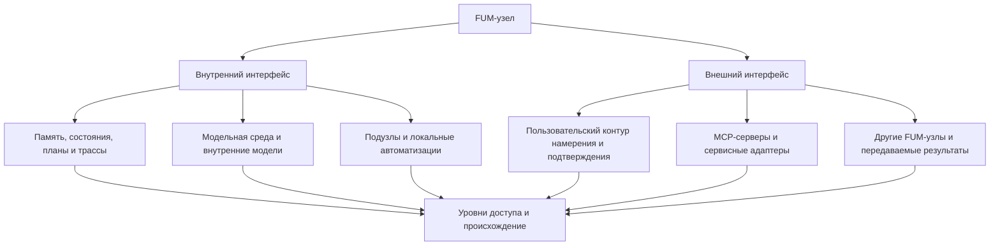

# Интерфейс [FUM-узла](../Глоссарий/FUM-узел.md)

## Требование

[FUM](../Глоссарий/FUM.md) нужно проектировать не только как сам [узел мышления](../Глоссарий/FUM-узел.md), но и как [интерфейс FUM-узла](../Глоссарий/интерфейс-FUM-узла.md): устойчивую границу, через которую узел видит себя изнутри, взаимодействует с подузлами, принимает внешние сигналы, предъявляет результаты другим узлам и действует в среде.

Такой фокус не отменяет образа [фрактального узла мышления](../Глоссарий/фрактальный-узел-мышления.md). Он уточняет, что архитектурно важен не изолированный носитель узла, а форма его внутренней и внешней доступности: какие состояния наблюдаемы, какие операции допустимы, какие права и подтверждения нужны, как сохраняется происхождение и как другой узел может понять результат.

Поэтому вопрос о [FUM-узле](../Глоссарий/FUM-узел.md) должен задаваться через интерфейсы:

- что узел показывает самому себе как [внутреннее состояние](../Глоссарий/внутреннее-состояние.md);
- какие области [памяти](../Глоссарий/память-FUM.md), [модельной среды](../Глоссарий/модельная-среда.md), автоматизаций и подузлов доступны во внутреннем контуре;
- какие входные сигналы, намерения, команды, сервисные вызовы и результаты доступны во внешнем контуре;
- как различаются чтение, изменение, экспорт, публикация, передача [наработок](../Глоссарий/наработка.md) и физическое или сервисное действие;
- какие ограничения, потери наблюдаемости, ошибки и отказные режимы сохраняются в памяти.

## Интерфейс для разных наблюдателей

[FUM](../Глоссарий/FUM.md) на разных уровнях абстракции является интерфейсом для [наблюдателей FUM](../Глоссарий/наблюдатель-FUM.md) разного уровня и воплощения. Один и тот же узел или слой может предъявляться CPU как поток инструкций, памяти и прерываний; GPU - как буферы, тензоры, ядра вычислений и граф исполнения; LLM - как контекст, инструкции, схемы, ограничения и трассы; человеку - как текст, экран, объяснение, подтверждение и результат.

Такой взгляд важен для архитектуры: интерфейс не существует сам по себе, без профиля наблюдателя. То, что является удобной кнопкой для человека, может быть неструктурированным экранным состоянием для LLM; то, что является понятным тензорным графом для GPU, может быть слишком низкоуровневым для человека; то, что является трассой команд для CPU, не обязательно сохраняет смысловое происхождение для FUM.

Поэтому паспорт интерфейса должен фиксировать:

- для какого наблюдателя или класса наблюдателей построен интерфейс;
- какой уровень абстракции и форма воплощения предполагаются;
- какие сигналы, состояния и операции доступны этому наблюдателю;
- как элементы интерфейса связаны с нижележащим субстратом;
- какие смысловые потери, ошибки преобразования и ограничения наблюдаемости известны.

## Внутренний интерфейс

Внутренний интерфейс [FUM-узла](../Глоссарий/FUM-узел.md) описывает, как узел предъявляет себе собственные состояния и вложенные области. В него входят рабочая и долговременная [память](../Глоссарий/память-FUM.md), цели, задачи, активные [агентские циклы](../Глоссарий/агентский-цикл.md), планы, проверки, [внутренние модели других узлов](../Глоссарий/внутренняя-модель-другого-узла.md), [модельная среда](../Глоссарий/модельная-среда.md), подузлы, локальные автоматизации и известные ограничения доступа.

Такой интерфейс должен быть наблюдаемым для самого [FUM](../Глоссарий/FUM.md). Если состояние влияет на решение, но не попадает в доступный внутренний контур, система получает слепую зону. Если состояние доступно только человеку через экран, но недоступно агенту как структура, снимок или событие, это тоже потеря внутреннего интерфейса.

Внутренний интерфейс не равен праву неограниченно менять всё внутри узла. Он должен различать наблюдение, рассуждение, изменение, удаление, передачу, публикацию и действие. [Уровни доступа](../Глоссарий/уровень-доступа.md) и [границы власти](../Глоссарий/граница-власти-FUM.md) остаются частью самого интерфейса, а не внешней политикой после факта.

## Внешний интерфейс

Внешний интерфейс [FUM-узла](../Глоссарий/FUM-узел.md) описывает, как узел взаимодействует с человеком, другими [FUM-узлами](../Глоссарий/FUM-узел.md), сервисами, файлами, устройствами и физической средой. В него входят пользовательский контур намерения и подтверждения, машинные контракты, [MCP-серверы](../Глоссарий/MCP-сервер.md), сервисные адаптеры, экспорт и импорт [наработок](../Глоссарий/наработка.md), интерфейсы чтения и записи памяти, а также каналы восприятия и действия.

Внешний интерфейс должен быть достаточно явным, чтобы другой узел мог понять, что было запрошено, что было разрешено, какие данные были использованы, какой результат получен, какие ограничения остались и можно ли этот результат передавать дальше. Удобный пользовательский экран сам по себе недостаточен: за ним должен быть восстановимый контракт, трасса или хотя бы зафиксированная потеря структурированности.

Для [личного FUM-агента](../Глоссарий/личный-FUM-агент.md) внешний интерфейс особенно важен: человек выражает намерение, задаёт ограничения и подтверждает действия через этот контур. Для сервисов внешний интерфейс задаёт, какие операции доступны агенту и какие права нужны. Для сети узлов он задаёт способ обмена результатами без скрытого присвоения чужой памяти или власти.

## Отличие от MCP

[Интерфейс FUM-узла](../Глоссарий/интерфейс-FUM-узла.md) и [MCP-сервер](../Глоссарий/MCP-сервер.md) находятся на разных уровнях архитектуры. Интерфейс FUM-узла описывает всю границу доступности узла: что он видит внутри себя, что показывает человеку, подузлам и другим узлам, какие действия допускает, как сохраняет происхождение, какие подтверждения требует и какие потери наблюдаемости признаёт.

MCP-сервер уже по роли. Он является машинным сервисным адаптером внутри внешнего интерфейса: предоставляет инструменты, ресурсы, операции и состояние конкретного сервиса или среды в форме, пригодной для вызова агентом. Через MCP FUM может читать внешний контекст и выполнять действия, но сам MCP не задаёт целиком внутреннюю память, цели, [агентский цикл](../Глоссарий/агентский-цикл.md), [границы власти](../Глоссарий/граница-власти-FUM.md), пользовательский контур смысла или правила передачи [наработок](../Глоссарий/наработка.md).

Практическое различие можно формулировать так:

| Вопрос          | Интерфейс FUM-узла                                                                                                  | MCP-сервер                                                                             |
| --------------- | ------------------------------------------------------------------------------------------------------------------- | -------------------------------------------------------------------------------------- |
| Что описывает   | Границу внутренней и внешней доступности узла.                                                                      | Машинный контракт доступа к сервису, инструменту или среде.                            |
| Для кого        | Для самого узла, человека, LLM, подузлов, других FUM-узлов, сервисов и нижележащих наблюдателей.                    | Для агента или клиента, который вызывает предоставленные операции.                     |
| Что включает    | Память, состояния, намерения, подтверждения, права, трассы, ошибки, обмен результатами и связь с нижним субстратом. | Инструменты, ресурсы, схемы входов и выходов, ошибки и состояние конкретного адаптера. |
| Где находится   | Над сервисными адаптерами и вокруг них как архитектурная граница узла.                                              | Внутри внешнего интерфейса как один из органов восприятия и действия.                  |
| Что не заменяет | Не заменяет конкретные протоколы и адаптеры доступа к сервисам.                                                     | Не заменяет целостный интерфейс FUM-узла и его внутреннюю организацию.                 |

Поэтому FUM может использовать MCP как удобный и проверяемый способ подключить сервис, но не должен сводить свой интерфейс к списку MCP-инструментов. И наоборот, внешний сервис может иметь MCP-доступ, но пока его вызовы не связаны с памятью, происхождением, подтверждениями, уровнями доступа и результатами FUM, это ещё не полноценный интерфейс FUM-узла.

## Рекурсивность интерфейса

[Фрактальность](../Глоссарий/фрактальный-узел-мышления.md) [FUM](../Глоссарий/FUM.md) означает, что интерфейс тоже рекурсивен. Малый узел имеет внутренний и внешний интерфейс; сеть таких узлов может стать узлом следующего уровня и получить собственный внутренний и внешний интерфейс; [виртуализованная среда FUM](../Глоссарий/виртуализованная-среда-FUM.md) может предъявлять вложенным узлам новый интерфейс поверх более сырого нижнего слоя.

Это не должно стирать границы. Когда составной узел предъявляет общий интерфейс наружу, его [подузлы](../Глоссарий/подузел-FUM.md) не становятся автоматически полностью прозрачными или полностью управляемыми. Внутренняя область подузла может быть доступна через согласованный интерфейс, но не через скрытую тотальную власть.

## Схема

## Архитектурные следствия

- [Архитектура FUM](../Глоссарий/архитектура-FUM.md) должна описывать узлы через их внутренние и внешние интерфейсы, а не только через тип носителя или место в иерархии.
- Пользовательский интерфейс является частным случаем внешнего интерфейса узла, но не исчерпывает его: машинные контракты, события, трассы и уровни доступа не менее важны.
- [Виртуализованные среды](../Глоссарий/виртуализованная-среда-FUM.md) являются способом построить внутренний интерфейс для вложенных узлов поверх более сырого субстрата.
- [Единая точка взаимодействия с компьютером](../Глоссарий/единая-точка-взаимодействия-с-компьютером.md) является внешним интерфейсом личного FUM-узла к человеку и цифровой среде.
- Обмен [наработками](../Глоссарий/наработка.md) между узлами должен проходить через интерфейсы экспорта и импорта, где видны происхождение, совместимость, права передачи и ограничения.
- Проверки FUM должны искать не только ошибки результата, но и разрывы интерфейса: скрытые состояния, непроверяемые сервисные вызовы, неявные права действия, потерю структурированности и неописанные отказные режимы.

## Ближний проверяемый слой

Минимальный следующий шаг - описать паспорт интерфейса [FUM-узла](../Глоссарий/FUM-узел.md). Такой паспорт должен фиксировать внутренние состояния, внешние входы и выходы, допустимые операции, уровни доступа, точки подтверждения, трассу, карту связи с нижним субстратом, ограничения и проверку восстановления после ошибки.

Первый паспорт должен быть не универсальным, а локальным: для текущего [гибридного узла](../Глоссарий/гибридный-узел.md) человек - Codex - Obsidian-хранилище в этом репозитории. Он должен показать, какие данные видит человек в Obsidian, какие файлы, правила и инструменты видит LLM-среда Codex, какие команды доступны через агентскую среду, какие действия требуют подтверждения, как итог сохраняется в [памяти FUM](../Глоссарий/память-FUM.md) и какие части результата не являются полностью локально воспроизводимыми.

## Источники требований

- [исходный запрос 2026-06-26 09:55:41 MSK](../Запросы/2026-06-26_09-55-41_MSK.md)
- [исходный запрос 2026-06-26 10:26:06 MSK](../Запросы/2026-06-26_10-26-06_MSK.md)
- [исходный запрос 2026-06-26 10:34:02 MSK](../Запросы/2026-06-26_10-34-02_MSK.md)
- [исходный запрос 2026-06-26 10:47:01 MSK](../Запросы/2026-06-26_10-47-01_MSK.md)

## Опорные документы

- [Архитектура FUM](22-архитектура-FUM.md)
- [Модульная архитектура FUM](05-модульная-архитектура-FUM.md)
- [Доступ к внутренним состояниям](07-доступ-к-внутренним-состояниям.md)
- [FUM как единая точка взаимодействия с компьютером](19-единая-точка-взаимодействия-с-компьютером.md)
- [Виртуализованные среды FUM и долговременная память](23-виртуализованные-среды-и-долговременная-память.md)
- [Обмен наработками и уровни доступа](09-обмен-наработками-и-уровни-доступа.md)
