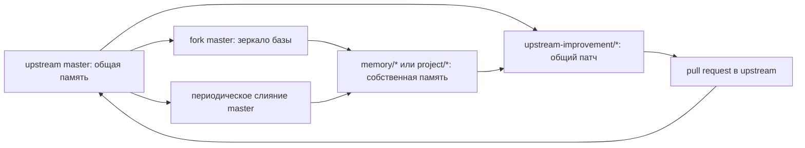

# Публичный upstream и форки памяти FUM

Этот репозиторий готовится к публикации на GitHub как базовый upstream [памяти FUM](../Глоссарий/память-FUM.md). Его публичная ветка `master` должна быть общей, публикационно чистой и пригодной для наследования: в ней хранятся правила, документация, глоссарий, планирование, воспроизводимые инструменты, источники требований и проверяемая история.

Форк такого репозитория не обязан становиться публичной личной памятью пользователя. Базовая схема обратная: `master` остаётся общим слоем, а собственная память, локальные проекты, приватные материалы и экспериментальные линии живут в отдельных ветках или приватных форках с явными [уровнями доступа](../Глоссарий/уровень-доступа.md). Обновления базового upstream периодически сливаются в эти ветки, а улучшения, полезные для общей памяти, возвращаются обратно через отдельные ветки и pull request.

## Публикационный аудит

Локальный аудит рабочей сессии 2026-07-01 12:11:27 MSK проверил готовность репозитория к публикации как базового upstream.

| Область | Результат |
| --- | --- |
| Git-состояние | До рабочей сессии ветка `master` была чистой; удалённый `remote` не настроен, поэтому фактическая публикация на GitHub ещё требует создания репозитория и `push`. |
| Лицензия | [LICENSE.md](../LICENSE.md) фиксирует CC0 1.0 Universal. |
| Входной файл | [README.md](../README.md) обновлён как входная точка для внешнего пользователя и форка памяти. |
| Секреты и токены | Поиск по сильным паттернам API-ключей, токенов, приватных ключей, bearer-значений и паролей не выявил незаредактированных секретов. |
| Локальные и машинные файлы | `.DS_Store` и `.obsidian/workspace.json` остаются неотслеживаемым локальным состоянием по `.gitignore`; устойчивые настройки `.obsidian/` отслеживаются Git. |
| Сырые источники | У сохранённого ChatGPT-share источника расширена редакция: служебные request-id и `async_source` распакованного потока заменены на `[REDACTED: local request metadata]`; автоматизация `fum-request-materials` получила тест на это поведение. |
| Размеры файлов | Файлов больше 1 MB в рабочем дереве не обнаружено. |
| Связность памяти | Итоговая сессия прошла `fum-md-recency`, `fum-session-coherence` и `git diff --check` перед коммитом. |

По локальному аудиту критических блокеров для публикации не осталось. Остаточные действия относятся уже к GitHub-стороне: создать публичный репозиторий, настроить `origin`, отправить `master`, включить защиту базовой ветки и описать repository metadata на странице GitHub.

## Правила базового upstream

`master` базового репозитория несёт только общую публикационно чистую память. В него не попадают приватные запросы, токены, локальные рабочие состояния, личные заметки без разрешения на публикацию, машинные кэши и материалы с неясным уровнем доступа.

Каждое изменение `master` должно сохранять цепочку происхождения: [исходный запрос](../Глоссарий/исходный-запрос.md) -> производная документация или инструмент -> проверки -> Git-коммит. Для рабочих сессий действуют правила [AGENTS.md](../AGENTS.md): запрос сохраняется в `Запросы/`, журнал - в `Журнал/`, список затронутых файлов и использованных инструментов фиксируется в запросе, recency-метки и проверка связности запускаются перед коммитом.

Если публикация на GitHub включит branch protection, для `master` рекомендуется требовать как минимум review или явное подтверждение владельца, прохождение локальных проверок перед merge и запрет прямого добавления файлов с секретами. Пока таких GitHub-настроек в локальном репозитории нет, они считаются отдельным шагом публикации.

## Как форкнуть память

Внешний пользователь создаёт fork на GitHub и клонирует уже свой репозиторий:

```bash
git clone <url-вашего-форка-FUM>
cd FUM
git remote add upstream <url-базового-репозитория-FUM>
git fetch upstream
```

В форке рекомендуется держать `master` максимально близко к upstream `master`, а собственную память вести в отдельной ветке:

```bash
git switch -c memory/<краткое-название>
```

Для проектных линий можно использовать ветки вида `project/<краткое-название>`, для экспериментов - `experiment/<краткое-название>`, для улучшений, которые планируется вернуть в upstream, - `upstream-improvement/<краткое-название>`.

## Ведение собственной ветки

Собственная ветка форка может содержать локальные требования, документы проекта, личные правила, приватные источники и адаптации, если выбранный уровень доступа позволяет хранить их именно в этом форке. Для публичного форка личные и закрытые материалы лучше не добавлять вовсе; для приватного форка всё равно стоит явно отделять будущие публичные улучшения от частной памяти.

Практическое правило: изменения, полезные только конкретному человеку или проекту, остаются в `memory/*` или `project/*`; изменения правил, инструментов, глоссария, публикационной чистоты, проверок или общей архитектуры выносятся в отдельную ветку от свежего `master`, чтобы их можно было вернуть в базовый upstream без примеси личной памяти.

Перед каждым слиянием или pull request нужно проверить, что в изменениях нет токенов, cookie, приватных URL, локальных IP, учётных записей, машинных кэшей и материалов, чей уровень доступа не допускает публикацию.

## Слияние обновляющегося master

Периодическое обновление форка начинается с подтягивания базового upstream:

```bash
git fetch upstream
git switch master
git merge --ff-only upstream/master
git push origin master
```

`--ff-only` полезен как защита от случайного развития собственного `master`. Если команда не проходит, это сигнал, что в `master` форка появились локальные изменения; их нужно вынести в отдельную ветку или осознанно разобрать конфликт, а не смешивать базовую память и личную линию.

После обновления `master` его сливают в собственную ветку:

```bash
git switch memory/<краткое-название>
git merge master
```

Конфликты при таком слиянии считаются нормальным местом отбора: пользователь решает, какие новые правила и документы upstream применимы к его памяти, а где локальная ветка должна сохранить собственное решение. Итоговый merge-коммит остаётся частью истории этой ветки и показывает, какие базовые изменения были унаследованы.

## Обратная передача улучшений

Если в форке появилось улучшение, полезное для всех, его лучше отделить от личной ветки и перенести на свежий `master`:

```bash
git switch master
git merge --ff-only upstream/master
git switch -c upstream-improvement/<краткое-название>
```

В такую ветку попадает только публикационно чистый общий результат: исправление документации, улучшение автоматизации, тест, глоссарное уточнение, правило рабочей сессии или архитектурное решение. Pull request в upstream должен объяснять происхождение изменения, перечислять проверки и явно отмечать, что приватные материалы не включены.

Если полезная идея возникла внутри приватной памяти, наружу передаётся не вся ветка, а обезличенная или заново оформленная [наработка](../Глоссарий/наработка.md): текст требования, патч, тест, шаблон, отчёт или другое содержание, которое можно опубликовать под CC0.

## Схема потоков



Эта схема делает GitHub не просто местом публикации, а первым социальным носителем [эволюционных цепочек FUM](../Глоссарий/эволюционная-цепочка-FUM.md): базовая память распространяет устойчивые изменения, форки проверяют их на разных проектах, а полезные улучшения возвращаются обратно как [передаваемые результаты FUM](../Глоссарий/передаваемый-результат-FUM.md).

## Источники требований

- [исходный запрос 2026-07-01 11:34:46 MSK](../Запросы/2026-07-01_11-34-46_MSK.md)
- [исходный запрос 2026-07-01 12:11:27 MSK](../Запросы/2026-07-01_12-11-27_MSK.md)
- [Публикация и лицензия](02-публикация-и-лицензия.md)
- [Git-инфраструктура эволюционных цепочек FUM](20-Git-инфраструктура-эволюционных-цепочек-FUM.md)
- [Дорожная карта FUM](../Планирование/дорожная-карта.md)

<!-- FUM-MD-RECENCY:BEGIN -->
<!-- last-content-edit: 2026-07-01 12:21:40 MSK -->
<!-- content-sha256: sha256:dfc8e94851acff4fef58a95e8ae6d0541ff367ea48eeb8bbd292c8a95d1fcc01 -->
<!-- FUM-MD-RECENCY:END -->
