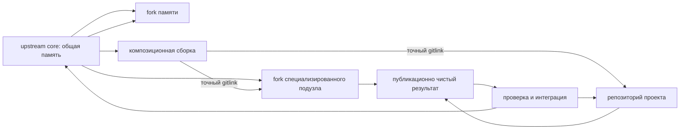

# Публичный upstream и форки памяти FUM

Этот репозиторий опубликован на GitHub как публичный базовый upstream [памяти FUM](../Глоссарий/память-FUM.md): открытая страница [fum-lab/fum](https://github.com/fum-lab/fum) доступна без входа. В наблюдаемой основной рабочей копии на 2026-07-21 локальный `origin` указывал на `https://github.com/fum-lab/fum.git`; это снимок данного клона, а не правило для пользовательских форков. Публичная ветка `master` должна оставаться общей, публикационно чистой и пригодной для наследования: в ней хранятся правила, документация, глоссарий, планирование, воспроизводимые инструменты, источники требований и проверяемая история.

Форк такого репозитория не обязан становиться публичной личной памятью пользователя. Базовая схема сохраняет `master` как общий слой, а собственную память и экспериментальные линии размещает в отдельных ветках или приватных форках с явными [уровнями доступа](../Глоссарий/уровень-доступа.md). Долговечные специализированные подузлы и проекты в целевой архитектуре получают отдельные репозитории; конкретная сеть подключает их как submodule в отдельной композиционной сборке, не смешивая её граф экземпляров с общим upstream.

## Публикационный аудит

Локальный аудит рабочей сессии 2026-07-01 12:11:27 MSK проверил готовность репозитория к публикации как базового upstream. Следующая таблица сохраняет исторический снимок именно той сессии, а не текущий статус GitHub.

| Область                    | Результат                                                                                                                                                                                                                                        |
| -------------------------- | ------------------------------------------------------------------------------------------------------------------------------------------------------------------------------------------------------------------------------------------------ |
| Git-состояние              | До рабочей сессии ветка `master` была чистой; удалённый `remote` не настроен, поэтому фактическая публикация на GitHub ещё требует создания репозитория и `push`.                                                                                |
| Лицензия                   | [LICENSE.md](../LICENSE.md) фиксирует CC0 1.0 Universal.                                                                                                                                                                                         |
| Входной файл               | [README.md](../README.md) обновлён как входная точка для внешнего пользователя и форка памяти.                                                                                                                                                   |
| Секреты и токены           | Поиск по сильным паттернам API-ключей, токенов, приватных ключей, bearer-значений и паролей не выявил незаредактированных секретов.                                                                                                              |
| Локальные и машинные файлы | `.DS_Store` и `.obsidian/workspace.json` остаются неотслеживаемым локальным состоянием по `.gitignore`; устойчивые настройки `.obsidian/` отслеживаются Git.                                                                                     |
| Сырые источники            | У сохранённого ChatGPT-share источника расширена редакция: служебные request-id и `async_source` распакованного потока заменены на `[REDACTED: local request metadata]`; автоматизация `fum-materialyi-zaprosov` получила тест на это поведение. |
| Размеры файлов             | Файлов больше 1 MB в рабочем дереве не обнаружено.                                                                                                                                                                                               |
| Связность памяти           | Итоговая сессия прошла `fum-svezhestj-markdown`, `fum-svyaznostj-rabochej-sessii` и `git diff --check` перед коммитом.                                                                                                                           |

По локальному аудиту критических блокеров для публикации не осталось. Запланированные тогда создание публичного репозитория, настройка `origin` и первая отправка `master` впоследствии выполнены.

## Наблюдаемый публикационный статус

На 2026-07-21 публичная страница [fum-lab/fum](https://github.com/fum-lab/fum) помечает репозиторий как `Public`. Локально настроены fetch- и push-URL `origin`, существует remote-tracking ref `refs/remotes/origin/master`, а рабочая ветка содержит локальные коммиты поверх этого снимка. Точное число таких коммитов является оперативным состоянием и намеренно не закрепляется как постоянное свойство документации.

Публичность удалённого репозитория не означает, что любая текущая локальная правка уже опубликована. Изменение становится частью наблюдаемого upstream-снимка только после публикационно чистого коммита и его успешной отправки в достижимую удалённую ветку. Настройки branch protection и repository metadata этой локальной сессией не проверялись и не объявляются завершёнными.

## Ручная публикация `master`

Каждая обычная рабочая сессия `master` с осмысленным diff заканчивается локальными проверками и атомарным commit+handoff. После ответа `committed` корневая задача не выполняет `push` или `publish`, а сообщает точный `new_head`. Поэтому автоматический запуск может последовательно обработать заранее разрешённую локальную цепочку без отдельного подтверждения каждого шага и без зависимости от доступности GitHub.

Публикацию подтверждает отдельный ручной `push`, инициированный пользователем после просмотра локального результата. Его объектом служит точный проверенный commit и его предки; возможные более поздние локальные потомки не получают разрешение автоматически. Такое подтверждение публикации не выдаёт полномочий на подключение провайдера, получение новых секретов, платный доступ, чтение пользовательских данных или иной внешний эффект. No-op-завершение `finish-clean` не создаёт коммит и ничего не отправляет.

Удалённая вершина не участвует в готовности карточек, выборе следующего шага, claim или FIFO-допуске. Если ручной `push` обнаруживает divergence, автоматизация не применяет `pull`, merge, rebase, force-push или force-with-lease: пользователь отдельно решает расхождение и повторно проверяет точный объект публикации. Проектируемые задания публикации для других refs и репозиториев остаются самостоятельными контрактами в [частично прояснённом вопросе о границах периодической публикации](../Вопросы/2026-07-27_15-21-35_MSK_границы-периодической-публикации-ветки.md).

Низкоуровневый публикатор остаётся проверяемым транспортным примитивом для отдельно авторизованных сценариев: точный refspec, гонка потомка, отказ и расхождение воспроизводятся на локальном bare-remote с узким тестовым допуском URL-подстановки Git. Он не вызывается обычной задачей `master` и не является скрытой заменой ручного подтверждения.

## Правила базового upstream

`master` базового репозитория несёт только общую публикационно чистую память. В него не попадают приватные запросы, токены, локальные рабочие состояния, личные заметки без разрешения на публикацию, машинные кэши и материалы с неясным уровнем доступа.

Каждое изменение `master` должно сохранять цепочку происхождения: [исходный запрос](../Глоссарий/исходный-запрос.md) -> производная документация или инструмент -> проверки -> Git-коммит. Для рабочих сессий действуют правила [AGENTS.md](../AGENTS.md): запрос сохраняется в `Запросы/`, журнал - в `Журнал/`, список затронутых файлов и использованных инструментов фиксируется в запросе, recency-метки и проверка связности запускаются перед коммитом.

Для `master` рекомендуется требовать как минимум review или явное подтверждение владельца, прохождение локальных проверок перед merge и запрет прямого добавления файлов с секретами. Наличие и точная конфигурация GitHub branch protection не выводятся из локального Git-снимка и требуют отдельной проверки с подходящими правами.

## Ядро и композиционная сборка

Публичный upstream выполняет роль общего ядра (`core`). Отдельная композиционная сборка (`assembly`) конкретного составного FUM-узла подключает это ядро, fork-репозитории долговечных подузлов и самостоятельные репозитории проектов по точным gitlink. Разделение не позволяет fork-подузлу унаследовать из ядра ссылку на самого себя и весь граф родительских экземпляров.

Submodule не является живой веткой. Основная ветка подузла или проекта существует в его remote, а commit assembly закрепляет одну принятую ревизию. Автоматическое следование за вершиной ветки не заменяет проверку, отбор и отдельное обновление gitlink.

## Как форкнуть память

Внешний пользователь создаёт fork на GitHub и клонирует уже свой репозиторий:

```bash
git clone <url-вашего-форка-FUM>
cd FUM
git remote add upstream https://github.com/fum-lab/fum.git
git fetch upstream
```

В форке рекомендуется держать `master` максимально близко к upstream `master`, а собственную память вести в отдельной ветке:

```bash
git switch -c memory/<краткое-название>
```

Для экспериментов можно использовать ветки вида `experiment/<краткое-название>`, а для улучшений, которые планируется вернуть в upstream, — `upstream-improvement/<краткое-название>`. Долговечный специализированный подузел ведёт собственную основную ветку в отдельном fork-репозитории ядра. Проект ведёт ветки в самостоятельном проектном репозитории и подключается к assembly как submodule.

Паспорт проекта хранится в его репозитории, а следующий шаг должен однозначно называть не только полный ref, но и целевой репозиторий. Одинаковый `refs/heads/master` в ядре, подузле и проекте не означает одну ветку и не может выбираться без репозиторной идентичности.

## Ведение собственной памяти, подузла и проекта

Собственная ветка памяти может содержать личные правила, приватные источники и адаптации, если выбранный уровень доступа позволяет хранить их именно в этом форке. Специализация и долговременная память подузла принадлежат его fork-репозиторию, а требования и результаты проекта — проектному репозиторию. Для публичного репозитория личные и закрытые материалы лучше не добавлять вовсе; для приватного всё равно нужно отделять будущие публичные улучшения от частной памяти.

Практическое правило: личные изменения остаются в `memory/*`, специализация подузла — в его fork, проектные изменения — в репозитории проекта. Изменения правил, инструментов, глоссария, публикационной чистоты, проверок или общей архитектуры выносятся в отдельную ветку от свежего upstream `master`, чтобы их можно было вернуть в ядро без примеси личной, агентской или проектной памяти.

Пятиминутный диспетчер относится к активной локальной рабочей копии, а не ко всем клонам сразу. Каждый fork или отдельный клон хранит собственные локальные claims; один диспетчер не доказывает простой другого. Текущая локальная очередь также не координирует разные клоны. Параллельный пишущий контур поэтому должен создавать отдельный клон и уникальную step-ветку для каждой попытки, а принятие в один целевой ref сериализовать отдельным репозиторным интегратором.

Перед каждым слиянием или pull request нужно проверить, что в изменениях нет токенов, cookie, приватных URL, локальных IP, учётных записей, машинных кэшей и материалов, чей уровень доступа не допускает публикацию.

## Слияние обновляющегося master

Периодическое обновление форка начинается с подтягивания базового upstream:

```bash
git fetch upstream
git switch master
git merge --ff-only upstream/master
git push origin master
```

`--ff-only` полезен как защита от случайного развития собственного `master`. Если команда не проходит, это сигнал, что в `master` форка появились локальные изменения; их нужно вынести в отдельную ветку или осознанно разобрать конфликт, а не смешивать базовую память и личную линию.

После обновления `master` его сливают в собственную ветку:

```bash
git switch memory/<краткое-название>
git merge master
```

Конфликты при таком слиянии считаются нормальным местом отбора: пользователь решает, какие новые правила и документы upstream применимы к его памяти, а где локальная ветка должна сохранить собственное решение. Итоговый merge-коммит остаётся частью истории этой ветки и показывает, какие базовые изменения были унаследованы.

Fork-подузел синхронизирует свою общую основу с тем же upstream, но сохраняет специализацию и локальную память в собственной основной ветке. Проектный репозиторий синхронизируется со своим upstream, если он объявлен; наличие проекта как submodule FUM само по себе не делает `master` FUM его upstream.

## Обратная передача улучшений

Если в форке появилось улучшение, полезное для всех, его лучше отделить от личной ветки и перенести на свежий `master`:

```bash
git switch master
git merge --ff-only upstream/master
git switch -c upstream-improvement/<краткое-название>
```

В такую ветку попадает только публикационно чистый общий результат: исправление документации, улучшение автоматизации, тест, глоссарное уточнение, правило рабочей сессии или архитектурное решение. Pull request в upstream должен объяснять происхождение изменения, перечислять проверки и явно отмечать, что приватные материалы не включены.

Если полезная идея возникла внутри приватной памяти, наружу передаётся не вся ветка, а обезличенная или заново оформленная [наработка](../Глоссарий/наработка.md): текст требования, патч, тест, шаблон, отчёт или другое содержание, которое можно опубликовать под CC0.

Для подузла действует та же граница: вверх не сливается вся его основная ветка со специализацией и памятью. Публикационно чистый общий вклад переносится на ветку от точного commit целевого upstream и сопровождается происхождением, проверками и ограничениями. Работа над проектом аналогично принимается сначала в проектный репозиторий; assembly обновляет его gitlink только после доказанной публикации и проверки принятого commit.

## Двухфазная фиксация и доступ

Commit дочернего репозитория и commit assembly с новым gitlink не могут быть одной атомарной Git-транзакцией. Сначала результат фиксируется и становится достижимым в подузле или проекте, затем проходит интеграцию, после чего отдельный commit assembly продвигает указатель. Сбой между этапами сохраняет наблюдаемый промежуточный статус и возобновляется с последней доказанной границы.

Публичная assembly подключает только публикационно допустимые репозитории. URL и имена приватных подузлов и проектов сами являются данными ограниченного доступа и не помещаются в публичную `.gitmodules`; смешанная сеть требует приватной assembly либо публикует только разрешённые обезличенные результаты.

## Схема потоков



Эта схема делает GitHub не просто местом публикации, а первым социальным носителем [эволюционных цепочек FUM](../Глоссарий/эволюционная-цепочка-FUM.md): ядро распространяет устойчивые изменения, fork-подузлы сохраняют специализацию и проверяют варианты, проекты удерживают самостоятельную историю, а полезные улучшения возвращаются как [передаваемые результаты FUM](../Глоссарий/передаваемый-результат-FUM.md). Подробный контракт графа описан в документе [Репозиторный граф пишущих подузлов и проектов FUM](44-репозиторный-граф-пишущих-подузлов-и-проектов-FUM.md).

## Источники требований

- [исходный запрос 2026-07-31 16:31:18 MSK — Отключить автоматическую публикацию master](../Запросы/2026-07-31_16-31-18_MSK_отключить-автоматическую-публикацию-master.md)
- [исходный запрос 2026-07-27 15:21:35 MSK — Сделать диспетчер автоматизаций ветки универсальным](../Запросы/2026-07-27_15-21-35_MSK_сделать-диспетчер-автоматизаций-ветки-универсальным.md)
- [исходный запрос 2026-07-26 15:15:18 MSK - Публиковать работу в GitHub автоматически](../Запросы/2026-07-26_15-15-18_MSK_публиковать-работу-в-GitHub-автоматически.md)
- [исходный запрос 2026-07-01 11:34:46 MSK](../Запросы/2026-07-01_11-34-46_MSK.md)
- [исходный запрос 2026-07-01 12:11:27 MSK](../Запросы/2026-07-01_12-11-27_MSK.md)
- [исходный запрос 2026-07-20 20:06:04 MSK - Запускать следующие шаги веток](../Запросы/2026-07-20_20-06-04_MSK_запускать-следующие-шаги-веток.md)
- [исходный запрос 2026-07-21 11:32:46 MSK - Актуализировать входные описания FUM](../Запросы/2026-07-21_11-32-46_MSK_актуализировать-входные-описания-FUM.md)
- [исходный запрос 2026-07-26 12:59:08 MSK — Спроектировать Git-граф пишущих субагентов и проектов](../Запросы/2026-07-26_12-59-08_MSK_спроектировать-Git-граф-пишущих-субагентов-и-проектов.md)
- [Публикация и лицензия](02-публикация-и-лицензия.md)
- [Git-инфраструктура эволюционных цепочек FUM](20-Git-инфраструктура-эволюционных-цепочек-FUM.md)
- [Дорожная карта FUM](../Планирование/дорожная-карта.md)

<!-- FUM-MD-RECENCY:BEGIN -->
<!-- last-content-edit: 2026-07-31 17:22:03 MSK -->
<!-- content-sha256: sha256:ed1eb011983a0261807d3f4515628708112d6ecab2e4b4fc787ec7c832b2ea6f -->
<!-- FUM-MD-RECENCY:END -->
