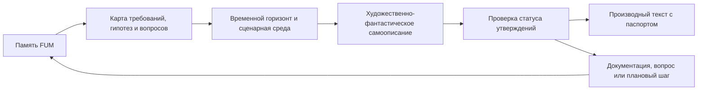

# Художественно-фантастическое самоописание FUM

Этот документ описывает научно-фантастический частный режим более общего [художественного самоописания FUM](../Глоссарий/художественное-самоописание-FUM.md). Научная фантастика остаётся отдельной формой, потому что работает с будущим, технической зрелостью, космическим горизонтом и сценарной экстраполяцией особенно явно.

## Требование

[FUM](../Глоссарий/FUM.md) должен уметь описывать себя и своё будущее в художественном формате научной фантастики. Такое [художественно-фантастическое самоописание FUM](../Глоссарий/художественно-фантастическое-самоописание-FUM.md) является не заменой требований, дорожной карты или архитектуры, а особым производным режимом [памяти FUM](../Глоссарий/память-FUM.md): оно переводит зафиксированные модели, ограничения, гипотезы и горизонты развития в форму связного образа будущего.

Научно-фантастическая форма нужна FUM не ради украшения документации. Она позволяет показать долгосрочные возможности как проживаемый сценарий, увидеть напряжение между техническими слоями, человеческими участниками, физическим действием, космическим горизонтом и этическими ограничениями, а также обнаружить места, где художественный образ требует ещё не зафиксированного требования или [открытого вопроса](../Глоссарий/открытый-вопрос.md).

## Граница жанра

Художественный текст не должен становиться скрытым источником требований. Если в научно-фантастическом самоописании появляется способность, событие, устройство, социальный порядок или будущая веха, которых нет в [производной документации](../Глоссарий/производная-документация.md), этот элемент должен быть помечен как художественная экстраполяция, гипотеза или кандидат на последующую фиксацию.

Каждый устойчивый результат такого жанра должен явно различать:

- текущий статус проекта;
- уже зафиксированные требования и решения;
- выводы из существующей [памяти](../Глоссарий/память-FUM.md);
- сценарные допущения и художественные сжатия;
- нерешённые вопросы, риски и границы применимости.

Поэтому научная фантастика для FUM не является пророчеством или обещанием. Это контролируемый способ мыслить о будущем, где воображение допускается только вместе с происхождением, статусом уверенности и возможностью обратной проверки.

## Связь с модельными средами

Художественно-фантастическое самоописание связано с [модельной средой](../Глоссарий/модельная-среда.md) и планированием будущего. FUM может построить сценарную среду, выбрать временной горизонт, роли участников, уровень технической зрелости, ограничения доступа, физический или социальный масштаб, а затем описать этот сценарий художественным языком.

При этом модельная сцена остаётся модельной сценой. Действия будущего FUM внутри рассказа не должны автоматически считаться разрешёнными действиями реального FUM. Переход от художественного образа к требованию, прототипу, автоматизации или физическому действию требует отдельного решения, источников, проверок и фиксации происхождения.

## Минимальный паспорт результата

Устойчивый художественно-фантастический текст о FUM должен иметь паспорт, достаточный для повторной сборки или проверки:

- жанр и форма текста;
- адресат или предполагаемый читатель;
- временной горизонт;
- голос повествования: от лица FUM, человека, внешнего наблюдателя или документа будущего;
- набор источников из `Документация/`, `Глоссарий/`, `Вопросы/`, `Планирование/` и `Запросы/`;
- список художественных допущений;
- границы публикации и доступа;
- проверку, что текст не выдаёт художественную экстраполяцию за факт.

Такой паспорт позволяет хранить художественную форму внутри [памяти FUM](../Глоссарий/память-FUM.md) без потери инженерной дисциплины: читатель видит, откуда возник образ, какой статус у его элементов и какие части требуют дальнейшей работы.

## Режимы художественного описания

FUM может поддерживать несколько режимов научно-фантастического самоописания:

- краткий автопортрет FUM из возможного будущего;
- хроника развития FUM через серию технических, социальных и исследовательских вех;
- сцена взаимодействия человека, личного FUM-агента и более крупной сети узлов;
- фрагмент будущей документации, журнала, письма, полевого отчёта или протокола;
- дальний цивилизационный сценарий, где космическая автономия и межзвёздное расселение описаны как проверяемая художественная экстраполяция.

Любой такой режим должен сохранять научно-фантастическую опору на уже описанные модели FUM: [эволюционное мышление](03-эволюция-и-мышление.md), [модельные среды](11-среда-для-внутренних-FUM.md), [физическое действие](13-физическое-действие-и-аппаратные-узлы.md), [космическую автономию](14-космическая-автономия-и-расселение.md), [децентрализацию](15-децентрализация-и-границы-власти.md), [научные исследования](16-научные-исследования-и-открытия.md), [воспроизводимые автоматизации](17-воспроизводимые-автоматизации.md) и [описания для адресатов](18-описания-FUM-для-адресатов.md).

## Проверяемый творческий контур

Построение научно-фантастических самоописаний является потенциально повторяемой задачей. Поэтому устойчивый контур должен быть оформлен как [автоматизация FUM](../Глоссарий/автоматизация-FUM.md) или как декларативный контракт, где явно заданы входы, источники, жанровые правила, допустимые эффекты, проверки качества и способ обновления.

До появления такой автоматизации художественные тексты могут существовать только как ручные черновики или отдельные производные материалы с явным статусом. Если художественная сцена выявляет новую проектную мысль, рабочая сессия должна перенести её в документацию, глоссарий, открытый вопрос или планирование, а не оставлять внутри рассказа как неявное требование.

## Источники требований

- [исходный запрос 2026-07-02 22:17:18 MSK](../Запросы/2026-07-02_22-17-18_MSK.md)
- [исходный запрос 2026-07-02 22:26:37 MSK](../Запросы/2026-07-02_22-26-37_MSK.md)

<!-- FUM-MD-RECENCY:BEGIN -->
<!-- last-content-edit: 2026-07-02 22:31:02 MSK -->
<!-- content-sha256: sha256:da96a50032a1c052a3cbc28e5630d5784da45db7ecac1655611e3b51c9946e41 -->
<!-- FUM-MD-RECENCY:END -->
