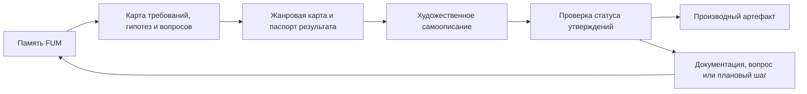

# Художественное самоописание FUM

## Требование

[FUM](../Глоссарий/FUM.md) должен уметь описывать себя через разные художественные и медиажанровые формы: прозу, стихи, музыкальные треки, сценарии фильмов, сцены, аудиовизуальные концепты, игровые зарисовки и другие формы, которые помогают человеку иначе пережить и понять одну и ту же [память FUM](../Глоссарий/память-FUM.md).

Такое [художественное самоописание FUM](../Глоссарий/художественное-самоописание-FUM.md) не заменяет требования, архитектуру, дорожную карту, адресные описания или проверки. Оно переводит уже зафиксированные модели, ограничения, гипотезы, открытые вопросы и горизонты развития в выразительную форму, где меняются голос, ритм, образ, сцена и медиа, но сохраняются происхождение утверждений и статус уверенности.

Художественная форма нужна не как украшение документации. Она позволяет увидеть FUM через разные способы человеческого восприятия: рассказ показывает причинность и выбор, стих сжимает смысл и напряжение, музыкальный трек задаёт ритм и эмоциональную траекторию, сценарий фильма выявляет роли, конфликт, действие и видимую сцену. Если форма раскрывает новую проектную мысль, эта мысль должна быть вынесена в документацию, глоссарий, открытый вопрос или планирование.

## Граница художественной формы

Художественный результат не должен становиться скрытым источником требований. Если в прозе, стихе, треке, сценарии или другой форме появляется способность, событие, устройство, социальный порядок, будущая веха или эмоционально убедительный образ, которых нет в [производной документации](../Глоссарий/производная-документация.md), этот элемент должен быть помечен как художественная экстраполяция, гипотеза, метафора или кандидат на последующую фиксацию.

Каждый устойчивый результат должен явно различать:

- текущий статус проекта;
- уже зафиксированные требования и решения;
- выводы из существующей памяти;
- жанровые допущения, метафоры и художественные сжатия;
- медиатехнические допущения, если создаётся звук, изображение, видео, раскадровка или иной медиаартефакт;
- нерешённые вопросы, риски и границы применимости.

Поэтому художественное самоописание FUM не является пророчеством, рекламным обещанием или доказательством готовности. Это контролируемый способ переносить память в разные формы восприятия, не теряя проверяемую обратную связь с источниками.

## Жанровая карта

Набор форм является открытым. Выражение "и так далее" в исходном требовании означает, что FUM должен поддерживать не закрытый список жанров, а расширяемую жанровую карту. Для каждой новой формы фиксируется, какую сторону FUM она раскрывает и какие искажения может внести.

Базовые режимы:

- проза - сцены, рассказы, эссе, фрагменты будущей хроники и повествовательные автопортреты FUM;
- стихи - ритмическое, образное и сжатое самоописание, где особенно важно отделять метафору от утверждения;
- музыкальный трек - текст, композиционный бриф, структура трека, звуковой образ, партитура, MIDI, аудиофайл или описание саунд-дизайна;
- сценарий фильма - сцены, диалоги, роли, видимое действие, монтажная логика, конфликт и границы между документальной опорой и драматургическим допущением;
- аудиовизуальный или игровой концепт - описание опыта, мира, механики взаимодействия, визуального языка и проверяемых источников.

Научная фантастика остаётся важным частным жанром этой карты. Она описана отдельно как [художественно-фантастическое самоописание FUM](../Глоссарий/художественно-фантастическое-самоописание-FUM.md), потому что работает с будущим, технической зрелостью, космическим горизонтом и сценарной экстраполяцией особенно явно.

## Минимальный паспорт результата

Устойчивое художественное самоописание FUM должно иметь паспорт, достаточный для повторной сборки, проверки и публикационного решения:

- форма и жанр результата;
- адресат или предполагаемый воспринимающий;
- цель самоописания;
- голос: от лица FUM, человека, внешнего наблюдателя, документа будущего, персонажа или смешанной формы;
- временной горизонт и сценарная среда, если они есть;
- набор источников из `Документация/`, `Глоссарий/`, `Вопросы/`, `Планирование/` и папок запросов в `Журнал/`;
- список художественных, жанровых и медиатехнических допущений;
- состав артефактов: текст, аудио, партитура, сценарий, раскадровка, промпты, исходники, метаданные или ссылки на сохранённые материалы;
- границы публикации, права, лицензии, применённые модели или сервисы, если они существенны;
- проверку, что результат не выдаёт художественную экстраполяцию за факт.

Для музыкальных треков и других нетекстовых форм паспорт особенно важен: если фактический аудиофайл, видео или изображение нельзя полностью воспроизвести локально, в памяти должен оставаться проверяемый слой - текстовый контракт, сценарий генерации, описание структуры, фикстуры, отчёт или другой публикационно чистый материал.

## Связь с описаниями и модельными средами

Художественное самоописание пересекается с [описаниями FUM для адресатов](../Глоссарий/описание-FUM-для-адресата.md), но не сводится к ним. Адресное описание адаптирует проект к аудитории, а художественная форма адаптирует его к способу восприятия. Один и тот же адресат может получить деловое описание, стихотворный автопортрет, сценарную сцену или музыкальный бриф, но все они должны быть связаны с одними источниками и одной проверкой статуса утверждений.

Художественное самоописание также связано с [модельной средой](../Глоссарий/модельная-среда.md): FUM может выбрать сцену, роли, временной горизонт, ограничения доступа, физический или социальный масштаб, а затем перевести эту сцену в нужную форму. Действия FUM внутри художественной сцены не считаются автоматически разрешёнными действиями реального FUM; переход от образа к требованию, прототипу, автоматизации или физическому действию требует отдельного решения и проверки.

## Проверяемый творческий контур

Построение художественных самоописаний является потенциально повторяемой задачей. Поэтому устойчивый контур должен быть оформлен как [автоматизация FUM](../Глоссарий/автоматизация-FUM.md) или как декларативный контракт, где явно заданы входы, источники, жанровые правила, допустимые эффекты, проверки качества и способ обновления.

До появления такой автоматизации художественные результаты могут существовать только как ручные черновики или отдельные производные материалы с явным статусом. Если художественная форма выявляет новую проектную мысль, рабочая сессия должна перенести её в документацию, глоссарий, открытый вопрос или планирование, а не оставлять внутри произведения как неявное требование.

## Источники требований

- [исходный запрос 2026-07-02 22:17:18 MSK](../Журнал/2026-07-02_22-17-18_MSK/запрос.md)
- [исходный запрос 2026-07-02 22:26:37 MSK](../Журнал/2026-07-02_22-26-37_MSK/запрос.md)

<!-- FUM-MD-RECENCY:BEGIN -->
<!-- last-content-edit: 2026-08-03 15:53:54 MSK -->
<!-- content-sha256: sha256:9a5f7e14a807fb43c3805a84a78b178c9b139f4200290b445b864c99f43b8d16 -->
<!-- FUM-MD-RECENCY:END -->
