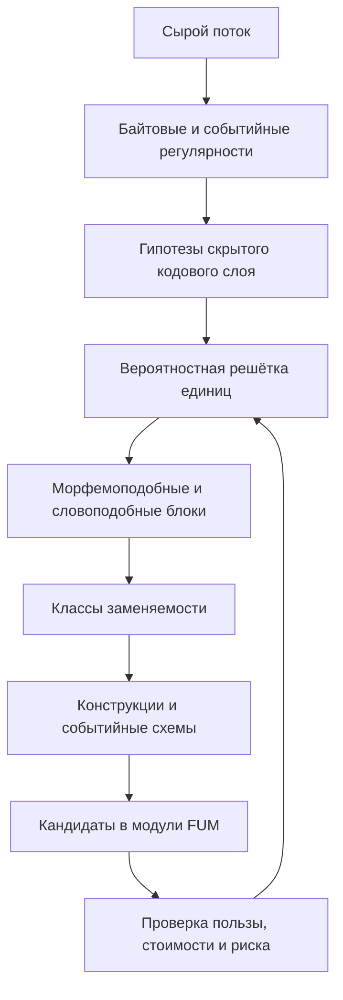

# [Потоковая самоструктуризация FUM](../Глоссарий/потоковая-самоструктуризация-FUM.md)

[FUM](../Глоссарий/FUM.md) должен уметь строить собственные единицы восприятия и мышления из потока опыта, а не только применять заранее заданный словарь токенов, схем, модулей или правил. Этот слой связывает [обобщённый поиск повторяющихся последовательностей](../Глоссарий/обобщённый-поиск-повторяющихся-последовательностей.md), [память FUM](../Глоссарий/память-FUM.md), [модульную архитектуру](../Глоссарий/модуль-FUM.md) и [нейронную гиперсеть FUM](../Глоссарий/нейронная-гиперсеть-FUM.md): повторяемые и полезные структуры сначала возникают как статистические гипотезы, затем становятся латентными единицами, потом [паттернами памяти](../Глоссарий/паттерн-памяти.md), а после проверки могут дать основание для роста новых модулей.

Главный принцип: единица удерживается не потому, что её заранее назвал человек, а потому, что она улучшает предсказание, сжатие, переносимость, действие или проверяемость при допустимой стоимости. Поэтому байт, скрытая кодовая единица, графемоподобный блок, морфемоподобный фрагмент, словоподобная единица, грамматический класс, фразовая конструкция, событийный фрейм и рабочий workflow отличаются не типом происхождения, а уровнем абстракции и полезностью в дальнейшей работе.

## Не статическая LLM

[FUM](../Глоссарий/FUM.md) не должен описываться как одна большая самоизменяющаяся LLM, которая в процессе работы бесконтрольно переписывает собственные веса. Более реалистичная и проверяемая форма - устойчивый backbone, быстрые внешние слои памяти, средние адаптивные модули и медленная консолидация.

В этой модели фиксированная сильная модель может оставаться важным компонентом, но она не равна всему [FUM](../Глоссарий/FUM.md). Потоковая самоструктуризация добавляет вокруг неё структурный контур: быстрый индекс повторяемости, [самотокенизацию FUM](../Глоссарий/самотокенизация-FUM.md), выведение абстракций, контроллер роста, проверку полезности, журнал изменений и откат. Так проект сохраняет отличие между обычным дообучением модели, внешней памятью, агентским циклом и настоящей архитектурной пластичностью.

## [Иерархия функций и данных](../Глоссарий/иерархия-функций-и-данных-FUM.md)

Устойчивость [FUM](../Глоссарий/FUM.md) должна опираться на различение функции и данных. Данные меняются быстрее: новые входы, контексты, трассы, ошибки, наблюдения, локальные статистики и пользовательские запросы поступают постоянно. Тело функции меняется медленнее: правило сегментации, предиктор продолжения, агентская политика, адаптер, эксперт, workflow или нейросетевая карта должны выдерживать серию входов и проверок, прежде чем быть изменёнными.

При этом тело функции само может стать данными для более базовой функции. Обучение классической нейросети является частным примером: процедура обучения обрабатывает датасет и порождает сеть, которая затем обрабатывает новые входы. Для [FUM](../Глоссарий/FUM.md) такая схема должна стать многоуровневой: быстрые данные обновляют статистику, статистика предлагает абстракции, абстракции предлагают модули, контроллер пластичности меняет модули, а более медленный слой проверяет, нужно ли менять сам контроллер.

Минимальный механизм можно описать как повторяемую тройку:

```text
уровень N: функция F_N обрабатывает данные D_N
трасса T_N фиксирует входы, выходы, ошибки, стоимость и пользу
уровень N-1 решает, менять ли D_N, параметры F_N, тело F_N или правила отбора
```

Практическая единица такого механизма хранит тело преобразования, паттерн применимых входов, состояние, историю применения, оценку пользы, меру устойчивости и допустимый способ изменения. Её минимальный цикл можно свести к четырём операциям: применить преобразование, оценить результат, изменить подходящий уровень и закрепить удачный вариант. Выбор уровня изменения должен быть экономическим: полезность изменения считается вместе со стоимостью изменения, штрафом нестабильности и штрафом сложности.

Такой механизм не требует сразу строить сложную самоизменяющуюся систему. В первом прототипе достаточно различать данные задачи, тело локальной функции, параметры агента и мета-функцию отбора, которая по наблюдаемой трассе решает, какой уровень менять. Это позволит искать решения по принципу устойчивых функций и более быстрых данных, не смешивая обычную обработку входа, обучение, runtime-мутацию и архитектурную перестройку.

## Нейросеть как среда для агентов

На нейросеть в [FUM](../Глоссарий/FUM.md) можно смотреть как на карту или [модельную среду](../Глоссарий/модельная-среда.md), по которой движутся агенты. В простейшем варианте такая карта состоит из арифметических вычислителей: узел принимает локальный сигнал, применяет элементарное преобразование и открывает соседние переходы. Агент в этой рамке не является всей нейросетью; он является интерпретатором, который выбирает маршрут, порядок чтения и способ применения локальных вычислений.

Такой взгляд добавляет runtime-слой изменчивости. Одна и та же сеть может предъявляться нескольким агентам одинаково по структуре, но по-разному по смыслу: один агент видит в узлах арифметические операции, другой - признаки, третий - правила маршрутизации, четвёртый - кандидатов в [модули FUM](../Глоссарий/модуль-FUM.md). Различие возникает не только из весов самой сети, но и из настроек агента, его памяти, бюджета, целей, допустимых действий и правил интерпретации.

Веса, активации и свойства рёбер в таком режиме являются не только числовыми параметрами, но и объектами среды для агентов. Один и тот же вес может быть маршрутом, сопротивлением, ресурсом, следом, правилом перехода, маркером зоны или триггером мутации в зависимости от профиля агента. Поэтому смысл сетевого участка не считается единственным заранее заданным свойством веса; он возникает во взаимодействии сетевой среды, входа, агента и правил чтения.

Настройки агента могут иметь наследуемый или генетический статус. Это означает, что эволюционный цикл переносится не только в обучение нейросети и не только в медленную [контролируемую нейропластичность FUM](../Глоссарий/контролируемая-нейропластичность-FUM.md), но и в исполнение: агенты с разными параметрами обхода, внимания, риска, глубины, мутаций и критериев полезности конкурируют на одной сетевой среде. Удачные параметры могут закрепляться как [наработки](../Глоссарий/наработка.md), а неудачные ослабляться или уходить в архив опыта.

Минимальная формализация такого слоя описывает среду как граф узлов и рёбер с состояниями, а исполнение - как ограниченную динамику популяции агентов. У каждого агента есть позиция, внутреннее состояние, наследуемый профиль интерпретации, энергетический или вычислительный бюджет, политика поведения и правила завершения. Тогда результат инференса появляется не как единственный прямой проход `y = F(x)`, а как итог нескольких наблюдаемых шагов: агенты читают локальное окружение, выбирают действия, меняют своё состояние или состояние среды, перемещаются, получают оценку, могут порождать потомков, мутировать или исчезать.

Для безопасности это различие существенно. Изменение интерпретатора, который ходит по сети, дешевле и обратимее, чем изменение основной модели или её медленных модулей. Поэтому первые прототипы должны проверять агентное чтение сетевой среды на малых графах и простых вычислителях: с трассой маршрута, настройками агента, происхождением результата, критерием отбора и возможностью повторить тот же эксперимент.

Отдельная граница управляемости - внутренняя экономика популяции. Если агентам разрешено размножаться, мутировать, занимать ресурсы или менять среду, прототип должен иметь ограничение числа агентов, числа шагов, бюджета записи, критерий локальной и глобальной полезности, способ извлечения итогового ответа и защиту от паразитических стратегий. Иначе runtime-эволюция может начать оптимизировать собственное выживание, а не задачу [FUM](../Глоссарий/FUM.md).

## Слои рождения единиц

Нижний входной слой может начинаться с сырого байтового или событийного потока. [FUM](../Глоссарий/FUM.md) не обязан заранее знать, что поток является `UTF-8`, русским текстом, логом, кодом, интерфейсным событием или трассой инструмента. Он должен уметь выдвигать несколько конкурирующих гипотез о том, какие скрытые единицы делают поток лучше предсказуемым и компактным.

Типичная лестница выглядит так:

```text
сырой поток
байтовые и событийные регулярности
скрытые кодовые единицы
графемоподобные единицы
морфемоподобные единицы
словоподобные блоки
классы взаимозаменяемости
конструкции и фразы
событийные схемы
модули, адаптеры и эксперты
```

## Опорные структурные элементы

Сырой входной поток для [FUM](../Глоссарий/FUM.md) не следует понимать как полностью бесформенную материю. Когда человек или LLM воспринимает внешний неструктурированный сигнал, компьютер обычно сохраняет его уже в цифровой форме, которая в той или иной степени пригодна для структурирования: как сообщение, файл, поток событий, исходный код, TeX-источник, разметку, журнал действий, дерево каталогов или другой носитель с явными и неявными границами.

Особенно это заметно для порождаемой информации. Программный код, Markdown, TeX-документ, спецификация, таблица или сценарий действий могут сразу сохраняться так, чтобы будущая обработка видела не только линейную последовательность символов, но и простые структурные элементы: команды, блоки, аргументы, имена, зависимости, разделы, ссылки, повторяющиеся шаблоны и происхождение. Поэтому [память FUM](../Глоссарий/память-FUM.md) должна поддерживать не только обнаружение структуры "с нуля", но и сознательное сохранение уже известных элементарных форм, которые помогают алгоритмически доструктурировать дальнейший поток.

Такие элементы не являются жёсткой внешней онтологией. Они работают как проверяемые опоры и priors для самоструктуризации: морфемы, словоформы вместе с парадигмами, согласуемые словосочетания, предложения, синтаксические формы кода, TeX-команды и другие локальные конструкции могут заранее попадать в память как кандидаты на единицы разбора. Если они повышают предсказание, сжатие, переносимость или качество действия, система усиливает их; если они мешают новому разбору, слишком дороги или переобобщают поток, они ослабляются, уточняются или удаляются.

При закреплении такая опора становится [структурирующим оператором FUM](../Глоссарий/структурирующий-оператор-FUM.md): не только фрагментом для хранения, но и двунаправленной единицей формы. В восприятии она помогает перевести поток в структуру, а в порождении - выбрать форму, которая снова может стать наблюдаемым потоком. Поэтому слово с парадигмой, согласовательный шаблон, TeX-команда, конструкция программы или документный блок должны хранить не только имя, но и способ распознавания, способ порождения и связи с другими элементами.

Память таких операторов должна быть иерархической, но не обязана быть чистым деревом. Технически она ближе к стратифицированному графу: один низкий элемент может участвовать в нескольких синтаксических, семантических и дискурсивных структурах, а рёбра фиксируют объяснение, порождение, обобщение, перевод, уточнение и конфликт. Низкоуровневый оператор может быть привязан к конкретному языку, письменности или формальному синтаксису: например, к русскому окончанию, суффиксу, чередованию, связи кириллической и латинской записи или форме записи TeX-команды. Более высокий оператор может описывать уже не поверхностную форму, а семантическую связь между конструкциями: роль участника события, отношение определения и определяемого, переводимый шаблон, аргументную структуру или другой смысловой узел, который способен связывать русские и английские формы между собой.

Межъязыковое связывание в такой памяти проходит через промежуточные семантические структуры, а не через прямое равенство слов или форм. Русская конструкция и английская конструкция могут реализовывать один и тот же фрейм события, роль участника или состояние разными морфосинтаксическими средствами; при этом [FUM](../Глоссарий/FUM.md) должен сохранять языково-специфичные признаки, неоднозначности и потери перевода как отдельные остатки, а не стирать их ради слишком гладкого общего узла.

Минимальный профиль такого оператора включает каноническую форму, набор наблюдаемых вариантов, признаки или параметры, условия распознавания, правила порождения, ограничения, цену применения, доверие, положительные и отрицательные примеры, связи с другими элементами, уровень абстракции, происхождение, версию и историю подтверждений. Такой профиль позволяет [FUM](../Глоссарий/FUM.md) задавать к новому потоку практические вопросы: какие известные формы уже объясняют фрагмент, какого элемента не хватает, стоит ли создать новый оператор и как он поможет в будущих разборах и порождениях.

Память структурирующих операторов является не побочным словарём, а минимальным ядром, с которого можно начинать реализацию [FUM](../Глоссарий/FUM.md). Она хранит предварительные знания в проверяемой форме: оператор может быть выведен из сырого потока, задан человеком, предложен LLM или уточнён автоматизацией, но остаётся рабочей гипотезой, пока не показывает выигрыш описания потока. Поэтому самоструктуризация не противопоставляет ручное и автоматическое происхождение операторов; она сравнивает их по способности давать компактное, переносимое и пригодное для действия описание.

Если при анализе входного потока не хватает структурирующего элемента, это само по себе не доказывает, что вход корректен и система обязана вырастить новый оператор. Такой сигнал должен рассматриваться двояко: как возможная ошибка, шум, неполнота или неточность входа и как возможное обнаружение новой устойчивой формы. Решение о пополнении памяти операторов принимает проверочный контур: он оценивает, уменьшает ли новый оператор описание потока, улучшает ли предсказание и порождение, не дублирует ли уже известный оператор и не превращает ли случайную ошибку в устойчивое правило.

Необъяснённая часть потока должна сохраняться не как пустой провал разбора, а как диагностический остаток. В нём фиксируются фрагмент, частичные совпадения, неудавшиеся операторы, тип конфликта, конкурирующие объяснения и текущий статус: шум, ошибка, редкий частный случай, гипотеза нового оператора, уточнение старого оператора или отложенная неоднозначность. Поэтому LLM в этом контуре выступает не источником истины, а генератором кандидатов, которые затем проверяются по сжатию, согласованности, повторной применимости и обратному порождению.

В этой роли структурирующие операторы похожи на механизм типизации в языках программирования. Они не обязаны заранее описывать всю реальность, но дают именованные, проверяемые и комбинируемые формы, через которые поток становится короче для записи, понятнее для LLM и безопаснее для дальнейших преобразований. Чем лучше операторная память объясняет входной поток при меньшей цене, тем больше полезного материала помещается в контекстное окно без потери происхождения и границ применимости.

Компактное описание потока должно различать режимы восстановимости. Для кода, TeX, математических доказательств, данных, логов и юридически значимых документов нужен полностью восстановимый режим: структура вместе с остатком и ссылками на исходные фрагменты должна позволять проверить или восстановить исходный поток. Для резюме, диалога, планирования и долговременной смысловой памяти допустим смысловой режим, где сохраняется компактная структура и трассировка к сырью, но не каждая поверхностная деталь. Оба режима нужны одной и той же цели: сжать поток для мышления, не потеряв возможность проверки.

Эта лестница не должна быть жёсткой. Один участок потока может иметь несколько разборов одновременно: как байтовая цепочка, как скрытая кодовая единица, как словоподобный блок, как часть морфологического шаблона и как элемент конструкции. Поэтому внутреннее представление ближе к вероятностной многоуровневой решётке, чем к одной окончательной иерархии.



## [Самотокенизация FUM](../Глоссарий/самотокенизация-FUM.md)

Самотокенизация означает, что токены и границы не задаются внешним препроцессором как окончательная истина. Они возникают как гипотезы о выгодной сегментации потока. Пробел может быть сильным сигналом границы в одном домене и слабым сигналом в другом. Кодовая точка Unicode может быть полезным уровнем, но не обязана совпадать с графемой или смысловой единицей. Слово может быть не сущностью, а режимом сжатия: достаточно автономным блоком, который заменяется другими блоками в похожих контекстах и участвует в более крупных конструкциях.

Для русского текста это особенно важно. [FUM](../Глоссарий/FUM.md) должен видеть не только соседство словоформ, но и совместную вариативность окончаний, согласования и чередований. Фрагменты вроде `большой дом`, `большого дома`, `большим домом` должны давать сигнал не только о повторении слов, но и о согласованной системе форм. В предельной версии система выводит морфемоподобные единицы, основы, окончания и классы употреблений без заранее заданного морфологического словаря.

Такой подход не означает полного отсутствия предпосылок. Встроенными остаются общие критерии: предсказывать продолжение, сжимать поток, экономить ресурсы, сохранять полезные абстракции, удалять бесполезные и учитывать происхождение. Но лингвистические сущности не считаются обязательными аксиомами: они должны становиться внутренними единицами только после выигрыша в предсказании, сжатии, переносимости или действии.

## [Суффиксно-предиктивная память FUM](../Глоссарий/суффиксно-предиктивная-память-FUM.md)

Для самоструктуризации нужен быстрый слой, который видит повторяющиеся контексты переменной длины. Полное суффиксное дерево слишком буквальное и дорогое: оно хорошо ищет точные подстроки, но плохо подходит как единственный субстрат живой памяти. Для [FUM](../Глоссарий/FUM.md) точнее требовать ограниченный вероятностный суффиксно-контекстный лес.

Узел такой памяти хранит не только частоту. Минимальный профиль узла включает последовательность или шаблон, позиции происхождения, счётчик, давность, распределение продолжений, энтропию, выигрыш предсказания, выигрыш сжатия, ошибку основной модели на этом контексте, связь с наградой или ущербом, уровень абстракции, доверие к источникам, бюджет хранения и ссылку на возможный нейронный модуль.

Контексты должны отбираться. [FUM](../Глоссарий/FUM.md) не должен хранить всё подряд: это ведёт к комбинаторному росту. Контекст сохраняется или продвигается выше, если он достаточно часто встречается, предсказывает будущее лучше родительского контекста, даёт сжатие, объясняет ошибку, связан с важным результатом или является редкой критичной аномалией. Устаревшие, вредные, слишком дорогие или дублирующие узлы сливаются, ослабляются или удаляются.

Важная граница: точное совпадение формы не равно пониманию. Поэтому суффиксно-предиктивная память должна поддерживать не только буквальные пути, но и приблизительные совпадения, переменные слоты, антиунификацию, семантические кластеры, временную терпимость, нормализацию и связь с embedding-представлениями. Иначе система будет плодить тысячи частных веток вместо одного переносимого правила.

## Выведение абстракций

Абстракции возникают из двух дополняющих сигналов. Синтагматический сигнал показывает, какие элементы устойчиво соседствуют. Парадигматический сигнал показывает, какие элементы могут занимать один и тот же слот. Если разные элементы появляются в похожих окружениях, [FUM](../Глоссарий/FUM.md) может вывести класс; если классы устойчиво сочетаются, возникает конструкция; если конструкция ведёт себя как единый внешний элемент, она может стать новым символом более высокого уровня.

Антиунификация превращает похожие конкретные пути в шаблоны с переменными слотами. Например, семейство конкретных фрагментов может дать шаблон `X дом`, другое семейство - `красный Y`, а последующее сопоставление - более общий шаблон `X Y`, где `X` и `Y` уже не произвольные фрагменты, а статистически устойчивые классы. Для [FUM](../Глоссарий/FUM.md) это важно не только в языке: та же логика применима к коду, логам, интерфейсным сценариям, роботическим траекториям и последовательностям действий агента.

Критерий принятия абстракции должен быть экономическим и проверочным. Новая единица, класс или конструкция удерживается, если выигрыш описания данных, предсказания и последующего действия превышает стоимость правила, исключений, хранения, вычисления и риска переобобщения. Поэтому частота сама по себе не является достаточной: частые служебные фрагменты могут быть бесполезны, а редкие предаварийные, безопасностные или медицинские сигналы могут быть критически важны.

## Контроллер пластичности

[Контролируемая нейропластичность FUM](../Глоссарий/контролируемая-нейропластичность-FUM.md) переводит полезные узлы памяти в архитектурные изменения. Сначала контекст может существовать как статистика и распределение продолжений. Затем он получает латентный символ или embedding. После подтверждения пользы для него может появиться адаптер, эксперт, специализированный предиктор, детектор аномалии, правило маршрутизации или другой [модуль FUM](../Глоссарий/модуль-FUM.md). Если модуль долго остаётся полезным, он может быть консолидирован в более медленную память; если вреден или устарел, он удаляется, сливается или архивируется.

Переходы должны проходить через явные условия:

- контекст имеет достаточную поддержку или редкую критическую важность;
- распределение продолжений отличается от родительского контекста;
- текущая модель стабильно ошибается на этом участке;
- новая единица уменьшает описание данных или повышает качество действия;
- источник и доверие позволяют использовать паттерн без загрязнения памяти;
- бюджет памяти, задержки и вычислений допускает новый модуль;
- проверка на удержанных данных, replay или sandbox не показывает деградации.

Такой контроллер делает рост сети не обратной операцией pruning, а отдельным управляемым процессом. Новые части входят в уже специализировавшуюся систему, поэтому им нужны маршрутизация сигналов, обучение, проверка на отсутствие вреда и механизм отката. Иначе новые элементы могут стать мёртвыми, получить слабый обучающий сигнал, вызвать дрейф или раздуть архитектуру.

## Темпы памяти

Практичная [память FUM](../Глоссарий/память-FUM.md) должна иметь несколько темпов обновления.

Быстрая память хранит недавние и частые повторения: суффиксно-предиктивные леса, кэши, счётчики, локальные решётки сегментации и временные статистические узлы. Она быстро реагирует, но не обязана немедленно менять основные модели.

Средняя память хранит проверяемые специализированные формы: адаптеры, LoRA-подобные модули, экспертов, локальные ансамбли, правила маршрутизации и устойчивые [паттерны памяти](../Глоссарий/паттерн-памяти.md). Она уже влияет на вычисление, но должна оставаться наблюдаемой и заменяемой.

Медленная память хранит консолидированные структуры: основную модель, устойчивые [модули](../Глоссарий/модуль-FUM.md), документацию, проверенные автоматизации, долговременные [наработки](../Глоссарий/наработка.md) и правила доступа. Перенос из быстрых слоёв в медленные требует replay, distillation, проверки на удержанных потоках, журнала происхождения и возможности отката.

## Безопасность и ограничения

Потоковая самоструктуризация несёт отдельные риски. Главный риск - конфликт стабильности и пластичности: система должна учить новое, но не разрушать старое. Слишком стабильная система перестаёт адаптироваться, слишком пластичная теряет память и доверие.

Второй риск - потеря пластичности: даже без явного забывания система может перестать эффективно учить новое из-за застывших маршрутов и старых представлений. Поэтому [FUM](../Глоссарий/FUM.md) должен учитывать не только качество текущих ответов, но и способность сохранять обучаемость.

Третий риск - отравление и навязанный рост. Если повторение создаёт структуру, злоумышленник или шумный источник может многократно подать вредный паттерн и вырастить нежелательный модуль. Нужны карантин новых паттернов, веса доверия к источникам, sandbox-консолидация, происхождение, ручные или автоматические подтверждения для опасных областей и проверяемый откат.

Четвёртый риск - аппаратная и эксплуатационная цена. Нерегулярные структуры, runtime-ветвления, постоянное rewiring и множество мелких экспертов могут быть логически экономны, но плохо ложиться на GPU и увеличивать задержки. Поэтому критерии роста должны учитывать не только качество модели, но и реальную стоимость выполнения.

## Минимальный прототип

Первый прототип не должен пытаться построить полноценный саморастущий мозг. Достаточно проверить связку:

```text
backbone model
+ multi-level prediction suffix forest
+ segmentation lattice
+ abstraction/growth controller
+ adapter or expert registry
+ replay/check/rollback loop
```

Для проверки [иерархии функций и данных FUM](../Глоссарий/иерархия-функций-и-данных-FUM.md) нужен ещё более малый контур: чистая функция над входными данными, набор параметров, наблюдаемая трасса ошибок и пользы, а также мета-функция, которая выбирает один из вариантов изменения: обновить данные, изменить параметры, заменить тело функции или оставить слой неизменным. Такой прототип должен показывать, что устойчивость возникает не из запрета изменений, а из различения уровней, на которых изменение допустимо.

Для документационного прототипа [FUM](../Глоссарий/FUM.md) ближайшая проверка может быть ещё проще: взять небольшой поток запросов, правок, логов или текстов, построить ограниченный суффиксно-предиктивный индекс, показать кандидаты в единицы и абстракции, оценить их по предсказанию и сжатию, затем оформить отчёт о том, какие из них могли бы стать [паттернами памяти](../Глоссарий/паттерн-памяти.md), автоматизациями или модулями.

Первый прототип памяти структурирующих операторов должен быть ещё уже: взять малый поток, набор заранее заданных операторов, режим LLM-предложения новых операторов и проверку отказов. Он должен сравнивать свободный разбор с разбором через операторную память, фиксировать выигрыш сжатия, выигрыш предсказания, качество обратного порождения, цену хранения оператора, диагностические остатки, конфликты, статусы кандидатов и случаи, где недостающий элемент скорее указывает на ошибочный вход, чем на новую полезную форму. Отдельные фикстуры должны различать полностью восстановимый разбор кода или TeX, смысловое сжатие диалога или планового текста, низкоуровневые языково-специфичные операторы для окончаний, суффиксов и вариантов записи, а также более высокоуровневые семантические операторы, связывающие русские и английские конструкции через общий фрейм с явными языковыми остатками и потерями.

Отдельный минимальный прототип должен проверить нейросеть как среду для агентов: построить малый граф арифметических вычислителей, задать несколько агентов с разными наследуемыми параметрами интерпретации, сохранить трассы перемещения и сравнить, какие параметры дают полезные результаты без изменения самой сетевой карты.

Такой прототип должен быть воспроизводимым, локальным и не требовать секретов. Если он начинает менять поведение агента, сначала нужна TDD-проверка контрактов: входная задача, начальный граф, начальная популяция, наследуемые параметры, ограничение бюджета, ожидаемая трасса, критерии размножения и удаления, отчёт происхождения и отказные режимы.

## Связь с архитектурой

[Потоковая самоструктуризация FUM](../Глоссарий/потоковая-самоструктуризация-FUM.md) уточняет несколько уже описанных слоёв. Для [обобщённого поиска повторяющихся последовательностей](../Глоссарий/обобщённый-поиск-повторяющихся-последовательностей.md) она задаёт конкретный механизм: не только список повторов, но и многоуровневый предиктивный лес с оценкой пользы. Для [модульной архитектуры](../Глоссарий/модуль-FUM.md) она объясняет, откуда берутся новые кандидаты в модули. Для [эволюционного мышления](../Глоссарий/обобщённый-дарвиновский-алгоритм.md) она задаёт нижний контур изменчивости и отбора внутри самого потока опыта. Для [нейронной гиперсети FUM](../Глоссарий/нейронная-гиперсеть-FUM.md) она показывает, как внутренние связи могут расти не произвольно, а из повторяемых, проверяемых и полезных структур.

## Источники требований

- [исходный запрос 2026-07-06 10:05:34 MSK - Интегрировать содержимое ChatGPT диалога](../Запросы/2026-07-06_10-05-34_MSK_интегрировать-содержимое-chatgpt-диалога.md)
- [исходный запрос 2026-07-06 10:24:52 MSK - Описать нейросеть как среду агентов](../Запросы/2026-07-06_10-24-52_MSK_описать-нейросеть-как-среду-агентов.md)
- [исходный запрос 2026-07-06 10:51:33 MSK - Интегрировать диалог ChatGPT pro](../Запросы/2026-07-06_10-51-33_MSK_интегрировать-диалог-chatgpt-pro.md)
- [исходный запрос 2026-07-06 14:49:39 MSK - Описать иерархию функций и данных](../Запросы/2026-07-06_14-49-39_MSK_описать-иерархию-функций-и-данных.md)
- [исходный запрос 2026-07-06 15:00:09 MSK - Уточнить иерархию функций и данных](../Запросы/2026-07-06_15-00-09_MSK_уточнить-иерархию-функций-и-данных.md)
- [исходный запрос 2026-07-08 09:10:55 MSK - Описать структурные элементы самоструктуризации](../Запросы/2026-07-08_09-10-55_MSK_описать-структурные-элементы-самоструктуризации.md)
- [исходный запрос 2026-07-08 09:21:09 MSK - Уточнить структурные элементы FUM](../Запросы/2026-07-08_09-21-09_MSK_уточнить-структурные-элементы-FUM.md)
- [исходный запрос 2026-07-08 10:18:09 MSK - Закрепить память структурирующих операторов](../Запросы/2026-07-08_10-18-09_MSK_закрепить-память-структурирующих-операторов.md)
- [исходный запрос 2026-07-08 10:34:09 MSK - Добавить источник памяти структурирующих операторов](../Запросы/2026-07-08_10-34-09_MSK_добавить-источник-памяти-структурирующих-операторов.md)
- [исходный запрос 2026-07-08 10:54:49 MSK - Уточнить уровни структурирующих операторов](../Запросы/2026-07-08_10-54-49_MSK_уточнить-уровни-структурирующих-операторов.md)
- [исходный запрос 2026-07-08 11:06:21 MSK - Связать уточнение памяти структурирующих операторов](../Запросы/2026-07-08_11-06-21_MSK_связать-уточнение-памяти-структурирующих-операторов.md)

## Внешний материал

- [Динамическая нейросеть](../Источники/URL/https/chatgpt.com/share/6a4b5320-48c4-83ed-829e-e856d313b1fb/динамическая-нейросеть.md)
- [Индекс источника](../Источники/URL/https/chatgpt.com/share/6a4b5320-48c4-83ed-829e-e856d313b1fb/source-index.md)
- [Отчёт об извлечении](../Источники/URL/https/chatgpt.com/share/6a4b5320-48c4-83ed-829e-e856d313b1fb/extraction-report.md)
- [Оформленный диалог об эволюции агентов в сетях](../Источники/URL/https/chatgpt.com/share/6a4b5e1a-f1e0-83eb-9288-df45821b1f2a/evolyutsiya-agentov-v-setyakh.md)
- [Индекс источника](../Источники/URL/https/chatgpt.com/share/6a4b5e1a-f1e0-83eb-9288-df45821b1f2a/source-index.md)
- [Отчёт об извлечении](../Источники/URL/https/chatgpt.com/share/6a4b5e1a-f1e0-83eb-9288-df45821b1f2a/extraction-report.md)
- [FUM i ustojchivost'](../Источники/URL/https/chatgpt.com/share/6a4b9890-148c-83eb-bda3-8ac1ac836d02/fum-i-ustojchivost.md)
- [Индекс источника](../Источники/URL/https/chatgpt.com/share/6a4b9890-148c-83eb-bda3-8ac1ac836d02/source-index.md)
- [Отчёт об извлечении](../Источники/URL/https/chatgpt.com/share/6a4b9890-148c-83eb-bda3-8ac1ac836d02/extraction-report.md)
- [Strukturirovannye elementy FUM](../Источники/URL/https/chatgpt.com/share/6a4dec02-7e54-83eb-b2cb-798dca93d239/strukturirovannye-elementy-fum.md)
- [Индекс источника](../Источники/URL/https/chatgpt.com/share/6a4dec02-7e54-83eb-b2cb-798dca93d239/source-index.md)
- [Отчёт об извлечении](../Источники/URL/https/chatgpt.com/share/6a4dec02-7e54-83eb-b2cb-798dca93d239/extraction-report.md)
- [Ветка · Strukturirovannye elementy FUM](../Источники/URL/https/chatgpt.com/share/6a4dfd46-c6e4-83eb-8f27-8c91e25d6e01/ветка-strukturirovannye-elementy-fum.md)
- [Индекс источника](../Источники/URL/https/chatgpt.com/share/6a4dfd46-c6e4-83eb-8f27-8c91e25d6e01/source-index.md)
- [Отчёт об извлечении](../Источники/URL/https/chatgpt.com/share/6a4dfd46-c6e4-83eb-8f27-8c91e25d6e01/extraction-report.md)

<!-- FUM-MD-RECENCY:BEGIN -->
<!-- last-content-edit: 2026-07-08 11:14:15 MSK -->
<!-- content-sha256: sha256:f0f6ae0307a5ef49589a4213d8eacda343390f92e3897bf87ec7c3e9cbbecf43 -->
<!-- FUM-MD-RECENCY:END -->
