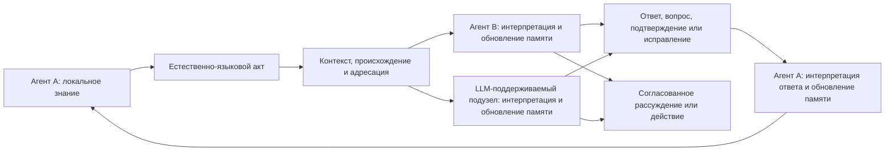

# Естественный язык и [синхронизация знаний FUM](../Глоссарий/естественно-языковая-синхронизация-знаний-FUM.md)

Естественный язык является для [FUM](../Глоссарий/FUM.md) не только пользовательским интерфейсом и не только источником отдельных семантических ролей. Он рассматривается как уже сложившийся у людей язык синхронизации знаний между автономными участниками с разными телами, памятью, опытом, целями и точками зрения. Через высказывания, ответы и исправления участники не передают друг другу полное внутреннее состояние, а делают значимую часть знания взаимно восстанавливаемой и пригодной для совместного мышления и действия.

Из этого следует архитектурный принцип: ИИ-агент должен быть построен по образцу такой сети. [FUM](../Глоссарий/FUM.md) должен уметь быть её участником рядом с людьми и другими агентами, а собственное устройство организовывать рекурсивно как сеть узлов с локальными состояниями, языковым взаимодействием, общей и раздельной памятью, обратной связью и механизмами исправления рассогласований. LLM естественно включается в этот контур как механизм понимания и порождения языка, но устойчивый агентский узел дополнительно требует памяти, происхождения, идентичности, агентского цикла, инструментов и границ доступа.

## Весь язык, а не отдельные местоимения

Формы `я`, `ты`, `мы`, `вы`, `они` наглядно показывают относительные роли участников, но являются только малой частью языковой системы. Для синхронизации знаний работают совместно:

- словарь и именование, позволяющие выделять объекты, процессы, свойства и отношения;
- морфология и синтаксис, связывающие участников, события, признаки, обстоятельства и вложенные высказывания;
- время, вид и порядок повествования, позволяющие согласовывать прошлое, настоящее, будущее и незавершённость;
- модальность, отрицание, вопрос, побуждение, условность и возможность, различающие факт, гипотезу, желание, обязательство, запрет и альтернативу;
- причинность, объяснение, доказательность, степень уверенности и происхождение сведений;
- дейксис, референция, принадлежность, цитирование и косвенная речь, связывающие содержание с участниками и контекстами;
- определение, обобщение, пример, аналогия, метафора и повествование, переносящие структуры знания между областями;
- очередность реплик, подтверждение понимания, уточнение, переформулирование, возражение и исправление, которые обнаруживают и уменьшают рассогласование.

[Ролевая семантика сетевого взаимодействия FUM](../Глоссарий/ролевая-семантика-сетевого-взаимодействия-FUM.md) поэтому является частным слоем общей [естественно-языковой синхронизации знаний FUM](../Глоссарий/естественно-языковая-синхронизация-знаний-FUM.md), а не её полным описанием.

## Что означает синхронизация знаний

У каждого участника сети остаётся собственная память и собственная интерпретация. Языковой акт создаёт наблюдаемое событие, по которому адресат обновляет локальную модель содержания, говорящего, ситуации и ожидаемого продолжения. Ответ показывает часть результата этого обновления: подтверждает понимание, проявляет расхождение, задаёт вопрос, исправляет ошибку, предлагает более точную формулировку или переводит согласованное знание в действие.

Знания считаются синхронизированными не тогда, когда внутренние состояния стали одинаковыми, а когда достигнута достаточная для задачи взаимная согласованность. Участники должны уметь:

- восстановить значимые утверждения и их модальность;
- различить известное, предполагаемое, спорное и неизвестное;
- связать утверждение с источником, временем, адресатами и контекстом;
- предсказать ожидаемое совместное действие или продолжение рассуждения;
- обнаружить существенное расхождение и запустить цикл уточнения;
- сохранить допустимые различия, не выдавая их за согласие.

Такая синхронизация по природе локальна, частична и итеративна. В сети нет требования к мгновенному глобальному состоянию: знания распространяются с задержками, проходят через разные контексты, могут конфликтовать, уточняться и устаревать. [FUM](../Глоссарий/FUM.md) должен хранить не только итоговую формулировку, но и путь согласования, происхождение, версии, уверенность, известные потери и открытые расхождения.

## LLM как участник сети

LLM уже обучена работать с естественным языком и поэтому может естественно участвовать в той же среде общения, что и человек. Она способна интерпретировать высказывания, продолжать дискурс, объяснять, переформулировать, задавать вопросы и порождать ответы. Это делает LLM не внешним переводчиком для особого машинного протокола, а потенциальным языковым участником общей сети.

Для устойчивого включения недостаточно единичного модельного вызова. LLM должна входить в [FUM-узел](../Глоссарий/FUM-узел.md), где различимы:

- локальная и общая [память FUM](../Глоссарий/память-FUM.md);
- идентичность текущего узла, собеседников и групп;
- происхождение сообщений, выводов, исправлений и действий;
- контекст диалога и границы цитирования;
- уровни уверенности, доступа, делегирования и автономии;
- агентский цикл наблюдения, интерпретации, ответа, проверки и обновления памяти;
- инструменты действия и проверяемая связь между сказанным, понятым и выполненным.

Так LLM становится частью [агента человеческого образца FUM](../Глоссарий/агент-человеческого-образца-FUM.md), не требуя равенства человеческому мозгу и не подменяя собой весь агент.

## Агент, построенный по принципу сети

[Агент человеческого образца FUM](../Глоссарий/агент-человеческого-образца-FUM.md) повторяет не внешний образ человека, а организационный принцип человеческой сети знаний. Он имеет локальную перспективу, поддерживает исправляемые модели других участников, умеет говорить от собственного имени и различать чужую речь, участвует в группах, ведёт диалог до достаточного взаимопонимания и сохраняет границы между личной, общей и публичной памятью.

Принцип применяется на двух связанных масштабах:

- снаружи FUM является одним из участников сети людей, ИИ-агентов, LLM-поддерживаемых узлов, [гибридных узлов](../Глоссарий/гибридный-узел.md), команд и организаций;
- внутри FUM может быть сетью подузлов и специализированных агентов, которые имеют локальные состояния, обмениваются естественно-языковыми или операторно совместимыми сообщениями и образуют узел следующего уровня.

Внешняя и внутренняя формы должны использовать совместимый контракт: локальное знание, языковой акт, интерпретация, обновление памяти, обратная связь, исправление и проверяемое действие. Благодаря этому FUM остаётся [фрактальным узлом мышления](../Глоссарий/фрактальный-узел-мышления.md), а не монолитной LLM-обёрткой с добавленным интерфейсом чата.

## Контур взаимодействия

Схема показывает не централизованную рассылку единственного истинного состояния, а повторяемый цикл локальных обновлений. На месте каждого участника может находиться человек, ИИ-агент, LLM-поддерживаемый узел, [гибридный узел](../Глоссарий/гибридный-узел.md) или составной [FUM-узел](../Глоссарий/FUM-узел.md).

## Связь с системой структурирующих операторов

[Система структурирующих операторов FUM](../Глоссарий/система-структурирующих-операторов-FUM.md) должна представлять не только местоименные роли, но весь проверяемый путь языковой синхронизации. Низкие операторы распознают конкретные формы языка; более высокие связывают понятия, события, роли, время, модальность, причинность, доказательность, дискурсивные отношения, намерения, вопросы и исправления. Ещё более высокий слой связывает последовательность реплик с изменениями локальных моделей и совместным действием.

Естественный язык не заменяется операторным графом. Граф является внешней проверяемой памятью о части языковых соответствий: он помогает сохранять происхождение интерпретации, сопоставлять разные языки, обнаруживать остатки и расхождения, порождать объяснения и повторно использовать согласованные формы. Живой языковой обмен остаётся источником новых операторов, проверок, исправлений и контекстов.

## Техническая граница

Естественный язык задаёт смысловой слой синхронизации, но сам по себе не гарантирует доставку, аутентификацию, целостность, порядок сообщений, полномочия, доступ, приватность или восстановление после сбоя. Технический контур должен связывать языковой акт с устойчивыми метаданными, не выдавая метаданные за смысл высказывания и не сводя язык к фиксированной сетевой схеме.

Для мультимодальных участников язык может связывать изображения, звук, действие, жесты, сенсорные потоки и формальные артефакты с общим контекстом, но не обязан исчерпывать все свойства исходного потока. [FUM](../Глоссарий/FUM.md) должен сохранять ссылки на первичный материал, известные потери описания и возможность вернуться к нему.

Непрояснёнными остаются критерии достаточной синхронизации, минимальный проверяемый контракт языкового акта, границы полноты естественного языка и способ доказать, что внутренняя сеть агента действительно следует тому же принципу. Они собраны в [открытом вопросе о границах естественно-языковой синхронизации знаний FUM](../Вопросы/2026-07-13_20-34-23_MSK_границы-естественно-языковой-синхронизации-знаний-FUM.md).

## Архитектурные следствия

- Естественный язык должен рассматриваться как основной смысловой контур синхронизации знаний между агентами человеческого образца.
- Местоименная ролевая семантика должна проверяться как частный случай всей языковой системы, а не как её замена.
- Каждый участник сохраняет локальную память; синхронизация обновляет модели и общую рабочую область, но не требует полного совпадения внутренних состояний.
- LLM должна включаться в сеть через тот же языковой контур, что и человек, с добавленными памятью, происхождением, идентичностью, доступом, проверками и агентским циклом.
- FUM должен быть устроен рекурсивно: внешний сетевой участник сам собирается как сеть узлов с совместимым контуром синхронизации.
- Проверки должны оценивать не только корректность отдельной реплики, но и изменение знаний участников, обнаружение расхождений, качество исправления и способность продолжить совместное действие.
- Языковой смысл должен оставаться отделённым от транспорта, аутентификации, полномочий и уровней доступа.

## Источники требований

- [исходный запрос 2026-07-13 20:34:23 MSK - Закрепить ролевую семантику взаимодействия ИИ-агентов](../Запросы/2026-07-13_20-34-23_MSK_закрепить-ролевую-семантику-взаимодействия-ИИ-агентов.md)
- [исходный запрос 2026-07-13 22:00:22 MSK - Закрепить естественный язык как язык синхронизации знаний](../Запросы/2026-07-13_22-00-22_MSK_закрепить-естественный-язык-как-язык-синхронизации-знаний.md)

<!-- FUM-MD-RECENCY:BEGIN -->
<!-- last-content-edit: 2026-07-13 22:19:10 MSK -->
<!-- content-sha256: sha256:2395786caaa704d72a4ecab2577e58fced248a3bf4b675609b3ad67e80437e80 -->
<!-- FUM-MD-RECENCY:END -->
