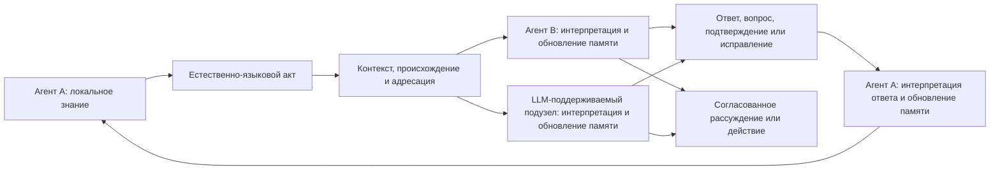

# Естественный язык и [синхронизация знаний FUM](../Глоссарий/естественно-языковая-синхронизация-знаний-FUM.md)

Естественный язык является для [FUM](../Глоссарий/FUM.md) не только пользовательским интерфейсом и не только источником отдельных семантических ролей. Он рассматривается как уже сложившийся у людей язык синхронизации знаний между автономными участниками с разными телами, памятью, опытом, целями и точками зрения. Через высказывания, ответы и исправления участники не передают друг другу полное внутреннее состояние, а делают значимую часть знания взаимно восстанавливаемой и пригодной для совместного мышления и действия.

Из этого следует архитектурный принцип: ИИ-агент должен быть построен по образцу такой сети. [FUM](../Глоссарий/FUM.md) должен уметь быть её участником рядом с людьми и другими агентами, а собственное устройство организовывать рекурсивно как сеть узлов с локальными состояниями, языковым взаимодействием, общей и раздельной памятью, обратной связью и механизмами исправления рассогласований. LLM естественно включается в этот контур как механизм понимания и порождения языка, но устойчивый агентский узел дополнительно требует памяти, происхождения, идентичности, агентского цикла, инструментов и границ доступа.

## Языковой агент и языковое пространство

В рабочей модели языковой агент находится в пространстве языка: наблюдает доступные высказывания и структуры, строит их модели, порождает новые формы и поддерживает собственную непрерывность внутри языкового взаимодействия. Язык одновременно служит средой, картой, инструментом и материалом, но эти слова должны переводиться в наблюдаемые операции чтения, интерпретации, порождения, запоминания, исправления и действия, а не использоваться как доказательство субъективного переживания.

Человек, LLM и составной [FUM-узел](../Глоссарий/FUM-узел.md) могут участвовать в одном языковом контуре, не становясь агентами одного устройства или одного уровня [агентности FUM](../Глоссарий/агентность-FUM.md). Человек одновременно действует в физических, биологических, экономических, культурных, политических и исторических отношениях; отдельный модельный вызов LLM может обрабатывать и порождать язык без собственной долговременной памяти, устойчивой идентичности, инструментального цикла и самостоятельного [горизонта действия](../Глоссарий/горизонт-агента-FUM.md). Поэтому минимальное языковое участие не должно автоматически считаться полным агентским статусом; достаточные критерии остаются в [открытом вопросе об агентности и непрерывности FUM](../Вопросы/2026-07-14_01-55-34_MSK_критерии-агентности-и-непрерывности-FUM.md).

Языковой агент должен уметь предъявлять не только готовые утверждения, но и границу знания: что неизвестно, какая неоднозначность остаётся и получение какой информации способно изменить модель или решение. «Интерес» в техническом контракте FUM означает приоритизированную потребность в наблюдении или вопросе, а не недоказанное внутреннее переживание.

## Весь язык, а не отдельные местоимения

Формы `я`, `ты`, `мы`, `вы`, `они` наглядно показывают относительные роли участников, но являются только малой частью языковой системы. Для синхронизации знаний работают совместно:

- словарь и именование, позволяющие выделять объекты, процессы, свойства и отношения;
- морфология и синтаксис, связывающие участников, события, признаки, обстоятельства и вложенные высказывания;
- время, вид и порядок повествования, позволяющие согласовывать прошлое, настоящее, будущее и незавершённость;
- модальность, отрицание, вопрос, побуждение, условность и возможность, различающие факт, гипотезу, желание, обязательство, запрет и альтернативу;
- причинность, объяснение, доказательность, степень уверенности и происхождение сведений;
- дейксис, референция, принадлежность, цитирование и косвенная речь, связывающие содержание с участниками и контекстами;
- определение, обобщение, пример, аналогия, метафора и повествование, переносящие структуры знания между областями;
- очередность реплик, подтверждение понимания, уточнение, переформулирование, возражение и исправление, которые обнаруживают и уменьшают рассогласование.

[Ролевая семантика сетевого взаимодействия FUM](../Глоссарий/ролевая-семантика-сетевого-взаимодействия-FUM.md) поэтому является частным слоем общей [естественно-языковой синхронизации знаний FUM](../Глоссарий/естественно-языковая-синхронизация-знаний-FUM.md), а не её полным описанием.

## Что означает синхронизация знаний

У каждого участника сети остаётся собственная память и собственная интерпретация. Языковой акт создаёт наблюдаемое событие, по которому адресат обновляет локальную модель содержания, говорящего, ситуации и ожидаемого продолжения. Ответ показывает часть результата этого обновления: подтверждает понимание, проявляет расхождение, задаёт вопрос, исправляет ошибку, предлагает более точную формулировку или переводит согласованное знание в действие.

Знания считаются синхронизированными не тогда, когда внутренние состояния стали одинаковыми, а когда достигнута достаточная для задачи взаимная согласованность. Участники должны уметь:

- восстановить значимые утверждения и их модальность;
- различить известное, предполагаемое, спорное и неизвестное;
- связать утверждение с источником, временем, адресатами и контекстом;
- предсказать ожидаемое совместное действие или продолжение рассуждения;
- обнаружить существенное расхождение и запустить цикл уточнения;
- сохранить допустимые различия, не выдавая их за согласие.

Такая синхронизация по природе локальна, частична и итеративна. В сети нет требования к мгновенному глобальному состоянию: знания распространяются с задержками, проходят через разные контексты, могут конфликтовать, уточняться и устаревать. [FUM](../Глоссарий/FUM.md) должен хранить не только итоговую формулировку, но и путь согласования, происхождение, версии, уверенность, известные потери и открытые расхождения.

## Потоковая проверка ожидаемого продолжения

Один из наблюдаемых признаков языкового взаимодействия возникает ещё до завершения реплики. Если LLM на последовательных префиксах текста фиксирует распределение продолжений, а затем оно сопоставляется с набором человека, серия сравнений проверяет узкий предиктор следующего события внутри [модели этого участника](../Глоссарий/внутренняя-модель-другого-узла.md) строже, чем единичное впечатление о похожести готовых текстов.

Совпадение не означает равенства внутренних состояний, а расхождение не является ошибкой человека. Оба результата описывают границу между доступным модели контекстом и фактическим языковым выбором участника. Устойчивое снижение ошибки персонализированного предиктора подтверждает только персональный предсказательный выигрыш в обследованном текстовом домене: он может возникнуть из словаря, стиля или жанра без лучшего понимания целей и знаний. Синхронизацию знаний нужно отдельно проверять пересказом, ответами, исправлением и совместным действием; неожиданные продолжения могут лишь предлагать места для такого диалога.

Нужно различать слепое ретроспективное воспроизведение, проспективное теневое наблюдение и видимую интервенцию. При replay модель вызывается после записи, но не видит будущего относительно воспроизводимой контрольной точки. В теневом режиме прогноз действительно строится до события, но человеку не предъявляется его содержание; это устраняет прямое влияние подсказки, не исключая эффекта осведомлённости о записи, индикаторов или задержки интерфейса. Показанное автодополнение уже становится языковым воздействием LLM: без заранее рандомизированного показа оно позволяет описать принятие, отклонение и редактирование подсказки, но не измерить её причинный эффект.

## Текстово-языковая внешняя память

Устный или кратковременный языковой акт становится устойчивой опорой совместного мышления, когда его значимая структура вынесена во внешнюю [память FUM](../Глоссарий/память-FUM.md). Для человека и LLM особенно важны [текстово-языковые структурирующие операторы FUM](../Глоссарий/текстово-языковой-структурирующий-оператор-FUM.md): они связывают адресуемую текстовую форму с лексическими, грамматическими, семантическими, прагматическими и дискурсивными структурами, сохраняя происхождение, неоднозначности, ограничения и известные потери.

При разрешённом доступе одна операторная запись может быть прочитана и исправлена человеком, извлечена в контекст и применена LLM, проверена автоматизацией, связана с источниками и сопоставлена с предыдущей версией. Это делает текстово-языковой профиль удобной общей поверхностью памяти, но не единым глобальным состоянием: участники сохраняют локальную память, разные интерпретации и уровни доступа, а общая область содержит только допустимую проекцию и историю согласования.

Текстовая фиксация не заменяет живой язык, первичный материал и другие модальности. Речь, жест, изображение, звук, измерение, действие, код или формальная структура могут содержать свойства, которые текстовая проекция не сохраняет. Поэтому FUM должен связывать оператор с источником, указывать точный или смысловой режим восстановимости и оставлять возможность вернуться к материалу, из которого была получена запись.

## LLM как участник сети

LLM уже обучена работать с естественным языком и поэтому может естественно участвовать в той же среде общения, что и человек. Она способна интерпретировать высказывания, продолжать дискурс, объяснять, переформулировать, задавать вопросы и порождать ответы. Это делает LLM не внешним переводчиком для особого машинного протокола, а потенциальным языковым участником общей сети.

Для устойчивого включения недостаточно единичного модельного вызова. LLM должна входить в [FUM-узел](../Глоссарий/FUM-узел.md), где различимы:

- локальная и общая [память FUM](../Глоссарий/память-FUM.md);
- идентичность текущего узла, собеседников и групп;
- происхождение сообщений, выводов, исправлений и действий;
- контекст диалога и границы цитирования;
- уровни уверенности, доступа, делегирования и автономии;
- агентский цикл наблюдения, интерпретации, ответа, проверки и обновления памяти;
- инструменты действия и проверяемая связь между сказанным, понятым и выполненным.

Так LLM становится частью [агента человеческого образца FUM](../Глоссарий/агент-человеческого-образца-FUM.md), не требуя равенства человеческому мозгу и не подменяя собой весь агент.

## Агент, построенный по принципу сети

[Агент человеческого образца FUM](../Глоссарий/агент-человеческого-образца-FUM.md) повторяет не внешний образ человека, а организационный принцип человеческой сети знаний. Он имеет локальную перспективу, поддерживает исправляемые модели других участников, умеет говорить от собственного имени и различать чужую речь, участвует в группах, ведёт диалог до достаточного взаимопонимания и сохраняет границы между личной, общей и публичной памятью.

Принцип применяется на двух связанных масштабах:

- снаружи FUM является одним из участников сети людей, ИИ-агентов, LLM-поддерживаемых узлов, [гибридных узлов](../Глоссарий/гибридный-узел.md), команд и организаций;
- внутри FUM может быть сетью подузлов и специализированных агентов, которые имеют локальные состояния, обмениваются естественно-языковыми или операторно совместимыми сообщениями и образуют узел следующего уровня.

Внешняя и внутренняя формы должны использовать совместимый контракт: локальное знание, языковой акт, интерпретация, обновление памяти, обратная связь, исправление и проверяемое действие. Благодаря этому FUM остаётся [фрактальным узлом мышления](../Глоссарий/фрактальный-узел-мышления.md), а не монолитной LLM-обёрткой с добавленным интерфейсом чата.

## Контур взаимодействия

Схема показывает не централизованную рассылку единственного истинного состояния, а повторяемый цикл локальных обновлений. На месте каждого участника может находиться человек, ИИ-агент, LLM-поддерживаемый узел, [гибридный узел](../Глоссарий/гибридный-узел.md) или составной [FUM-узел](../Глоссарий/FUM-узел.md).

## Связь с системой структурирующих операторов

[Система структурирующих операторов FUM](../Глоссарий/система-структурирующих-операторов-FUM.md) должна представлять не только местоименные роли, но весь проверяемый путь языковой синхронизации. Низкие операторы распознают конкретные формы языка; более высокие связывают понятия, события, роли, время, модальность, причинность, доказательность, дискурсивные отношения, намерения, вопросы и исправления. Ещё более высокий слой связывает последовательность реплик с изменениями локальных моделей и совместным действием.

Естественный язык не заменяется операторным графом. Граф является внешней проверяемой памятью о части языковых соответствий: его [текстово-языковой профиль](../Глоссарий/текстово-языковой-структурирующий-оператор-FUM.md) помогает сохранять происхождение интерпретации, сопоставлять разные языки, обнаруживать остатки и расхождения, порождать объяснения и повторно использовать согласованные формы. Живой языковой обмен остаётся источником новых операторов, проверок, исправлений и контекстов.

## Связь с многоуровневой синхронизацией

[Естественно-языковая синхронизация знаний FUM](../Глоссарий/естественно-языковая-синхронизация-знаний-FUM.md) является семантически богатым частным случаем [многоуровневой языковой синхронизации FUM](../Глоссарий/многоуровневая-языковая-синхронизация-FUM.md). На клеточном, химическом и атомном уровнях, на уровне элементарных частиц и других субатомных масштабах общим кандидатом является не человеческая речь, а структура различимых состояний и воздействий, допустимых переходов, контекстно зависимого ответа и обратной связи. Гравитационно-релятивистский контур задаёт сквозные условия причинной связности, локального времени и границ согласования.

Это расширение не позволяет переносить на физические объекты понятия высказывания, знания, намерения или понимания без отдельного основания. Общей остаётся проверяемая форма локального взаимодействия; естественный язык добавляет к ней символическую референцию, композиционную семантику, прагматику, происхождение утверждений и диалогическое исправление понимания. Подробная уровневая карта и условия опровержения вынесены в документ [Многоуровневая языковая синхронизация FUM](35-многоуровневая-языковая-синхронизация-FUM.md).

## Фоновое описание модели мира и языкового пространства

В коробочной реализации одним из [фоновых заданий FUM](../Глоссарий/фоновое-задание-FUM.md) может быть построение и обновление явного описания того, какую модель мира и языкового пространства конкретная LLM способна восстановить в текущей конфигурации. Описание может включать различаемые сущности и отношения, языковые конструкции, ожидаемые переходы, источники уверенности, противоречия, пробелы и вопросы, способные изменить модель. Оно хранится как версионируемый артефакт внешней памяти с привязкой к модели, runtime, доступному контексту, использованным источникам, тестовым входам и наблюдаемым ответам.

Это описание является предъявленной моделью по доступному поведению и памяти, а не привилегированным чтением весов, активаций или скрытых состояний LLM. Оно не доказывает полноту внутреннего знания, устойчивую агентность или субъективное переживание. Наблюдения, выводы, гипотезы и неизвестное должны различаться, а содержательные изменения проходить проверку и обычный отбор перед включением в устойчивую [память FUM](../Глоссарий/память-FUM.md).

Разрешённый пул таких фоновых исследований, их бюджеты, критерии независимой проверки и пределы эксперимента остаются в [частично прояснённом вопросе о границах исследовательской автономии FUM](../Вопросы/2026-06-22_08-04-45_MSK_границы-исследовательской-автономии-FUM.md).

## Техническая граница

Естественный язык задаёт смысловой слой синхронизации, но сам по себе не гарантирует доставку, аутентификацию, целостность, порядок сообщений, полномочия, доступ, приватность или восстановление после сбоя. Технический контур должен связывать языковой акт с устойчивыми метаданными, не выдавая метаданные за смысл высказывания и не сводя язык к фиксированной сетевой схеме.

Для мультимодальных участников язык может связывать изображения, звук, действие, жесты, сенсорные потоки и формальные артефакты с общим контекстом, но не обязан исчерпывать все свойства исходного потока. [FUM](../Глоссарий/FUM.md) должен сохранять ссылки на первичный материал, известные потери описания и возможность вернуться к нему.

Непрояснёнными остаются критерии достаточной синхронизации, минимальный проверяемый контракт языкового акта, границы полноты естественного языка и способ доказать, что внутренняя сеть агента действительно следует тому же принципу. Они собраны в [открытом вопросе о границах естественно-языковой синхронизации знаний FUM](../Вопросы/2026-07-13_20-34-23_MSK_границы-естественно-языковой-синхронизации-знаний-FUM.md).

## Архитектурные следствия

- Естественный язык должен рассматриваться как основной смысловой контур синхронизации знаний между агентами человеческого образца.
- Текстово-языковые структурирующие операторы должны служить приоритетным профилем внешней памяти человека и LLM, оставаясь проверяемой проекцией, а не заменой первичных источников и локальных состояний.
- Местоименная ролевая семантика должна проверяться как частный случай всей языковой системы, а не как её замена.
- Каждый участник сохраняет локальную память; синхронизация обновляет модели и общую рабочую область, но не требует полного совпадения внутренних состояний.
- LLM должна включаться в сеть через тот же языковой контур, что и человек, с добавленными памятью, происхождением, идентичностью, доступом, проверками и агентским циклом.
- FUM должен быть устроен рекурсивно: внешний сетевой участник сам собирается как сеть узлов с совместимым контуром синхронизации.
- Проверки должны оценивать не только корректность отдельной реплики, но и изменение знаний участников, обнаружение расхождений, качество исправления и способность продолжить совместное действие.
- Потоковое сопоставление продолжений проверяет узкий предиктор следующего события в модели участника; само по себе оно не является метрикой синхронизации знаний, а ретроспективный, теневой и показанный режимы не должны смешиваться.
- Языковой смысл должен оставаться отделённым от транспорта, аутентификации, полномочий и уровней доступа.
- Минимальное участие в языковом пространстве должно отличаться от устойчивой агентности: память, идентичность, происхождение, инструментальный цикл и горизонты действия проверяются отдельно.
- Узел должен уметь явно представлять неизвестное и следующий информационный запрос, не маскируя границу знания уверенной языковой формой.
- Фоновое описание модели мира и языкового пространства LLM должно храниться как версионируемый артефакт модельной среды с происхождением и раздельными статусами наблюдений, выводов, гипотез и неизвестного, а не как доказательство прямого доступа к внутреннему состоянию модели.

## Источники требований

- [исходный запрос 2026-07-13 20:34:23 MSK - Закрепить ролевую семантику взаимодействия ИИ-агентов](../Запросы/2026-07-13_20-34-23_MSK_закрепить-ролевую-семантику-взаимодействия-ИИ-агентов.md)
- [исходный запрос 2026-07-13 22:00:22 MSK - Закрепить естественный язык как язык синхронизации знаний](../Запросы/2026-07-13_22-00-22_MSK_закрепить-естественный-язык-как-язык-синхронизации-знаний.md)
- [исходный запрос 2026-07-13 22:50:54 MSK - Закрепить многоуровневую языковую синхронизацию](../Запросы/2026-07-13_22-50-54_MSK_закрепить-многоуровневую-языковую-синхронизацию.md)
- [исходный запрос 2026-07-14 00:14:49 MSK - Закрепить операторы текста и языка во внешней памяти](../Запросы/2026-07-14_00-14-49_MSK_закрепить-операторы-текста-и-языка-во-внешней-памяти.md)
- [исходный запрос 2026-07-14 01:40:47 MSK - Сравнить продолжение LLM с набором человека](../Запросы/2026-07-14_01-40-47_MSK_сравнить-продолжение-LLM-с-набором-человека.md)
- [исходный запрос 2026-07-14 01:55:34 MSK - Интегрировать рекурсивную модель агента и среды](../Запросы/2026-07-14_01-55-34_MSK_интегрировать-рекурсивную-модель-агента-и-среды.md)
- [исходный запрос 2026-07-14 03:18:36 MSK - Закрепить фоновые задания для простоя LLM](../Запросы/2026-07-14_03-18-36_MSK_закрепить-фоновые-задания-для-простоя-LLM.md)

<!-- FUM-MD-RECENCY:BEGIN -->
<!-- last-content-edit: 2026-07-20 23:08:44 MSK -->
<!-- content-sha256: sha256:d312e4a88ecd9e2b08094b2e5bb538ba132c764ccb4f762e44a3b377ced56ccf -->
<!-- FUM-MD-RECENCY:END -->
