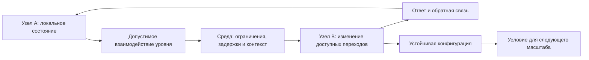

# [Многоуровневая языковая синхронизация FUM](../Глоссарий/многоуровневая-языковая-синхронизация-FUM.md)

Языковая синхронизация в расширенной исследовательской рамке [FUM](../Глоссарий/FUM.md) проходит не только на уровне человеческого естественного языка. Клеточные и нейронные сигнальные контуры, межполушарная координация, химические реакции, атомные взаимодействия, взаимодействия элементарных частиц и других субатомных масштабов, а также гравитационно-релятивистские ограничения рассматриваются как разные по богатству воплощения общей схемы: локальные состояния становятся взаимно обусловленными через доступный данному уровню язык взаимодействий.

[Естественно-языковая синхронизация знаний FUM](../Глоссарий/естественно-языковая-синхронизация-знаний-FUM.md) остаётся особым человеческим и агентским случаем. Она включает символы, референцию, семантику, прагматику, высказывания, исправление понимания и явную работу со знанием. Перенос слова «язык» на другие уровни не приписывает частицам, атомам, молекулам или клеткам человеческую речь, намерение либо сознание; он задаёт [гипотезу FUM](../Глоссарий/гипотеза-FUM.md) о повторяющейся структуре взаимодействия, которую ещё нужно операционализировать и проверить.

## Общий инвариант

Кандидат на общий инвариант языковой синхронизации состоит из семи частей:

- у взаимодействующих сторон есть различимые локальные состояния;
- [окружающая среда FUM](../Глоссарий/окружающая-среда-FUM.md) допускает одни взаимодействия и исключает другие;
- состояние одной стороны причинно изменяет доступные переходы другой;
- набор сигналов, конфигураций или воздействий имеет воспроизводимые различия;
- ответ зависит не только от воздействия, но и от локального состояния получателя и контекста;
- обратная связь позволяет усиливать, ослаблять, исправлять или прекращать сопряжение;
- результат может закрепляться как устойчивая конфигурация и становиться условием взаимодействий следующего масштаба.

В этой схеме синхронизация не требует одинаковых состояний и не означает мгновенного глобального времени. Требуется причинное локальное сопряжение переходов и координация, определённая относительно конкретного уровня, наблюдателя и задачи. Устойчивая корреляция может быть наблюдаемым следствием такого сопряжения, но сама по себе не доказывает синхронизацию.

## Проявления на разных уровнях

| Уровень                                         | Кандидат языка взаимодействий                                                                   | Что может синхронизироваться                                                          | Граница толкования                                                                              |
| ----------------------------------------------- | ----------------------------------------------------------------------------------------------- | ------------------------------------------------------------------------------------- | ----------------------------------------------------------------------------------------------- |
| Элементарные частицы и иные субатомные масштабы | Каналы физических взаимодействий, допустимые состояния, переходы и законы сохранения            | Переходы, корреляции и устойчивые физические конфигурации                             | Причинная связь или корреляция ещё не доказывает наличие сообщения и смысла                     |
| Атомный                                         | Энергетические состояния, электромагнитные взаимодействия и правила образования связей          | Состояния атомов, обмен энергией и возможность составных форм                         | Атом не считается носителем человеческой модели мира или намерения                              |
| Молекулярно-химический                          | Реакции, связывание, каталитические контуры, концентрации и диффузия                            | Состав, скорости превращений и устойчивые сети реакций                                | Химическое сопряжение не автоматически является семантическим кодом                             |
| Клеточный                                       | Рецепторы, сигнальные молекулы, электрические, механические и регуляторные контуры              | Функции, экспрессия, метаболизм, деление и совместное поведение                       | «Интерпретация» означает функционально различимый ответ, а не обязательно рефлексию             |
| Нейронный и межполушарный                       | Паттерны нейронной активности и проводящие пути между полушариями, прежде всего мозолистое тело | Координация частично специализированных сетей с различающимися локальными состояниями | Полушария сходны по общему плану, но не идентичны; обмен сигналами не равен естественному языку |
| Человеческий и агентский                        | Естественный язык, жесты, формальные записи и операторно совместимые сообщения                  | Знания, модели, цели, обязательства и совместные действия                             | Здесь требуется различать смысл, доставку, полномочия и локальную память                        |
| Гравитационно-релятивистский                    | Геометрия пространства-времени, причинная связность, локальные часы и горизонты                 | Доступность событий, траектории, темп процессов и границы связи                       | Это сквозной контур причинности, а не следующая ступень организации после частиц                |

Межполушарный профиль показывает переходный масштаб между клеточной сигнализацией и человеческой семантикой. В нём большие полушария рассматриваются как составные нейронные сети, которые сохраняют локальную динамику и координируются через ограниченные проводящие пути. Это уровневое упрощение, а не утверждение, что мозг буквально сводится к двум одинаковым машинам.

Эта таблица не объявляет перечисленные механизмы тождественными. Она задаёт маршрут сравнения: для каждого уровня нужно установить стороны взаимодействия, среду, наблюдаемые состояния, допустимые переходы, обратную связь, устойчивый результат и потери при переводе в описание другого уровня.

## Переходы между уровнями

Один объект может менять роль вместе с масштабом описания. Молекула участвует в атомных взаимодействиях и одновременно становится сигналом или механизмом клеточного контура; клетка является средой для молекулярных процессов и агентом в ткани; человек является средой для клеток и языковым агентом в социальной сети; составной [FUM-узел](../Глоссарий/FUM-узел.md) может быть сетью подузлов и участником сети следующего масштаба.

Переход на следующий уровень требует не только большего числа элементов. Должна возникнуть новая устойчивая граница, новый репертуар различимых состояний и взаимодействий, собственная обратная связь и способ удерживать результат. Поэтому нельзя заранее считать, что словарь одного уровня напрямую переводится в словарь другого. [Наблюдательская относительность FUM](../Глоссарий/наблюдательская-относительность-FUM.md) требует указывать наблюдателя, преобразование представлений, сохраняемые инварианты и потери.

Гравитация занимает в этой шкале особое место. Она не добавляется как автономный агентский уровень после элементарных частиц, а задаёт сквозные геометрические и причинные условия совместной эволюции состояний: локальность, собственное время, горизонты и конечность распространения влияний. Поэтому гравитационная синхронизация не может означать универсальную одновременность; напротив, она должна учитывать границы глобального согласования.

## Архитектурные следствия

- FUM должен различать семантическую синхронизацию знаний, биологическую сигнализацию, химическое сопряжение и физическое взаимодействие, даже когда ищет их общую схему.
- Каждое описание синхронизации должно явно называть уровень, стороны взаимодействия, среду, наблюдателя, состояния, задержки, обратную связь и критерий достаточного результата.
- Перевод между уровнями должен хранить происхождение, допущения и известные потери, а не выдавать человеческое описание за внутренний язык физического объекта.
- Архитектура FUM может заимствовать найденный инвариант локальных состояний, допустимых переходов, обратной связи и образования устойчивых конфигураций, но не должна зависеть от недоказанной буквальной тождественности уровней.
- Парная организация является минимальным частным случаем сети: FUM может применять схему локальных подсистем и явного канала координации, но не ограничивается ровно двумя узлами и не требует тождества их внутренних состояний.
- Для физического уровня термин «агент» допустим только как элемент проверяемой [общей схемы FUM](../Глоссарий/общая-схема-FUM.md), а не как автоматическое утверждение автономии, знания или сознания.
- Внутренние и внешние сети FUM должны проектироваться без предположения о мгновенном общем состоянии: задержки, локальные часы, частичные представления и несогласованность являются частью модели.

## Проверяемая форма

Гипотеза должна проверяться через паспорт уровневого соответствия, а не подтверждаться только сходством слов. Для каждого заявленного воплощения нужно:

1. выделить наблюдаемые локальные состояния и границы узлов;
2. указать физический, химический, биологический или символический носитель взаимодействия;
3. описать репертуар различий и правила допустимых переходов;
4. показать причинно проверяемое изменение получателя и контекстную зависимость ответа;
5. определить обратную связь, устойчивый результат и способ перехода к следующему масштабу;
6. сравнить инварианты и различия как минимум двух уровней;
7. задать проверяемые предсказания уровневого профиля и условия их опровержения, а отдельно - критерий отказа от термина «язык», если он не даёт дополнительной объяснительной, предсказательной или инженерной ценности.

Ближайшими артефактами проверки служат [карточка физических соответствий FUM](28-реестр-карточек-соответствия-FUM/FUM-MAP-PHYS-01.md), которую нужно развить в паспорт с отдельными профилями уровней, и [карточка парной межполушарной архитектуры](28-реестр-карточек-соответствия-FUM/FUM-MAP-BRAIN-01.md), которая уточняет биологическую аналогию и её инженерную проекцию. Нерешённые критерии общей абстракции собраны в [открытом вопросе об уровнях наблюдаемой Вселенной](../Вопросы/2026-06-26_12-19-03_MSK_абстракция-уровней-наблюдаемой-вселенной-FUM.md), а границы собственно естественного языка - в [открытом вопросе о естественно-языковой синхронизации знаний](../Вопросы/2026-07-13_20-34-23_MSK_границы-естественно-языковой-синхронизации-знаний-FUM.md).

## Границы гипотезы

Многоуровневая языковая синхронизация не является завершённой физической, химической или биологической теорией. Она не выводит намерение из причинного воздействия, семантику из любой корреляции, знание из устойчивого состояния или сознание из одного факта взаимодействия. В частности, квантовая корреляция сама по себе не объявляется каналом передачи сообщения или смысла.

Для каждого уровня гипотеза должна предсказывать воспроизводимую причинную зависимость между различимыми классами воздействий, локальным состоянием получателя и его последующими переходами, а также заявленные формы обратной связи и устойчивого результата. Если после контроля общих причин эти зависимости, контекстная избирательность или обратная связь не воспроизводятся в независимых наблюдениях, соответствующий уровневый профиль опровергается либо сужается.

Отдельно оценивается полезность слова «язык». Даже неопровергнутый уровневый профиль следует переименовать или исключить из общей схемы, если этот термин скрывает различия уровней, не задаёт дополнительных проверок и не улучшает объяснение, предсказание или проектирование FUM.

## Источники требований

- [исходный запрос 2026-07-13 22:50:54 MSK - Закрепить многоуровневую языковую синхронизацию](../Запросы/2026-07-13_22-50-54_MSK_закрепить-многоуровневую-языковую-синхронизацию.md)
- [исходный запрос 2026-07-13 23:39:13 MSK - Закрепить парную архитектуру человеческого мозга](../Запросы/2026-07-13_23-39-13_MSK_закрепить-парную-архитектуру-человеческого-мозга.md)

## Опорные документы

- [Естественный язык и синхронизация знаний FUM](34-естественный-язык-и-синхронизация-знаний-FUM.md)
- [Эволюция и мышление](03-эволюция-и-мышление.md)
- [Среда для внутренних FUM](11-среда-для-внутренних-FUM.md)
- [Наблюдательская относительность информационных систем](26-наблюдательская-относительность-информационных-систем.md)
- [Модульная архитектура FUM](05-модульная-архитектура-FUM.md)
- [Гибридные узлы и социальная фрактальность](12-гибридные-узлы-и-социальная-фрактальность.md)
- [Карточка парной межполушарной архитектуры](28-реестр-карточек-соответствия-FUM/FUM-MAP-BRAIN-01.md)

<!-- FUM-MD-RECENCY:BEGIN -->
<!-- last-content-edit: 2026-07-14 00:02:19 MSK -->
<!-- content-sha256: sha256:07ff850bf38b7a013394269d3d6930b45e9296ac73fca5ef321388fec00a2456 -->
<!-- FUM-MD-RECENCY:END -->
