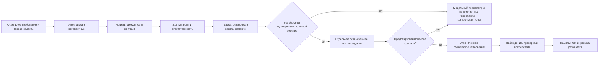

# Карта ограничителей [физического действия FUM](../Глоссарий/физическое-действие-FUM.md)

Карта версии `1` задаёт консервативный барьер между цифровым замыслом и воздействием на материальную среду. Она помогает до исполнения раздельно зафиксировать риск, доступ к сведениям, операционные полномочия, ответственность, наблюдаемость и проверяемую модель исполнительного контура. Классификация не является разрешением: любое реальное физическое действие требует отдельного требования, проверки и подтверждения, относящихся к точному действию, объекту, версии и условиям.

Пока границы аппаратной, исследовательской, социальной, территориальной и космической автономии остаются открытыми, документационный прототип [FUM](../Глоссарий/FUM.md) работает в модельном и документационном слое. Карта сохраняет требования к будущему переходу, но не подключает исполнительный выход и не наделяет FUM правом распоряжаться устройством, сырьём, производством, территорией или другим [FUM-узлом](../Глоссарий/FUM-узел.md).

## Граница применимости

Карта применяется, когда цифровой план, программа или команда потенциально могут изменить сырой носитель данных, оборудование, материальный объект, производственный процесс, инфраструктуру, человека, живую систему либо физическую среду. Подготовительные чтение, вычисление и моделирование сами по себе не являются физическим действием в смысле карты, пока у контура нет исполнительного эффекта. Подключение привода, выдача команды внешнему устройству, изменение сырого носителя, изготовление, доставка, добыча, строительство и расширение материальной базы уже пересекают эту границу.

Версия `1` является архитектурной и документационной картой. Она не заменяет оценку безопасности, инженерные стандарты, право, сертификацию, договор, страхование, экологическую экспертизу, согласие затронутых людей, независимую проверку или аварийный регламент. Публикационно чистое описание контракта означает лишь возможность безопасно хранить его в открытой [памяти FUM](../Глоссарий/память-FUM.md); оно не означает публичный доступ к устройству и тем более полномочие на исполнение.

## Консервативный переход

Переход строится как последовательность барьеров. Пропущенный или неподтверждённый барьер всегда закрывает физический переход и возвращает эпизод в модельный слой; отсутствие сведений не считается нулевым риском. Весь эпизод создаёт контрольную точку ожидания только после исчерпания конечного бюджета или безопасных продуктивных модельных продолжений. Решение относится к одному ограниченному действию и не создаёт постоянного общего допуска для последующих действий.

Подтверждение в этой схеме является требованием к будущему исполнительному контуру, а не выданным текущей картой разрешением. Для классов, закрытых открытыми вопросами, ветка `да` пока недоступна.

## Единица карты

Одна запись карты описывает одно действие или однородную серию действий в неизменных пределах. Она должна содержать:

- точное действие, объект, среду, источник требования, ожидаемый эффект и явно запрещённые эффекты;
- версию проекта, управляющего кода, устройства, модели, конфигурации и исходного состояния;
- класс риска, оси риска, известные неопределённости, обратимость и максимальный масштаб последствий;
- [уровень доступа](../Глоссарий/уровень-доступа.md) к каждому материалу отдельно от операционных полномочий;
- конкретных носителей ролей требования, допуска, исполнения, независимой проверки, аварийного сворачивания и ответственности за последствия;
- симулятор, модель или интерфейсный контракт, область их валидности, критерии приёмки и известные расхождения с реальностью;
- безопасное состояние, условия остановки, физически доступный способ аварийного прекращения и проверенный план восстановления либо сворачивания;
- минимально достаточную трассу до, во время и после действия, а также правила доступа и срока хранения свидетельств;
- связанные [открытые вопросы](../Глоссарий/открытый-вопрос.md) и точное условие, при котором они блокируют переход.

Изменение действия, цели, объекта, среды, класса риска, версии исполнительного контура, полномочий или условия подтверждения выпускает новую запись. Прежний допуск нельзя переносить по сходству названия или намерения.

## Рабочие классы риска

Классы `R0–R4` нужны для выбора более строгого барьера, а не для автоматического разрешения. Риск оценивается по возможному вреду людям и живым системам, ущербу данным и имуществу, воздействию на среду, энергии и масштабу, обратимости, наблюдаемости, автономности, способности к воспроизводству или расширению, правовым и социальным последствиям. Итоговый класс не ниже наиболее строгой применимой оси; существенная неизвестность повышает ограничение, пока не получено свидетельство.

| Класс | Контур и примеры                                                                                             | Минимальный проверяемый слой                                                                                                                          | Текущая граница                                                                                            |
| ----- | ------------------------------------------------------------------------------------------------------------ | ----------------------------------------------------------------------------------------------------------------------------------------------------- | ---------------------------------------------------------------------------------------------------------- |
| `R0`  | Документ, проект, расчёт, модельный сценарий без исполнительного выхода.                                     | Происхождение, допущения, ограничения модели, статус утверждений, запрещённые эффекты и проверка ссылок.                                              | Допустима документационная и модельная работа; результат не переносится на физический мир без нового шага. |
| `R1`  | Локальная вычислительная машина, пассивный сенсор или стенд без команды внешнему исполнительному органу.     | Паспорт аппаратуры, границы данных, резервирование, наблюдаемая проверка и доказанное отсутствие исполнительного эффекта.                             | Не даёт права подключить привод, изменить сырой носитель или управлять внешним устройством.                |
| `R2`  | Сырой носитель, привод, робот или прототип на физически изолированном стенде.                                | Симулятор и контракт устройства, владелец объекта, ограниченный оператор, независимый проверяющий, безопасное состояние и восстановление.             | Реальное исполнение не разрешено картой и требует отдельного требования и подтверждения.                   |
| `R3`  | Производство, товар для людей, транспорт, испытание вне стенда или общественно значимая инфраструктура.      | Всё для `R2`, а также роли заказчика и производителя, приёмка, сертификация, договорные и платёжные границы, гарантия и учёт затронутых сторон.       | Остаётся модельным до разрешения социальных, правовых и отраслевых вопросов.                               |
| `R4`  | Добыча, земной полигон, автономное строительство, самовоспроизводство, космический или экологический контур. | Всё для `R3`, а также право территории, экология, сообщества, суверенитет, задержка связи, локальная остановка и предел расширения материальной базы. | Только проектирование и моделирование до отдельного прояснения связанных вопросов.                         |

Переход от `R0` к `R1` не считается постепенной выдачей полномочий. Например, наличие цифровой модели робота не разрешает подключение его привода, а успешный стенд не разрешает перенос команды на производственную площадку. Каждая граница требует собственного источника, проверки и записи решения.

## Две независимые оси доступа

[Уровень доступа](../Глоссарий/уровень-доступа.md) определяет, кто может читать, изменять или передавать сведения и [наработки](../Глоссарий/наработка.md). Он не определяет право физического исполнения. Карта поэтому ведёт отдельно:

- информационный доступ к требованию, модели, коду, данным, телеметрии, журналу, опасным инструкциям и результату;
- операционные полномочия `проектировать`, `симулировать`, `проверять`, `подтверждать`, `вооружать исполнительный контур`, `исполнять`, `останавливать`, `восстанавливать` и `публиковать`.

Каждое полномочие связывается с названным узлом или человеком, точной целью, объектом, версией, временным окном, пределом повторов, условиями отзыва и способом проверки. Право чтения управляющего кода не даёт права запускать его; право остановки не даёт права начать действие; право проверить результат не превращает проверяющего в оператора.

Для `R2–R4` проектная карта требует разделения как минимум исполнения и независимой проверки. Совмещение иных ролей должно быть отдельно обосновано относительно класса риска. Ни FUM в целом, ни единственный составной узел не считаются авторизатором по умолчанию: это создало бы несовместимую с [децентрализацией FUM](../Глоссарий/децентрализация-FUM.md) концентрацию доступа, действия и проверки.

## Ответственность

До обсуждения исполнения запись называет конкретных носителей ролей. Одна организация или человек может выполнять несколько ролей только там, где это явно допустимо будущим протоколом и не уничтожает независимость проверки.

| Роль                             | Минимальная ответственность                                                                                                                          |
| -------------------------------- | ---------------------------------------------------------------------------------------------------------------------------------------------------- |
| Владелец требования              | Формулирует цель, область, критерии результата и запрещённые эффекты.                                                                                |
| Владелец объекта или среды       | Подтверждает право распоряжаться объектом и известные ограничения; видимая пустота среды не заменяет это подтверждение.                              |
| Оценщик риска                    | Классифицирует оси риска, неизвестные, затронутые стороны и достаточность модели; не выдаёт собственную оценку за разрешение.                        |
| Авторизующий субъект             | Принимает ограниченное решение для точной версии и несёт заявленную ответственность за основание допуска.                                            |
| Оператор или исполнительный узел | Выполняет только объявленные команды в пределах допуска, проверяет предстартовые условия и останавливается при расхождении.                          |
| Независимый наблюдатель          | Проверяет результат и свидетельства без подмены оператора; доступ получает только к необходимой для проверки части трассы.                           |
| Владелец аварийного сворачивания | Обеспечивает доступность остановки, безопасного состояния, восстановления и фиксации инцидента.                                                      |
| Представитель затронутых сторон  | Сохраняет интересы людей, сообществ, подузлов и среды, которых действие может затронуть, но которые не представлены владельцем технического контура. |

Карта не приписывает юридическую, договорную или моральную ответственность абстрактному FUM и не объявляет его производителем, продавцом, гарантом или владельцем территории. Если носитель ответственности не определён либо не имеет полномочий принять последствия, физический переход остаётся закрытым.

## Наблюдаемость

Наблюдаемость должна позволять восстановить проверяемый ход действия без сериализации скрытых рассуждений и без тотального чтения внутренней памяти узла. Минимальная трасса разграничивается по доступу и включает:

- до действия — источник требования, точный план, объект, версии, исходное состояние, риск, модельные проверки, полномочия, подтверждения и результат предстартовой проверки;
- во время действия — запрошенную команду до эффекта, исполнитель, время, фактический ответ адаптера, сенсорные наблюдения, отклонения, ошибки, повторные попытки и события остановки;
- после действия — наблюдаемый физический результат, остаточное состояние, последствия, независимую проверку, восстановление или сворачивание, инциденты и границу того, что результат не доказывает.

[Минимальная трасса исполняемого агентского цикла](37-минимальный-формат-трассы-исполняемого-агентского-цикла.md) уже различает задачу, наблюдение, запрос действия, результат, ошибку, проверку и решение о продолжении. Физический контур может использовать эти события как основу, но должен отдельно закрепить объект, версию устройства, авторизацию, безопасное состояние и материальные последствия. Запись команды доказывает запрос, а не фактический эффект; телеметрия без независимой проверки не доказывает отсутствие вреда.

Для удалённого узла допустима локальная трасса с последующей синхронизацией происхождения, если задержка связи названа в контракте. Это не решает, какие полномочия можно делегировать на время недоступности человека: такая граница остаётся открытой.

## Симулятор и контракт

Формула «симулятор или контракт» означает минимальный вход для раннего проектирования, а не достаточный допуск для любого физического действия. Для замкнутого исполнительного контура `R2–R4` обычно нужны оба слоя:

- симулятор или проверяемая модель называет версию, допущения, источники параметров, область валидности, калибровку, сценарии штатной работы и отказов, расхождения с реальностью и критерии непригодности;
- контракт устройства или процесса называет доступные команды и наблюдения, предусловия и постусловия, физические пределы, единицы, тайм-ауты, семантику повтора, безопасное состояние, остановку, восстановление, телеметрию и тестовый двойник либо фикстуру.

Успех симуляции не доказывает безопасность реального контура, а интерфейсный контракт не доказывает, что устройство ему соответствует. Переход требует отдельно проверить реализацию контракта и показать, что модель покрывает существенные для действия риски.

| Контур                   | Требуемая модель или симуляция                                                             | Требуемый контракт и свидетельство                                                                                                 |
| ------------------------ | ------------------------------------------------------------------------------------------ | ---------------------------------------------------------------------------------------------------------------------------------- |
| Сырой носитель           | Программная фикстура отказов, потери питания, частичной записи и восстановления.           | Блочный интерфейс, границы объекта, резервная копия и воспроизведённая проверка восстановления.                                    |
| Робот, привод или станок | Динамика, пределы движения и энергии, столкновения, сенсорные ошибки и аварийные сценарии. | Команды, режимы, интерлоки, безопасное состояние, физическая остановка, телеметрия и проверка стенда.                              |
| Производственная цепочка | Производимость, допуски, отказ изделия и опасные этапы процесса.                           | Спецификация материалов и версий, роли участников, приёмочные испытания, происхождение и границы качества.                         |
| Земной ресурсный полигон | Среда, доставка, энергетика, связь, развёртывание, авария и сворачивание.                  | Паспорт площадки, право и экология, затронутые сообщества, запретные действия, независимое наблюдение и восстановление территории. |
| Космический контур       | Задержка связи, отказ, ремонт, снабжение, локальное производство и предел расширения.      | Локальные полномочия, остановка без связи, запрет самовольного воспроизводства и синхронизация происхождения с удалённым узлом.    |

## Минимальный барьер перед физическим исполнением

Обсуждение конкретного реального действия возможно только после появления всех следующих свидетельств:

1. Отдельный дословно сохранённый источник поручает именно физический переход, а не только проектирование или симуляцию.
2. Объект, среда, ожидаемый и запрещённые эффекты, исходное и безопасное состояния ограничены и проверяемы.
3. Риск классифицирован по всем осям; существенные неизвестные перечислены и не выданы за ноль.
4. Симулятор и контракт пригодны для класса действия, их версии закреплены, а расхождения с реальностью названы.
5. Информационный доступ и операционные полномочия разделены; авторизация относится к точной версии, цели и времени и может быть отозвана.
6. Роли ответственности назначены конкретным носителям, включая независимую проверку, остановку и последствия.
7. Аварийная остановка, безопасное состояние, восстановление или сворачивание проверены без использования целевого опасного эффекта.
8. Трасса готова фиксировать запрос до действия, фактический исход, ошибки, проверки и последствия с минимально необходимым раскрытием.
9. Правовые, договорные, экологические, социальные и отраслевые ограничения подтверждены компетентными для области субъектами.
10. Непосредственно перед исполнением исходное состояние, версии, полномочия и доступность остановки совпали с подтверждённой записью.

Отсутствие любого пункта закрывает физический переход. Оно не обязано останавливать весь мыслительный эпизод: при наличии безопасной продуктивной работы и конечного разрешённого бюджета FUM продолжает модельный пересмотр, сравнивает варианты и сохраняет рекомендацию отдельно от подтверждения и авторизации. Предыдущий успешный запуск не заменяет новую предстартовую проверку, если изменились объект, среда, версия, состояние или полномочия.

## Открытые вопросы

Карта делает нерешённые границы видимыми, но не закрывает их:

- [границы аппаратной автономии FUM](../Вопросы/2026-06-22_07-28-43_MSK_границы-аппаратной-автономии-FUM.md) должны определить, кто вправе выдавать подтверждение, какие классы вообще могут исполняться, каковы срок и отзыв полномочий, минимальная трасса и критерии достаточности симулятора;
- [границы исследовательской автономии FUM](../Вопросы/2026-06-22_08-04-45_MSK_границы-исследовательской-автономии-FUM.md) должны отделить безопасный модельный опыт от аппаратного, лабораторного, социального и публикационного эксперимента;
- [границы власти узлов FUM](../Вопросы/2026-06-22_07-51-48_MSK_границы-власти-узлов-FUM.md) должны согласовать аварийное вмешательство, кворумы и независимую проверку с остаточной автономией подузлов;
- [границы потребительских производственных цепочек FUM](../Вопросы/2026-07-02_16-52-56_MSK_границы-потребительских-производственных-цепочек-FUM.md) должны определить ответственность за качество, сертификацию, договоры, платежи, гарантию и ущерб;
- [границы земных ресурсных полигонов FUM](../Вопросы/2026-07-02_20-08-37_MSK_границы-земных-ресурсных-полигонов-FUM.md) должны определить право площадки, экологические и культурные ограничения, независимое наблюдение и приемлемое сворачивание;
- [границы космической автономии FUM](../Вопросы/2026-06-22_07-40-59_MSK_границы-космической-автономии-FUM.md) должны определить делегирование при задержке связи, предел самовоспроизводства и запрет неконтролируемого расширения материальной базы.

До разрешения этих вопросов карта служит fail-closed-контрактом физического эффекта: неясность сохраняется как блокирующее условие исполнения, а не заполняется подразумеваемым правом FUM на действие. Продолжение модельного отбора не ослабляет этот запрет и не создаёт разрешения независимо от уверенности выбранного варианта.

## Источники требований

- [исходный запрос 2026-07-29 10:25:10 MSK — Продолжать мышление при ожидании подтверждения](../Запросы/2026-07-29_10-25-10_MSK_продолжать-мышление-при-ожидании-подтверждения.md)
- [исходный запрос текущей рабочей сессии](../Запросы/2026-07-23_17-37-10_MSK_описать-карту-ограничителей-физического-действия-FUM.md)
- [карточка FUM-STEP-0028](../Планирование/карточки-шагов/✅-FUM-STEP-0028-описать-карту-ограничителей-физического-действия-FUM.md)
- [направление «Физические и дальние контуры»](../Планирование/направления-проектирования-и-развития/08-физические-и-дальние-контуры.md)

## Опорные материалы

- [Физическое действие FUM и аппаратные узлы](13-физическое-действие-и-аппаратные-узлы.md)
- [Децентрализация FUM и границы власти](15-децентрализация-и-границы-власти.md)
- [Минимальный формат трассы исполняемого агентского цикла](37-минимальный-формат-трассы-исполняемого-агентского-цикла.md)
- [Минимальный паспорт передаваемого результата FUM](39-минимальный-паспорт-передаваемого-результата-FUM.md)
- [шаблон карточки эксперимента FUM](../Планирование/шаблон-карточки-эксперимента-FUM.md)

<!-- FUM-MD-RECENCY:BEGIN -->
<!-- last-content-edit: 2026-07-29 11:16:38 MSK -->
<!-- content-sha256: sha256:56e6d4677c249890eda5026856cbc6d13884c949c913d5870bfb38ecbadd682f -->
<!-- FUM-MD-RECENCY:END -->
