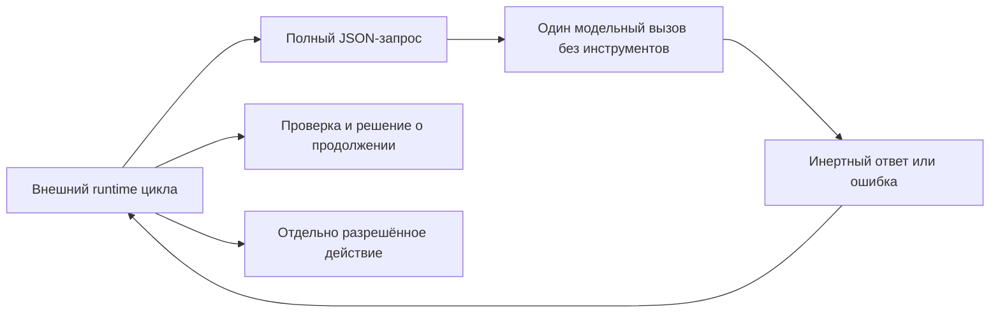

# Контракт чистого модельного шага

[Чистый модельный шаг](../Глоссарий/чистый-модельный-шаг.md) версии `1` — это один ограниченный вызов заранее выбранного провайдера: вызывающий контур передаёт весь доступный модели контекст как данные и получает один наблюдаемый текстовый результат либо структурированную ошибку. Провайдер не получает инструменты, файлы, сеть или право исполнять собственный вывод и не решает, продолжать ли [агентский цикл](../Глоссарий/агентский-цикл.md).

Слово «чистый» обозначает границу эффектов, а не математическую чистоту и не обязательную повторяемость реальной LLM. Детерминированность доказана только для проверочной заглушки. Реальный адаптер LM Studio выполняет один model-only-вызов и возвращает инертный результат, но не обещает повторяемость ответа. Любое действие, проверка, повтор, остановка и запись в [память FUM](../Глоссарий/память-FUM.md) принадлежат вызывающему runtime.

## Место в агентском цикле

Провайдер не читает ссылки из запроса и не восстанавливает контекст из файлов или прежней сессии. `messages` являются полным упорядоченным контекстом конкретного вызова. Возвращённый `output.content` остаётся недоверенным текстом: даже строка, похожая на команду, вызов инструмента или JSON действия, ничего не исполняет сама по себе.

## Конверт запроса версии 1

Структурная переносимая форма закреплена в [JSON Schema конверта версии 1](41-контракт-чистого-модельного-шага/схема-конверта-v1.json). Неизвестные поля запрещены; дополнительные байтовые пределы проверяет принимающая реализация, потому что JSON Schema считает длину строк не в UTF-8-байтах.

| Поле                          | Контракт                                                                                                                              |
| ----------------------------- | ------------------------------------------------------------------------------------------------------------------------------------- |
| `schema_version`              | Точное целое значение `1`.                                                                                                            |
| `invocation_id`               | Заданный вызывающим устойчивый технический идентификатор; провайдер не создаёт UUID сам.                                              |
| `provider`                    | Ожидаемые `kind`, `id`, `model` и `runtime`; несовпадение с загруженным провайдером закрывает вызов.                                  |
| `messages`                    | От `1` до `128` непустых сообщений `system`, `user` или `assistant`; среди них обязательно есть `user`.                               |
| `response_format`             | В версии `1` только `text`. Разбор предметного JSON принадлежит внешнему runtime.                                                     |
| `limits.max_output_bytes`     | Положительный предел ответа не более `65536` байт UTF-8; усечённый ответ не считается успехом.                                        |
| `limits.timeout_milliseconds` | Положительный бюджет не более `300000` мс; фактическое прерывание долгого процесса обеспечивает внешний адаптер.                      |
| `capabilities.tools`          | Только `false`.                                                                                                                       |
| `capabilities.files`          | Только `false`.                                                                                                                       |
| `capabilities.network`        | Только `false`; будущий локальный адаптер может обращаться лишь к отдельно разрешённому loopback-runtime вне интерфейса самой модели. |

Максимальный JSON-конверт и суммарное содержимое сообщений ограничены `1048576` байт. Версия `1` не содержит неявных значений сэмплирования. Для реальной LLM совместимый будущий профиль должен явно добавить версионированные параметры, сведения о поддержке seed и точную идентичность весов или честное значение `unknown`; профиль заглушки не выдаётся за такой адаптер.

## Успешный результат

Успех содержит тот же `invocation_id`, фактическую идентичность провайдера, `status = "completed"`, текст и `finish_reason = "stop"`. Поле `input_sha256` связывает результат с канонически сериализованным запросом, а `metrics` фиксирует сумму UTF-8-байтов сообщений и ответа.

В результате намеренно нет времени, автоматически созданных идентификаторов, локальных путей, скрытых рассуждений, `tool_calls` и утверждения о выполненном действии. Канонический JSON кодируется с отсортированными ключами, поэтому заглушка даёт побитово одинаковый stdout на одинаковом входе.

Реальный process-adapter дополнительно возвращает конверт попытки `schema_version = 1`. Он связывает `invocation_id` и `input_sha256` с паспортом фактически настроенного провайдера и содержит ровно один из двух исходов: `completed` с текстом и метриками либо `rejected` с типизированной безопасной причиной. Этот конверт не переопределяет строгий запрос версии `1` и не выдаётся за канонический байтовый профиль памяти.

## Ошибки и повтор

Невалидный вход, неизвестное поле, несовпадение провайдера и превышение лимита дают конверт `status = "rejected"` со стабильными `code`, публикационно чистым `message` и признаком `retryable`. Диагностика не включает сырой stderr внешнего процесса, секреты или локальные пути.

Версия `1` не повторяет вызов автоматически. Решение о повторе принимает внешний runtime после проверки кода ошибки, бюджета, идемпотентности и состояния задачи. Реальный адаптер различает `provider_unconfigured`, `provider_unavailable`, `provider_mismatch`, `provider_input_unsupported`, `provider_timed_out`, `provider_cancelled`, `output_limit_exceeded`, `provider_refused`, `provider_failed` и `provider_protocol_error`. Диагностика не включает сырой stderr, путь к исполняемому файлу или значения среды.

## Связь с трассой агентского цикла

[Минимальная трасса версии 1](37-минимальный-формат-трассы-исполняемого-агентского-цикла.md) в событии `task` хранит только `model_step.mode` и `provider_ref`. Для заглушки `mode` равен `stub`, а `provider_ref` может вести на этот контракт или паспорт конкретного провайдера.

Трасса версии `1` не содержит отдельного типа события модельного вызова. Поэтому полный конверт запроса и результата пока сохраняется отдельным наблюдаемым артефактом и не маскируется под выполненное действие. Включение модельного вызова в линейную трассу без потери его отличия от действия относится к будущему runtime либо новой версии формата трассы.

## Два режима повторения

[Воспроизведение принятого эпизода FUM](../Глоссарий/воспроизведение-принятого-эпизода-FUM.md) повторно не вызывает провайдер. Оно читает сохранённые точные конверты модельных ответов вместе с входами, действиями, наблюдениями, решениями и подтверждениями и проверяет, что версионные редукторы выводят то же принятое состояние. Такой режим может быть детерминированным даже для недетерминированной LLM.

[Повторное живое исполнение FUM](../Глоссарий/повторное-живое-исполнение-FUM.md) создаёт новый вызов провайдера из сопоставимого начального контекста. Его ответ является новым событием и не обязан совпадать побайтно с записанным ответом; устойчивость результата оценивается сравнительным протоколом. Хэш-равенство заглушки нельзя переносить на этот режим как гарантию реальной модели.

## Проверяемая заглушка

[Swift-прототип чистого модельного шага](../Прототипы/чистый-модельный-шаг/README.md) реализует `fum.deterministic-echo.v1`. Он строго разбирает конверт, сверяет ожидаемую идентичность провайдера, возвращает последнее сообщение `user`, проверяет байтовый лимит и печатает канонический JSON. Значения с shell-метасимволами остаются обычным текстом и не передаются shell.

Автономные тесты подтверждают:

- успешный UTF-8-вызов и точные байтовые метрики;
- побитовую повторяемость результата;
- изменение `input_sha256` при изменении явного контекста;
- отказ от неизвестных полей и любого значения `true` у возможностей с побочными эффектами;
- обязательное сообщение `user`;
- наблюдаемую ошибку превышения выхода;
- инертность shell-подобного текста.

Существующий [теневой редактор продолжений](../Прототипы/теневой-редактор-продолжений/README.md) остаётся частным свидетельством локального subprocess-вызова Ollama через stdin, loopback, предварительную проверку модели, тайм-аут, отмену и предел вывода. Он не объявлен реализацией общего контракта версии `1`: его идентичность runtime, весов и параметры генерации пока недостаточно полны.

Режим `Codex CLI` также не принят как чистый провайдер. Ограничение sandbox уменьшает доступные эффекты, но само по себе не доказывает отсутствие собственного агентского цикла, скрытых наблюдений и попыток вызвать инструменты. Для принятия нужен отдельный наблюдаемый режим одного модельного ответа без событий действий и продолжения цикла.

## Реальный профиль LM Studio CLI

Профиль `fum.lm-studio-cli.one-shot.v1` использует только документированный режим `lms chat --prompt`: один локальный процесс печатает ответ в stdout и завершается. Адаптер запускает исполняемый файл напрямую через `Process`, не использует shell, не передаёт инструменты или файлы, запрещает обращение CLI к каталогу, включает неинтерактивный режим и удерживает модель после ответа не более одной секунды. Текст stdout строго проверяется как UTF-8 и никогда не исполняется.

Паспорт каждой попытки содержит точный ключ выбранной модели, наблюдаемую версию CLI и приложения, версию адаптера, фактические байтовый лимит и тайм-аут, среду `local_process` и запреты `tools`, `files`, `network`, `executes_output`. LM Studio CLI этого профиля не раскрывает temperature, top-p, top-k, seed, максимальное число выходных токенов и SHA-256 весов, поэтому паспорт честно записывает для них `unknown`.

`lms chat --prompt` передаёт prompt через argv. Поэтому профиль ограничивает сериализованный контекст `65536` байтами, отклоняет U+0000 и явно не предназначен для чувствительного произвольного контекста. Полная последовательность ролей передаётся как детерминированный JSON-фрейм `FUM_MODEL_MESSAGES_V1`, а не сворачивается до последнего сообщения. Для чувствительного контекста потребуется отдельный stdin- или loopback-профиль.

Process-runner читает не более `max_output_bytes + 1`: ровно заданный предел допустим, а наблюдаемый лишний байт завершает процесс и даёт `output_limit_exceeded` без усечённого успеха. Тайм-аут и отмена вызывающим runtime завершают процесс и остаются различимыми. Нулевой код выхода не маскирует невалидный UTF-8 или пустой ответ; ненулевой код не раскрывает stderr.

Автономные тесты используют записанные process-исходы и системные процессы без модели, сети и секретов. Отдельный opt-in-тест запускает ровно один безвредный ответ уже сохранённой локальной модели при полном явном паспорте; обычный smoke-check этот живой тест пропускает. При отсутствии конфигурации адаптер возвращает `provider_unconfigured` и никогда не переключается на echo-заглушку.

## Граница применимости

Контракт, заглушка и LM Studio-профиль доказывают переносимую границу данных, строгую валидацию, отсутствие предоставленных эффектов, process-level timeout/cancel и один живой локальный model-only-вызов. Они не доказывают качество LLM, пригодность оборудования, безопасность будущих действий, детерминизм реальной модели, вложение циклов, завершённость runtime FUM или пригодность `Codex CLI` как model-only-провайдера.

Обычный запуск прототипа остаётся автономным и использует заглушку. Живой режим запускается только явно, использует уже установленный локальный runtime и уже сохранённую модель, не скачивает веса, не обращается к платному сервису, не читает произвольные пользовательские файлы, не изменяет память и не начинает коробочную стадию.

## Источники требований

- [исходный запрос 2026-07-27 20:45:59 MSK — Интегрировать критический анализ и приоритеты развития FUM](../Запросы/2026-07-27_20-45-59_MSK_интегрировать-критический-анализ-и-приоритеты-развития-FUM.md)
- [исходный запрос о подключении проверяемого реального model-only-адаптера](../Запросы/2026-07-29_23-53-42_MSK_подключить-проверяемый-реальный-model-only-адаптер.md)
- [исходный запрос текущей рабочей сессии](../Запросы/2026-07-23_18-12-05_MSK_проверить-контракт-чистого-модельного-шага-для-исполняемого-агентского-цикла.md)
- [MVP-кандидат исполняемого агентского цикла](../Планирование/MVP-кандидаты/04-исполняемый-агентский-цикл/README.md)
- [частично прояснённый вопрос о развилке гиперсети и агентского цикла FUM](../Вопросы/2026-07-03_15-36-48_MSK_развилка-гиперсети-и-агентского-цикла-FUM.md)
- [минимальный формат трассы исполняемого агентского цикла](37-минимальный-формат-трассы-исполняемого-агентского-цикла.md)
- [обзор актуальных реализаций агентских циклов](06-обзор-агентских-циклов.md)

## Опорные материалы

- [локальный агент FUM на выделенной машине](24-локальный-агент-на-выделенной-машине.md)
- [теневой редактор продолжений](../Прототипы/теневой-редактор-продолжений/README.md)

<!-- FUM-MD-RECENCY:BEGIN -->
<!-- last-content-edit: 2026-07-30 07:01:38 MSK -->
<!-- content-sha256: sha256:5fb08afcc2de95f96f8eed6eba6747853e8849c4558d87db9ec9bfd060ed93ff -->
<!-- FUM-MD-RECENCY:END -->
