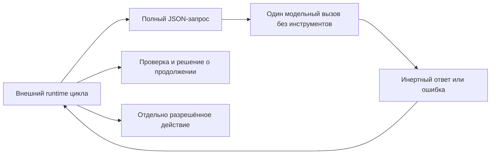

# Контракт чистого модельного шага

[Чистый модельный шаг](../Глоссарий/чистый-модельный-шаг.md) версии `1` — это один ограниченный вызов заранее выбранного провайдера: вызывающий контур передаёт весь доступный модели контекст как данные и получает один наблюдаемый текстовый результат либо структурированную ошибку. Провайдер не получает инструменты, файлы, сеть или право исполнять собственный вывод и не решает, продолжать ли [агентский цикл](../Глоссарий/агентский-цикл.md).

Слово «чистый» обозначает границу эффектов, а не математическую чистоту и не обязательную повторяемость реальной LLM. Детерминированность доказана только для проверочной заглушки. Два реальных адаптера LM Studio сохраняют инертный результат: совместимый CLI-профиль версии `1` доказывает process-границу, а отдельный бюджетный REST v0-профиль версии `2` добавляет исполнимый token limit, provider usage и атомарный reservation. Ни один из них не обещает повторяемость ответа. Любое действие, проверка, повтор, остановка и запись в [память FUM](../Глоссарий/память-FUM.md) принадлежат вызывающему runtime.

## Место в агентском цикле

Провайдер не читает ссылки из запроса и не восстанавливает контекст из файлов или прежней сессии. `messages` являются полным упорядоченным контекстом конкретного вызова. Возвращённый `output.content` остаётся недоверенным текстом: даже строка, похожая на команду, вызов инструмента или JSON действия, ничего не исполняет сама по себе.

## Конверт запроса версии 1

Структурная переносимая форма закреплена в [JSON Schema конверта версии 1](41-контракт-чистого-модельного-шага/схема-конверта-v1.json). Неизвестные поля запрещены; дополнительные байтовые пределы проверяет принимающая реализация, потому что JSON Schema считает длину строк не в UTF-8-байтах.

| Поле                          | Контракт                                                                                                                              |
| ----------------------------- | ------------------------------------------------------------------------------------------------------------------------------------- |
| `schema_version`              | Точное целое значение `1`.                                                                                                            |
| `invocation_id`               | Заданный вызывающим устойчивый технический идентификатор; провайдер не создаёт UUID сам.                                              |
| `provider`                    | Ожидаемые `kind`, `id`, `model` и `runtime`; несовпадение с загруженным провайдером закрывает вызов.                                  |
| `messages`                    | От `1` до `128` непустых сообщений `system`, `user` или `assistant`; среди них обязательно есть `user`.                               |
| `response_format`             | В версии `1` только `text`. Разбор предметного JSON принадлежит внешнему runtime.                                                     |
| `limits.max_output_bytes`     | Положительный предел ответа не более `65536` байт UTF-8; усечённый ответ не считается успехом.                                        |
| `limits.timeout_milliseconds` | Положительный бюджет не более `300000` мс; фактическое прерывание долгого процесса обеспечивает внешний адаптер.                      |
| `capabilities.tools`          | Только `false`.                                                                                                                       |
| `capabilities.files`          | Только `false`.                                                                                                                       |
| `capabilities.network`        | Только `false`; будущий локальный адаптер может обращаться лишь к отдельно разрешённому loopback-runtime вне интерфейса самой модели. |

Максимальный JSON-конверт и суммарное содержимое сообщений ограничены `1048576` байт. Версия `1` не содержит неявных значений сэмплирования. Для реальной LLM совместимый будущий профиль должен явно добавить версионированные параметры, сведения о поддержке seed и точную идентичность весов или честное значение `unknown`; профиль заглушки не выдаётся за такой адаптер.

## Успешный результат

Успех содержит тот же `invocation_id`, фактическую идентичность провайдера, `status = "completed"`, текст и `finish_reason = "stop"`. Поле `input_sha256` связывает результат с канонически сериализованным запросом, а `metrics` фиксирует сумму UTF-8-байтов сообщений и ответа.

В результате намеренно нет времени, автоматически созданных идентификаторов, локальных путей, скрытых рассуждений, `tool_calls` и утверждения о выполненном действии. Канонический JSON кодируется с отсортированными ключами, поэтому заглушка даёт побитово одинаковый stdout на одинаковом входе.

Реальный process-adapter дополнительно возвращает конверт попытки `schema_version = 1`. Он связывает `invocation_id` и `input_sha256` с паспортом фактически настроенного провайдера и содержит ровно один из двух исходов: `completed` с текстом и метриками либо `rejected` с типизированной безопасной причиной. Этот конверт не переопределяет строгий запрос версии `1` и не выдаётся за канонический байтовый профиль памяти.

## Ошибки и повтор

Невалидный вход, неизвестное поле, несовпадение провайдера и превышение лимита дают конверт `status = "rejected"` со стабильными `code`, публикационно чистым `message` и признаком `retryable`. Диагностика не включает сырой stderr внешнего процесса, секреты или локальные пути.

Версия `1` не повторяет вызов автоматически. Решение о повторе принимает внешний runtime после проверки кода ошибки, бюджета, идемпотентности и состояния задачи. Реальный адаптер различает `provider_unconfigured`, `provider_unavailable`, `provider_mismatch`, `provider_input_unsupported`, `provider_timed_out`, `provider_cancelled`, `output_limit_exceeded`, `provider_refused`, `provider_failed` и `provider_protocol_error`. Диагностика не включает сырой stderr, путь к исполняемому файлу или значения среды.

## Связь с трассой агентского цикла

[Минимальная трасса версии 1](37-минимальный-формат-трассы-исполняемого-агентского-цикла.md) в событии `task` хранит только `model_step.mode` и `provider_ref`. Для заглушки `mode` равен `stub`, а `provider_ref` может вести на этот контракт или паспорт конкретного провайдера.

Трасса версии `1` не содержит отдельного типа события модельного вызова. Поэтому полный конверт запроса и результата пока сохраняется отдельным наблюдаемым артефактом и не маскируется под выполненное действие. Включение модельного вызова в линейную трассу без потери его отличия от действия относится к будущему runtime либо новой версии формата трассы.

## Два режима повторения

[Воспроизведение принятого эпизода FUM](../Глоссарий/воспроизведение-принятого-эпизода-FUM.md) повторно не вызывает провайдер. Оно читает сохранённые точные конверты модельных ответов вместе с входами, действиями, наблюдениями, решениями и подтверждениями и проверяет, что версионные редукторы выводят то же принятое состояние. Такой режим может быть детерминированным даже для недетерминированной LLM.

[Повторное живое исполнение FUM](../Глоссарий/повторное-живое-исполнение-FUM.md) создаёт новый вызов провайдера из сопоставимого начального контекста. Его ответ является новым событием и не обязан совпадать побайтно с записанным ответом; устойчивость результата оценивается сравнительным протоколом. Хэш-равенство заглушки нельзя переносить на этот режим как гарантию реальной модели.

## Проверяемая заглушка

[Swift-прототип чистого модельного шага](../Прототипы/чистый-модельный-шаг/README.md) реализует `fum.deterministic-echo.v1`. Он строго разбирает конверт, сверяет ожидаемую идентичность провайдера, возвращает последнее сообщение `user`, проверяет байтовый лимит и печатает канонический JSON. Значения с shell-метасимволами остаются обычным текстом и не передаются shell.

Автономные тесты подтверждают:

- успешный UTF-8-вызов и точные байтовые метрики;
- побитовую повторяемость результата;
- изменение `input_sha256` при изменении явного контекста;
- отказ от неизвестных полей и любого значения `true` у возможностей с побочными эффектами;
- обязательное сообщение `user`;
- наблюдаемую ошибку превышения выхода;
- инертность shell-подобного текста.

Существующий [теневой редактор продолжений](../Прототипы/теневой-редактор-продолжений/README.md) остаётся частным свидетельством локального subprocess-вызова Ollama через stdin, loopback, предварительную проверку модели, тайм-аут, отмену и предел вывода. Он не объявлен реализацией общего контракта версии `1`: его идентичность runtime, весов и параметры генерации пока недостаточно полны.

Режим `Codex CLI` также не принят как чистый провайдер. Ограничение sandbox уменьшает доступные эффекты, но само по себе не доказывает отсутствие собственного агентского цикла, скрытых наблюдений и попыток вызвать инструменты. Для принятия нужен отдельный наблюдаемый режим одного модельного ответа без событий действий и продолжения цикла.

## Реальный профиль LM Studio CLI

Профиль `fum.lm-studio-cli.one-shot.v1` использует только документированный режим `lms chat --prompt`: один локальный процесс печатает ответ в stdout и завершается. Адаптер запускает исполняемый файл напрямую через `Process`, не использует shell, не передаёт инструменты или файлы, запрещает обращение CLI к каталогу, включает неинтерактивный режим и удерживает модель после ответа не более одной секунды. Текст stdout строго проверяется как UTF-8 и никогда не исполняется.

Паспорт каждой попытки содержит точный ключ выбранной модели, наблюдаемую версию CLI и приложения, версию адаптера, фактические байтовый лимит и тайм-аут, среду `local_process` и запреты `tools`, `files`, `network`, `executes_output`. LM Studio CLI этого профиля не раскрывает temperature, top-p, top-k, seed, максимальное число выходных токенов и SHA-256 весов, поэтому паспорт честно записывает для них `unknown`.

`lms chat --prompt` передаёт prompt через argv. Поэтому профиль ограничивает сериализованный контекст `65536` байтами, отклоняет U+0000 и явно не предназначен для чувствительного произвольного контекста. Полная последовательность ролей передаётся как детерминированный JSON-фрейм `FUM_MODEL_MESSAGES_V1`, а не сворачивается до последнего сообщения. Для чувствительного контекста потребуется отдельный stdin- или loopback-профиль.

Process-runner читает не более `max_output_bytes + 1`: ровно заданный предел допустим, а наблюдаемый лишний байт завершает процесс и даёт `output_limit_exceeded` без усечённого успеха. Тайм-аут и отмена вызывающим runtime завершают процесс и остаются различимыми. Нулевой код выхода не маскирует невалидный UTF-8 или пустой ответ; ненулевой код не раскрывает stderr.

Автономные тесты используют записанные process-исходы и системные процессы без модели, сети и секретов. Живое CLI-свидетельство было получено при выполнении FUM-STEP-0102; текущий пакет сохраняет для CLI автономные process-level проверки, а единственный действующий opt-in live-тест относится к REST v0-профилю. При отсутствии конфигурации CLI-адаптер возвращает `provider_unconfigured` и никогда не переключается на echo-заглушку.

## Исполнимый бюджетный профиль LM Studio REST v0

Профиль `fum.lm-studio-rest-v0.budgeted.v1` и результат попытки имеют `schema_version = 2`, а отдельная узкая Swift-форма `BudgetedModelOnlyInvocation` содержит один `input` без собственного поля версии. Эти публичные типы библиотеки не меняют значение строгого конверта версии `1` и пока не переносят его полный `messages`-контекст, `response_format`, JSON Schema и все паспортные поля. Их проверяемая роль уже: исполнить один бюджетированный вызов и сохранить usage либо типизированный отказ.

Профиль разрешает один явный канал адаптера `POST http://127.0.0.1:<порт>/api/v0/chat/completions`. Это новый независимо закреплённый текущей карточкой provider-интерфейс к уже установленным LM Studio и модели, а не неявное расширение прежнего допуска `fum.lm-studio-cli.one-shot.v1`. Значение `remote` можно строго сериализовать в профиль, но исполняемый adapter принимает только `local` и закрывается `invalid_profile` до tokenizer и provider даже при совпавшей remote-capability: remote-transport, источник цены и согласование денежного usage не реализованы. Модель по-прежнему не получает собственную сеть, инструменты, файлы или право исполнять вывод.

Профиль и отдельное токенизационное свидетельство совместно закрепляют:

| Группа                   | Закреплённые значения                                                                                                       |
| ------------------------ | --------------------------------------------------------------------------------------------------------------------------- |
| Исполнение               | `local | remote`, provider identity, provider interface, точный endpoint, model identity, runtime name и runtime version.   |
| Раскрытие                | Разрешённые классы данных, максимальный объём UTF-8-байтов и конечный allowlist назначений.                                  |
| Предварительная оценка   | Профиль хранит identity tokenizer и обязательный способ `exact`; свидетельство хранит `input_sha256` и точное число токенов. |
| Общий бюджет             | Максимумы вызовов, входных токенов, выходных токенов, wall-clock-миллисекунд, вычислительных единиц и денежных микроединиц. |
| Reservation одного шага  | Максимальный расход того же шестимерного вектора; вызов всегда резервирует ровно одну единицу `calls`.                      |
| Provider capability      | Точное поле `max_tokens` и доверенный источник `structured_provider_response`; отсутствие capability закрывает вызов.      |
| Единицы локального учёта | `compute_unit = wall_clock_millisecond`, `money_unit = none`; максимумы и reservation денег обязаны быть нулевыми.          |
| Долговечность            | Точное значение `process_memory`; межпроцессное восстановление этим профилем не заявляется.                                 |

Строгий decoder отклоняет неизвестные поля самого профиля, runtime identity, disclosure-политики, обоих бюджетов и invocation. До канонической JSON-сериализации и SHA-256 ограниченный prehash-этап сканирует не более фиксированного предела каждого поля: строки профиля ограничены `4096` UTF-8-байтами, список классов — `16` элементами, список назначений — `64` элементами по `1024` байта, `max_input_bytes` — `1048576`, а `invocation_id` и назначение invocation — `1024` байтами. Публичная exact-аттестация дополнительно обрывает просмотр входа на `28`-м байте и допускает только закреплённую 27-байтовую фикстуру. Превышение профильной границы даёт `invalid_profile`, invocation-границы — `disclosure_denied`; оба ранних отказа имеют `request_sha256 = nil`, не создают terminal ledger entry и reservation и не меняют бюджет; слишком длинные идентификаторы заменяются безопасными маркерами в ответе.

После prehash-этапа disclosure-проверка выполняется раньше tokenizer, reservation/операции `ledger.begin` и provider. Несовпадение режима, endpoint, provider-интерфейса, tokenizer identity, класса, объявленного объёма или назначения возвращает типизированный отказ без provider-вызова. Класс и назначение являются декларациями вызывающего контура: этот адаптер не умеет распознать секрет, ошибочно помеченный как `synthetic`. `max_tokens` строится только из неизменяемого профиля и не может быть повышен входным запросом или модельным текстом.

До отправки prompt проверяются статические identity и capability настроенного transport: режим, provider, интерфейс, endpoint, tokenizer и поддержка `max_tokens`/structured usage. Фактические model/runtime доступны только в provider-ответе и сверяются после отправки синтетического prompt на уже разрешённый точный loopback endpoint; несовпадение становится консервативным терминальным отказом, а не заявляется identity-preflight до раскрытия.

### Reservation и согласование

`VolatileModelBudgetLedger` является actor и одной операцией проверяет request hash, арифметику всех измерений, остаток и отсутствие другого активного reservation с тем же `invocation_id`, после чего сохраняет полный максимальный вектор. Раздельных операций `canAfford` и последующего небезопасного добавления нет. Конкурирующие вызовы поэтому не могут совместно превысить ceiling. Активные request hashes и terminal snapshots принадлежат ledger, поэтому повтор остаётся идемпотентным и после создания другого экземпляра adapter с тем же ledger.

После вызова адаптер читает только верхнеуровневые `usage.prompt_tokens`, `usage.completion_tokens` и `usage.total_tokens`, model identity, runtime name/version и `finish_reason`. Успешно согласованная попытка сохраняет SHA-256 точных байтов тела, переданных `URLSession` transport после обработки HTTP-передачи; status и headers в этот хэш не входят. Любой после-provider отказ, включая malformed JSON, несовместимую схему, отсутствие либо несогласованность usage или identity, даёт типизированный отказ без сохранённого digest. `message.content` остаётся недоверенным текстом: похожий на usage JSON внутри него не влияет на ledger. Входные и выходные токены согласуются с provider usage. Для локального профиля wall-clock и compute имеют одну измеримую единицу — миллисекунду: общий расход складывает время tokenizer и HTTP, а нулевая цена закреплена независимо.

Публичная исполняемая поверхность adapter принимает только встроенную аттестацию `PinnedModelOnlyExactTokenization.lmStudioQwen3SmallFixtureV1` и конкретный `LMStudioRESTV0BudgetTransport`; внедрение protocol-заглушек в adapter и transport доступно пакету только для автономных тестов, а сырые provider- и HTTP-методы не входят в public API. HTTP-клиент создаёт для каждого вызова ephemeral-сессию без cookie, credential storage, cache и системного proxy, не следует redirect, повторно проверяет конечный URL, задаёт один абсолютный resource timeout и прекращает чтение после `1048576` байт. Остаток provider deadline равен минимуму wall-clock- и compute-reservation за вычетом времени аттестации, а независимый monotonic clock повторно проверяется после transport. Поэтому произвольный зависающий tokenizer/transport не входит в исполняемую capability, а trickle-response не обходит общий предел.

Транспортно частичный ответ отделён от категории `invalid_response`, в которую входят полностью полученный malformed JSON и валидный JSON несовместимой схемы. Слишком большое тело, отсутствие usage, отрицательное значение, арифметическое переполнение wire-числа, неверная сумма token counters, превышение reservation и несовпадение identity также имеют типизированные терминальные отказы. Неоднозначный provider-исход списывает полный reservation и имеет `retryable = false`. Повтор завершённого сочетания `invocation_id + request_sha256` возвращает сохранённый terminal snapshot без tokenizer и provider; другой вход с тем же идентификатором даёт `invocation_conflict`. Простое ожидание внешнего подтверждения не обращается к ledger и не меняет счётчики.

### Предварительная токенизация

Интерфейс tokenizer создаёт отдельное свидетельство с `input_sha256`. Профиль допускает только метод `exact`, а фактический `prompt_tokens` обязан точно совпасть с preflight. В доступном локальном LM Studio REST v0 нет отдельного REST-tokenize-вызова, поэтому публично создаваемая capability намеренно ограничена одной константной аттестацией синтетической live-фикстуры: provider, interface и framing одного user-message, endpoint, model/runtime, строка `Return the single letter A.`, её SHA-256 и наблюдённые `14` входных токенов закреплены вместе. Произвольное число через публичный initializer передать нельзя; другой профиль, input или model закрывается до provider. Успешный opt-in-вызов повторно подтверждает равенство `prompt_tokens = 14`; универсальный tokenizer для произвольного контекста этим не заявляется.

Граница `process_memory` означает атомарность, конкурентную affordability и идемпотентность только в пределах жизни конкретного actor/process. Она не доказывает сохранение reservation после аварии процесса. Подтверждённое хранилище и межпроцессное возобновление относятся к отдельной карточке FUM-STEP-0110.

Автономные тесты используют записанные HTTP-ответы и concrete `URLSession`-фикстуры: они проверяют строгий профиль, disclosure, все бюджетные измерения, точный `max_tokens`, redirect-отказ, байтовый предел, точный SHA-256 полученных байтов тела, wire-overflow, общий deadline, конкурентные reservation и replay между экземплярами adapter без живой модели. Отдельный opt-in-тест на уже сохранённой локальной модели подтверждает точные model/runtime identity, `finish_reason = length`, выходной предел в один токен, `prompt_tokens = 14`, `completion_tokens = 1`, provider usage и наличие хэша тела правильного формата. Он не запускает сервер, не скачивает веса, не получает секреты, не использует платный доступ и передаёт только синтетический prompt.

## Граница применимости

Контракт, заглушка и два LM Studio-профиля доказывают переносимую границу данных, строгую валидацию, отсутствие предоставленных модели эффектов, process-level timeout/cancel, исполнимый REST-предел генерации, наблюдаемое provider usage и один живой локальный model-only-вызов. Они не доказывают качество LLM, пригодность оборудования, безопасность будущих действий, детерминизм реальной модели, межпроцессную долговечность budget ledger, вложение циклов, завершённость runtime FUM или пригодность `Codex CLI` как model-only-провайдера.

Обычный запуск прототипа остаётся автономным и использует заглушку. Живой режим запускается только явно, использует уже установленный локальный runtime и уже сохранённую модель, не скачивает веса, не обращается к платному сервису, не читает произвольные пользовательские файлы, не изменяет память и не начинает коробочную стадию.

## Источники требований

- [исходный запрос о закреплении исполнимого токен-бюджета](../Журнал/2026-07-31_18-05-50_MSK_закрепить-исполнимый-токен-бюджет-model-only-профиля/запрос.md)
- [исходный запрос об отключении автоматической публикации и поэтапного подтверждения](../Журнал/2026-07-31_16-31-18_MSK_отключить-автоматическую-публикацию-master/запрос.md)
- [исходный запрос 2026-07-27 20:45:59 MSK — Интегрировать критический анализ и приоритеты развития FUM](../Журнал/2026-07-27_20-45-59_MSK_интегрировать-критический-анализ-и-приоритеты-развития-FUM/запрос.md)
- [исходный запрос о подключении проверяемого реального model-only-адаптера](../Журнал/2026-07-29_23-53-42_MSK_подключить-проверяемый-реальный-model-only-адаптер/запрос.md)
- [исходный запрос текущей рабочей сессии](../Журнал/2026-07-23_18-12-05_MSK_проверить-контракт-чистого-модельного-шага-для-исполняемого-агентского-цикла/запрос.md)
- [MVP-кандидат исполняемого агентского цикла](../Планирование/MVP-кандидаты/04-исполняемый-агентский-цикл/README.md)
- [частично прояснённый вопрос о развилке гиперсети и агентского цикла FUM](../Вопросы/2026-07-03_15-36-48_MSK_развилка-гиперсети-и-агентского-цикла-FUM.md)
- [минимальный формат трассы исполняемого агентского цикла](37-минимальный-формат-трассы-исполняемого-агентского-цикла.md)
- [обзор актуальных реализаций агентских циклов](06-обзор-агентских-циклов.md)

## Опорные материалы

- [локальный агент FUM на выделенной машине](24-локальный-агент-на-выделенной-машине.md)
- [теневой редактор продолжений](../Прототипы/теневой-редактор-продолжений/README.md)

<!-- FUM-MD-RECENCY:BEGIN -->
<!-- last-content-edit: 2026-08-03 14:54:04 MSK -->
<!-- content-sha256: sha256:31db499e8b8b238a8712b68a244150e923da17b4300562daaaa5c57f4018854a -->
<!-- FUM-MD-RECENCY:END -->
