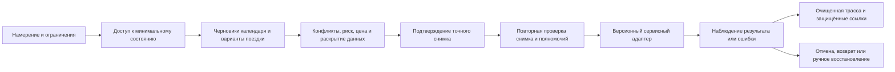

# Паспорт [календарно-транспортного сервисного контура](../Глоссарий/календарно-транспортный-сервисный-контур.md) личного FUM-агента

Паспорт версии `1` задаёт зонтичный контракт, по которому [личный FUM-агент](../Глоссарий/личный-FUM-агент.md) сможет связывать календарь, расписание и поездку в один проверяемый сценарий. Контур принимает намерение человека, читает только доступное состояние, моделирует варианты, отделяет черновик от внешнего эффекта, связывает подтверждение с точным снимком действия, проверяет ответ адаптера и сохраняет очищенное происхождение результата.

Текущая материализация паспорта ограничена синтетическими фикстурами и детерминированным симулятором класса `R0`. Она не подключает сеть, реальные календари, карты, такси, билетные или платёжные сервисы, не отправляет уведомления, не передаёт геолокацию и не изменяет физическое или внешнее состояние. Даже полностью совпавшее подтверждение в фикстуре разрешает только симулированный ответ с жёсткими инвариантами `simulation_only = true`, `external_effect = "none"` и `external_effects = []`.

## Назначение и граница версии

Паспорт охватывает общий ход одного календарно-транспортного намерения:



Версия `1` определяет общие инварианты, модель операций, доступ, подтверждение, ошибки, отмену, происхождение и локальную приёмку. Она не выбирает поставщиков, протоколы авторизации, реальные API, юридическую ответственность, срок хранения персональных данных, криптографический формат защищённых ссылок, универсальную оценку безопасности маршрута или политику автономии для повторяющихся действий.

Конкретный календарный, картографический, таксомоторный, билетный, платёжный или уведомительный адаптер требует собственного паспорта. Такой паспорт должен закрепить версию команд и наблюдений, авторизацию, категории передаваемых данных, идемпотентность, состояние эффекта, квитанции, тайм-ауты, сверку, отмену и отличия тестового двойника от поставщика. Успех нынешнего симулятора не доказывает соответствие будущего адаптера.

## Единица операции

Одна операция относится к одному неизменному снимку плана. Минимальная запись содержит:

- `operation_id` и `intent_id`, связывающие действие с исходным намерением;
- вид операции и точную версию адаптера;
- `state_fingerprint` входного состояния и `terms_version` условий поставщика;
- время, часовой пояс, участников и объекты как защищённые ссылки, а не публикационные сырые значения;
- категории данных, которые будут прочитаны, использованы или переданы;
- цену в минимальных единицах и валюту либо явное отсутствие цены;
- требуемые информационные права и отдельное операционное полномочие;
- срок актуальности, правило повтора, ключ идемпотентности и способ проверки эффекта;
- условия отмены, возможный штраф, возврат и компенсационные действия;
- подтверждение, результат, ошибку и проверку результата как отдельные события происхождения.

Изменение времени, часового пояса, маршрута, поставщика, участников, цены, валюты, условий возврата, состава операций, категорий раскрываемых данных или входного состояния выпускает новый снимок. Прежнее подтверждение к нему не переносится.

## Локальные классы эффекта

Классы `S0–S5` являются словарём этого паспорта, а не общим разрешением FUM:

| Класс | Операция                                                                                       | Минимальный барьер версии `1`                                                                                                   |
| ----- | ---------------------------------------------------------------------------------------------- | ------------------------------------------------------------------------------------------------------------------------------- |
| `S0`  | Локальное чтение уже разрешённой фикстуры, расчёт, сравнение и черновик без передачи наружу.   | Проверить информационный доступ и сохранить источник; отдельное подтверждение действия не требуется.                            |
| `S1`  | Внешнее чтение, способное раскрыть сервису время, место, контакт или иной приватный контекст.  | Отдельно проверить право передачи и точный получатель; реальный вызов в версии `1` запрещён.                                    |
| `S2`  | Обратимая запись в личный календарь, напоминание или иной собственный сервис.                  | Явное подтверждение точного снимка; заранее разрешённая политика в версии `1` не исполняется.                                   |
| `S3`  | Изменение состояния другого участника или отправка ему уведомления.                            | Подтверждение содержания, адресата и раскрываемых категорий; право записи не выводится из права чтения.                         |
| `S4`  | Заказ такси, покупка билета, бронирование, платёж либо физически значимое продолжение.         | Явное подтверждение цены, условий и данных; для реального транспорта также отдельный барьер класса не ниже `R3`.                |
| `S5`  | Отмена, возврат, компенсация или повторная сверка после частичного либо неоднозначного исхода. | Новый точный снимок; подтверждение обязательно при штрафе, возврате, сообщении третьей стороне или ином дополнительном эффекте. |

«Чтение» не образует один безопасный класс. Локальное чтение уже доступной фикстуры не раскрывает данные, а запрос маршрута внешнему поставщику может передать местоположение, время и поведенческий контекст. Поэтому информационный эффект оценивается отдельно от HTTP-метода или названия операции.

## Матрица сервисных областей

| Область               | Чтение и моделирование                                          | Возможный внешний эффект                                                         | Подтверждение и проверка                                                                                                                 | Отмена и восстановление                                                                                        |
| --------------------- | --------------------------------------------------------------- | -------------------------------------------------------------------------------- | ---------------------------------------------------------------------------------------------------------------------------------------- | -------------------------------------------------------------------------------------------------------------- |
| Календари             | `free/busy`, доступные события, черновик события и напоминаний. | Создание, изменение или удаление события; приглашение участников.                | Снимок времени, зоны, календаря, участников и раскрываемых полей; после записи — чтение версии события.                                  | Компенсационная запись или удаление с отдельным учётом уже отправленных приглашений.                           |
| Расписания            | Публичное или разрешённое расписание, интервалы и пересадки.    | Передача поискового контекста поставщику; зависимый выбор рейса или сеанса.      | Свежесть источника, зона времени и идентичность версии; результат поиска не равен бронированию.                                          | Обновить модель, не объявляя прежний вариант доступным; зависимые действия вернуть к проверке.                 |
| Карты и маршруты      | Геокодирование фикстуры, ETA, варианты пути и запас времени.    | Раскрытие исходной точки, назначения, времени, предпочтений и текущего места.    | Согласовать категории и гранулярность местоположения; неизвестный или опасный маршрут блокирует автоматическое продолжение.              | Перестроить только модель; уже сделанные заказы и билеты отменяются отдельными операциями.                     |
| Такси                 | Синтетическая оценка цены, времени подачи и класса услуги.      | Передача точной геолокации и контакта, заказ, платёж, движение автомобиля.       | Точный поставщик, точки, окно, цена, валюта, условия отмены и срок предложения; затем сверка заказа по идемпотентному ключу.             | Отдельная отмена, наблюдаемая квитанция, штраф и статус возврата; тайм-аут не разрешает слепой повтор.         |
| Билеты и бронирования | Поиск синтетических вариантов, мест, тарифов и правил возврата. | Удержание места, передача идентификационных данных, покупка и договорный эффект. | Подтвердить пассажира как защищённую ссылку, сегмент, тариф, цену, валюту и правила; изменение любого поля требует нового подтверждения. | Раздельные статусы отмены брони, возврата денег и уведомления; отмена не считается мгновенным откатом.         |
| Уведомления           | Черновик сообщения, канал, адресат и время отправки.            | Локальный показ, внешняя доставка, изменение состояния другого участника.        | Различать `scheduled`, `sent`, `delivered` и `acknowledged`; подтвердить адресата, содержание и канал.                                   | Отменить можно только ещё не выполненную отправку; уже раскрытое сообщение не отзывается из памяти получателя. |

## Доступ и операционные полномочия

[Уровень доступа](../Глоссарий/уровень-доступа.md) задаётся для каждого источника и результата как `публичный`, `ограниченный`, `приватный` или `закрытый`. Рядом перечисляются допустимые чтение, использование, изменение, публикация и передача. Производное состояние наследует наиболее строгую границу своих источников, пока отдельная проверка не докажет безопасное ослабление.

Информационный доступ не является полномочием на действие. Контур ведёт отдельно:

- право прочитать `free/busy`, расписание, маршрутную фикстуру или защищённую ссылку;
- право использовать сведения внутри локальной модели;
- право раскрыть выбранные категории конкретному адаптеру;
- право изменить собственный сервис;
- право затронуть другого участника;
- право подтвердить платное, договорное или физически значимое действие;
- право остановить, отменить, сверить, восстановить и проверить результат.

Ни личный FUM-агент, ни адаптер не считаются авторизующим субъектом по умолчанию. Отсутствующее, отозванное, просроченное или не относящееся к снимку право приводит к остановке до вызова адаптера.

## Контракт подтверждения

Подтверждение версии `1` связывается как минимум со следующими полями:

- `confirmation_id`, подтверждающий субъект и наблюдаемое время;
- `operation_id`, `state_fingerprint`, версия адаптера и `terms_version`;
- точные операции, поставщик, адресаты и срок действия;
- время, часовой пояс, маршрут и участники через защищённые ссылки;
- `amount_minor`, валюта, верхняя граница стоимости, штраф и правила возврата;
- полный набор категорий данных, которые будут переданы;
- ключ идемпотентности, предел повторов и способ отзыва.

Предстартовая проверка повторно сравнивает весь снимок. Несовпадение не пытается угадать намерение человека и возвращает `reconfirmation_required`. Фикстура изменения цены одновременно меняет цену, условия и отпечаток состояния и подтверждает этот fail-closed-переход.

Общий [открытый вопрос о границах календарно-транспортных действий](../Вопросы/2026-07-03_09-03-59_MSK_границы-календарно-транспортных-действий-FUM.md) пока не определяет, когда заранее заданная политика автономии может заменить явное подтверждение. Поэтому версия `1` не исполняет такую политику. Будущий контракт должен сделать её версионной, отзывной и ограниченной по операции, сумме, валюте, времени, месту, поставщику, участникам, категориям данных, риску и числу повторов; выход за любой предел возвращает явное подтверждение.

## Состояния, ошибки и отмены

Перед потенциальным эффектом реальный контур обязан долговечно связать намерение, точный снимок, доступ и подтверждение. Только после этого допустим версионный вызов с идемпотентным ключом. Ответ адаптера и независимая сверка состояния являются отдельными событиями: запись попытки не доказывает успех, а локальный тайм-аут не доказывает отсутствие внешнего эффекта.

| Состояние или ошибка                            | Решение                                                                                                                               |
| ----------------------------------------------- | ------------------------------------------------------------------------------------------------------------------------------------- |
| Нет доступа или адаптера                        | Показать недоступную часть и безопасный ручной шаг; не имитировать результат.                                                         |
| Приватный конфликт расписания                   | Сообщить только разрешённый факт `busy`; не раскрывать название, участников, место, заметки и защищённое происхождение.               |
| Неизвестный или опасный маршрут                 | Остановить продолжение, показать безопасное резюме риска и варианты; не объявлять универсальную безопасность.                         |
| Нет подтверждения                               | Вернуть `confirmation_required`; адаптер не вызывается даже в фикстуре.                                                               |
| Снимок или срок подтверждения не совпал         | Вернуть `reconfirmation_required`; старое подтверждение сохраняется только как происхождение отказа.                                  |
| Сеть или сервис недоступны до эффекта           | Зафиксировать безопасный код; разрешить повтор только после нового preflight и при доказанном отсутствии эффекта.                     |
| Тайм-аут после отправки                         | Пометить состояние эффекта как `unknown`, запросить статус по идемпотентному ключу и запретить слепой повтор заказа или оплаты.       |
| Частичный успех зависимых операций              | Хранить состояние каждого шага; не объявлять сценарий завершённым и предложить отдельные компенсационные действия.                    |
| Отмена принята                                  | Отдельно наблюдать отмену заказа, штраф, создание возврата, завершение возврата и уведомление участников.                             |
| Отмена отклонена или опоздала                   | Сохранить действующий внешний эффект и безопасные варианты ручного вмешательства; не маскировать отказ локальным удалением намерения. |
| Не удалось сохранить обязательное происхождение | До внешнего вызова — остановиться; после возможного эффекта — сохранить `unknown`, выполнить сверку и не создавать ложный успех.      |

Для будущих ошибок минимальны поля `code`, `stage`, `retryable`, `side_effect_state`, безопасное резюме, ссылки на свидетельства и варианты восстановления. `side_effect_state` различает `none`, `not_applied`, `applied` и `unknown`; только первые два могут разрешить повтор после нового preflight.

Отмена является новым действием, а не перемоткой истории. Уже отправленное приглашение, раскрытая геолокация, использованный билет или выполненная поездка не исчезают из внешнего мира из-за локального статуса `cancelled`.

## Происхождение и приватность

Очищенная трасса должна позволять восстановить наблюдаемую цепочку без публикации частной жизни:

1. намерение и его публикационно безопасный идентификатор;
2. версии и защищённые ссылки прочитанных источников;
3. предложенные варианты и точный отпечаток выбранного состояния;
4. доступ, подтверждение и основание операционного полномочия;
5. адаптер, версия, операция и идемпотентный ключ;
6. попытка до эффекта, ответ, ошибка, сверка и фактический статус;
7. отмена, компенсация, возврат и остаточное состояние.

Публичная [память FUM](../Глоссарий/память-FUM.md) хранит паспорт, схемы, синтетические фикстуры, безопасные коды и агрегированные результаты проверок. Реальные места, точные интервалы, названия событий, участники, контакты, документы, идентификаторы заказов, платёжные сведения, токены и сырые ответы остаются в приватной или закрытой памяти, защищённом хранилище либо внешнем сервисе.

Публикационная трасса использует непрозрачную ссылку на защищённый объект и минимальное резюме. Обычный SHA-256 низкоэнтропийного приватного значения сам по себе не считается безопасной ссылкой: его можно перебирать. Нужен непрозрачный идентификатор, ключевой дайджест либо иной механизм защищённого слоя, чей точный выбор версия `1` не задаёт.

Если закрытое событие создаёт конфликт, наружу попадает только разрешённая политикой гранулярность занятости. Даже точный интервал может быть чувствительным; уровень `busy` в фикстуре доказывает лишь отсутствие названия, места и участников в публичном отчёте, а не универсальную достаточность такой редакции.

## Фикстуры и детерминированный симулятор

[JSON Schema набора фикстур](42-паспорт-календарно-транспортного-сервисного-контура-личного-FUM-агента/схема-набора-фикстур-v1.json) запрещает неизвестные поля и закрепляет точные виды операций, доступа, подтверждения, условий, ответов адаптера и ожидаемых решений. [Набор из десяти сценариев](42-паспорт-календарно-транспортного-сервисного-контура-личного-FUM-агента/фикстуры-сценариев-v1.json) использует фиксированное время `2030-01-15T09:00:00Z`, тестовую валюту `XTS` и только строки с явным префиксом `SYNTHETIC_PRIVATE_` для чувствительных значений.

[Симулятор версии 1](42-паспорт-календарно-транспортного-сервисного-контура-личного-FUM-агента/симулятор-v1.py) читает локальный набор, строго проверяет структуру, применяет матрицу доступа, защитные условия и подтверждение, затем возвращает канонически упорядоченный JSON-отчёт. Он не импортирует сетевой клиент, не вызывает subprocess, не пишет файлы, не читает системные календари и не использует настенные часы среды.

Запуск всех сценариев:

```bash
python3 Документация/42-паспорт-календарно-транспортного-сервисного-контура-личного-FUM-агента/симулятор-v1.py --pretty
```

Запуск одной фикстуры:

```bash
python3 Документация/42-паспорт-календарно-транспортного-сервисного-контура-личного-FUM-агента/симулятор-v1.py \
  --fixture-id taxi-order.confirmed \
  --pretty
```

| Фикстура                            | Проверяемый исход                                                                                 |
| ----------------------------------- | ------------------------------------------------------------------------------------------------- |
| `route-model.no-effect`             | Маршрут моделируется при доступе, но внешний эффект остаётся пустым.                              |
| `taxi-order.confirmation-missing`   | Заказ останавливается до фикстурного адаптера без явного подтверждения.                           |
| `taxi-order.confirmed`              | Точный снимок допускает один симулированный ответ, но не реальный заказ.                          |
| `ticket-purchase.price-changed`     | Изменение цены, условий и отпечатка требует нового подтверждения.                                 |
| `calendar-write.private-conflict`   | Публичный отчёт содержит только `busy`, а закрытые детали не покидают вход.                       |
| `notification-send.access-missing`  | Отсутствующее право передачи блокирует уведомление раньше подтверждения.                          |
| `schedule-read.adapter-error`       | Ошибка расписания сохраняется отдельно от результата и не становится выдуманным расписанием.      |
| `ticket-cancel.confirmed`           | Отмена моделируется как отдельное подтверждённое действие с собственным исходом.                  |
| `route-model.unsafe`                | Опасный маршрут блокирует продолжение даже без платного действия.                                 |
| `calendar-read.network-unavailable` | Недоступность сети возвращает ошибку без подмены кэшем и без утверждения об актуальном календаре. |

[Автономный тестовый набор](42-паспорт-календарно-транспортного-сервисного-контура-личного-FUM-агента/тест-симулятора-v1.py) проверяет все ожидаемые решения, неизменный нулевой внешний эффект, порядок событий, происхождение, редакцию каждого синтетического приватного значения, рассогласованный и просроченный снимок подтверждения и безопасный отказ неизвестной операции.

```bash
python3 Документация/42-паспорт-календарно-транспортного-сервисного-контура-личного-FUM-агента/тест-симулятора-v1.py
```

Первый TDD-прогон ожидаемо завершился отсутствием `симулятор-v1.py`. После реализации семь тестов прошли на всех десяти фикстурах. Это доказывает только детерминированность текущей модельной политики и отсутствие сырых значений фикстуры в сформированном отчёте; тест не наблюдает системный сетевой стек и потому не является доказательством аппаратной сетевой изоляции Python-процесса.

## Граница применимости

Версия `1` является документационным и модельным результатом `R0`. Реальный транспорт относится как минимум к классу `R3` [карты ограничителей физического действия FUM](40-карта-ограничителей-физического-действия-FUM.md) и остаётся закрыт до отдельного дословного требования, отраслевого контракта, правовых и договорных оснований, назначения ответственности, паспортов адаптеров и проверяемого подтверждения точного действия.

Паспорт не утверждает, что маршрут безопасен, расписание актуально, поставщик выполнил действие, платёж прошёл, уведомление доставлено или отмена завершилась. Он не разрешает начало [коробочной реализации FUM](../Глоссарий/коробочная-реализация-FUM.md) и не закрывает открытый вопрос об автономии. Фикстурный `simulated_success` означает лишь, что синтетический ответ достигнут по локальной ветви правил при `external_effects = []`.

## Источники требований

- [исходный запрос текущей рабочей сессии](../Журнал/2026-07-24_09-17-50_MSK_подготовить-паспорт-календарно-транспортного-сервисного-контура-личного-FUM-агента/запрос.md)
- [карточка FUM-STEP-0007](../Планирование/карточки-шагов/✅-FUM-STEP-0007-подготовить-паспорт-календарно-транспортного-сервисного-контура-личного-FUM-агента.md)
- [исходный запрос о календарях, расписаниях, такси и поездках](../Журнал/2026-07-03_09-03-59_MSK_описать-календарно-транспортные-действия-FUM/запрос.md)
- [пользовательская история календаря, расписания и поездок](31-пользовательские-истории-FUM/вести-календари-и-планировать-поездки.md)
- [открытый вопрос о границах календарно-транспортных действий](../Вопросы/2026-07-03_09-03-59_MSK_границы-календарно-транспортных-действий-FUM.md)

## Опорные материалы

- [FUM как единая точка взаимодействия с компьютером](19-единая-точка-взаимодействия-с-компьютером.md)
- [Интерфейс FUM-узла](25-интерфейс-FUM-узла.md)
- [Минимальный формат трассы исполняемого агентского цикла](37-минимальный-формат-трассы-исполняемого-агентского-цикла.md)
- [Минимальный формат преобразования между наблюдателями FUM](38-минимальный-формат-преобразования-между-наблюдателями-FUM.md)
- [Минимальный паспорт передаваемого результата FUM](39-минимальный-паспорт-передаваемого-результата-FUM.md)
- [Карта ограничителей физического действия FUM](40-карта-ограничителей-физического-действия-FUM.md)
- [Контракт чистого модельного шага](41-контракт-чистого-модельного-шага.md)
- [шаблон сценария модельной среды](../Планирование/шаблон-сценария-модельной-среды.md)

<!-- FUM-MD-RECENCY:BEGIN -->
<!-- last-content-edit: 2026-08-03 14:54:04 MSK -->
<!-- content-sha256: sha256:a4a1c19adaabf63240d2f7f8d892e09abfe6ee536b671df32ae5231ca79da7bc -->
<!-- FUM-MD-RECENCY:END -->
