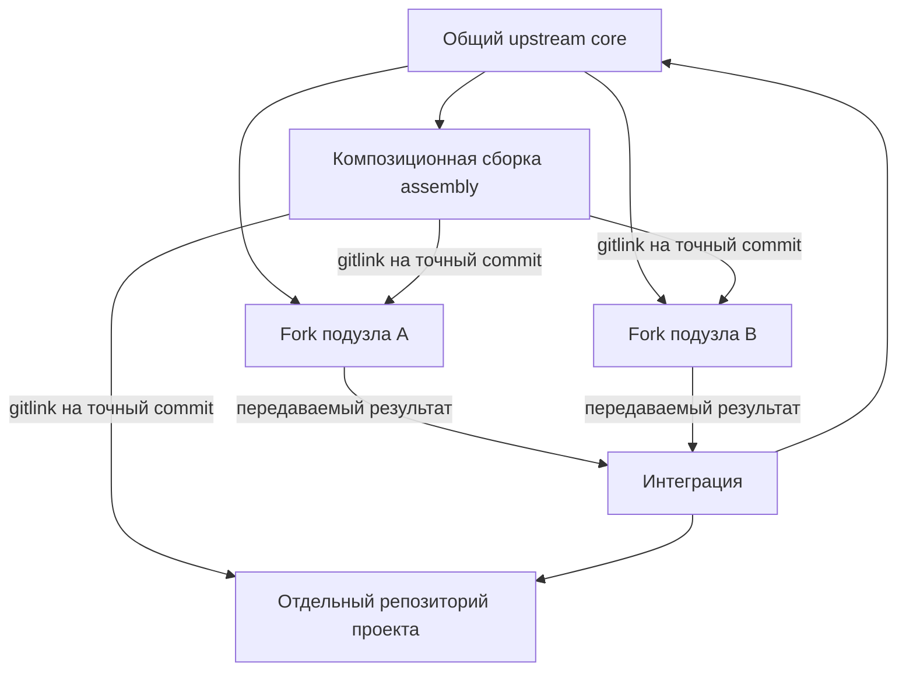

# Репозиторный граф пишущих подузлов и проектов FUM

[FUM](../Глоссарий/FUM.md) должен сохранять содержательную работу специализированных исполнителей не только в сообщениях одной сессии, но и в проверяемых Git-коммитах. Для этого долговечные [подузлы](../Глоссарий/подузел-FUM.md) и проекты получают собственные репозитории, а краткоживущие пишущие исполнители работают в изолированных клонах и передают результат через точные объекты Git.

Эта архитектура описывает целевой репозиторный граф. Она не объявляет уже созданными fork-репозитории, submodule, реестры или распределённый исполнительный runtime.

## Ядро и композиционная сборка

Общий upstream FUM и конкретная сборка сети выполняют разные функции.

- **Ядро (`core`)** хранит публикационно чистые общие правила, схемы, документацию, инструменты и переносимые улучшения. В нём нет графа живых экземпляров подузлов и проектов конкретного владельца.
- **Композиционная сборка (`assembly`)** является отдельным superproject конкретного составного узла. Она подключает ядро, долговечные подузлы и проекты как Git submodule и фиксирует согласованный снимок их ревизий.

Такое разделение предотвращает рекурсивное самовключение. Если подузел является fork того же репозитория, который уже содержит его как submodule, обычное наследование родительской ветки способно внести в подузел ссылку на него самого и на всю родительскую сборку. Поэтому подузлы должны наследовать чистое ядро, а не ветку assembly с графом экземпляров.

## Долговечный специализированный подузел

Долговечный подузел является не процессом и не веткой родительского checkout, а отдельным fork-репозиторием ядра. Он имеет устойчивый идентификатор, собственные специализацию, память, разрешения, проверки и историю. Его основная ветка может жить дольше отдельных модельных сессий, а новые сессии восстанавливают работу из сохранённых артефактов, не полагаясь на скрытую историю чата.

Композиционная сборка не копирует внутреннюю историю подузла и не получает над ним неявную тотальную власть. Она наблюдает и принимает конкретную ревизию через gitlink. Улучшение, полезное общему ядру, передаётся вверх отдельной публикационно чистой веткой или другим [передаваемым результатом FUM](../Глоссарий/передаваемый-результат-FUM.md), а не слиянием всей специализированной памяти подузла.

## Проект как самостоятельный репозиторий

Проект имеет собственный репозиторий, устойчивый идентификатор, паспорт, основную ветку, требования, проверки и границы доступа. Путь `Проекты/<идентификатор>/` в assembly является точкой подключения submodule, а не обычным каталогом проекта внутри ветки общей памяти.

Роль проекта и роль подузла не совпадают автоматически. Подузел является исполнителем со специализацией и долговременной памятью; проект является целевой областью результатов. Один подузел может работать над несколькими проектами, несколько подузлов — над одним проектом, а репозиторий, совмещающий обе роли, должен объявлять их раздельно.

## Точный gitlink вместо живой ветки

Git submodule фиксирует в дереве родителя точный commit дочернего репозитория. Даже если в `.gitmodules` указана рекомендуемая ветка, gitlink не начинает автоматически следовать за её вершиной. Долговечная ветка живёт в fork или проектном remote, а commit assembly закрепляет только принятый снимок.

Обновление submodule допустимо после того, как выбранный commit опубликован либо иначе надёжно сохранён и достижим из разрешённого источника. Неявное `update --remote` не является выбором следующего состояния FUM: новая ревизия проходит проверку, отбор и отдельное обновление gitlink.

## Изолированное исполнение шагов

Краткоживущий пишущий исполнитель получает контекстно ограниченный рабочий пакет с точными идентификаторами подузла, проекта и шага, целевым репозиторием, базовым commit, целевой веткой, разрешёнными путями, входами, проверками и формой передачи.

Для каждой параллельной попытки создаётся отдельный одноразовый клон целевого репозитория и уникальная ветка вида `step/<step-id>/<attempt-id>` от закреплённого базового commit. Исполнители не меняют общий checkout, индекс или ветку друг друга. Worktree допустим как оптимизация только там, где общая объектная база и refs уже защищены отдельным доказанным контрактом; базовой границей изоляции остаётся клон.

Содержательный результат попытки фиксируется одним или несколькими коммитами вместе с наблюдаемым происхождением и проверками. Отрицательный результат, возражение или неустранённый конфликт также сохраняются, если они дают проверяемую информацию. Скрытые рассуждения модели, машинный шум и секреты не становятся памятью только ради увеличения числа коммитов.

## Передача и принятие результата

Передача между репозиториями проходит как восстанавливаемая последовательность, потому что Git не предоставляет одной атомарной транзакции для нескольких независимых репозиториев.

1. Пишущий подузел создаёт commit в изолированной ветке и закрепляет паспорт результата с исходным и целевым репозиториями, базовым и результирующим commit, проверками и ограничениями доступа.
2. Commit публикуется или сохраняется в постоянном источнике, из которого его достижимость можно проверить.
3. Интегратор в отдельном клоне целевого репозитория повторяет проверки, выполняет слияние, cherry-pick или явное преобразование и последовательно обновляет целевую ветку.
4. После принятия результата assembly отдельным коммитом обновляет gitlink подузла или проекта.

Сбой между этапами не угадывается как успех. Промежуточное состояние сохраняется как подготовленное, опубликованное, принятое в целевой репозиторий либо продвинутое в assembly; повторный запуск продолжает с последней доказанной границы.

## Разрешение конфликтов

Автоматическое устранение merge-конфликтов является проверяемым конвейером, а не безусловным выбором одной стороны.

- Непересекающиеся изменения объединяются обычным Git-слиянием.
- Структурированные реестры объединяются по устойчивым идентификаторам, а производные индексы пересобираются из источников.
- Конфликт двух gitlink одного submodule разрешается автоматически только когда один дочерний commit является предком другого; выбирается потомок.
- Расходящиеся дочерние commits сначала объединяются внутри дочернего репозитория, и только затем assembly получает новый gitlink.
- Изменение пути или URL submodule требует повторной проверки идентичности, доступа и публикационной допустимости.
- Смысловой конфликт получает отдельный рабочий пакет разрешения с точными `base`, `ours` и `theirs`; при недостатке оснований результатом остаётся `unresolved_conflict`.

Любое автоматическое разрешение создаёт новый commit, сохраняет применённый способ и проходит целевые проверки. Чистый текстовый merge без конфликтных маркеров сам по себе не доказывает смысловую совместимость.

## Инварианты репозиторного графа

- Идентичность подузла и проекта задаётся устойчивым идентификатором, а не URL, локальным путём, веткой или текущей сессией.
- Материализуемые рёбра submodule образуют ациклический граф; fork-происхождение может указывать к ядру, но не считается ребром вложения.
- Assembly не входит в собственное транзитивное поддерево, а подузел не наследует граф экземпляров своего родителя.
- Каждый gitlink указывает на точный достижимый commit разрешённого репозитория.
- Параллельные писатели используют разные клоны и уникальные refs; принятие в одну целевую ветку сериализуется.
- Локальная FIFO-очередь одного checkout не выдаётся за координацию отдельных клонов или удалённых refs.
- Устаревший базовый commit, изменившийся целевой ref или несовпавший паспорт останавливают интеграцию до нового поколения попытки.
- Публичная assembly не раскрывает URL, имена или gitlink приватных подузлов и проектов. Смешанный по доступу граф хранится в приватной assembly либо публикует только явно разрешённые обезличенные результаты.
- Commit подузла подтверждает происхождение вклада, но не доказывает независимость модели, истинность результата или право на слияние.

## Граница текущего прототипа

Текущие субагенты Codex разделяют рабочее дерево корневой задачи и поэтому не являются описанными здесь самостоятельными пишущими подузлами. Действующий запрет менять ими Git-индекс, refs и историю остаётся необходимым. Целевая схема требует нового исполнительного класса: отдельной корневой задачи в отдельном клоне с собственным рабочим пакетом, после которой родитель принимает только опубликованный commit и паспорт.

Существующие карточки шагов, паспорта результатов, происхождение вкладов и проверки дают основу для такого контура, но ещё не содержат полного репозиторного адреса, межрепозиторной интеграционной очереди, восстановления двухфазной передачи и проверки ацикличности графа.

## Источники требований

- [исходный запрос 2026-07-26 12:59:08 MSK — Спроектировать Git-граф пишущих субагентов и проектов](../Запросы/2026-07-26_12-59-08_MSK_спроектировать-Git-граф-пишущих-субагентов-и-проектов.md)

## Опорные документы

- [Параллельная работа и слияние](04-параллельная-работа-и-слияние.md)
- [Git-инфраструктура эволюционных цепочек FUM](20-Git-инфраструктура-эволюционных-цепочек-FUM.md)
- [Публичный upstream и форки памяти FUM](27-публичный-upstream-и-форки-памяти.md)
- [Паспорт документационного прототипа и первого коробочного среза FUM](36-паспорт-документационного-прототипа-и-первого-коробочного-среза.md)
- [Минимальный паспорт передаваемого результата FUM](39-минимальный-паспорт-передаваемого-результата-FUM.md)

<!-- FUM-MD-RECENCY:BEGIN -->
<!-- last-content-edit: 2026-07-26 13:32:56 MSK -->
<!-- content-sha256: sha256:e552a855d3d280ff2b21b224e73520c793e2947e4611dc395eb76631190eee46 -->
<!-- FUM-MD-RECENCY:END -->
