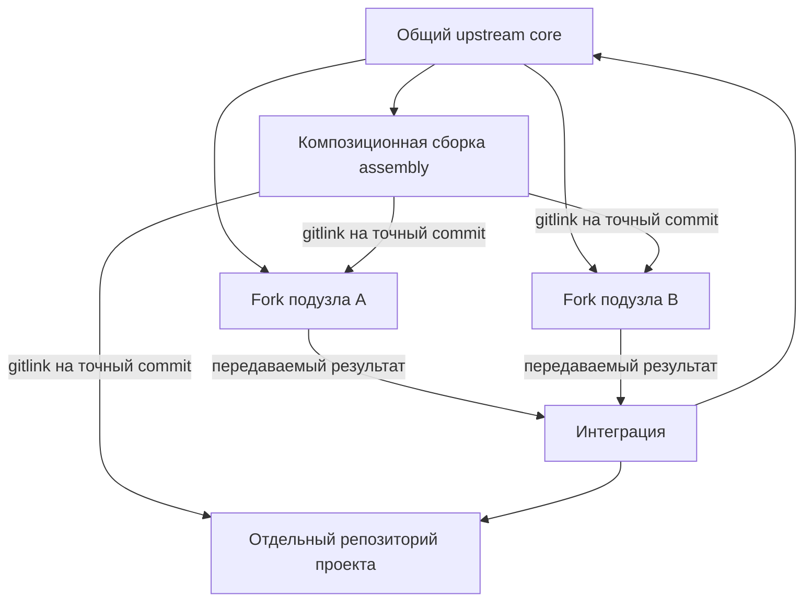

# Репозиторный граф пишущих подузлов и проектов FUM

Эксплуатационный статус: этот документ сохраняет целевую архитектуру fork-репозиториев, worktree-пула, FIFO, continuation, review/integration/candidate/CAS и публикации. Контур отложен и не даёт права записи в текущем репозитории; действующая работа выполняется одной вручную запущенной пишущей сессией в первичном checkout `refs/heads/master`.

[FUM](../Глоссарий/FUM.md) должен сохранять содержательную работу универсальных исполнителей с разными контекстными ролями не только в сообщениях одной сессии, но и в проверяемых Git-коммитах. Для этого долговечные [подузлы](../Глоссарий/подузел-FUM.md) и проекты получают собственные репозитории. В локальном профиле одного репозитория независимые параллельные линии работают в переиспользуемых linked worktree `Подузлы/слот-*`, а последовательные сессии одной линии передают друг другу те же физический слот, полный ref и worktree. Самостоятельные репозитории по-прежнему используют отдельные живые клоны для своих линейных цепочек.

Эта архитектура описывает целевой репозиторный граф и [репозиторную композицию FUM](../Глоссарий/репозиторная-композиция-FUM.md). Единый автономный стенд на временных локальных bare-репозиториях уже замыкает сквозную приёмку двух параллельных пишущих кандидатов, CAS-интеграции, ограниченного resolver, долговечного fork-подузла, самостоятельного проекта и точных родительских gitlink. Стенд не объявляет созданными внешние долговечные ресурсы, реальный проектный submodule или распределённый исполнительный runtime.

## Ядро и композиционная сборка

Общий upstream FUM и конкретная сборка сети выполняют разные функции.

- **Ядро (`core`)** хранит публикационно чистые общие правила, схемы, документацию, инструменты и переносимые улучшения. В нём нет графа живых экземпляров подузлов и проектов конкретного владельца.
- **Композиционная сборка (`assembly`)** является отдельным superproject конкретного составного узла. Она подключает ядро, долговечные подузлы и проекты как Git submodule и фиксирует согласованный снимок их ревизий.

Такое разделение предотвращает рекурсивное самовключение. Если подузел является fork того же репозитория, который уже содержит его как submodule, обычное наследование родительской ветки способно внести в подузел ссылку на него самого и на всю родительскую сборку. Поэтому подузлы должны наследовать чистое ядро, а не ветку assembly с графом экземпляров.

## Прототипы как исполняемые тесты ядра

Проверяемый [прототип](../Прототипы/README.md) можно повторно использовать как исполняемый тест реализации корневого ядра. Для этого паспорт заранее связывает версию прототипа с точным срезом `core`, общими входными фикстурами, наблюдаемыми инвариантами, ожидаемыми отказами и профилем эквивалентности. Один и тот же набор применяется к прототипу и отдельной реализации ядра, а расхождение становится отказом теста или явной версионированной сменой контракта.

Такое использование не делает экспериментальный код частью ядра и не требует совпадения внутренних архитектур. Вычислительная логика проверяемого среза не должна быть общей для эталона и реализации: иначе сравнение станет круговым. Успех подтверждает только объявленную область прототипного контракта и не заменяет модульную, интеграционную, безопасностную или продуктовую приёмку всего ядра.

## Долговечный исполнительный подузел

Долговечный подузел является не процессом и не веткой родительского checkout, а отдельным fork-репозиторием ядра. Он имеет устойчивый идентификатор, профиль способностей, память, разрешения, проверки и историю. Его основная ветка может жить дольше отдельных [сессий шагов FUM](../Глоссарий/сессия-шага-FUM.md), а новые сессии восстанавливают работу из сохранённых артефактов, не полагаясь на скрытую историю чата.

Целевой [дочерний fork-агент FUM](../Глоссарий/дочерний-fork-агент-FUM.md) сохраняет [универсальный](../Глоссарий/универсальный-исполнительный-подузел-FUM.md) потенциальный профиль: чтение памяти, планирование, работу с инструментами, декомпозицию, проверку, передачу и при отдельном разрешении дальнейшую делегацию. Специализация становится [контекстной ролью](../Глоссарий/контекстная-роль-FUM-агента.md) назначения, а не иным видом агента или неизменяемым урезанием его способностей. Роль не наследует неограниченные права родителя: конкретное назначение отдельно задаёт конечные границы области, доступа, внешних эффектов, ресурсов и глубины рекурсии, а также критерий остановки.

Композиционная сборка не копирует внутреннюю историю подузла и не получает над ним неявную тотальную власть. Она наблюдает и принимает конкретную ревизию через gitlink. `master` дочернего fork явно синхронизируется с точным поколением корневого upstream; ролевая память и кандидаты живут вне этого зеркального слоя. Улучшение, полезное общему ядру, передаётся вверх отдельной публикационно чистой веткой или другим [передаваемым результатом FUM](../Глоссарий/передаваемый-результат-FUM.md), а не слиянием всей приватной и ролевой памяти подузла.

## Корневое управление конечной цепочкой

Корневой FUM управляет долговечным исполнительным подузлом через версионированное назначение, а не через неограниченное свободное текстовое поручение. Назначение закрепляет идентичности родителя, ребёнка и репозитория, контекстную роль, точное поколение корневого upstream и исходный commit, полный рабочий ref и полный целевой ref, конечный упорядоченный список карточек, область записи и исключения, доступ и внешние эффекты, бюджеты времени и ресурсов, предельные значения параллелизма и глубины рекурсии, обязательные проверки, состояния остановки и возобновления, форму результата, класс общего кандидата и критерии независимого ревью и интеграции.

Проверяемый прототип материализует эту декларативную границу двумя закрытыми схемами поколения `1`: неизменяемым назначением линейной цепочки и паспортом её состояния. Назначение хэширует роль, точное корневое поколение, исходный commit, карточку цепочки, рабочий набор, точные карточки, устойчивую идентичность физического checkout, рабочий и целевой refs, все конечные ограничения и одну из трёх пар класса и маршрута результата. Паспорт состояния связывает начальную host-задачу, назначенный, активный, остановленный либо готовый префикс, частные паспорта, бюджеты, проверки, однородительские переходы, строгую веточную FIFO, заранее созданные продолжения и `finish-clean` того же checkout и ref. Контрактный валидатор исполняет обе закрытые схемы и сопоставляет документы с неизменяемым доверенным контекстом, а отдельный локальный runtime теперь строит этот контекст из фактического `HEAD`, Git-refs, снимков FIFO, допусков и связанных commit-квитанций временного стенда.

Положительная runtime-фикстура использует один физический живой checkout и один полный рабочий ref `refs/heads/роль/писатель`, отличный от неизменяемого целевого `refs/heads/master`. Три отдельные процессные сессии последовательно получают владение через штатную очередь из `HEAD`: первые две непосредственно вызывают веточный selector, исполняют две зависимые карточки, заранее создают и подтверждают ровно по одному ожидающему продолжению и выполняют единый `commit+handoff`; третья видит `not_ready` и завершает очередь через `finish-clean`. Полученный диапазон состоит ровно из двух связанных непосредственных однородительских commit. Между шагами не создаются новый клон, временный step-ref или result-ref.

Дочерний узел может получить целую конечную линейную цепочку, но не превращает её в один бесконтрольный пишущий ход. Каждая карточка становится отдельным контекстно посильным владением веткой: задача входит в строгую очередь одного физического checkout цепочки, перечитывает его фактическую текущую вершину на том же полном рабочем ref и создаёт проверяемый commit либо типизированный отрицательный результат. Если результат требует осмысленного commit, текущий владелец заранее создаёт ровно одну задачу-продолжение того же checkout и ref, подтверждает её ожидающий билет и только затем выполняет единый `commit+handoff`, который атомарно продвигает рабочий ref на непосредственного однородительского потомка и передаёт FIFO. Отдельный интегратор между последовательными шагами не участвует; merge-коммиты внутри цепочки запрещены. Совокупный паспорт поэтому связывает полный линейный диапазон от исходного commit до вершины, порядок шагов, частные паспорта, фактическую область изменений, бюджеты и проверки. Расширение цели, области или полномочий требует нового поколения назначения.

Жизненный цикл разделён на независимо возобновляемые границы:

1. Корень проверяет регистрацию ребёнка и принятый gitlink, создаёт уникальный рабочий ref цепочки от точного исходного commit и один живой checkout для всей долговечной цепочки самостоятельного дочернего репозитория. Локальный профиль FUM-STEP-0148 отдельно лениво выдаёт linked worktree из `Подузлы/слот-*` одной `self_line`; слот остаётся за линией через все её последовательные продолжения до терминальной квитанции. Целевой ref остаётся неизменным.
2. Корень создаёт только начальную [сессию шага FUM](../Глоссарий/сессия-шага-FUM.md), которая связывает собственный `CODEX_THREAD_ID`, очередь, живой клон и полный рабочий ref с точным назначением; обычный субагент общего checkout эту роль не получает.
3. Допущенный ребёнок выполняет шаг в отдельной сессии того же checkout и ref. Перед осмысленным commit он создаёт ровно одно продолжение, машинно подтверждает его ожидающий билет и выполняет `commit+handoff`; продолжение остаётся в строгой FIFO, после допуска перечитывает фактический `HEAD`, вызывает веточный selector и выбирает следующий допустимый шаг. Отрицательный исход без commit завершается чисто и не создаёт продолжение. Корень наблюдает только версионированное состояние и не удерживает собственное FIFO-поколение на время всей цепочки.
4. После готовности диапазона отдельная проверяющая задача вне последовательного владения веткой в чистом клоне закрепляет точную вершину, повторяет машинные проверки, проводит смысловое ревью и возвращает одно из состояний принятия, доработки, отклонения или неопределённости.
5. Только принятую вершину отдельный интегратор, также не являющийся промежуточным владельцем рабочей ветки цепочки, сопоставляет со свежим целевым ref, повторно проверяет и точным CAS интегрирует по закреплённому маршруту. Собственный дочерний или проектный маршрут после принятия допускает отдельный commit assembly с новым gitlink соответствующего репозитория. Общий core-маршрут сначала завершает pull request, ревью и CAS core, затем синхронизирует fork и только после проверки нового дочернего commit допускает согласованный переход assembly.

После второго commit локальный сборщик читает из фактической вершины карточки, рабочий набор и частные паспорта, воспроизводит исторические допуски, ожидающие билеты и официальные квитанции из Git-объектов, вычисляет полный диапазон, суммарный diff и остаток бюджета и проводит построенные назначение и состояние через обе закрытые схемы и семантический валидатор. Готовый пакет передачи закрепляет base, head, весь список commit, квитанции, паспорта, пути и хэш совокупного изменения и две отдельные записи о будущих задачах проверки и интеграции. Он явно сохраняет `создан_pull_request = false` и `результат_принят = false`: материализация пакета не двигает целевой ref и не объявляет результат принятым.

Отрицательные runtime-сценарии закрывают неоднозначный ответ создания продолжения без повторного создания и без движения вершины, потерянный ответ после commit с точным восстановлением по неизменяемой квитанции, идемпотентный точный повтор без второго commit, отказ изменённого повтора и подмену вершины в пакете передачи. Эти сценарии доказывают локальную механику ограждений, но не заменяют авторитетный readback реального host.

Поверх готового пакета передачи добавлена чистая граница корневого ревью и интеграции. Паспорт ревью связывает проверяющего, поставщика и интегратора, маршрут результата, точные base и head, линейный список commit с родителями, частные паспорта, критерии, первоначальные и повторные проверки, структурированные замечания, корреляции и один исход. Валидатор сопоставляет эти значения с отдельно переданным актуальным снимком; изменение поколения, base, head, частного паспорта, критерия или целевого ref аннулирует решение. Проверка возвращает только предисполнительное разрешение с ожидаемой и новой вершинами и не читает Git или рабочую копию.

Для общего вклада отдельный конверт запроса слияния закрепляет поставщика, исходный и целевой репозитории, полные refs, идентификатор, поколение назначения, base, head, диапазон, публикационный аудит, состояние и счётчики создания и авторитетного чтения. Это машиночитаемое значение не является созданным сетевым pull request: закрытые, повторно открытые, force-push-, сдвинутые, неизвестные и дублированные состояния только проверяются как вход. Принятый точный префикс требует новых поколения, кандидатного ref и паспорта, а для core — отдельного конверта с head на вершине префикса; непринятый остаток остаётся в исходном поколении.

Чистый паспорт модерации сохраняет идентичность родителя-модератора и попытки, проверенную базу, родительский рабочий ref, ref состояния, целевой ref интеграции и замороженные результаты. Совместимое объединение требует отдельную интеграционную вершину с двумя родителями, не меняя дочерние refs. Следующий чистый редуктор сворачивает переданные события сравнения цели, ожидания assembly-gitlink, синхронизации ребёнка с core и согласования двух gitlink. Его состояния `принято_в_ребёнке_обновление_gitlink_ожидается` и `принято_в_ядре_синхронизация_ребёнка_ожидается` описывают возобновляемую сагу, но сами не выполняют commit, `update-ref`, clone, push или изменение submodule.

Узкий автономный исполнитель замыкает эффект только для одного принятого линейного диапазона между разными временными bare-репозиториями. Он принимает хэш-связанное разрешение, проверяет bare-режим, прямые refs и форматы объектов, точное совпадение исходного ref с принятой head и полный однородительский `base..head`, переносит объекты под устойчивый ref удержания и повторяет проверку в целевом репозитории. Единственное движение цели выполняется транзакцией `update-ref` с `option no-deref` и точными old/new OID; конкурентный сдвиг закрывается без перезаписи, post-CAS readback восстанавливает потерянный успешный ответ, а точный повтор идемпотентен.

Этот эффектный срез не создаёт сетевой pull request, host-задачу или модельное смысловое ревью. Он не строит многородительский commit и не выполняет assembly-, submodule-, gitlink- или core-child-синхронизацию: эти переходы остаются чистыми состояниями редуктора и входами будущих исполнителей.

Целевой ref и родительский gitlink принадлежат разным репозиториям, поэтому общей атомарной Git-транзакции между ними нет. После CAS собственного дочернего или проектного результата протокол сохраняет состояние `принято_в_дочернем_репозитории_обновление_gitlink_ожидается` с точными OID и квитанцией. После CAS общего вклада отдельно сохраняется `принято_в_ядре_синхронизация_ребёнка_ожидается`. Повтор не откатывает принятый commit и не угадывает результат, а идемпотентно продолжает только свой маршрут от последней доказанной границы.

Разные назначения могут исполняться параллельно, только если их точные пары репозитория и рабочего ref, области записи и иные изменяемые ресурсы совместимы. Подготовка кандидатов допускает параллельность; принятие в один целевой ref и обновление одного родительского gitlink остаются сериализованными. Неизвестная активная задача, потерянная привязка к назначению, изменившаяся база, несовпавший результат ревью или проигранный CAS закрывают переход без предположения об успехе.

Рекурсивная делегация не следует из универсальности автоматически. Родитель явно разрешает её и задаёт конечную глубину, предельное число одновременно активных детей, совокупные бюджеты и наследуемую часть полномочий; ребёнок может только сужать эти границы. Состояние каждого ребра родитель — ребёнок сохраняется независимо, поэтому перезапуск модели или завершение одной host-задачи не теряет цепочку и не создаёт скрытого владельца.

## Двоичная развилка и родительская модерация

[Ветвевой fork FUM](../Глоссарий/ветвевой-fork-FUM.md) является логическим узлом одной рабочей линии, а не синонимом физического fork-репозитория. Узел закрепляет одну пару идентичности репозитория и полного рабочего ref и один живой пишущий checkout; эта пара остаётся зарезервированной за ним после завершения. Репозиторий может дополнительно содержать зеркальный `master`, служебные, результатные и pull-request refs. Поэтому проверяемая кардинальность имеет вид «один fork-узел — одна авторитетная пара репозитория и рабочего ref — не более одной допущенной сессии-владельца», а не «во всём репозитории существует одна Git-ветка».

Один линейный узел может перейти в подготовку развилки и объявить ровно двух детей с проверенным общим исходным состоянием. Паспорт поколения хранит устойчивые идентичности родителя и детей, равенство идентичностей родителя и модератора, репозитории, общий формат Git-объектов, проверенную исходную вершину каждого репозитория, разные refs и checkout, родительский рабочий ref, ref состояния модерации, целевой ref интеграции, хэши назначений, критерии сравнения, бюджеты и предел рекурсии. У дерева ровно один корень, у каждого другого узла один родитель, а одна состоявшаяся развилка узла имеет ровно двух детей.

Оба ребёнка сначала существуют без права записи. Корневой реестр связывает с каждым одну подтверждённую начальную host-задачу в глобальном предактивационном состоянии, а сама очередь не допускает задачу в FIFO её новой ветки до единого CAS-перехода пары. Обычный prompt не заменяет это ограждение. Частичное создание, потерянный ответ или несовпавшая база не допускают ни одного писателя; продолжение возможно лишь от доказанной сохранённой границы через авторитетное чтение прежней попытки либо явное человеческое восстановление, но не через повторное создание по догадке.

Если перед развилкой нужен содержательный коммит, его обычное унарное продолжение сначала получает зафиксированную вершину через `commit+handoff`. Координатор развилки затем не меняет родительский рабочий ref, сохраняет сагу в ref состояния модерации и после активации детей завершает родительское FIFO через `finish-clean`. Родительский рабочий ref замораживается до решения, а логический родитель сам переходит в восстанавливаемое состояние модератора. Модератор не владеет дочерними refs и не обязан сохранять прежний чат: отдельная ограждённая сессия той же логической идентичности читает паспорт и закреплённые вершины из Git. Каждый ребёнок независимо ведёт линейную цепочку обычными однородительскими `commit+handoff`; ожидающее продолжение не является вторым активным владельцем.

Терминальные дети сохраняют достижимые refs результатов и паспорта точных диапазонов. Модератор применяет критерии, закреплённые до получения результатов, и сохраняет типизированное решение: выбрать левый результат, выбрать правый результат, объединить, вернуть на доработку в новом поколении, отклонить оба либо оставить неопределённость. В первой версии целевой ref интеграции совпадает с замороженным родительским рабочим ref; отдельный интегратор только после действительного решения двигает его от ожидаемой базы по CAS, а многородительский коммит разрешён лишь на этой границе. Рёбра порождения остаются неизменяемым деревом в предактивационном паспорте. Отдельный post-decision граф интеграции хранится в решении: ровно одно многородительское ребро допустимо только для совместимого объединения, а остальные исходы не содержат такого ребра. Разрешённый результат вложенной развилки замораживается как результат узла для модератора уровнем выше.

Эта модель закреплена в проверяемом прототипе тремя закрытыми схемами версии `1`, семантическим валидатором и чистым редуктором поколения. Паспорт хранит глобальное дерево и конечные границы, чистый редуктор различает предактивацию, единую активацию пары, освобождение родителя, допуск и завершение детей, а решение ссылается на точные хэши двух замороженных результатов и заранее заданных критериев. Опубликованная схема состояния и трёхдокументный валидатор охватывают только терминальный проверочный снимок; промежуточные value-состояния редуктора в версии `1` не сериализуются. Частичный или неизвестный ответ среды закрывает переход без повторного создания по догадке; авторитетное восстановление представлено отдельным доказательным событием. Валидатор не позволяет post-decision графу переписать предактивационный паспорт и после действительного интегрируемого решения возвращает лишь декларативное предисполнительное разрешение сравнить и заменить цель от точной ожидаемой базы.

Поверх чистого слоя добавлен эффектный корневой реестр запусков. Он под межпроцессной блокировкой атомарно заменяет каноническое локальное состояние, навсегда резервирует связь fork с парой репозитория и полного ref и не передаёт живой checkout другому поколению. Для двух сторон он действительно материализует отдельные локальные Git-клоны, проверяет их `origin`, общую базу, точный `HEAD`, полный ref и разные Git common-dir. Машинно-локальные пути остаются в локальном реестре, а переносимый паспорт содержит только их непрозрачные идентичности.

Каждая сторона получает собственную неизменяемую попытку создания и вычисленный хэш полного конверта вызова. Намерение «вызов мог состояться» сохраняется до эффекта; как начатый вызов без подтверждённого ответа, так и явно потерянный либо неполный ответ блокируют обе стороны без права на повтор. Восстановление само запрашивает авторитетное чтение точной прежней попытки и принимает только один полностью совпавший результат; ноль, несколько результатов или подмена ограждения сохраняют неопределённость. Оно допустимо только до замораживания поколения: предактивационный снимок и квитанцию нельзя позднее изменить восстановлением. Точные `threadId` и `hostId` связываются с собственным `CODEX_THREAD_ID` и полным свидетельством неактивного билета назначения.

До единственного host-вызова каждого ребёнка в его новом checkout устанавливается несвязанный барьер с веткой, базой, fork, поколением, клиентской попыткой, точными идентификатором и хэшем структурированного назначения, идентификатором ресурсной попытки и хэшем её допуска. После точного ответа отдельный CAS добавляет `threadId`, `hostId`, хэш полного конверта и пересчитанный хэш привязки, но всё ещё не открывает FIFO. После подтверждения обеих сторон единый CAS корневого реестра пересчитывает замороженный снимок и выдаёт общую квитанцию и корневое доказательство, которое связывает два разных сортированных хэша привязок, уже коммитящих ресурсные ограждения обеих сторон. Только затем барьер открывается по точной Git CAS-основе. Первый и каждый последующий допуск в собственную FIFO физического дочернего checkout заново проверяют объект барьера, полный branch-ref, поколение, все четыре ресурсных ограждения и активированную базу; родительская FIFO никогда не считается дочерним владением. После активации каждая ветка продолжается только своим обычным `create → waiting-ticket → commit+handoff`, без дочернего диспетчера.

В том же атомарном реестре действует узкий ресурсный распределитель. Его единственный вход — закрытое структурированное назначение с точными идентификатором, хэшем и поколением, fork и ребёнком, репозиторием, полным рабочим ref, непрозрачными идентичностями live-checkout и Git common-dir, закреплёнными корнем ролью, классом результата и эффектами, областями записи с исключениями, прочими явно изменяемыми ресурсами, Desktop-host, модельным профилем и конечными лимитами. Свободная проза не классифицируется, совместимость из неизвестных alias, путей, лимитов или поколения не выводится, а уже выданные полномочия не расширяются.

Корневые полномочия закрепляют весь закрытый ресурсный контракт: области записи и исключения, иные изменяемые ресурсы, стадию, цель интеграции, host- и модельный профили и каждый лимит. Клиент не может подменить эти поля при регистрации или допуске.

Параллельный допуск требует одновременно разных рабочих refs и доказанно непересекающихся эффективных областей записи. Один полный рабочий ref, одна live-checkout/common-dir identity и каждый иной явно названный изменяемый ресурс имеют не более одного владельца; общий целевой ref не конфликтует на подготовке, но стадия интеграции в одну цель имеет отдельный исключительный слот. Составной ключ fork и поколения не заменяет отдельные конфликтные индексы репозитория/ref и нормализованных путей: иначе разные поколения скрыли бы владение одним физическим ресурсом.

Решение допуска ограждено хэшем назначения, поколением и ревизией CAS. Перед каждым выделением реестр проверяет ёмкости fork, назначения, ребёнка, Desktop-host и модельного профиля и сверяет сохранённые счётчики с пересчётом по каноническим сессиям. Пишущая и модерирующая сессии одного живого fork делят общий предел ровно `1`. Ожидающее продолжение, неактивный ребёнок и внешняя read-only проверка не владеют fork и изменяемыми ресурсами, но по явной политике назначения удерживают слоты самого назначения, ребёнка, Desktop-host и модельного профиля. Намерение host-вызова, неизвестный или потерянный ответ, остановка и отмена остаются нетерминальными и удерживают точную прежнюю маску выделения до авторитетного свидетельства; терминализация одним CAS сохраняет полные исход и квитанцию и освобождает только runtime-ёмкость, не удаляя вечные топологические резервации fork, repo/ref и родословной checkout.

Автономные сценарии используют поддельную среду без сети, модели, внешних репозиториев или реального Codex Desktop. Они покрывают точную пару, потерянный и неполный ответы, ограждённое восстановление, подмену `CODEX_THREAD_ID`, межпоколенческие повторы ресурсов, общий Git common-dir, повтор задачи и восстановление квитанции после падения. Отдельная синхронизированная фикстура доказывает `max_active = 2` для разных refs с непересекающимися областями и строгий порядок конфликтующих назначений. Этот слой не доказывает физический singleton Desktop при недоступной host-идентичности, не вызывает модель, не публикует результаты, не проводит независимое ревью или CAS-интеграцию и не двигает родительский ref.

## Начальный ролевой пул и Codex Desktop

В начальной целевой конфигурации корневой `fum` планирует, запускает, наблюдает, накапливает и интегрирует работу трёх долговечных fork-агентов. `fum-yadro` преимущественно воплощает принятые переносимые навыки и разрабатывает коробочные версии FUM; `fum-optimizator` ищет повторяемые LLM-процессы с алгоритмизируемой оболочкой; `fum-pisatelj` строит [техническое самоописание FUM](../Глоссарий/техническое-самоописание-FUM.md). Назначение писателя отдельно выбирает каноническую производную документацию либо описание FUM для адресата. Все трое остаются универсальными: имя задаёт предпочтительный маршрут, но не исключительное умение и не разрешение.

Корневой FUM взаимодействует с Codex Desktop как с host-оркестратором этой начальной сборки. В локальном профиле обычная новая задача сначала строит в чистом основном checkout exact committed routing snapshot: OID целевой вершины и плановых источников, ревизию пула, активные линии и точное состояние их FIFO, а также свободные слоты. Она явно выбирает новую параллельную линию, последовательное продолжение существующей линии либо read-only-маршрут без писательского слота. Совместимые линии писателя, рецензента и интегратора могут исполняться параллельно, а каждый контекстно посильный шаг остаётся отдельной Desktop-задачей. Сессия шага не является долговечным fork-агентом и не несёт его долговременную память.

## Локальный пул linked worktree

Пул состоит из конечного набора переиспользуемых каталогов `Подузлы/слот-*`. Хэш exact committed routing snapshot связывает решение обычной задачи не только с OID плановых источников, но и со всеми активными назначениями, полными refs, worktree, queue OID, владельцами и ожидающими задачами. `параллельная_линия` лишь после такого решения лениво резервирует свободный слот и создаёт уникальное назначение `self_line`; `последовательное_продолжение` атомарно добавляет долговечный билет к точной существующей линии; `только_чтение` не расходует писательский слот.

Один слот имеет не более одной одновременно допущенной сессии, но остаётся за линией через последовательность владельцев. До коммита текущего владельца следующий точный `CODEX_THREAD_ID` уже закреплён в FIFO той же пары ref и worktree. CAS `commit+handoff` одной транзакцией сверяет поколение и исходную вершину, создаёт один прямой коммит, двигает ref и передаёт очередь её голове. Получатель обязан увидеть `reload_required`, перечитать фактический новый `HEAD`, подтвердить exact OID и только затем получить новое поколение. Неизменяемая квитанция и read-only-восстановление позволяют повторить или возобновить потерянный ответ без дублирования слота, билета, коммита и handoff.

Пока в FIFO линии есть продолжение, её итоговый результат нельзя заморозить. Только после терминала всей линии, отсутствия владельца и ожидающих билетов, остановки поздних писателей и проверки чистых checkout и индекса commit закрепляется устойчивым result-ref, а слот возвращается в пул. Содержательная идентичность результата после этого живёт в Git-объекте, ref и паспорте, а не в каталоге `Подузлы/`; следующий пользователь получает новое назначение и новый рабочий ref.

Замороженный результат автоматически получает независимое агентское ревью в отдельном слоте. Отдельный агент-интегратор повторяет проверки; при конфликте он разрешает только заранее разрешённый класс и передаёт полученный итог на повторное независимое ревью. Принятый объект проходит в локальный `master` только через обычную branch-scoped FIFO основной ветки и её exact-CAS, а не прямым движением ref из интеграционного слота.

Все result-ref, включая заблокированные и несливаемые, сохраняются отдельно от `master`. После проверки публикационной чистоты каждый ref автоматически отправляется без force в настроенный remote этого же репозитория и подтверждается точным readback. Сетевой или аутентификационный отказ переводит транспорт в `publication_pending`, не удаляет локальный ref и не разрешает угадывать успех. Заблокированный результат публикуется только отдельным удалённым result-ref; remote `master` следует лишь за принятой интеграцией после повторного ревью и обычной сериализованной передачи. Маршрут FUM-STEP-0148 не создаёт GitHub fork или pull request.

Документальный эталонный CLI допускает содержательные и терминальные команды пула лишь при exact `repo-root` назначенного слота и совпавшем `worktree_id`. Это доказывает протокольную дисциплину вызовов, но не перенос или возобновление host-workspace Codex Desktop и не отсутствие автоматических чтений основного checkout до первого инструмента; профиль не называется нативной изоляцией. Linked worktree также не заменяет долговечный fork-подузел, отдельный проектный репозиторий, assembly или submodule. Эти формы сохраняют собственные репозиторные идентичности и память; локальный пул отвечает только за кооперативную материализацию линий одного репозитория.

Подробные роли, список тем алгоритмизации и доказательная граница собраны в [плане начального ролевого пула](../Планирование/начальный-ролевой-пул-дочерних-fork-агентов-FUM.md).

## Проект как самостоятельный репозиторий

Проект имеет собственный репозиторий, устойчивые идентичности проекта и репозитория, основную ветку, требования, проверки и границы доступа. Путь `Проекты/<краткое-имя>` в assembly является точкой подключения submodule, а не обычным каталогом проекта внутри ветки общей памяти. Родительский каталог `Проекты/регистрации/` хранит закрытые машинные записи композиции по устойчивым идентификаторам проектов.

Паспорт проекта разделён на человекочитаемый корневой `README.md` и связанный закрытый `Паспорт-проекта.json`. Машинная часть закрепляет цель, идентичности, устойчивый адрес репозитория, полный рабочий ref, доступ, публикационную границу, пути собственных правил, очереди, веточного селектора, рабочего набора и карточки, хэш рабочего набора, источники, проверки и условие завершения. Она не содержит OID коммита, в который сама входит, или gitlink на проект: такой self-OID создал бы циклическую зависимость содержимого от собственного хэша.

Родительская регистрация хранит только вид `project`, идентичности, адрес и полный ref репозитория, путь submodule, точный gitlink, доступ, публикационную границу, проверки и маршрут передачи. Она не копирует цель, задачу, правила, очередь, состояние продолжения, карточку или рабочий набор. Благодаря этой границе родитель может проверить форму регистрации и закреплённую ревизию, не присваивая внутреннее управляющее состояние проекта.

Проектный `AGENTS.md`, очередь и протокол обязательного продолжения ветки действуют относительно физического checkout дочернего репозитория и точного полного ref. Новая задача-продолжение создаётся в том же сохранённом локальном проекте; служебные refs и квитанции вычисляются из Git common-dir этого checkout, не публикуются в bare-репозиторий и не переносятся в новый клон. Допуск, продолжение или состояние родителя не являются доказательством состояния проекта.

Роль проекта и роль подузла не совпадают автоматически. Подузел является исполнителем с собственным профилем способностей и долговременной памятью; проект является целевой областью результатов. Один подузел может работать над несколькими проектами, несколько подузлов — над одним проектом, а репозиторий, совмещающий обе роли, должен объявлять их раздельно.

## Точный gitlink вместо живой ветки

Git submodule фиксирует в дереве родителя точный commit дочернего репозитория. Даже если в `.gitmodules` указана рекомендуемая ветка, gitlink не начинает автоматически следовать за её вершиной. Долговечная ветка живёт в fork или проектном remote, а commit assembly закрепляет только принятый снимок.

Обновление submodule допустимо после того, как выбранный commit опубликован либо иначе надёжно сохранён и достижим из разрешённого источника. Неявное `update --remote` не является выбором следующего состояния FUM: новая ревизия проходит проверку, отбор и отдельное обновление gitlink.

До materialization родитель читает собственные регистрацию, `.gitmodules` и запись дерева режима `160000`, проверяет точный OID и его достижимость и не угадывает живую вершину дочерней ветки. Явная materialization создаёт чистый detached-снимок ровно на gitlink. Рабочая ветка продолжает жить только в отдельном живом клоне дочернего репозитория.

## Исполнение шагов и изолированных кандидатов

Краткоживущий пишущий исполнитель получает один контекстно ограниченный рабочий пакет внутри назначенной цепочки с точными идентификаторами подузла, проекта, цепочки и шага, целевым репозиторием, фактическим базовым commit, физическим живым checkout, точным полным рабочим ref цепочки, отличным от него целевым ref интеграции, разрешёнными путями, входами, проверками и формой передачи. В локальном профиле FUM-STEP-0148 checkout является linked worktree `Подузлы/слот-*`, закреплённым за всей активной `self_line`: следующая последовательная задача получает билет той же линии и тот же слот, а независимое назначение — иной свободный слот. Долговечная цепочка самостоятельного репозитория отдельно использует один живой клон и обычные обязательные продолжения его ref.

Отдельный одноразовый клон целевого репозитория сохраняется для самостоятельного репозитория или автономной фикстуры. В локальном пуле независимая параллельная линия получает переиспользуемый слот и уникальный полный ref вида `refs/heads/codex/подузлы/<assignment-id>`. Разные линии не меняют checkout и индексы друг друга и по контракту не меняют чужие refs, хотя linked worktree делят common-dir. Физический слот освобождается только после терминала всей линии, а не после каждого её промежуточного шага или продолжения.

Содержательный результат шага внутри цепочки фиксируется ровно одним непосредственным однородительским commit вместе с наблюдаемым происхождением и проверками после создания и подтверждения точного продолжения. Отрицательный результат, возражение или неустранённый конфликт сохраняются отдельным типизированным паспортом и не двигают рабочий ref, если они дают проверяемую информацию; при завершении без commit следующая задача не создаётся. Скрытые рассуждения модели, машинный шум и секреты не становятся памятью только ради увеличения числа коммитов.

## Передача и принятие результата

Передача между репозиториями проходит как восстанавливаемая последовательность, потому что Git не предоставляет одной атомарной транзакции для нескольких независимых репозиториев.

1. Независимый параллельный пишущий кандидат создаёт commit во временном ref своей попытки и закрепляет паспорт результата с исходным и целевым репозиториями, базовым и результирующим commit, проверками и ограничениями доступа.
2. Commit такого независимого кандидата сохраняется под устойчивым ref результата в источнике, из которого его достижимость можно проверить.
3. Последовательный шаг линейной цепочки не проходит эти две границы: его допущенный владелец после подтверждённого продолжения выполняет `commit+handoff` непосредственно на точном рабочем ref того же checkout. Отдельные проверяющий и интегратор подключаются только к готовому диапазону или явно выбранному префиксу и не стоят между шагами цепочки; целевой ref интеграции до этого остаётся неизменным.
4. Готовая цепочка классифицируется по заранее закреплённому целевому репозиторию. Собственный результат ребёнка проходит ревью и CAS в дочерний целевой ref; проектный результат — приёмку в самостоятельном проектном репозитории; публикационно чистый общий вклад — отдельную ветку fork и pull request в корневое ядро. Ни один маршрут не подменяется другим из-за идентичности исполнителя.
5. После независимого ревью неизменных базы и вершины интегратор целевого репозитория повторяет проверки и точным CAS обновляет только объявленный ref. В маршруте общего вклада корневое ядро сохраняет дочерние commit в родословной без свёртки истории; правила истории проекта задаются проектным контрактом.
6. Assembly обновляет gitlink только того дочернего репозитория, в котором уже появился новый принятый commit. Принятие общего вклада в core само по себе не разрешает поставить gitlink fork на PR-head ядра.

Для многошаговой цепочки передаваемым кандидатом является не произвольная живая ветка, а закреплённый проверяемый линейный диапазон от точного исходного commit до точной вершины. Интегратор проверяет весь достижимый диапазон, непосредственного единственного родителя каждого commit, порядок, частные паспорта и суммарный diff; наличие нескольких commit не ослабляет требования к происхождению, области и повторным проверкам.

Pull request является обязательным host-конвертом передачи публикационно чистого общего вклада из fork в совместимое корневое ядро, но не универсальным транспортом любого проектного результата и не самостоятельным доказательством качества или принятия. Его восстанавливаемый паспорт закрепляет провайдера, исходные и целевые репозитории и полные refs, устойчивый идентификатор pull request, ключ идемпотентности, точные base/head, поколение назначения и наблюдаемый host-статус. Движение base или head, force-push, дубликат, закрытие, повторное открытие, потерянный ответ создания и состояние «CAS успешен, host-статус неизвестен» получают отдельные закрытые исходы и readback; неизвестность не угадывается как успех.

Для локального worktree-пула FUM-STEP-0148 действует отдельный внутрепозиторный маршрут, который не использует пункт про fork и pull request. Замороженный result-ref проходит автоматическое независимое агентское ревью; отдельный интегратор в своём worktree разрешает допустимый конфликт, а итог после любого разрешения обязательно получает повторное независимое ревью. Только принятый объект может быть передан в обычную FIFO основной ветки для exact-CAS локального `master`. Result-ref независимо от принятия сохраняется и после публикационного аудита автоматически отправляется без force в настроенный remote с exact-readback. Заблокированный объект остаётся отдельным result-ref и не попадает в `master`; отказ транспорта сохраняет `publication_pending`.

Если ревью принимает только точный префикс цепочки, создаются новое поколение кандидатной ветки и новый pull request с head на вершине этого префикса. Исходный pull request с полной вершиной остаётся непринятым. Так одно решение не относится одновременно к двум различным диапазонам.

[Переносимый навык FUM](../Глоссарий/переносимый-навык-FUM.md) становится каноническим только после воспроизводимого ревью и интеграции общего вклада в корневое ядро. После CAS core сохраняется состояние `принято_в_ядре_синхронизация_ребёнка_ожидается`: `master` fork явно синхронизируется с точным новым поколением core, ролевая ветка принимает эту основу отдельным проверяемым переходом, и лишь её новый дочерний commit может стать gitlink assembly. Один CAS-коммит assembly обязан либо одновременно обновить core-gitlink до принятого OID и дочерний gitlink до проверенного потомка этого OID, либо доказать, что core-gitlink уже равен принятому OID; ребёнок, основанный на более новом core, не может сосуществовать в принятом снимке со старым core-gitlink. Новые целевые агенты наследуют точный принятый commit ядра; существующие fork не получают его через автоматическое копирование памяти.

Сбой между этапами не угадывается как успех. Промежуточное состояние сохраняется раздельно для результата ребёнка, проекта и общего вклада: подготовлено, опубликовано, принято в объявленный целевой репозиторий, ожидает синхронизации fork либо продвинуто в assembly. Повторный запуск продолжает только с последней доказанной границы своего маршрута.

## Структурное выравнивание перед слиянием

Разные ветки и форки могут содержать совместимые изменения, записанные в разных поколениях структуры файлов. Содержательное слияние не должно одновременно угадывать, как перенести каждую сторону на новую раскладку. До merge каждая точная исходная линия независимо проходит одну и ту же цепочку версионированных структурных миграций в отдельном checkout, а preflight подтверждает совпадение целевого поколения структуры.

План миграции является детерминированным машиночитаемым манифестом с точными входными Git OID, идентичностью и версией преобразования, репозиторно-относительными операциями и предусловиями содержимого. Он не содержит абсолютный путь checkout, не выводит семантику из имени ветки или remote и не меняет исходные refs. Одинаковый план может применяться в независимых клонах, поэтому локальная автоматизация одной структуры становится повторно используемым строительным блоком для веток и форков.

Совпадение структурного поколения не доказывает содержательную совместимость. После выравнивания отдельно остаются Git-конфликты, расхождения защищённых первичных байтов, независимые изменения одного целевого файла, полномочия на merge и публикацию. [FUM-STEP-0113](../Планирование/карточки-шагов/🟡-FUM-STEP-0113-добавить-межветочную-синхронизацию-структурных-миграций.md) сохраняет этот будущий pre-merge-контур отдельно от текущей локальной миграции папок запросов.

## Разрешение конфликтов

Автоматическое устранение merge-конфликтов является проверяемым конвейером, а не безусловным выбором одной стороны. Текущий исполняемый срез ограничен реестром версии `1` и двумя точными классами.

- Непересекающиеся изменения объединяются обычным Git-слиянием.
- Производной manifest полностью пересобирается из точного списка канонических regular-file-источников; выбор `ours` или `theirs` запрещён.
- Канонические JSON-записи объединяются base-aware по устойчивым ID только при уникальных ключах, точной схеме, согласованных нормативных полях и смысловой уникальности.
- Неизвестный путь, неоднозначное правило, нарушение предусловия, расхождение схемы или нормативного поля, смысловая несовместимость и провал проверки дают `resolution_required` с канонической диагностикой и не меняют целевой ref.
- Конфликты gitlink, расходящиеся дочерние commits, изменения пути или URL submodule и иные классы остаются за границей текущего resolver.

Успешное автоматическое разрешение создаёт новый интеграционный commit со всеми исходными родителями. Паспорт версии `2` сохраняет идентичность и версию правила, хэш спецификации, входные и выходной хэши, инварианты и два прогона обязательных проверок. Возобновление полностью повторяет merge и resolver из закреплённых commit в отдельном клоне и сверяет весь tree, resolver-записи и commit object. Чистый текстовый merge без конфликтных маркеров сам по себе не доказывает смысловую совместимость.

## Инварианты репозиторного графа

- Идентичность подузла и проекта задаётся устойчивым идентификатором, а не URL, локальным путём, веткой или текущей сессией.
- Материализуемые рёбра submodule образуют ациклический граф; fork-происхождение может указывать к ядру, но не считается ребром вложения.
- Assembly не входит в собственное транзитивное поддерево, а подузел не наследует граф экземпляров своего родителя.
- Каждый gitlink указывает на точный достижимый commit разрешённого репозитория.
- Точный gitlink проекта хранится только в родительской регистрации и дереве; дочерние `README.md` и машинный паспорт не содержат self-OID.
- Независимые параллельные писатели одного локального репозитория используют разные worktree-слоты и уникальные refs; их эффективные области записи могут пересекаться, потому что текстовый конфликт разбирает отдельный агент-интегратор, а integration candidate проходит повторное независимое ревью. Общий common-dir для них ожидаем и считается доверенной границей, тогда как совпавший ref или checkout закрывает допуск. Пересекающиеся области рецензента либо интегратора сериализуются до активации. Последовательные владельцы одной `self_line` используют тот же слот, ref и worktree, но допускаются строго по одному через долговечный FIFO-билет, CAS handoff и reload/ack; слот освобождает только терминал всей линии. Самостоятельные репозитории используют разные клоны, а последовательные владельцы их линейной цепочки — один живой checkout и точный рабочий ref. Интеграция в одну целевую ветку сериализуется обычной FIFO этой ветки.
- Универсальный исполнитель сохраняет общий профиль способностей, но получает только конечную делегацию; ребёнок не может расширить выданный доступ, внешние эффекты, бюджет, параллелизм или глубину рекурсии.
- Один шаг цепочки остаётся одним контекстно посильным пишущим пакетом; вершина цепочки принимается только вместе с проверяемым порядком всех промежуточных результатов.
- Длительная дочерняя цепочка не удерживает FIFO-поколение родительского checkout: корень создаёт только её начальную host-задачу, а последующие владельцы одного живого checkout и точного рабочего ref создаются обязательными продолжениями; собственная FIFO ребёнка при каждом допуске сверяет назначение, базу, ref, поколение и хэш выделения. Наблюдение, ревью и интеграция являются отдельными fenced-задачами вне последовательного владения веткой и связаны сохранённым назначением.
- Пишущая и модерирующая сессии одного живого fork делят одну ёмкость владельца ровно `1`; ожидающее продолжение, неактивный ребёнок и внешний read-only reviewer учитываются раздельно, а потерянный или неизвестный внешний исход не освобождает ресурс без авторитетной терминализации.
- Локальная FIFO-очередь одного checkout не выдаётся за координацию соседних worktree, отдельных клонов или удалённых refs; межслотовое владение проверяет корневой реестр.
- Очередь и обязательное продолжение ветки проекта используют только физический checkout проекта и точный полный ref; управляющее состояние родителя не доказывает их допуск или готовность.
- Устаревший базовый commit, изменившийся целевой ref или несовпавший паспорт останавливают интеграцию до нового поколения попытки.
- Публичная assembly не раскрывает URL, имена или gitlink приватных подузлов и проектов. Смешанный по доступу граф хранится в приватной assembly либо публикует только явно разрешённые обезличенные результаты.
- Commit подузла подтверждает происхождение вклада, но не доказывает независимость модели, истинность результата или право на слияние.

## Граница текущего прототипа

Локальный профиль FUM-STEP-0148 ограничен linked worktree одного репозитория, их общими object database, common-dir и refs, exact committed routing snapshot, автоматическими агентскими ролями и точными локальными CAS-переходами. Эталонный CLI закрывает содержательные и терминальные вызовы вне exact repo-root назначенного слота, но Codex Desktop host-level relocation или resume задачи и отсутствие автоматического чтения основного checkout до первого инструментального вызова не доказаны. Поэтому это не нативная изоляция и не защита от недоверенного Git-писателя. Профиль также не доказывает самостоятельную долговечную память ребёнка или межрепозиторную атомарность.

Субагенты Codex, которые разделяют рабочее дерево одной корневой задачи, не являются самостоятельными пишущими подузлами; действующий запрет менять ими Git-индекс, refs и историю остаётся необходимым. Локальный worktree-пул является отдельным исполнительным маршрутом с собственными checkout, индексами, refs, FIFO, последовательными продолжениями линии и автоматическими ролями ревью и интеграции. Заблокированные результаты сохраняются и без force публикуются отдельными result-ref; неизвестный исход даёт `publication_pending`, а `master` остаётся неизменным. Профиль не создаёт именованные fork-репозитории `fum-yadro`, `fum-optimizator` и `fum-pisatelj`, постоянную assembly, проектные submodule или pull request и не доказывает долговечную межрепозиторную оркестрацию.

Чистый слой дерева ветвевых fork по-прежнему остаётся до границы эффектов: он проверяет документы и сворачивает события как значения. Корневой реестр материализует и проверяет два отдельных клона, сохраняет две ограждённые host-попытки, распределяет только заранее структурированные изменяемые ресурсы, восстанавливает их решения и выдаёт единую квитанцию активации после точных привязок. Поддельная среда доказывает локальные конфликтные индексы, ёмкости и терминальное освобождение, но две host-задачи всё ещё являются фиктивными; фактические Codex Desktop, сеть, модель, внешние дочерние репозитории, публикация результатов, смысловая модерация и CAS-интеграционный commit остаются за границей автономного стенда. Этот слой является узким распределителем известных ресурсов, а не универсальным смысловым планировщиком или живым host-диспетчером.

[Проверяемый многоагентный контур](../Прототипы/проверяемый-многоагентный-контур/README.md) закрепляет несколько исполняемых слоёв этой границы. Закрытая схема паспорта репозиторной композиции версии `1` сохраняет исторический завершённый срез: эфемерную ветку шага, долговечный `specialized_subnode` и самостоятельный проект. Его смысл не изменяется задним числом. Отдельный текущий локальный слой описывает целевого ребёнка как универсальный исполнительный профиль с назначаемой контекстной ролью и самостоятельной границей полномочий; он связывает устойчивые идентичности ядра, assembly, ребёнка и репозитория, remotes, зеркальный `master`, ролевые refs, родительскую регистрацию, точный gitlink, полный живой ref и дочерние управляющие контракты.

Оба слоя используют только локальные bare-репозитории и устойчивые идентичности без машинно-локальных путей в паспорте. Автономный валидатор нового слоя дополнительно закрывает совпавшие `origin` и `upstream`, неверный upstream, локальное движение либо divergence зеркального `master`, устаревшее поколение роли, отсутствующий или несовпавший паспорт ребёнка, gitlink не от потомка закреплённой синхронизированной основы, использование materialized submodule как рабочего клона, self-gitlink и прямую либо транзитивную репозиторную рекурсию.

Однопакетный `WritingSubnodeExecutor` является реализованным прототипом независимого параллельного кандидата вне линейной цепочки. Он повторно проверяет точные байты WorkPackage v1 и обязательные входы, безопасную локальную Git-конфигурацию и полный побайтовый снимок источника, создаёт собственный клон без локальных hardlink и alternates, назначает уникальные branch ref и result ref и допускает только детерминированные записи обычных файлов внутри объявленного scope. Закрытые декларативные проверки входят в хэш запроса; успешный результат завершается одним непустым непосредственным commit от `base_oid`, а branch ref и result ref фиксируются одной Git-транзакцией. Внешний канонический паспорт связывает commit, tree, родителя, пакет, снимок источника, входы, зависимости, бюджеты, фактический diff, проверки, ограничения и ещё не исполненный маршрут передачи. Машинные пути остаются во внешнем контексте. Неизменяемые квитанции сохраняют отрицательные исходы, а повтор успеха независимо сверяет клон, refs и объекты Git; отдельный безоконный пробник восстанавливает тот же паспорт в новом процессе. `no-op`, блокировка, изменившийся вход, грязь, запрещённый путь, секрет, публикационный отказ, провал проверки, смена базы и конфликт запуска дают раздельные исходы без искусственного commit.

Исполнитель сравнивает исходные HEAD, символический HEAD, статус, refs, достижимые объекты и индекс до и после каждого исхода. Автономные тесты создают настоящий локальный репозиторий, проверяют единственного прямого родителя и восстановление паспорта новым экземпляром хранилища. Точный повтор успешного запроса восстанавливает прежний OID, а иное содержимое под тем же `run_id` закрывается конфликтом.

Соседний `CandidateCommitIntegrator` принимает только неизменяемый набор OID и хэшей этих восстановленных паспортов для того же репозитория и полного целевого ref. Кандидаты канонически сортируются по OID, обязаны иметь общего непосредственного родителя, а этот родитель — быть предком точной ожидаемой вершины. Интеграционный клон и целевой bare-репозиторий проходят закрытый аудит файловой и Git-конфигурации; системные и локальные merge-атрибуты, symbolic target ref, normalized path collision, секрет, машинный мусор, выход за объединённую область и пустой либо неуспешный набор доверенных проверок закрывают попытку.

Один локальный владелец удерживает advisory-блокировку внутри физического целевого bare-репозитория по полному ref. Обычное Git-слияние не использует произвольный resolver: конфликтный путь может перейти только в одно точное правило реестра версии `1`, а неизвестность, неоднозначность и нарушение предусловия закрывают попытку. Интеграционный commit явно получает прежнюю вершину и каждый принятый кандидат прямыми родителями, удерживается отдельным служебным ref и связывается с кандидатами, применёнными правилами и проверками каноническим паспортом версии `2` до передачи объектов. Единственное изменение цели выполняется транзакцией `update-ref` с `option no-deref`, точными старым и новым OID и compare-and-swap. Движение цели, неразрешённый конфликт, повреждение, провал проверки и проигранный CAS не меняют целевой ref; потерянный ответ после CAS и точный повтор восстанавливаются из подготовленного паспорта и квитанции с полной повторной сборкой дерева и commit object.

Исторический слой долговечного fork-подузла FUM-STEP-0088 выполняет межрепозиторный шаг на автономной локальной топологии. Он регистрирует специализированную фикстуру от отдельного instance-free ядра с устойчивыми идентичностями, собственными `AGENTS.md`, паспортом специализации, канонической карточкой и рабочим набором следующего шага схемы `5`; живой клон имеет разные `origin` и `upstream`, а assembly хранит только точный gitlink. Этот слой остаётся воспроизводимым доказательством исходной композиционной механики, но не задаёт целевой вид агента.

Новый универсальный слой сохраняет эти Git-инварианты и добавляет различие профиля способностей, контекстной роли и полномочий. Родительская регистрация связывает точный паспорт и gitlink ребёнка, но не копирует его FIFO, квитанции продолжения, рабочий набор selector или живое состояние ветки. Штатные сценарии выбора шага и очереди входят в commit fork, а branch-scoped FIFO вычисляет служебный ref отдельно из Git-каталога каждого физического checkout; новый клон не наследует service ref, владельца или ожидающие билеты исходного клона. Материализованный submodule проверяется как чистый detached-снимок точного принятого commit, а полный живой ref существует только в отдельном клоне с иным Git common-dir. Контракт цепочки выбирает ровно один собственный, проектный или общий маршрут, точные целевые репозиторий и ref и условные поля pull request. Локальный runtime исполняет двухкоммитный диапазон на одном ref, строит доверенный контекст из живых свидетельств временного Git-стенда и выпускает проверяемый пакет передачи; внешний переход, host-оркестрация, ревью и интеграция остаются за его границей.

Соседний слой теперь проверяет значения будущих ревью и интеграции этого пакета и эффектно исполняет только точный CAS одиночного принятого линейного диапазона в автономной local-bare-топологии. Клон проверяющего, host-вызов, провайдер pull request, модельное смысловое ревью, многородительская сборка и межрепозиторные gitlink-переходы в нём отсутствуют.

Автономные сценарии восстанавливают чистый detached-снимок подузла из свежего клона assembly и сохранённую ветку со следующим шагом из нового живого клона fork. В живом клоне реальный `show` повторно проверяет branch-specific selector и его карточку и выбирает готовый шаг для точного ролевого ref. Наличие сценария очереди и её служебных путей проверяется как паспортная граница, но отдельный `join` в этой фикстуре не исполняется и живой FIFO-допуск не заявляется. Несовпавший OID или checkout, неверный `upstream`, подменённая секция `.gitmodules`, ссылка submodule на предка и цикл любой известной части графа закрываются отказом. Runtime-пути остаются внешним контекстом, а канонические паспорта и отчёты содержат только устойчивые идентичности. Локальное доказательство не создаёт именованный fork-агент, внешний remote, постоянный assembly-submodule, Codex-задачу или pull request и не подтверждает живое исполнение цепочки.

Сохранённый автономный сценарий самостоятельного проекта прежнего поколения создаёт отдельные временные bare-репозитории проекта и родительской композиции. В его дочернем коммите находятся связанные `README.md` и `Паспорт-проекта.json`, собственные `AGENTS.md`, сценарии очереди и снятого диспетчера, карточка и рабочий набор следующего шага. Это описание тестового происхождения, а не действующий маршрут запуска. Машинный паспорт не содержит self-OID; родительская запись в `Проекты/регистрации/` хранит композиционный вид `project` и точный gitlink и закрыто проверяется вместе с `.gitmodules` и режимом дерева `160000`.

В этой legacy-фикстуре живые клоны проекта и родителя независимо выполняют `validate`, `show`, `claim`, `join`, `bind-run`, `verify-run`, `rearm` и чистое завершение. Их queue-ref и claim-ref различаются, а bare-репозитории не получают служебные refs. Затем проектный шаг меняет один разрешённый файл, создаёт единственный непосредственный commit и продвигает только полный проектный ref точным CAS, оставляя родителя неподвижным. Современный рабочий контур сохраняет `validate`, `show` и `join`, но не вызывает legacy-команды `claim`, `bind-run`, `verify-run` и `rearm`; ветка передаётся заранее созданной задаче-продолжению.

После проверки новой дочерней вершины отдельный интеграционный клон родителя сверяет ожидаемые родительский OID, прежний gitlink и проектный ref. Однородительский CAS-коммит меняет только gitlink и согласованную регистрацию. Затем живой проектный ref намеренно продвигается ещё одним непринятым commit. Свежий клон родителя до materialization всё равно видит прежний точный нематериализованный OID, а после явной инициализации получает чистый detached-снимок на принятом commit, а не новую живую вершину. Обычный каталог вместо gitlink, отсутствие машинного паспорта, отсутствие следующего шага, общий checkout с родителем, неверный gitlink, цикл и недоступная публикационная граница дают семь раздельных закрытых отказов без неожиданного движения refs. Устаревшая вершина, изменившийся gitlink, проигранный CAS или конфликт также не получают автоматического resolver-выбора.

## Сквозная приёмка репозиторной композиции

Единый local-bare сценарий параллельно запускает два `WritingSubnodeExecutor` от закреплённых рабочих пакетов в разных клонах и уникальных ветках. Оба осмысленных публикационно допустимых результата становятся кандидатными commit с долговечными refs, а родительский checkout остаётся неизменным. Отчёт покрытия вычисляется свёрткой пяти фактических событий допущенных пишущих запусков и трёх событий интеграции: он отдельно типизирует `commit`, `no-op`, блокировку, публикационный отказ и конфликт, а отсутствие искусственного пустого commit подтверждает сравнением реальных деревьев.

Бесконфликтный кандидат публикуется точным CAS с сохранением исходного commit в родословной. Зарегистрированный конфликт проходит ограниченный resolver и повторные проверки, после чего создаётся отдельный многородительский интеграционный commit. Неизвестный или смысловой конфликт даёт `resolution_required`: целевой ref не меняется, кандидатные refs остаются достижимыми, а каноническая диагностика сохраняет причину непринятия.

Общее итоговое дерево родителя закрепляет точные gitlink долговечного fork-подузла и самостоятельного проекта. Fork продолжает собственную ветку и передаёт общий результат вверх, а проект выполняет собственный следующий шаг и передаёт новую вершину родителю. В каждом дочернем commit сохраняется канонический `Планирование/состояние-очереди.json` с последовательностями билетов, хэшем следующего шага и связью с предыдущим состоянием. Свежий клон родителя восстанавливает оба чистых detached-снимка на закреплённых OID, а отдельные свежие живые клоны читают состояние только из собственного `HEAD`, проверяют каноничность и хэш следующего шага, проводят следующий билет собственной физической рабочей копии и подтверждают отсутствие служебных `refs/fum/` в bare-репозиториях.

Повтор полного сценария даёт совпадающие итоговые деревья и карту шести паспортов и диагностик. Профиль эквивалентности версии `1` исключает только четыре явно перечисленных runtime-зависимых поля хэшей кандидатов и интеграций; все остальные канонические поля, диагностика неизвестного конфликта и композиционный паспорт участвуют в сравнении. Контролируемые прерывания проверяют восемь настоящих границ — два кандидатных ref, две интеграции, fork, передачу в общее ядро, проект и родительский gitlink. Объект в каждой точке уже передан и проверен, ошибка вводится непосредственно перед заменой ref, целевой ref и квитанция не меняются, а точный повтор завершает тот же подготовленный переход.

Сценарий запускается одним локальным пробником вместе с автономными тестами и не требует сети, секретов или моделей. Он не создаёт GitHub fork, внешний проект, внешний remote или реальный проектный submodule и не выполняет сетевой либо иной внешний push; локальные push-переходы к временным bare-репозиториям входят в проверяемую механику стенда. Реестр resolver по-прежнему ограничен двумя зарегистрированными классами, не разрешает gitlink-конфликты и не является универсальным. Каноничность локальных фикстур не доказывает отсутствие скрытого чтения, независимость моделей или готовность распределённого runtime.

## Источники требований

- [исходный запрос 2026-08-23 11:33:38 MSK — Вернуть ручную последовательную схему сессий](../Журнал/2026-08-23_11-33-38_MSK_вернуть-ручную-последовательную-схему-сессий/запрос.md)
- [текущий запрос 2026-08-13 18:17:47 MSK — Организовать параллельные сессии в локальных worktree-подузлах](../Журнал/2026-08-13_18-17-47_MSK_организовать-параллельные-сессии-в-изолированных-fork-подузлах/запрос.md)
- [текущий запрос 2026-08-13 07:41:51 MSK — Добавить ресурсно-конфликтное распределение цепочек](../Журнал/2026-08-13_07-41-51_MSK_добавить-ресурсно-конфликтное-распределение-цепочек/запрос.md)
- [текущий запрос 2026-08-13 03:21:13 MSK — Добавить корневой реестр запусков и восстановление host-привязок](../Журнал/2026-08-13_03-21-13_MSK_добавить-корневой-реестр-запусков-и-восстановление-host-привязок/запрос.md)
- [текущий запрос 2026-08-12 18:43:09 MSK — Закрепить паспорт дерева ветвевых fork и решений модератора](../Журнал/2026-08-12_18-43-09_MSK_закрепить-паспорт-дерева-ветвевых-fork-и-решений-модератора/запрос.md)
- [текущий запрос 2026-08-12 12:40:10 MSK — Реализовать возобновляемое исполнение цепочки в универсальном fork-подузле](../Журнал/2026-08-12_12-40-10_MSK_реализовать-возобновляемое-исполнение-цепочки-в-универсальном-fork-подузле/запрос.md)
- [текущий запрос 2026-08-12 09:11:46 MSK — Закрепить паспорт делегирования конечной цепочки карточек](../Журнал/2026-08-12_09-11-46_MSK_закрепить-паспорт-делегирования-конечной-цепочки-карточек/запрос.md)
- [FUM-REQ-0043 — Дерево ветвевых fork и родительская модерация](../Требования/🟡-дерево-ветвевых-fork-и-родительская-модерация.md)
- [исходный запрос 2026-08-12 03:09:35 MSK — Смоделировать ветвление FUM деревом форков](../Журнал/2026-08-12_03-09-35_MSK_смоделировать-ветвление-FUM-деревом-форков/запрос.md)
- [исходный запрос 2026-08-11 23:30:57 MSK — Заменить автозапуск обязательным продолжением ветки](../Журнал/2026-08-11_23-30-57_MSK_заменить-автозапуск-обязательным-продолжением-ветки/запрос.md)
- [исходный запрос 2026-08-06 17:38:49 MSK — Создать дочерних fork-агентов FUM](../Журнал/2026-08-06_17-38-49_MSK_создать-дочерние-fork-агенты-FUM/запрос.md)
- [исходный запрос 2026-08-05 20:01:32 MSK — Закрепить прототипы как тесты и создать карточку ожидания очереди](../Журнал/2026-08-05_20-01-32_MSK_закрепить-прототипы-как-тесты-и-создать-карточку-ожидания-очереди/запрос.md)
- [исходный запрос 2026-08-05 15:49:53 MSK — Управлять универсальными пишущими подузлами](../Журнал/2026-08-05_15-49-53_MSK_управлять-универсальными-пишущими-подузлами/запрос.md)
- [исходный запрос 2026-08-05 00:37:53 MSK — Провести автономную сквозную приёмку репозиторной композиции](../Журнал/2026-08-05_00-37-53_MSK_провести-автономную-сквозную-приёмку-репозиторной-композиции/запрос.md)
- [исходный запрос 2026-08-04 17:51:27 MSK — Перевести проекты на репозитории-submodule с собственными очередями](../Журнал/2026-08-04_17-51-27_MSK_перевести-проекты-на-репозитории-submodule-с-собственными-очередями/запрос.md)
- [исходный запрос 2026-08-04 09:38:47 MSK — Подключить долговечный fork-подузел и передачу вверх](../Журнал/2026-08-04_09-38-47_MSK_подключить-долговечный-fork-подузел-и-передачу-вверх/запрос.md)
- [исходный запрос 2026-08-04 02:55:45 MSK — Добавить ограниченное автоматическое разрешение Git-конфликтов](../Журнал/2026-08-04_02-55-45_MSK_добавить-ограниченное-автоматическое-разрешение-Git-конфликтов/запрос.md)
- [исходный запрос 2026-08-03 21:37:49 MSK — Добавить CAS-интеграцию бесконфликтных коммитов](../Журнал/2026-08-03_21-37-49_MSK_добавить-CAS-интеграцию-бесконфликтных-коммитов/запрос.md)
- [исходный запрос 2026-08-03 18:46:53 MSK — Добавить изолированный пишущий подузел и кандидатный commit](../Журнал/2026-08-03_18-46-53_MSK_добавить-изолированный-пишущий-подузел-и-кандидатный-commit/запрос.md)
- [исходный запрос 2026-08-03 11:49:04 MSK — Объединить запросы и журнал](../Журнал/2026-08-03_11-49-04_MSK_объединить-запросы-и-журнал/запрос.md)
- [исходный запрос 2026-08-03 08:48:44 MSK — Закрепить топологию и паспорт репозиторной композиции FUM](../Журнал/2026-08-03_08-48-44_MSK_закрепить-топологию-и-паспорт-репозиторной-композиции-FUM/запрос.md)
- [исходный запрос 2026-07-26 12:59:08 MSK — Спроектировать Git-граф пишущих субагентов и проектов](../Журнал/2026-07-26_12-59-08_MSK_спроектировать-Git-граф-пишущих-субагентов-и-проектов/запрос.md)

## Опорные документы

- [Индекс и контракт самостоятельных проектов](../Проекты/README.md)
- [Параллельная работа и слияние](04-параллельная-работа-и-слияние.md)
- [Git-инфраструктура эволюционных цепочек FUM](20-Git-инфраструктура-эволюционных-цепочек-FUM.md)
- [Публичный upstream и форки памяти FUM](27-публичный-upstream-и-форки-памяти.md)
- [Паспорт документационного прототипа и первого коробочного среза FUM](36-паспорт-документационного-прототипа-и-первого-коробочного-среза.md)
- [Минимальный паспорт передаваемого результата FUM](39-минимальный-паспорт-передаваемого-результата-FUM.md)

<!-- FUM-MD-RECENCY:BEGIN -->
<!-- last-content-edit: 2026-08-23 15:41:30 MSK -->
<!-- content-sha256: sha256:849da1dd84610cfa0c8f1db51c941acb2dd9fc688cc25a3cc635ffda677285eb -->
<!-- FUM-MD-RECENCY:END -->
