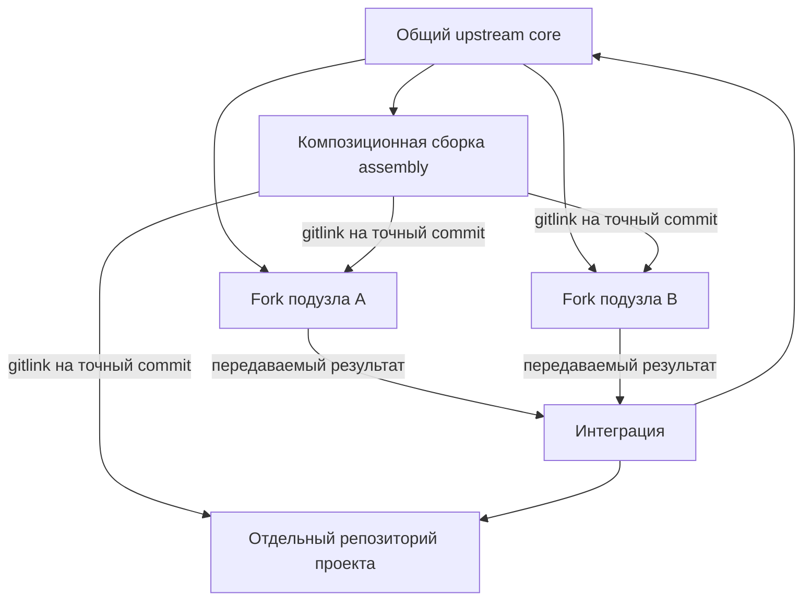

# Репозиторный граф пишущих подузлов и проектов FUM

[FUM](../Глоссарий/FUM.md) должен сохранять содержательную работу специализированных исполнителей не только в сообщениях одной сессии, но и в проверяемых Git-коммитах. Для этого долговечные [подузлы](../Глоссарий/подузел-FUM.md) и проекты получают собственные репозитории, а краткоживущие пишущие исполнители работают в изолированных клонах и передают результат через точные объекты Git.

Эта архитектура описывает целевой репозиторный граф. Она не объявляет уже созданными fork-репозитории, submodule, реестры или распределённый исполнительный runtime.

## Ядро и композиционная сборка

Общий upstream FUM и конкретная сборка сети выполняют разные функции.

- **Ядро (`core`)** хранит публикационно чистые общие правила, схемы, документацию, инструменты и переносимые улучшения. В нём нет графа живых экземпляров подузлов и проектов конкретного владельца.
- **Композиционная сборка (`assembly`)** является отдельным superproject конкретного составного узла. Она подключает ядро, долговечные подузлы и проекты как Git submodule и фиксирует согласованный снимок их ревизий.

Такое разделение предотвращает рекурсивное самовключение. Если подузел является fork того же репозитория, который уже содержит его как submodule, обычное наследование родительской ветки способно внести в подузел ссылку на него самого и на всю родительскую сборку. Поэтому подузлы должны наследовать чистое ядро, а не ветку assembly с графом экземпляров.

## Долговечный специализированный подузел

Долговечный подузел является не процессом и не веткой родительского checkout, а отдельным fork-репозиторием ядра. Он имеет устойчивый идентификатор, собственные специализацию, память, разрешения, проверки и историю. Его основная ветка может жить дольше отдельных модельных сессий, а новые сессии восстанавливают работу из сохранённых артефактов, не полагаясь на скрытую историю чата.

Композиционная сборка не копирует внутреннюю историю подузла и не получает над ним неявную тотальную власть. Она наблюдает и принимает конкретную ревизию через gitlink. Улучшение, полезное общему ядру, передаётся вверх отдельной публикационно чистой веткой или другим [передаваемым результатом FUM](../Глоссарий/передаваемый-результат-FUM.md), а не слиянием всей специализированной памяти подузла.

## Проект как самостоятельный репозиторий

Проект имеет собственный репозиторий, устойчивый идентификатор, паспорт, основную ветку, требования, проверки и границы доступа. Путь `Проекты/<идентификатор>/` в assembly является точкой подключения submodule, а не обычным каталогом проекта внутри ветки общей памяти.

Роль проекта и роль подузла не совпадают автоматически. Подузел является исполнителем со специализацией и долговременной памятью; проект является целевой областью результатов. Один подузел может работать над несколькими проектами, несколько подузлов — над одним проектом, а репозиторий, совмещающий обе роли, должен объявлять их раздельно.

## Точный gitlink вместо живой ветки

Git submodule фиксирует в дереве родителя точный commit дочернего репозитория. Даже если в `.gitmodules` указана рекомендуемая ветка, gitlink не начинает автоматически следовать за её вершиной. Долговечная ветка живёт в fork или проектном remote, а commit assembly закрепляет только принятый снимок.

Обновление submodule допустимо после того, как выбранный commit опубликован либо иначе надёжно сохранён и достижим из разрешённого источника. Неявное `update --remote` не является выбором следующего состояния FUM: новая ревизия проходит проверку, отбор и отдельное обновление gitlink.

## Изолированное исполнение шагов

Краткоживущий пишущий исполнитель получает контекстно ограниченный рабочий пакет с точными идентификаторами подузла, проекта и шага, целевым репозиторием, базовым commit, целевой веткой, разрешёнными путями, входами, проверками и формой передачи.

Для каждой параллельной попытки создаётся отдельный одноразовый клон целевого репозитория и уникальная ветка вида `step/<step-id>/<attempt-id>` от закреплённого базового commit. Исполнители не меняют общий checkout, индекс или ветку друг друга. Worktree допустим как оптимизация только там, где общая объектная база и refs уже защищены отдельным доказанным контрактом; базовой границей изоляции остаётся клон.

Содержательный результат попытки фиксируется одним или несколькими коммитами вместе с наблюдаемым происхождением и проверками. Отрицательный результат, возражение или неустранённый конфликт также сохраняются, если они дают проверяемую информацию. Скрытые рассуждения модели, машинный шум и секреты не становятся памятью только ради увеличения числа коммитов.

## Передача и принятие результата

Передача между репозиториями проходит как восстанавливаемая последовательность, потому что Git не предоставляет одной атомарной транзакции для нескольких независимых репозиториев.

1. Пишущий подузел создаёт commit в изолированной ветке и закрепляет паспорт результата с исходным и целевым репозиториями, базовым и результирующим commit, проверками и ограничениями доступа.
2. Commit публикуется или сохраняется в постоянном источнике, из которого его достижимость можно проверить.
3. Интегратор в отдельном клоне целевого репозитория повторяет проверки, выполняет слияние, cherry-pick или явное преобразование и последовательно обновляет целевую ветку.
4. После принятия результата assembly отдельным коммитом обновляет gitlink подузла или проекта.

Сбой между этапами не угадывается как успех. Промежуточное состояние сохраняется как подготовленное, опубликованное, принятое в целевой репозиторий либо продвинутое в assembly; повторный запуск продолжает с последней доказанной границы.

## Структурное выравнивание перед слиянием

Разные ветки и форки могут содержать совместимые изменения, записанные в разных поколениях структуры файлов. Содержательное слияние не должно одновременно угадывать, как перенести каждую сторону на новую раскладку. До merge каждая точная исходная линия независимо проходит одну и ту же цепочку версионированных структурных миграций в отдельном checkout, а preflight подтверждает совпадение целевого поколения структуры.

План миграции является детерминированным машиночитаемым манифестом с точными входными Git OID, идентичностью и версией преобразования, репозиторно-относительными операциями и предусловиями содержимого. Он не содержит абсолютный путь checkout, не выводит семантику из имени ветки или remote и не меняет исходные refs. Одинаковый план может применяться в независимых клонах, поэтому локальная автоматизация одной структуры становится повторно используемым строительным блоком для веток и форков.

Совпадение структурного поколения не доказывает содержательную совместимость. После выравнивания отдельно остаются Git-конфликты, расхождения защищённых первичных байтов, независимые изменения одного целевого файла, полномочия на merge и публикацию. [FUM-STEP-0113](../Планирование/карточки-шагов/🟡-FUM-STEP-0113-добавить-межветочную-синхронизацию-структурных-миграций.md) сохраняет этот будущий pre-merge-контур отдельно от текущей локальной миграции папок запросов.

## Разрешение конфликтов

Автоматическое устранение merge-конфликтов является проверяемым конвейером, а не безусловным выбором одной стороны.

- Непересекающиеся изменения объединяются обычным Git-слиянием.
- Структурированные реестры объединяются по устойчивым идентификаторам, а производные индексы пересобираются из источников.
- Конфликт двух gitlink одного submodule разрешается автоматически только когда один дочерний commit является предком другого; выбирается потомок.
- Расходящиеся дочерние commits сначала объединяются внутри дочернего репозитория, и только затем assembly получает новый gitlink.
- Изменение пути или URL submodule требует повторной проверки идентичности, доступа и публикационной допустимости.
- Смысловой конфликт получает отдельный рабочий пакет разрешения с точными `base`, `ours` и `theirs`; при недостатке оснований результатом остаётся `unresolved_conflict`.

Любое автоматическое разрешение создаёт новый commit, сохраняет применённый способ и проходит целевые проверки. Чистый текстовый merge без конфликтных маркеров сам по себе не доказывает смысловую совместимость.

## Инварианты репозиторного графа

- Идентичность подузла и проекта задаётся устойчивым идентификатором, а не URL, локальным путём, веткой или текущей сессией.
- Материализуемые рёбра submodule образуют ациклический граф; fork-происхождение может указывать к ядру, но не считается ребром вложения.
- Assembly не входит в собственное транзитивное поддерево, а подузел не наследует граф экземпляров своего родителя.
- Каждый gitlink указывает на точный достижимый commit разрешённого репозитория.
- Параллельные писатели используют разные клоны и уникальные refs; принятие в одну целевую ветку сериализуется.
- Локальная FIFO-очередь одного checkout не выдаётся за координацию отдельных клонов или удалённых refs.
- Устаревший базовый commit, изменившийся целевой ref или несовпавший паспорт останавливают интеграцию до нового поколения попытки.
- Публичная assembly не раскрывает URL, имена или gitlink приватных подузлов и проектов. Смешанный по доступу граф хранится в приватной assembly либо публикует только явно разрешённые обезличенные результаты.
- Commit подузла подтверждает происхождение вклада, но не доказывает независимость модели, истинность результата или право на слияние.

## Граница текущего прототипа

Текущие субагенты Codex разделяют рабочее дерево корневой задачи и поэтому не являются описанными здесь самостоятельными пишущими подузлами. Действующий запрет менять ими Git-индекс, refs и историю остаётся необходимым. Реализованный исполнитель является отдельным программным слоем прототипа; подключение к оркестрации корневых задач, выдача полномочий и принятие результата остаются самостоятельными шагами.

[Проверяемый многоагентный контур](../Прототипы/проверяемый-многоагентный-контур/README.md) закрепляет два исполняемых слоя этой границы. Закрытая схема паспорта репозиторной композиции версии `1` различает эфемерную ветку шага, долговечный специализированный подузел и самостоятельный проект, а автономный валидатор сверяет точные Git OID, gitlink и `.gitmodules` родительского снимка, полный живой ref, нерекурсивно восстановленный чистый detached-снимок, отдельный Git common-dir пишущего клона, доступ и наблюдаемую ацикличность дочерних деревьев только на локальных bare-репозиториях. Паспорт хранит устойчивые URI-идентичности; временные пути доказательной среды передаются отдельным runtime-контекстом и не становятся его содержимым.

Однопакетный `WritingSubnodeExecutor` повторно проверяет точные байты WorkPackage v1 и обязательные входы, безопасную локальную Git-конфигурацию и полный побайтовый снимок источника, создаёт собственный клон без локальных hardlink и alternates, назначает уникальные branch ref и result ref и допускает только детерминированные записи обычных файлов внутри объявленного scope. Закрытые декларативные проверки входят в хэш запроса; успешный результат завершается одним непустым непосредственным commit от `base_oid`, а branch ref и result ref фиксируются одной Git-транзакцией. Внешний канонический паспорт связывает commit, tree, родителя, пакет, снимок источника, входы, зависимости, бюджеты, фактический diff, проверки, ограничения и ещё не исполненный маршрут передачи. Машинные пути остаются во внешнем контексте. Неизменяемые квитанции сохраняют отрицательные исходы, а повтор успеха независимо сверяет клон, refs и объекты Git; отдельный безоконный пробник восстанавливает тот же паспорт в новом процессе. `no-op`, блокировка, изменившийся вход, грязь, запрещённый путь, секрет, публикационный отказ, провал проверки, смена базы и конфликт запуска дают раздельные исходы без искусственного commit.

Исполнитель сравнивает исходные HEAD, символический HEAD, статус, refs, достижимые объекты и индекс до и после каждого исхода. Автономные тесты создают настоящий локальный репозиторий, проверяют единственного прямого родителя и восстановление паспорта новым экземпляром хранилища. Точный повтор успешного запроса восстанавливает прежний OID, а иное содержимое под тем же `run_id` закрывается конфликтом.

Прототип не создаёт межрепозиторную интеграционную очередь, внешний fork, проектный репозиторий или GitHub-ресурс, не запускает модель и сеть и не обновляет настоящий gitlink. Сериализованное принятие результата, восстановление многофазной передачи и параллельный запуск нескольких исполнителей остаются следующими шагами.

## Источники требований

- [исходный запрос 2026-08-03 18:46:53 MSK — Добавить изолированный пишущий подузел и кандидатный commit](../Журнал/2026-08-03_18-46-53_MSK_добавить-изолированный-пишущий-подузел-и-кандидатный-commit/запрос.md)
- [исходный запрос 2026-08-03 11:49:04 MSK — Объединить запросы и журнал](../Журнал/2026-08-03_11-49-04_MSK_объединить-запросы-и-журнал/запрос.md)
- [исходный запрос 2026-08-03 08:48:44 MSK — Закрепить топологию и паспорт репозиторной композиции FUM](../Журнал/2026-08-03_08-48-44_MSK_закрепить-топологию-и-паспорт-репозиторной-композиции-FUM/запрос.md)
- [исходный запрос 2026-07-26 12:59:08 MSK — Спроектировать Git-граф пишущих субагентов и проектов](../Журнал/2026-07-26_12-59-08_MSK_спроектировать-Git-граф-пишущих-субагентов-и-проектов/запрос.md)

## Опорные документы

- [Параллельная работа и слияние](04-параллельная-работа-и-слияние.md)
- [Git-инфраструктура эволюционных цепочек FUM](20-Git-инфраструктура-эволюционных-цепочек-FUM.md)
- [Публичный upstream и форки памяти FUM](27-публичный-upstream-и-форки-памяти.md)
- [Паспорт документационного прототипа и первого коробочного среза FUM](36-паспорт-документационного-прототипа-и-первого-коробочного-среза.md)
- [Минимальный паспорт передаваемого результата FUM](39-минимальный-паспорт-передаваемого-результата-FUM.md)

<!-- FUM-MD-RECENCY:BEGIN -->
<!-- last-content-edit: 2026-08-03 20:56:09 MSK -->
<!-- content-sha256: sha256:25202dd46f984c2ad1543889bc161da46ca62cbd5d288991c2d46bb40d5693da -->
<!-- FUM-MD-RECENCY:END -->
