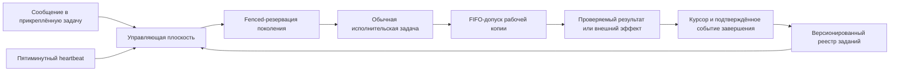

# Диспетчер автоматизаций FUM

[Диспетчер автоматизаций FUM](../Глоссарий/диспетчер-автоматизаций-FUM.md) — целевой постоянный управляющий контур автоматизаций одной рабочей копии и одной именованной Git-ветки. Для него уже закреплён отдельный локальный контракт схемы `1`, но действующая прикреплённая задача автозапуска следующего шага пока остаётся специализированной. Целевой heartbeat должен уметь проверять несколько независимо настроенных заданий, чьи расписания, условия и эффекты явно описаны и версионированы.

Постоянство относится к задаче управления, а не к одному бесконечно исполняющемуся агенту. Heartbeat пробуждает прикреплённую задачу, она читает состояние и при наличии допустимой работы создаёт отдельную обычную задачу Codex. Исполнитель входит в общую FIFO-очередь рабочей копии, заново проверяет закреплённое поколение и только после допуска получает права, явно разрешённые контрактом задания.

## Две плоскости

Управляющая плоскость отвечает за наблюдение, выбор и резервирование. Ей разрешены read-only-проверки host и репозитория, fenced-операции с локальным состоянием диспетчеризации и создание обычной задачи. Она не меняет рабочую копию, индекс, ветку или историю и не выполняет внешний эффект вместо исполнителя.

Исполнительская плоскость отвечает за содержательную работу. Любое задание, способное изменить репозиторий или внешнее состояние, запускается как обычная корневая задача, регистрируется в FIFO, после допуска подтверждает точные `job_id` и поколение и соблюдает собственные границы доступа, проверки, commit+handoff и публикации. Универсальность диспетчера не является универсальным разрешением на действие.

## Запись задания

Реестр хранит независимые задания с устойчивой идентичностью. Закрытая схема `fum.automation-job-registry.v1` находится в [локальном навыке диспетчера](../Инструменты/fum-dispetcher-avtomatizacij-fum/SKILL.md), а веточные реестры — в `Планирование/реестры-заданий-автоматизаций/`; точный реестр `refs/heads/master` расположен в [master.json](../Планирование/реестры-заданий-автоматизаций/master.json). Имя файла не доказывает цель: корень и каждая запись закрепляют полный `branch_ref` из строгого безопасного ASCII-подмножества именованных Git-ref, якорь рабочей копии `.`, идентификатор проекта и относительный путь его паспорта. Валидатор получает физический `--корень-рабочей-копии`, требует в нём обычный маркер `.git`, точное совпадение цели с корнем реестра и обычный паспорт внутри рабочей копии без символических ссылок в компонентах пути.

| Поле контракта                  | Назначение                                                                                                                       |
| ------------------------------- | -------------------------------------------------------------------------------------------------------------------------------- |
| `job_id` и поколение            | Отличают устойчивое задание от конкретной версии его конфигурации и не позволяют старой резервации запустить изменённое задание. |
| Тип и адаптер                   | Определяют источник работы: следующий шаг, счётная аналитика, публикация или иной отдельно проверенный адаптер.                  |
| Цель и область                  | Закрепляют рабочую копию, полный ref ветки, проект и допустимые входы.                                                           |
| Триггер                         | Описывает ровно одну закрытую форму: интервальное расписание либо порог подтверждённых событий.                                  |
| Условия допуска                 | Проверяют простой, состояние ветки, доступность входов, полномочия и иные наблюдаемые предикаты.                                 |
| Класс эффекта и исполнитель     | Различают read-only-работу, изменение репозитория и внешний эффект и задают обязательный маршрут исполнения.                     |
| Состояние                       | Раздельно хранит `active`, `paused`, `blocked` или историческое `retired`; отложенное задание не блокирует независимое готовое.  |
| Fence и политика восстановления | Исключают повтор старого поколения и определяют безопасное поведение при неоднозначном создании задачи или потере ответа.        |
| Курсор результата               | Закрепляет последнее подтверждённое событие, период или поколение, чтобы рестарт не создавал дубль.                              |
| Политика ошибки                 | Задаёт fail-closed-остановку, повтор, задержку и необходимость пользовательского решения без скрытого расширения полномочий.     |

Собственные поля контракта названы по-русски. Точное написание `job_id`, `branch_ref` и состояний `active`, `paused`, `blocked`, `retired` сохранено как явно закреплённая машинная граница. Fence содержит копию положительного поколения и обязан совпадать с поколением записи. Курсор является закрытым объединением: расписание хранит последнее точное наступление на сетке `якорь + k × интервал`, а событийный триггер — подтверждённый счёт, последний идентификатор события и следующий согласованный порог. Исполнитель также является закрытым объединением: чистый пробник имеет собственный точный контракт, а изменение репозитория или внешний эффект требует обычную корневую задачу Codex и её FIFO-протокол.

Неизвестные поля на любом уровне, повторный JSON-ключ, неверная версия схемы, повтор `job_id`, нулевое или логическое поколение, несовпадающий fence, противоречивый триггер, курсор другой формы или вне сетки расписания, отсутствующая или несогласованная политика эффекта, неизвестный либо недостаточный исполнитель, небезопасный ref, отсутствие Git-маркера, символическая ссылка, выход пути из рабочей копии и неизвестное состояние закрывают весь реестр отказом. Автономные положительные и отрицательные фикстуры проверяют эту границу без сети, host Codex, секретов, Git-индекса и внешних эффектов.

## Выбор и резервирование

Один тик читает точную версию реестра, вычисляет наблюдаемо готовые задания и выбирает не более одного запуска. Порядок должен быть детерминированным и учитывать срок готовности, явно заданную очерёдность и устойчивый `job_id`, а не порядок случайного обхода файлов. После выбора диспетчер резервирует точное поколение compare-and-swap-операцией, повторяет изменчивые условия и только затем создаёт исполнительскую задачу.

В карточочном адаптере этот общий выбор задания содержит отдельные вычисление готовности и выбор шага. Ранний `validate` выводит runtime-пул из конечного whitelist схемы `5`, `dispatch` и точных `requires_completed_card_ids`; только после второй успешной host-инвентаризации адаптер повторяет вычисление и применяет к нескольким runtime-`ready` политику `dynamic-readiness-source-history-first-parent-v2`. Из точного `HEAD` она читает от нового к старому не более 16 first-parent-коммитов и сопоставляет изменения только с дедуплицированными нормализованными локальными ссылками разделов `Источники`. Сначала учитывается изменённая завершённая или поглощённая карточка среди источников, затем точное изменение иного источника; внутри класса учитываются меньшая дистанция, большее число уникальных совпавших путей и затем `card_id`, `step_id`. Управляющие пути и собственная карточка кандидата исключаются, а отсутствие различающего сигнала разрешается сразу этой устойчивой парой. Это мягкий порядок среди уже допустимых кандидатов, а не право обходить вычисленную неготовность, явную паузу или блокировку, безопасность, полномочия, выбор пользователя или контекстную посильность.

Идентичность запуска задаётся составным ключом `run_key = job_id + spec_generation + trigger_occurrence`. Для карточочного адаптера occurrence включает `selection.id`, точный `selection.head` и `step_id`, для интервального задания — точное временное окно, для счётного — конечный диапазон событий, а для ручного — отдельный идентификатор команды. Результат карточного выбора дополнительно хранит `selection.policy`, `selection.ready_count` и проверяемое свидетельство `selection.reason`, `selection.commit`, `selection.distance`, `selection.matched_paths`; сам `selection.id` включает объявления и вычисленные статусы всех кандидатов и точные факты обязательных карточек. Claim получает идентичность через `--expected-selection-id`, закрепляет `run_key` и свежий `lease_id`, атомарно проверяет вершину полного ref вместе с compare-and-swap и сохраняет плоские `selection_id`, `selection_head` в claim схемы `2`; точный повтор одной попытки идемпотентен, другой lease не присваивает занятую occurrence, TTL отсутствует. Созданная задача повторяет selection fence после FIFO-допуска. Успех, безопасный отказ и подтверждённое восстановление должны завершать occurrence fenced-переходом, согласованным с commit+handoff или отдельным проверенным протоколом внешнего эффекта.

Первый универсальный слой сохраняет консервативную политику текущего диспетчера: любая другая наблюдаемая активная задача закрывает все плановые запуски. Ослабление этой политики для отдельных классов заданий требует самостоятельной проверки и не выводится только из наличия поля условий.

Граница host-адаптера отделяет смысловую схему ответа от его транспортного представления и от внешней обёртки оркестратора. В действующей поверхности heartbeat вызывает `tools.codex_app__list_threads`, `tools.codex_app__list_projects` и `tools.codex_app__create_thread` только внутри `functions.exec`; каждый host-вызов ограничивается внутри JavaScript через `Promise.race` и тайм-аут 60 секунд. Уже полученный JSON-объект используется напрямую, а строка разбирается внутри того же вызова только как полный JSON-текст и строго один раз; результат обязан быть объектом и выводится через `text(...)`. Сам результат `functions.exec` не считается host-ответом. Массив, `null`, повторная строка, иной тип, ошибка разбора, Markdown-обёртка, префикс, суффикс, wrapper-поле или рекурсивная распаковка закрывают тик до резервации. Только после этой ограниченной read-only-нормализации применяются схемы конкретных вызовов. Текущий профиль списка требует `schemaVersion=2`, точные пять верхнеуровневых полей, отсутствие `pinnedThreads`, непустую строку `untrustedDataNotice` только как недоверенное предупреждение, единственный массив `threads`, пустые массивы `unavailableHosts` и `unavailableSources`, уникальные идентификаторы, закрытые kind/status и ровно одну собственную Codex-запись. Закрепление диспетчерской задачи остаётся установочным и UI-инвариантом, но не выводится из профиля списка и не служит runtime-полномочием. Создание получает точный локальный project-target и не задаёт модель. Такое разделение допускает эквивалентные объектное и строковое представления штатного host-ответа, но не превращает произвольный текст в доверенную конфигурацию.

Состояние «срок наступил» не равно разрешению на запуск. Автономный симулятор раздельно возвращает наступление триггера, выполнение условий, разрешение состояния и итоговую готовность. Поэтому корректные `paused`, `blocked` и `retired` могут иметь давно наступивший срок, оставаясь неготовыми. Например, аналитика после каждых `N` шагов считает подтверждённые завершения поколений карточек, а не heartbeat-тики, созданные чаты или локальные незакоммиченные изменения. Задание публикации отдельно проверяет допустимый объект, ref, remote, расхождение истории и право внешнего эффекта.

## Управление сообщениями

Сообщения пользователя в существующую прикреплённую задачу становятся основной человекочитаемой поверхностью управления. Через них можно запрашивать список и состояние заданий, приостанавливать и возобновлять отдельное задание или весь heartbeat, менять расписание и условия, добавлять новое задание и выводить историю последних результатов.

Управляющий пользовательский ход отличается от планового тика. Read-only-просмотр может выполняться без изменения состояния. Пауза host, изменение версионированной конфигурации или иной эффект превращают ход в обычную FIFO-работу: до мутации она получает допуск, сохраняет исходное сообщение и полный машинный снимок конфигурации, в одном orchestration-вызове переносит его в обновление и проверяет точный разрешённый diff, а затем завершает работу через `commit`, `finish-clean` либо `finish-own-clean`. Поля конфигурации не пересказываются моделью между чтением и обновлением. Текущий host-интерфейс полной замены не принимает expected-version/CAS, поэтому этот контур обнаруживает наблюдаемое расхождение, но не обещает транзакционной изоляции от одновременного ручного переключения. Успех внешнего изменения сообщается только после повторной проверки host и подтверждённой передачи FIFO; иначе выполненный внешний эффект остаётся явно незавершённым управляющим ходом, который следующий последовательный тик той же задачи может fenced-завершить лишь при собственном неизменном чистом владении. Команда, добавляющая новый внешний эффект или расширяющая полномочия, требует явного подтверждения по контракту этого эффекта; естественный язык не отменяет структурную валидацию. Удаление задания представляется историческим `retired`, а не стиранием происхождения.

## Первые адаптеры

Действующий [следующий шаг ветки](../Глоссарий/следующий-шаг-ветки.md) становится первым адаптером. Он сохраняет рабочий набор схемы `5` с конечным whitelist `automatic`, `paused` и `blocked`, вычисляет ready-пул по точным завершённым зависимостям, выбирает по ограниченной first-parent-истории источников только на границе запуска и сохраняет `branch_ref`, объект `selection`, `step_id`, хэш карточки, локальный claim, двойную проверку занятости и создание обычной задачи. Завершённый исполнитель обновляет whitelist допустимости, но не вычисляет и не назначает следующий шаг. До универсальной миграции действующий heartbeat остаётся специализированным и не заявляет поддержку общего реестра.

Второй независимо проверяемый адаптер запускает аналитику после каждых `N` подтверждённо завершённых шагов. Его курсор хранит последнее учтённое поколение и номер следующего порога; повтор после рестарта или пропущенного тика не создаёт несколько отчётов за один порог.

Для `master` периодическая публикация отозвана из рабочего набора: обычная задача завершает локальный commit+handoff без `push` или `publish`, а пользователь отдельно подтверждает публикацию ручным `push`. Этот сетевой акт не является условием готовности следующей карточки и не расширяет полномочия диспетчера. Возможные задания публикации для других refs и репозиториев по-прежнему требуют точного объекта, отдельного права внешнего эффекта, терминального протокола и политики divergence; эти границы сохраняются в [частично прояснённом вопросе о периодической публикации](../Вопросы/2026-07-27_15-21-35_MSK_границы-периодической-публикации-ветки.md).

## Граница текущей реализации

Сейчас реально действует одна прикреплённая задача с пятиминутным heartbeat и специализированным запуском следующего шага. Сообщения в ней уже могут останавливать и возобновлять весь heartbeat штатными средствами host; полный снимок при таком переключении сохраняется механически, канонический renderer позволяет явно восстановить повреждённый промпт, а новый тик способен безопасно завершить только собственное забытое чистое владение FIFO. Если host не применяет замену prompt к существующей записи, отдельный FIFO-защищённый ремонт может заменить именно запись автоматизации под новой уникальной отображаемой латинской формой из `display`, точно полученной из русского `source` закреплённым LinguisticKit. До удаления неизвестное поле закрывает replacement. Его post-view разрешает измениться только `id`, `name`, `prompt`, `created_at` и `updated_at`, требует exact-сохранения всех остальных известных декларативных полей, включая `version`, `kind`, target, расписание, статус и присутствующие `destination` либо `notificationPolicy`, а также доказывает единственность записи. При расхождении выполняются удаление кандидата, обязательная попытка восстановления snapshot и точный повторный просмотр; отсутствие expected-version/CAS не гарантирует восстановление, поэтому неподтверждённый возврат является аварийным неуспехом. Прикреплённая задача и её история сохраняются.

Реализованный слой ограничен схемой `1`, пустым каноническим реестром `master`, fail-closed-валидатором, чистым симулятором, фикстурами и локальным пробником. Пустой массив `задания` принципиален: живой следующий шаг не внесён даже как приостановленная запись, host-конфигурация не менялась, выбор победителя, CAS-claim и исполнение отсутствуют. Универсальные выбор и резервация относятся к FUM-STEP-0092, а миграция существующей прикреплённой задачи на месте — к FUM-STEP-0093. Репозиторное изменение конфигурации сообщениями также ещё не реализовано.

## Источники требований

- [исходный запрос 2026-08-05 05:48:39 MSK — Закрепить контракт универсального диспетчера автоматизаций FUM](../Журнал/2026-08-05_05-48-39_MSK_закрепить-контракт-универсального-диспетчера-автоматизаций-FUM/запрос.md)
- [исходный запрос 2026-07-31 16:31:18 MSK — Отключить автоматическую публикацию master](../Журнал/2026-07-31_16-31-18_MSK_отключить-автоматическую-публикацию-master/запрос.md)
- [исходный запрос 2026-07-31 08:42:29 MSK — Исправить инвентаризацию schemaVersion 2 автозапуска](../Журнал/2026-07-31_08-42-29_MSK_исправить-инвентаризацию-schemaVersion-2-автозапуска/запрос.md)
- [исходный запрос 2026-07-30 10:31:43 MSK — Исправить host оркестрацию автозапуска](../Журнал/2026-07-30_10-31-43_MSK_исправить-host-оркестрацию-автозапуска/запрос.md)
- [исходный запрос 2026-07-30 07:55:11 MSK — Исправить транспортный формат автозапуска](../Журнал/2026-07-30_07-55-11_MSK_исправить-транспортный-формат-автозапуска/запрос.md)
- [исходный запрос 2026-07-29 18:39:04 MSK — Исправить возобновление автозапуска следующих шагов](../Журнал/2026-07-29_18-39-04_MSK_исправить-возобновление-автозапуска-следующих-шагов/запрос.md)
- [исходный запрос 2026-07-29 09:04:03 MSK — Расширить динамический выбор следующего шага](../Журнал/2026-07-29_09-04-03_MSK_расширить-динамический-выбор-следующего-шага/запрос.md)
- [исходный запрос 2026-07-27 18:28:42 MSK — Выбирать следующий шаг при запуске с учётом истории коммитов](../Журнал/2026-07-27_18-28-42_MSK_выбирать-следующий-шаг-при-запуске-с-учётом-истории-коммитов/запрос.md)
- [исходный запрос 2026-07-27 15:21:35 MSK — Сделать диспетчер автоматизаций ветки универсальным](../Журнал/2026-07-27_15-21-35_MSK_сделать-диспетчер-автоматизаций-ветки-универсальным/запрос.md)
- [исходный запрос 2026-07-20 20:06:04 MSK — Запускать следующие шаги веток](../Журнал/2026-07-20_20-06-04_MSK_запускать-следующие-шаги-веток/запрос.md)
- [исходный запрос 2026-07-26 15:15:18 MSK — Публиковать работу в GitHub автоматически](../Журнал/2026-07-26_15-15-18_MSK_публиковать-работу-в-GitHub-автоматически/запрос.md)

## Опорные материалы

- [Локальный контракт диспетчера автоматизаций FUM](../Инструменты/fum-dispetcher-avtomatizacij-fum/SKILL.md)
- [Воспроизводимые автоматизации FUM](17-воспроизводимые-автоматизации.md)
- [Параллельная работа и слияние](04-параллельная-работа-и-слияние.md)
- [Требование универсальной диспетчеризации](../Требования/🚧-универсальная-диспетчеризация-периодических-автоматизаций.md)
- [Рабочие наборы следующих шагов веток](../Планирование/следующие-шаги-веток/README.md)

<!-- FUM-MD-RECENCY:BEGIN -->
<!-- last-content-edit: 2026-08-05 07:12:44 MSK -->
<!-- content-sha256: sha256:0ce75cfb90be5c11d7e379641d175d06f8b549517de9d048b2736f5e00df4ed7 -->
<!-- FUM-MD-RECENCY:END -->
