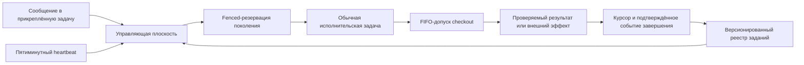

# Диспетчер автоматизаций FUM

[Диспетчер автоматизаций FUM](../Глоссарий/диспетчер-автоматизаций-FUM.md) — целевой постоянный управляющий контур автоматизаций одного checkout и одной именованной Git-ветки. Он развивается из уже существующей прикреплённой задачи автозапуска следующего шага, но не ограничивается карточками шагов: один heartbeat должен уметь проверять несколько независимо настроенных заданий, чьи расписания, условия и эффекты явно описаны и версионированы.

Постоянство относится к задаче управления, а не к одному бесконечно исполняющемуся агенту. Heartbeat пробуждает прикреплённую задачу, она читает состояние и при наличии допустимой работы создаёт отдельную обычную задачу Codex. Исполнитель входит в общую FIFO-очередь checkout, заново проверяет закреплённое поколение и только после допуска получает права, явно разрешённые контрактом задания.

## Две плоскости

Управляющая плоскость отвечает за наблюдение, выбор и резервирование. Ей разрешены read-only-проверки host и репозитория, fenced-операции с локальным состоянием диспетчеризации и создание обычной задачи. Она не меняет checkout, индекс, ветку или историю и не выполняет внешний эффект вместо исполнителя.

Исполнительская плоскость отвечает за содержательную работу. Любое задание, способное изменить репозиторий или внешнее состояние, запускается как обычная корневая задача, регистрируется в FIFO, после допуска подтверждает точные `job_id` и поколение и соблюдает собственные границы доступа, проверки, commit+handoff и публикации. Универсальность диспетчера не является универсальным разрешением на действие.

## Запись задания

Реестр должен хранить независимые задания с устойчивой идентичностью. Его точная схема и носитель относятся к реализации FUM-STEP-0091, но архитектурный минимум уже определён.

| Поле контракта                  | Назначение                                                                                                                       |
| ------------------------------- | -------------------------------------------------------------------------------------------------------------------------------- |
| `job_id` и поколение            | Отличают устойчивое задание от конкретной версии его конфигурации и не позволяют старой резервации запустить изменённое задание. |
| Тип и адаптер                   | Определяют источник работы: следующий шаг, счётная аналитика, публикация или иной отдельно проверенный адаптер.                  |
| Цель и область                  | Закрепляют checkout, полный ref ветки, проект и допустимые входы.                                                                |
| Триггер                         | Описывает расписание, календарное окно, число подтверждённых событий или их явную комбинацию.                                    |
| Условия допуска                 | Проверяют простой, состояние ветки, доступность входов, полномочия и иные наблюдаемые предикаты.                                 |
| Класс эффекта и исполнитель     | Различают read-only-работу, изменение репозитория и внешний эффект и задают обязательный маршрут исполнения.                     |
| Состояние                       | Раздельно хранит `active`, `paused`, `blocked` или историческое `retired`; отложенное задание не блокирует независимое готовое.  |
| Fence и политика восстановления | Исключают повтор старого поколения и определяют безопасное поведение при неоднозначном создании задачи или потере ответа.        |
| Курсор результата               | Закрепляет последнее подтверждённое событие, период или поколение, чтобы рестарт не создавал дубль.                              |
| Политика ошибки                 | Задаёт fail-closed-остановку, повтор, задержку и необходимость пользовательского решения без скрытого расширения полномочий.     |

Неизвестные поля, неверная версия схемы, повтор идентичности, противоречивые условия или отсутствующая политика эффекта закрывают соответствующее задание отказом. Повреждение одного задания не должно превращать другое в разрешённое; точная политика изоляции ошибок проверяется отдельными фикстурами.

## Выбор и резервирование

Один тик читает точную версию реестра, вычисляет наблюдаемо готовые задания и выбирает не более одного запуска. Порядок должен быть детерминированным и учитывать срок готовности, явно заданную очерёдность и устойчивый `job_id`, а не порядок случайного обхода файлов. После выбора диспетчер резервирует точное поколение compare-and-swap-операцией, повторяет изменчивые условия и только затем создаёт исполнительскую задачу.

В карточочном адаптере этот общий выбор задания содержит отдельные вычисление готовности и выбор шага. Ранний `validate` выводит runtime-пул из конечного whitelist схемы `5`, `dispatch` и точных `requires_completed_card_ids`; только после второй успешной host-инвентаризации адаптер повторяет вычисление и применяет к нескольким runtime-`ready` политику `dynamic-readiness-source-history-first-parent-v2`. Из точного `HEAD` она читает от нового к старому не более 16 first-parent-коммитов и сопоставляет изменения только с дедуплицированными нормализованными локальными ссылками разделов `Источники`. Сначала учитывается изменённая завершённая или поглощённая карточка среди источников, затем точное изменение иного источника; внутри класса учитываются меньшая дистанция, большее число уникальных совпавших путей и затем `card_id`, `step_id`. Управляющие пути и собственная карточка кандидата исключаются, а отсутствие различающего сигнала разрешается сразу этой устойчивой парой. Это мягкий порядок среди уже допустимых кандидатов, а не право обходить вычисленную неготовность, явную паузу или блокировку, безопасность, полномочия, выбор пользователя или контекстную посильность.

Идентичность запуска задаётся составным ключом `run_key = job_id + spec_generation + trigger_occurrence`. Для карточочного адаптера occurrence включает `selection.id`, точный `selection.head` и `step_id`, для интервального задания — точное временное окно, для счётного — конечный диапазон событий, а для ручного — отдельный идентификатор команды. Результат карточного выбора дополнительно хранит `selection.policy`, `selection.ready_count` и проверяемое свидетельство `selection.reason`, `selection.commit`, `selection.distance`, `selection.matched_paths`; сам `selection.id` включает объявления и вычисленные статусы всех кандидатов и точные факты обязательных карточек. Claim получает идентичность через `--expected-selection-id`, закрепляет `run_key` и свежий `lease_id`, атомарно проверяет вершину полного ref вместе с compare-and-swap и сохраняет плоские `selection_id`, `selection_head` в claim схемы `2`; точный повтор одной попытки идемпотентен, другой lease не присваивает занятую occurrence, TTL отсутствует. Созданная задача повторяет selection fence после FIFO-допуска. Успех, безопасный отказ и подтверждённое восстановление должны завершать occurrence fenced-переходом, согласованным с commit+handoff или отдельным проверенным протоколом внешнего эффекта.

Первый универсальный слой сохраняет консервативную политику текущего диспетчера: любая другая наблюдаемая активная задача закрывает все плановые запуски. Ослабление этой политики для отдельных классов заданий требует самостоятельной проверки и не выводится только из наличия поля условий.

Состояние «срок наступил» не равно разрешению на запуск. Например, аналитика после каждых `N` шагов считает подтверждённые завершения поколений карточек, а не heartbeat-тики, созданные чаты или локальные незакоммиченные изменения. Задание публикации отдельно проверяет допустимый объект, ref, remote, расхождение истории и право внешнего эффекта.

## Управление сообщениями

Сообщения пользователя в существующую прикреплённую задачу становятся основной человекочитаемой поверхностью управления. Через них можно запрашивать список и состояние заданий, приостанавливать и возобновлять отдельное задание или весь heartbeat, менять расписание и условия, добавлять новое задание и выводить историю последних результатов.

Управляющий пользовательский ход отличается от планового тика. Read-only-просмотр может выполняться без изменения состояния. Пауза host, изменение версионированной конфигурации или иной эффект превращают ход в обычную FIFO-работу: до мутации она получает допуск, сохраняет исходное сообщение, проверяет ожидаемое поколение и завершает работу через `commit` либо `finish-clean`. Команда, добавляющая новый внешний эффект или расширяющая полномочия, требует явного подтверждения по контракту этого эффекта; естественный язык не отменяет структурную валидацию. Удаление задания представляется историческим `retired`, а не стиранием происхождения.

## Первые адаптеры

Действующий [следующий шаг ветки](../Глоссарий/следующий-шаг-ветки.md) становится первым адаптером. Он сохраняет рабочий набор схемы `5` с конечным whitelist `automatic`, `paused` и `blocked`, вычисляет ready-пул по точным завершённым зависимостям, выбирает по ограниченной first-parent-истории источников только на границе запуска и сохраняет `branch_ref`, объект `selection`, `step_id`, хэш карточки, локальный claim, двойную проверку занятости и создание обычной задачи. Завершённый исполнитель обновляет whitelist допустимости, но не вычисляет и не назначает следующий шаг. До универсальной миграции действующий heartbeat остаётся специализированным и не заявляет поддержку общего реестра.

Второй независимо проверяемый адаптер запускает аналитику после каждых `N` подтверждённо завершённых шагов. Его курсор хранит последнее учтённое поколение и номер следующего порога; повтор после рестарта или пропущенного тика не создаёт несколько отчётов за один порог.

Периодическая публикация ветки остаётся отдельным кандидатом. Для текущего репозитория она не заменяет обязательную немедленную публикацию точного post-handoff-коммита. Точный объект публикации, отношение к немедленному push, право внешнего эффекта, терминальный путь для внешнего результата без собственного содержательного коммита и поведение при divergence требуют ответа на [открытый вопрос о границах периодической публикации](../Вопросы/2026-07-27_15-21-35_MSK_границы-периодической-публикации-ветки.md).

## Граница текущей реализации

Сейчас реально действует одна прикреплённая задача с пятиминутным heartbeat и специализированным запуском следующего шага. Сообщения в ней уже могут останавливать и возобновлять весь heartbeat штатными средствами host, но универсальный реестр, выбор нескольких типов заданий, отдельные курсоры и репозиторное изменение конфигурации сообщениями ещё не реализованы. Существующая задача должна быть мигрирована на месте без создания второго диспетчера и без потери её истории.

## Источники требований

- [исходный запрос 2026-07-29 09:04:03 MSK — Расширить динамический выбор следующего шага](../Запросы/2026-07-29_09-04-03_MSK_расширить-динамический-выбор-следующего-шага.md)
- [исходный запрос 2026-07-27 18:28:42 MSK — Выбирать следующий шаг при запуске с учётом истории коммитов](../Запросы/2026-07-27_18-28-42_MSK_выбирать-следующий-шаг-при-запуске-с-учётом-истории-коммитов.md)
- [исходный запрос 2026-07-27 15:21:35 MSK — Сделать диспетчер автоматизаций ветки универсальным](../Запросы/2026-07-27_15-21-35_MSK_сделать-диспетчер-автоматизаций-ветки-универсальным.md)
- [исходный запрос 2026-07-20 20:06:04 MSK — Запускать следующие шаги веток](../Запросы/2026-07-20_20-06-04_MSK_запускать-следующие-шаги-веток.md)
- [исходный запрос 2026-07-26 15:15:18 MSK — Публиковать работу в GitHub автоматически](../Запросы/2026-07-26_15-15-18_MSK_публиковать-работу-в-GitHub-автоматически.md)

## Опорные материалы

- [Воспроизводимые автоматизации FUM](17-воспроизводимые-автоматизации.md)
- [Параллельная работа и слияние](04-параллельная-работа-и-слияние.md)
- [Требование универсальной диспетчеризации](../Требования/🟡-универсальная-диспетчеризация-периодических-автоматизаций.md)
- [Рабочие наборы следующих шагов веток](../Планирование/следующие-шаги-веток/README.md)

<!-- FUM-MD-RECENCY:BEGIN -->
<!-- last-content-edit: 2026-07-29 10:09:26 MSK -->
<!-- content-sha256: sha256:3fb55fe97b06f23f994c598dab9e09d6d568e968b018ec0b175c8f2e38fdd203 -->
<!-- FUM-MD-RECENCY:END -->
