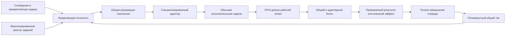

# Диспетчер автоматизаций FUM

[Диспетчер автоматизаций FUM](../Глоссарий/диспетчер-автоматизаций-FUM.md) — действующий постоянный управляющий контур автоматизаций одной рабочей копии и одной именованной Git-ветки. Существующие прикреплённая задача и пятиминутный heartbeat мигрированы на месте в общий тик, а закрытый реестр схемы `1` содержит ровно одно активное задание `master.next-step` с точной целью текущего checkout и `refs/heads/master`. Это задание вызывает специализированный адаптер следующего шага; задача и критерии карточки остаются только в карточочном рабочем наборе и не копируются в универсальный реестр.

Постоянство относится к задаче управления, а не к одному бесконечно исполняющемуся агенту. Heartbeat пробуждает прикреплённую задачу, она читает состояние и при наличии допустимой работы создаёт отдельную обычную задачу Codex. Исполнитель входит в общую FIFO-очередь рабочей копии, после допуска раздельно подтверждает общее поколение задания и специализированное поколение карточочного выбора и только затем получает права, явно разрешённые контрактом задания.

## Две плоскости

Управляющая плоскость отвечает за наблюдение, выбор и резервирование. Ей разрешены read-only-проверки host и репозитория, fenced-операции с локальным состоянием диспетчеризации и создание обычной задачи. Она не меняет рабочую копию, индекс, ветку или историю и не выполняет внешний эффект вместо исполнителя.

Исполнительская плоскость отвечает за содержательную работу. Любое задание, способное изменить репозиторий или внешнее состояние, запускается как обычная корневая задача, регистрируется в FIFO, после допуска подтверждает общий `job_id`, поколение и привязку к точному владельцу очереди, а затем повторяет проверку fence своего адаптера. Только фактический корневой `CODEX_THREAD_ID` является идентичностью исполнителя: предварительный `clientThreadId` из асинхронного создания её не заменяет. Исполнитель соблюдает собственные границы доступа, проверки, commit+handoff и публикации; универсальность диспетчера не является универсальным разрешением на действие.

## Запись задания

Реестр хранит независимые задания с устойчивой идентичностью. Закрытая схема `fum.automation-job-registry.v1` находится в [локальном навыке диспетчера](../Инструменты/fum-dispetcher-avtomatizacij-fum/SKILL.md), а веточные реестры — в `Планирование/реестры-заданий-автоматизаций/`; точный реестр `refs/heads/master` расположен в [master.json](../Планирование/реестры-заданий-автоматизаций/master.json). Имя файла не доказывает цель: корень и каждая запись закрепляют полный `branch_ref` из строгого безопасного ASCII-подмножества именованных Git-ref, якорь рабочей копии `.`, идентификатор проекта и относительный путь его паспорта. Валидатор получает физический `--корень-рабочей-копии`, требует в нём обычный маркер `.git`, точное совпадение цели с корнем реестра и обычный паспорт внутри рабочей копии без символических ссылок в компонентах пути.

| Поле контракта                  | Назначение                                                                                                                       |
| ------------------------------- | -------------------------------------------------------------------------------------------------------------------------------- |
| `job_id` и поколение            | Отличают устойчивое задание от конкретной версии его конфигурации и не позволяют старой резервации запустить изменённое задание. |
| Тип и адаптер                   | Определяют источник работы: следующий шаг, счётная аналитика, публикация или иной отдельно проверенный адаптер.                  |
| Цель и область                  | Закрепляют рабочую копию, полный ref ветки, проект и допустимые входы.                                                           |
| Триггер                         | Описывает ровно одну закрытую форму: интервальное расписание либо порог подтверждённых событий.                                  |
| Условия допуска                 | Проверяют простой, состояние ветки, доступность входов, полномочия и иные наблюдаемые предикаты.                                 |
| Класс эффекта и исполнитель     | Различают read-only-работу, изменение репозитория и внешний эффект и задают обязательный маршрут исполнения.                     |
| Состояние                       | Раздельно хранит `active`, `paused`, `blocked` или историческое `retired`; отложенное задание не блокирует независимое готовое.  |
| Fence и политика восстановления | Исключают повтор старого поколения и определяют безопасное поведение при неоднозначном создании задачи или потере ответа.        |
| Курсор результата               | Закрепляет последнее подтверждённое событие, период или поколение, чтобы рестарт не создавал дубль.                              |
| Политика ошибки                 | Задаёт fail-closed-остановку, повтор, задержку и необходимость пользовательского решения без скрытого расширения полномочий.     |

Собственные поля контракта названы по-русски. Точное написание `job_id`, `branch_ref` и состояний `active`, `paused`, `blocked`, `retired` сохранено как явно закреплённая машинная граница. Fence содержит копию положительного поколения и обязан совпадать с поколением записи. Курсор является закрытым объединением: расписание хранит последнее точное наступление на сетке `якорь + k × интервал`, а событийный триггер — подтверждённый счёт, последний идентификатор события и следующий согласованный порог. Исполнитель также является закрытым объединением: чистый пробник имеет собственный точный контракт, а изменение репозитория или внешний эффект требует обычную корневую задачу Codex и её FIFO-протокол.

Неизвестные поля на любом уровне, повторный JSON-ключ, неверная версия схемы, повтор `job_id`, нулевое или логическое поколение, несовпадающий fence, противоречивый триггер, курсор другой формы или вне сетки расписания, отсутствующая или несогласованная политика эффекта, неизвестный либо недостаточный исполнитель, небезопасный ref, отсутствие Git-маркера, символическая ссылка, выход пути из рабочей копии и неизвестное состояние закрывают весь реестр отказом. Автономные положительные и отрицательные фикстуры проверяют эту границу без сети, host Codex, секретов, Git-индекса и внешних эффектов.

## Выбор и резервирование

Один тик читает валидные реестр и явно переданные наблюдения, вычисляет готовность без системных часов и выбирает не более одного запуска. Каждое готовое задание получает типизированное `trigger_occurrence`: точный UTC-момент расписания либо закрытый диапазон подтверждённых событий. Устойчивый порядок состоит из документированного ранга типа наступления, собственного срока внутри этого типа, `приоритет` и `job_id`: расписание предшествует счётному триггеру, более ранний момент или меньшая граница идут первыми. Неготовые `paused`, `blocked`, ненаступившие и не прошедшие условия задания не участвуют в минимуме и не блокируют независимое готовое.

В карточочном адаптере этот общий выбор задания содержит отдельные вычисление готовности и выбор шага. Ранний `validate` выводит runtime-пул из конечного whitelist схемы `5`, `dispatch` и точных `requires_completed_card_ids`; только после второй успешной host-инвентаризации адаптер повторяет вычисление и применяет к нескольким runtime-`ready` политику `dynamic-readiness-source-history-first-parent-v2`. Из точного `HEAD` она читает от нового к старому не более 16 first-parent-коммитов и сопоставляет изменения только с дедуплицированными нормализованными локальными ссылками разделов `Источники`. Сначала учитывается изменённая завершённая или поглощённая карточка среди источников, затем точное изменение иного источника; внутри класса учитываются меньшая дистанция, большее число уникальных совпавших путей и затем `card_id`, `step_id`. Управляющие пути и собственная карточка кандидата исключаются, а отсутствие различающего сигнала разрешается сразу этой устойчивой парой. Это мягкий порядок среди уже допустимых кандидатов, а не право обходить вычисленную неготовность, явную паузу или блокировку, безопасность, полномочия, выбор пользователя или контекстную посильность.

Идентичность общего запуска задаётся `run_key` — SHA-256 канонического объекта из `job_id`, `spec_generation` и `trigger_occurrence`. Защищённая резервация хранится в служебной Git-ссылке, область которой определяется физической рабочей копией, полным `branch_ref` и `job_id`, а не карточочными `step_id` или `selection.id`. Каноническое содержимое дополнительно закрепляет точную вершину выбора, идентичность, схему, поколение и хэш реестра, курсор до запуска и уникальный UUID клиентской попытки. Для `master.next-step` тот же UUID передаётся специализированному `claim` как lease одной логической попытки, поэтому общий и карточочный уровни не могут разойтись по идентичности запуска. Разобранный реестр выбора сверяется с тем же Git-снимком, вершина которого участвует в сравнении и замене, поэтому конкурентная смена `HEAD` и файла не может связать старое поколение с новой вершиной. Первичная запись и каждый переход выполняются сравнением и заменой; переход перед внешней границей одной Git-транзакцией проверяет неизменность вершины ветки. Точный повтор той же попытки до этой границы идемпотентен, старое поколение и чужая попытка закрываются отказом.

Жизненный цикл различает `зарезервирован`, `вызов_мог_состояться`, `задача_создана` и `завершён`. Метка `вызов_мог_состояться` записывается до host-вызова, но сама его не выполняет; после неё автоматический повтор запрещён без внешнего подтверждения. Факт создания задачи и предварительный клиентский идентификатор не являются успехом и не продвигают курсор. После первого общего `bind-run` резервация хранит фактический `task_id`, а `verify-run` проверяет его вместе с точными `generation` и `base_head` текущего FIFO-владельца. Следующий тик терминализирует запуск только по точному `last_completion` очереди: `committed` подтверждает успех, а `finished_clean` становится безопасным отказом лишь после host-доказательства окончательной остановки исполнителя и подтверждённого `released` либо `unclaimed` специализированного claim. Неоднозначный исход сохраняет блокировку повтора.

Специализированный карточочный адаптер сохраняет собственный claim схемы `2`. Его occurrence включает `selection.id`, точный `selection.head` и `step_id`; результат выбора дополнительно хранит `selection.policy`, `selection.ready_count` и проверяемое свидетельство `selection.reason`, `selection.commit`, `selection.distance`, `selection.matched_paths`. Claim получает идентичность через `--expected-selection-id`, закрепляет общий UUID как `lease_id`, атомарно проверяет вершину полного ref и сохраняет плоские `selection_id`, `selection_head`; точный повтор одной попытки идемпотентен, другой lease не присваивает занятую occurrence, TTL отсутствует. Созданная задача после FIFO-допуска сначала подтверждает общий запуск, затем выполняет карточочные `bind-run` и `verify-run`. Оба уровня сохраняются раздельно: универсальный реестр маршрутизирует задание, но не переписывает рабочий набор, `selection` или claim.

Первый универсальный слой допускает такую же консервативную политику занятости через явные наблюдаемые условия: любая другая активная задача может закрывать все плановые запуски. Ослабление этой политики для отдельных классов заданий требует самостоятельной проверки и не выводится только из наличия поля условий.

Граница host-адаптера отделяет смысловую схему ответа от его транспортного представления и от внешней обёртки оркестратора. В действующей поверхности heartbeat вызывает `tools.codex_app__list_threads`, `tools.codex_app__list_projects` и `tools.codex_app__create_thread` только внутри `functions.exec`; каждый host-вызов ограничивается внутри JavaScript через `Promise.race` и тайм-аут 60 секунд. Уже полученный JSON-объект используется напрямую, а строка разбирается внутри того же вызова только как полный JSON-текст и строго один раз; результат обязан быть объектом и выводится через `text(...)`. Сам результат `functions.exec` не считается host-ответом. Массив, `null`, повторная строка, иной тип, ошибка разбора, Markdown-обёртка, префикс, суффикс, wrapper-поле или рекурсивная распаковка закрывают тик до резервации. Только после этой ограниченной read-only-нормализации применяются схемы конкретных вызовов. Текущий профиль списка требует `schemaVersion=4` и точные шесть верхнеуровневых полей: `schemaVersion`, `untrustedDataNotice`, `pinnedThreads`, `threads`, `unavailableHosts` и `unavailableSources`. Непустая строка `untrustedDataNotice` остаётся только недоверенным предупреждением; оба массива недоступности должны быть пусты. Массивы `pinnedThreads` и `threads` объединяются в один проверочный список: `id` каждой записи уникален внутри массива и между массивами, собственная запись встречается в объединении ровно один раз с `kind=codex`, а поиск любой другой `active`-задачи выполняется по тому же объединению. Неизвестное верхнеуровневое поле, недоступный источник, невалидная запись, повтор `id`, отсутствие либо дублирование собственной записи и иная схема закрывают тик. Наличие записи в `pinnedThreads` подтверждает UI-инвариант закрепления, но не является runtime-полномочием. Массив `threads` остаётся ограниченным recent-снимком незакреплённых задач, поэтому даже объединённый список не доказывает абсолютный глобальный простой. Создание получает точный локальный project-target и не задаёт модель. Такое разделение допускает эквивалентные объектное и строковое представления штатного host-ответа, но не превращает произвольный текст в доверенную конфигурацию.

## Внеполосная починка автозапуска

Опыт последовательных починок показывает, что исправление нельзя делать ещё одним маршрутом того же heartbeat. Автозапуск уже останавливался до чтения реестра из-за изменения транспортного представления и точной host-схемы, после протекания состояния предыдущего тика, из-за отсутствующей положительной ветви свободной очереди и после несогласованного ручного изменения полного prompt. В других случаях задача не создавалась из-за занятой резервации, а откат исполнителя оставлял claim без разрешённого повторного запуска. Строгая fail-closed-остановка в этих случаях сохраняла безопасность, но одновременно означала, что встроенный «саморемонт» разделял бы с неисправностью ту же границу отказа и мог бы скрыть дрейф контракта.

[Задача починки автозапуска](../Глоссарий/задача-починки-автозапуска.md) поэтому является отдельно и явно запрошенной пользователем обычной корневой задачей Codex в локальной среде того же проекта. Она не входит в реестр плановых заданий, не является очередным этапом общего тика и не создаёт второй heartbeat. Внеполосный запуск сохраняет наблюдаемую остановку основного контура и не расширяет его постоянные полномочия.

Запускатель починки только разрешает точный сохранённый Git-проект текущей рабочей копии и один раз вызывает `create_thread` с `environment.type=local`. Текущий строгий профиль `list_threads` не является предварительным условием запуска: именно несовместимость этого профиля с фактической host-схемой может быть предметом починки. До host-границы запускатель сохраняет устойчивый fence неоднозначности одной попытки в фазе «вызов мог состояться». После этой фазы непустой фактический или предварительный идентификатор созданной задачи, ошибка либо тайм-аут запрещают автоматический повтор: отсутствие ответа не доказывает, что внешнего эффекта не было. Затем запускающая корневая задача немедленно передаёт своё FIFO-владение через штатное чистое завершение; иначе созданный исполнитель не сможет получить допуск. Наблюдение за ним после передачи может быть только read-only. Для терминальной CAS-записи та же прикреплённая управляющая задача позднее заново входит в FIFO. Точный текущий `last_completion`, чьи исполнитель, поколение, базовая вершина и итоговый коммит совпали с сохранённым fence и текущей вершиной ветки, даёт только исход «коммит подтверждён». Он не доказывает последующий полный idle-маршрут и восстановление автозапуска. Если единственный слот уже перезаписан, управляющий ход сначала доказывает отсутствие исполнителя среди владельца и ожидающих FIFO и закрывает попытку только исходом «неподтверждён»; это не подтверждает ремонт, но разрешает новый явно запрошенный запуск без ручного удаления ссылки.

Исполнитель начинает собственным `join` с фактическим корневым `CODEX_THREAD_ID`, перечитывает действующие контракты и заново наблюдает динамическое состояние. Переданный запускателем снимок служит происхождением симптома, но не полномочием на изменение. Диагностика идёт от расписания, регистрации и точной терминальной стадии последних тиков к состоянию очереди и рабочей копии, `validate` и `show`, общей резервации и специализированному claim, совпадению живого prompt с каноническим renderer и лишь затем к фактическим transport- и host-схемам. Штатные остановки из-за занятой очереди, отсутствия готовой карточки, паузы или ещё не наступившего срока не объявляются поломкой.

Обнаруженный новый допустимый host-профиль сначала воспроизводится падающей [TDD-фикстурой](../Глоссарий/TDD.md), а затем закрепляется как точная закрытая схема с конечными полями, вариантами и ограничениями уникальности. Обобщённое принятие неизвестных версий или полей запрещено, поэтому следующий неизвестный дрейф снова завершится fail-closed. Живая автоматизация исправляется только на месте: тот же объект, полный механически перенесённый снимок, один host-вызов обновления, немедленное повторное чтение и точный разрешённый diff. Удаление, replacement-fallback, вторая автоматизация и второй heartbeat не являются починкой. Резервация, claim, `release` или `rearm` меняются только по точному fence и после положительного доказательства, что возможный исполнитель окончательно остановлен и не возобновится.

Приёмка починки имеет три раздельных уровня:

1. Адресный уровень требует различимого TDD-red фактического сбоя, успеха того же теста после минимальной правки и полного набора затронутого инструмента.
2. Репозиторный уровень требует применимых проверок контрактов, renderer, связности, публикационной чистоты и полного smoke-check репозитория.
3. Живой уровень объединяет точный readback существующей записи с сохранением всех полей вне разрешённого diff, прохождение следующим плановым тиком исходно падавших ворот и отдельный полный idle-маршрут после ухода запускающей и ремонтной задач. Проверка при занятой очереди доказывает только раннюю часть этого уровня.

Статус `ACTIVE`, сохранённое пятиминутное расписание, сам факт очередного тика или один busy-canary не заменяют полного живого уровня. Если idle-маршрут ещё не наблюдался, локальное исправление и промежуточные live-свидетельства фиксируются раздельно, но автозапуск не объявляется восстановленным.

Состояние «срок наступил» не равно разрешению на запуск. Автономный симулятор раздельно возвращает наступление триггера, выполнение условий, разрешение состояния и итоговую готовность. Поэтому корректные `paused`, `blocked` и `retired` могут иметь давно наступивший срок, оставаясь неготовыми. Например, аналитика после каждых `N` шагов считает подтверждённые завершения поколений карточек, а не heartbeat-тики, созданные чаты или локальные незакоммиченные изменения. Задание публикации отдельно проверяет допустимый объект, ref, remote, расхождение истории и право внешнего эффекта.

## Управление сообщениями

Сообщения пользователя в существующую прикреплённую задачу становятся основной человекочитаемой поверхностью управления. Через них можно запрашивать список и состояние заданий, приостанавливать и возобновлять отдельное задание или весь heartbeat, менять расписание и условия, добавлять новое задание и выводить историю последних результатов.

Управляющий пользовательский ход отличается от планового тика. Read-only-просмотр может выполняться без изменения состояния. Пауза host, изменение версионированной конфигурации или иной эффект превращают ход в обычную FIFO-работу: до мутации она получает допуск, сохраняет исходное сообщение и полный машинный снимок конфигурации, в одном orchestration-вызове переносит его в обновление и проверяет точный разрешённый diff, а затем завершает работу через `commit`, `finish-clean` либо `finish-own-clean`. Поля конфигурации не пересказываются моделью между чтением и обновлением. Текущий host-интерфейс полной замены не принимает expected-version/CAS, поэтому этот контур обнаруживает наблюдаемое расхождение, но не обещает транзакционной изоляции от одновременного ручного переключения. Успех внешнего изменения сообщается только после повторной проверки host и подтверждённой передачи FIFO; иначе выполненный внешний эффект остаётся явно незавершённым управляющим ходом, который следующий последовательный тик той же задачи может fenced-завершить лишь при собственном неизменном чистом владении. Команда, добавляющая новый внешний эффект или расширяющая полномочия, требует явного подтверждения по контракту этого эффекта; естественный язык не отменяет структурную валидацию. Удаление задания представляется историческим `retired`, а не стиранием происхождения.

## Первые адаптеры

[Следующий шаг ветки](../Глоссарий/следующий-шаг-ветки.md) подключён как первый действующий адаптер общим заданием `master.next-step`. Он сохраняет рабочий набор схемы `5` с конечным whitelist `automatic`, `paused` и `blocked`, вычисляет ready-пул по точным завершённым зависимостям, выбирает по ограниченной first-parent-истории источников только на границе запуска и сохраняет `branch_ref`, объект `selection`, `step_id`, хэш карточки, локальный claim, две host-проверки занятости и создание обычной задачи. Общий тик вызывает существующие `show`, `claim` и fenced-восстановление `release`, не копируя задачу и критерии карточки. Завершённый исполнитель обновляет whitelist допустимости, но не вычисляет и не назначает следующий шаг.

Второй независимо проверяемый адаптер запускает аналитику после каждых `N` подтверждённо завершённых шагов. Его курсор хранит последнее учтённое поколение и номер следующего порога; повтор после рестарта или пропущенного тика не создаёт несколько отчётов за один порог.

Для `master` периодическая публикация отозвана из рабочего набора: обычная задача завершает локальный commit+handoff без `push` или `publish`, а пользователь отдельно подтверждает публикацию ручным `push`. Этот сетевой акт не является условием готовности следующей карточки и не расширяет полномочия диспетчера. Возможные задания публикации для других refs и репозиториев по-прежнему требуют точного объекта, отдельного права внешнего эффекта, терминального протокола и политики divergence; эти границы сохраняются в [частично прояснённом вопросе о периодической публикации](../Вопросы/2026-07-27_15-21-35_MSK_границы-периодической-публикации-ветки.md).

## Граница текущей реализации

Сейчас реально действуют одна прежняя прикреплённая задача, один прежний пятиминутный heartbeat и одно активное реестровое задание `master.next-step`. Host-миграция выполнена на месте: у существующих объектов изменены только отображаемое имя, prompt и служебное время обновления, тогда как идентичность, целевая задача, расписание, состояние и история сохранены; вторая задача и второй heartbeat не создавались. Повреждение prompt больше не разрешает replacement-fallback: неоднозначность либо невозможность точного in-place-обновления закрывает миграцию отказом.

Штатные `Stop` и `Start` всего heartbeat меняют только его runtime-статус и служебное время обновления, сохраняя цель, пятиминутное расписание, prompt и историю. Они не освобождают общую резервацию либо специализированный claim уже созданного задания и не отменяют живого исполнителя. Пользовательский ход в той же прикреплённой задаче не наследует исключение планового тика: любая мутация host или репозитория проходит обычный корневой FIFO-контракт.

Реализованный слой включает схему `1`, одно активное задание первого адаптера, fail-closed-валидатор, чистые симуляцию и выбор, защищённую Git-резервацию, двойное подтверждение исполнителя и терминализацию по точному событию очереди. Требование остаётся частично реализованным: периодическая аналитика, другие типы заданий и полноценная настройка отдельных реестровых заданий сообщениями ещё не замкнуты сквозными адаптерами.

## Источники требований

- [исходный запрос 2026-08-05 22:56:33 MSK — Проанализировать опыт починки и создать инструмент починки автозапуска](../Журнал/2026-08-05_22-56-33_MSK_проанализировать-опыт-починки-и-создать-инструмент-починки-автозапуска/запрос.md)
- [исходный запрос 2026-08-05 21:02:54 MSK — Исправить автозапуск](../Журнал/2026-08-05_21-02-54_MSK_исправить-автозапуск/запрос.md)
- [исходный запрос 2026-08-05 12:02:53 MSK — Перенести автозапуск шагов в универсальный диспетчер](../Журнал/2026-08-05_12-02-53_MSK_перенести-автозапуск-шагов-в-универсальный-диспетчер/запрос.md)
- [исходный запрос 2026-08-05 09:07:08 MSK — Добавить универсальный выбор и защищённую резервацию запуска](../Журнал/2026-08-05_09-07-08_MSK_добавить-универсальный-выбор-и-защищённую-резервацию-запуска/запрос.md)
- [исходный запрос 2026-08-05 05:48:39 MSK — Закрепить контракт универсального диспетчера автоматизаций FUM](../Журнал/2026-08-05_05-48-39_MSK_закрепить-контракт-универсального-диспетчера-автоматизаций-FUM/запрос.md)
- [исходный запрос 2026-08-01 09:16:33 MSK — Исправить повторный автозапуск после отката](../Журнал/2026-08-01_09-16-33_MSK_исправить-повторный-автозапуск-после-отката/запрос.md)
- [исходный запрос 2026-07-31 16:31:18 MSK — Отключить автоматическую публикацию master](../Журнал/2026-07-31_16-31-18_MSK_отключить-автоматическую-публикацию-master/запрос.md)
- [исходный запрос 2026-07-31 14:59:59 MSK — Исправить подтверждение свободной очереди автозапуска](../Журнал/2026-07-31_14-59-59_MSK_исправить-подтверждение-свободной-очереди-автозапуска/запрос.md)
- [исходный запрос 2026-07-31 08:42:29 MSK — Исправить инвентаризацию schemaVersion 2 автозапуска](../Журнал/2026-07-31_08-42-29_MSK_исправить-инвентаризацию-schemaVersion-2-автозапуска/запрос.md)
- [исходный запрос 2026-07-30 10:31:43 MSK — Исправить host оркестрацию автозапуска](../Журнал/2026-07-30_10-31-43_MSK_исправить-host-оркестрацию-автозапуска/запрос.md)
- [исходный запрос 2026-07-30 07:55:11 MSK — Исправить транспортный формат автозапуска](../Журнал/2026-07-30_07-55-11_MSK_исправить-транспортный-формат-автозапуска/запрос.md)
- [исходный запрос 2026-07-29 18:39:04 MSK — Исправить возобновление автозапуска следующих шагов](../Журнал/2026-07-29_18-39-04_MSK_исправить-возобновление-автозапуска-следующих-шагов/запрос.md)
- [исходный запрос 2026-07-29 09:04:03 MSK — Расширить динамический выбор следующего шага](../Журнал/2026-07-29_09-04-03_MSK_расширить-динамический-выбор-следующего-шага/запрос.md)
- [исходный запрос 2026-07-27 23:52:05 MSK — Исправить межтиковую блокировку автозапуска](../Журнал/2026-07-27_23-52-05_MSK_исправить-межтиковую-блокировку-автозапуска/запрос.md)
- [исходный запрос 2026-07-27 18:28:42 MSK — Выбирать следующий шаг при запуске с учётом истории коммитов](../Журнал/2026-07-27_18-28-42_MSK_выбирать-следующий-шаг-при-запуске-с-учётом-истории-коммитов/запрос.md)
- [исходный запрос 2026-07-27 15:21:35 MSK — Сделать диспетчер автоматизаций ветки универсальным](../Журнал/2026-07-27_15-21-35_MSK_сделать-диспетчер-автоматизаций-ветки-универсальным/запрос.md)
- [исходный запрос 2026-07-24 08:42:34 MSK — Исправить поиск закреплённого heartbeat диспетчера](../Журнал/2026-07-24_08-42-34_MSK_исправить-поиск-закреплённого-heartbeat-диспетчера/запрос.md)
- [исходный запрос 2026-07-24 07:23:50 MSK — Исправить самопроверку heartbeat диспетчера](../Журнал/2026-07-24_07-23-50_MSK_исправить-самопроверку-heartbeat-диспетчера/запрос.md)
- [исходный запрос 2026-07-23 09:36:31 MSK — Исправить автозапуск и предотвратить повтор ошибки](../Журнал/2026-07-23_09-36-31_MSK_исправить-автозапуск-и-предотвратить-повтор-ошибки/запрос.md)
- [исходный запрос 2026-07-22 17:05:06 MSK — Диагностировать зависшую резервацию автозапуска](../Журнал/2026-07-22_17-05-06_MSK_диагностировать-зависшую-резервацию-автозапуска/запрос.md)
- [исходный запрос 2026-07-20 20:06:04 MSK — Запускать следующие шаги веток](../Журнал/2026-07-20_20-06-04_MSK_запускать-следующие-шаги-веток/запрос.md)
- [исходный запрос 2026-07-26 15:15:18 MSK — Публиковать работу в GitHub автоматически](../Журнал/2026-07-26_15-15-18_MSK_публиковать-работу-в-GitHub-автоматически/запрос.md)

## Опорные материалы

- [Локальный контракт диспетчера автоматизаций FUM](../Инструменты/fum-dispetcher-avtomatizacij-fum/SKILL.md)
- [Задача починки автозапуска](../Глоссарий/задача-починки-автозапуска.md)
- [Воспроизводимые автоматизации FUM](17-воспроизводимые-автоматизации.md)
- [Параллельная работа и слияние](04-параллельная-работа-и-слияние.md)
- [Требование универсальной диспетчеризации](../Требования/🚧-универсальная-диспетчеризация-периодических-автоматизаций.md)
- [Рабочие наборы следующих шагов веток](../Планирование/следующие-шаги-веток/README.md)

<!-- FUM-MD-RECENCY:BEGIN -->
<!-- last-content-edit: 2026-08-06 00:48:52 MSK -->
<!-- content-sha256: sha256:4a4b21e45956c488694df38a433a9be074c72fb61a26ef2b50f9630e2bdc36ff -->
<!-- FUM-MD-RECENCY:END -->
