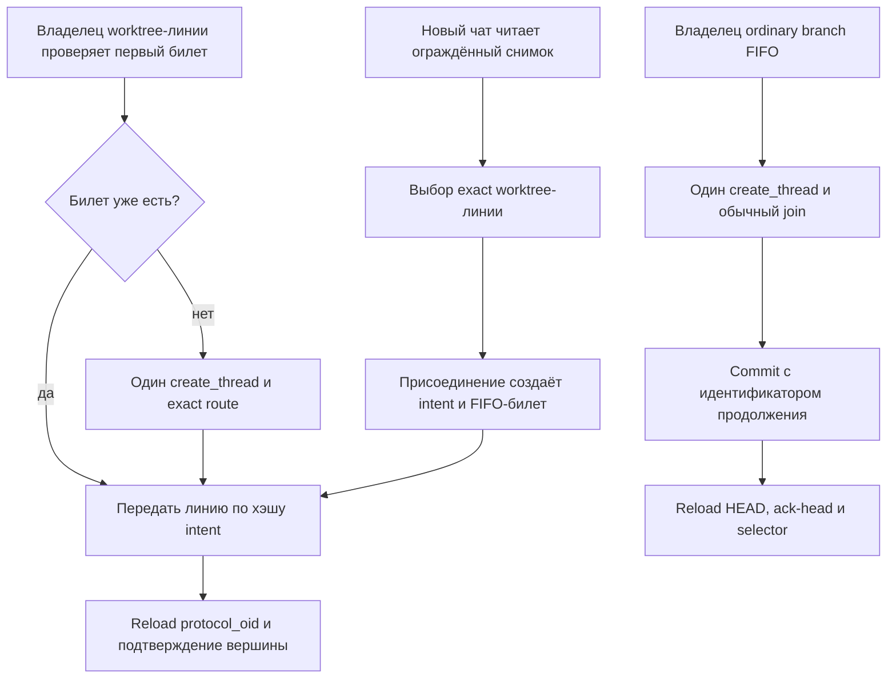

# Обязательное продолжение Git-ветки после коммита

[Обязательное продолжение ветки](../Глоссарий/обязательное-продолжение-ветки.md) — действующий контур последовательного развития уже выбранной именованной Git-линии. До обычного промежуточного коммита [рабочей сессии](../Глоссарий/рабочая-сессия.md) существует ровно один первый exact-билет продолжения того же полного ref, физического worktree и FIFO. Для worktree-линии его может заранее зарегистрировать самостоятельно открытый чат; только при отсутствии билета владелец создаёт одну задачу-продолжение. Для обычной branch FIFO, включая `master`, владелец всегда заранее создаёт отдельную задачу. Терминальные commits результата писателя, ревью и интеграционного кандидата локального пула завершают отдельные назначения собственными квитанциями и обязательного продолжения не создают.

Этот контур заменяет плановый автозапуск внутри последовательной линии. Для её движения больше не нужны расписание, heartbeat, постоянная прикреплённая задача, общий диспетчер, реестр периодических заданий, диспетчерские резервации или восстановительный тик. Источником следующего запуска служит только предшествующая сессия, действительно дошедшая до обычного коммита линии. Чисто завершившаяся сессия и терминальное назначение пула новую задачу-продолжение не создают.

## Маршрутизация новой задачи

Обычный новый чат Codex начинает в первичном checkout с доверенного read-only-маршрута по актуальному плану и неизменяемым квитанциям активных линий. Маршрутизатор не выдаёт пишущее полномочие по имени чата, cwd, похожему ref, одному `HEAD` или свободному тексту. Он различает четыре закрытых класса:

- read-only-задача не резервирует писательский слот;
- независимый писатель лениво резервирует, переиспользует либо материализует `Подузлы/слот-NNNN` с новым полным ref;
- exact-продолжение выбирает одну worktree-линию из ограждённого снимка, после чего атомарное присоединение создаёт intent, квитанцию и FIFO-билет тех же ref и worktree без второго checkout; заранее созданная владельцем задача предъявляет эквивалентную уже закреплённую связь;
- рецензент и интегратор получают только отдельные назначения, закрепляющие точные проверяемые объекты.

`refs/heads/master` является явным исключением размещения: его созданное владельцем доказанное продолжение остаётся в первичном checkout и использует обычную branch FIFO. Независимый писатель, лишь открытый из этого каталога, получает отдельные ref и слот. После регистрации продолжения отсутствующая, использованная, stale либо несовпавшая квитанция закрывает маршрут без резервного независимого выделения.

## Идентичность продолжения

Продолжение связывается с идентичностью именованной линии, полным локальным ref вида `refs/heads/...`, физическим worktree, его FIFO, родительскими task и generation и точным `CODEX_THREAD_ID`. Короткое имя ветки, похожий ref, remote-ветка или только текущий `HEAD` не заменяют эту совокупность. Самостоятельно открытый чат worktree-линии создаёт intent и билет своим ограждённым выбором из актуального снимка. `create_thread` в том же сохранённом проекте используется, когда владельцу worktree-линии не хватает первого билета, и всегда используется перед промежуточным коммитом обычной branch FIFO; только для созданной host-задачи квитанция дополнительно закрепляет подтверждённый `hostId`. Любая новая host-задача начинает из первичного каталога, а exact route последовательно направляет worktree-продолжение в уже существующий слот без второго checkout.

Одновременно активные писатель, независимый рецензент и интегратор занимают разные слоты. Checkout, индексы, полные рабочие refs и очереди этих слотов различаются; object database, Git common-dir и refs общие и образуют доверенную кооперативную границу. Поэтому идентичность продолжения доказывает последовательное владение своим checkout и ref, но не превращает linked worktree в отдельный репозиторий.

Prompt созданного владельцем продолжения закрепляет хэш квитанции, полный ref и относительные к проекту входы, но не переносит абсолютные пути файловой системы. Самостоятельно открытый чат не получает родительский prompt как полномочие: его связывают только свежий снимок маршрута и атомарно созданный intent. Ни один путь не выдаёт право записи заранее. Единственным авторитетным допуском остаётся FIFO физического checkout линии, а идентичностью задачи — её фактический `CODEX_THREAD_ID`, совпадающий с закреплённым `threadId`.

Удалённая ветка и `push` в идентичность продолжения не входят. Локальное продолжение может начаться после передачи локального коммита, не ожидая публикации. После терминализации назначения worktree-пула точный результирующий commit замораживается под устойчивым локальным result-ref; лишь тогда чистый слот без владельца, ожидающих билетов и поздних писателей можно вернуть в пул до ревью.

Автоматическая публикация result-ref является отдельным последующим транспортом: после проверки публикационной чистоты ref отправляется без force в настроенный remote того же репозитория и подтверждается точным readback. Ошибка сети или аутентификации сохраняет локальный ref и `publication_pending`. Этот транспорт не продолжает веточную FIFO, не создаёт GitHub fork или pull request и не разрешает remote `master` до принятой интеграции и обязательного повторного независимого ревью.

## Переход между сессиями

Переход строится до создания объекта коммита и сохраняет одного владельца записи на всём пути, но worktree-линия и обычная branch FIFO используют разные машинные команды:

В worktree-профиле самостоятельно открытый чат выбирает exact активную линию из свежего снимка и вызывает `присоединиться-к-линии`: одна ограждённая транзакция создаёт continuation-intent и возрастающий FIFO-билет тех же слота, ref и worktree. Если к моменту готовности промежуточного коммита такого первого билета нет, владелец создаёт ровно одну задачу и получает от неё эквивалентную связь; существующий билет запрещает создавать замену. До handoff продолжение остаётся ожидающим и не меняет checkout, индекс, refs или внешнее состояние.

Владелец worktree-линии вызывает `передать-линию` с exact хэшем continuation-intent. Pre-commit CAS сверяет assignment, поколение, исходную вершину, полный ref и первый билет, один раз выбирает реальную UTC-дату в Git raw-форме и закрепляет commit intent с exact родителем, деревом, хэшем сообщения и Git-идентичностями. Exact replay берёт те же байты даты и идентичностей, после свежего readback создаётся exact raw commit, а финальная CAS двигает только ref линии, передаёт её FIFO, обновляет состояние пула и сохраняет квитанцию. Новая handoff-квитанция схемы `.3` обязана ссылаться на exact intent proof; dual-reader принимает legacy handoff `.2` только для read/recovery/replay, а прежние квитанции и их bytes и hashes не переписываются. Новый владелец получает `reload_required`, перечитывает правила из закреплённого доверенного `protocol_oid`, сверяет фактические ref, вершину и `worktree_id`, вызывает `подтвердить-вершину-линии` и лишь после `admitted` продолжает то же назначение. Текущий result либо integration candidate не становится источником протокола.

После активации версионной миграции pool-side-барьер выполняется до сохранения плана и заново перед каждым внутренним чистым либо конфликтным merge, recovery подготовленного merge и конфликтным commit. Он требует result `.3` и доказывает по exact intent и raw object полный диапазон каждого результата: все handoff и terminal result. Target-side bridge повторяет это доказательство вместе с merge-intent и перед каждым изменяющим target merge принимает только integration candidate `.2` и все связанные с ним results `.3`. Legacy candidate `.1`, result `.2` и handoff `.2` сохраняются для recovery и replay, но не проходят новый merge; их согласованная миграция отдельна, а прежние bytes и hashes не переписываются. Bootstrap C0 проходит старый pinned bridge только после полного завершения и проверки исправления, сохраняет существующий FIFO-ticket на его месте и вводит dual-reader; первый новый формат базируется уже на обновлённом target, а схема CAS-integration остаётся `.1`.

В ordinary branch FIFO, включая `master`, владелец до коммита всегда ровно один раз вызывает `create_thread`. Успешным подтверждением считаются только непустые точные `threadId` и `hostId`; предварительный `clientThreadId`, частичный ответ или косвенный вывод об успехе не подходят. Созданная задача safe HEAD-bootstrap-командой регистрирует обычный `join` и ждёт. Команда `commit --идентификатор-продолжения <threadId>` повторно проверяет владельца, поколение, исходный `HEAD`, полный ref, индекс и точный билет, а одной Git-транзакцией обновляет ветку, передаёт branch-scoped FIFO и создаёт неизменяемую квитанцию связи.

Когда ordinary-билет достигает головы, продолжение перечитывает фактические `HEAD`, `AGENTS.md`, контракт очереди и затронутые материалы, выполняет `ack-head` и получает право записи только после нового `admitted`. Затем оно повторяет ожидающие публикации и заново вызывает веточный селектор. Более ранние билеты могли законно продвинуть ref ещё раз; старый prompt сообщает идентичность линии, но не закрепляет устаревший содержательный снимок. В обоих профилях FIFO не допускает обхода более ранней задачи, а после успешного handoff прежний владелец больше не выполняет мутаций.

## Линейное продолжение и двоичная развилка

Обязательное продолжение является унарным ребром внутри одной последовательной именованной линии [ветвевого fork FUM](../Глоссарий/ветвевой-fork-FUM.md): один её подтверждённый обычный коммит связывается ровно с одной следующей задачей того же worktree и полного ref. Оно не создаёт новую ветку, не меняет логическую идентичность fork и не может быть заменено двумя продолжениями ради разветвления. Терминальные result-, review- и integration-commits принадлежат другим назначениям и этим ребром не считаются.

Двоичная развилка является целевой, ещё не реализованной архитектурой FUM-REQ-0043 и отдельным ограждённым переходом над уже зафиксированной вершиной. Если перед ней требовался содержательный коммит, унарное продолжение сначала принимает его через атомарный handoff своего runtime-профиля; затем координатор не меняет родительский рабочий ref, сохраняет сагу в ref состояния модерации и после активации детей завершает родительское FIFO через `finish-clean`.

Переход создаёт паспорт родителя и двух детей, разные рабочие refs и checkout и две начальные host-задачи без права записи. Дети регистрируются в глобальном предактивационном состоянии, которое сама очередь проверяет до входа в FIFO новой ветки; они активируются только единым CAS-переходом после подтверждения обеих привязок. Между двумя host-вызовами и несколькими репозиториями нет общей Git-транзакции, поэтому частичный или неоднозначный исход не разрешает повтор по догадке. Сага продолжается только от сохранённой доказанной границы посредством авторитетного чтения прежней попытки либо явного человеческого восстановления.

После активации прежняя родительская host-сессия освобождает владение, а тот же родительский логический узел сохраняется как восстанавливаемый модератор, не порождая третьего fork. Каждый ребёнок с этого момента снова применяет обычное обязательное продолжение на своей единственной рабочей ветке. Ожидающая задача-продолжение не считается второй активной сессией: активным является только допущенный пишущий владелец, тогда как неактивные и внешние проверяющие задачи без права записи владельцами ветвевого fork не являются.

## Выбор работы в продолжении

После допуска продолжение ordinary branch FIFO напрямую читает рабочий набор [следующего шага ветки](../Глоссарий/следующий-шаг-ветки.md). Между ним и селектором нет планового посредника, общего задания, резервации или heartbeat. Селектор вычисляет состояние на новом `HEAD` и даёт один из трёх исходов:

- `ready` — сессия принимает одну готовую карточку, исполняет её полный проверочный контур и при собственном коммите повторяет тот же протокол продолжения;
- `done` — веточная цепочка завершена, сессия выполняет `finish-clean` и не создаёт ребёнка;
- `not_ready` — сейчас нет допустимой карточки, сессия выполняет `finish-clean`, а цепочка останавливается до нового явного запуска или изменения условий.

Таким образом, ordinary-коммит образует следующий узел веточной цепочки, а чистое завершение является её явной терминальной границей. Продолжение не обязано создавать пустой коммит ради поддержания цепочки. Worktree-продолжение вместо селектора возвращается к exact назначению своей `self_line` после допуска по `protocol_oid`; его полномочия не выводятся из рабочего набора основной ветки.

## Закрытое поведение при сбоях

Строки о `create_thread` относятся к случаю, когда владелец действительно создаёт продолжение: всегда для ordinary branch FIFO и только при отсутствии первого билета для worktree-линии. Потерянный ответ `присоединиться-к-линии` восстанавливается по exact `task_id` из Git-состояния прежних intent и FIFO, а не новым билетом.

| Наблюдение                                                                 | Результат                                                                                                                                        |
| -------------------------------------------------------------------------- | ------------------------------------------------------------------------------------------------------------------------------------------------ |
| `create_thread` вернул ошибку до точного подтверждения                     | Родитель не коммитит; продолжение не считается созданным.                                                                                        |
| Ответ создания потерян, истёк по тайм-ауту, неполон или неоднозначен       | Родитель не коммитит и автоматически не повторяет создание, потому что первая задача могла фактически появиться.                                 |
| Точные `threadId` и `hostId` получены, но ожидающий билет ещё не обнаружен | Родитель сохраняет владение и ждёт того же ребёнка; заменяющая задача не создаётся.                                                              |
| Билет относится к другой задаче, очереди, рабочей копии или ветке          | Commit+handoff закрывается отказом до создания коммита.                                                                                          |
| `HEAD`, ref, поколение, индекс или очередь изменились                      | Git-переход закрывается отказом; прежняя связь не переносится на новый снимок по догадке.                                                        |
| Создание подтверждено, но commit+handoff не состоялся                      | Ребёнок остаётся ожидающим за родителем; родитель исправляет причину и не создаёт ещё одного продолжения для той же попытки.                     |
| Ребёнок перестал исполняться после успешной передачи                       | Очередь безопасно останавливается на нём до возобновления той же задачи либо отдельного явно разрешённого восстановления; таймер его не обходит. |

Автоматический повтор допустим для идемпотентного выяснения исхода уже начатых присоединения, handoff и других Git-переходов, но не для неоднозначного host-вызова создания задачи. Эта асимметрия сохраняет безопасность на границе, где Git-транзакция не может атомарно охватить Codex-host.

## Гарантии и границы живучести

Контур даёт проверяемую локальную гарантию: каждый подтверждённый обычный коммит последовательной именованной линии связан с одним точным уже зарегистрированным продолжением и его ожидающим билетом в тех же FIFO, worktree и ref. Идентификатор связи и квитанция продолжения хранятся в результате очереди и неизменяемой Git-квитанции, поэтому точный повтор handoff-команды своего профиля не назначает коммиту другого ребёнка и восстанавливает прежний результат даже после более поздней передачи FIFO. Эта гарантия намеренно не относится к терминальным commits результата, ревью и интеграционного кандидата.

Для пути, на котором требовался `create_thread`, эта гарантия не является транзакционным exactly-once host-вызова. Host и Git принадлежат разным системам. Если host успел создать задачу, но ответ потерян, неизвестная задача может существовать, однако родитель не создаёт дубль и не коммитит. Если Git-переход не состоялся после подтверждённого создания, известный ребёнок остаётся заблокированным за родителем. Контур выбирает безопасную остановку вместо обещания безусловного прогресса.

Живучесть также не гарантируется одной структурой протокола. Она зависит от доступности Codex-host, фактических доверенного маршрута и команды входа соответствующего профиля, возобновляемости задачи, целостности worktree и — для ordinary branch FIFO — наличия готовой карточки. Нет фонового наблюдателя, который обнаружит молчаливую остановку, повторит host-вызов, снимет владельца или обойдёт билет. Ручное восстановление не выводится из факта остановки и требует собственного явного полномочия и ограждения.

Документарный и эталонный прототип машинно закрепляет exact slot `repo-root`, ref и `HEAD` для содержательных команд. Codex Desktop пока не предоставляет протоколу перенос workspace на уровне host с отдельным машинным ACK. Поэтому этот результат не является нативной изоляцией host, не доказывает отсутствие чтений первичного checkout и до появления такого ACK дополнительно зависит от соблюдения агентом сформированного workdir-маршрута. Linked worktree также разделяют object database, refs и Git common-dir и не становятся отдельными клонами.

Для нескольких линий каждая цепочка связывается со своими полным ref, физическим worktree и FIFO. Коммит одной линии не создаёт право продолжать другую, а сохранённый проект сам по себе не доказывает принадлежность. Независимые совместимые писатели могут работать параллельно в разных слотах; FIFO сериализует только сессии одной линии и не разрешает переупорядочивать её билеты ради ускорения.

Продолжение ветки не предоставляет полномочий на публикацию. Узкий транспорт result-ref worktree-пула получает собственное заранее закреплённое полномочие только после терминализации линии и проверки публикационной чистоты; он не расширяет права продолжения. Возможный отдельный периодический транспорт для других refs и репозиториев остаётся предметом [вопроса о границах публикации ветки](../Вопросы/2026-07-27_15-21-35_MSK_границы-периодической-публикации-ветки.md).

## Снятый контур автозапуска

[Диспетчер автоматизаций FUM](../Глоссарий/диспетчер-автоматизаций-FUM.md) сохранён только как исторический термин. Его heartbeat, прикреплённая управляющая задача, реестровые задания, резервирование, аналитика завершений, ограждённое автоматическое возобновление и восстановление по следующему тику больше не являются действующим путём запуска. Их артефакты могут оставаться в истории и совместимом локальном коде для происхождения или безопасной миграции, но не дают runtime-полномочий и не конкурируют с обязательным продолжением ветки.

Действующий контур сохраняет только две необходимые опоры прежней инфраструктуры: FIFO-сериализацию записи и веточный селектор. Они вызываются непосредственно родительской и дочерней сессиями и не образуют новый периодический диспетчер.

## Опорные материалы

- [Ветвевой fork FUM](../Глоссарий/ветвевой-fork-FUM.md)
- [Контракт FIFO-очереди задач Git-ветки](../Инструменты/fum-ocheredj-zadach-git-vetki/SKILL.md)
- [Контракт следующего шага ветки](../Инструменты/fum-sleduyusjhij-shag-vetki/SKILL.md)
- [Рабочая сессия](../Глоссарий/рабочая-сессия.md)
- [Следующий шаг ветки](../Глоссарий/следующий-шаг-ветки.md)

## Источники требований

- [исходный запрос 2026-08-14 23:27:28 MSK — Исправить даты коммитов пула worktree-подузлов](../Журнал/2026-08-14_23-27-28_MSK_исправить-даты-коммитов-пула-worktree-подузлов/запрос.md)
- [исходный запрос 2026-08-13 18:17:47 MSK — Организовать параллельные сессии в локальных worktree-подузлах](../Журнал/2026-08-13_18-17-47_MSK_организовать-параллельные-сессии-в-изолированных-fork-подузлах/запрос.md)
- [исходный запрос 2026-08-12 03:09:35 MSK — Смоделировать ветвление FUM деревом форков](../Журнал/2026-08-12_03-09-35_MSK_смоделировать-ветвление-FUM-деревом-форков/запрос.md)
- [исходный запрос 2026-08-11 23:30:57 MSK — Заменить автозапуск обязательным продолжением ветки](../Журнал/2026-08-11_23-30-57_MSK_заменить-автозапуск-обязательным-продолжением-ветки/запрос.md)
- [исходный запрос 2026-07-20 20:06:04 MSK — Запускать следующие шаги веток](../Журнал/2026-07-20_20-06-04_MSK_запускать-следующие-шаги-веток/запрос.md)

<!-- FUM-MD-RECENCY:BEGIN -->
<!-- last-content-edit: 2026-08-15 03:02:19 MSK -->
<!-- content-sha256: sha256:fc50734ec86f761ad3f1e0345c1f053350f4ba95cbcc99ffaf69b8cb4e4028e4 -->
<!-- FUM-MD-RECENCY:END -->
