# Обязательное продолжение Git-ветки после коммита

[Обязательное продолжение ветки](../Глоссарий/обязательное-продолжение-ветки.md) — действующий контур последовательного развития именованной Git-ветки. Каждая [рабочая сессия](../Глоссарий/рабочая-сессия.md), которая собирается завершиться коммитом, сначала создаёт отдельную задачу-продолжение в том же сохранённом локальном проекте Codex и ставит её в FIFO-очередь той же ветки. Коммит допустим только после точного подтверждения созданной задачи и её ожидающего билета. Поэтому продолжение является предусловием коммита, а не необязательным действием после него.

Этот контур заменяет плановый автозапуск. Для движения ветки больше не нужны расписание, heartbeat, постоянная прикреплённая задача, общий диспетчер, реестр периодических заданий, диспетчерские резервации или восстановительный тик. Источником следующего запуска служит только предшествующая сессия, действительно дошедшая до коммита. Сессия, завершившаяся без коммита, новую задачу не создаёт.

## Идентичность продолжения

Продолжение связывается с полным локальным ref вида `refs/heads/...`, физической рабочей копией и сохранённым проектом Codex. Короткое имя ветки, похожий ref, remote-ветка или только текущий `HEAD` не заменяют эту совокупность. Создание выполняется через `create_thread` с целью того же сохранённого проекта и локальной средой проекта: отдельный worktree для продолжения не создаётся, потому что ребёнок должен войти в ту же веточную очередь и принять тот же checkout после передачи.

Дочерний prompt закрепляет полный ref и относительные к проекту входы, но не переносит абсолютные пути файловой системы. Он не выдаёт ребёнку право записи заранее. Единственным авторитетным допуском остаётся FIFO-очередь физической рабочей копии, а единственной идентичностью новой задачи — её фактический `CODEX_THREAD_ID`, совпадающий с подтверждённым `threadId`.

Удалённая ветка и `push` в эту идентичность не входят. Локальное продолжение может начаться после передачи локального коммита, не ожидая публикации; публикация остаётся отдельным явно разрешённым действием.

## Переход между сессиями

Переход строится до создания объекта коммита и сохраняет одного владельца записи на всём пути:

```mermaid
flowchart LR
    родитель["Родитель подготовил проверяемый коммит"] --> создание["create_thread в том же локальном проекте"]
    создание --> подтверждение["Точные threadId и hostId"]
    подтверждение --> вход["Ребёнок первым инструментом выполняет join"]
    вход --> ожидание["Точный ожидающий FIFO-билет той же ветки"]
    ожидание --> передача["Атомарные commit и handoff с идентификатором продолжения"]
    передача --> очередь["Строгий FIFO без обхода ранних билетов"]
    очередь --> перечитывание["Ребёнок перечитывает фактический HEAD"]
    перечитывание --> выбор["Прямой выбор следующего шага ветки"]
```

Родитель доводит содержательную работу и проверки до состояния, готового к фиксации, но ещё сохраняет владение очередью. Затем он ровно один раз вызывает `create_thread`. Успешным подтверждением считаются только непустые точные `threadId` и `hostId`; предварительный `clientThreadId`, частичный ответ или вывод об успехе по косвенным признакам не подходят.

Созданная задача первым инструментальным действием выполняет `join` для точной очереди ветки. До передачи она остаётся в состоянии `waiting` и не изменяет checkout, индекс, refs или внешнее состояние. Родитель проверяет, что фактический `CODEX_THREAD_ID` ребёнка совпадает с подтверждённым `threadId`, а его билет является точным допустимым продолжением в той же очереди. Билет продолжения не обходит уже зарегистрированные более ранние задачи: commit+handoff сохраняет строгий FIFO, а связь с ребёнком остаётся в квитанции до его законной позиции.

Команда очереди получает идентификатор продолжения как часть закрытого запроса на commit+handoff. Она повторно проверяет владельца, поколение, исходный `HEAD`, полный ref, подготовленный индекс и точный ожидающий билет, а одной Git-транзакцией обновляет ветку, передаёт очередь и создаёт неизменяемую branch- и checkout-scoped квитанцию связи. Наличие канонического маркера в `HEAD` машинно запрещает коммит без ребёнка, а первый связанный коммит закрепляет необратимую активацию в состоянии очереди. Для связанного коммита снятые dispatcher-, reservation-, claim-, ledger- и analytics-переходы не исполняются. После успеха родитель больше не выполняет мутаций, а ребёнок получает новое состояние очереди только через обычный протокол допуска.

Когда билет ребёнка достигает головы очереди, он видит фактический текущий `HEAD`, перечитывает из checkout актуальные `AGENTS.md`, контракт очереди и затронутые материалы, подтверждает точный объект и только после нового допуска получает право записи. Более ранние билеты могли законно продвинуть тот же ref ещё раз; ребёнок продолжает ветку от принятой FIFO-вершины, а старый prompt сообщает назначение, но не закрепляет устаревший снимок.

## Линейное продолжение и двоичная развилка

Обязательное продолжение является унарным ребром внутри одного [ветвевого fork FUM](../Глоссарий/ветвевой-fork-FUM.md): один подтверждённый коммит связывается ровно с одной следующей задачей того же checkout и полного ref. Оно не создаёт новую ветку, не меняет логическую идентичность fork и не может быть заменено двумя продолжениями ради разветвления.

Двоичная развилка является целевой, ещё не реализованной архитектурой FUM-REQ-0043 и отдельным ограждённым переходом над уже зафиксированной вершиной. Если перед ней требовался содержательный коммит, обычное унарное продолжение сначала принимает его через `commit+handoff`; затем координатор не меняет родительский рабочий ref, сохраняет сагу в ref состояния модерации и после активации детей завершает родительское FIFO через `finish-clean`.

Переход создаёт паспорт родителя и двух детей, разные рабочие refs и checkout и две начальные host-задачи без права записи. Дети регистрируются в глобальном предактивационном состоянии, которое сама очередь проверяет до входа в FIFO новой ветки; они активируются только единым CAS-переходом после подтверждения обеих привязок. Между двумя host-вызовами и несколькими репозиториями нет общей Git-транзакции, поэтому частичный или неоднозначный исход не разрешает повтор по догадке. Сага продолжается только от сохранённой доказанной границы посредством авторитетного чтения прежней попытки либо явного человеческого восстановления.

После активации прежняя родительская host-сессия освобождает владение, а тот же родительский логический узел сохраняется как восстанавливаемый модератор, не порождая третьего fork. Каждый ребёнок с этого момента снова применяет обычное обязательное продолжение на своей единственной рабочей ветке. Ожидающая задача-продолжение не считается второй активной сессией: активным является только допущенный пишущий владелец, тогда как неактивные и внешние проверяющие задачи без права записи владельцами ветвевого fork не являются.

## Выбор работы в продолжении

После допуска продолжение напрямую читает рабочий набор [следующего шага ветки](../Глоссарий/следующий-шаг-ветки.md). Между ним и селектором нет планового посредника, общего задания, резервации или heartbeat. Селектор вычисляет состояние на новом `HEAD` и даёт один из трёх исходов:

- `ready` — сессия принимает одну готовую карточку, исполняет её полный проверочный контур и при собственном коммите повторяет тот же протокол продолжения;
- `done` — веточная цепочка завершена, сессия выполняет `finish-clean` и не создаёт ребёнка;
- `not_ready` — сейчас нет допустимой карточки, сессия выполняет `finish-clean`, а цепочка останавливается до нового явного запуска или изменения условий.

Таким образом, коммит образует следующий узел цепочки, а чистое завершение является её явной терминальной границей. Продолжение не обязано создавать пустой коммит ради поддержания цепочки.

## Закрытое поведение при сбоях

| Наблюдение                                                                 | Результат                                                                                                                                        |
| -------------------------------------------------------------------------- | ------------------------------------------------------------------------------------------------------------------------------------------------ |
| `create_thread` вернул ошибку до точного подтверждения                     | Родитель не коммитит; продолжение не считается созданным.                                                                                        |
| Ответ создания потерян, истёк по тайм-ауту, неполон или неоднозначен       | Родитель не коммитит и автоматически не повторяет создание, потому что первая задача могла фактически появиться.                                 |
| Точные `threadId` и `hostId` получены, но ожидающий билет ещё не обнаружен | Родитель сохраняет владение и ждёт того же ребёнка; заменяющая задача не создаётся.                                                              |
| Билет относится к другой задаче, очереди, рабочей копии или ветке          | Commit+handoff закрывается отказом до создания коммита.                                                                                          |
| `HEAD`, ref, поколение, индекс или очередь изменились                      | Git-переход закрывается отказом; прежняя связь не переносится на новый снимок по догадке.                                                        |
| Создание подтверждено, но commit+handoff не состоялся                      | Ребёнок остаётся ожидающим за родителем; родитель исправляет причину и не создаёт ещё одного продолжения для той же попытки.                     |
| Ребёнок перестал исполняться после успешной передачи                       | Очередь безопасно останавливается на нём до возобновления той же задачи либо отдельного явно разрешённого восстановления; таймер его не обходит. |

Автоматический повтор допустим для идемпотентного выяснения исхода уже начатого Git-перехода, но не для неоднозначного host-вызова создания задачи. Эта асимметрия сохраняет безопасность на границе, где Git-транзакция не может атомарно охватить Codex-host.

## Гарантии и границы живучести

Контур даёт проверяемую локальную гарантию: каждый подтверждённый коммит рабочей сессии связан с одним точным уже созданным продолжением и его ожидающим билетом. Идентификатор связи хранится в результате очереди и неизменяемой Git-квитанции, поэтому точный повтор commit-команды не назначает коммиту другого ребёнка и восстанавливает прежний результат даже после более поздней передачи FIFO.

Эта гарантия не является транзакционным exactly-once для `create_thread`. Host-вызов и Git-коммит принадлежат разным системам. Если host успел создать задачу, но ответ потерян, неизвестная задача может существовать, однако родитель не создаёт дубль и не коммитит. Если Git-переход не состоялся после подтверждённого создания, известный ребёнок остаётся заблокированным за родителем. Контур выбирает безопасную остановку вместо обещания безусловного прогресса.

Живучесть также не гарантируется одной структурой протокола. Она зависит от доступности Codex-host, фактического первого `join`, возобновляемости созданной задачи, целостности локального checkout и наличия готовой карточки. Нет фонового наблюдателя, который обнаружит молчаливую остановку, повторит вызов, снимет владельца или обойдёт билет. Ручное восстановление не выводится из факта остановки и требует собственного явного полномочия и ограждения.

Для нескольких веток каждая цепочка связывается со своим полным ref. Коммит одной ветки не создаёт право продолжать другую, а сохранённый проект сам по себе не доказывает веточную принадлежность. В пределах общей рабочей копии конкурентные сессии по-прежнему сериализуются FIFO и не получают права переупорядочивать билеты ради ускорения продолжения.

Продолжение ветки не предоставляет полномочий на публикацию. Возможный отдельный периодический транспорт для других refs и репозиториев остаётся предметом [вопроса о границах публикации ветки](../Вопросы/2026-07-27_15-21-35_MSK_границы-периодической-публикации-ветки.md).

## Снятый контур автозапуска

[Диспетчер автоматизаций FUM](../Глоссарий/диспетчер-автоматизаций-FUM.md) сохранён только как исторический термин. Его heartbeat, прикреплённая управляющая задача, реестровые задания, резервирование, аналитика завершений, ограждённое автоматическое возобновление и восстановление по следующему тику больше не являются действующим путём запуска. Их артефакты могут оставаться в истории и совместимом локальном коде для происхождения или безопасной миграции, но не дают runtime-полномочий и не конкурируют с обязательным продолжением ветки.

Действующий контур сохраняет только две необходимые опоры прежней инфраструктуры: FIFO-сериализацию записи и веточный селектор. Они вызываются непосредственно родительской и дочерней сессиями и не образуют новый периодический диспетчер.

## Опорные материалы

- [Ветвевой fork FUM](../Глоссарий/ветвевой-fork-FUM.md)
- [Контракт FIFO-очереди задач Git-ветки](../Инструменты/fum-ocheredj-zadach-git-vetki/SKILL.md)
- [Контракт следующего шага ветки](../Инструменты/fum-sleduyusjhij-shag-vetki/SKILL.md)
- [Рабочая сессия](../Глоссарий/рабочая-сессия.md)
- [Следующий шаг ветки](../Глоссарий/следующий-шаг-ветки.md)

## Источники требований

- [исходный запрос 2026-08-12 03:09:35 MSK — Смоделировать ветвление FUM деревом форков](../Журнал/2026-08-12_03-09-35_MSK_смоделировать-ветвление-FUM-деревом-форков/запрос.md)
- [исходный запрос 2026-08-11 23:30:57 MSK — Заменить автозапуск обязательным продолжением ветки](../Журнал/2026-08-11_23-30-57_MSK_заменить-автозапуск-обязательным-продолжением-ветки/запрос.md)
- [исходный запрос 2026-07-20 20:06:04 MSK — Запускать следующие шаги веток](../Журнал/2026-07-20_20-06-04_MSK_запускать-следующие-шаги-веток/запрос.md)

<!-- FUM-MD-RECENCY:BEGIN -->
<!-- last-content-edit: 2026-08-12 03:53:39 MSK -->
<!-- content-sha256: sha256:37669ab566cd16545eb0b92721e52108fdc740e2a5d2cdd127a49639349fa1ae -->
<!-- FUM-MD-RECENCY:END -->
