# Архитектура параметрического 3D FUMA

Параметрическое 3D в [FUM](../../Глоссарий/FUM.md) описывает форму, состав, движение и взаимодействие одним каноническим графом. Код сцены и версии [структурирующих операторов](../../Глоссарий/структурирующий-оператор-FUM.md) задают этот граф; геометрическое представление, экран и устройства получают производный результат. Полный объём включает все 13 областей матрицы ниже. Небольшая сцена из [паспорта](паспорт-сцены.md) проверяет только ограниченную часть этого объёма.

Это архитектурный результат FUM-STEP-0224, версия проекта 1. Исполняемый язык сцен, геометрическое ядро, renderer, GUI, игра и VR/AR runtime не реализованы и не выбраны. Числа и контракты первого примера — проверяемое предложение для следующего среза, а не утверждение о готовом интерфейсе FUMA. [Последовательность поставок](../../Планирование/параметрическое-3D-FUMA.md) сохраняет отдельную приёмку остальных областей.

## Каноническое состояние и границы воспроизведения

Принятые входы состоят из неизменных исходных байтов, версий определений операторов, профиля единиц и чисел, начального состояния и упорядоченного журнала принятых действий. Источник входа, его принятие и результат различаются. Снимок и кэш могут ускорять восстановление только после проверки происхождения; полное воспроизведение начинается с входов, а не с ожидаемой картинки.

Логический результат включает идентичности узлов, связи, значения параметров, состояние ограничений, отсчёт времени и принятые события. Геометрический результат добавляет представление и его профиль численной точности. Модель отображения хранит ссылки на эти результаты. Кадр зависит также от устройства, драйвера, разрешения, цветового профиля, камеры и времени предъявления. Сырые позы, касания и кадры окружения не становятся принятыми действиями автоматически. Для повторения интерактивного эпизода сохраняется результат нормализации ввода с версией преобразования и порядком принятия.

Произвольные случайные числа, настенные часы, сеть и незакреплённые ассеты не являются скрытыми входами. Стохастический профиль должен явно хранить алгоритм, версию, seed и порядок выборок; иначе результат помечается невоспроизводимым. Внешнее наблюдение, которое нельзя законно сохранить, оставляет явную границу воспроизведения. Общий принцип полного восстановления состояния из принятых данных остаётся требованием ко всей FUMA; этот план его целиком не реализует.

```mermaid
flowchart LR
    Входы["Код, определения операторов, исходные данные"] --> Приём["Версии и проверка применимости"]
    Приём --> Граф["Канонический граф сцены"]
    Граф --> Вычисление["Параметры, ограничения, время"]
    Вычисление --> Результат["Геометрия и логическое состояние"]
    Результат --> Представление["Модель отображения с происхождением"]
    Представление --> Устройство["Кадр и возможности устройства"]
    Устройство --> Намерение["Нормализованное намерение"]
    Намерение --> Событие["Проверенное принятое действие"]
    Событие --> Граф
```

## Контракты переходов

Каждый переход сохраняет идентификатор сцены, версию определения, точные входные ссылки и исход: принят, отклонён, отменён или незавершён. Значения с единицами не складываются до явного согласования размерностей. Версия описания не заменяет хэш конкретных байтов. Изменение семантики получает новую версию и явную миграцию; неизвестная версия не подменяется ближайшей.

| Переход                         | Идентичность, единицы и версия                                                                                                   | Ошибки и пределы                                                                                | Наблюдаемый результат                                                                             |
| ------------------------------- | -------------------------------------------------------------------------------------------------------------------------------- | ----------------------------------------------------------------------------------------------- | ------------------------------------------------------------------------------------------------- |
| Код → распознанные формы        | Хэш исходных байтов, диапазоны исходника, ID/версия операторного определения; единицы ещё явные литералы                         | Неизвестная форма, неоднозначный разбор, неверная кодировка; предел байтов, глубины и работы    | Формы со ссылками на исходник либо диагностический остаток; скрытый доменный parser не появляется |
| Формы → граф                    | Стабильные ID сущностей и типизированные рёбра; версия схемы графа; оси, масштаб и размерности                                   | Дубликат ID, отсутствующая ссылка, несовместимая единица; предел узлов/рёбер                    | Полный проверенный кандидат графа; отсутствие частично принятой сцены                             |
| Граф → вычисление               | Версия каждого оператора, упорядоченные зависимости, профиль чисел, целый номер шага и рациональная длительность                 | Несовместимые ограничения, цикл исполнения, несходимость, превышение работы                     | Значения, остатки ограничений и трасса прочитанных/изменённых узлов                               |
| Вычисление → геометрия/движение | ID тела отдельно от версии его формы; координатные пространства и допуск представления; поза на логическом шаге                  | Вырождение, потеря топологической ссылки, выход диапазона, недопустимое движение                | Размеры, границы, топология/образцы и кинематическое состояние по профилю                         |
| Результат → модель отображения  | ID элемента, версия оператора проекции, ID источника и принятого поколения; мировые единицы → единицы представления              | Устаревшее поколение, неизвестный материал/камера; предел элементов и производных вершин        | Инертная модель с происхождением и допустимыми действиями                                         |
| Модель → устройство             | Версия адаптера, API/драйвера и профиль устройства; пиксели, цвет, время предъявления                                            | Нет возможности, потеря устройства, бюджет кадра; ограничения конкретного профиля               | Наблюдение кадра с метаданными или явно ограниченный режим, без изменения канонической сцены      |
| Ввод → намерение → событие      | ID наблюдения и действия, версия нормализации, целевой ID, ожидаемое поколение, порядок; локальные координаты преобразуются явно | Неоднозначный выбор, потеря привязки, конфликт поколения, отсутствие разрешения; предел событий | Отклонение без изменения либо одно принятое событие и новое поколение                             |
| Сохранение → восстановление     | Полные входы, определения, журнал и проверенные ссылки; версия хранения и канонизации                                            | Повреждённые байты, недоступное определение, незавершённая запись                               | То же логическое состояние; временные хвосты и кэш не назначают принятую вершину истории          |

Пример паспорта использует точные целые миллиметры и рациональное время. Для общего графа планируется явное различение пространства модели, локальных пространств объектов, мирового пространства, камеры и устройства. Матрицы преобразований должны хранить направление, единицы и версию; соглашение первого примера не выбирает соглашения всех внешних форматов.

## Представления, ограничения и пересчёт

| Потребность                  | Сравниваемые представления                                                                        | Решение этого плана и граница                                                                                                                                                                                              |
| ---------------------------- | ------------------------------------------------------------------------------------------------- | -------------------------------------------------------------------------------------------------------------------------------------------------------------------------------------------------------------------------- |
| Размеры и технические детали | Аналитические примитивы/конструктивные операции; граничная модель с топологией; треугольная сетка | Авторитетны параметры и история построения. Первому примеру достаточно аналитических коробок. Сетка удобна для показа, но сама не доказывает точность размеров или пригодность к изготовлению                              |
| Сборки и механизмы           | Экземпляры тел, локальные преобразования, система сопряжений; слитая геометрия                    | Сохранять экземпляры и сопряжения отдельно. Слияние тел теряет степени свободы. Идентичность грани после перестроения требует отдельного решения, порядковый номер грани ненадёжен                                         |
| Свободные формы              | Полигональная сетка, параметрические поверхности, неявное поле                                    | Не выбирать единственное ядро до сравнения. Контроль формы, непрерывность и точность поверхности имеют разные критерии. Переход к сетке сохраняет допуск и происхождение; обратное редактирование может быть неоднозначным |
| Окружение большого размера   | Плитки рельефа, экземпляры, уровни детализации, локальные системы координат                       | Разделить авторитетный рельеф и производную детализацию. Смена детализации не меняет логические высоты или привязки                                                                                                        |
| Люди                         | Геометрическая модель, иерархия сочленений, привязка поверхности, поза, временная дорожка         | Пять различимых сущностей, а не единый непрозрачный файл. Синтетическая фигура достаточна для первого критерия; реалистичность и биомеханика требуют отдельных данных и допуска                                            |
| Время и взаимодействие       | Аналитические траектории; дискретные события; итерационная динамика                               | Сначала конечный дискретный кинематический пример. Физический solver, контактная динамика и синхронизация сети отдельно обосновываются; физическая точность не обещается                                                   |

Ациклические зависимости вычисляются в устойчивом топологическом порядке с явным разрешением равного приоритета по ID. Граф сопряжений может быть циклическим: это система уравнений, а не разрешение рекурсивно исполнять узлы. Будущий итерационный профиль закрепляет начальное приближение, порядок, критерий сходимости, максимум итераций и результат отказа; недоопределённая система не получает случайное решение. Первый паспорт циклических вычислений не допускает.

Изменение параметра создаёт кандидат поколения. Инкрементальный пересчёт инвалидирует транзитивных потребителей изменённых значений; результат сравнивается с полным пересчётом из принятого входа. Ключ кэша включает все входные хэши, версии операторов, профиль чисел и геометрии. Отсутствующий кэш не меняет результат. Прерывание оставляет последнее принятое поколение; черновой кадр явно помечается и не используется как доказательство принятия.

## Полная матрица областей

Общие механизмы во всех строках: версии операторов, канонический граф, события, ограничения, ресурсы и происхождение проекции. Профиль «логический» означает проверку без устройства; «экранный» требует отдельной подтверждённой графической поставки Э4. Все строки от сборок до игр наследуют оба профиля явно: сначала логическая приёмка, затем экранная. Конкретные ОС, API, версии и устройство ещё не выбраны и закрепляются по платформенным требованиям ниже до исполнения; слово «экранный» не означает доступности произвольной платформы. VR и AR наследуют логическую опору и получают собственные профили из отдельных таблиц, без зачёта обычного экрана. Обозначения этапов относятся к [конечному плану](../../Планирование/параметрическое-3D-FUMA.md).

| Область                        | Сущности и операции; общий механизм                                           | Предметная особенность                                  | Профиль и открытый пример                                           | Критерий будущей приёмки                                                                                                                     | Этап   |
| ------------------------------ | ----------------------------------------------------------------------------- | ------------------------------------------------------- | ------------------------------------------------------------------- | -------------------------------------------------------------------------------------------------------------------------------------------- | ------ |
| Технические детали             | Тело, размер, построение/изменение параметра; зависимости графа               | Размерность, допуск, вырождение                         | Логический + экранный: коробка с изменяемой длиной; затем отверстие | Известные границы и объём; изменение одного размера пересчитывает потребителей; отверстие проверяется геометрически, не по картинке          | Э1, Э2 |
| Сборки                         | Определение детали, экземпляр, сопряжение; ссылки и локальные преобразования  | Независимые ID экземпляров, степени свободы             | Две синтетические детали и одно сопряжение                          | Сдвиг родителя сохраняет сопряжение; конфликт и недоопределённость различимы; полное и частичное вычисления совпадают                        | Э2     |
| Архитектура и помещения        | Стена, перекрытие, проём, помещение; композиция операторов                    | Смежность, внутренние границы и единицы здания          | Две комнаты и дверной проём                                         | Изменение ширины комнаты меняет границы и площадь; проём сохраняет связь со стеной; неверная толщина отвергается                             | Э3     |
| Свободные формы и визуализация | Управляющие точки, поверхность/сетка, материал, камера; производная геометрия | Непрерывность и ошибка аппроксимации                    | Синтетический лоскут с четырьмя границами, одна меняемая точка      | Образцы поверхности и границы в допуске; смена детализации сохраняет источник; разрыв явно диагностируется                                   | Э4     |
| Ландшафт                       | Высотное поле, плитка, размещение; пространственные зависимости               | Швы, масштаб, ограниченный рабочий набор                | Две плитки по сетке 3×3 с общей кромкой                             | Высоты общего края равны; локальная правка меняет нужные плитки; ограничение памяти соблюдено                                                | Э5     |
| Экстерьер                      | Здание, участок, внешний материал, свет/камера; экземпляры                    | Привязка к рельефу, внешняя сцена                       | Дом-коробка на двух плитках и камера                                | Высота основания следует принятому рельефу; геометрия и световая модель разделены; кадр имеет отдельный допуск                               | Э5     |
| Интерьер                       | Комната, мебель, проход, материал; параметрические связи                      | Зазоры и доступность размещения                         | Стол-коробка и дверь в комнате                                      | Увеличение стола пересчитывает зазор; отрицательный зазор даёт ограничение, а не скрытое перемещение мебели                                  | Э3     |
| Люди                           | Модель, сочленения, привязка поверхности, поза; устойчивые ID                 | Анатомический смысл отделён от синтетической формы      | Условная фигура с двумя звеньями руки                               | Длина звеньев сохраняется при смене позы; неверная ссылка на сочленение отвергается; реализм не заявляется                                   | Э6     |
| Анимация                       | Дорожка, ключ, интерполяция, логическое время; события                        | Порядок, границы интервала и повтор                     | Три заданные позы синтетической руки                                | Одинаковые принятые шаги дают одинаковые позы; повтор после остановки не добавляет времени; интерполяция версионирована                      | Э6     |
| Механизмы                      | Звено, шарнир/направляющая, привод, ограничения; кинематика                   | Допустимые движения и остатки сопряжений                | Платформа с кареткой; затем двухзвенный механизм                    | Каретка остаётся на направляющей; шарниры сохраняют условия; несходимость отдельно от столкновения и от повреждения данных                   | Э1, Э7 |
| Игры                           | Состояние, логическое событие, действие, шаг; событийный контур               | Интерактивный цикл и повторяемый порядок ввода          | Каретка достигает цели и увеличивает счёт один раз                  | Повтор журнала даёт тот же счёт и состояние; повтор ID события не начисляет счёт снова; различная частота кадров не меняет логику            | Э8     |
| VR                             | Стереокамеры, поза, контроллер/руки; проекция и нормализация ввода            | Два глаза, трекинг, пространство пользователя, задержка | Та же синтетическая сцена и записанный разрешённый поток поз        | Собственный профиль VR подтверждает стерео, выбор объекта и потерю/возврат трекинга; экран не засчитывается                                  | Э9     |
| AR                             | Якорь, наблюдение окружения, калибровка; привязки и события                   | Права, неопределённость наблюдения, потеря якоря        | Синтетическая плоскость и платформа, затем разрешённое устройство   | Повтор сохранённых наблюдений даёт ту же логическую привязку; потеря якоря блокирует действие; проверен отказ разрешения без изменения сцены | Э10    |

## Отдельный профиль VR

| Аспект      | Контракт планируемого профиля                                                                                              | Отказ и восстановление                                                                                                                |
| ----------- | -------------------------------------------------------------------------------------------------------------------------- | ------------------------------------------------------------------------------------------------------------------------------------- |
| Вывод       | Два вида одного принятого поколения; параметры глаз, масштаб и версия адаптера сохраняются                                 | Отсутствие стереовозможности — профиль недоступен, экранная проекция лишь отдельный режим                                             |
| Ввод        | Поза головы и действия контроллера/руки с ID, источником, временем наблюдения и качеством; нормализация в принятое событие | Потеря трекинга отменяет незавершённый захват; возврат требует новой валидной позы и сверки поколения                                 |
| Координаты  | Пространства сцены, отслеживания, головы и глаз; явное направленное преобразование и единицы                               | Повторная центровка — отдельное событие привязки; старая матрица не используется молча                                                |
| Время       | Логический шаг отделён от частоты предъявления и предсказания позы; измеряются задержка ввода, расчёт и предъявление       | Конкретные частота, пределы задержек и метод измерения выбираются с устройством до допуска; пропуск кадра не добавляет логический шаг |
| Возможности | Наблюдённые устройство, runtime/API/версия, стерео, доступные каналы ввода и границы области                               | Неизвестные возможности не считаются доступными; возврат устройства пересоздаёт только производные ресурсы                            |
| Приёмка     | Повтор журнала проверяет логический результат, измерение на устройстве — стерео/задержки/ввод                              | Нет наблюдённого устройства — статус «профиль не испытан», а не готовность VR                                                         |

## Отдельный профиль AR

| Аспект              | Контракт планируемого профиля                                                                                               | Отказ и восстановление                                                                                         |
| ------------------- | --------------------------------------------------------------------------------------------------------------------------- | -------------------------------------------------------------------------------------------------------------- |
| Вывод               | Принятая сцена плюс камера/окружение и версия композиции; окклюзия только при наличии соответствующих данных                | Нет глубины — окклюзия явно недоступна; отсутствующие наблюдения не синтезируются как истинное окружение       |
| Ввод                | Наблюдения плоскостей/якорей, позы, выбор и подтверждение; качество и происхождение сохраняются                             | Низкое качество или потеря якоря приостанавливает пространственное действие; нужен явный повтор привязки       |
| Координаты          | Пространства сцены, якоря, карты окружения и камеры; калибровка и её версия, масштаб, направление преобразования            | Перестройка карты не меняет принятую геометрию; новая привязка хранится отдельным действием                    |
| Время               | Время наблюдения камеры, позы и предъявления раздельны; логический порядок задаётся принятием                               | Несогласованные метки времени отклоняются; конкретные пороги синхронизации/задержки утверждаются с устройством |
| Возможности и права | Явно наблюдённые API/версия, камера, трекинг, глубина при необходимости; разрешения на получение и хранение окружения       | Отказ/отзыв разрешения останавливает захват; сохранённая синтетическая сцена остаётся доступна без камеры      |
| Данные окружения    | Синтетическая открытая фикстура отделена от частного реального наблюдения; хэш, источник, права хранения и неопределённость | Непубликуемые байты не входят в открытый комплект; отсутствие сохранённых байтов ограничивает повтор окружения |
| Приёмка             | Повтор фикстуры — логическая привязка; разрешённое устройство — регистрация, дрейф, ввод, восстановление                    | Экранный результат и синтетический поток не доказывают реальный AR                                             |

## Фактическая готовность и недостающие механизмы

Инвентарь относится к коммиту запуска `01b329cb49f4c5a5655fab4c16d7ea3a3ebf55a5`. Это осмотр имеющегося кода и его сохранённых границ, не новая проверка runtime. Конкретные адаптеры ниже в данной задаче не подключаются.

| Опора                   | Имеющийся собственный код                                                                                                                                                                                                                                                                | Граница и необходимый конечный контракт                                                                                                                                            |
| ----------------------- | ---------------------------------------------------------------------------------------------------------------------------------------------------------------------------------------------------------------------------------------------------------------------------------------- | ---------------------------------------------------------------------------------------------------------------------------------------------------------------------------------- |
| Память и восстановление | [Хранилище поколений](../../Прототипы/воспроизводимое-пополнение-памяти/Sources/FUMReproducibleMemoryPopulation/ContentAddressedGenerationStore.swift), [доменное поколение](../../Прототипы/воспроизводимое-пополнение-памяти/Sources/FUMReproducibleMemoryPopulation/Generation.swift) | Схемонезависимое хранение и ограниченная память — опора. Нужен валидатор сцены и её полной линии входов; наличие хранилища не доказывает replay 3D                                 |
| События и проекция      | [Ограниченный исполнитель](../../Прототипы/воспроизводимое-пополнение-памяти/Sources/FUMReproducibleMemoryPopulation/Engine.swift), [проекция](../../Прототипы/воспроизводимое-пополнение-памяти/Sources/FUMReproducibleMemoryPopulation/Projection.swift)                               | remember/compose и инертная модель не вычисляют 3D. Переиспользовать границу намерение → событие и происхождение, сохранив предметную семантику в определениях операторов          |
| Память операторов       | [Прототип операторной памяти](../../Прототипы/память-структурирующих-операторов/README.md)                                                                                                                                                                                               | Ограниченные сценарии памяти операторов — не универсальное исполнение геометрии. Нужны явные версии определений, применимость, бюджет и диагностический остаток общего исполнителя |
| Отображение             | [Проба Metal](../../Прототипы/дерево-Markdown-документов-с-Metal/README.md)                                                                                                                                                                                                              | Дерево документов и ограниченное подтверждение Metal не принимают пространственную сцену. Нужен оператор модели отображения и отдельная экранная приёмка                           |
| Ресурсы                 | Лимиты входа, событий и значений [прототипа памяти](../../Прототипы/воспроизводимое-пополнение-памяти/README.md)                                                                                                                                                                         | Не доказаны лимиты геометрии, кадров и устройства. Нужны учёт работы/памяти, отмена и ограниченные производные ресурсы сцены                                                       |

Общий интерпретатор развивается отдельной работой; этот план не вводит параллельный универсальный движок. Следующая реализация должна сначала проверить фактическую поставку общего исполнителя и её контракт. Если необходимых операций ещё нет, результатом остаётся конкретная неподключённая спецификация с диагностикой недостающего контракта, а не новый скрытый исполнитель.

При осмотре кода дополнительно различены ограничения: существующий `CanonicalMemoryJSON` отклоняет `Float/Double`; текущая обратная проекция допускает только новый ключ `remember` и отвергает уже существующий. Изменение параметра и численный профиль 3D не подключены. Память операторов хранит версии и шаблоны, но её ограниченный исполнитель строковых преобразований не является геометрическим вычислителем. Проба Metal выводит двухмерное дерево документов; её выбор узла не доказывает пространственный обратный путь.

## Платформы, права и неизвестные

Требования [графических путей FUMA](../../Требования/🟡-графические-интерфейсы-FUMA.md) сохраняют Metal, DirectX и Vulkan на применимых платформах; [Metal на Apple silicon](../../Требования/🟡-отрисовка-интерфейса-через-Metal.md) имеет свою область. Это не выбор общего геометрического ядра. Для экрана, браузера, VR и AR нужны отдельные реальные API, версии, возможности и измерения; нативный успех не подтверждает браузер.

Первый комплект использует только собственные синтетические данные под [CC0](../../LICENSE); внешних ассетов и новых библиотек нет. Любое будущее предложение зависимости сначала получает точную ревизию, источник, полный перечень доставляемых байтов и реальные LICENSE/NOTICE. Лицензия FUM не перелицензирует чужие файлы. Упоминание формата или класса представления не означает выбора библиотеки, установки или загрузки.

Нерешённые синтаксис, геометрические представления, численные допуски общего solver и профили устройств перечислены в [открытом вопросе](../../Вопросы/2026-09-12_03-46-15_MSK_границы-исполнения-параметрического-3D.md). Их отсутствие не мешает проверить полноту архитектурной матрицы, но блокирует соответствующие исполняемые этапы.

## Источники

- [Первичные команды и все выбранные области](../../Журнал/2026-09-11_20-37-47_MSK_принять-параметрическое-3D-FUMA/запрос.md).
- [Требование FUM-REQ-0077](../../Требования/🟡-универсальное-параметрическое-3D-и-визуализация-FUMA.md), [исходная карточка FUM-STEP-0224](../../Планирование/карточки-шагов/🟡-FUM-STEP-0224-спланировать-параметрическое-3D-FUMA-и-этапы-реализации.md).
- [Принцип восстановления из принятых входов](../../Журнал/2026-09-11_21-47-07_MSK_подтвердить-README-и-уточнить-зеркала/запрос.md).
- [Назначение первого среза](../../Журнал/2026-09-12_00-13-57_MSK_добавить-отложенные-назначения-направлений/материалы/назначения/FUM-STEP-0224.json), [поручение и отчёт текущей задачи](../../Журнал/2026-09-12_03-46-15_MSK_подготовить-матрицу-и-паспорт-3D/запрос.md).

<!-- FUM-MD-RECENCY:BEGIN -->
<!-- last-content-edit: 2026-09-12 04:06:05 MSK -->
<!-- content-sha256: sha256:a21077ad3ac20b8885ea486e4f9a03a8fcefc3ae5256890225285b0704928bd6 -->
<!-- FUM-MD-RECENCY:END -->
