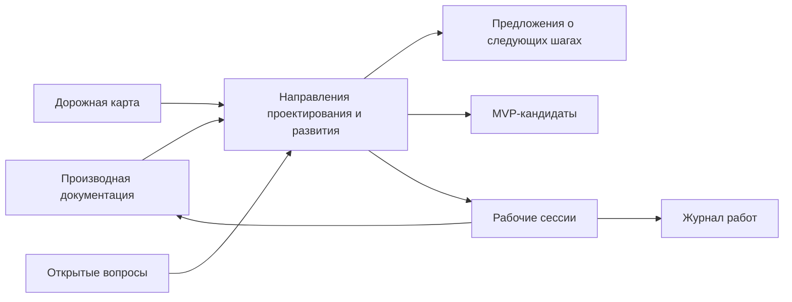

# Направления проектирования и развития FUM

Источники требований:

- [исходный запрос 2026-06-25 17:59:02 MSK](../../Запросы/2026-06-25_17-59-02_MSK.md)

Опорные материалы:

- [Дорожная карта FUM](../дорожная-карта.md)
- [Архитектура FUM](../../Документация/22-архитектура-FUM.md)
- [Обзор проекта FUM](../../Документация/00-обзор-проекта.md)
- [MVP-кандидаты FUM](../MVP-кандидаты/README.md)
- [Предложения о следующих шагах FUM](../предложения-о-следующих-шагах.md)

## Назначение

Этот каталог хранит [направления проектирования и развития FUM](../../Глоссарий/направление-проектирования-и-развития-FUM.md) - сквозные плановые оси между [архитектурой FUM](../../Глоссарий/архитектура-FUM.md), [дорожной картой](../дорожная-карта.md), [MVP-кандидатами](../../Глоссарий/MVP-кандидат.md), [предложениями о следующих шагах](../../Глоссарий/предложение-о-следующем-шаге.md) и будущими рабочими сессиями.

Дорожная карта показывает последовательность горизонтов. MVP-кандидаты показывают возможные стартовые продукты. Направления показывают, какие инженерные и исследовательские области нужно развивать параллельно, чтобы ближние работы не теряли связь с дальней целью [FUM](../../Глоссарий/FUM.md) как открытого агента следующего поколения.

## Как читать направления

Каждое направление отвечает на пять вопросов:

- зачем этот слой нужен в проектировании [FUM](../../Глоссарий/FUM.md);
- на какие документы, термины, вопросы и плановые материалы он опирается;
- какие проектные вопросы нельзя потерять при развитии слоя;
- какие ближайшие проверяемые результаты могут двигать направление вперед;
- какие границы защищают [память FUM](../../Глоссарий/память-FUM.md) от преждевременных или непроверяемых решений.

Направления не являются самостоятельным источником требований. Если из направления возникает новое требование, оно проходит обычную цепочку: [исходный запрос](../../Глоссарий/исходный-запрос.md) -> [производная документация](../../Глоссарий/производная-документация.md) -> проверка -> коммит.

## Карта направлений

| Направление | Смысл | Ближайший тип результата |
| --- | --- | --- |
| [01. Память и происхождение](01-память-и-происхождение.md) | Сохранять входы, источники, решения, проверки, инструменты, журнал и связи требований как проверяемую [память FUM](../../Глоссарий/память-FUM.md). | Улучшения связности рабочей сессии, источников, навигации и реестров происхождения. |
| [02. Автоматизации и язык](02-автоматизации-и-язык.md) | Превращать повторяемые действия в локально воспроизводимые [автоматизации FUM](../../Глоссарий/автоматизация-FUM.md) и постепенно выделять язык их описания. | Тестируемые локальные навыки, CLI-скрипты, контракты, фикстуры и проверки. |
| [03. Агентский цикл и исполняемый контур](03-агентский-цикл-и-исполняемый-контур.md) | Собрать минимальный исполняемый цикл наблюдения, решения, действия, проверки и обновления памяти. | Формат трассы цикла, минимальный запуск, критерии приемки результата. |
| [04. Модельная среда и планирование](04-модельная-среда-и-планирование.md) | Разделять факты, реконструкции прошлого, планы будущего и внутренние модели узлов. | Контейнер сценария, статусы уверенности, ссылки на открытые вопросы. |
| [05. Интерфейс и сервисные адаптеры](05-интерфейс-и-сервисные-адаптеры.md) | Делать [FUM](../../Глоссарий/FUM.md) единой точкой работы человека с инструментами, сервисами и подтвержденными действиями. | Пользовательский контур намерения, адаптеры, уровни доступа и трассы действий. |
| [06. Эволюционные цепочки и отбор](06-эволюционные-цепочки-и-отбор.md) | Использовать ветки, проверки, ревью, передачу результатов и реестр происхождения как носитель отбора. | Паспорт передаваемого результата, минимальный реестр происхождения, правила отбора. |
| [07. Исследования и открытия](07-исследования-и-открытия.md) | Делать гипотезы, эксперименты, отрицательные результаты и открытия нормальной частью проекта. | Карточка эксперимента, отчет воспроизведения, статусы исследовательских утверждений. |
| [08. Физические и дальние контуры](08-физические-и-дальние-контуры.md) | Удерживать физическое действие, аппаратные узлы и космическую автономию как дальний, ограниченный проверками горизонт. | Симуляторы, отчеты о границах воспроизводимости, карты рисков и открытых вопросов. |

## Схема связи

## Правила обновления

- Новое направление добавляется отдельным Markdown-файлом с источником требования, опорными материалами, назначением, проектными вопросами, ближайшими результатами и границами.
- Если направление меняет архитектурную карту [FUM](../../Глоссарий/FUM.md), обновляется [Архитектура FUM](../../Документация/22-архитектура-FUM.md) или соответствующий детальный документ.
- Если направление выявляет неясность требований, создается или обновляется [открытый вопрос](../../Глоссарий/открытый-вопрос.md) в `Вопросы/`.
- Если по направлению появляется практическое продолжение, оно добавляется в [предложения о следующих шагах](../предложения-о-следующих-шагах.md), но не считается требованием до отдельного запроса.
