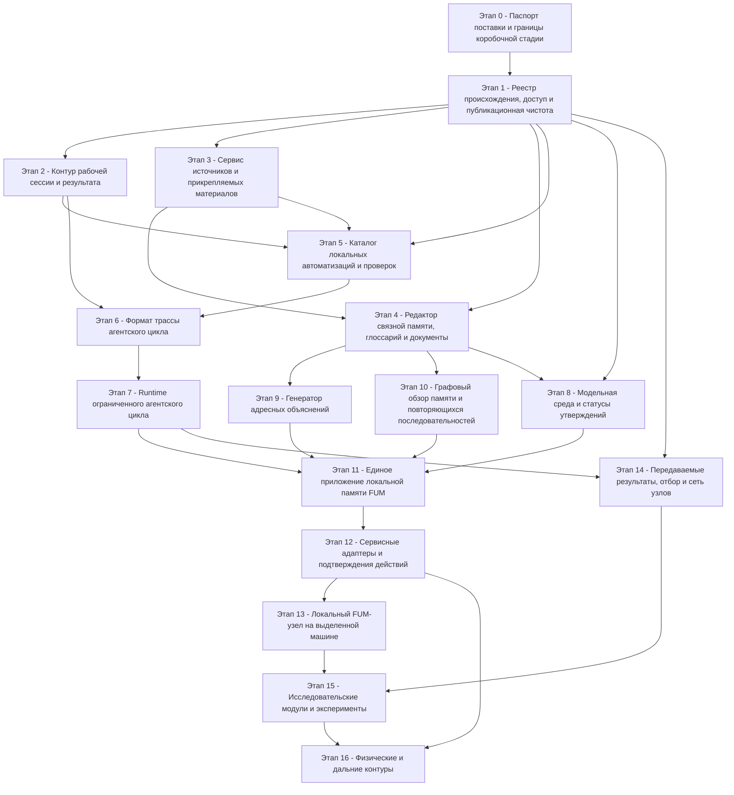

# Граф зависимостей элементов коробочной реализации FUM

[Коробочную реализацию FUM](../../../Глоссарий/коробочная-реализация-FUM.md) нужно строить не как набор независимых функций, а как цепочку слоёв, где каждый следующий элемент получает проверяемые входы, трассы, права доступа и критерии остановки от предыдущих. Поэтому порядок реализации задаётся не только продуктовой привлекательностью, но и тем, какие элементы уже могут надёжно сохранять происхождение, проверку и результат.

Практический вывод: первой должна созреть не единая пользовательская поверхность, а ядро [памяти FUM](../../../Глоссарий/память-FUM.md), происхождения, источников и локальных проверок. Единое приложение становится хорошим первым коробочным продуктом только после того, как оно сможет опереться на рабочие сервисы памяти, источников, автоматизаций, трасс и подтверждений.

Граф показывает текущую лучшую гипотезу порядка, а не окончательный приказ реализации. На каждом переходе нужно заново выбирать, какие уже описанные элементы двигать первыми, какие держать следующими, какие отложить до появления зависимостей, а какие отбросить как не выдержавшие проверку ценой, риском или пользой. Такой выбор сам является частью [двухконтурного отбора FUM](../../../Глоссарий/двухконтурный-отбор-FUM.md): внутренний план должен позднее проверяться внешними результатами.

Новая развилка касается этапов трассы и runtime. Гиперсетевой прототип на Git + Codex может двигаться быстрее как демонстрация памяти, происхождения и отбора; для этапов 6–7 уже проверены структурный [контракт чистого модельного шага](../../../Документация/41-контракт-чистого-модельного-шага.md) и детерминированная заглушка. Эта встроенная model-only-граница достаточна для первого проверяемого `P7`, поэтому полный `P8` не является его предшественником. Реальный LLM-провайдер, отмена и тайм-аут внешнего процесса остаются отдельным расширением, а полноценная модельная среда и статусы утверждений `P8` обязаны сойтись с runtime до интеграционного `P11`. Условия выбора остаются в [частично прояснённом вопросе о развилке гиперсети и агентского цикла FUM](../../../Вопросы/2026-07-03_15-36-48_MSK_развилка-гиперсети-и-агентского-цикла-FUM.md).

[Исходный запрос 2026-07-24 10:44:28 MSK](../../../Запросы/2026-07-24_10-44-28_MSK_начать-безоконный-Swift-прототип-воспроизводимого-пополнения-памяти-FUM.md) разрешил ограниченный инженерный путь вне продуктовой интерпретации графа: начать с безоконного Swift-контура, воспроизводимо наполнять память штатными переходами и наращивать его до GUI, выведенного из внутренних памяти и исполнения. Созданный [SwiftPM-пакет](../../../Прототипы/воспроизводимое-пополнение-памяти/README.md) подтверждает только конечный replay малого состояния; он не меняет рёбра графа и не доказывает готовность `P1`, `P7` или `P11`.

## Граф зависимостей

## Порядок реализации

| Порядок | Элемент                                                                | Что должно быть готово перед ним                                                                                       | Первый проверяемый результат                                                                                                                |
| ------- | ---------------------------------------------------------------------- | ---------------------------------------------------------------------------------------------------------------------- | ------------------------------------------------------------------------------------------------------------------------------------------- |
| 0       | Паспорт поставки и границы коробочной стадии                           | Плановая стадия коробочной реализации, сводная таблица требований, решение о границах автономии.                       | Паспорт первого релиза: состав модулей, исключения, права доступа, критерии приёмки и отказные режимы.                                      |
| 1       | Реестр происхождения, доступ и публикационная чистота                  | Правила [рабочей сессии](../../../Глоссарий/рабочая-сессия.md), структура памяти и Git-история.                        | Единый формат записи входа, источника, действия, проверки, изменённых файлов, версии и результата.                                          |
| 2       | Контур рабочей сессии и результата                                     | Реестр происхождения и правила доступа.                                                                                | Локальный помощник сессии, который создаёт запрос, журнал, список инструментов, проверки и состав коммита без ручного восстановления.       |
| 3       | Сервис источников и прикрепляемых материалов                           | Реестр происхождения, публикационная чистота, структура `Источники/`.                                                  | Приём URL или вложения с канонической папкой источника, извлечённым текстом, отчётом и ссылкой из запроса.                                  |
| 4       | Редактор связной памяти, глоссарий и документы                         | Контур рабочей сессии, сервис источников, правила глоссария.                                                           | Предкоммитный отчёт по терминам, ссылкам, новым понятиям, структуре Markdown и публикационной чистоте.                                      |
| 5       | Каталог локальных автоматизаций и проверок                             | Контур сессии, источники, связная документация, существующие локальные скрипты.                                        | Версионируемый каталог возможностей с локальным запуском проверок без секретов и сетевой зависимости по умолчанию.                          |
| 6       | Формат трассы [агентского цикла](../../../Глоссарий/агентский-цикл.md) | Контур результата и каталог проверяемых действий.                                                                      | Структурированный формат цели, наблюдений, намерений, действий, модельного шага, ошибок, проверок, остановки и результата.                  |
| 7       | Runtime ограниченного агентского цикла                                 | Формат трассы, каталог автоматизаций, границы доступа и встроенная детерминированная заглушка чистого модельного шага. | Один локальный сценарий через встроенную заглушку, который сохраняет трассу; реальный провайдер не входит в первый критерий `P7`.           |
| 8       | Модельная среда и статусы утверждений                                  | Базовая память, происхождение и глоссарно-документационный контур.                                                     | Контейнер, где факты, реконструкции, планы, гипотезы и открытые вопросы различаются по статусу и источникам.                                |
| 9       | Генератор адресных объяснений                                          | Связная память, статусы утверждений, источники требований и автоматизация пересборки описаний.                         | Пересобранное адресное описание с паспортом аудитории, картой тезисов, источниками и ограничениями обещаний.                                |
| 10      | Графовый обзор памяти и повторяющихся последовательностей              | Связная память, глоссарный слой, индекс повторяемостей и статусы проверки.                                             | Визуализация, которая отделяет утверждённые связи памяти от найденных повторов, морфологических гипотез и непроверенных совпадений.         |
| 11      | Единое приложение локальной памяти FUM                                 | Runtime агентского цикла, граф памяти, генератор объяснений, каталог автоматизаций и базовое локальное подтверждение.  | Пользователь проходит один локальный сценарий от намерения до сохранённого результата, видя источники, действие, проверку и трассу.         |
| 12      | Сервисные адаптеры и подтверждения действий                            | Единое приложение, права доступа, трасса действий, отказные режимы и базовое локальное подтверждение.                  | Первый адаптер, который расширяет базовый механизм адаптер-специфичным явным контрактом входов, выходов, ошибок и запрета скрытых эффектов. |
| 13      | Локальный FUM-узел на выделенной машине                                | Единое приложение, runtime, проверяемые адаптеры, аппаратный паспорт и fallback.                                       | Локальный узел с памятью, модельным шагом, инструментами, проверками, наблюдением и явной трассой локального или внешнего исполнения.       |
| 14      | Передаваемые результаты, отбор и сеть узлов                            | Реестр происхождения, runtime цикла, формат результата и проверяемые оценки.                                           | Паспорт передаваемого результата с источниками, стоимостью, уверенностью, проверками, адресатами и связью с предками.                       |
| 15      | Исследовательские модули и эксперименты                                | Передаваемые результаты, модельная среда, локальный узел или воспроизводимая симуляция.                                | Карточка эксперимента с гипотезой, протоколом, результатом, отрицательными исходами, воспроизведением и ограничениями применимости.         |
| 16      | Физические и дальние контуры                                           | Сервисные адаптеры, симуляторы, исследовательские протоколы, открытые вопросы о рисках и доступе.                      | Только паспорт, симулятор или строго подтверждённый ограниченный контур; реальное физическое действие не появляется без отдельного решения. |

## Критический путь

Минимальная коробочная поставка охватывает `P0`–`P11`; линия её созревания выглядит так:

1. Паспорт поставки.
2. Реестр происхождения и доступа.
3. Контур рабочей сессии и сервис источников.
4. Связная память и каталог автоматизаций.
5. Формат трассы и ограниченный runtime со встроенной детерминированной заглушкой.
6. Модельная среда, адресные объяснения и граф памяти.
7. Единое локальное приложение.

Элементы `P12`–`P16` — сервисные адаптеры, выделенный узел, передаваемые результаты и сеть узлов, исследовательские модули и физические контуры — являются расширениями после минимальной поставки. Генератор адресных объяснений и полный `P8` можно развивать параллельно после связной памяти: они не блокируют первый `P7`, но должны быть готовы до `P11`.

Базовое локальное подтверждение намерения и действия входит в границу `P0–P1` и [FUM-REQ-0032](../../../Требования/🟡-привязанное-подтверждение-и-минимальные-права-приёма-источника.md) и должно быть готово до `P11`. `P12` не создаёт его задним числом, а добавляет к нему адаптер-специфичные права, план, отказы и трассу без обратной зависимости `P11 → P12`.

Если следующий опыт показывает, что отдельный элемент стал дешевле, важнее или рискованнее, порядок должен пересматриваться явно: с указанием, что поднимается в ближайший шаг, что остаётся следующим, что откладывается и что снимается. Отброшенный вариант не стирается из памяти, а получает статус нежизнеспособной или преждевременной [наработки](../../../Глоссарий/наработка.md), чтобы будущий выбор не повторял ту же ошибку без нового основания.

## Запреты преждевременного перехода

- Единое приложение не должно появляться раньше формата трассы, прав доступа и хотя бы одного проверяемого локального действия.
- Сервисные адаптеры не должны выполнять внешние действия раньше явных подтверждений, отказных режимов и записи происхождения.
- Локальный узел на выделенной машине не должен считаться коробочной поставкой без проверяемого fallback и различения локального и внешнего модельного шага.
- Физические действия, производственные цепочки и дальняя автономия не должны переходить из планирования в исполнение без отдельного требования, симулятора, ограничителей риска и связи с открытыми вопросами.

## Связь с текущими MVP-кандидатами

Текущая очередь [MVP-кандидатов](../../MVP-кандидаты/README.md) остаётся правильной, но теперь читается как частный путь через граф зависимостей:

- [архивирование прикрепляемых материалов](../../MVP-кандидаты/02-архивирование-прикрепляемых-материалов/README.md) укрепляет входной слой источников;
- [память рабочей сессии](../../MVP-кандидаты/01-память-рабочей-сессии/README.md) оформляет контур результата;
- [глоссарно-документационный контур](../../MVP-кандидаты/03-глоссарно-документационный-контур/README.md) делает память связной;
- [адресные описания](../../MVP-кандидаты/05-адресные-описания-и-паспорта-аудиторий/README.md) проверяют, что из памяти можно собирать честные объяснения;
- [исполняемый агентский цикл](../../MVP-кандидаты/04-исполняемый-агентский-цикл/README.md) даёт переходный runtime;
- [единая точка локальной работы](../../MVP-кандидаты/06-единая-точка-локальной-работы/README.md) становится интеграционным коробочным продуктом, а не первым изолированным модулем.

## Состояние P0 и граница продуктового запуска

[Паспорт `P0`](../../../Документация/36-паспорт-документационного-прототипа-и-первого-коробочного-среза.md) доработан по замечаниям аудита и прошёл повторную проверку. Поэтому прежний глобальный риск, который блокировал трактовку всех `P1`–`P16` из-за непроверенной границы разрешения, закрыт.

Закрытие риска не делает элементы реализованными. Разрешение пользователя охватывает инженерную последовательность от безоконной воспроизводимой памяти к GUI из внутренних механизмов FUM, но не продуктовый URL-сервис, сеть или выпуск `P1`–`P11`. Их готовность устанавливается только отдельным выбором, необходимыми полномочиями и наблюдаемыми результатами проверок каждого элемента.

## Машинно читаемый слой

[Машинно читаемый граф зависимостей](граф-зависимостей.json) закрепляет точный набор идентификаторов `P0`–`P16`, рёбра Mermaid, текстовые предпосылки готовности, первый проверяемый результат каждого элемента, безопасные группы параллелизма, блокирующие риски и связи со всеми текущими MVP-кандидатами. [Плановый реестр](../../реестр-требований-вариантов-и-кандидатов.json) включает этот граф целиком и проверяет его схему, хэш исходного Markdown, полноту элементов, ацикличность рёбер, ссылки на элементы и MVP, а также независимость элементов внутри каждой объявленной параллельной группы. Элемент готов только при одновременной готовности его рёберных зависимостей, выполнении текстовых предпосылок и критериев результата и снятии всех связанных рисков.

Поля `depends_on` дословно проецируют рёбра Mermaid, а `readiness_prerequisites` — отдельную колонку «Что должно быть готово перед ним». Эти два представления пока не везде изоморфны: в частности, расходятся зависимости элементов `P4`, `P5`, `P9`, `P10` и `P15`. Машинный слой сохраняет расхождение как блокирующий риск и не исправляет его неявным выводом. Поле `order` означает номер представления элемента в текущем плане, а не топологический ранг. Отдельные риски фиксируют оставшиеся разрывы реализации и приёмки, точную границу инженерного разрешения и различие между прототипом и готовностью продуктовых элементов; закрытые замечания аудита `P0` больше не считаются действующими рисками.

Граница применимости слоя — проверяемое планирование по уже сохранённой гипотезе. Он не является исполняемым планировщиком, не подтверждает фактическую готовность элементов, не выбирает новый MVP и не разрешает внешние или физические действия. После завершённой проверки `P0` для продуктового перехода остаются обязательны явный веточный выбор ограниченной реализации, отдельное разрешение требуемых полномочий и выполнение её критериев приёмки.

## Опорные источники

- [исходный запрос 2026-07-24 05:27:17 MSK - Перевести граф зависимостей коробочной реализации в машинный слой](../../../Запросы/2026-07-24_05-27-17_MSK_перевести-граф-зависимостей-коробочной-реализации-в-машинный-слой.md)
- [исходный запрос 2026-07-24 10:44:28 MSK — Начать безоконный Swift-прототип воспроизводимого пополнения памяти FUM](../../../Запросы/2026-07-24_10-44-28_MSK_начать-безоконный-Swift-прототип-воспроизводимого-пополнения-памяти-FUM.md)
- [исходный запрос 2026-07-23 18:12:05 MSK - Проверить контракт чистого модельного шага для исполняемого агентского цикла](../../../Запросы/2026-07-23_18-12-05_MSK_проверить-контракт-чистого-модельного-шага-для-исполняемого-агентского-цикла.md)
- [исходный запрос 2026-07-03 11:32:14 MSK - Исправить отображение графа зависимостей](../../../Запросы/2026-07-03_11-32-14_MSK_исправить-отображение-графа-зависимостей.md)
- [исходный запрос 2026-07-03 11:23:15 MSK - Выстроить граф зависимостей коробочной реализации FUM](../../../Запросы/2026-07-03_11-23-15_MSK_выстроить-граф-зависимостей-коробочной-реализации-FUM.md)
- [исходный запрос 2026-07-03 11:49:25 MSK - Зафиксировать пошаговый отбор реализации](../../../Запросы/2026-07-03_11-49-25_MSK_зафиксировать-пошаговый-отбор-реализации.md)
- [исходный запрос 2026-07-03 15:36:48 MSK - Уточнить развилку гиперсети и агентского цикла](../../../Запросы/2026-07-03_15-36-48_MSK_уточнить-развилку-гиперсети-и-агентского-цикла.md)
- [Стадия коробочной реализации FUM](README.md)
- [Сводная таблица требований и реализаций FUM](../../сводная-таблица-требований-и-реализаций.md)
- [MVP-кандидаты FUM](../../MVP-кандидаты/README.md)
- [Дорожная карта FUM](../../дорожная-карта.md)
- [Архитектура FUM](../../../Документация/22-архитектура-FUM.md)

<!-- FUM-MD-RECENCY:BEGIN -->
<!-- last-content-edit: 2026-07-28 21:41:27 MSK -->
<!-- content-sha256: sha256:e8eecabe866aab9615c7723721d8c378b2e0f0a72214699df7887c0bc9b3b59e -->
<!-- FUM-MD-RECENCY:END -->
