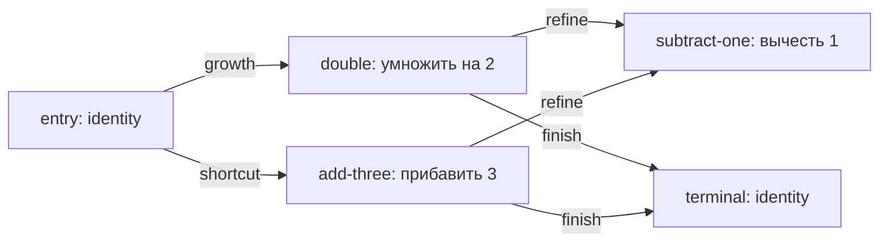

# Агентное чтение сетевой среды

Этот Swift-прототип проверяет [модельную среду](../../Глоссарий/модельная-среда.md), в которой несколько агентов-интерпретаторов читают одну неизменяемую карту арифметических вычислителей. Карта задаёт доступные узлы и переходы, а наследуемые настройки агента определяют, какие сигналы переходов он предпочитает. Runtime может породить ограниченное число потомков, изменить один параметр интерпретации и выбрать полезный результат, не обучая и не переписывая базовую сеть.

Встроенная задача применяет одну и ту же карту к двум примерам: `2 -> 3` и `4 -> 7`. Точный путь имеет вид `entry -> double -> subtract-one`, то есть реализует `2x - 1`. Исходные агенты выбирают маршруты `x + 3`, `2x` или останавливаются после входа; единственный потомок наследует профиль агента `2x` и меняет вес сигнала `refine` с `0` на `20`.

## Неизменяемая карта и движение



Каждый шаг трассы фиксирует идентификатор агента через родительскую оценку, пример, номер и узел шага, вход, выход, выбранный сигнал и целевой узел. Остановка различает терминальный узел и исчерпание лимита шагов. Арифметика отклоняет переполнение, а карта при создании отклоняет дубликаты узлов и висячие рёбра.

Карта канонически упорядочивается и получает SHA-256. В [сохранённом runtime-отчёте](Фикстуры/runtime-отбор.json) хэш до и после отбора совпадает:

```text
sha256:fe295dc4b79b02174b7a41bdd052adcfe8308b31825c811c2c970216ab7f6a89
```

Лимит записей карты равен нулю, фактическое число записей также равно нулю. Value-модель не предоставляет runtime ни одного метода изменения узлов или рёбер.

## Наследование, мутация и бюджет

Профиль агента содержит веса сигналов `growth`, `shortcut`, `refine`, `finish` и лимит шагов. Потомок хранит `parent_id`, поколение и полный список накопленных мутаций. В фикстуре создан только `agent.scaling.refined`: он наследует лимит и все четыре веса `agent.scaling`, после чего одна явная мутация `refine += 20` меняет его второй переход.

| Ограничение               | Лимит | Использовано |
| ------------------------- | ----: | -----------: |
| Оценённые агенты          |     4 |            4 |
| Рождения                  |     1 |            1 |
| Поколения после корневого |     1 |            1 |
| Посещения узлов           |    20 |           20 |
| Шаги трассы               |    20 |           20 |
| Записи базовой карты      |     0 |            0 |

Перед оценкой runtime резервирует верхнюю границу посещений агента. Если лимит агентов, рождений, посещений или трассы не позволяет новый запуск, агент получает наблюдаемый `skipped_agent_id` и не исполняется. Отдельный тест добавляет вторую мутацию и подтверждает, что она не обходит бюджет популяции.

## Критерии полезности и runtime-отбор

Для каждого агента считаются суммарная абсолютная ошибка, число точных примеров, прохождение качественного порога, посещения узлов, награда за задачу, ресурсная цена, цена мутаций и экономическая полезность:

```text
task_reward = 100 - 10 * total_error
resource_cost = 20 * node_visits
economic_utility = task_reward - resource_cost - 5 * mutation_count
```

Формула является намеренно неблагоприятной проверкой защиты от захвата ресурса. Короткий `agent.resource-saver` получает наибольшую сырую `economic_utility = 20`, но не решает ни одного примера точно. Точный мутировавший агент имеет `economic_utility = -25`, однако проходит качественный порог и поэтому выбирается раньше ресурсной оптимизации.

Отбор использует неизменяемый лексикографический порядок:

1. прохождение `quality_gate` по всем примерам;
2. меньшая `total_error`;
3. большая `economic_utility` только внутри одинакового качества;
4. меньшее число посещений;
5. стабильный `agent_id`.

| Агент                   | Путь                       | Ошибка | Посещения | Экономическая полезность | Качественный порог | Итог     |
| ----------------------- | -------------------------- | -----: | --------: | -----------------------: | ------------------ | -------- |
| `agent.additive`        | `x + 3`                    |      2 |         6 |                      -40 | нет                | отклонён |
| `agent.resource-saver`  | остановка после `identity` |      4 |         2 |                       20 | нет                | отклонён |
| `agent.scaling`         | `2x`                       |      2 |         6 |                      -40 | нет                | отклонён |
| `agent.scaling.refined` | `2x - 1`                   |      0 |         6 |                      -25 | да                 | выбран   |

Так runtime-отбор не вознаграждает агента за экономию внутреннего бюджета ценой невыполненной задачи. При отсутствии точного агента селектор всё равно сначала минимизирует ошибку и лишь затем сравнивает экономическую полезность.

## Безопасная фикстура

Без аргументов точка входа выполняет встроенный детерминированный сценарий, проверяет ожидаемого победителя, бюджеты и неизменность карты, затем печатает один JSON-отчёт версии `1`:

```bash
./Прототипы/агентное-чтение-сетевой-среды/запустить.sh
```

Явный повтор и справка:

```bash
./Прототипы/агентное-чтение-сетевой-среды/запустить.sh fixture
./Прототипы/агентное-чтение-сетевой-среды/запустить.sh --help
```

Пробник не читает пользовательские файлы, не принимает исполняемый код, не обращается к сети, не запускает subprocess помимо штатной SwiftPM-точки входа и не сохраняет runtime-состояние. Все карта, профили, примеры, мутация, политика и бюджеты встроены в пакет.

## Проверки

```bash
swift test --package-path Прототипы/агентное-чтение-сетевой-среды
swift build \
  --package-path Прототипы/агентное-чтение-сетевой-среды \
  --product FUMNetworkEnvironmentProbe
swift format lint \
  --configuration Инструменты/fum-kompleksnaya-proverka-repozitoriya/swift-format.json \
  --strict \
  --recursive \
  Прототипы/агентное-чтение-сетевой-среды/Package.swift \
  Прототипы/агентное-чтение-сетевой-среды/Sources \
  Прототипы/агентное-чтение-сетевой-среды/Tests
```

Автономный набор проверяет трассу точного маршрута, наследование одной мутации, качественный барьер перед ресурсной полезностью, все лимиты популяции и трассы, отказ лишнему рождению, неизменность и SHA-256 карты, повторяемость отчёта, висячее ребро и арифметическое переполнение.

## Структура

- `Sources/FUMNetworkEnvironment/` — неизменяемая карта, агенты, наследование, трассы, экономика, бюджеты и селектор;
- `Sources/FUMNetworkEnvironmentProbe/` — безопасная встроенная фикстура и JSON-отчёт;
- `Tests/FUMNetworkEnvironmentTests/` — автономная приёмка без сети, секретов и внешних зависимостей;
- `Фикстуры/runtime-отбор.json` — сохранённый человекочитаемый снимок успешного отчёта;
- `Package.swift` — самостоятельный SwiftPM-пакет;
- `запустить.sh` — общая POSIX-точка входа прототипа.

## Граница применимости

Результат доказывает только воспроизводимую механику движения, наследования одного параметра, ограниченного рождения и детерминированного отбора на малой целочисленной карте. Это не обучение нейросети или LLM, не нейропластичность основной модели, не автоматический поиск хороших мутаций, не конкурентное исполнение популяции, не статистическая проверка обобщаемости и не доказательство корректности выбранных коэффициентов полезности.

Цели известны внешнему runtime, карта и мутационный план заданы вручную, а четыре агента исполняются последовательно. Совпадение SHA-256 показывает неизменность сериализованной карты в этой value-реализации, но не доказывает защиту разделяемой памяти в многопоточном или распределённом runtime. Сохранённый отчёт является фикстурой конкретной версии контракта, а не универсальным форматом трассы всех [агентских циклов](../../Глоссарий/агентский-цикл.md) FUM.

Статус: действующий проверочный прототип. Пакет собирается, автономные тесты и строгий форматный lint проходят, безопасная фикстура воспроизводимо выбирает точного мутировавшего потомка и сохраняет базовую карту.

## Источники требований

- [исходный запрос текущей рабочей сессии](../../Журнал/2026-07-24_02-06-29_MSK_проверить-прототип-агентного-чтения-сетевой-среды/запрос.md)
- [завершённая карточка FUM-STEP-0002](../../Планирование/карточки-шагов/✅-FUM-STEP-0002-проверить-прототип-агентного-чтения-сетевой-среды.md)
- [исходный запрос о нейросети как среде агентов](../../Журнал/2026-07-06_10-24-52_MSK_описать-нейросеть-как-среду-агентов/запрос.md)
- [исходный запрос с ограниченной внутренней популяцией](../../Журнал/2026-07-06_10-51-33_MSK_интегрировать-диалог-chatgpt-pro/запрос.md)

## Опорные материалы

- [Потоковая самоструктуризация FUM](../../Документация/32-потоковая-самоструктуризация-FUM.md)
- [Эволюция и мышление](../../Документация/03-эволюция-и-мышление.md)
- [Обзор актуальных реализаций агентских циклов](../../Документация/06-обзор-агентских-циклов.md)
- [Среда для внутренних FUM](../../Документация/11-среда-для-внутренних-FUM.md)

<!-- FUM-MD-RECENCY:BEGIN -->
<!-- last-content-edit: 2026-08-03 14:54:04 MSK -->
<!-- content-sha256: sha256:19a9c51e58b181e63b8168e718368c4a40c0c4168d30c32b66ac95e87e81f6c6 -->
<!-- FUM-MD-RECENCY:END -->
